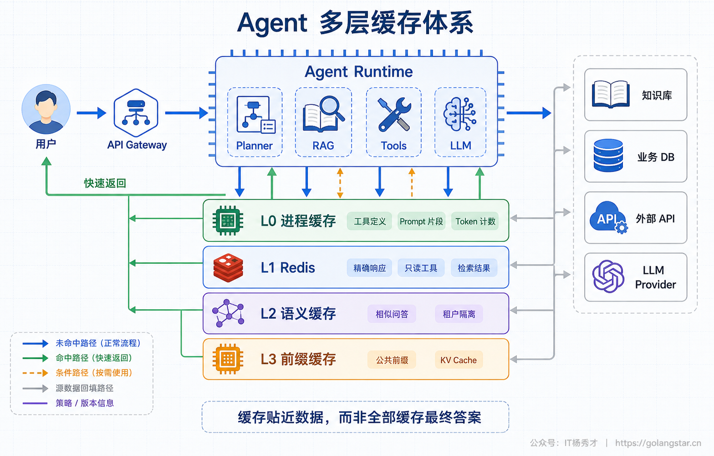
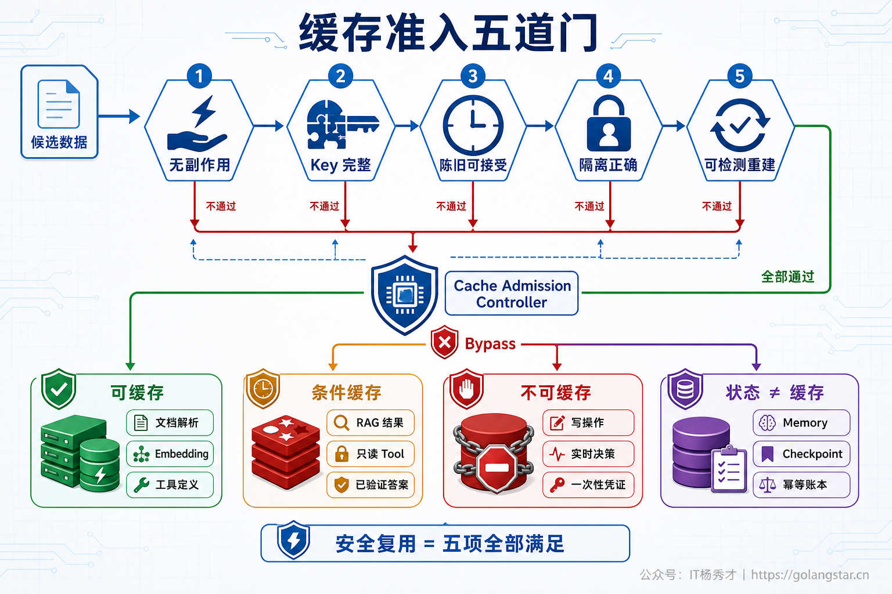
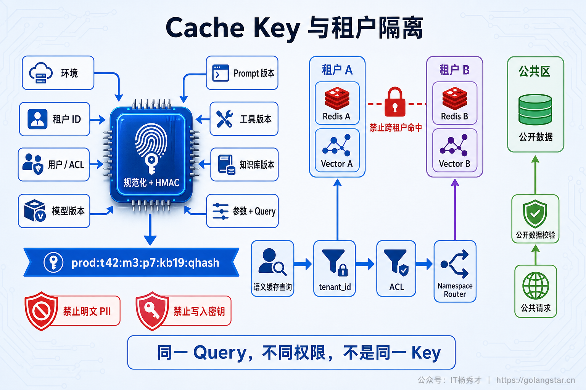
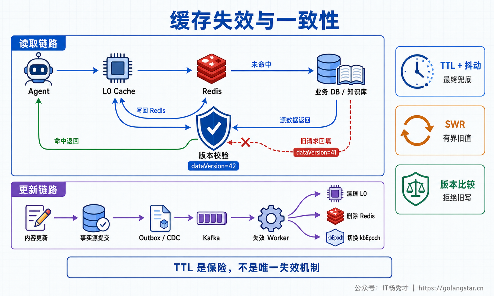
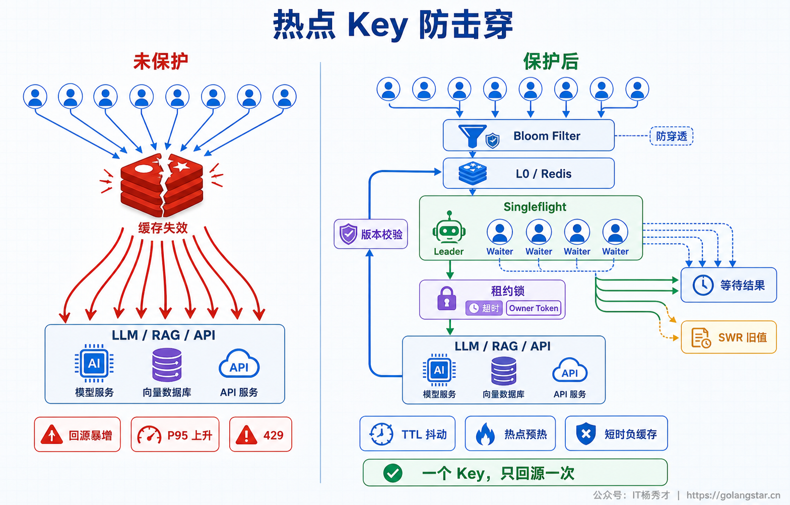
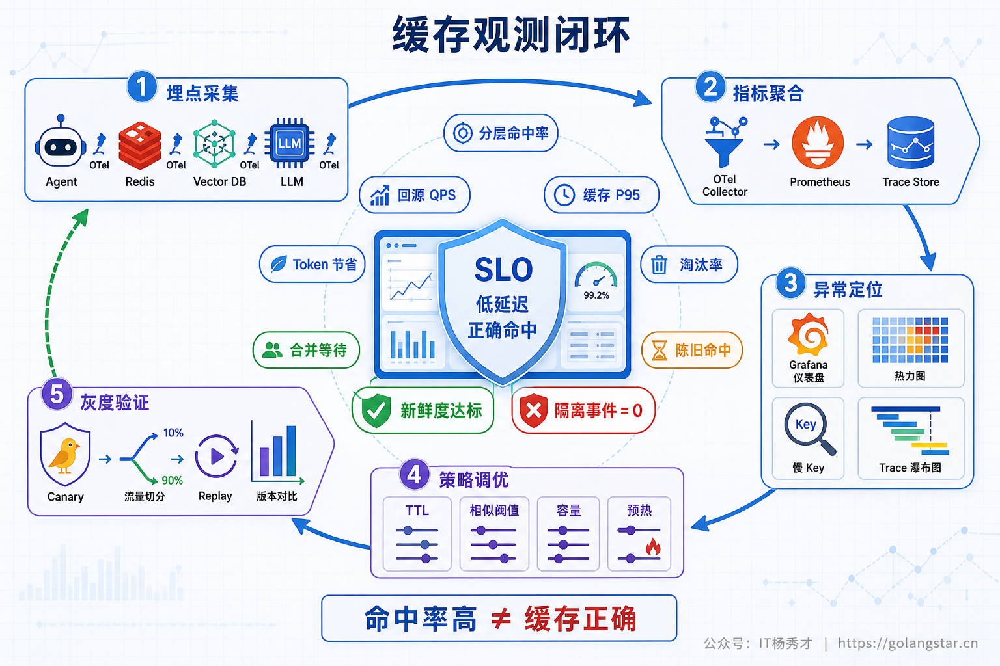

## **1. 题目分析**

Agent 的缓存事故往往比缓存未命中更难处理。一次未命中只会多花几秒和一些 Token；一次错误命中却可能把旧知识当成新事实、把 A 租户的答案返回给 B 租户，甚至跳过本应真正执行的工具。原因在于，一次 Agent Run 并不是简单的“问题进、答案出”，中间还包含 Planner、RAG、权限过滤、外部 Tool、多轮模型调用、Memory 和 Checkpoint。每一层都能复用计算，但每一层判断“两个请求是否等价”的条件都不同。

因此，生产缓存体系的起点不是 Redis 选型，而是一份**复用契约**：哪些输入决定结果，复用范围属于哪个租户和权限域，允许旧多久，依赖变化后如何失效，错误命中能否发现，缓存丢失后能否从事实源重建。只有这些条件都能说清楚，一份数据才有资格进入缓存。

### **1.1 先把缓存、状态和推理复用分开**

生产环境至少存在三类容易混淆的机制。

第一类是**应用结果缓存**，例如 Query Embedding、检索结果、只读 Tool 返回、Rerank 分数和已验证的最终答案。命中后会跳过本次部分执行路径，收益最大，正确性风险也最高。

第二类是**业务状态与记忆**，包括会话消息、长期 Memory、Agent Checkpoint、任务进度和幂等记录。它们即使存放在 Redis，也不能按普通缓存对待。缓存的定义是“丢失后可以重算”；而 Checkpoint 丢失会导致流程无法恢复，幂等记录丢失可能让转账或发消息重复执行。这类数据需要持久化、备份和明确的保留策略，Redis 最多只是它们的热数据投影。

第三类是**推理侧计算复用**，例如 Provider Prompt Cache 和自部署推理引擎的 Prefix/KV Cache。它们复用的是相同前缀的 Prefill 计算，后续输出仍会重新 Decode，并不等于“缓存了一份答案”。这类缓存通常由模型服务管理，应用侧主要负责稳定前缀、版本隔离、数据合规和命中观测。



### **1.2 缓存准入要过五道门**

候选数据进入缓存前，可以连续检查五个问题。

第一，计算是否无副作用。查询、Embedding、文档解析可以重复执行；下单、转账、发邮件、写库不能因为历史上执行过相似请求就直接返回“成功”。第二，所有影响结果的输入是否都能进入 Key。只用用户最后一句话做 Key，会漏掉模型版本、Prompt、Tool Schema、知识库、权限和会话状态。第三，业务是否接受一段时间的陈旧。产品说明可以容忍分钟级旧值，余额、库存、报价和授权决策通常要求更强的一致性。

第四，租户、用户、ACL、地域和合规边界能否硬隔离。语义相似只能决定“内容像不像”，不能证明“调用方有没有权读取”。第五，错误命中或缓存丢失后能否检测、回源和重算。若某项无法满足，默认应走 Bypass，而不是用一个随意设置的短 TTL 掩盖问题。

这五道门可以概括为：

```text
SafeReuse = 无副作用 × Key完整 × 陈旧可接受 × 隔离正确 × 可检测重建
```

其中任何一项为零，整体就不安全。



### **1.3 不同数据要采用不同缓存策略**

**优先缓存的是确定性计算。** 稳定的 Prompt 片段、Tool Schema、模型能力元数据和 Token 计数适合放进进程内缓存；文档解析、Chunk、Embedding 适合按内容哈希缓存，但 Key 必须包含解析器、切分规则、Embedding 模型和预处理版本。内容未变化时，这些计算可以安全复用；任一算法升级后，版本变化会让旧条目自然失效。

**RAG 中间结果属于条件缓存。** Query Embedding 通常可以精确复用；检索结果还依赖租户、ACL、过滤条件、`top_k`、索引版本和数据时间范围；Rerank 结果则必须再包含候选集合哈希与 Reranker 版本。知识库频繁更新时应使用短 TTL 或语料版本号，不能把一次 Top-K 结果长期固定下来。命中后仍要确认引用文档存在、调用方权限未变化。

**Tool 结果按业务语义判断。** 汇率、天气、产品目录等只读接口可以根据上游 `Cache-Control`、ETag 或业务 SLA 设置 TTL；余额、库存、报价可以短暂缓存用于页面展示，却不应直接作为扣款、下单等强一致决策的依据。不存在的数据可以做短时负缓存，429、超时、连接失败等瞬时故障则不能当成正常结果长期复用。

**Planner 与 LLM 答案风险更高。** Planner 结果只有在目标、上下文、工具集合和策略版本完全一致时才适合精确缓存。有副作用的执行计划即使命中，也必须重新校验当前状态。最终答案缓存适合公开 FAQ、稳定知识问答和经过验证的固定输出；创造性写作、强个性化对话、带实时事实的问题不适合共享。语义缓存只能先在 tenant、locale、权限、知识版本和安全策略等硬边界内检索，再判断相似度，并优先保证命中精度而不是命中率。否定词、数字和时间变化很小，却可能让答案完全相反。

**未完成结果不能晋升。** 流式输出只缓存完成、通过 Schema 校验和安全检查的最终结果，不能缓存半段响应、Raw CoT、未验证的 Scratchpad 或模型异常。API Key、OAuth Token、OTP、重置链接等凭据也不应进入通用 Agent 缓存。会话历史、Memory、Checkpoint、任务状态和幂等账本则属于事实或状态，必须走持久化语义，不能被 LRU 随意淘汰。

### **1.4 Cache Key 是结果等价性的证明**

TTL 只能限制旧数据存活多久，无法修复一个缺字段的 Key。生产 Key 应按缓存层选择所有会影响该层输出的依赖，常见结构如下：

```text
cache:v3:{env}:{tenant}:{aclHash}:{node}:{modelVer}:{promptVer}:
{toolVer}:{kbEpoch}:{policyVer}:{paramsHash}:{inputHmac}
```

输入 JSON 需要先做稳定序列化，避免字段顺序不同造成无效 Miss；低熵敏感输入不宜直接写进 Key，也不能只做裸哈希，通常使用服务端密钥计算 HMAC。缓存 Value 还要保存 `created_at`、软/硬过期时间、依赖版本、来源引用、审核状态和写入者可信级别，便于命中时二次校验与审计。

多租户系统应使用独立 Namespace 或逻辑分区。语义缓存必须先做 `tenant_id`、ACL、地域和知识版本的结构化过滤，再执行向量近邻搜索，不能先从全局找到一条相似答案，再在应用层补权限判断。只有明确验证为公开的数据才允许进入公共区。



### **1.5 失效依靠版本和事件，TTL 只负责兜底**

只依赖 TTL 的系统必然存在一段不可控的错误窗口。更稳妥的做法是组合三种机制：数据写入事实源成功后，通过 Outbox、CDC 或领域事件通知各层缓存失效；Prompt、模型、知识库、ACL 和安全策略变化时提升对应版本号，让旧 Key 立即不可达；TTL 加随机抖动负责清理旧条目，并在失效事件丢失时限制最坏陈旧时间。

知识库全量更新时，逐个扫描删除成本很高，可以直接从 `kbEpoch=41` 切到 `kbEpoch=42`，旧版本等待 TTL 或后台任务回收。进程内 L0 缓存同样要订阅失效事件；若失效通道断开，应主动清空本地缓存，而不是继续持有无法确认的新鲜数据。

还要防止“删除后旧值回填”。一个慢请求在版本 41 读取数据，期间版本已经切到 42，慢请求结束后不能把旧结果重新写进新缓存。写回时需要携带读取到的 `dataVersion`，通过 CAS、版本比较或 Fencing Token 拒绝迟到写入。`stale-while-revalidate` 只适合允许有界陈旧的低风险读路径，权限、余额和支付状态不能为了可用性随意返回旧值。



### **1.6 热点 Miss 需要合并回源**

热点 Key 到期时，如果一百个 Agent 同时发现 Miss，又同时调用 LLM、RAG 或外部 API，缓存反而会放大下游压力。单实例可以使用 per-key Singleflight，跨实例可以使用带超时和唯一 Owner Token 的短租约：只有 Leader 回源并重建，Followers 等待同一结果，或在业务允许时读取 Soft TTL 内的旧值。

锁的生命周期必须短于请求 Deadline，释放时要比较 Owner Token，避免旧 Leader 删除新 Leader 的锁；写入前还要再次检查版本，防止迟到结果覆盖新值。Leader 失败后不能把超时广播成一个长 TTL 的负结果，Followers 应按各自剩余时间决定重试、降级或失败。

TTL 抖动可以避免大量 Key 同时失效，热点数据可以提前刷新，确定性“不存在”可以短时负缓存。缓存服务故障时，系统也不能让全部请求无保护地穿透事实源，应配合有界并发、熔断和降级。缓存是性能层，不应成为新的单点故障。



### **1.7 监控重点是正确命中而不只是命中率**

总 Hit Rate 很高，不代表缓存体系健康。指标至少要按缓存层、租户、模型和数据类型拆分，记录 hit、miss、bypass、stale-hit、refresh-fail、回源 QPS、缓存 P95、Singleflight 合并数、锁等待、淘汰率、条目年龄与失效延迟。Prompt Cache 还要观察缓存读取和写入 Token、TTFT 与净成本；语义缓存则必须跟踪 False Hit、命中答案与无缓存答案的质量差值、引用有效率和撤权后的旧值命中数。

上线语义缓存时，先用脱敏生产流量离线 Replay 校准阈值，再做 Shadow Hit，只记录本来会命中的答案而不真正返回。通过否定、数字、时间、代词、ACL 变化和跨租户样本后，再按意图或租户 Canary 放量。线上可以抽样对命中请求重新执行原链路，持续估计“正确命中率”。

故障演练还要覆盖 Redis 不可用、失效消息丢失、锁持有者崩溃、热点同时过期、模型或 Prompt 升级，以及用户删除数据后的全层清理。每一层都需要 Feature Flag 和 Namespace Version，出现错误命中时能够立即 Bypass，而不是等待 TTL 慢慢过期。缓存的最终目标不是把 Hit Rate 做到最高，而是在正确性、延迟、成本与新鲜度之间形成可验证的边界。



***

## **2. 参考回答**

生产环境里我不会把 Agent 缓存理解成一层 Redis，而会先区分结果缓存、计算缓存和业务状态。结果缓存会改变本次执行路径，因此要检查是否无副作用、Key 是否覆盖全部依赖、允许旧多久、租户与 ACL 能否隔离，以及缓存能否回源重建。Embedding、文档解析和稳定 Prompt 前缀优先缓存；RAG、Rerank、只读 Tool 和已验证答案只做条件缓存；下单、转账、发消息不能缓存执行结果，只能依靠幂等账本。Memory、Checkpoint 和任务状态属于事实状态，也不能按 LRU 淘汰。

架构上会做 Run 内 Memo、进程 L1、Redis 精确缓存、受控语义缓存和模型侧 Prefix/KV Cache。Key 按层带 tenant、ACL、模型、Prompt、Tool、知识库与策略版本，语义匹配前先做权限过滤。失效采用 CDC、版本化 Key 与 TTL 抖动，热点 Miss 用 Singleflight、短租约和 SWR 防击穿。上线后监控误命中、陈旧命中、失效延迟、跨租户阻断、Token 节省和质量差值，再通过 Shadow、Replay、Canary 与故障演练逐步放量。

<div style="background-color: #f0f9eb; padding: 10px 15px; border-radius: 4px; border-left: 5px solid #67c23a; margin: 20px 0; color:rgb(64, 147, 255);">

## <span style="color: #006400;">**学习交流**</span>
<span style="color:rgb(4, 4, 4);">
> 如果您觉得文章有帮助，可以关注下秀才的<strong style="color: red;">公众号：IT杨秀才</strong>，后续更多优质的文章都会在公众号第一时间发布，不一定会及时同步到网站。点个关注👇，优质内容不错过
</span>


<div style="text-align: center; margin-top: 22px; padding-top: 20px; border-top: 1px solid #c2e7b0;">
<div style="color: #006400; font-size: 20px; font-weight: bold;">🔥 配套实战项目，拆得开、跑得起、能写进简历</div>
<div style="color: red; font-size: 16px; font-weight: bold; margin-top: 8px;">多 Agent 编排 + RAG 混合检索 · 31 篇深度教程 + 50+ 面试题</div>
<a href="/projects/dev-support.html" style="display: inline-block; margin-top: 14px; background: #ff7a18; color: #fff; font-size: 18px; font-weight: bold; padding: 10px 28px; border-radius: 24px; text-decoration: none;">点击查看 DevSupport AI 实战项目 →</a>
</div>
</div>
