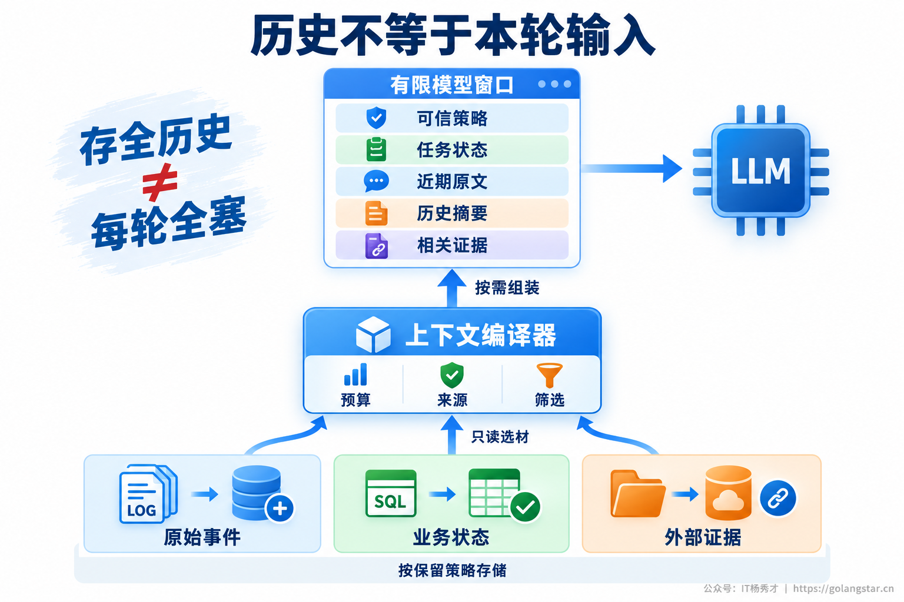
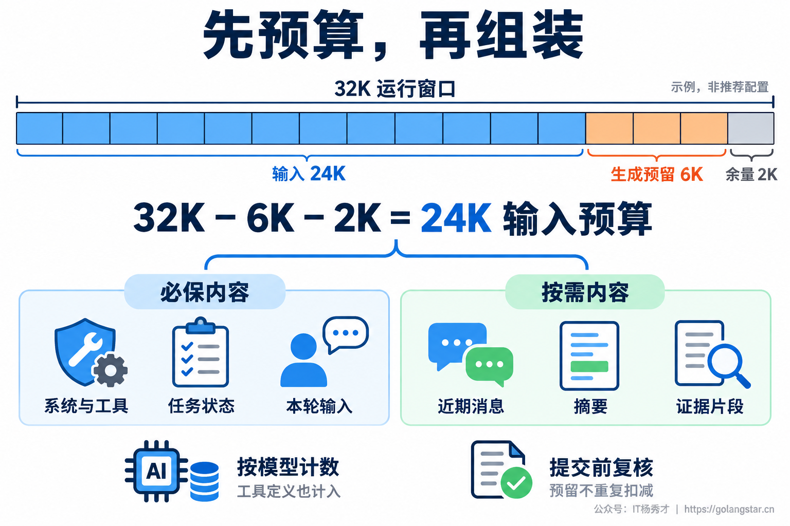
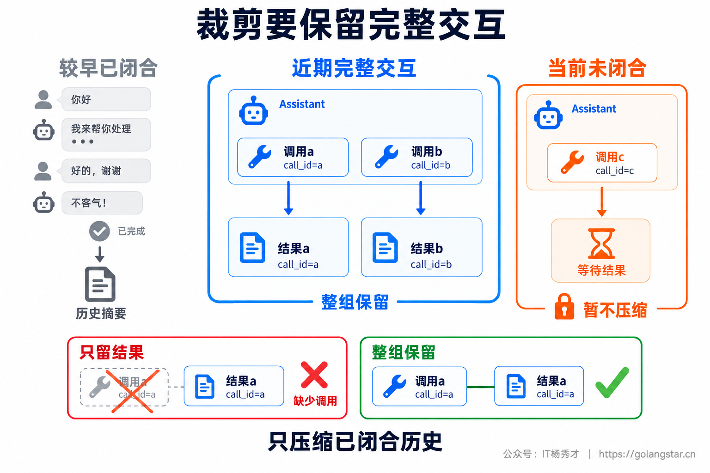
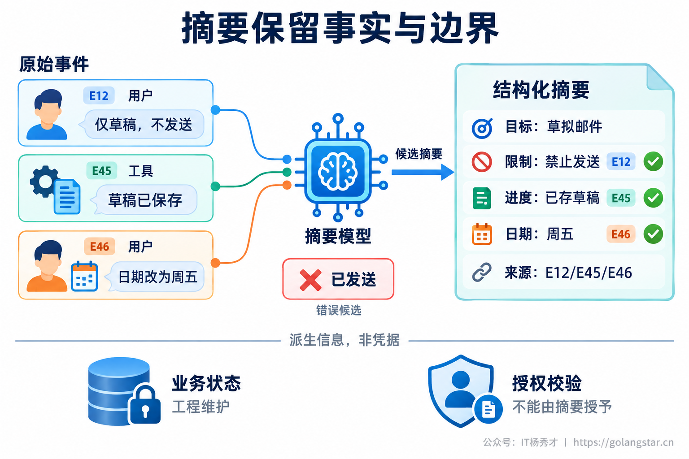
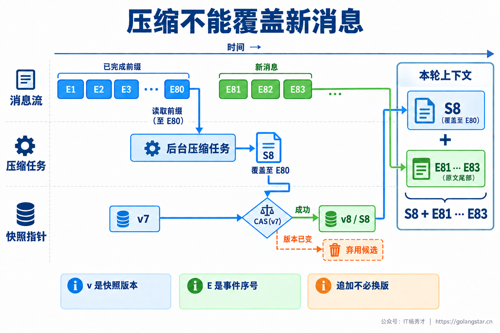
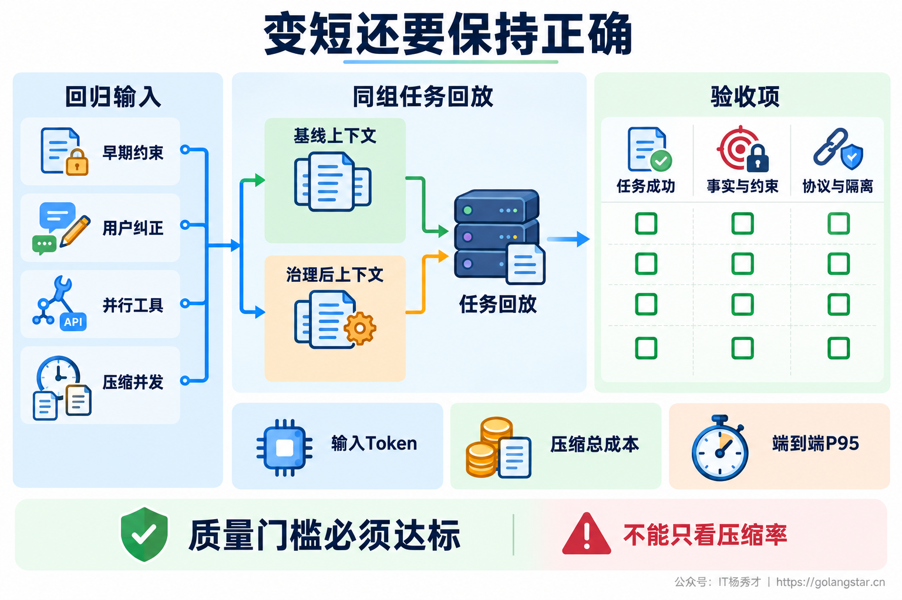

## **1. 题目分析**

用户第一轮要求只生成邮件草稿，不要发送。二十轮之后，Agent 已经查过资料、改过日期、调整过措辞，上下文里堆满网页正文和工具返回的 JSON。用户最后说把称呼改一下，Agent 却直接调用了发送工具。

这个问题有两种相反的成因：历史全保留，早期约束被大量噪声淹没；历史被粗暴裁剪，或者摘要把“仅保存草稿”变成“完成邮件”，关键边界直接消失。上下文变长和上下文变短，都可能导致同一个错误。

所以，治理目标不是把对话压得越短越好，而是**让每一轮模型调用拿到足够完成当前决策的信息，同时保证任务状态、关键约束和工具协议不被破坏。** 涉及发送等副作用时，执行层仍需独立鉴权，不能把安全完全寄托在模型记住历史上。

### **1.1 分开历史存储和本轮输入**

首先需要统计上下文长在哪里。按系统指令、工具定义、用户消息、助手回复、工具结果和检索证据分别记录 Token 数，观察每轮新增量与重复注入量。一条完整网页可能比几十轮聊天更长，只看消息数量会错过真正的膨胀来源。

如果每轮新增内容大致相同，同时每次都重放全部历史，单次输入随轮数增长，整段会话累计重放量还会更快增长。换成长窗口模型只能推迟触顶，不能消除重复材料和陈旧信息。[Lost in the Middle 原始研究](https://arxiv.org/abs/2307.03172)也表明，在其测试的问答和检索任务中，相关信息的位置会影响效果；但不能据此断言所有当前模型都有同样的衰减曲线。

工程上应把数据分成三类。原始事件保存用户原话、工具记录和来源，用于回查；业务状态保存步骤进度、已提交操作和审批事实，由工作流或业务事务维护；本轮上下文则是从这些材料中选出来的工作视图。



在模型调用前增加上下文编译器，负责读取状态、选取历史、加载证据、执行预算和协议检查。裁掉的是本轮输入中的冗余副本，不等于删除原始记录。原始记录也不是无限保存，而是遵守既定的保留、脱敏和删除策略。这种把持久化材料按需装入上下文的思路，可以参考 [Anthropic 的上下文工程实践](https://www.anthropic.com/engineering/effective-context-engineering-for-ai-agents)。

### **1.2 每轮调用先分配预算**

预算应区分模型允许的硬容量和应用选择的运行预算。模型允许很长的输入，不代表当前任务值得使用全部容量；应用还要考虑时延、费用和信息利用效果。

对于输入与生成共享窗口的接口，可以按下面的方式规划：

```text
输入预算 = 应用运行窗口 − 本轮生成预留 − 安全余量

系统策略 + 工具定义 + 当前请求 + 任务状态
         + 近期原文 + 历史摘要 + 检索及工具证据 ≤ 输入预算
```

应用窗口必须在模型支持范围内；接口另有输入、输出或请求字节限制时，也要分别满足。例如运行窗口取 32K，生成预留 6K，余量 2K，则输入最多安排 24K。这只是计算示例，不是通用推荐参数，生成预留也不代表每次都要输出这么多。



计数覆盖工具 Schema、消息包装、图片和文档等输入，而不只是可见聊天文本。使用目标模型对应的计数能力，并以实际 Usage 校准估计误差；部分服务端工具或附件形式未必支持请求前精确计数，必须保留余量。[Claude Token 计数文档](https://platform.claude.com/docs/en/build-with-claude/token-counting)也说明了估算和支持范围的边界。

Reasoning 或 Thinking 如何计入，要跟随所用模型和 API 的规则。如果已经包含在生成上限中，就不能再重复扣一次。历史推理块是否保留、签名块是否需要原样回传，也不能用一条统一规则处理。[Claude 上下文说明](https://platform.claude.com/docs/en/build-with-claude/context-windows)展示了这类差异。

预算内部再划分必保内容与按需内容。可信策略、当前请求、关键任务状态和未完成动作优先保证；历史摘要、近期窗口和检索证据分别设额度，避免某个工具返回占掉全部空间。最终提交前重新计数，重试、切换模型和新增工具定义后也要重新编译，不能继续沿用旧预算。

### **1.3 在进入上下文之前减少冗余**

低成本且不容易丢信息的治理，通常发生在数据入口。数据库工具只返回当前决策需要的字段，检索结果去掉网页导航、重复页脚和重叠段落，失败信息保留错误类型与必要定位字段，不把整段堆栈反复交给模型。

大结果可以外置，返回简短结论、关键证据片段以及可访问的结果引用。比如搜索工具返回命中文档、版本、相关段落和文档 ID，而不是把整份原文塞进去；后续问题确实需要细节时再读取。引用只是定位入口，不能代替当前决策所需的实际证据。

去重首先使用来源 ID、内容哈希和版本，而不是只看语义相似度。“允许发送”和“不允许发送”非常相似，却完全不能合并；用户刚修改的日期也不能被旧日期覆盖。去重应去掉重复副本，保留更正、否定、适用范围和版本关系。同一事项的明确修正应更新当前状态，旧值只留作追溯；不同会话或单次例外不能误当全局更新。

工具定义同样按当前任务与授权范围选择，但裁掉的是无关工具，不是服务端权限检查。稳定的策略和工具顺序可以兼顾前缀缓存；然而缓存只复用计算，缓存 Token 仍然属于逻辑上下文，既不会清除过期事实，也不会让窗口无限变大。服务端会话 ID 也不自动等于历史不占上下文。

### **1.4 按完整交互单元裁剪**

滑动窗口适合保留近期原话，但裁剪单位不能简单定义成消息数组中的一条记录。一次 Assistant 回复可能发起两个并行工具调用，后面分别接两个结果，这些消息之间存在协议关系。

如果只保留最后三条，可能留下结果却删掉调用；也可能保留调用，却丢掉其中一个结果。上下文即使没有超过 Token 上限，也会因为消息结构非法被接口拒绝。[LangChain 短期记忆文档](https://docs.langchain.com/oss/python/langchain/short-term-memory)明确提醒裁剪和删除后仍需满足模型的消息格式要求。



一种可落地的做法，是把用户请求、相关助手消息、工具调用及其结果归成完整交互单元，并保存调用 ID 对应关系。较早且已经闭合的单元可以被摘要替换，近期单元保留原文；仍有工具等待结果的当前单元暂不压缩，也不能为了补齐结构伪造成功结果。

如果单个单元就超过预算，应从工具输出投影、结果外置或任务拆分入手，而不是在 JSON 或签名块中间随意截断。超时和失败结果也要保留正确状态，避免压缩后把已经失败或已经执行的操作当成尚未尝试。

### **1.5 让摘要保留事实和边界**

自由文本摘要容易写得流畅，却不适合承载全部任务状态。开头的邮件例子中，“仅草稿，不发送”“草稿已保存”“日期改为周五”分别代表行为约束、执行结果和用户更正。如果被合成“邮件已完成”，下一步就失去了判断依据。

因此，摘要可以使用固定槽位，包含当前目标、仍有效的约束、已确认事实、已排除方案、未解决问题、证据引用与覆盖范围。日期、单位、标识符和否定条件要尽量明确保留；某个信息无法确认时标成未知，不能为了补全字段让模型猜测。



摘要只是派生信息。付款是否完成、邮件是否发送、审批是否有效，需要以业务系统的权威状态为准，不能由一句摘要直接决定。涉及授权的事实仍由工程层校验，摘要中出现“用户同意”不等于获得了可执行的授权凭据。

候选摘要生成后，先检查结构和来源范围，再对照用户原话与业务状态验证关键字段。数字、否定和用户更正可以采用确定性规则辅助核对。高风险字段无法可靠核对时，保留原始证据或进入人工复核；一般语义质量再通过抽样评估，不能只让另一个模型给一个笼统的高分就放行。

反复对摘要再做摘要，会累积遗漏和改写偏差。工程上可以按闭合阶段形成摘要段，记录来源事件范围与策略版本，并定期从仍可访问的原始事件和权威状态重建。保留事实槽位不代表把所有槽位永远带入模型，已经结束且与当前任务无关的内容仍应转入按需回查。

### **1.6 把压缩做成原子快照提交**

压缩不应等到请求已经超限才开始。设置低水位 L 和高水位 H，并满足 `L < H < 输入预算`；超过 H 启动整理，目标降到 L，给下一轮输入和工具返回留出空间，也避免每轮只超一点就再次压缩。水位根据任务分布评测，不能把固定百分比当作标准答案。

更隐蔽的问题发生在异步压缩期间：压缩器读取了 E1 到 E80，正在生成摘要时，用户又发来了 E81 到 E83。如果结束后直接用摘要覆盖整份会话，新消息就丢了。



可以将摘要快照版本与事件序号分开。压缩器读取快照版本 v7，固定待覆盖的闭合事件前缀到 E80，生成候选 S8，并记录 `covered_until=80`。校验通过后，用 CAS 或事务原子替换摘要内容、覆盖边界和快照版本；只有当前快照仍为 v7 才允许提交。

普通新消息追加到事件日志，不需要改动摘要快照版本。请求组装需固定同一份摘要快照及读取边界 R，保证 `covered_until ≤ R`，并完整读取 `(covered_until, R]`；发现版本或范围不匹配时重新读取，不能混用新摘要和旧尾部。图中 R 为 83，因此得到 S8 加 E81、E82、E83，不能重复带入已经由摘要覆盖的旧前缀。如果另一个压缩器先发布了新快照，本次候选就应弃用或重建，不能覆盖赢家。

若压缩依赖可变业务状态，还要关联状态版本并检查一致性；请求的事件、状态和摘要读取也应来自可解释的一致快照。这些都是应用侧的工程设计，不是调用一个摘要接口就自动获得的保障。

同一会话限制同时进行的压缩任务，摘要模型自身也有输入与输出预算。失败时只能回退到仍在预算内的旧上下文，或者使用经校验的旧摘要加安全裁剪；实在装不下就等待压缩、拆分任务或明确暂停。不能回退成把超长原文全发过去，更不能静默丢掉必须保留的约束。

### **1.7 历史细节按需恢复**

保留近期原文与摘要，解决的是常用信息随时可用；历史细节则通过查询补充。例如用户问上周第二版草稿里的原句，应该按会话、文档版本和时间定位原文，而不是让模型根据摘要重新编造一句。

检索可以组合精确 ID 查询、关键词和语义召回，再按相关性、时效与版本筛选，并执行来源去重和 Token 裁剪。仅设置 Top-K 不够，因为每个片段长度可能相差很大。召回材料进入上下文后仍需遵守当前预算，不能让检索把刚压缩的窗口再次填满。

读取时重新校验租户、用户、会话与资源权限。旧摘要引用的文件已经删除或用户被撤权时，不能凭历史引用继续返回内容；相关派生摘要和缓存也需要失效或重建。无可用证据时明确说明缺失，必要时让用户补充。

历史对话、工具返回与检索材料都有来源和可信度边界，不能因为经过摘要，就被提升成系统指令。外部材料里的命令性文本仍然是待处理数据，权限和高风险操作继续由执行层控制。子 Agent 也只接收当前子任务必要的上下文，返回结论、证据和状态，不把整段内部过程反复广播给所有成员。

### **1.8 用长会话验证治理收益**

回归测试必须覆盖信息离开近期窗口以后的场景。把早期禁止条件、用户中途纠正、相似但相反的指令、工具部分失败和跨话题追问放进长会话，再加入压缩期间新消息到达、并发压缩、模型切换与权限撤销。

对同一批任务分别回放基线与治理后上下文，检查任务完成率、关键事实保持率、约束遗漏率、引用一致性、工具协议错误率和历史回查成功率。涉及副作用的回放使用模拟工具或隔离环境，不能为了评测再次发送真实邮件或重复执行业务操作。



效率侧观察分组件输入 Token、上下文溢出率、压缩频率与失败率、CAS 冲突、端到端 P95，以及包含摘要、校验、回退和重新检索在内的总成本。对长会话分组观察，避免大量短对话掩盖后半程的质量退化。

压缩率只是过程指标。输入短了一半，但遗漏约束、重复追问和工具错误更多，就不能算优化成功。合格的治理，应在质量门槛不退化的前提下，让上下文大小维持在可控范围，并且能解释每条信息为什么被保留、压缩或移出。

***

## **2. 参考回答**

我会先区分原始历史、业务状态和本轮模型输入，不再每轮重放全部消息，而是在调用前用上下文编译器按需组装。先统计工具结果、检索证据和历史各占多少 Token，再按目标模型设置输入预算，预留生成空间和余量；先做字段投影、版本去重、大结果外置和工具筛选，再处理历史压缩。近期保留原文，但按完整交互单元裁剪，工具调用和结果要成对，未完成调用不能随便截断。

较早历史用结构化摘要保存目标、约束、事实、待办和来源，业务进度与授权仍由工程状态维护。压缩采用高低水位，固定覆盖区间，校验后用 CAS 发布快照，再合并未覆盖的新消息，避免异步摘要覆盖用户刚发的内容。压缩失败不能直接发送超长原文，必要时拆分或暂停；历史细节按需回查，并重新鉴权，摘要也不能把外部内容升级成系统指令。最后用长会话回放验证关键事实、约束和任务完成率，同时观察输入 Token、总成本和端到端 P95，不能只看压缩率。

<div style="background-color: #f0f9eb; padding: 10px 15px; border-radius: 4px; border-left: 5px solid #67c23a; margin: 20px 0; color:rgb(64, 147, 255);">

## <span style="color: #006400;">**学习交流**</span>
<span style="color:rgb(4, 4, 4);">
> 如果您觉得文章有帮助，可以关注下秀才的<strong style="color: red;">公众号：IT杨秀才</strong>，后续更多优质的文章都会在公众号第一时间发布，不一定会及时同步到网站。点个关注👇，优质内容不错过
</span>


<div style="text-align: center; margin-top: 22px; padding-top: 20px; border-top: 1px solid #c2e7b0;">
<div style="color: #006400; font-size: 20px; font-weight: bold;">🔥 配套实战项目，拆得开、跑得起、能写进简历</div>
<div style="color: red; font-size: 16px; font-weight: bold; margin-top: 8px;">多 Agent 编排 + RAG 混合检索 · 31 篇深度教程 + 50+ 面试题</div>
<a href="/projects/dev-support.html" style="display: inline-block; margin-top: 14px; background: #ff7a18; color: #fff; font-size: 18px; font-weight: bold; padding: 10px 28px; border-radius: 24px; text-decoration: none;">点击查看 DevSupport AI 实战项目 →</a>
</div>
</div>
