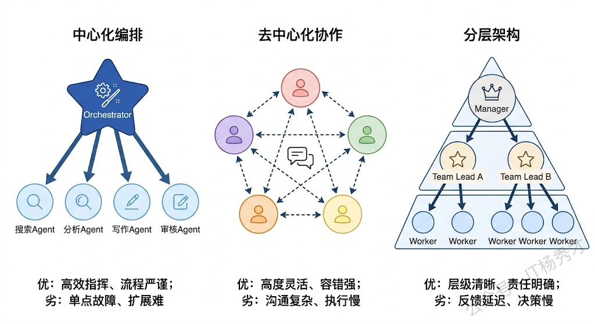
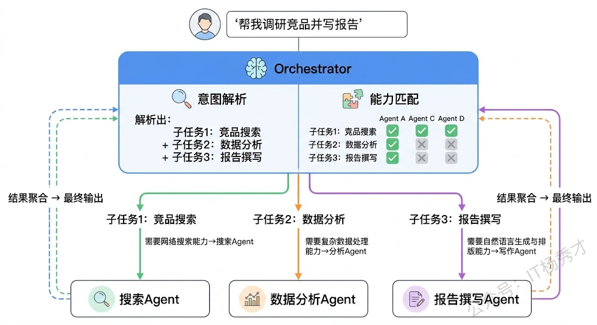
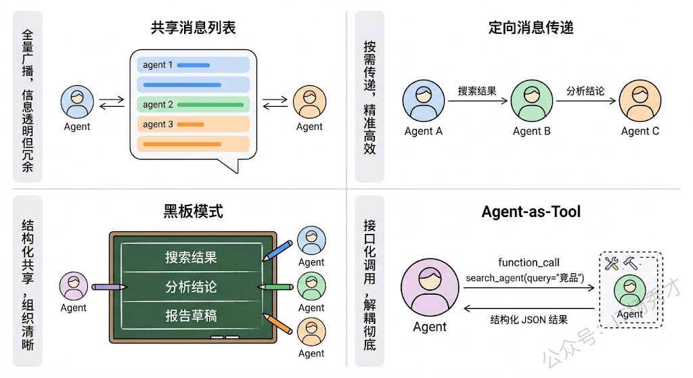
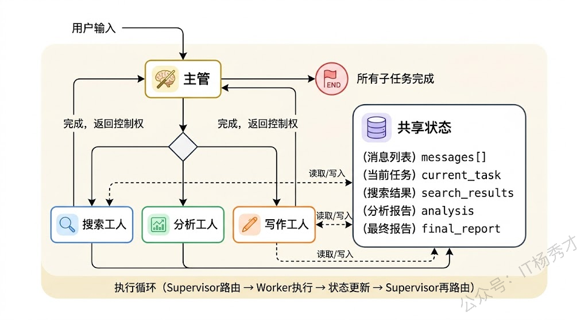
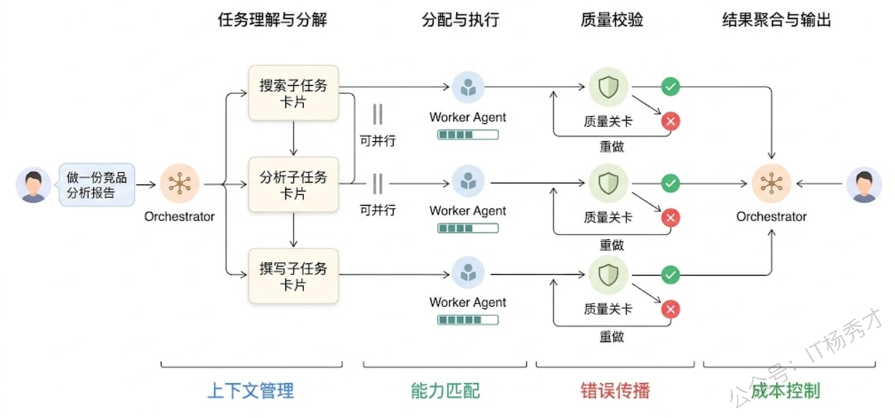
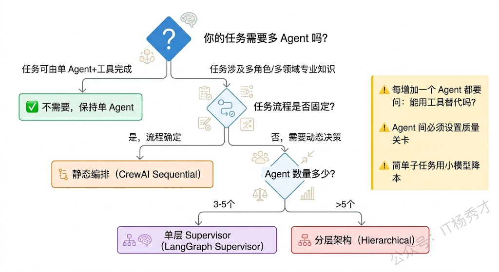

## **1. 题目分析**

一个 Agent 能做的事情终归有限。当你试图让单个 Agent 去完成一个真正复杂的任务——比如从零开始做一次完整的市场调研并输出 PPT 报告——你会发现它要么因为上下文窗口塞满而"失忆"，要么因为角色定位太泛而每一步都做得半吊子。这就像让一个人同时当产品经理、数据分析师、设计师和文案，不是不能做，而是每个环节都很难做到专业水准。

多 Agent 系统的核心思想就是从这里来的：**与其造一个无所不能的超级 Agent，不如让多个各有专长的 Agent 组成团队协作完成任务。** 这跟我们后台的微服务思想一脉相承——单体应用拆成多个服务，每个服务职责单一、独立演进、通过接口协作。

理解多 Agent 系统，需要把三个层面想清楚：架构模式决定了"谁来管谁"，任务分配决定了"谁干什么"，通信机制决定了"怎么说话"。下面逐一拆解。

### **1.1 多 Agent 系统的架构模式**

多 Agent 系统的架构本质上在回答一个管理学问题：多个执行单元之间应该是什么样的组织关系？实践中主要有三种模式，每种模式适合不同的任务特征。

**第一种是中心化编排模式（Orchestrator Pattern）。** 这是目前工业界最常用的架构。有一个"总指挥"Agent（通常叫 Orchestrator 或 Supervisor），它负责理解用户意图、将任务拆解成子任务、分配给对应的 Worker Agent 执行、收集结果并汇总输出。Worker Agent 之间一般不直接通信，所有信息流都经过 Orchestrator 中转。

> 这种架构的好处是控制流清晰、容易调试，出了问题你只需要看 Orchestrator 的决策日志就能定位是"分配错了"还是"某个 Worker 执行失败了"。但瓶颈也很明显——Orchestrator 本身就是一个 LLM，它的决策质量决定了整个系统的上限。如果 Orchestrator 理解错了用户意图，或者把子任务分配给了不合适的 Worker，后面做得再好也是白搭。另外当 Worker 数量多了之后，Orchestrator 的 prompt 里要塞下所有 Worker 的能力描述，上下文压力会很大。

**第二种是去中心化协作模式（Decentralized/Peer-to-Peer Pattern）。** 没有总指挥，每个 Agent 都是平等的。Agent 之间通过某种协议直接对话，轮流发言，各自根据对话上下文判断自己该不该做点什么。AutoGen 早期的 GroupChat 就是这种模式的典型——你把几个 Agent 丢进一个聊天室，它们自己讨论，最终收敛出一个结果。

> 这种模式的优势在于灵活，特别适合需要多角度碰撞的场景，比如代码审查（一个 Agent 写代码、一个 Agent Review、一个 Agent 写测试）。但它有一个严重的工程问题：**对话容易发散收不住。** 没有人拍板的会议最容易开成漫谈会，Agent 之间的对话也是一样。你经常会看到几个 Agent 来回客气了十几轮都没有实质进展，或者在某个细枝末节上争论不休。控制对话轮次、设置终止条件、防止死循环是这种架构的核心工程挑战。

**第三种是分层架构模式（Hierarchical Pattern）。** 这是前两种的折中和升级。顶层有一个高层 Manager Agent 做战略级的任务分解，它不直接分配给末端 Worker，而是分配给中层的 Team Lead Agent，每个 Team Lead 再负责管理自己团队内的几个 Worker。这就像一个公司的组织架构——CEO 管 VP，VP 管 Director，Director 管工程师。

> 分层架构的核心优势在于可扩展性。当系统需要接入几十个甚至上百个 Agent 时，单层的 Orchestrator 根本管不过来，但通过分层，每一层的管理幅度都可以控制在合理范围内。LangGraph 中的 Supervisor 嵌套、CrewAI 中的 hierarchical process 都支持这种模式。

### **1.2 任务分配**

架构决定了组织关系，但具体某个任务应该交给谁来做，这是另一个需要解决的问题。多 Agent 系统的任务分配策略大致可以分成三类。

**静态预定义分配**是最简单直接的方式。在系统设计阶段就固定好每个 Agent 的角色和职责边界，运行时 Orchestrator 根据预设规则来路由任务。比如在一个客服系统里，"退款问题"永远走退款 Agent，"技术故障"永远走技术 Agent。这种方式实现简单、行为可预测，适合业务流程固定的场景。CrewAI 的 sequential process 本质上就是静态分配——你在定义 Crew 的时候就把每个 Task 和 Agent 绑定好了，执行时按顺序走。

**动态路由分配**则是让 Orchestrator 自己判断。Orchestrator 拿到用户的请求后，基于对请求内容的理解和对各个 Worker 能力描述的匹配，动态决定分配给谁。这需要 Orchestrator 有比较强的意图识别能力，也需要每个 Worker Agent 的能力描述写得清晰准确——这和 Function Calling 中工具描述的重要性是一回事。LangGraph 中的 Supervisor Agent 通常就是这个角色，它通过 LLM 推理来做路由决策。

动态路由的难点在于模糊地带。有些请求可能同时匹配多个 Agent 的能力范围，比如"帮我分析这段代码的性能问题并给出优化建议"——这该交给代码分析 Agent 还是性能优化 Agent？实践中常见的做法是给 Agent 的能力描述加上更精确的边界说明，或者允许多个 Agent 协同处理同一个子任务。

**第三种是竞争/竞标机制。** 这种方式借鉴了经济学中的市场机制——Orchestrator 把任务像招标一样发出去，各个 Agent 根据自己的能力和当前负载"报价"，Orchestrator 选择最合适的中标者。这在大规模分布式系统中偶有应用，但在目前的 LLM 多 Agent 场景中还比较少见，主要因为"报价"这个环节本身就需要额外的 LLM 调用，增加了延迟和成本。

### **1.3 通信机制**

多 Agent 系统中，Agent 之间传递信息的方式直接影响协作效率和系统可靠性。不同框架在这个问题上做出了不同的设计选择。

**共享消息列表（Shared Message List）** 是最基础的方案。所有 Agent 共享一个全局的聊天记录，每个 Agent 发言时都能看到之前所有人的发言。AutoGen 的 GroupChat 就是这种模式。优点是实现简单、信息完全透明，缺点是当 Agent 数量多、对话轮次长的时候，每个 Agent 的输入 prompt 里要塞下所有历史消息，上下文窗口会很快撑满。

**定向消息传递（Directed Messaging）** 更精细。Agent 之间只传递和对方职责相关的信息，而不是把所有聊天记录都广播出去。比如搜索 Agent 执行完毕后，只把搜索结果传给分析 Agent，不需要让写作 Agent 看到原始搜索日志。LangGraph 中的 State Graph 本质上就是这种模式——每个节点（Agent）从共享的 State 中读取自己需要的字段，处理后把结果写回 State 的对应字段，不同 Agent 之间通过 State 的字段来传递信息，而不是通过原始的消息列表。

**黑板模式（Blackboard Pattern）** 是定向传递的进一步演化。有一个全局的"黑板"（可以理解为一个结构化的共享状态空间），每个 Agent 往黑板上写自己的产出，也从黑板上读自己需要的输入。黑板上的数据是结构化的（不是自由文本的聊天记录），比如有"搜索结果"字段、"分析结论"字段、"报告草稿"字段等。这种模式的好处是信息组织清晰、减少了冗余传递，坏处是需要预先定义好黑板的数据结构，灵活性受限。

还有一种在复杂系统中越来越常见的模式是**工具化调用（Agent-as-Tool）**。一个 Agent 不直接和另一个 Agent"对话"，而是把另一个 Agent 包装成一个工具来调用——就像调用 API 一样，传入参数、获取返回值。这种方式的好处是接口清晰、解耦彻底，每个 Agent 的输入输出格式是确定的，调试和测试都很方便。OpenAI 的 Swarm 框架和 LangGraph 中的 subgraph 调用都借鉴了这种思路。

### **1.4 实际框架中的实现**

理论讲完了，落到实际框架里是什么样的？

**LangGraph** 的多 Agent 实现最为灵活。它把 Agent 协作建模为一个状态图（State Graph）——每个 Agent 是图中的一个节点，边定义了控制流的走向（可以是条件分支），所有节点共享一个全局 State。Supervisor 模式下，有一个 Supervisor 节点负责路由决策，它根据当前 State 决定下一步该把控制权交给哪个 Worker 节点。Worker 处理完后把结果写回 State，控制权回到 Supervisor，如此循环直到任务完成。这种基于状态图的设计使得你可以精确控制 Agent 之间的协作流程，包括条件分支、并行执行、循环重试等复杂模式。

**AutoGen（微软）** 走的是对话驱动的路线。它的核心抽象是 ConversableAgent——每个 Agent 都是一个可以参与对话的实体。多 Agent 协作通过 GroupChat 实现，你定义好参与的 Agent 列表和发言选择策略（轮流、随机、或由一个 GroupChatManager 来选），Agent 们在聊天室里交替发言来推进任务。AutoGen 的新版本引入了更结构化的编排能力，但其核心哲学仍然是"通过对话来协作"。

**CrewAI** 则偏向高层抽象。你定义 Agent（角色+目标+背景故事）、Task（任务描述+期望输出）、然后组成一个 Crew。Crew 支持 sequential（任务按顺序流转）和 hierarchical（有一个 Manager Agent 做动态分配）两种执行模式。CrewAI 屏蔽了大量底层细节，上手很快，但灵活性不如 LangGraph。

### **1.5 工程落地思考**

多 Agent 系统在工程落地时会遇到一些单 Agent 不存在的特有问题，值得在面试中主动提及。

**错误传播与容错。** 多 Agent 是一个链式系统，上游 Agent 的错误输出会成为下游 Agent 的错误输入。比如搜索 Agent 返回了不相关的结果，分析 Agent 基于这些垃圾数据做出了错误的结论，写作 Agent 又把错误结论写进了报告——层层放大。工程上需要在 Agent 之间设置"质量关卡"：对每个 Agent 的输出做校验，不合格就打回重做或者触发兜底策略。

**成本控制。** 多 Agent 意味着多次 LLM 调用，再加上 Agent 之间的通信开销（传递上下文），总 token 消耗可能是单 Agent 的数倍。实践中通常会做分级处理——简单的子任务用小模型（如 GPT-4o-mini），复杂的子任务才上大模型；对于可以并行的子任务尽量并行执行以降低总延迟。

**Agent 数量的度。** Agent 不是越多越好。每增加一个 Agent，系统的协调开销就增加一分，出错的可能性也增加一分。经验上来说，一个多 Agent 系统中 3-5 个 Agent 是比较常见的规模，超过 7-8 个就需要认真考虑是否引入分层架构了。如果你发现某个 Agent 的职责其实可以用一个工具调用来替代，那就没必要单独做成 Agent。

***

## **2. 参考回答**

多 Agent 系统的核心思路是把一个复杂任务拆分给多个各有专长的 Agent 协作完成，而不是让一个 Agent 包揽所有事。要理解多 Agent 怎么工作，我通常从三个维度来讲：架构模式、任务分配和通信机制。

架构上主要有三种模式。最常用的是中心化编排，一个 Orchestrator Agent 负责理解任务、拆解子任务并分配给各 Worker Agent 执行，所有信息流都经过 Orchestrator 中转，好处是控制流清晰容易调试。第二种是去中心化协作，所有 Agent 平等地在一个 GroupChat 中讨论推进，适合需要多视角碰撞的场景比如代码审查，但对话容易发散需要严格控制终止条件。第三种是分层架构，顶层 Manager 分配给中层 Team Lead，Team Lead 再管理 Worker，适合 Agent 数量较多的大规模系统。

任务分配上，简单场景可以在设计时静态绑定——比如退款问题永远走退款 Agent；复杂场景需要 Orchestrator 基于意图识别做动态路由，这对 Agent 能力描述的精确度要求很高，和 Function Calling 中工具描述的重要性是一样的。

通信机制上，从简单到精细依次有共享消息列表、定向消息传递、黑板模式和 Agent-as-Tool。实际工程中我倾向于用 LangGraph 的 State Graph 方案，每个 Agent 通过读写共享 State 的特定字段来交换信息，既精准又解耦。

在工程落地时有几个关键点要注意：一是 Agent 之间必须设质量关卡防止错误传播，上游的垃圾输出会层层放大；二是成本控制，简单子任务用小模型、可并行的任务并行执行；三是 Agent 数量不是越多越好，能用工具调用替代的就不要单独做成 Agent，一般 3-5 个是比较合理的规模。

## **学习交流**

> 如果您觉得文章有帮助，可以关注下秀才的<strong style="color: red;">公众号：IT杨秀才</strong>，后续更多优质的文章都会在公众号第一时间发布，不一定会及时同步到网站。点个关注👇，优质内容不错过

