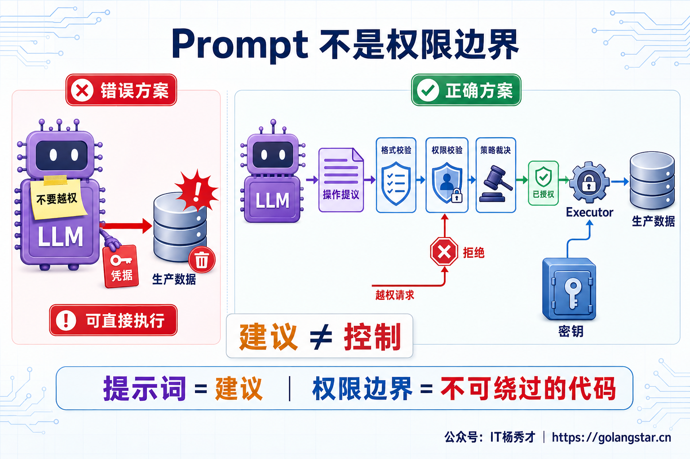
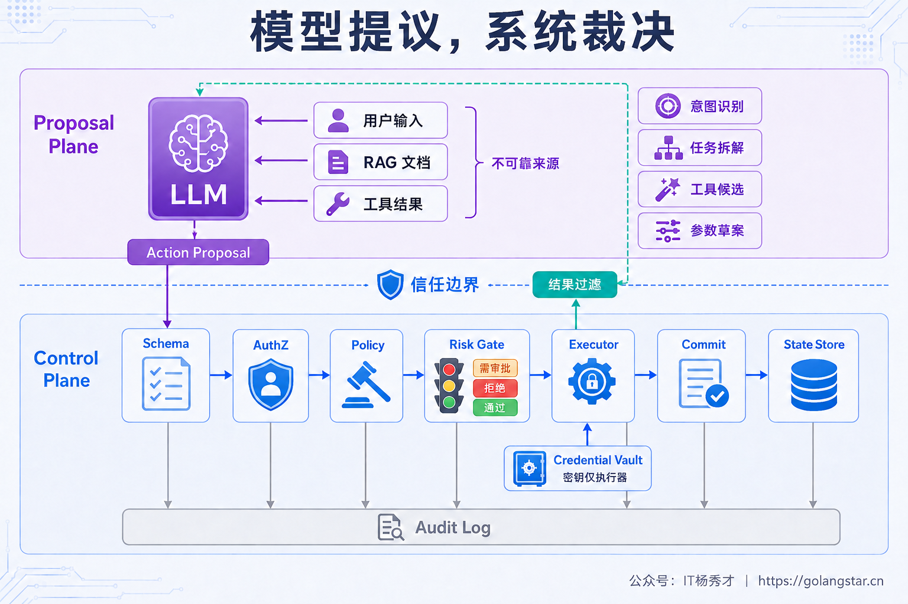
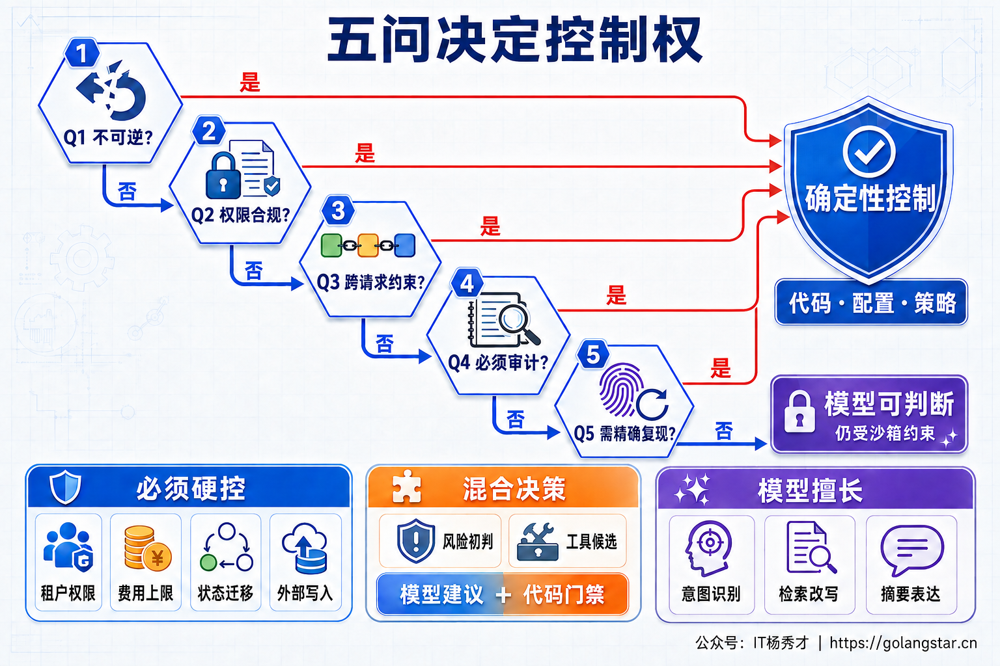
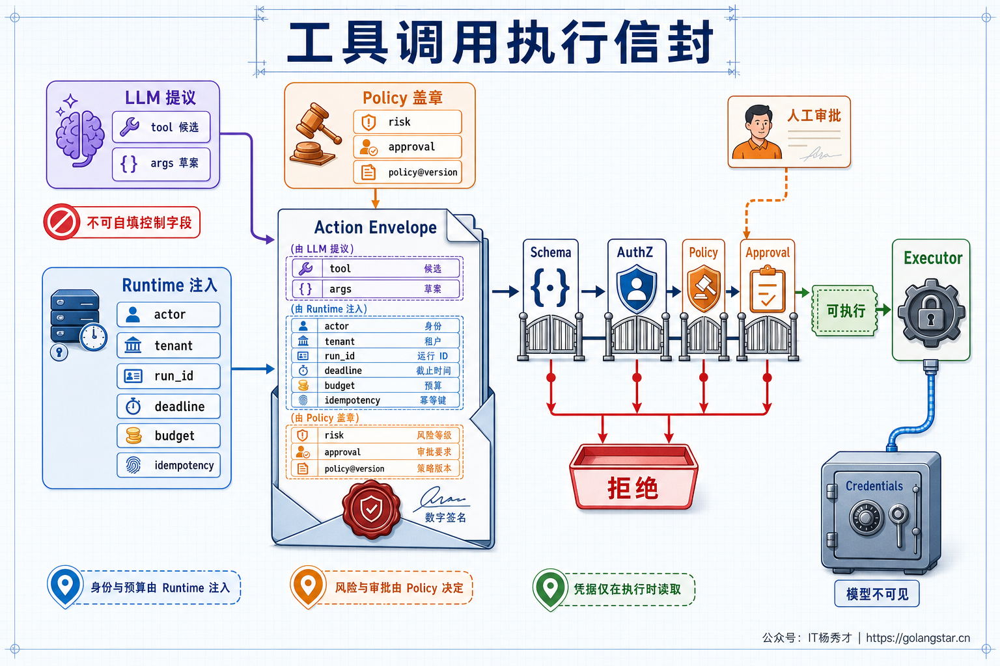
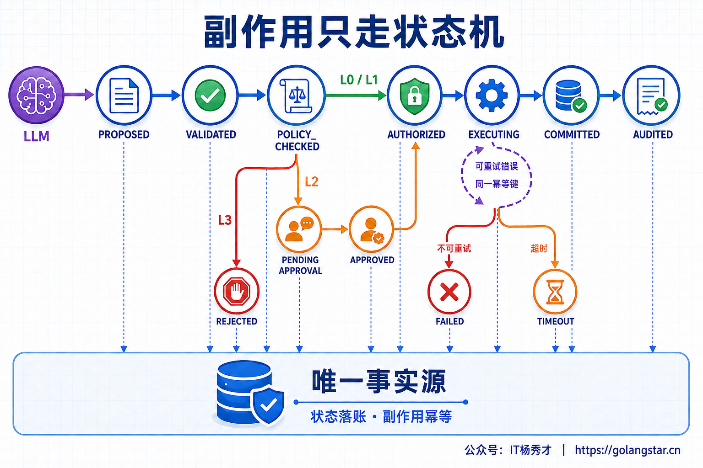
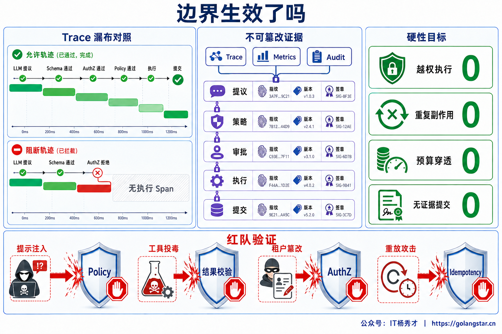

## **1. 题目分析**

System Prompt 里写着“不得删除生产数据”，并不等于系统真的没有删除权限。只要模型同时拿到了管理员凭据和删除工具，一段恶意输入、一次误判，甚至工具返回中的间接 Prompt Injection，都可能让这条文字约束失效。Prompt 表达的是期望，权限系统决定的是能力，两者不是同一件事。

这也是生产级 Agent 与 Demo 的关键分界。LLM 擅长理解模糊意图、生成方案和处理非结构化信息，但它本质上仍是概率模型，输出会受上下文、采样、模型版本和不可信内容影响。鉴权、扣款、状态提交这类逻辑一旦交给模型最终判断，相当于让一个不稳定的组件同时担任申请人、审批人和执行人。

成熟的边界应该是：**LLM 负责提出 Proposal，确定性控制面负责验证、授权、调度、执行、提交和审计。** 即使模型被注入或产生幻觉，最多生成一份会被拒绝的提议，而不能直接把错误变成真实世界的动作。



### **1.1 硬编码不是堆满 if-else**

这里的“硬编码”容易被误解。生产系统并不适合把用户、金额、工具名和审批人散落在大量 `if-else` 中。真正需要的是**不可绕过的确定性约束**，它可以由程序代码、版本化配置、Policy-as-Code、工作流状态机、数据库约束和基础设施策略共同实现。

这些约束有几个共同特征：相同事实得到稳定裁决；规则能够被单元测试和回归测试覆盖；每次决策能解释命中了哪条策略；策略服务异常时 Fail Closed；模型无法通过修改 Prompt、参数或自然语言理由绕过它。

一条完整的控制链通常如下：用户、RAG 文档和 Tool Result 都按不可信输入处理；LLM 只能生成结构化的 `Action Proposal`；控制面依次做 Schema 校验、业务校验、AuthZ、风险裁决和人工审批；真正持有凭据的 Executor 执行动作；状态提交与审计由旁路系统完成。模型不直接连接 Credential Vault，也不能直接修改业务状态。



### **1.2 用五个问题判断控制权**

并不是所有判断都需要写成规则。任务拆解、摘要表达和 Query Rewrite 如果偶尔出错，通常可以检测、重做或让用户修正，模型在这些环节能发挥很大价值。真正需要硬控制的逻辑，可以用五个问题判断：

1. 是否包含不可逆副作用，或者错误发生后无法完整回滚？
2. 是否涉及身份权限、合规、资金安全或敏感数据出域？
3. 是否在维护跨请求、跨 Worker 或跨租户的不变量？
4. 事后是否必须提供可验证的审批和执行证据？
5. 相同业务事实是否必须得到稳定裁决，并且能够精确复现？

只要任意一项成立，LLM 就不应拥有最终决定权。模型仍可给出风险建议、工具候选或解释文本，但最终结果必须经过确定性规则。反过来，即使五项都不成立，“模型自主”也不是无限自治，仍要被可用工具集合、沙箱、预算和 Deadline 包围。



### **1.3 身份权限和数据边界必须由系统提供**

身份、租户和资源范围是第一类绝不能委托给模型的事实。`tenant_id`、`user_id`、角色、ACL 和数据域必须来自认证后的服务端上下文，不能从用户文本或模型参数中提取后直接相信。即使模型正确识别了“查询 A 公司的订单”，下游仍要根据当前主体重新授权，并把租户与 ACL 过滤下推到数据库、搜索引擎和向量库。

同样，模型不能决定自己能看到哪些工具，也不能自行申请更高权限。Tool Registry 应根据主体、场景和风险生成最小工具集合；Executor 使用短期、窄作用域凭据，凭据只在执行时由服务端注入，不进入 Prompt 和 Checkpoint。MCP 或插件调用还需要校验 Token Audience、目标服务和资源范围，禁止把上游 Token 原样透传给任意下游。

数据出域也属于硬边界。PII、密钥、内部文档和受监管数据是否允许进入外部模型，应该由 DLP、字段级脱敏、地域策略和网络 Allowlist 决定。模型可以判断一段文本“可能敏感”作为辅助信号，但不能自己批准发送，也不能通过生成一个新 URL 绕开出口控制。

### **1.4 工具调用必须使用可信执行信封**

Structured Output 能保证 JSON 结构符合 Schema，却不能证明值是正确和获授权的。下面这段调用在格式上完全合法，但订单可能不属于当前租户，退款金额可能超过实付金额，账号也可能没有退款权限。

```json
{"action":"refund","order_id":"O-1024","amount":99999}
```

因此，裸工具参数不能直接进入 Tool。控制面需要把模型提议和服务端可信上下文装配成一个不可变的执行信封：

```text
ActionEnvelope = {
  actor, tenant, run_id, trace_id,
  tool_id, tool_version, normalized_args,
  resource_scope, risk_level,
  deadline, step_budget, cost_budget,
  idempotency_key, approval_id,
  policy_version
}
```

其中只有 `tool_id` 候选和参数草案可以来自 LLM；`actor`、`tenant`、Deadline、预算和幂等键由 Runtime 注入；风险等级、是否需要审批和策略版本由 Policy Engine 产生。真正的审批结论来自可信 Approval Service 或认证后的人工操作，`approval_id` 还要绑定动作、参数摘要、审批人和有效期，不能由模型或策略引擎自行填写。字段缺失、策略超时或版本不匹配时默认拒绝。Schema 之后还要做业务语义校验，例如退款额不超过可退余额、收件人属于允许域、SQL 只能访问授权视图、Shell 命令只能在无网络沙箱中运行。



### **1.5 副作用和状态迁移不能由模型提交**

查询天气和生成摘要即使失败，通常只损失一次调用；付款、退款、发邮件、删除数据、创建工单和修改生产配置会改变外部世界。风险等级可按业务自定义，例如把只读、低风险且可回滚的动作归为 L0/L1，通过校验后自动执行；涉及敏感数据、外部沟通或资金的 L2 默认展示对象、参数和影响范围并请求审批，但已签署授权范围或预授权额度内也可以由确定性规则自动放行；法律禁止或超出业务边界的 L3 直接拒绝，不能因为模型“非常确信”而放行。

执行过程还要由状态机维护合法迁移，例如 `PROPOSED → VALIDATED → POLICY_CHECKED → AUTHORIZED → EXECUTING → COMMITTED → AUDITED`。其中 L2 动作在 `POLICY_CHECKED` 后先进入 `PENDING_APPROVAL`，拿到绑定本次动作的审批证据才进入 `AUTHORIZED`。模型只能产生 `PROPOSED`，无权把任务标成成功。执行器写外部系统时使用稳定幂等键；网络超时造成结果未知时进入 `UNKNOWN` 并查询对账，不能让模型换一个 Key 再试。同库的本地业务状态、工作流状态与 Outbox 可以在一个数据库事务中原子提交；外部支付、邮件或工单依靠调用账本、幂等键和对账闭环收敛。重试策略由错误分类、最大次数、退避、Deadline 和 Retry Budget 决定。

这条边界同样适用于并发控制。CAS、Lease、Fencing Token、唯一约束和余额不为负等业务不变量必须由存储系统强制实施。模型可以建议“重新执行步骤”，却不能决定旧 Worker 的迟到结果仍然有效，也不能用自然语言解决两个并发写入的冲突。



### **1.6 预算和生命周期属于运行时权力**

Agent 很容易因为反思、工具失败或上下文污染陷入循环。`max_turns`、最大 Tool Call 数、Token 和费用预算、并发配额、Deadline、单阶段超时与熔断阈值必须在运行时强制执行。模型可以判断“再检索一次可能改善答案”，但不能自己提高预算、延长截止时间或撤销限流。

启动、排空、取消和恢复也应由确定性状态机管理。Readiness 决定实例是否接流，Drain 决定是否领取新任务，取消信号需要向 LLM、Tool 和子任务传播，Checkpoint 决定从哪个已提交节点恢复。这些都是跨进程的所有权和资源生命周期问题，不能依赖模型记得“当前应该停下”。

同理，最终完成条件也要由工作流定义。代码可以校验必需节点是否成功、审批是否存在、输出工件是否落盘、预算是否结算；LLM 的一句“任务已经完成”只能是候选信号，而不是业务事实。

### **1.7 模型适合在边界内处理模糊性**

确定性控制并不意味着把 Agent 退化成传统工作流。模型最有价值的地方，正是规则难以枚举的语义空间：理解意图、补全槽位、拆解开放任务、改写检索词、从已授权工具中提出候选、归纳多源信息、发现歧义并请求澄清、生成面向人的解释。

实际系统通常采用三种责任模式。确定性区由代码直接裁决，例如权限、金额上限和状态迁移；概率区允许模型自主，例如文案风格和摘要组织；中间的灰区采用“模型建议 + 规则复核 + 按风险审批”，例如工具选择、风险初判和异常归因。模型置信度只能影响是否升级复核，不能成为授权凭据。

这个分工能避免两个极端。完全信任模型会产生 Excessive Agency；所有分支都写死，则失去 LLM 处理长尾语义的价值。好的 Agent 不是让模型拥有最多权力，而是让它在明确能力边界内拥有足够的选择空间。

### **1.8 用证据验证边界是否生效**

边界设计完成后，需要验证的是系统行为，而不是 Prompt 看起来是否严谨。Trace 应串起 `proposal_id`、策略版本、授权结论、审批证据、执行 Attempt、幂等键和最终提交；审计日志从 Gateway、Policy Engine 与 Executor 旁路采集，不能让模型自己总结“做过什么”。敏感内容需要脱敏，但关键决策证据不能被模型覆盖或删除。

线上既要看通过率，也要看误拦截和漏放行。硬性红线包括越权执行为零、重复副作用为零、预算穿透为零、无审批证据提交为零；辅助指标包括 Proposal 拒绝原因、人工审批率与等待时间、Policy 延迟、模型提议到实际执行的差异、Fail Closed 次数和用户任务完成率。拒绝率越高并不代表越安全，大量误拦截同样会让系统不可用。

上线前的红队测试要把模型当作不可信调用方，覆盖直接与间接 Prompt Injection、恶意 Tool Result、租户 ID 篡改、越权对象引用、审批票据重放、重复消息、Policy 服务超时以及模型要求提高预算等场景。测试断言不是“模型拒绝了攻击”，而是即使模型接受了攻击，Schema、AuthZ、Policy、幂等和网络边界仍能截住动作。



归根结底，LLM 可以参与决策，却不能成为 Root of Trust。生产 Agent 的可靠性并不来自模型永远正确，而是来自模型出错时，系统仍然只允许合法、可控、可追溯的结果发生。

***

## **2. 参考回答**

在生产 Agent 里，我遵循一个原则：模型负责提议，系统负责裁决和执行。只要错误会造成越权、资金损失、不可逆副作用，或者涉及跨请求不变量和合规举证，就不能让 LLM 做最终决定。身份与租户隔离、工具白名单、参数和业务校验、权限策略、风险审批、预算限流、超时重试、状态迁移、事务幂等、数据出域和审计，都要由代码、版本化配置、Policy Engine 和状态机强制实现，策略异常时 Fail Closed。

具体执行时，LLM 只生成结构化 Action Proposal。控制面从认证上下文补齐 actor、tenant 和 scope，从 Runtime 补齐 Deadline、预算和幂等键，再经过 Schema、AuthZ、Policy 与风险门禁；高风险动作暂停等待人工确认，真正持有凭据的 Executor 执行，业务状态由事务和状态机提交。LLM 适合在边界内做意图理解、任务拆解、检索改写、工具候选和内容生成，置信度只能作为升级复核的信号，不能作为权限。这样即使模型幻觉或遭遇 Prompt Injection，也只能提出一份会被拒绝的建议，不能越过系统边界。

<div style="background-color: #f0f9eb; padding: 10px 15px; border-radius: 4px; border-left: 5px solid #67c23a; margin: 20px 0; color:rgb(64, 147, 255);">

## <span style="color: #006400;">**学习交流**</span>
<span style="color:rgb(4, 4, 4);">
> 如果您觉得文章有帮助，可以关注下秀才的<strong style="color: red;">公众号：IT杨秀才</strong>，后续更多优质的文章都会在公众号第一时间发布，不一定会及时同步到网站。点个关注👇，优质内容不错过
</span>


<div style="text-align: center; margin-top: 22px; padding-top: 20px; border-top: 1px solid #c2e7b0;">
<div style="color: #006400; font-size: 20px; font-weight: bold;">🔥 配套实战项目，拆得开、跑得起、能写进简历</div>
<div style="color: red; font-size: 16px; font-weight: bold; margin-top: 8px;">多 Agent 编排 + RAG 混合检索 · 31 篇深度教程 + 50+ 面试题</div>
<a href="/projects/dev-support.html" style="display: inline-block; margin-top: 14px; background: #ff7a18; color: #fff; font-size: 18px; font-weight: bold; padding: 10px 28px; border-radius: 24px; text-decoration: none;">点击查看 DevSupport AI 实战项目 →</a>
</div>
</div>
