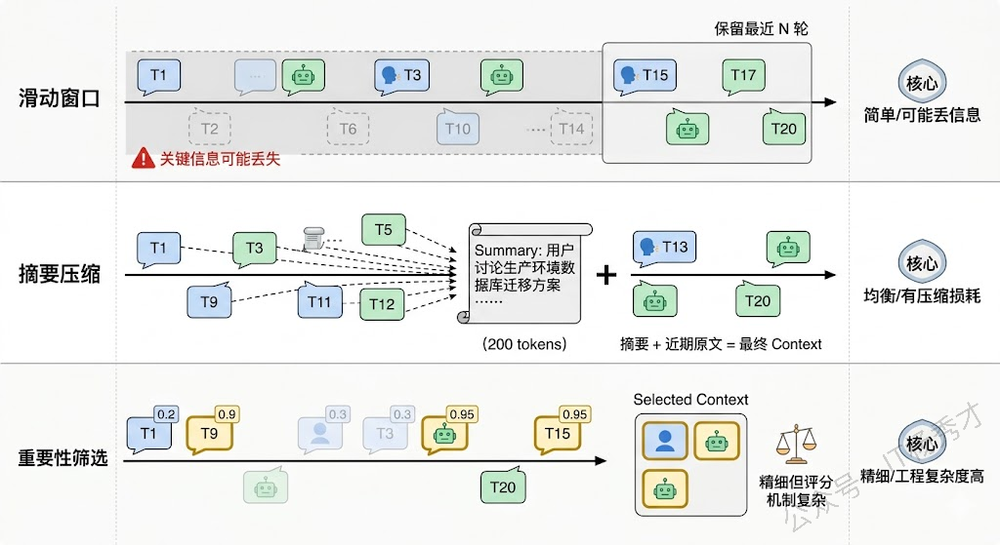
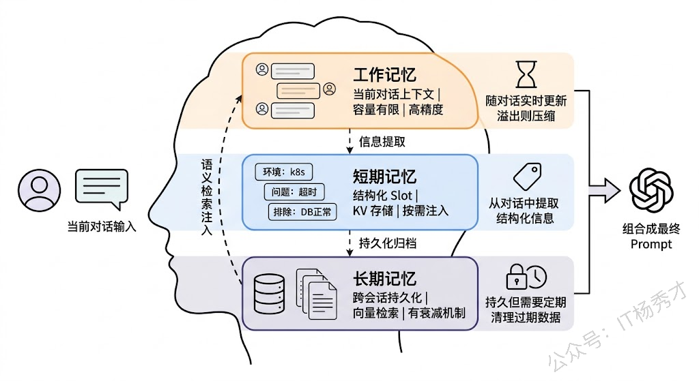
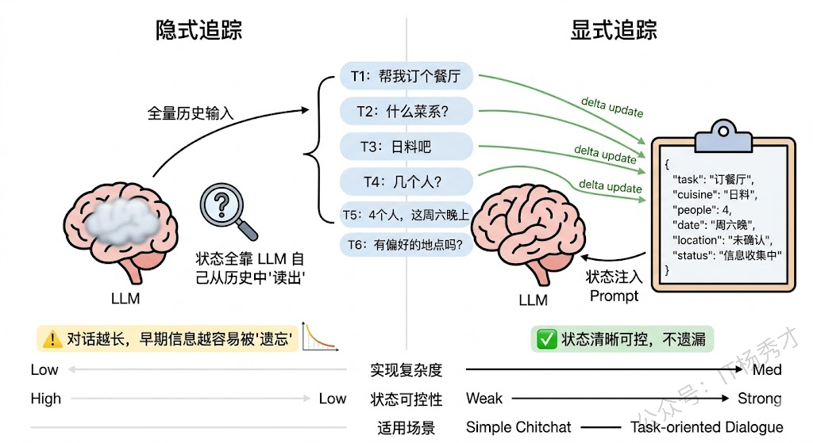
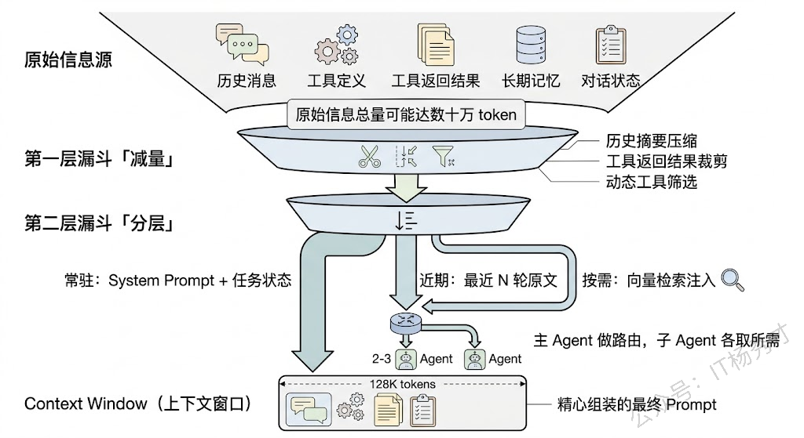
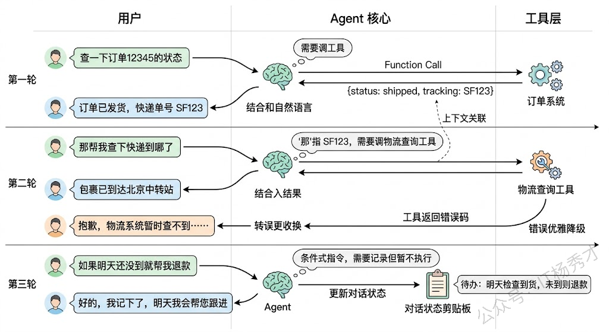
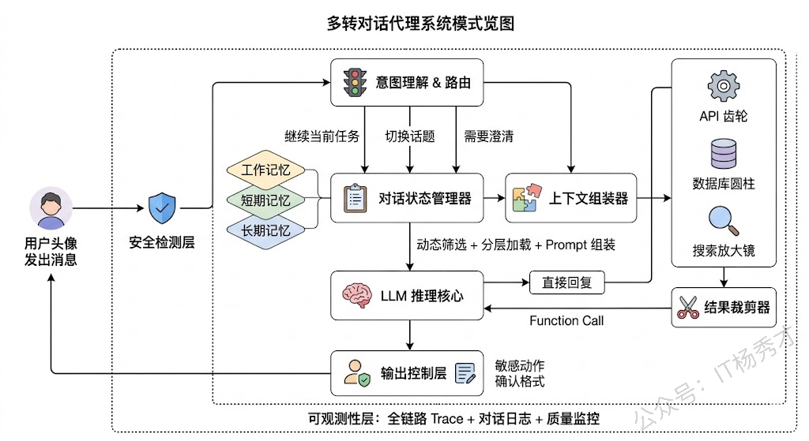

## **1. 题目分析**

几乎每个人都用过多轮对话——打开 ChatGPT 聊几句就是。但是要设计一个多轮对话可不容易。多轮对话 Agent 的设计之所以难，不是因为某一个技术点特别深奥，而是因为它要求你同时想清楚好几件事情怎么协同运作：上下文怎么管、状态怎么追踪、记忆怎么存、上下文窗口装不下了怎么办、对话中途要调工具怎么处理……这些子问题单拎出来都不算太难，但一旦放进"多轮对话"这个场景里，它们之间的耦合关系会让整体复杂度指数级上升。

面试官抛出这道设计题就是想知道你能不能抓住多轮对话最核心的那几个设计决策点，讲清楚每个点上有哪些取舍、你会怎么选择、为什么。接下来，我就沿着"一个请求从用户嘴里说出来，到最终返回答案"的数据流走一遍，看看这条路上到底有哪些关卡需要你做设计决策。

### **1.1 对话历史的管理**

LLM 本身是无状态的。每次调用，你得把整段对话历史塞进 prompt，它才能"记住"之前说了什么。这意味着对话历史的管理方式直接决定了整个多轮对话 Agent 的上限。

最朴素的方案是"全量拼接"——把从第一轮到当前轮的所有 messages 原封不动地拼成一个列表送进去。这在对话刚开始的几轮没什么问题，但随着对话轮数增加，token 数量会线性增长，很快就会撞上上下文窗口的天花板。而且更关键的是，不是所有历史消息都同等重要。第三轮用户随口问的一句"今天天气怎么样"，到第二十轮讨论技术架构时已经完全不相关了，但它还占着宝贵的上下文空间。

所以你需要一套对话历史的"管理策略"，核心要回答两个问题：**哪些历史该保留，哪些该丢弃？保留的历史以什么形式存在？**&#x5E38;见的策略有三种。

> 第一种是**滑动窗口**，只保留最近 N 轮对话，更早的直接截断。简单粗暴，但有效。问题是如果用户在第 5 轮提到的一个关键信息（比如"我说的是生产环境的数据库"），到第 15 轮还被引用，窗口一滑就丢了。

> 第二种是**摘要压缩**，当历史超过一定长度时，用 LLM 对早期对话做一次摘要，把几千 token 的详细对话压缩成几百 token 的核心要点，然后用"摘要 + 最近 N 轮原文"的组合送进去。这种方式在信息保留和 token 节省之间取得了不错的平衡，但摘要本身可能丢失细节，而且每次做摘要也有额外的 LLM 调用成本。

> 第三种是**基于重要性的选择性保留**，给每条消息打一个重要性分数（比如包含用户明确指令的消息分数高，闲聊的分数低），然后优先保留高分消息。这种方式更精细，但重要性评分本身又是一个不小的工程问题。

实际工程中，最常用的是"摘要 + 滑动窗口"的混合方案：远期历史做摘要，近期历史保留原文，再加上一个 system prompt 持续携带任务背景信息。这样既控制了 token 用量，又保证了近期上下文的完整性和远期关键信息的不丢失。

### **1.2 记忆系统**

对话历史管理解决的是"单次会话内"的上下文问题，但一个真正好用的多轮对话 Agent 还需要有"跨会话"的记忆能力。用户昨天告诉 Agent "我是后端开发，主要用 Go 语言"，今天再来问技术问题时，Agent 应该记得这个偏好，而不是每次都从头确认。

记忆系统的设计通常分为三层。

> 1. **工作记忆（Working Memory）**，也就是当前对话的上下文，就是上一节讨论的对话历史。它是短时的、高精度的，但容量有限。

> 1. **短期记忆（Short-term Memory）**，用来存储当前会话或近几次会话中提取出的结构化信息。比如在一次帮用户排查 bug 的对话中，Agent 从对话里提取出"问题现象：接口超时"、"环境：生产环境 k8s"、"已排除原因：数据库连接正常"这些结构化 slot，存进一个轻量的 key-value 存储里。这些信息不依赖原始对话文本，所以不占上下文窗口，但又随时可以按需检索注入到 prompt 中。

> 1. **长期记忆（Long-term Memory）**，用来存储跨会话的持久化信息。实现上通常是把关键信息 embedding 之后存进向量数据库，下次对话开始时，根据当前话题做语义检索，把相关的历史记忆注入到 system prompt 里。这一层解决的是"用户偏好记忆"、"历史对话的关键结论"这类需要长期保持的信息。

三层记忆的工程挑战各不相同。工作记忆的挑战在上一节已经聊过了——窗口管理和信息压缩。短期记忆的挑战在于**信息提取的准确性**——你需要让 LLM 从非结构化的对话中准确抽取出结构化信息，这本身就是一个有噪声的过程。长期记忆的挑战在于**检索的相关性和时效性**——三个月前存的一条"用户在做 Python 项目"的记忆，现在用户已经转去做 Rust 了，这条过期记忆如果被检索出来注入 prompt，反而会误导 Agent。所以长期记忆还需要一套衰减和更新机制。

### **1.3 对话状态追踪**

多轮对话不是一轮一轮独立的问答拼接，它有连贯的上下文语境和正在推进的任务状态。Agent 必须随时知道"当前聊到了什么阶段"、"还差哪些信息没收集到"、"用户的核心意图有没有发生变化"。这就是对话状态追踪（Dialogue State Tracking, DST）要解决的问题。

传统的任务型对话系统里，DST 的做法比较明确：预先定义好一组 slot（比如订机票场景的出发地、目的地、日期、舱位），每轮对话后更新 slot 的填充状态，所有 slot 填满了就触发对应的 action。但 LLM 时代的多轮对话 Agent 面对的场景要复杂得多——用户的意图可能是开放式的，可能中途切换话题，可能一句话里包含多个意图，也可能隐含的意图需要推理才能发现。

在 LLM-based 的 Agent 中，对话状态追踪通常不再用传统的 slot-filling 范式，而是让 LLM 自己来理解和维护对话状态。具体的实现方式有两种路线。

第一种是**隐式状态追踪**：不显式维护任何状态对象，完全依赖 LLM 从对话历史中"读出"当前状态。每轮对话时把完整历史送进去，LLM 自己判断现在该做什么。这种方式实现最简单，但问题是当对话变长后，LLM 对远处上下文的注意力会衰减（lost in the middle 问题），可能遗漏早期的关键信息。

第二种是**显式状态追踪**：在每轮对话后，让 LLM 输出一个结构化的状态对象（JSON 格式），记录当前的任务进度、已收集的信息、待确认的事项等。这个状态对象在下一轮对话时作为 system prompt 的一部分注入，相当于给 LLM 一个"备忘录"。这种方式的好处是状态清晰可控、不容易遗漏信息，代价是每轮都要多做一次状态更新的 LLM 调用。

实践中，我推荐的做法是**显式状态 + 轻量更新**：维护一个结构化的 dialogue state，但不是每轮都重新生成整个状态，而是让 LLM 只输出"相对于上一轮状态的增量变更"（delta update），这样既保持了状态的准确性，又控制了额外的 token 开销。

### **1.4 上下文窗口的工程策略**

前面几个设计点最终都会汇聚到一个绕不开的硬约束上：**LLM 的上下文窗口是有限的**。即使是 128K 甚至更大窗口的模型，在高频长对话场景下也会被撑满。而且窗口大不代表效果好——研究表明，当输入内容超过一定长度后，LLM 对中间位置信息的理解质量会显著下降。

面对这个约束，工程上的策略可以分为三个层次来思考。

> **第一层：减少输入量**。除了前面提到的对话历史压缩和摘要之外，还有一些细节值得关注。比如工具调用的返回结果往往很长（一个 API 返回了一大坨 JSON），但真正有用的可能只是其中几个字段——可以在工具返回结果后做一次裁剪，只保留和当前任务相关的字段。再比如 system prompt 里的工具定义，如果 Agent 有 20 个工具，每个工具的描述占 200 token，光工具定义就占了 4000 token。可以根据当前对话的主题做**动态工具筛选**，只把可能用到的工具定义送进去。

> **第二层：分层存储，按需加载**。不是所有信息都需要同时待在上下文窗口里。可以把信息分成"必须常驻"（system prompt、当前任务状态）、"近期需要"（最近几轮对话）、"按需检索"（长期记忆、历史对话摘要）三个层级。常驻信息始终在 prompt 里，近期信息用滑动窗口管理，按需信息存在外部存储里，只在 LLM 需要时通过检索注入。

> **第三层：多 Agent 分工**。当一个对话涉及多个子任务时（比如用户先问了技术问题，又让帮忙写一封邮件），可以用一个主 Agent 做对话管理和意图路由，具体的子任务分发给专门的子 Agent 处理。每个子 Agent 只接收和自己任务相关的上下文，这样每个 Agent 的上下文压力都大大降低。这也是为什么很多生产级 Agent 框架（如 AutoGen、CrewAI）都采用了多 Agent 协作的架构。

### **1.5 工具调用与对话流的编排**

一个实用的多轮对话 Agent 不太可能只靠纯文本生成来完成所有任务，它需要调用工具——查数据库、调 API、执行代码、搜索网页。问题在于，工具调用要自然地嵌入到多轮对话的流程中，而不是打断对话的节奏。

这里有几个设计决策需要做。首先是**调用时机的判断**：Agent 需要判断当前这轮对话是直接回答就行，还是需要先调工具获取信息再回答。这个判断通常交给 LLM 自己来做（Function Calling 或 ReAct 范式），但你需要在 prompt 里给出清晰的指引，告诉它什么情况该调工具、什么情况不该。比如用户问"你觉得这个方案怎么样"——这是一个观点性问题，不需要调工具；但用户问"这个接口昨天的 P99 延迟是多少"——这需要查监控系统。

其次是**多轮工具调用的状态连续性**。用户可能在第一轮说"查一下订单 12345 的状态"，Agent 调了订单查询工具返回结果，第二轮用户接着说"那把它取消掉"——这里 Agent 需要理解"它"指的是订单 12345，并且需要把上一轮的查询结果作为上下文来构造取消请求的参数。工具调用的上下文不能丢。

最后是**调用失败的优雅处理**。工具可能超时、返回错误、或者返回了空结果。Agent 不能把一个 500 错误码原样丢给用户，它需要把失败转化为对话语言——"抱歉，订单系统暂时无法访问，您可以稍后再试，或者告诉我订单号我帮您记下来等系统恢复后处理"。这种从系统错误到自然语言的转换，需要在 prompt 和 error handling 层面都做好设计。

### **1.6 对话的"元控制"机制**

前面五个策略讨论的都是 Agent"怎么正常工作"，但生产环境里，你还必须考虑"出了问题怎么办"。多轮对话 Agent 需要一套"元控制"机制来保证对话的健壮性。

**澄清与确认机制**。当 Agent 对用户意图不确定时，它应该主动发起追问，而不是猜一个可能错误的答案就往下走。这听起来简单，但实际需要解决一个微妙的平衡：问太多会让用户烦（"你到底能不能帮我干活？"），问太少会执行错误的动作。一个好的策略是设定一个"置信度阈值"——当 LLM 对意图理解的置信度高于阈值时直接执行，低于阈值时才追问，而阈值的高低取决于操作的风险级别（查个信息可以大胆猜，删个数据必须确认）。

**话题切换与意图漂移处理**。多轮对话中用户会频繁切换话题。Agent 需要能够识别话题切换，正确地暂存或结束当前任务的状态，切换到新话题。更复杂的场景是用户在两个话题之间来回切换（"刚才那个数据库的问题你说到哪了？"），Agent 需要能恢复之前的对话上下文。

**安全防护与输出控制**。多轮对话天然比单轮更容易被 prompt injection 攻击——攻击者可以在前几轮对话中逐步"铺垫"，最后在某一轮触发恶意行为。所以每一轮的输入都需要过安全检测，不能因为"前几轮是正常的"就放松警惕。此外，对话中涉及的敏感操作（删除数据、发送消息、支付等）需要有二次确认机制和操作审计日志。

### **1.7 思路小结**

回头来看，设计一个多轮对话 Agent 的核心挑战可以归结为一句话：**在一个无状态的 LLM 之上，构建一整套有状态的对话管理机制**。对话历史管理解决"记得住最近说了什么"，记忆系统解决"记得住以前说了什么"，状态追踪解决"知道现在聊到哪了"，上下文工程解决"有限空间里装最重要的信息"，工具编排解决"对话中需要干活时怎么干"，元控制解决"出问题时怎么兜住"。这六个设计点不是独立的模块，它们紧密耦合、相互影响——比如记忆系统的设计直接影响上下文工程的策略，状态追踪的精度决定了工具调用的准确性。一个好的设计方案需要把它们当做一个整体来统筹考虑。

***

## **2. 参考回答**

设计一个多轮对话 Agent，我会围绕六个核心设计点来展开。

首先是对话历史管理，LLM 本身无状态，每轮都需要把历史送进去，我通常用"摘要+滑动窗口"的混合策略——远期对话做压缩摘要，近期保留原文，这样在 token 用量和信息保留之间取得平衡。

第二是记忆系统，我会设计三层：工作记忆就是当前上下文，短期记忆用 key-value 存结构化的 slot 信息（比如当前任务的关键参数），长期记忆用向量数据库做跨会话的语义检索，新对话开始时把相关历史记忆注入 system prompt。

第三是对话状态追踪，对于任务型对话我推荐显式维护一个 JSON 格式的状态对象，每轮只做增量更新，这样 Agent 始终清楚当前任务进度和待收集的信息。

第四是上下文窗口的工程优化，从三个层面入手：减量（裁剪工具返回、动态筛选工具定义）、分层存储（常驻信息、近期信息、按需检索三级）、多 Agent 分工（主 Agent 路由，子 Agent 各自处理子任务以降低单个 Agent 的上下文压力）。

第五是工具调用的编排，关键在于让工具调用和对话流自然融合，工程上要处理好跨轮的参数传递、条件式任务记录、以及调用失败的优雅降级。

最后是元控制机制，包括不确定时主动澄清而不是猜测执行、话题切换时正确暂存和恢复上下文、以及每轮都做安全检测防止渐进式的 prompt injection。

实际项目中，这六个点不是独立的模块，它们之间紧密耦合，需要作为一个整体来设计和调优。

## **学习交流**

> 如果您觉得文章有帮助，可以关注下秀才的<strong style="color: red;">公众号：IT杨秀才</strong>，后续更多优质的文章都会在公众号第一时间发布，不一定会及时同步到网站。点个关注👇，优质内容不错过

