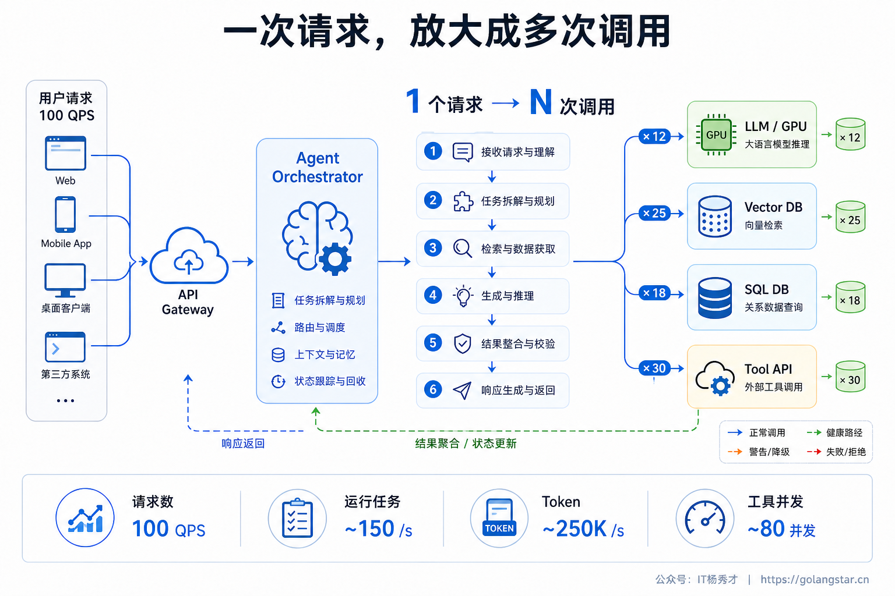
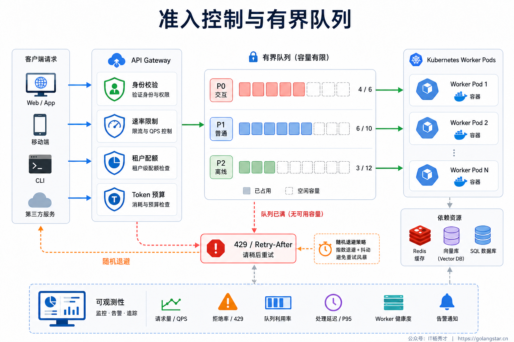
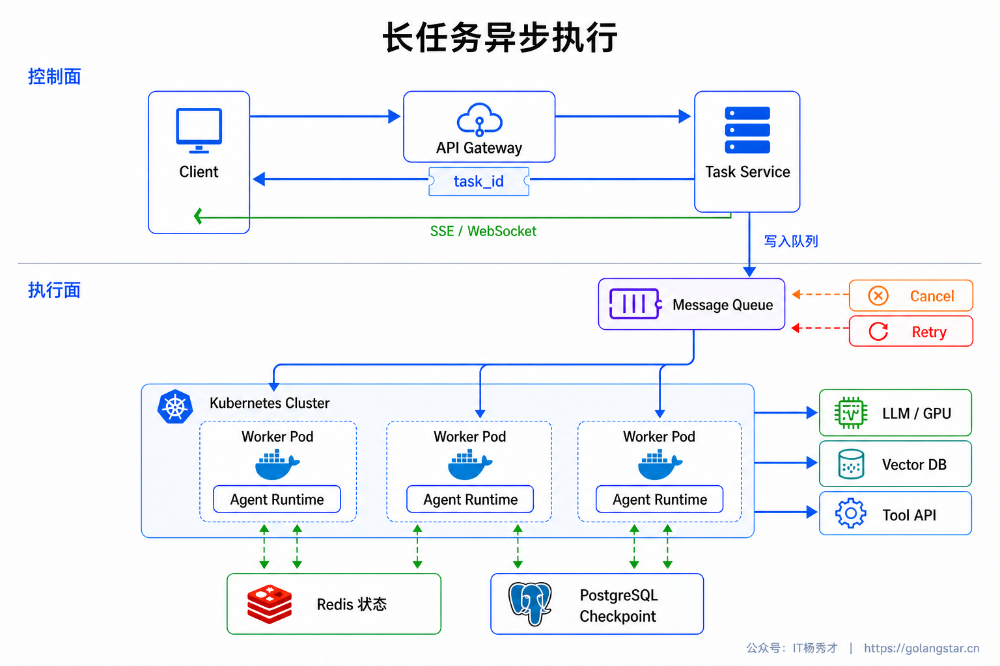
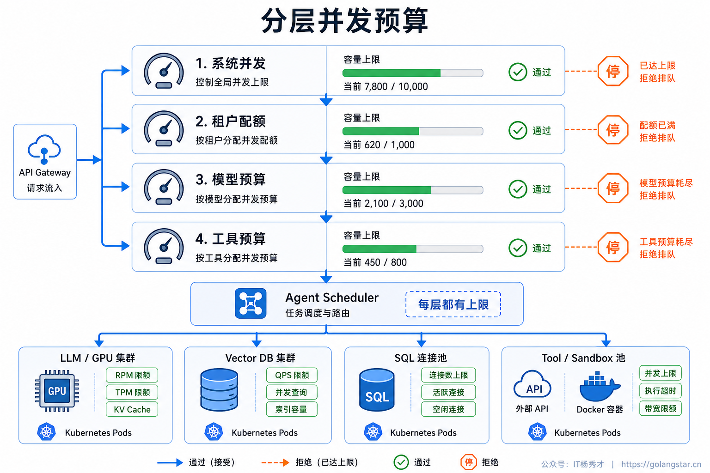
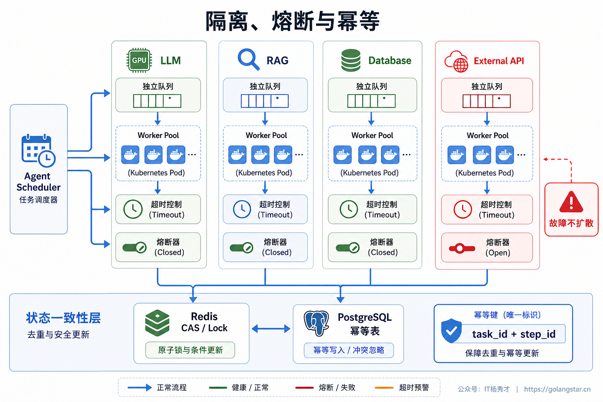
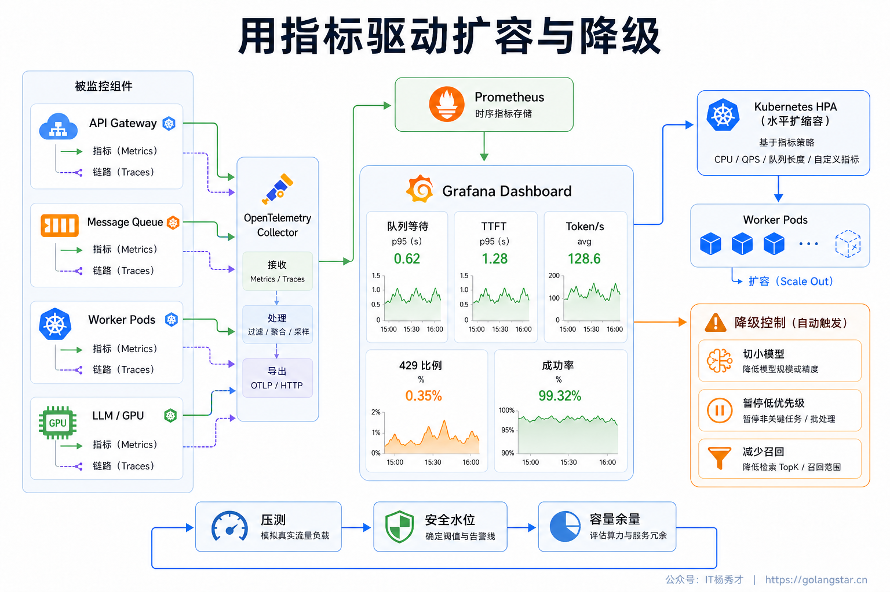

## **1. 题目分析**

Agent 的高并发不能只按普通 Web 接口来理解。传统查询接口收到一次请求，通常执行一段相对固定的逻辑就返回了；Agent 收到一次请求，背后可能连续触发多轮 LLM 推理、RAG 检索、数据库查询和第三方工具调用，复杂任务还会拆出多个并行子任务。入口只有 100 个请求，到了下游可能已经变成上千次模型和工具调用。

更麻烦的是，不同 Agent 任务的资源消耗差别非常大。同样是一个请求，有的只调用一次小模型，几百毫秒就结束；有的带着很长的上下文，要经过十几步推理，几分钟后才能完成。如果系统只盯着接口 QPS，然后简单地增加实例，高峰期很容易出现工作线程被长任务占满、队列越堆越长、下游连接池耗尽、模型服务被 429 限流，最后又因为大量重试形成流量风暴。

所以，生产环境里应对高并发的核心不是“多加几台机器”，而是让流量在进入、排队、执行和降级的每个阶段都受到约束。完整方案需要先算清楚真实负载，再通过入口准入和背压控制流量，用异步任务架构承接长流程，为模型、工具和租户分别设置并发预算，最后用隔离、幂等、降级和可观测性守住系统边界。



### **1.1 先算清楚真实负载**

Agent 系统最容易犯的第一个错误，是把“用户请求数”直接当成系统负载。真正需要关注的是请求进入以后产生了多少下游工作量，可以用一个简单关系来理解：

```text
下游调用量 ≈ 用户请求量 × 平均执行步数 × 每步平均扇出数
```

假如一个任务平均执行 6 步，每一步平均产生 1.5 次模型或工具调用，那么入口 100 QPS 对下游来说可能接近 900 QPS。多 Agent 场景还会放大这个数字，因为 Planner 一次分出多个 Worker 后，几个子任务可能同时请求模型、向量库和外部 API。

只看调用次数仍然不够。模型侧真正稀缺的资源往往是 token 吞吐和并发序列数：一个 2 万 token 上下文的请求，与一个 500 token 的短请求都只算“一次调用”，资源消耗却完全不同。工具侧则要看数据库连接、HTTP 连接、CPU 沙箱和第三方 API 配额。因此容量评估至少要同时统计四类负载：入口请求数、运行中的 Agent 任务数、模型的输入输出 token、各类工具的并发调用数。

工程上需要先对任务分级。简单问答属于交互型短任务，需要较低的首字延迟；多步分析属于普通工作流，可以接受短暂排队；批量报告和数据处理属于长任务，应该进入异步队列。不同等级使用不同的超时、并发上限和资源预算。只有先把任务成本和服务目标分清楚，后面的限流与扩容才不会变成拍脑袋。

### **1.2 入口准入与背压**

高并发系统不是来多少请求就收多少请求。入口第一层会做租户级和用户级限流，常见做法是 Token Bucket 或滑动窗口，但 Agent 不能只限制每秒请求数，还要限制同时运行的任务数、单位时间 token 预算和单任务最大步骤数。否则一个用户连续提交几十个长任务，QPS 看起来不高，Worker 和模型配额却会被长期占住。

准入通过后，请求进入的必须是**有界队列**。无限队列只是把故障从“立即失败”改成“很久以后超时”，而且请求在队列里等待时，用户通常还会重复提交，进一步放大流量。队列达到上限时，系统要明确执行背压：低优先级任务拒绝或延后，交互请求返回“系统繁忙”和预计等待时间，客户端按照 `Retry-After` 配合随机抖动重试，不能立即无脑重放。



队列还需要优先级和截止时间。用户正在等待的交互任务优先于离线总结，同一个租户也不能靠大量任务把其他租户饿死。任务在队列里超过自己的 deadline 后就应该主动取消，而不是等它获得资源后再执行一个用户已经不需要的结果。这里的关键是承认系统容量有限，并把有限资源分配给最有价值、仍然有效的任务。

### **1.3 长任务异步化**

Agent 的多步执行不适合一直绑定在 HTTP 请求线程上。常见方案是把短任务和长任务分开：简单问答可以同步执行并通过 SSE 流式返回；预计耗时较长的任务，网关完成校验后立即创建 `task_id`，写入消息队列并返回受理结果，Agent Worker 再从队列中消费。前端通过 SSE、WebSocket 或轮询获取进度和最终结果。

这样做首先解决了连接和计算资源绑定的问题。用户断开页面不会直接杀死任务，某个 Worker 被重启也不会让请求从头丢失。Worker 本身尽量保持无状态，任务状态、步骤结果和取消标记放在 Redis 或数据库中，关键节点写 Checkpoint。执行失败后，新 Worker 可以从最近的状态继续，而不是重新消耗前面所有模型和工具资源。



异步化并不等于“丢进队列就结束了”。系统还需要处理任务取消、超时回收和重复投递。用户取消后，控制面先把任务标记为 canceled，Worker 在每个步骤之间检查取消状态并尽快停止；超过总时限的任务由调度器回收；队列通常只能保证至少一次投递，因此每个任务必须带幂等键，Worker 重复拿到同一个任务时不能重复发送消息、创建订单或写入业务数据。

### **1.4 分层并发预算**

入口流量被控制住以后，执行层还要给每类资源设置独立的并发预算。生产环境通常会设计多级 Semaphore：最外层限制整个系统同时运行的 Agent 任务数；下一层按租户限制，防止大客户或异常用户成为 noisy neighbor；再往下分别限制模型、向量库、数据库和每个外部工具的并发量。

模型调用不能只按请求个数调度。如果使用外部模型，要同时遵守 RPM、TPM 和并发连接限制，并根据上下文长度预估 token 成本。短上下文请求可以进入快速通道，长上下文任务则限制并发，避免几个超长 Prompt 把全部配额吃完。自部署模型可以利用 Continuous Batching 提高 GPU 吞吐，但仍要设置最大并发序列、KV Cache 水位和等待队列；当显存接近上限时继续接单，只会造成所有请求一起抖动。



工具调用也要有自己的资源池。数据库查询受连接池约束，代码执行受 CPU 和内存沙箱约束，搜索、地图等第三方接口受各自配额约束。Agent 即使判断多个步骤可以并行，也不能无限 fan-out，而是由执行器根据工具预算放行。只有真正无依赖的步骤才并行，有数据依赖的步骤仍然串行，避免为了追求并发反而制造错误结果。

### **1.5 资源隔离与状态一致性**

高并发最怕故障扩散。一个慢工具如果占满公共线程池，可能让完全不依赖它的 Agent 也无法执行。因此模型、RAG、数据库和高风险工具应该使用隔离的 Worker Pool、连接池和队列，这就是 Bulkhead 隔舱模式。某个舱室过载时只影响对应能力，其他任务仍然可以继续运行或走降级路径。

每个下游调用还要设置独立超时、熔断和重试预算。重试不是越多越好：高峰期下游已经变慢，大量立即重试会把一次失败放大成多次请求。只有网络抖动、429 或短暂 5xx 这类可恢复错误才进入带指数退避和随机抖动的有限重试；参数错误、权限错误直接失败；某个工具持续异常则熔断，让后续请求快速失败或切换备用方案。



状态一致性是另一个容易漏掉的点。高并发下同一会话可能同时到达两条消息，两个 Worker 也可能重复消费同一任务。如果都直接覆盖状态，就会出现上下文倒退或外部动作重复执行。工程上通常用版本号或 CAS 控制会话状态更新，对必须串行的会话设置短粒度锁；业务写操作使用 `task_id + step_id` 作为幂等键，并记录执行状态。相比追求很难真正实现的“消息绝不重复”，更现实的方案是接受至少一次投递，再保证每一步重复执行不会产生第二次副作用。

### **1.6 过载降级**

系统进入过载状态后，目标不是维持所有功能原样运行，而是优先保证核心请求能完成。降级顺序必须提前设计，而不是出问题时临时决定。第一档可以缩短非必要上下文、命中语义缓存、降低召回数量；第二档切换成本更低、吞吐更高的模型，跳过昂贵的 Rerank、反思和多候选评估；第三档暂停低优先级长任务，把复杂 Multi-Agent 工作流降为单 Agent 或简单 RAG；再严重时只保留只读查询，暂停发送消息、写数据库等外部副作用。

这里有一条底线：**性能降级不能把安全校验一起降掉**。高峰期可以少做一次反思、少召回几篇文档，但不能跳过权限检查、参数校验和高风险操作确认。涉及资金、删除、外发的任务，如果必要的安全组件不可用，宁可排队或拒绝，也不能为了吞吐直接执行。

降级触发条件也不能只看 CPU。队列最老任务等待时间、模型 429 比例、GPU KV Cache 水位、数据库连接池占用率和工具超时率，都可以成为过载信号。恢复时采用逐级放量，避免刚解除降级就把积压任务全部同时释放，造成第二次冲击。

### **1.7 容量规划与可观测性**

高并发治理最终要靠数据闭环。传统的 QPS、CPU、内存和错误率当然要看，但 Agent 更关键的指标是：队列深度与最老任务年龄、运行中任务数、单任务平均步骤、排队时间、首 Token 延迟、完整响应延迟、输入输出 token 吞吐、模型 429 比例、工具连接池占用、任务成功率、降级率以及单任务成本。



扩容策略也要跟真实瓶颈绑定。API 层可以按请求和 CPU 横向扩容；Agent Worker 更适合看队列长度、最老任务年龄和运行中任务数；自部署模型要看 GPU 利用率、显存、KV Cache 和 token 吞吐；工具层则看连接池与下游配额。只按 CPU 做统一 HPA，往往会出现接口实例扩了很多，真正受限的模型配额和数据库连接却完全没变。

上线前的压测必须使用真实任务分布，不能全部用一次模型调用的短请求。测试集中要包含长上下文、多步骤、多工具并行、热门租户突发流量，还要主动注入慢工具、模型 429、Worker 重启和重试风暴，观察背压、隔离和降级是否真的生效。最终容量不是算出一个“理论最大 QPS”就结束，而是找出模型、工具和状态存储每一层的安全水位，并保留足够余量应对流量波动。

回到这道题，一套完整的高并发方案应该形成清晰链路：网关只接收系统有能力处理的任务，有界队列吸收短时峰值，Worker 异步执行长流程，分层并发预算保护每一种稀缺资源，隔舱与幂等防止故障扩散和重复副作用，过载时按业务价值主动降级，最后通过真实压测和 Agent 级指标持续校准容量。做到这些，系统追求的就不再是高峰期“尽量不挂”，而是在压力上来时仍然可预测、可控制地工作。

***

## **2. 参考回答**

我们不会把 Agent 高并发等同于给 API 扩容，因为一个请求会放大成多轮 LLM、检索和工具调用。入口先做用户和租户级限流，同时控制运行中任务数、token 预算和最大步骤数；队列必须有上限，满了就背压、延后或拒绝。短任务同步流式返回，长任务写入消息队列异步执行，Worker 无状态化，状态和 Checkpoint 放到 Redis 或数据库，支持取消、超时回收和断点续跑。

执行层会给系统、租户、模型和工具分别设置并发预算。模型侧同时约束 RPM、TPM、上下文长度和并发序列，自部署模型用 Continuous Batching 提升吞吐；数据库、搜索和代码沙箱使用独立连接池与 Worker Pool，并配合超时、熔断和有限重试。队列按至少一次投递处理，业务步骤通过 `task_id + step_id` 做幂等，避免重复副作用。

过载时先用缓存、缩短上下文和减少召回，再切小模型、关闭 Rerank 与反思，必要时把 Multi-Agent 降成单 Agent，并暂停低优先级写任务。监控除了 QPS，还看队列等待、首 Token 延迟、token 吞吐、429、资源池占用、成功率和成本。核心就是用准入、背压、隔离和降级，把不可控流量变成可预测负载。

<div style="background-color: #f0f9eb; padding: 10px 15px; border-radius: 4px; border-left: 5px solid #67c23a; margin: 20px 0; color:rgb(64, 147, 255);">

## <span style="color: #006400;">**学习交流**</span>
<span style="color:rgb(4, 4, 4);">
> 如果您觉得文章有帮助，可以关注下秀才的<strong style="color: red;">公众号：IT杨秀才</strong>，后续更多优质的文章都会在公众号第一时间发布，不一定会及时同步到网站。点个关注👇，优质内容不错过
</span>


<div style="text-align: center; margin-top: 22px; padding-top: 20px; border-top: 1px solid #c2e7b0;">
<div style="color: #006400; font-size: 20px; font-weight: bold;">🔥 配套实战项目，拆得开、跑得起、能写进简历</div>
<div style="color: red; font-size: 16px; font-weight: bold; margin-top: 8px;">多 Agent 编排 + RAG 混合检索 · 31 篇深度教程 + 50+ 面试题</div>
<a href="/projects/dev-support.html" style="display: inline-block; margin-top: 14px; background: #ff7a18; color: #fff; font-size: 18px; font-weight: bold; padding: 10px 28px; border-radius: 24px; text-decoration: none;">点击查看 DevSupport AI 实战项目 →</a>
</div>
</div>
