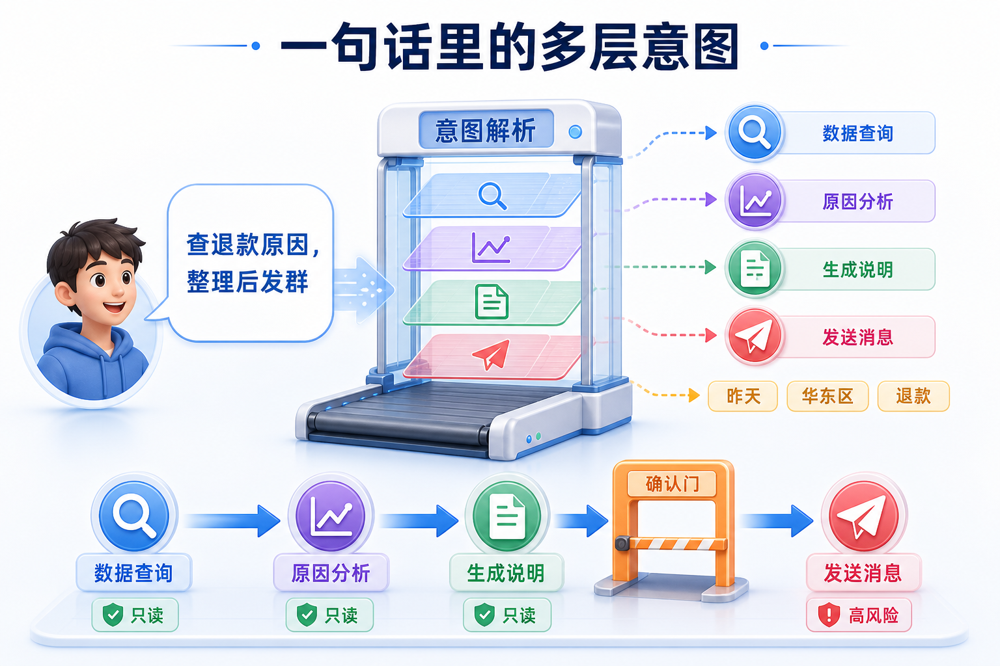
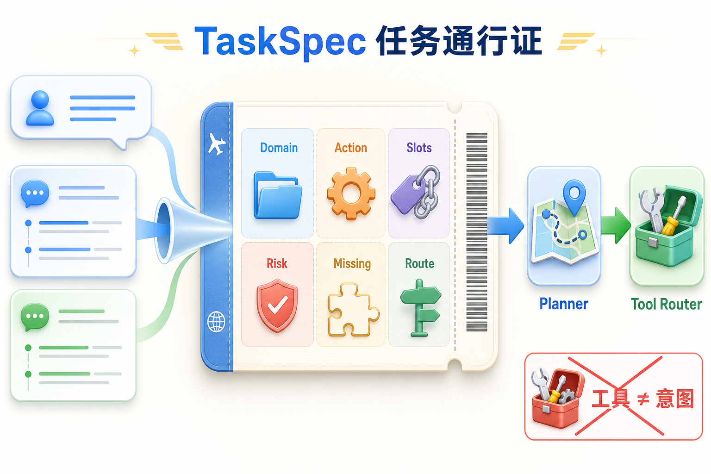
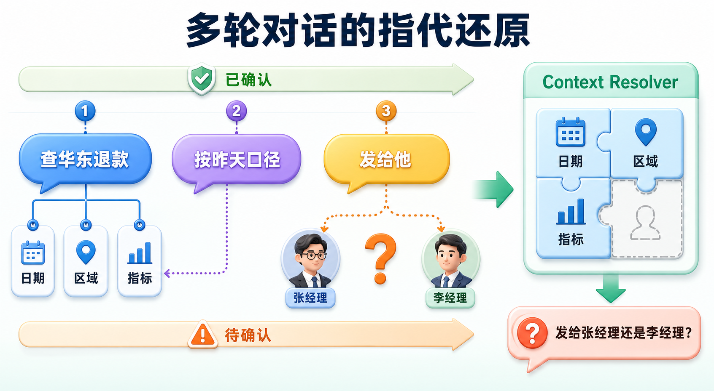
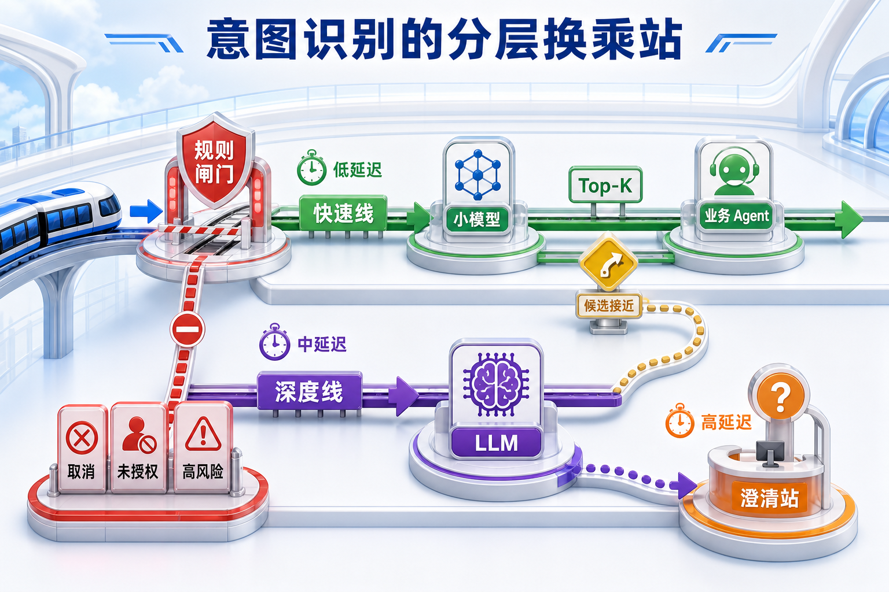
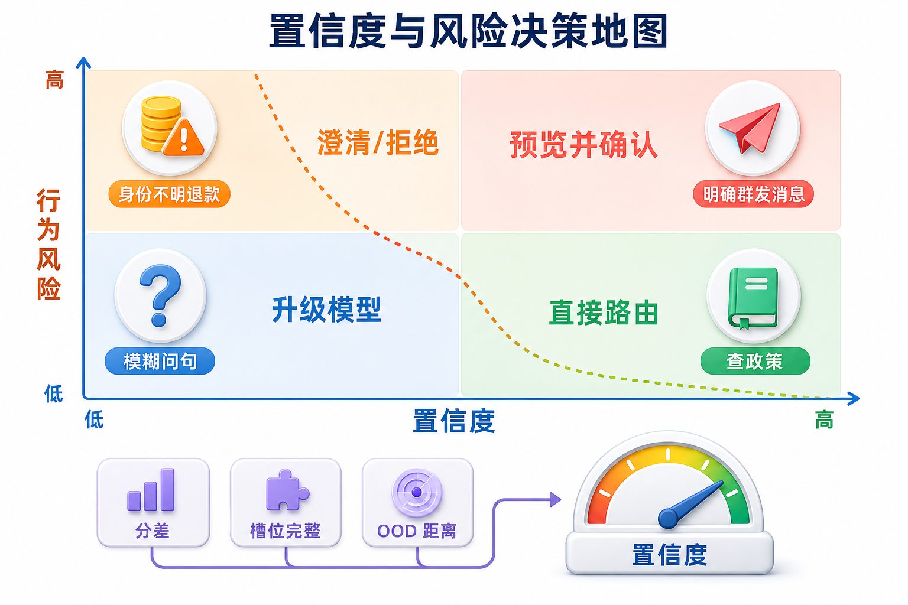
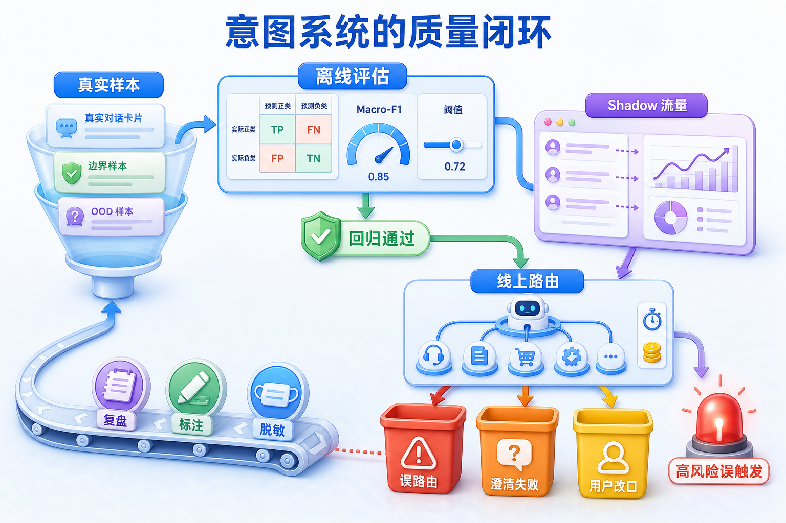

## **1. 题目分析**

Agent 里的意图识别经常被简单地做成一个分类器：知识问题走 RAG，查数据走 SQL，闲聊直接交给 LLM。这个思路在简单的问答机器人里还能用，但一旦 Agent 开始处理多步骤任务，单个标签很快就不够了。

比如用户说“把昨天华东区退款上涨的原因查一下，整理成一段说明发给运营群”，这句话里至少包含数据查询、原因分析、内容生成和外部发送四个动作，还有“昨天”“华东区”“退款”这些关键参数。最后一步会产生真实的外部影响，风险也和前面的只读操作完全不同。如果系统最后只得到一个 `data_analysis` 标签，后续执行仍然不知道先做什么、缺什么信息、哪一步需要确认，这次识别其实只完成了一小部分。

面试官问意图识别怎么做，真正关心的也不是用了哪个模型做分类，而是自然语言如何变成一份可校验、可路由、可追踪的任务描述。意图识别是 Agent 的控制入口：识别对了，Planner 和工具调用才有可靠输入；识别错了，再强的模型、再完善的工具也只是在更高效地做错事。



### **1.1 先定义识别结果**

工程上最先做的不是挑模型，而是定义“识别完成”究竟要产出什么。一个可执行的识别结果通常会被组织成结构化的 `TaskSpec`，核心字段包括：对话行为、业务域、动作、实体与槽位、子任务、风险等级、缺失信息、候选路由以及版本号。例如，上面的请求可以得到下面这份简化结果：

```json
{
  "dialogue_act": "request",
  "domain": "refund_operations",
  "subtasks": ["query", "analyze", "compose", "send"],
  "slots": {"date": "昨天", "region": "华东区", "metric": "退款"},
  "missing_slots": ["target_group"],
  "risk": "external_write",
  "route": "operations_agent"
}
```

这里有两个边界很重要。第一，意图不等于工具。`query` 表示用户要查数据，至于是调 SQL、指标平台还是 RAG，由后面的工具路由根据数据源、权限和可用性决定。如果每新增一个工具就新增一个意图，标签体系很快就会失控。第二，意图识别不负责把全部执行计划一次想完，它只提供可靠的任务契约；复杂任务如何分解、并行和重试，交给 Planner。这样识别、规划、执行三个阶段可以分别评估，也更容易定位问题。

意图体系本身通常采用分层设计。第一层是稳定的大类，例如知识查询、数据操作、内容生成、外部动作和会话控制；第二层才是具体业务动作。确认、取消、纠正、补充信息这类 `dialogue_act` 单独建模，因为一句“对，就按这个发”脱离当前待确认状态根本无法理解。体系还必须保留 `unknown` 或 `out_of_domain`，宁可承认没识别出来，也不能把所有输入强塞进最接近的已知标签。



### **1.2 先把当前这句话还原完整**

线上最难的输入往往不是完整句子，而是“还是按昨天那个口径”“就发给他吧”“不用发了”这样的续接、指代和改口。只拿最后一句做分类，准确率再高也没有意义。因此请求进入分类器之前，必须先做上下文解析：读取最近几轮对话、当前任务状态、待确认动作、已填槽位以及用户权限，把省略和指代还原成一条自包含请求，同时保留原始输入方便审计。

这一步不能变成无节制地塞历史记录。系统只取与当前任务相关的状态，并区分事实、模型推断和用户明确确认的信息。像“他”可能对应两个人时，不能由模型悄悄选一个，而要把 `target_user` 标成缺失槽位并追问。用户说“不要发了”时，会话控制意图的优先级要高于原来的发送计划，立即撤销待执行动作。



### **1.3 用分层路由控制成本和误判**

所有请求都交给一个大模型做自由判断，开发起来很快，但延迟、成本和稳定性都不好。生产环境中更稳妥的方案是级联式路由，让确定性高的请求走短链路，只有难例才逐级升级。

第一层是确定性闸门，处理取消、确认、权限校验、固定命令以及明确的安全边界。这些场景规则清楚，而且一旦误判代价很高，不应该完全依赖概率模型。第二层是轻量分类器，负责稳定、高频的闭集意图。意图数量较少时可以直接分类；数量较多时先用 Embedding 从意图说明和样例中召回 Top-K 候选，再让小模型在相近候选间判别。关键不只是给正例，还要为容易混淆的意图写清边界和反例，例如“查询退款政策”属于知识查询，“执行退款”属于资金操作。

第三层才是 LLM 语义路由，处理表达复杂、多意图、候选接近或新出现的请求。输入里只放经过检索的候选意图、必要上下文和严格 JSON Schema，要求输出候选排序、槽位和缺失项，而不是让模型自由发挥。结构校验失败可以有限重试，但不能无限循环。最后，如果仍然无法确定，就进入澄清或安全降级，而不是硬选一个标签。



### **1.4 多意图要拆，但不能在识别层执行**

真实请求经常包含多个动作。更合理的处理不是选一个“主意图”后丢掉剩余部分，而是输出有顺序和依赖关系的子任务。比如“查原因，整理后发群”中，查询必须先完成，分析依赖查询结果，内容生成依赖分析结论，发送又依赖目标群和用户确认。Planner 拿到这张小型任务图后，才能判断哪些步骤可并行、哪里需要补槽、哪里必须暂停。

这种解耦还有一个好处：识别结果可以先通过策略层检查。只读步骤即使路由略有偏差，通常还可以回退；发消息、下单、退款、删除数据等动作则必须经过权限校验、参数预览和显式确认。模型识别出“用户想做什么”，不代表系统已经获得“可以立刻做”的授权。

### **1.5 置信度不是模型自己报一个数字**

让 LLM 在 JSON 里填 `confidence: 0.93` 很方便，但这个数字通常没有经过校准，不能直接拿来控制生产行为。生产系统需要综合多种信号：闭集分类器的概率与 Top1、Top2 分差，输入到已知意图样例的语义距离，多个路由器的结果是否一致，必填槽位是否完整，当前请求是否落在训练分布外，以及规则校验有没有冲突。然后再用标注验证集校准阈值，观察不同阈值下的误路由和拒识成本。

阈值还要随风险变化。高置信度的知识查询可以直接执行；中等置信度的低风险请求可以先升级到更强模型；涉及外部写入时，即使意图很明确，也要展示将要执行的动作并确认；低置信度或 OOD 请求则提出一个信息增益最高的问题。好的澄清不是“请描述得更清楚”，而是“你要查询退款规则，还是执行一笔退款？”——一次问题就尽量切开最容易混淆的边界。



### **1.6 几个容易踩的坑**

这套系统最容易在标签设计阶段埋雷。意图颗粒度过粗，不同工作流挤在同一个标签里，识别结果无法执行；颗粒度过细，两个标签连标注人员都经常分不清，模型更不可能稳定判断。遇到长期混淆的标签，首先要检查它们是否真的对应不同用户目标。如果区别只在一个参数，就应该合并为同一意图并交给槽位表达，而不是继续堆标签。

另一个常见问题是把分类、规划、工具调用全部塞进一次 Prompt。这样演示时链路很短，线上出错后却无法判断是意图错了、参数漏了，还是工具选错了。还有一些系统只在模型升级时重跑普通测试集，却没有保留用户否定、话题切换和相邻意图反例，结果总体分数变高，真正影响业务的边界错误反而增加。意图识别的重点从来不是让模型“总能给出一个答案”，而是让系统知道什么时候可以行动，什么时候必须停下来确认。

### **1.7 评估要看最终有没有走对路**

离线评估不能只看一个总体 Accuracy。意图分布通常很不均衡，常见意图会掩盖长尾错误，因此至少要看 Macro-F1、关键意图召回率、混淆矩阵、OOD 拒识率、槽位 F1 和意图加槽位的联合正确率。对资金、删除、外发这类意图还要单独统计误触发率，因为一次错误执行的代价可能远高于多问一次。

测试集除了常规样本，还要专门覆盖相邻意图的 hard case、多轮省略与指代、一个请求包含多个动作、用户中途纠正、越权请求和完全没见过的新意图。数据划分时尽量按用户或任务隔离，避免同一种表达同时出现在训练集和测试集里，得到虚高结果。

线上真正关心的是错误路由率、澄清后的任务成功率、用户改口或撤销率、工具调用成功率、端到端延迟和单次请求成本。一条完整的 Trace 需要记录原始输入、上下文解析、候选意图、最终路由和工具结果，对敏感信息做脱敏，再把用户纠正和失败链路沉淀成新的 hard case。每次修改标签、Prompt、模型或阈值，都要跑同一套回归集，并先通过 shadow 流量观察，避免局部准确率上升却让高风险误触发变多。



回到开头的例子，系统会先补全“昨天”的实际日期和“华东区”的业务口径，再识别出查询、分析、生成、发送四个有依赖的子任务。前三步可以在权限允许时执行，系统生成说明预览后，因为目标群尚未确定且最后一步属于外部写入，会追问目标并请求确认。假如用户这时说“只分析，不用发”，会话控制层会撤销发送节点，而不是继续沿用旧计划。这条完整链路，才是生产环境里真正可用的意图识别。

***

## **2. 参考回答**

我们没有把意图识别做成一次简单的 LLM 分类，而是把它作为 Agent 的控制入口。请求进来后，先结合最近几轮对话、当前任务状态和已填槽位做上下文补全，解决省略和指代；然后走分层路由：取消、确认、权限和高风险边界由规则处理，高频闭集意图用轻量分类器，标签较多时先用 Embedding 召回 Top-K，候选接近、多意图或表达复杂的请求再升级给 LLM，通过固定 Schema 输出业务域、动作、槽位、缺失项、子任务和风险。识别层只产出 `TaskSpec`，Planner 负责分解任务，Tool Router 再选具体工具。

低置信度时我们不直接相信模型自报的分数，而是综合 Top1、Top2 分差、语义距离、槽位完整度、路由器一致性和 OOD 信号，并按风险设置阈值。只读查询可以放行或升级模型，发消息、退款、删除等外部写入即使高置信度也要预览和确认。离线看 Macro-F1、关键意图召回、OOD 拒识、槽位联合正确率和高风险误触发，线上看错误路由、澄清后的任务成功率、用户改口率、延迟和成本，并持续把真实误判加入回归集。核心就是让模型负责理解，让策略层决定能不能执行。

<div style="background-color: #f0f9eb; padding: 10px 15px; border-radius: 4px; border-left: 5px solid #67c23a; margin: 20px 0; color:rgb(64, 147, 255);">

## <span style="color: #006400;">**学习交流**</span>
<span style="color:rgb(4, 4, 4);">
> 如果您觉得文章有帮助，可以关注下秀才的<strong style="color: red;">公众号：IT杨秀才</strong>，后续更多优质的文章都会在公众号第一时间发布，不一定会及时同步到网站。点个关注👇，优质内容不错过
</span>


<div style="text-align: center; margin-top: 22px; padding-top: 20px; border-top: 1px solid #c2e7b0;">
<div style="color: #006400; font-size: 20px; font-weight: bold;">🔥 配套实战项目，拆得开、跑得起、能写进简历</div>
<div style="color: red; font-size: 16px; font-weight: bold; margin-top: 8px;">多 Agent 编排 + RAG 混合检索 · 31 篇深度教程 + 50+ 面试题</div>
<a href="/projects/dev-support.html" style="display: inline-block; margin-top: 14px; background: #ff7a18; color: #fff; font-size: 18px; font-weight: bold; padding: 10px 28px; border-radius: 24px; text-decoration: none;">点击查看 DevSupport AI 实战项目 →</a>
</div>
</div>
