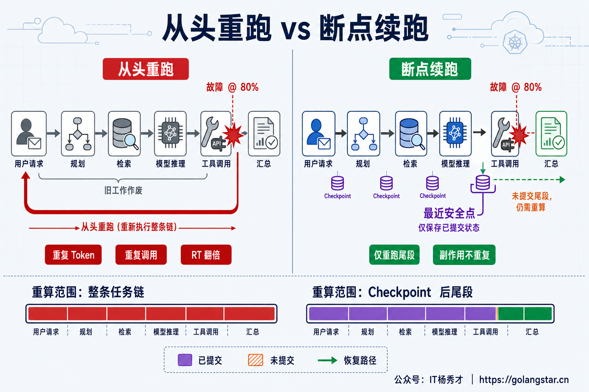
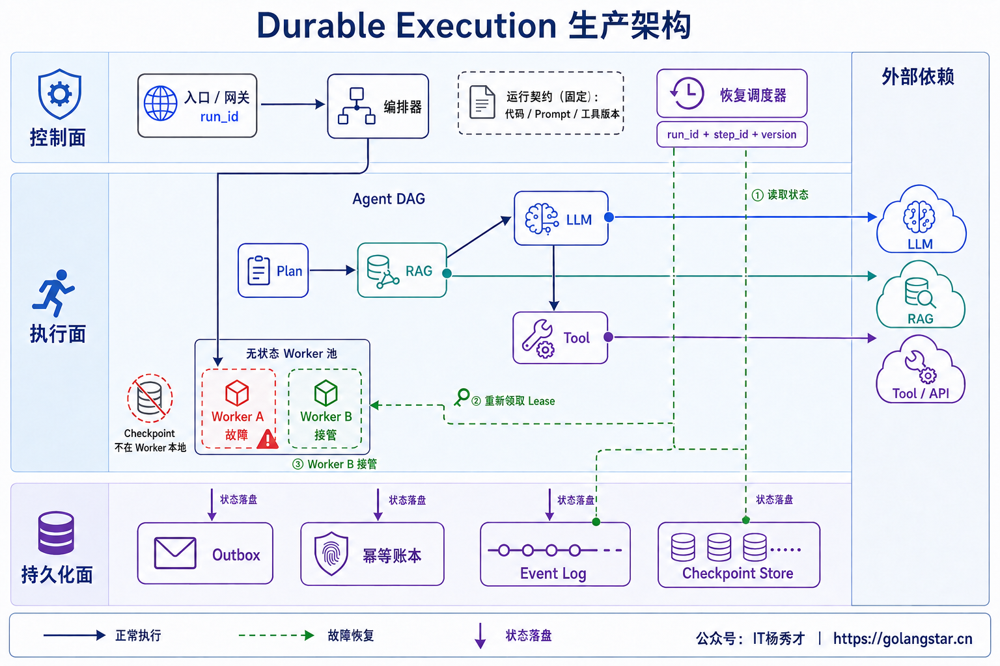
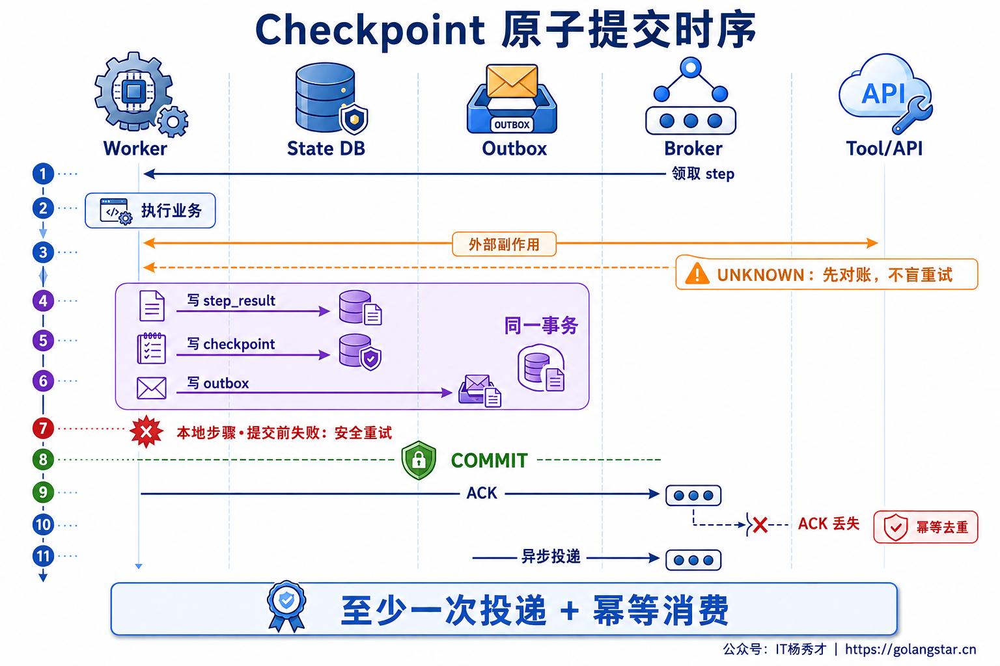
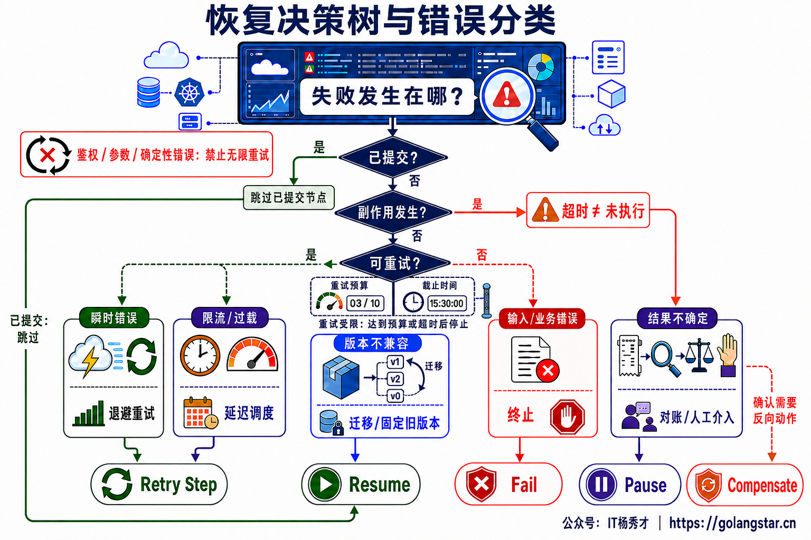
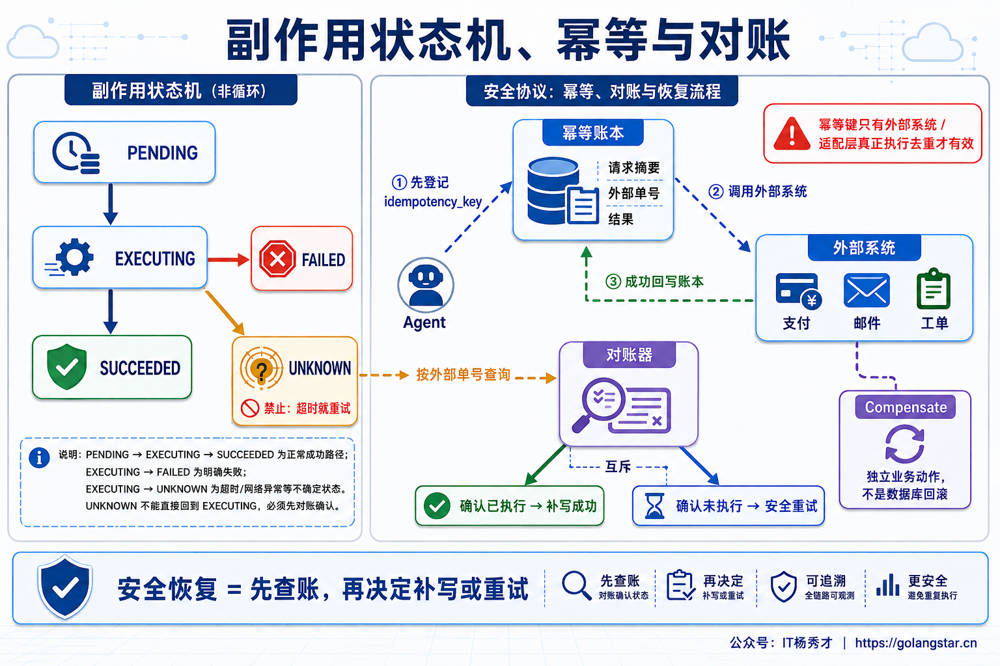
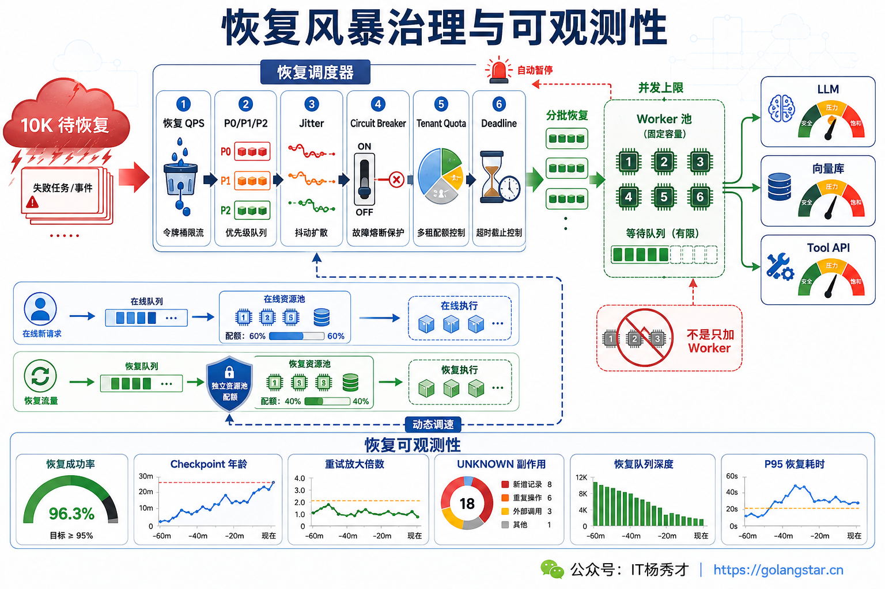

## **1. 题目分析**

一个 Agent 花了 35 分钟完成规划、三轮检索、多个模型调用和外部工具操作，却在最终汇总前因 Worker 重启而失败。如果任务只存在进程内存里，重试就只能从第一步开始：前面的 Token、检索和工具调用全部重新付费，用户再等 35 分钟；更危险的是，已经成功发送的邮件、创建的工单或提交的订单还可能被执行第二次。

解决思路不是把整个进程“冻住再恢复”，而是把长任务改造成 **Durable Execution**。控制流被表达成可重放的状态机或 DAG，每个节点的输入、结果和推进位置在语义安全点持久化。故障后只从最近一个已经提交的 Checkpoint 恢复；尚未提交的尾段允许重算，但重复执行必须得到相同的业务结果。

因此，这道题真正考察的是三件事：进度能否可靠保存，恢复能否找到唯一且正确的下一步，外部副作用能否在至少一次执行下保持业务幂等。



### **1.1 把调用栈改造成持久化工作流**

普通同步代码依赖内存里的调用栈、局部变量和连接。一旦进程退出，这些信息全部丢失。可恢复 Agent 则要把执行事实外置：入口先创建稳定的 `run_id`，HTTP 或 SSE 只负责查询进度和接收事件，真正的任务由编排器投递给无状态 Worker。

一个可恢复的 Run 至少需要持久化这些信息：

```text
RunEnvelope = {
  run_id, tenant_id, conversation_id,
  current_node, completed_steps, attempt, deadline,
  input_hash, plan, remaining_budget,
  workflow_ver, prompt_ver, tool_schema_ver,
  model_policy_ver, index_ver, state_version,
  step_results, artifact_refs, side_effect_ledger
}
```

小状态可以写入事务数据库，长文档、模型结果和工具产物放对象存储，只在 Checkpoint 中保存内容哈希与不可变引用。Event Log 记录“发生过什么”，Snapshot 保存“当前状态是什么”，两者结合既能快速恢复，也能审计状态是怎样演进的。Trace 只用于观测，采样、过期或写入失败都不应改变业务状态，因此不能把 Trace 当成恢复依据。

工作流本身必须可重放。时间、随机数、网络请求、数据库查询、LLM 和 Tool 等非确定性操作要封装成独立节点，节点的已确认结果写入历史。恢复时，已完成节点读取结果而不是再次调用；控制逻辑根据同一份历史重新推导下一节点。LLM 单次生成通常无法从中间某个 Token 精确续算，可靠边界是“复用完整且已提交的模型输出”，不是恢复推理引擎里的半段生成状态。



### **1.2 Checkpoint 要落在语义安全点**

Checkpoint 不是每隔 30 秒把内存序列化一次。时间点可能正好落在 Tool 调用中间，恢复端仍然无法判断副作用是否发生。更合理的边界是一个业务节点已经得到可复用结果，并且该结果与下一步游标能够一起提交的位置。

典型安全点包括：规划完成后、一次昂贵 LLM 调用完成后、检索与 Rerank 结果确定后、外部副作用确认后、进入人工审批等待前，以及循环每轮结束后。粒度过粗会扩大故障后的重算范围；粒度过细又会增加序列化、存储和事务开销。可以按下面的期望成本选择边界：

```text
期望损失 ≈ 故障概率 × 未提交步骤的重算成本
Checkpoint 成本 ≈ 写入延迟 + 存储成本 + 一致性开销
```

昂贵且不可确定复现的步骤适合立即落盘，几毫秒的纯函数可以允许重算。Checkpoint 还必须包含当前节点、循环轮次、剩余 Token 与时间预算、审批状态、错误次数和版本信息，不能只保存一个百分比。`progress=80%` 无法证明前 80% 哪些步骤真的已经提交。

### **1.3 提交点必须原子**

仅仅“有 Checkpoint”还不够。如果节点结果已经写入，而下一步游标没有推进，恢复后会重复执行；如果游标先推进、结果后写入，恢复后又会跳过一个实际未完成的节点。

对于本地可事务化状态，应把 `step_result + checkpoint + next_state + outbox` 放进同一个数据库事务，提交成功后再 ACK 队列消息。提交前失败，消息可以安全重投；提交后 ACK 丢失，消费者根据 `run_id + step_id` 读取已提交结果并去重。Outbox Relay 再异步发布下一事件，避免“数据库提交成功但消息没发出去”的双写缺口。



这个设计提供的是“至少一次投递 + 幂等结果”，不是凭空得到 Exactly Once。远程 Tool、支付平台和邮件服务无法参加本地数据库事务，必须使用独立的副作用协议处理。

### **1.4 不同步骤采用不同恢复语义**

所有失败都统一 Retry，是长任务系统最危险的实现方式。恢复协调器需要同时检查节点提交状态、错误类型、副作用状态、Deadline 和 Retry Budget，再决定下一动作。

| 节点类型 | 恢复策略 |
| --- | --- |
| 已提交节点 | 直接读取已保存结果并跳过 |
| 纯函数计算 | 可从节点开头安全重放 |
| LLM 或 Rerank | 已完成结果持久化复用，未提交调用按预算重试 |
| 时效性查询 | 按运行契约决定复用快照或重新查询 |
| 瞬时网络错误、429 | 指数退避、Jitter、最大次数与绝对截止时间 |
| 参数、权限、业务校验错误 | 直接失败或进入人工处理，不能无限重试 |
| 外部结果 UNKNOWN | 先查询、对账，再决定补写、补偿或安全重试 |



尤其要避免把超时理解为“对方没有执行”。调用方没收到响应时，远端可能尚未开始，也可能已经成功。UNKNOWN 状态如果直接重试，恢复机制本身就会制造重复订单、重复消息或重复工单。

### **1.5 副作用需要幂等账本和对账**

有副作用的节点应在调用前生成稳定的 `idempotency_key = hash(run_id, step_id, logical_iteration, input_hash)`，并在账本中记录请求摘要、状态、外部单号和结果。状态至少区分 `PENDING → EXECUTING → SUCCEEDED / FAILED / UNKNOWN`，不能用一个布尔值表示成功与否。

外部系统支持幂等键时，同一个 Key 的重试必须返回原结果；不支持时，需要通过业务唯一键、去重表或适配层实现。请求超时后先按幂等键或外部单号查询：确认已经执行，就补写成功状态；确认没有执行，才允许安全重试；无法确认则暂停 Run，进入对账或人工队列。



补偿也不是数据库回滚，而是一笔新的业务动作。例如“撤销工单”“退款”“发送更正消息”都可能再次失败，需要自己的幂等键、状态和审计记录。只有把副作用当成显式状态机，恢复逻辑才不会把“不确定”错误地处理成“未发生”。

### **1.6 恢复需要唯一所有者**

Worker 崩溃通常通过 Lease 与 Heartbeat 被发现。新 Worker 在租约过期后领取任务，并获得单调递增的 `epoch`。此后每次 Checkpoint 和最终写回都携带 Fencing Token，存储层只接受当前 Epoch。旧 Worker 即使网络恢复后继续提交，也会被 CAS 拒绝。

Lease 只决定“谁当前有资格工作”，并不能阻止旧进程继续运行；Visibility Timeout 只让消息可以重新投递，也不等于互斥。可靠组合是 `Lease + Heartbeat + Epoch/Fencing + 幂等提交`。恢复协调器还要周期扫描长时间无心跳、无终态的 Orphan Run，并在接管前确认旧租约已经失效。

运行契约同样需要固定版本。恢复时使用原来的 Workflow、Prompt、Tool Schema、模型策略和索引版本，或者先通过显式 Migrator 把旧 Checkpoint 转成新结构。Temporal 会用 Event History 重放确定性 Workflow，并复用已完成 Activity 的结果；LangGraph 通常从失败节点开头恢复，旧 Thread 还可能加载最新 Graph。两者都不会自动解决 Tool 副作用与版本兼容。

### **1.7 防止恢复风暴**

一个 Worker 失败只影响少数任务，整个机房、模型 Provider 或数据库抖动后，却可能同时出现上万条待恢复 Run。如果依赖刚恢复就让所有任务立即重试，旧库存会与在线请求争抢 LLM TPM、向量库连接和 Tool 配额，再次把系统压垮。

恢复流量应进入独立 Lane，设置恢复 QPS、全局并发上限、租户配额、优先级和 Deadline；在线新请求保留独立容量。重试使用指数退避与 Jitter 打散，依赖错误率重新升高时由 Circuit Breaker 暂停恢复。扩 Worker 前先核算最窄下游，而不是把队列更快地推向 LLM 429 或数据库连接池。



监控不能只看“任务最终成功”。至少要观察从头重跑率、恢复成功率、恢复耗时 P95、Checkpoint 写入延迟与年龄、重复节点数、重复 Token 和成本、Lease 接管次数、Orphan Scan Lag、版本迁移失败、UNKNOWN 副作用、重试放大倍数和恢复队列最老年龄。`run_id`、`step_id` 放 Trace 与日志，避免作为时序指标标签造成高基数。

### **1.8 用故障注入验收恢复协议**

断点续跑必须通过故障注入证明，而不是在代码评审里推断正确。测试要覆盖每个节点的提交前和提交后：Worker 在 Tool 成功但回执丢失时被 `kill -9`；数据库 COMMIT 成功但 ACK 丢失；Lease 过期后旧 Worker 恢复；同一消息重复投递；Checkpoint 跨版本加载；对象存储短暂不可用；大量 Worker 同时失联后批量恢复。

验收不只检查 Run 是否变成 `SUCCEEDED`，还要验证已提交的昂贵节点没有重算、外部副作用只有一个业务结果、旧 Epoch 写回被拒绝、恢复仍受原 Deadline 与预算限制、用户可以通过 `task_id` 查询进度并在 SSE 重连后回放已确认事件。

长任务断点续跑的本质，不是保证每一行代码恰好执行一次，而是让每个业务步骤都有可证明的提交边界。执行可以重复，已提交的进度不能丢；消息可以重复，业务结果不能重复；机器可以更换，Run 的状态和版本契约必须连续。

***

## **2. 参考回答**

这类问题我不会靠把整个 Agent 再重试一次，而会把它改造成可持久化工作流。按 Planner、检索、LLM、Tool 和人工审批拆成独立节点，节点完成后原子保存结果、下一节点、Checkpoint 和 Outbox；Worker 挂掉时只加载最新已提交状态，已完成的昂贵步骤直接复用。LLM、数据库和外部 API 封装成独立 Activity，并把随机输出及 Prompt、模型、Tool Schema、索引版本写进运行契约。

恢复按至少一次执行设计。每个逻辑步骤使用稳定 `step_id` 和幂等键；调用可能成功但回执丢失时标记 UNKNOWN，先向下游查询或等待 Webhook 对账，不能换 Key 盲目重试。Worker 用 Lease 检测活性，再用递增的 Fencing Token 拒绝过期 Worker 写回；瞬时错误采用受次数、Deadline、Token 和成本预算约束的退避重试，永久错误转人工，已发生的跨系统副作用走 Saga 补偿。最后通过恢复成功率、重复成本、恢复 P95、UNKNOWN 积压和重试放大率验收，并重点注入“外部成功后、本地落库前崩溃”故障，要求重复副作用与旧租约提交都为零。

<div style="background-color: #f0f9eb; padding: 10px 15px; border-radius: 4px; border-left: 5px solid #67c23a; margin: 20px 0; color:rgb(64, 147, 255);">

## <span style="color: #006400;">**学习交流**</span>
<span style="color:rgb(4, 4, 4);">
> 如果您觉得文章有帮助，可以关注下秀才的<strong style="color: red;">公众号：IT杨秀才</strong>，后续更多优质的文章都会在公众号第一时间发布，不一定会及时同步到网站。点个关注👇，优质内容不错过
</span>


<div style="text-align: center; margin-top: 22px; padding-top: 20px; border-top: 1px solid #c2e7b0;">
<div style="color: #006400; font-size: 20px; font-weight: bold;">🔥 配套实战项目，拆得开、跑得起、能写进简历</div>
<div style="color: red; font-size: 16px; font-weight: bold; margin-top: 8px;">多 Agent 编排 + RAG 混合检索 · 31 篇深度教程 + 50+ 面试题</div>
<a href="/projects/dev-support.html" style="display: inline-block; margin-top: 14px; background: #ff7a18; color: #fff; font-size: 18px; font-weight: bold; padding: 10px 28px; border-radius: 24px; text-decoration: none;">点击查看 DevSupport AI 实战项目 →</a>
</div>
</div>
