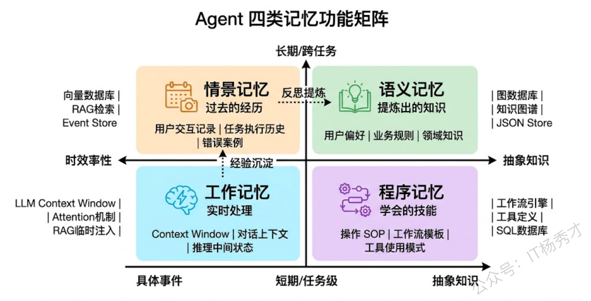
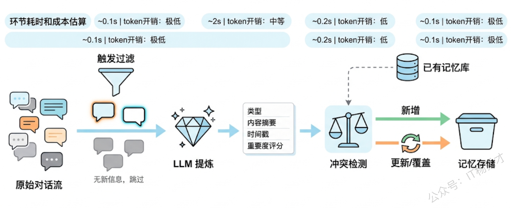
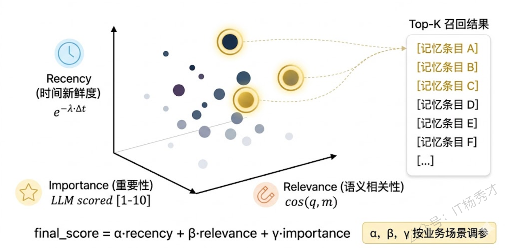
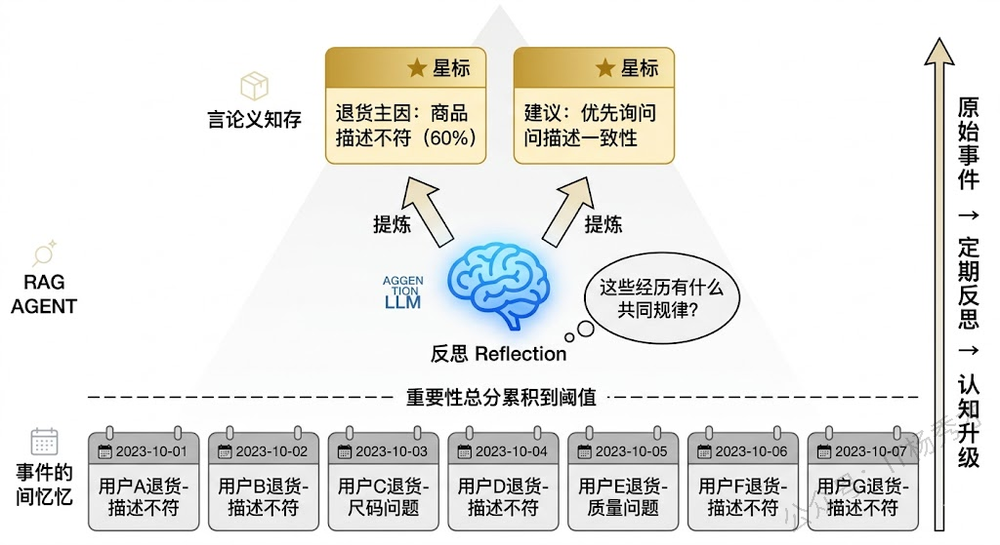
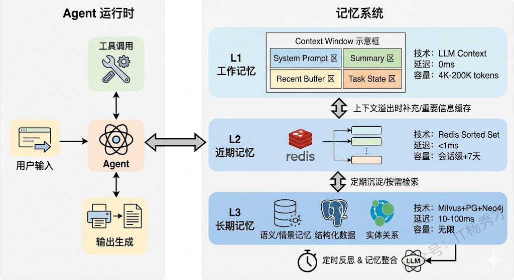
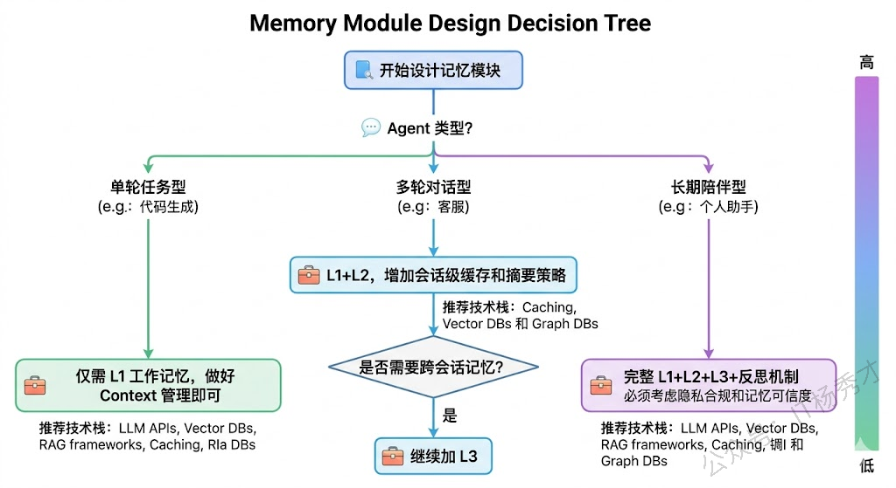

##  **1. 题目分析**

大多数 Agent 的 Demo 都不需要记忆——跑一段 ReAct 循环，调几个工具，输出结果，完事。但一旦进入真实业务场景，你会发现没有记忆的 Agent 几乎不可用：它记不住用户五分钟前说过的偏好，会反复犯同一个错误，每次对话都像第一次见面。**记忆模块的设计水平，很大程度上决定了一个 Agent 从"能用"到"好用"的跨越。**

这道题的有意思之处在于，它问的是"你一般会怎么设计"，而不是"记忆模块有哪些类型"。面试官想听的是你的设计思路和工程决策过程——面对一个具体的 Agent 项目，你脑子里的设计框架是什么，你会从哪几个维度去思考，不同场景下你会做怎样的取舍。

###  **1.1 Agent 需要记住什么？**

设计记忆模块的第一步，不是急着选向量数据库或者翻 LangChain 文档，而是先想清楚：这个 Agent 到底需要记住什么？不同类型的信息，存储和检索的方式完全不同。我一般把 Agent 需要记住的信息分成四类，这个分类直接决定了后续的技术架构：

**工作记忆（Working Memory）**——当前任务正在处理的信息。比如多轮对话的上下文、当前推理链条的中间状态、刚从工具返回的结果。这类信息的特点是高频读写、生命周期短，通常随任务结束而清除。对应到技术上，就是 LLM 的 Context Window。

**情景记忆（Episodic Memory）**——Agent 过去经历过的具体事件。比如"上周帮用户 A 查过一次航班，他偏好靠窗座位"、"昨天调用某个 API 超时了三次，后来换了备用接口才解决"。这类记忆带有时间戳和具体场景，检索时通常需要按相似场景匹配。

**语义记忆（Semantic Memory）**——从经验中提炼出的通用知识和规则。比如"这个用户喜欢简洁风格"、"调用支付接口前必须先做幂等校验"。和情景记忆的区别是，语义记忆已经脱离了具体事件，变成了抽象的认知。

**程序记忆（Procedural Memory）**——Agent 学会的操作流程和技能。比如"处理退款请求的标准流程是：验证订单→检查退款政策→计算退款金额→调用退款接口"。这类记忆通常以结构化的 SOP 或 workflow 形式存在。

这四类记忆不是割裂的，而是有明确的流转关系：工作记忆中的重要片段会沉淀为情景记忆，多次情景记忆经过反思和提炼会升级为语义记忆，反复执行的操作模式会固化为程序记忆。理解这个流转关系，才能设计出合理的记忆写入和提升机制。

### **1.2 记忆的写入**

记忆系统最容易踩的坑是"全量记录"——把每轮对话原封不动地扔进数据库。这样做的后果是记忆库迅速膨胀，检索时噪音太多，真正有用的信息被淹没。

好的记忆写入应该是一&#x4E2A;**"感知→判断→提炼→存储"**&#x7684;流水线。

### **1.3 记忆的检索**

写入解决的是"记什么"，检索解决的是"想起什么"。检索策略的好坏直接决定了 Agent 是"记忆力好"还是"记忆力差"。

最朴素的做法是纯向量相似度检索——把当前 query embedding 之后去向量库里找最近邻。但在实际场景中，光靠语义相似度远远不够。斯坦福那篇经典的 Generative Agents 论文给出了一个非常优雅的三维评分模型，在实际项目中也可以沿用这个思路：

**Recency（时近性）**——越近的记忆越容易被想起。人类如此，Agent 也应该如此。实现上通常用指数衰减函数：距离当前时间越远的记忆，分数衰减越多。这保证了 Agent 在近期行为上的连贯性，不会突然跳回一个月前的上下文。

**Relevance（相关性）**——和当前任务语义上越相关的记忆越应该被召回。这就是向量相似度检索擅长的部分。通过 Embedding 模型将 query 和记忆条目都映射到同一个向量空间，用余弦相似度衡量相关程度。

**Importance（重要性）**——有些记忆本身就比其他的更重要，不管它是否是近期的、是否和当前 query 直接相关。比如"用户是 VIP 客户"这条信息可能在很多场景下都应该被召回。重要性评分通常在记忆写入时由 LLM 打分确定，也可以根据该记忆被引用的频率动态调整。

最终的检索得分是三者的加权组合：`score = α × recency + β × relevance + γ × importance`。三个权重可以根据具体业务场景调整——比如客服场景下 recency 权重高一些（用户最近说的最重要），知识问答场景下 relevance 权重高一些。

实际工程中，这个评分模型还可以叠加一些额外策略来进一步优化检索质量。比如**元数据预过滤**——在做向量检索之前，先按用户 ID、记忆类型、时间范围等结构化字段筛掉一大批不相关的条目，缩小搜索空间。再比如**二阶段检索**——第一阶段用向量相似度从大库中粗召回 Top-50，第二阶段用交叉编码器（Cross-Encoder）对这 50 条做精排，最终取 Top-5 注入上下文。这种"粗召回 + 精排"的模式在 RAG 中已经非常成熟，直接搬到记忆检索上效果也很好。

### **1.4 记忆的反思与整合**

到目前为止，我们的记忆系统能存、能取了，但还缺一个关键能力——**反思（Reflection）**。

纯粹的事件记录（情景记忆）会让记忆库越来越庞大，但 Agent 的认知水平却没有真正提升。就像一个人经历了一百次客户投诉但从来不总结规律，他处理第一百零一次投诉时不会比第一次强多少。

反思机制的核心思路是：定期让 LLM 回顾最近积累的情景记忆，从中提炼出更高层次的认知洞察，存入语义记忆。Generative Agents 的做法是设定一个触发阈值——当近期情景记忆的重要性总分累计超过某个阈值时，触发一次反思。反思时，LLM 会对最近的 N 条记忆提出"从这些经历中能得出什么更高层次的结论？"这样的元认知问题，输出的结论作为新的语义记忆存入系统，且重要性评分通常较高。

这不只是一个学术上的花哨设计，它在实际工程中有非常具体的价值。举个例子：一个客服 Agent 在过去一周处理了五十个退货请求，其中三十个都是因为"商品描述和实物不符"。如果只有情景记忆，Agent 面对下一个退货请求时需要从五十条记忆中逐一检索相关案例。但如果有反思机制，Agent 早就总结出了"退货的主要原因是商品描述问题，优先询问是否存在描述不符的情况"这条语义记忆，处理效率和准确度都会大幅提升。

另一个重要的整合操作是**记忆合并与去重**。随着时间推移，记忆库中可能存在大量高度相似的条目——比如多次记录了"用户喜欢 Python"的略微不同的表述。定期用 LLM 对记忆库做聚类和合并，能有效控制记忆规模并提升检索效率。

还有一种容易被忽略的整合操作是**记忆的遗忘**。人会遗忘不重要的信息，Agent 的记忆系统也需要主动遗忘机制，否则历史噪音会越积越多。常见的做法是给每条记忆设置一个衰减系数，长期未被访问的记忆逐渐降低可见度，最终被归档或删除。另一种更精细的方式是让 LLM 定期审视记忆库，主动标记那些已经过时或者被后续事件推翻的记忆——比如某条"用户使用的是旧版 API"的记忆，在系统全面升级新版后就应该被清理掉。

### **1.5 落地架构**

把上面的设计思路落到工程上，我通常采用一个三层架构来组织记忆系统：

> **L1：工作记忆层**——就是 LLM 的 Context Window。这一层的核心设计决策是上下文管理策略。对于大多数场景，我会用"摘要 + Buffer"的混合策略：保留最近 3-5 轮的原始对话，更早的历史做摘要压缩。如果任务涉及多步推理，还需要在 Context 中维护一个结构化的"当前状态"字段（比如 JSON 格式的 task\_state），方便 LLM 快速理解当前进度。

> **L2：近期记忆层**——用 Redis 这类内存存储承载当前会话的完整历史和近期（比如过去 7 天）的高频记忆。这一层的作用是在 L1 的上下文窗口不够用时，提供快速的补充检索。数据结构上，我一般用 sorted set 按时间排序存储，支持快速的范围查询。

> **L3：长期记忆层**——真正的持久化存储。这一层通常需要多种存储引擎配合：向量数据库（Milvus/Chroma）存语义记忆和情景记忆，支持相似度检索；关系型数据库（PostgreSQL）存结构化的用户画像和业务数据，支持精确查询；如果业务涉及复杂实体关系，再引入知识图谱（Neo4j）。三维评分检索主要发生在这一层。

三层之间的数据流向是双向的：任务执行中的重要信息从 L1 向 L2、L3 逐层沉淀；新任务开始时，从 L3 检索的相关记忆会被加载到 L1 的上下文中。反思机制定时作用于 L3，将情景记忆提炼为语义记忆。

### **1.6 设计中的几个关键取舍**

最后聊几个实际做记忆系统时经常要面对的工程取舍。

**记忆粒度的取舍**。记得太细（逐句存储），记忆库膨胀快、检索噪音大；记得太粗（只存高度概括的结论），丢失了具体细节，Agent 在需要回忆细节时无能为力。我的经验是分两级存：一级是提炼后的摘要条目用于日常检索，二级是原始对话记录作为归档，只在需要追溯细节时才去查。

**个性化与隐私的平衡**。记忆模块天然涉及用户数据存储，在 To C 场景下必须考虑隐私合规。需要给用户提供查看、修改和删除自己记忆的能力，同时在存储层面做好数据隔离和加密。GDPR 的"被遗忘权"在 Agent 记忆系统中不只是合规要求，也是产品体验的一部分。

**记忆的可信度**。LLM 提炼的记忆条目不一定准确——它可能误解了用户意图，也可能在摘要过程中丢失了关键限定条件。在高风险场景（比如医疗、金融），需要对 LLM 生成的记忆条目做额外的校验，或者允许用户确认和修正。一种实用的做法是给记忆条目标注置信度等级，LLM 自动提炼的标为"低置信"，经过用户确认的标为"高置信"，检索时对高置信记忆给予更高权重。

***

## **2. 参考回答**

我设计 Agent 的记忆模块时，会先从功能需求出发把要记住的信息分成四类：工作记忆是当前任务的上下文和推理状态，情景记忆是 Agent 经历过的具体事件，语义记忆是从事件中提炼出的通用规则和知识，程序记忆是固化的操作流程。这四类信息的存储和检索方式完全不同，分类清楚了架构自然就出来了。

在写入侧，我不会全量记录，而是走一条"过滤→提炼→冲突检测→存储"的流水线。只有包含新信息的对话才触发写入，然后用 LLM 提炼成结构化的记忆条目，写入前还会和已有记忆做冲突检查，防止出现自相矛盾的情况。检索侧我借鉴 Generative Agents 的思路，用时近性、相关性、重要性三个维度加权打分，不是单纯找最相似的，而是综合考虑记忆的新旧、语义匹配度和固有重要性。三个权重可以按业务场景调——客服场景 recency 权重高，知识问答场景 relevance 权重高。

整体架构上我采用三层设计：L1 工作记忆层就是 Context Window，用摘要加 Buffer 的策略管理上下文；L2 近期记忆层用 Redis 承载会话缓存和近七天高频记忆；L3 长期记忆层用向量数据库加 PostgreSQL 配合，语义信息走 embedding 检索，结构化数据走精确查询。三层之间双向流动——重要信息逐层沉淀，需要时按需检索注入上下文。另外我还会在 L3 上跑定期反思，让 LLM 从积累的情景记忆中提炼更高层次的语义记忆，这样 Agent 不只是记住了发生过什么，还能真正从经验中学到东西。

## **学习交流**

> 如果您觉得文章有帮助，可以关注下秀才的<strong style="color: red;">公众号：IT杨秀才</strong>，后续更多优质的文章都会在公众号第一时间发布，不一定会及时同步到网站。点个关注👇，优质内容不错过

