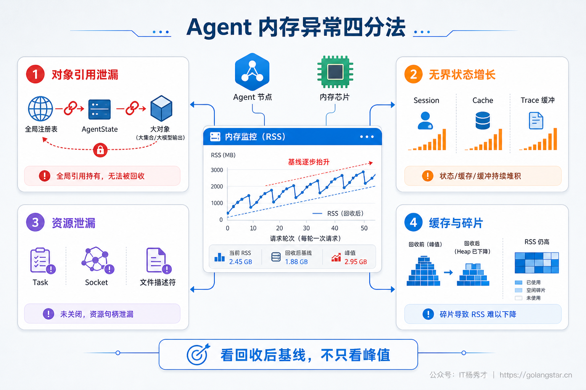
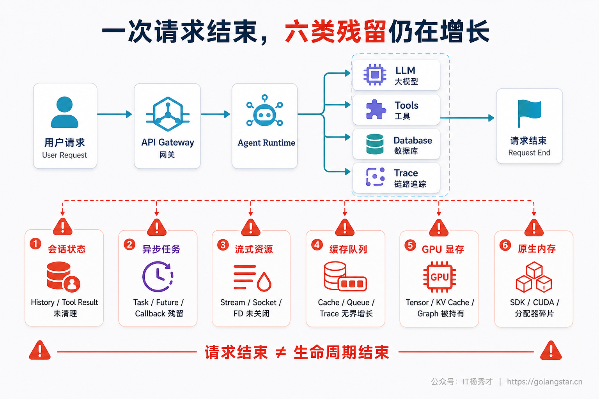
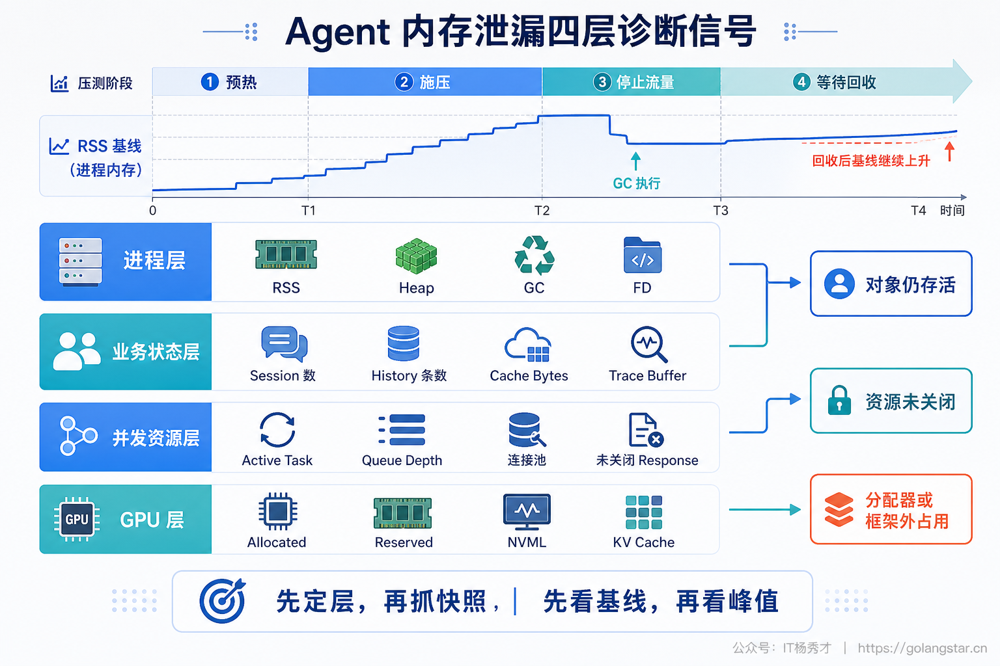
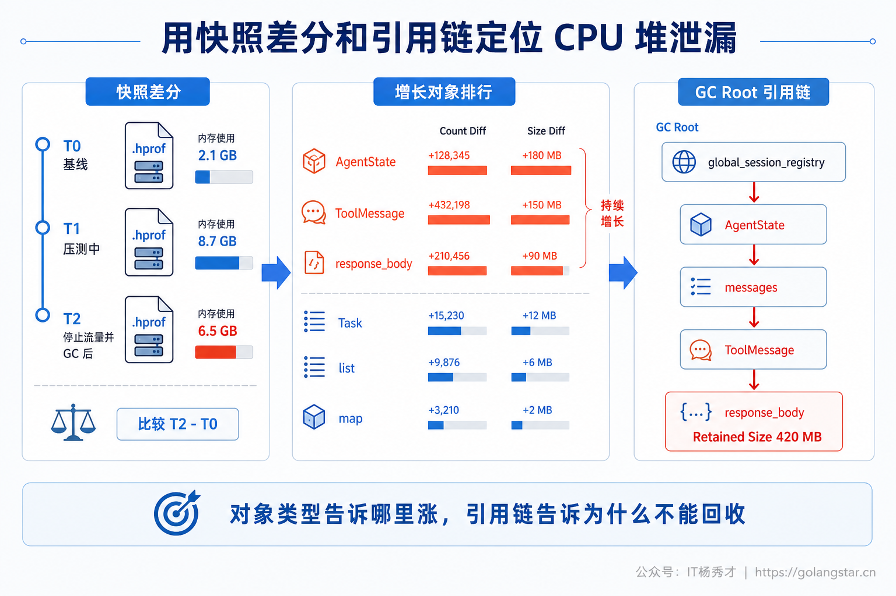
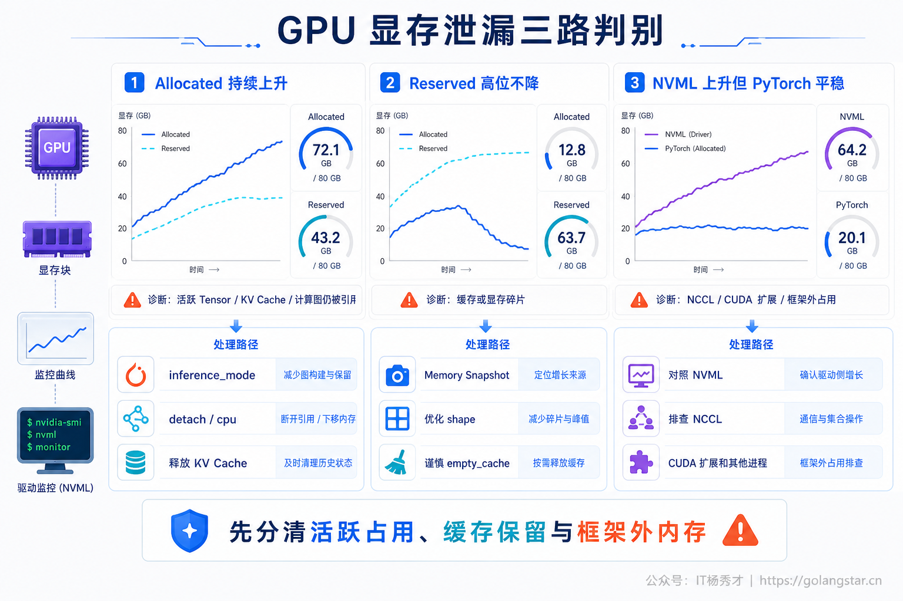
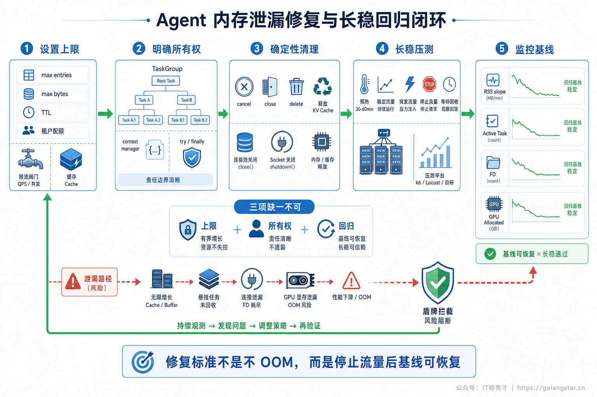

## **1. 题目分析**

生产环境里的内存泄漏，很少以一次突然的 OOM 作为开场。更常见的情况是：服务刚启动时只有几百 MB，运行几个小时后缓慢涨到几个 GB；流量高峰过去了，内存只回落一小部分；实例重启后暂时恢复正常，过一段时间又出现同样的问题。告警最先看到的是 RSS 持续抬升，但真正被留在进程里的，可能是对话历史、工具返回的大对象、没有结束的异步任务，也可能是 GPU Tensor、KV Cache 或底层分配器的缓存。

Agent 比普通 Web 服务更容易出现这类问题。一次请求不只是执行一段固定逻辑，而是会创建会话状态，循环调用 LLM 和工具，消费流式响应，写入 Trace，派生并行任务，还可能在 CPU 与 GPU 之间搬运数据。只要其中一个生命周期没有收口，请求结束后就会留下仍然可达的对象或仍然占用资源的句柄。高并发会把每次只残留几十 KB 的问题放大成稳定的内存斜率，最终变成频繁扩容、延迟抖动和 OOM 重启。

这类面试题的关键不在于列出几个工具名，而在于先把“内存为什么不回落”分清，再沿着指标、快照、引用链和资源生命周期逐步缩小范围。只有根因类型判断正确，修复动作才不会停留在定时重启、强制 GC 或调用 `empty_cache()` 这类临时缓解上。

### **1.1 内存增长不等于内存泄漏**

排查之前，首先要区分四种外观非常相似的问题。

第一种是真正的**对象引用泄漏**。业务已经不再需要某个对象，但全局容器、回调、闭包、未完成任务或对象关系仍然持有引用，垃圾回收器无法释放。典型现象是存活对象数量和堆快照中的 retained size 持续增长，执行完整 GC 后也不会明显下降。

第二种是**无界状态增长**。对象仍然“有用”，只是系统从未规定上限。例如会话 Map 没有 TTL、Agent Scratchpad 永久保留所有中间步骤、缓存只写不淘汰、Trace 队列没有容量限制。严格来说这不是垃圾回收器失效，而是数据生命周期设计错误，但在生产表现上与泄漏完全一致，也是 Agent 场景中最常见的一类。

第三种是**资源泄漏**。HTTP 流式响应、数据库游标、文件描述符、子进程管道或 WebSocket 没有关闭，资源对象连同读写缓冲区被保留下来。此时堆内存可能只是缓慢上涨，更明显的信号反而是 FD、连接池占用、Pending Task 和 Goroutine/Thread 数持续增加。

第四种是**分配器缓存或内存碎片**。对象已经释放，但 Python、glibc、jemalloc 或 PyTorch CUDA Caching Allocator 为了复用内存，没有立即把空闲页归还给操作系统或 GPU 驱动。此时 RSS 或 `nvidia-smi` 看起来居高不下，框架统计的活跃对象却已经回落。把这一类误判成引用泄漏，会造成大量无效排查。



判断是否存在泄漏，重点不是观察内存有没有上涨，而是观察**同等负载下的稳态基线是否一轮比一轮更高**。服务预热后上涨并稳定，通常是正常缓存；压测停止、任务完成并经过回收窗口后仍持续抬升，才说明请求结束后存在残留。

### **1.2 最常见的六类 Agent 内存泄漏**

Agent 的泄漏点可以沿着一次请求的生命周期来梳理，从会话进入、任务派生、工具执行、状态记录，一直到模型推理结束，最常见的根因主要有六类。

**第一类是会话历史和执行状态无限增长。** Agent 框架通常会维护 `session_id -> state` 的映射，State 中又包含消息历史、检索片段、工具参数、工具结果、附件内容和中间执行步骤。如果会话结束后没有删除，或者只按消息条数限制而不按字节数限制，一个返回几十 MB JSON 的工具就足以让单个会话长期占用大量内存。Multi-Agent 场景还会复制或派生多个子 Agent 状态，使同一份文档和上下文被重复保留。

这类问题经常藏在看起来合理的“调试能力”里。为了方便重放，系统把完整 Prompt、原始文档、模型响应、每一步 Observation 都挂在 Trace 或 Checkpoint 对象上；任务完成后，最终结果已经持久化，但运行时对象仍被内存中的会话注册表引用。请求量越大，注册表越像一个没有上限的内存数据库。

**第二类是异步任务、Future 和回调残留。** Agent 会并行执行检索、工具调用、模型请求和超时监控。通过 `create_task()` 创建的任务如果被放进集合却没有在完成后移除，集合就会永久持有 Task 及其结果、异常和协程栈。超时或客户端断开时，如果取消信号被吞掉、清理逻辑没有放在 `finally` 中，任务可能继续运行；回调或事件监听器重复注册却没有注销，也会通过闭包保留整条请求上下文。

**第三类是流式连接和外部资源没有关闭。** SSE、WebSocket 和 LLM Streaming 会让响应生命周期变长。手动进入流式模式后没有执行 `aclose()`，连接、响应缓冲和底层 Socket 都可能留在池中。数据库 Cursor、文件句柄、浏览器 Page、代码沙箱进程和临时文件同样存在这个问题。资源泄漏持续一段时间后，往往先触发连接池耗尽或 `too many open files`，随后才表现为内存异常。



**第四类是缓存、队列和可观测性缓冲区无界。** 语义缓存、Embedding 缓存、工具结果缓存和模型路由缓存如果没有最大条目、最大字节、TTL 与租户配额，命中率再高也会把服务拖垮。生产中更隐蔽的是队列积压：消费者速度低于生产者时，内存队列中的任务对象、附件和上下文会不断堆积。Trace、日志和指标 Exporter 也会在后端不可用时重试并缓存数据，如果 Batch Queue 没有硬上限，可观测性系统本身就会成为泄漏源。

**第五类是 GPU Tensor、计算图和 KV Cache 被错误持有。** 自部署模型或本地 Embedding/Rerank 服务中，常见问题包括把 GPU Tensor 直接放进 Python List 或会话对象、推理时没有关闭梯度、把带计算图的 Loss 或 Score 保存下来、请求结束后仍保留生成结果中的大 Tensor，以及动态批处理没有正确移除已完成序列。长上下文 Agent 还会产生较大的 KV Cache，如果会话缓存没有回收策略，显存会随着活跃会话数持续增长。

**第六类是原生库泄漏和碎片化。** Tokenizer、向量索引、图像解码、浏览器驱动、CUDA/NCCL 等组件可能在 Python 堆之外分配内存。此时 `tracemalloc` 看到的增长很小，进程 RSS 或 GPU 驱动统计却持续上涨。大量尺寸不同、生命周期不同的分配还会形成碎片，使空闲空间无法满足新的连续分配。单看 Python 对象数量，很容易把排查方向带偏。

这六类问题并不是互斥的。一个超时的工具任务可能同时保留 Task、HTTP Response、Trace Span 和一块 GPU Tensor，因此排查时不能只盯着某一张堆快照，需要把业务状态、运行时资源和设备内存放在同一条时间线上观察。

### **1.3 先用指标判断泄漏在哪一层**

有效排查通常从一组可重复的负载实验开始，而不是直接在线上进程里翻对象。先固定模型、Prompt、工具返回和并发度，依次经历“预热、稳定施压、停止流量、等待回收”四个阶段，至少跑三轮。真正值得关注的是每轮回收后的基线，以及单位完成任务留下的残余内存。

观测指标要分成四层。

- **进程层**：RSS、VMS、Python/Go/JVM Heap、GC 次数与停顿、对象数、线程数、FD 数。RSS 涨而 Heap 不涨，优先检查原生内存、mmap、碎片和资源句柄。
- **业务状态层**：活跃会话数、会话 Map 条目数、消息和工具结果总字节、Checkpoint 数量、缓存条目与字节、各租户占用。内存曲线与某个业务计数高度同步，根因通常已经接近。
- **并发资源层**：Pending/Running Task、队列长度、最老任务年龄、HTTP/DB 连接池占用、SSE/WebSocket 数、后台线程与子进程数。流量停止后这些指标不归零，说明生命周期没有结束。
- **GPU 层**：框架的 allocated、reserved、峰值显存、KV Cache Block、活跃序列数，以及驱动层设备占用。不同统计之间的差值可以快速区分活跃 Tensor、缓存分配器和框架外显存。



曲线形态同样能提供线索。随着请求锯齿式上涨但每次 GC 后回到相近基线，通常是正常分配；基线阶梯式抬升，说明每批请求都有残留；内存与队列长度同步上涨，更多是背压失效；Heap 已回落但 RSS 不回落，常见于分配器缓存或碎片；GPU allocated 持续上涨则说明仍有活跃 Tensor 被引用。

### **1.4 用快照差分和引用链定位 CPU 堆**

进入对象级排查后，最重要的不是抓一张“内存最大时”的快照，而是做可比较的三点快照：预热后的基线 `T0`、稳定负载后的 `T1`、停止流量并等待任务结束后的 `T2`。`T1 - T0` 说明压力期间分配了什么，`T2 - T0` 才说明最终留下了什么。

Python 服务可以使用 `tracemalloc` 按文件、行号或完整 traceback 比较快照。为了看到真实调用链，Tracing 要尽量在进程启动早期打开，并合理设置栈深；线上启用时还要限制采样或快照频率，避免诊断工具本身制造额外压力。

```python
import asyncio
import gc
import tracemalloc

tracemalloc.start(25)
baseline = tracemalloc.take_snapshot()

await run_fixed_agent_load()
await asyncio.sleep(10)
gc.collect()

recovered = tracemalloc.take_snapshot()
for stat in recovered.compare_to(baseline, "traceback")[:20]:
    print(stat)
```

快照差分找到增长最多的对象类型后，还需要继续看**谁在持有它**。Heap Dump 中的 Dominator Tree、Retained Size 和 Path to GC Root 能回答这个问题。比如大量 `ToolMessage` 被保留只是表象，真正的根因可能是 `global_session_registry -> AgentState -> messages -> ToolMessage -> response_body` 这条引用链；删除局部变量并不能解决，因为全局注册表仍然是 GC Root。



Python 的 `gc.get_referrers()` 可以辅助检查直接引用者，但只适合调试环境，而且调用前需要理解对象可能仍在构造或处于循环引用中。Go 服务可以用 `pprof heap` 对比 in-use objects 与 bytes，JVM 服务则重点看 Heap Dump 的 Dominator Tree。工具不同，核心方法一致：先找“持续增长的对象”，再沿引用链找到“本应结束却仍然持有它的生命周期拥有者”。

### **1.5 异步任务和资源泄漏要沿生命周期修**

异步泄漏最常见的根因是“创建”和“清理”分散在不同代码路径。正常完成时能够释放，超时、取消、工具异常或客户端断开时却绕过清理逻辑。排查时需要对比 `asyncio.all_tasks()` 中任务数量和栈，检查完成任务是否仍被集合、回调或 Trace 对象引用，同时观察 FD、连接池和流式会话是否在请求结束后回落。

修复原则是让资源的所有权在代码结构上可见。相关子任务优先放进 `TaskGroup` 这类结构化并发作用域，退出作用域前等待全部子任务结束；取消处理使用 `try/finally` 执行资源回收，不吞掉 `CancelledError`；Fire-and-forget 任务如果放入集合，必须通过 done callback 删除完成任务。HTTP Client 应按应用或 Worker 生命周期复用，流式 Response 使用 `async with`，手动流式模式则必须保证最终执行 `aclose()`。

```python
async with asyncio.TaskGroup() as task_group:
    task_group.create_task(run_retrieval())
    task_group.create_task(call_tools())

async with http_client.stream("POST", model_url, json=payload) as response:
    async for chunk in response.aiter_bytes():
        await consume(chunk)
```

超时机制也要覆盖真正的子任务，而不是只让入口请求提前返回。如果入口超时后后台模型请求仍在生成、浏览器工具仍在运行、Trace Span 仍未结束，系统只是把响应丢给了客户端，并没有停止资源消耗。

### **1.6 GPU 泄漏要先区分 allocated、reserved 和框架外占用**

GPU 内存排查最容易被 `nvidia-smi` 误导。PyTorch 的 `memory_allocated()` 表示仍被活跃 Tensor 占用的显存，`memory_reserved()` 表示 CUDA Caching Allocator 管理的内存，两者都可能小于驱动看到的设备占用。出现异常时可以按下面的信号判断：

- allocated 持续上涨：仍有 Tensor、计算图、输出对象或 KV Cache 被引用，优先查 Python 容器、会话状态和动态批处理序列。
- allocated 回落但 reserved 维持高位：更多是缓存分配器复用或碎片，需要结合后续请求是否复用、是否真的 OOM 判断，不能直接认定为泄漏。
- 驱动占用持续上涨，但 PyTorch allocated/reserved 基本稳定：优先检查 NCCL、CUDA 扩展、推理引擎或其他框架外分配。



PyTorch Memory Snapshot 可以记录分配事件和调用栈，用 Active Memory Timeline 查找长期存活块。修复时要保证纯推理路径使用 `inference_mode()` 或 `no_grad()`，写入日志、指标和会话状态前把 Tensor 转成普通标量或 CPU 数据，例如 `.detach().cpu().item()`；任务结束后删除对输出、Batch 和 KV Cache 的引用，并让推理引擎回收已完成序列。

`empty_cache()` 只能释放缓存分配器中完全空闲的 Segment，无法释放仍被引用的活跃 Tensor，因此不能把它当成常规修复。频繁调用还可能破坏缓存复用并增加延迟。真正的修复仍然是找到持有 Tensor 的引用链，或者修正 KV Cache 与批处理序列的生命周期。

### **1.7 修复必须同时解决上限、所有权和回归**

不同泄漏最终都落到三个工程问题：状态有没有上限，资源有没有明确所有者，修复有没有经过长时间回归验证。

无界状态必须同时设置最大条目、最大字节、TTL 和租户配额。只限制消息数量不够，因为不同消息的大小可能相差几个数量级；只设置 TTL 也不够，因为突发流量可能在 TTL 到期前就耗尽内存。缓存和队列还要配合背压与淘汰策略，后端不可用时允许采样、丢弃低优先级 Trace 或写入磁盘，不能无限堆在进程里。

资源所有权要与作用域绑定。会话关闭时删除内存状态并取消子任务；请求结束时关闭 Response、Cursor 和临时文件；Worker 停止时关闭 Client、线程池和子进程；动态批处理完成一条序列时立即释放对应 KV Cache Block。跨层对象尽量只传 ID 和轻量 DTO，避免把完整模型响应、文档对象或 Tensor 挂在长期存活的状态树上。



修复完成后要跑与问题同分布的长稳测试。测试必须覆盖成功、超时、取消、工具异常、客户端断开、模型 429 和下游不可用，不只是正常路径。验收指标不应只有“没有 OOM”，还要检查回收后 RSS/Heap/GPU 基线、单位任务残余字节、Pending Task、FD、连接池、队列和会话数是否稳定。最终再把内存斜率、回收基线和资源数量做成线上告警，防止相同问题换一种路径重新出现。

一套可靠的排查顺序可以概括为：先用负载与恢复曲线确认是否真的泄漏，再用四层指标判断发生在堆、业务状态、异步资源还是 GPU；随后通过快照差分找到增长对象，通过引用链找到生命周期拥有者；修复时同时补上容量上限和清理语义，最后用异常路径长稳测试验证。这样才能从“重启能恢复”走到“根因被消除”。

***

## **2. 参考回答**

我会先区分真正的对象泄漏、无界状态增长、资源泄漏和分配器缓存，因为 RSS 不回落不一定就是 GC 失效。Agent 里最常见的几类问题是：会话历史、Scratchpad、工具结果和 Checkpoint 没有 TTL 或字节上限；异步 Task、Future、回调在超时和取消后仍被集合持有；SSE、HTTP Streaming、数据库 Cursor、文件和子进程没有关闭；缓存、任务队列、Trace Exporter 在下游变慢时无限积压；自部署模型里 GPU Tensor、计算图、动态批处理序列和 KV Cache 没有释放；以及原生库泄漏或内存碎片导致 RSS、显存和语言堆统计不一致。

排查时我会做固定负载的“预热、施压、停止、回收”实验，连续观察 RSS、Heap、会话数、Pending Task、FD、连接池、队列，以及 GPU allocated、reserved 和驱动占用。CPU 堆会在 T0、T1、T2 做快照差分，用 tracemalloc、pprof 或 Heap Dump 找持续增长的对象，再沿 Dominator Tree 或 GC Root 引用链定位是谁持有；异步场景会检查任务栈、取消路径和资源关闭；GPU 场景用 Memory Snapshot 判断是活跃 Tensor、缓存分配器还是框架外占用。

修复上会给会话、缓存和队列同时加最大字节、条目数、TTL 和租户配额，用 TaskGroup、`try/finally`、上下文管理器把资源所有权绑定到作用域，完成任务后清理状态、取消子任务并回收 KV Cache。最后用包含超时、取消、工具异常和客户端断开的长稳测试验证回收基线、内存斜率、FD 和 Pending Task 都稳定，而不是靠定时重启、强制 GC 或 `empty_cache()` 掩盖问题。

<div style="background-color: #f0f9eb; padding: 10px 15px; border-radius: 4px; border-left: 5px solid #67c23a; margin: 20px 0; color:rgb(64, 147, 255);">

## <span style="color: #006400;">**学习交流**</span>
<span style="color:rgb(4, 4, 4);">
> 如果您觉得文章有帮助，可以关注下秀才的<strong style="color: red;">公众号：IT杨秀才</strong>，后续更多优质的文章都会在公众号第一时间发布，不一定会及时同步到网站。点个关注👇，优质内容不错过
</span>


<div style="text-align: center; margin-top: 22px; padding-top: 20px; border-top: 1px solid #c2e7b0;">
<div style="color: #006400; font-size: 20px; font-weight: bold;">🔥 配套实战项目，拆得开、跑得起、能写进简历</div>
<div style="color: red; font-size: 16px; font-weight: bold; margin-top: 8px;">多 Agent 编排 + RAG 混合检索 · 31 篇深度教程 + 50+ 面试题</div>
<a href="/projects/dev-support.html" style="display: inline-block; margin-top: 14px; background: #ff7a18; color: #fff; font-size: 18px; font-weight: bold; padding: 10px 28px; border-radius: 24px; text-decoration: none;">点击查看 DevSupport AI 实战项目 →</a>
</div>
</div>
