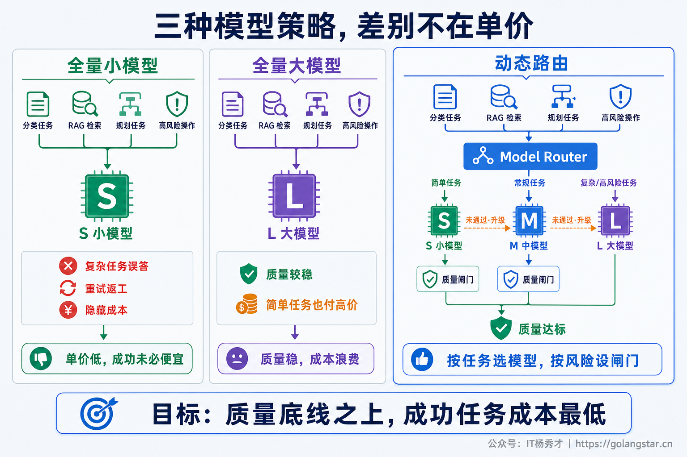
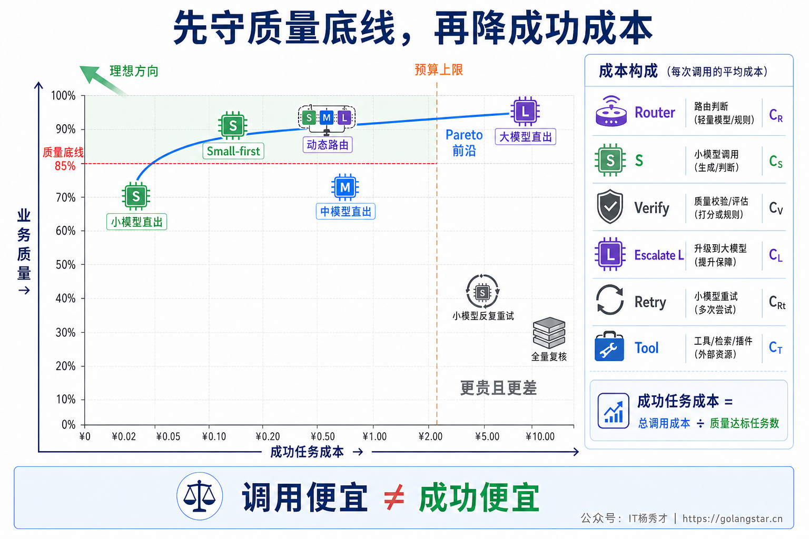
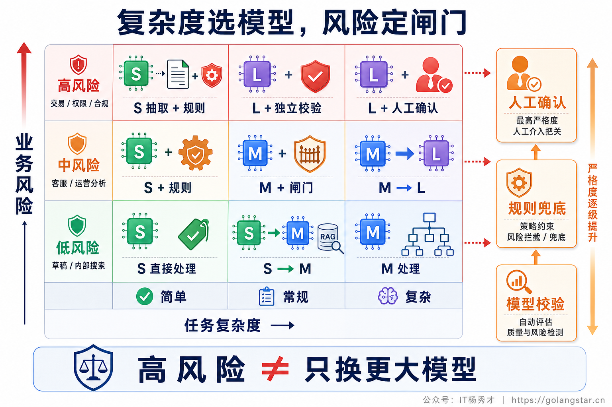
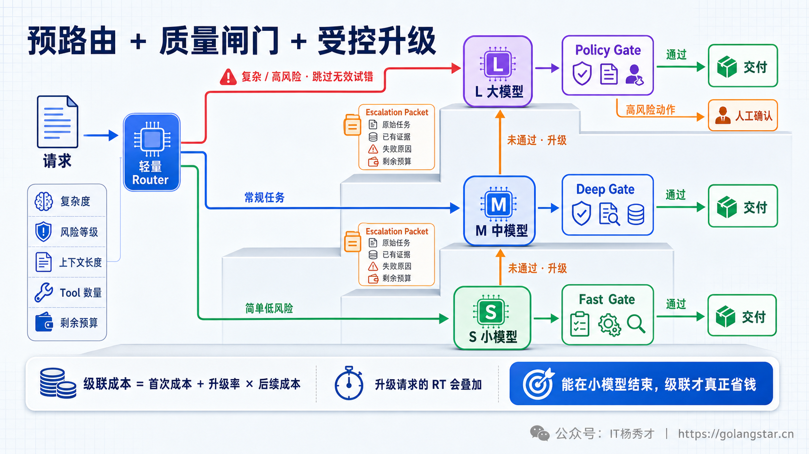
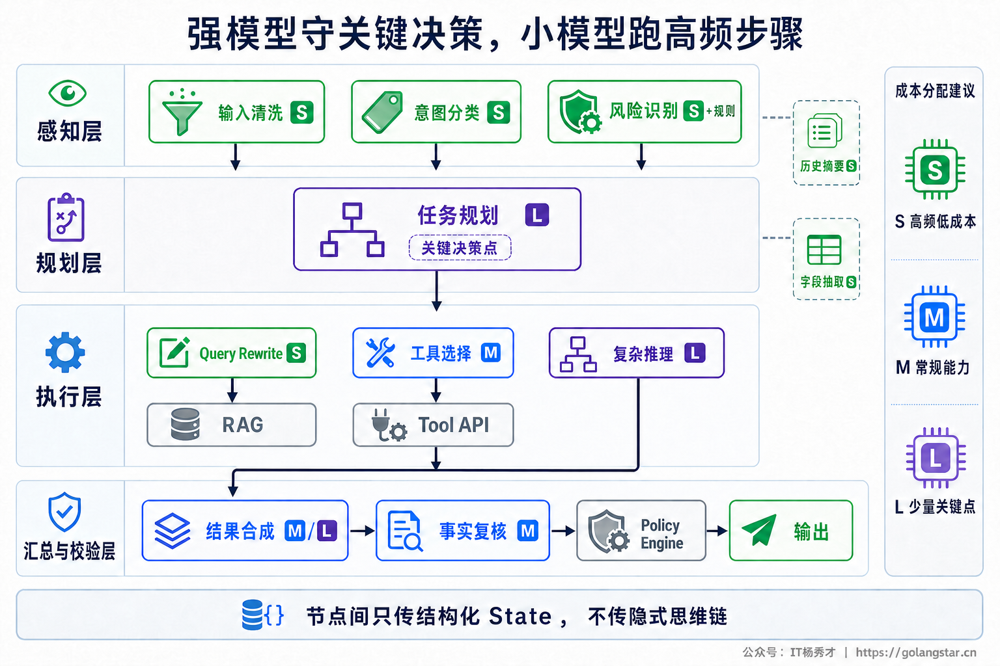
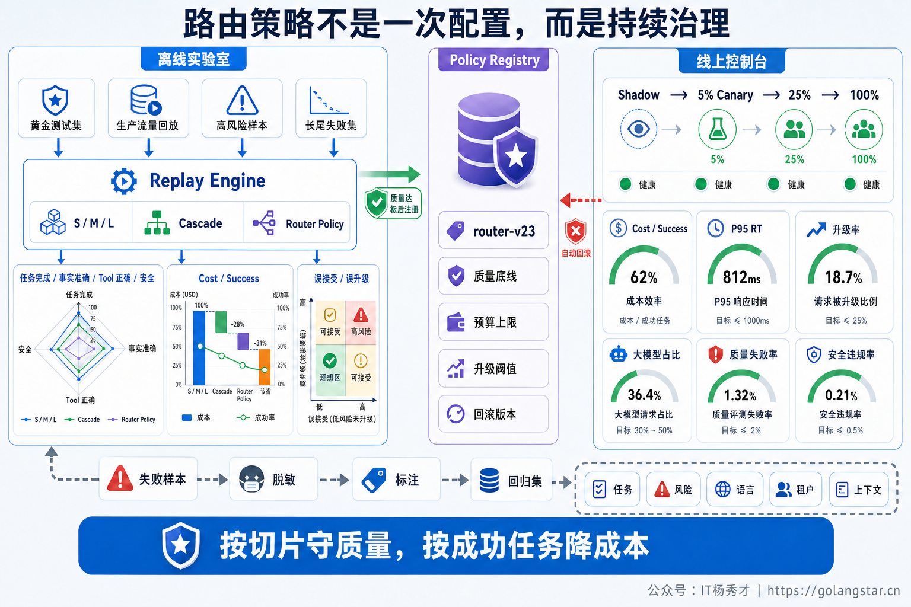

## **1. 题目分析**

这道题表面上是在“小模型便宜”和“大模型准确”之间二选一，实际上考察的是一套生产级 **Model Routing** 能力。全量使用大模型，质量比较稳，但简单分类、字段抽取和固定格式改写也支付了高单价；全量使用小模型，账面单价降了，复杂规划、边界问题和高风险操作却可能静默出错，随后产生重试、人工返工甚至业务损失。两种极端方案都不是工程上的平衡。

真正的目标也不是“尽可能多地使用小模型”，而是**尽可能准确地识别“小模型足够”的请求**。生产系统需要在每次请求、甚至 Agent 的每个步骤上，根据任务复杂度、错误代价、证据质量、延迟目标和剩余预算选择模型；对处于边界的请求，让小模型先执行，再经过独立质量闸门决定是否升级。最后还要证明：省下来的费用没有被错误通过、重复调用和 P95 上涨抵消。



### **1.1 先把“平衡”定义成一个约束优化问题**

模型路由不能只比较每百万 Token 单价，也不能只看一个通用榜单的平均分。不同业务对错误、成本和延迟的权重完全不同：营销文案措辞普通，最多重新生成一次；订单金额算错、权限判断出错或 Agent 重复发起写操作，损失可能远高于一次大模型调用。

因此，可以把路由目标抽象为：在质量、安全和延迟硬约束之下，最小化一次成功任务的期望总成本。

```text
minimize  E(Cost per Successful Task)

subject to:
  TaskSuccess(task_type) >= QualitySLO(task_type)
  SafetyViolation(risk_level) <= ε
  P95Latency(route) <= LatencySLO
```

这里的成本必须包含 Router、小模型、校验器、大模型升级、重试、工具调用和人工复核，而不是只统计首个模型的 Token。质量也必须按任务类型拆分：分类看 F1，结构化抽取看字段准确率，RAG 看答案正确性与引用忠实度，代码任务看测试通过率，Agent 工具调用看选择、参数和最终任务完成率。

一个稳妥的落地顺序是：先用能力最强的模型跑通真实业务样本，建立质量上限和基线；再逐个任务、逐个节点替换为更小的模型，只保留那些仍能通过质量门槛的替换。这样得到的是一条成本—质量—延迟的 Pareto 前沿，而不是凭感觉定一个“小模型占 80%”的指标。



### **1.2 先做任务分层，再做模型分层**

“参数少就便宜、参数多就准确”只能作为粗略直觉，不能直接写进路由规则。模型能力具有任务特异性：一个小模型可能很擅长固定 Schema 抽取，却不擅长多跳规划；另一个中等模型可能在中文意图分类上已经达到业务上限，却在长上下文工具调用中明显退化。真正需要建设的是**业务任务—模型能力矩阵**。

离线评测集至少按意图、复杂度、领域、上下文长度、约束数量、工具数量和风险等级分桶，并对每个候选模型测量成功率、成本、TTFT、完整 RT 和稳定性。路由器可以使用的请求前特征包括：

- 任务类型：分类、抽取、改写、普通问答、多跳推理、规划或写操作；
- 复杂度：输入长度、约束数量、歧义程度、预估步骤数、工具依赖深度；
- 证据条件：是否需要 RAG、检索覆盖是否充分、是否存在相互矛盾的来源；
- 风险信息：是否涉及金额、权限、隐私、医疗、法律或不可逆副作用；
- 运行约束：租户等级、Deadline、预算、模型健康度与当前配额。

复杂度和风险必须分开。低复杂、低风险的意图分类可以直接走小模型；高复杂、低风险的创意任务可以走强模型或受控级联；低复杂但高风险的转账参数确认，问题不难，却仍要使用强校验、权限规则和人工确认；高复杂、高风险则应直接进入强模型与 Human-in-the-Loop，不能为了节省一次调用先让小模型试错。



### **1.3 生产路由通常是“预路由 + 级联升级”**

生产环境里最实用的不是单一算法，而是把请求分成三类：**明显简单的直接走小模型，明显复杂或高风险的直接走大模型，真正处于边界的请求才使用 Cascade。** 这样既避免大模型处理所有简单流量，也避免复杂任务先在小模型上失败一次。

预路由发生在生成之前。明确场景可以使用规则、Embedding 分类器或轻量 Router；数据积累后，也可以训练一个路由模型，预测“强模型相对于弱模型在这个请求上的边际收益”。Router 本身必须足够便宜，并输出 `route_reason`、策略版本和命中特征，方便审计与回滚。只按输入 Token 长度路由是不够的：一句“删除生产库所有过期账号”很短，但风险极高；一段很长的会议纪要只是做固定字段抽取，可能仍适合小模型。

Cascade 则发生在小模型生成之后。边界请求先交给小模型，结果经过质量闸门；只有不满足门槛时才把原始请求、必要证据和紧凑的结构化状态交给强模型。不要把小模型冗长的失败推理和 Raw CoT 全量塞给大模型，否则不但放大 Token，还可能把错误前提一起传递。

级联是否真的省钱，需要计算完整期望成本：

```text
E(C_cascade) = C_router + C_small + C_verify
             + P(escalate) × C_large
             + C_retry_or_rework
```

只有当它低于直接调用大模型的成本，且 False Accept 满足质量 SLO 时，Cascade 才有意义。假如 70% 的请求最后都要升级，前面的 Router、小模型和校验器就变成额外账单；串行多一次模型往返还会抬高 P95。此时应提高预路由命中复杂请求的能力，或让这类任务直接走大模型，而不是继续宣传“小模型首选”。



### **1.4 最难的是质量闸门，不是模型调用**

很多方案会要求小模型输出一个 `confidence: 0.92`，高于阈值就直接返回。这个设计很危险：模型表达得很自信，不等于答案真的正确；Prompt、任务类型和分布变化后，自报置信度还可能系统性偏高。即使 Provider 提供 Logprob，它描述的也是模型对 Token 的分布，不天然等于业务正确率，也需要用带标签的真实数据做校准。

可靠的质量闸门应该组合多种相互独立的信号，并优先使用外部可验证反馈：

1. **确定性校验。** JSON Schema、类型和值域、业务不变量、权限规则、代码编译与单元测试。这类信号成本低、解释性强，应该放在第一层。
2. **证据校验。** RAG 场景检查引用是否存在、关键结论是否被证据覆盖、检索结果是否冲突；没有足够证据时应升级、追问或拒答，而不是让模型凭语言流畅度过关。
3. **独立验证。** 对开放式答案使用不同 Prompt、不同模型或专门训练的 Verifier 评估。Generator 与 Verifier 同源时错误可能相关，不能把“同一个模型再看一遍”当成独立证明。
4. **统计校准。** 将复杂度分数、模型分歧、历史失败率、可用的 Entropy/Logprob 和 Verifier 分数映射为真实正确率，并按意图与风险等级分别设阈值。

质量门的核心指标不是“升级率越低越好”，而是两个方向的错误：`False Accept` 表示小模型答错却被放行，是质量风险；`Unnecessary Escalation` 表示小模型本可完成却被升级，是成本浪费。阈值越宽松，前者上升；阈值越严格，后者上升。真正的平衡点来自业务损失函数，而不是统一使用 0.8 或 0.9。

### **1.5 Agent 应做到步骤级路由，而不是整条链固定一个模型**

一个 Agent Run 内部的节点难度并不相同。用户提出复杂目标，不代表后续所有步骤都需要最强模型；同样，入口看起来简单，也不代表某个有副作用的工具调用可以交给弱模型自由决定。生产系统应给每种节点定义能力需求和升级条件。

例如，复杂任务的全局 Planner 可以使用强模型，意图分类、Query Rewrite、字段抽取和 Tool Result 压缩使用经过评测的小模型；标准 RAG 合成使用中等模型，证据冲突、多跳归因和最终高风险结论再使用强模型。工具参数生成之后仍需 Schema 和权限校验，真正执行转账、删除、发消息等副作用操作前必须经过策略引擎和人工确认，不能把“大模型更聪明”误解为“大模型可以绕过确定性控制”。

步骤级路由还需要统一的 Model Capability Registry，记录每个模型支持的上下文长度、结构化输出、Tool Calling、视觉输入、延迟分布、价格、版本和已通过的任务评测。Prompt 与工具协议也要按模型适配，不能把为强模型设计的复杂指令原封不动切给小模型，然后把失败归因于模型尺寸。

需要注意，切换模型可能破坏 Prompt Cache 或前缀复用，跨 Provider 还会引入 Tokenizer、Schema 和安全策略差异。路由优化必须计算端到端成本，而不是只看某个节点的标价下降。



### **1.6 用真实流量验证，而不是上线后凭账单判断**

路由策略上线前，先用脱敏生产 Replay 比较四条基线：全大模型、全小模型、静态规则和动态路由。评测结果要按任务类型与风险等级拆分，画出质量、成本和延迟的 Pareto 曲线；若动态路由只降低平均成本，却让高风险桶的错误率上升，它就不能发布。

随后做 Shadow Routing：线上仍返回原方案的结果，新的 Router 只在旁路记录它会选择什么模型、是否会升级以及预估成本。通过之后，再按意图、租户或低风险流量 Canary，逐步扩大比例。线上还要持续抽样那些“小模型已通过”的请求，让强模型、规则或人工复核，以估计肉眼看不见的 False Accept；如果只复核已经升级的失败样本，得到的路由质量会严重偏乐观。

核心监控指标至少包括：

- 各任务桶的任务完成率、质量分和安全违规率；
- Small Route Rate、Escalation Rate 与大模型流量占比；
- False Accept、Unnecessary Escalation 和路由混淆矩阵；
- Cost per Successful Task、输入输出 Token 与人工复核成本；
- Router、校验、小模型、升级路径的 P50/P95/P99 延迟；
- 用户追问、改写、重试、投诉和人工接管率；
- 模型、Prompt、路由策略和评测集的版本与漂移告警。

模型升级、Prompt 调整、用户流量结构和知识库变化都会让旧阈值失效，因此策略必须版本化、可灰度、可回滚，并定期重新校准。数据量足够后可以尝试 Contextual Bandit 等在线优化，但只能在通过安全评测的候选策略中探索，高风险流量不能成为无保护的在线实验样本。



### **1.7 几种看似省钱、实际容易翻车的方案**

**第一种是所有请求都先走小模型。** 这把“级联”当成了固定流水线。对明显复杂的规划和高风险任务，小模型失败概率高，最终会同时支付两次生成和一次校验，还增加完整 RT。

**第二种是相信模型自报置信度。** 一个流畅、确定的错误答案最容易成为 False Accept。自报分数只能作为特征之一，必须经过任务级校准，并与规则、证据或独立 Verifier 组合。

**第三种是只比较 Token 单价。** 小模型可能输出更长、反复重试或引发用户追问；大模型也可能一次完成。应比较的是 Cost per Successful Task 和错误损失，而不是一张价格表。

**第四种是路由成功后永久不变。** 模型版本、Prompt 和数据分布一直在变化。没有策略版本、Shadow、线上抽检和漂移监控，今天有效的阈值可能在一次模型升级后悄悄失效。

**第五种是预算紧张时降低安全底线。** 金融、医疗、权限、隐私和有副作用工具的强校验不能降级。预算不足时应该转人工、延迟处理或明确失败，而不是把高风险请求强行切到便宜模型。

这道题最后可以收敛成一句话：**大小模型的平衡不是静态配比，而是一套带质量门槛、风险约束和持续评测的动态决策系统。**

***

## **2. 参考回答**

我不会给整个 Agent 固定一个模型，也不会让所有请求都先走小模型，而是把它设计成质量、安全和延迟约束下的动态路由。先用最强模型在真实业务评测集上建立质量基线，再按意图、复杂度、上下文、工具深度和风险建立任务—模型能力矩阵：明确简单的分类、抽取和改写直接走小模型；明确复杂或高风险的规划、证据冲突和副作用操作直接走强模型或人工确认；只有边界请求才让小模型先执行，通过 Schema、业务规则、证据覆盖和独立 Verifier 组成的质量闸门，不达标再升级。不能只相信模型自报置信度，它必须用生产标签按任务桶校准。

工程上还会把路由细化到 Agent 节点，例如强模型负责复杂规划，小模型负责 Query Rewrite、字段抽取和结果压缩，中等模型负责常规合成。级联要算完整期望成本，包括 Router、小模型、校验器和升级概率；升级率过高时可能比直接用大模型更贵、更慢。上线前用 Replay 比较全大、全小、静态和动态路由，再经过 Shadow 与 Canary，线上重点监控 False Accept、无效升级率、Cost per Successful Task、P95 和高风险错误率，并随模型、Prompt 和流量变化持续校准阈值。核心不是小模型占比越高越好，而是准确识别“小模型足够”的请求。

<div style="background-color: #f0f9eb; padding: 10px 15px; border-radius: 4px; border-left: 5px solid #67c23a; margin: 20px 0; color:rgb(64, 147, 255);">

## <span style="color: #006400;">**学习交流**</span>
<span style="color:rgb(4, 4, 4);">
> 如果您觉得文章有帮助，可以关注下秀才的<strong style="color: red;">公众号：IT杨秀才</strong>，后续更多优质的文章都会在公众号第一时间发布，不一定会及时同步到网站。点个关注👇，优质内容不错过
</span>


<div style="text-align: center; margin-top: 22px; padding-top: 20px; border-top: 1px solid #c2e7b0;">
<div style="color: #006400; font-size: 20px; font-weight: bold;">🔥 配套实战项目，拆得开、跑得起、能写进简历</div>
<div style="color: red; font-size: 16px; font-weight: bold; margin-top: 8px;">多 Agent 编排 + RAG 混合检索 · 31 篇深度教程 + 50+ 面试题</div>
<a href="/projects/dev-support.html" style="display: inline-block; margin-top: 14px; background: #ff7a18; color: #fff; font-size: 18px; font-weight: bold; padding: 10px 28px; border-radius: 24px; text-decoration: none;">点击查看 DevSupport AI 实战项目 →</a>
</div>
</div>
