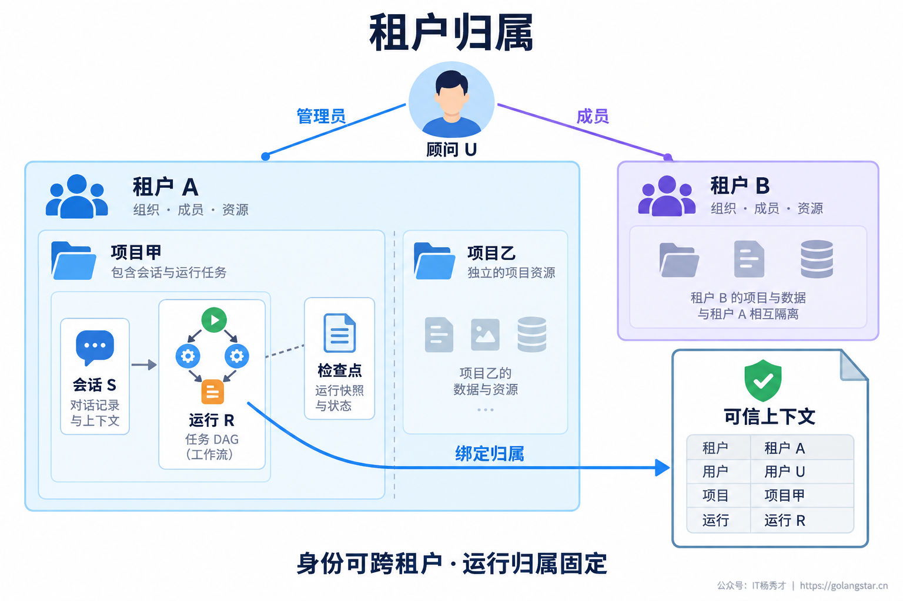
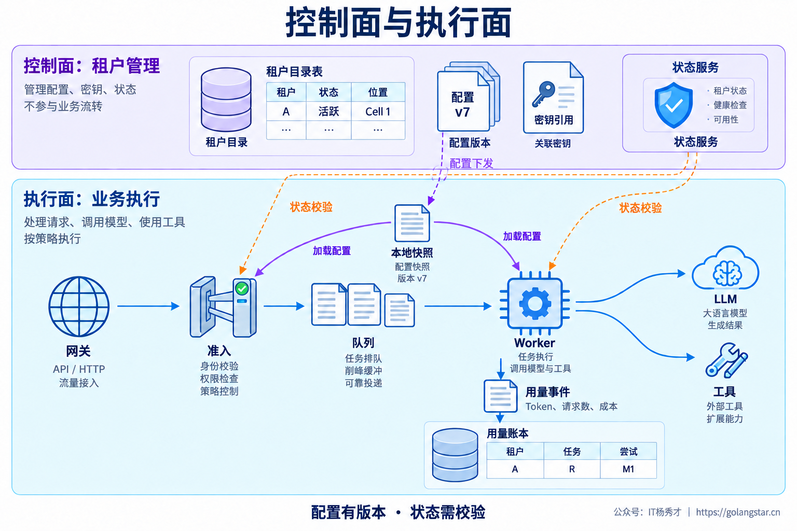
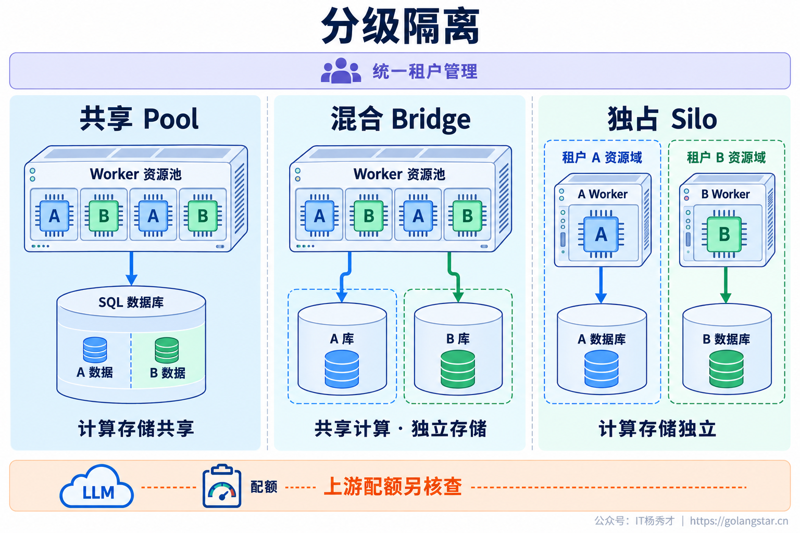
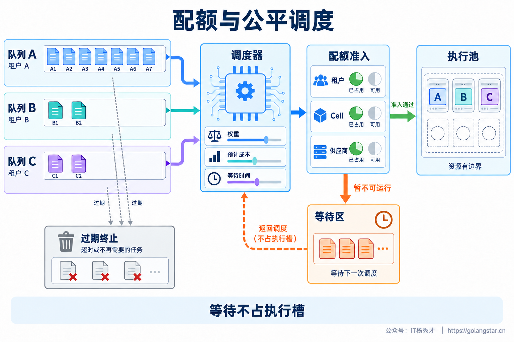
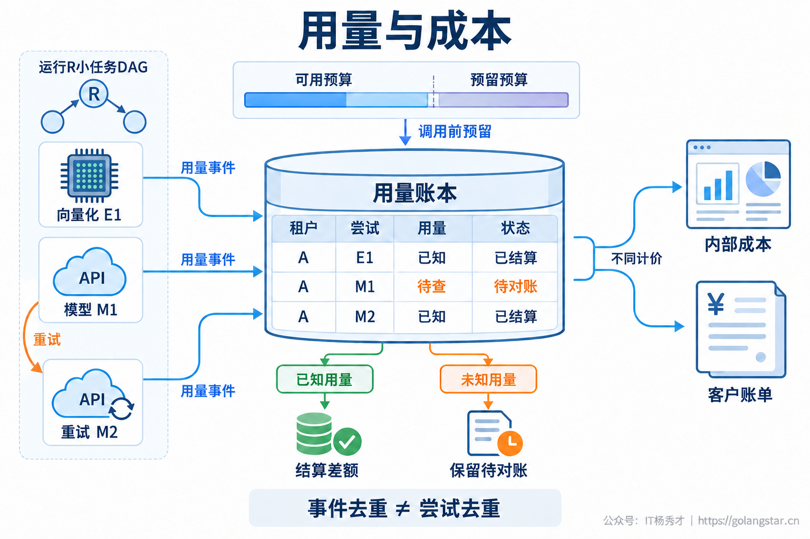
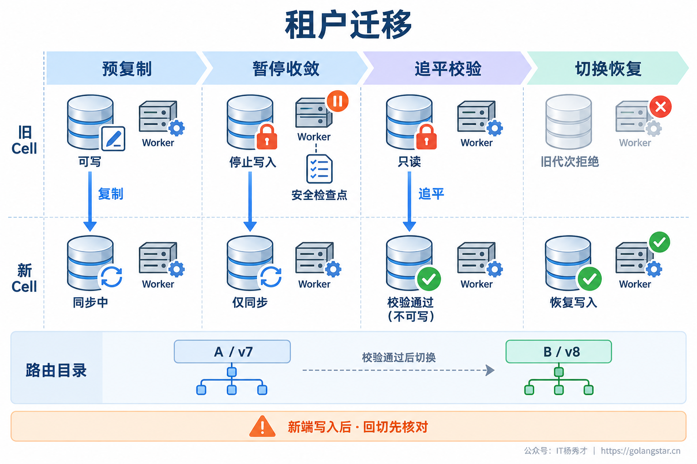

## **1. 题目分析**

一家企业在夜间启动十万份合同的批量分析，另一家企业只是让 Agent 查一条售后记录。数据表里的 `tenant_id` 没有串，权限校验也全部通过，后者却迟迟等不到回答：Worker 被占满，共享模型的 Token 配额已经耗尽。

这时系统在安全层面可能没有越界，在产品层面却已经没有隔离。月底还会出现另一个问题：失败重试、向量化和子 Agent 的消耗没有归属，平台知道总账单涨了，却不知道该算到哪个租户、哪类任务。

**多租户不是给单租户应用补一个字段，而是把租户变成数据归属、资源分配、用量核算和运维操作的共同单位。** [上一篇](./agent_permission_data_isolation.md)讨论了权限与数据边界，这一篇继续回答：多家企业共享 Agent 平台之后，如何让这种共享长期可控。

### **1.1 租户模型**

租户通常对应一份独立的服务契约和管理边界，不一定等于一个用户，也不一定等于一家企业的所有业务。集团可能拆成多个租户，一名顾问也可能同时加入多个企业。需要明确租户、成员关系、项目、会话和任务之间的归属，不能用 `user_id` 代替租户标识。

入口先验证登录身份，再校验用户对所选租户的有效成员关系，构造可信的租户上下文。客户端传来的租户 ID 只能表达选择，不能证明归属；LLM 生成的工具参数更不能改变这个上下文。后台定时任务则通过已授权的服务身份绑定租户，不能套用平台超级管理员身份执行所有客户任务。

上下文必须跟随消息、子 Agent、检查点和重试传播。数据库记录、对象存储路径、缓存键、检索条件和幂等记录使用同一套租户归属；读取时还要执行授权，前缀本身不是安全机制。尤其是共享答案缓存，除了租户，还要考虑权限范围、数据版本和个性化条件，不能只按问题文本命中。

租户上下文应是请求或任务级不可变对象。共享运行时、连接池可以复用，但不能把“当前租户”保存在全局变量里；连接上的租户状态需要限定作用域并可靠清理。缺少租户上下文时直接拒绝，不能默认落到公共租户，否则异步链路里的一次漏传就可能变成跨企业访问。

### **1.2 控制面与执行面**

当每接入一家企业都要手动改配置、建数据库、复制部署脚本时，多租户平台很快会退化成一批难以维护的定制项目。需要把租户管理从 Agent 推理链路中抽出来，形成控制面与执行面的分工。[AWS 的 SaaS 架构说明](https://docs.aws.amazon.com/whitepapers/latest/saas-architecture-fundamentals/control-plane-vs.-application-plane.html)也采用这种划分：统一管理租户，业务侧承载实际功能。

控制面维护租户目录，包括状态、套餐、地域、隔离等级、资源位置和配置版本；编排开通流程，管理配额、模型白名单与发布策略。凭据只保存密钥服务中的引用，不能把企业模型密钥塞进任务消息或 Prompt。租户自带密钥时，调用、轮换和额度告警也必须明确归属。

执行面读取配置后完成准入、排队、推理、检索和工具调用，再产生用量事件。配置采用有版本的快照和增量分发，避免每个 Token 都同步访问控制中心。一个运行绑定模型、Prompt、工具协议等配置版本，既便于复现，也避免执行中途套餐变化导致语义漂移。

但**运行配置可以固定，当前授权和租户停用状态不能永久固定**。入队、出队、恢复执行和敏感动作前要重新检查。对缓存允许的陈旧时间作明确约束；无法确认有效授权时拒绝敏感访问。控制面需要高可用，执行面在管理端短暂不可用时能否继续，取决于缓存有效期与风险等级，而不是统一采用“使用最后一次配置”。

### **1.3 分级资源隔离**

隔离等级应该匹配实际需求。普通租户可以共享 Worker 和数据库，通过授权与配额控制边界；数据敏感或备份要求特殊的租户可以独享存储、共享计算；高负载或强隔离租户则使用独立执行资源。它们分别对应共享、混合和独占模式，类似 [AWS 的 Pool、Bridge、Silo 分类](https://docs.aws.amazon.com/wellarchitected/latest/saas-lens/silo-pool-and-bridge-models.html)。独占资源仍由同一套平台管理，不意味着给客户维护一份代码分支。

Kubernetes Namespace 只是组织与策略作用域，需要配合 RBAC、网络策略、资源限制和必要的节点隔离；网络策略还依赖网络插件正确执行。[Kubernetes 多租户文档](https://kubernetes.io/docs/concepts/security/multi-tenancy/)明确指出，配额不能覆盖所有资源干扰。`ResourceQuota` 管理资源配额，也不会替应用公平调度已经运行的 LLM 请求，更不会增加第三方的 TPM。

规模扩大后，可以把队列、Worker 和状态存储组织成有限容量的部署单元 Cell，每个单元承载一组租户；租户目录负责路由，达到容量阈值后增加单元，而不是无限放大同一个资源池。[Deployment Stamps 模式](https://learn.microsoft.com/en-us/azure/architecture/patterns/deployment-stamp)描述了这种分组扩展方式。

故障域必须沿依赖检查到底：独立 Worker 如果仍共享一个连接池、一组模型配额或同一个热点数据库，仍然会相互影响。隔离的是哪一层，就只能承诺哪一层的边界。数据布局还要支持按租户导出和恢复；共享数据库需要恢复单个租户时，通常应先还原到隔离位置，再提取该租户数据，不能直接回滚全库影响其他企业。

### **1.4 配额与公平调度**

Agent 的一次入口请求可能派生几十次模型与工具调用，因此只在 HTTP 网关限制 QPS，挡不住后续放大。准入至少需要覆盖租户运行数、等待任务数、单任务并行分支，以及模型调用的 RPM、TPM 和在途并发。租户限额之外，还要有 Cell 和供应商配额的总约束，否则每家企业各自没超限，合起来仍会打满上游。

任务先进入有界的租户逻辑队列，再由调度器选择可运行的工作。逻辑队列不要求每个租户创建一套消息中间件，但需要能独立统计积压、等待时间和取消状态。交互请求与批处理分开分配容量；不能让一个租户的大批量任务占据全局 FIFO 队首。

公平不能只按任务个数轮询。长文档分析和短问答的消耗相差很大，可以按预计 Token 或执行成本做加权调度，实际完成后修正估算，同时设置最老等待时间与防饥饿策略。已有公平队列也不等于已有租户限速，例如 [SQS fair queues](https://docs.aws.amazon.com/AWSSimpleQueueService/latest/SQSDeveloperGuide/sqs-fair-queues.html)主要缓解其他租户的排队影响，并不限制每个租户的消费速率。

调度准入需要协调多个资源条件，采用原子预留，或者短暂尝试、失败立即回退，不能先占住 Worker 再长期等待供应商配额。任务出队后再次检查状态与截止时间；新分支、重试和模型切换也必须经过同一准入层。运行许可用租约和心跳回收，但租约过期不代表远端计算已经停止，需要控制重新发起调用的额外负载。

### **1.5 用量与成本核算**

计量应落在模型和工具的实际调用边界，而不是只在 Agent 最终回答处记一次 Token。每条用量事件关联租户、任务、步骤和尝试，记录实际模型、供应商请求 ID、输入输出用量、缓存计费类别以及价格版本。子 Agent、Embedding、重排和失败重试都属于对应任务的成本；客户自带密钥的供应商费用与平台代付费用则分别记账。

需要区分“消息重复投递”和“真的调用了两次”。同一用量事件重复到达，可以按事件 ID 幂等去重；两个真实尝试如果都产生费用，就必须分别入账，不能用相同 `run_id` 把第二次费用去掉。消费确认与账本更新需要可靠关联，保留原始事件用于核对。

费用控制采用预留、结算和对账：每次调用前按输入规模与输出上限预留预算，完成后按实际用量结算并释放差额，后续步骤重新申请。供应商用量回传可能延迟，流式中断也可能没有完整 usage，这些情况应记“待对账”，不能直接当零成本退款。

硬预算需要有覆盖最坏情况的预留上界，以及可靠的并发扣减；只有平均估算和事后汇总，就只能承诺受控的超额范围，不能宣称绝不超支。内部成本还包含共享算力、存储和网络分摊，客户账单则遵循产品计价规则。两者分开才能判断租户是否盈利，也避免把平台自身错误重试的成本未经约定转嫁给客户。

### **1.6 租户生命周期**

租户开通不是一条 INSERT，而是可恢复的工作流：登记、资源准备、策略绑定、连通性检查，全部通过后才能激活。每一步保存状态并支持幂等重试，部分失败停在待修复状态，不能创建出“能登录却没有数据库”的半成品租户。升级套餐、切换模型凭据和停用服务同样需要状态与版本管理。

扩容迁移尤其容易出错。把租户路由从 Cell A 改为 B，不代表知识库、检查点和在途任务已经过去。一种容易验证的方案是先复制基础数据，再暂停该租户的新任务，在安全步骤收敛旧任务、阻止旧端继续写入，追平增量并校验后，才切换路由版本和写入代次，最后从目标端恢复。

暂停收敛不是只发送取消信号。已经发出的外部写操作必须完成或核清结果，目标端才可继续同一业务步骤；写入代次也要在实际写入点校验，防止旧 Worker 迟到提交。新端产生数据后，回滚不能直接把流量指回旧端，需要先处理数据差异，否则会丢掉迁移后的进度。

停用时停止新准入，取消排队任务，在途任务按安全边界收尾或暂停，并继续记录已发生的费用。退出时先完成约定的导出与核账，再清理会话、向量索引、缓存、对象和密钥引用，跟踪备份到期与必要的保留规则。删除主表并不等于租户数据已经清除，清理任务自身也需要可追踪、可重试。

### **1.7 租户级验证**

验收不能只看平台总成功率。需要同时观察租户任务有效成功率、P95 延迟、最老排队时间、拒绝原因、并发占用和单位成功任务成本，再按任务类型、套餐和 Cell 分析。大租户的大量成功请求，可能掩盖小租户持续超时。

租户级明细可以进入受控的日志、追踪和用量分析存储，再聚合成租户看板；不要把所有租户 ID 与任务 ID 无限制组合成监控标签。[Prometheus 的标签规范](https://prometheus.io/docs/practices/naming/)明确提醒避免无界高基数维度，不能为了观察租户而先把监控系统打满。

压测需要让一个租户持续超载，同时保持其他租户的正常流量，验证其等待时间与成功率是否仍在约定目标内；再注入单租户凭据失效、批量重试、控制面短暂故障和迁移中断。发布按租户批次与 Cell 灰度，数据库变更保持兼容，不能让一个客户的定制配置影响全平台。

落地可以从共享部署开始，但租户归属、可信上下文、配额和用量账本应尽早统一。容量增长后再引入 Cell 和独占资源，而不是一开始给每家企业堆一整套集群。扩容触发点应来自排队、饱和度和容量演练，而不是只看租户数量。能够独立定位、限制、迁移和恢复一个租户，才说明多租户已经从字段设计变成了平台能力。

---

## **2. 参考回答**

我会把租户作为整个 Agent 平台的数据、资源和成本归属单位，而不是只给表加 tenant_id。先明确企业、成员、项目和会话的关系，入口认证后校验租户成员身份，生成不可变的租户上下文，贯穿子 Agent、消息、缓存和检查点。架构上拆分控制面与执行面，统一管理租户状态、配置版本、资源位置和模型凭据；运行配置可以固定，但停用和权限变化必须在执行前重新检查。

资源上根据需求采用共享、混合或独占模式，规模增长后按 Cell 控制故障范围。调度使用有界的租户逻辑队列，结合任务成本和权重保障公平，同时控制租户、Cell、供应商三层配额，子任务和重试也不能绕过。成本在实际调用处记录，区分任务和尝试，用预留、结算、对账处理预算，超时但用量未知时不直接退款。开通、停用、迁移和退出都做成可恢复流程，迁移尤其要保证旧端停止写入、数据追平后再切换，不能只改路由。最后做单租户超载和故障演练，观察其他租户的成功率、排队与 P95 是否仍达标，并通过租户用量账本核清每笔成本。

## **学习交流**

> 如果您觉得文章有帮助，可以关注下秀才的<strong style="color: red;">公众号：IT杨秀才</strong>，后续更多优质的文章都会在公众号第一时间发布，不一定会及时同步到网站。点个关注👇，优质内容不错过

🔥 配套实战项目，拆得开、跑得起、能写进简历

多 Agent 编排 + RAG 混合检索 · 31 篇深度教程 + 50+ 面试题

<a href="/projects/dev-support.html" style="display: inline-block; margin-top: 14px; background: #ff7a18; color: #fff; font-size: 18px; font-weight: bold; padding: 10px 28px; border-radius: 24px; text-decoration: none;">点击查看 DevSupport AI 实战项目 →</a>

