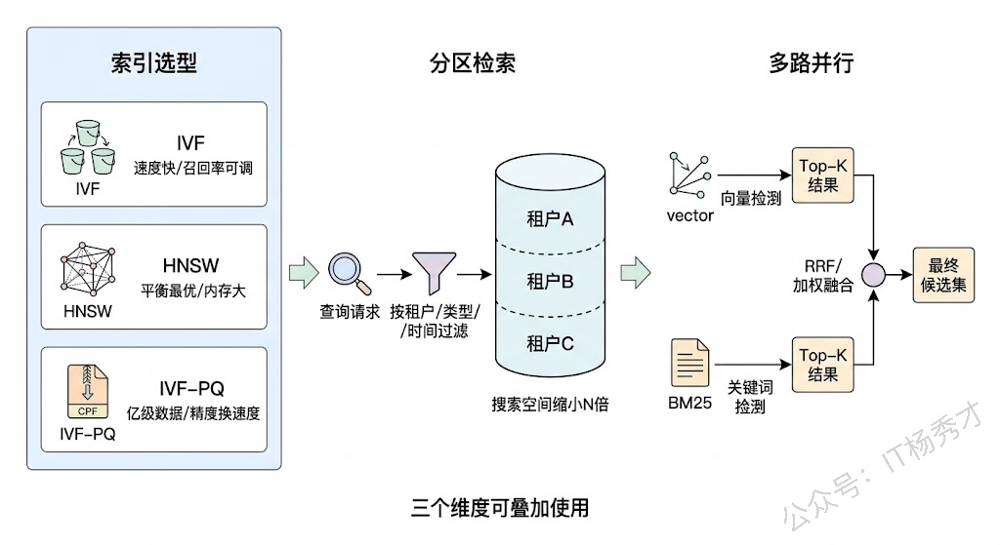
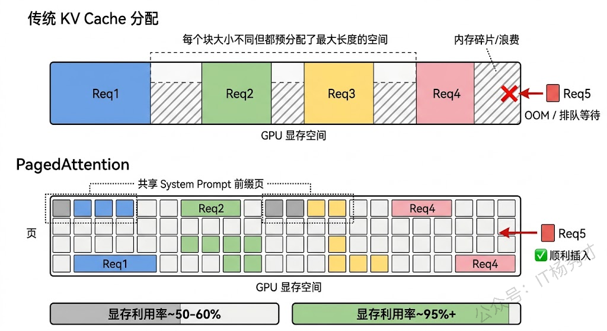
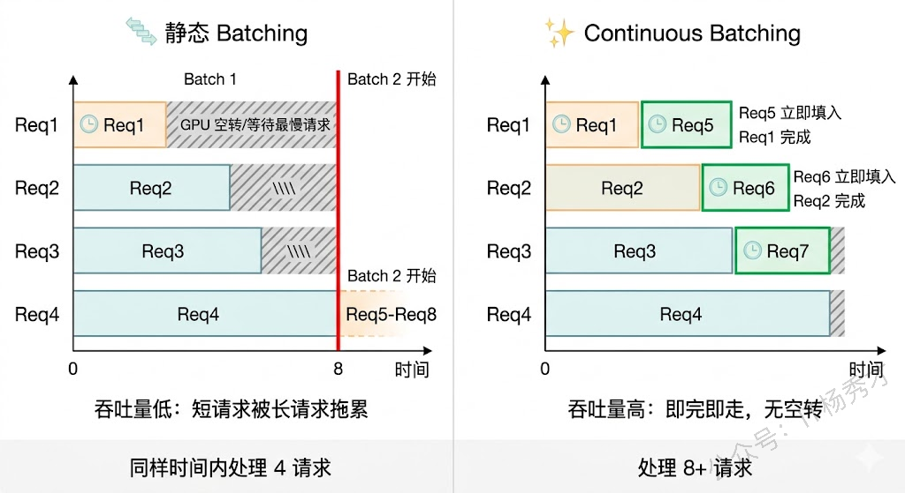
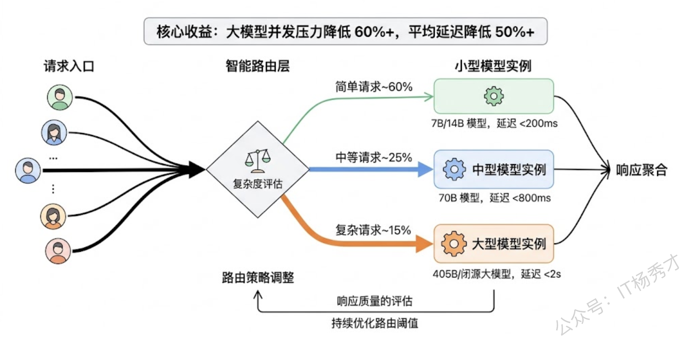
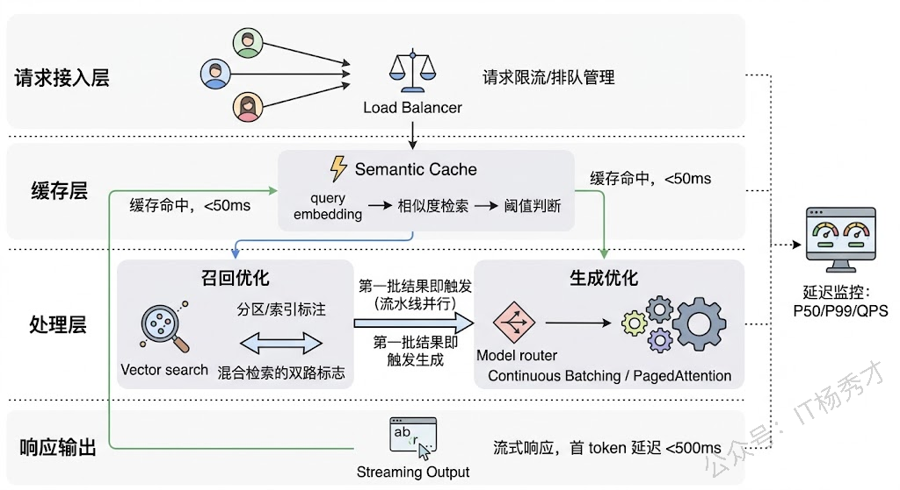
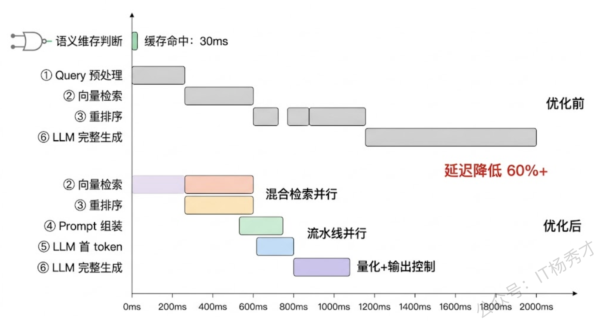

## **1. 题目分析**

高并发场景下的 Agent 系统，延迟问题往往不是某个单点慢，而是处处都慢一点，最终叠加成用户不可接受的等待。一个典型的 RAG Agent 请求链路可能是这样的：用户提问 → Query 改写 → 向量检索 → 重排序 → Prompt 组装 → LLM 生成 → 后处理返回。每个环节各花几百毫秒，串联起来就是好几秒。当并发量上去以后，资源竞争和排队效应还会让这些延迟进一步恶化。面试官问这道题，想考察的是你能不能从召回和生成这两个最重的环节切入，拿出系统性的优化方案，而不是只知道加缓存或换小模型这种表面操作。

我们按请求链路的顺序，先拆召回阶段，再拆生成阶段，最后看系统层面怎么把两者串起来做全局优化。

### **1.1 召回阶段**

召回阶段的延迟主要花在三个地方：Query 预处理（改写、扩展）、向量检索本身、以及检索后的重排序。高并发场景下，这三步的优化思路差异很大。

**向量检索的性能瓶颈**，核心在于 ANN（近似最近邻）索引的选型和调参。不同的索引算法在延迟、召回率和内存占用之间有截然不同的取舍。IVF 类索引通过聚类把向量分成若干桶，检索时只扫描最近的几个桶，速度快但召回率取决于 nprobe 参数——设太小会漏掉相关文档，设太大又慢回去了。HNSW 是目前工程中最常用的索引，它构建一个多层的近邻图，检索时沿着图结构跳转逼近目标，延迟和召回率的平衡最好，但内存开销大，因为要把整个图结构常驻内存。对于数据量特别大（亿级以上）的场景，可以考虑 IVF-PQ 这种量化压缩方案，用精度换内存和速度。

实际项目中一个容易被忽略的优化点是**分区检索**。把向量库按业务维度（比如文档类型、租户 ID、时间范围）做分区，查询时先根据元数据过滤定位到相关分区，再在分区内做 ANN 检索。这样做的好处不仅是缩小了搜索空间从而加速，更重要的是在多租户高并发场景下，不同租户的查询落在不同分区，天然减少了资源争抢。Milvus 的 Partition 功能和 Qdrant 的 Payload Index 都支持这种用法。

**重排序的性能问题**是另一个痛点。粗召回拿回 Top-100 之后，用 Cross-Encoder 做精排可以显著提升相关性，但 Cross-Encoder 需要把 query 和每个候选文档拼接后逐一过模型打分，计算量是 O(N) 的。当并发上来以后，精排很容易变成瓶颈。优化思路有两个方向：一是**减少进入精排的候选数量**，在粗召回和精排之间加一层轻量级的预过滤（比如用 ColBERT 这种 late interaction 模型做快速初筛，它的 token 级向量可以预计算，推理时只做向量交互，比 Cross-Encoder 快一个数量级）；二是**精排请求做 batching**，把多个并发用户的精排请求攒成一批统一送 GPU 推理，提高硬件利用率。

还有一个经常被忽视的优化方向是**混合检索**。纯向量检索对语义相似度敏感，但对精确匹配（如专有名词、编号、代码片段）不够好；BM25 等稀疏检索则相反。把两者并行执行、结果融合（常用 Reciprocal Rank Fusion），不仅召回质量更好，而且两路检索可以并行，总延迟取决于较慢的那一路而非两者之和。

### **1.2 生成阶段**

生成阶段的延迟优化，比召回更复杂，因为 LLM 推理本身是一个计算密集型任务，而且自回归生成天然是串行的——每个 token 的生成都依赖前一个 token。

**KV Cache 是生成加速的基石**。LLM 在自回归解码时，每生成一个新 token 都需要对之前所有 token 做 Attention 计算。如果每次都从头算，计算量随序列长度平方增长，完全不可接受。KV Cache 的做法是把之前 token 在每一层 Attention 中计算出的 Key 和 Value 缓存下来，生成新 token 时直接复用，避免重复计算。这已经是所有推理框架的标配，但在高并发场景下，KV Cache 的内存管理变成了一个新问题——每个请求都需要独立的 KV Cache 空间，并发量一大，GPU 显存很快被撑满。

vLLM 提出的 **PagedAttention** 机制是目前解决这个问题最优雅的方案。它借鉴了操作系统虚拟内存的思路，把 KV Cache 按固定大小的"页"来分配和管理，而不是给每个请求预分配一大块连续内存。这样做有两个好处：一是消除了内存碎片，显存利用率可以接近 100%；二是支持了 KV Cache 在不同请求之间的共享——如果多个请求有相同的 System Prompt 前缀（在 Agent 系统中这非常常见），它们可以共享这部分 KV Cache 的物理页，大幅节省显存。显存省下来了，能同时处理的并发请求就多了，排队延迟自然就下来了。

**Continuous Batching（连续批处理）** 是高并发场景下的另一个关键优化。传统的静态 batching 会等一批请求全部生成完毕才开始处理下一批，这意味着短请求要等长请求——如果一批里有一个请求生成了 500 个 token，其他只需要 50 个 token 的请求也得跟着等。Continuous Batching 改成了"即完即走"的策略：某个请求生成结束后，它的 GPU 计算槽位立即释放给排队中的新请求。这种调度机制让 GPU 始终保持在高利用率状态，吞吐量可以提升 2-5 倍。vLLM、TGI（Text Generation Inference）、TensorRT-LLM 都默认支持这个特性。

**推测解码（Speculative Decoding）** 是从生成算法层面加速的方案。核心思想是用一个小而快的 Draft Model 先"猜"出若干候选 token，然后用大模型一次性并行验证这些候选 token 是否正确。如果猜对了，就相当于大模型一次前向传播生成了多个 token；猜错了，从错误位置开始重新生成，也不会比原来更慢。这种方法在大模型和小模型输出分布比较接近的场景下效果很好，可以实现 2-3 倍的解码加速，且不影响输出质量（数学上可以证明输出分布和纯大模型完全一致）。

### **1.3 模型层面的取舍**

除了推理框架层面的优化，模型本身也有很多降低延迟的手段。

**模型量化**是最直接的。把模型权重从 FP16 量化到 INT8 或 INT4，模型体积缩小到原来的一半甚至四分之一，推理速度相应提升。GPTQ、AWQ 等量化方案在大部分任务上的精度损失很小（通常在 1-2% 以内），性价比极高。特别是在高并发场景下，量化后的模型在同样的 GPU 上能服务更多并发请求，相当于变相降低了每个请求的排队时间。

**模型路由（Model Routing）** 是一种更精细的策略。不是所有请求都需要最大的模型来回答——简单的问题用小模型足够，复杂的问题才需要大模型。在请求进来时先做一次快速分类（可以用规则、也可以用一个轻量分类器），把简单请求路由到小模型（响应快、成本低），复杂请求路由到大模型（质量高、但更慢）。在实际系统中，往往 60-70% 的请求都是简单问题，光是把这部分流量卸载到小模型就能大幅降低大模型的排队压力。

### **1.4 系统架构层面的全局优化**

单独优化召回或生成都不够，真正把延迟降到极致还需要从系统架构层面做文章。

**召回与生成的流水线并行**是一个效果很明显的优化。传统做法是先完成全部检索，再把结果拼进 Prompt 送去生成——这是串行的。但其实可以做成流水线：检索结果分批返回，第一批结果到了就开始组装 Prompt 并触发 LLM 生成（用 Streaming 方式），后续的检索结果如果拿到了更好的内容，可以在生成过程中动态追加或在下一轮对话中补充。这种方式让用户在检索还没完全结束时就已经看到生成内容在逐步出现，感知延迟大幅降低。

**语义缓存（Semantic Cache）** 是高并发场景下的杀手级优化。传统缓存只能处理完全相同的请求，但用户的提问往往换个说法就 miss 了。语义缓存的思路是：把历史请求的 query embedding 和对应的回答存起来，新请求进来时先把 query 转成 embedding，在缓存中做相似度检索，如果找到语义相似度超过阈值的历史请求，直接返回缓存的回答。这种缓存在高并发场景下命中率出乎意料地高——因为大量用户其实在问同类问题。GPTCache 就是这类工具的代表。需要注意的是阈值调参很关键：太低会返回不相关的缓存结果，太高又没什么命中。

**异步预加载和预热**也值得一提。在 Agent 系统中，很多场景下是可以预判用户下一步行为的。比如用户进入某个业务场景时，可以提前把该场景最可能用到的知识库分区加载到内存、预热相关的 KV Cache 前缀。当用户真正提问时，检索和生成都从一个"热"的状态开始，而不是冷启动。

最后一个容易被低估的优化是**输出长度控制**。LLM 生成的延迟和输出 token 数量成正比。在很多 Agent 场景中，模型倾向于生成冗长的回答，但用户其实只需要一个简短的结论或操作指令。通过 Prompt 约束（如"用一句话回答"、"直接给出操作步骤"）或设置合理的 max\_tokens，可以让生成长度缩短 50% 以上，延迟随之减半。这个优化看起来最不起眼，但在实际项目中效果往往立竿见影。

***

## **2. 参考回答**

高并发 Agent 系统的延迟优化，我会从召回、生成、系统架构三个层面来讲。

召回阶段，工程上我们选 HNSW 索引做底座，多租户场景下按业务维度做分区检索缩小搜索空间，重排序用 ColBERT 做快速初筛控制进入 Cross-Encoder 精排的候选量，再配合向量+BM25 的混合检索并行执行、RRF 融合，召回的延迟和质量都能兼顾。

生成阶段，核心是推理框架的优化——vLLM 的 PagedAttention 消除 KV Cache 显存碎片并支持前缀共享，Continuous Batching 让短请求即完即走不被长请求拖累，模型用 AWQ 量化到 INT4 基本不损精度但速度翻倍。我们还做了模型路由，简单请求走小模型，大部分流量都不需要过大模型。

最后在系统层把两者串起来做全局优化，语义缓存把历史 query embedding 和回答缓存起来做相似度匹配，高并发下命中率很高；召回和生成做流水线并行，第一批检索结果到了就触发 Streaming 生成，用户感知延迟大幅下降。

## **学习交流**

> 如果您觉得文章有帮助，可以关注下秀才的<strong style="color: red;">公众号：IT杨秀才</strong>，后续更多优质的文章都会在公众号第一时间发布，不一定会及时同步到网站。点个关注👇，优质内容不错过

