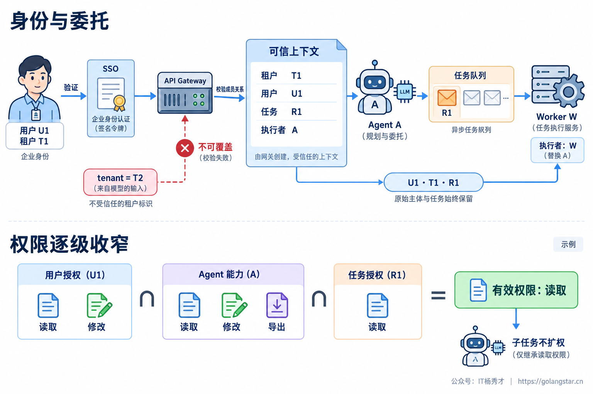
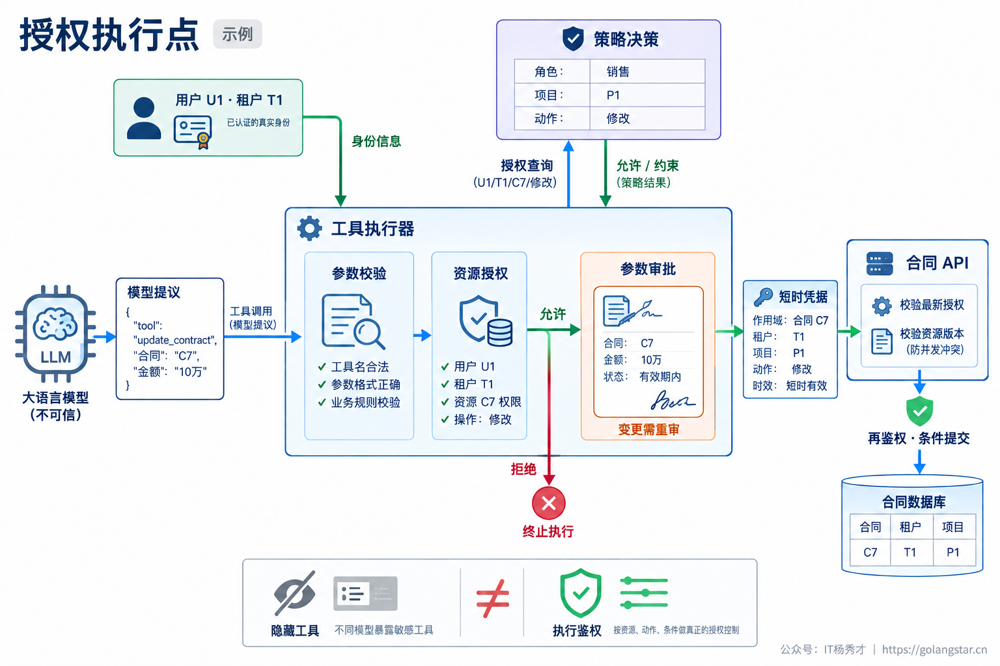
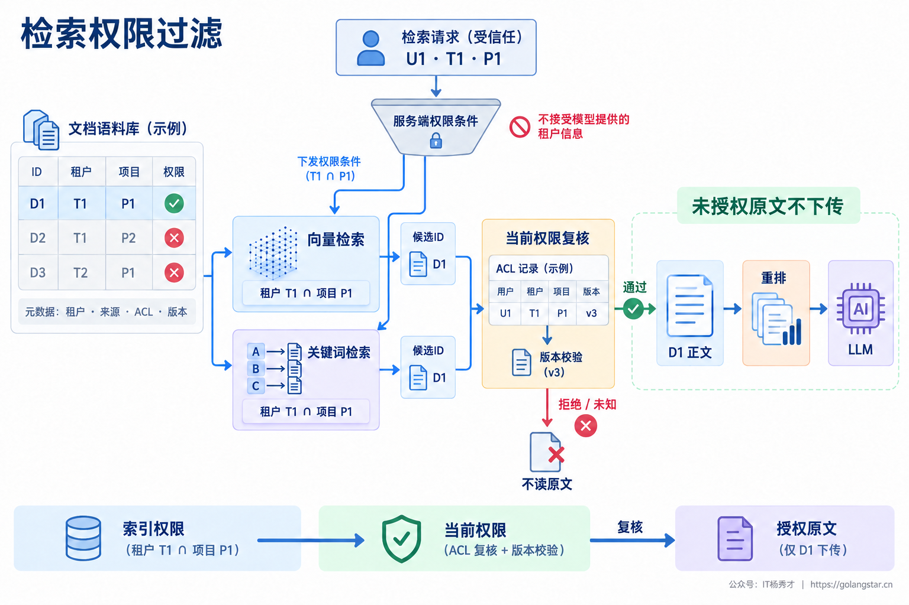
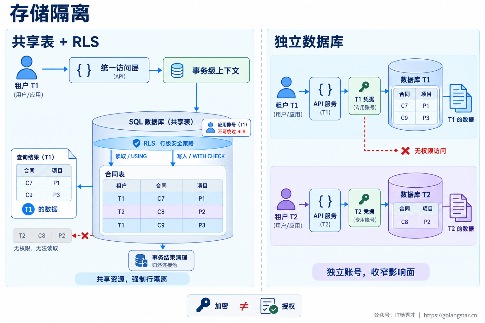
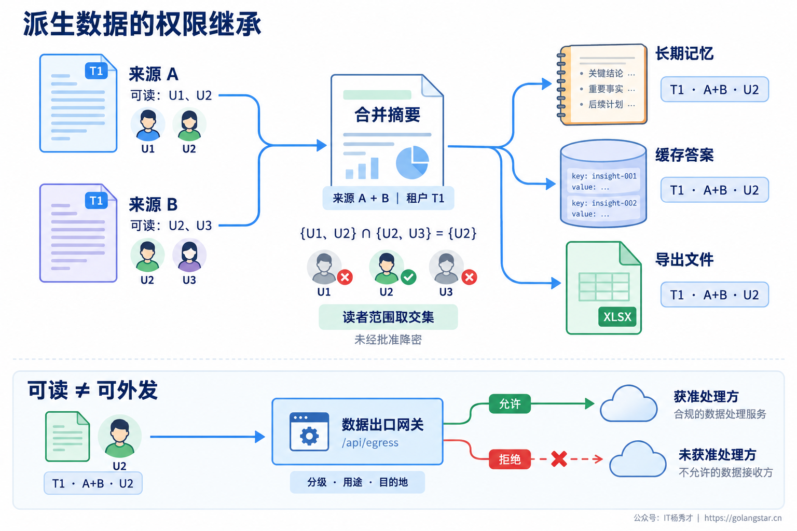
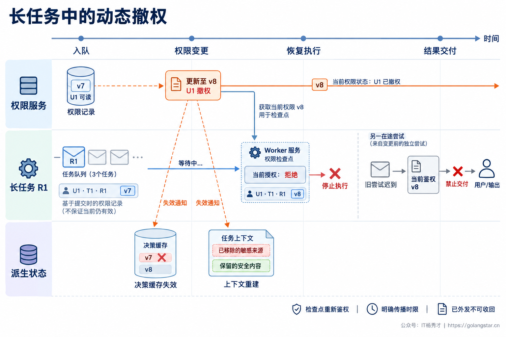

## **1. 题目分析**

销售人员只能查看自己负责的客户，财务人员能查看回款，但不一定能修改合同。接入 Agent 后，如果所有工具共用一个管理员账号，原来分散在业务系统里的权限边界就可能被一条自然语言指令穿透：前端没有“导出全部客户”的按钮，模型却恰好调用了拥有全库权限的导出接口。

会话没有串、Prompt 写了保密要求，都不能证明这个系统安全。企业级隔离要同时回答两个问题：**当前主体被允许做什么，以及数据在检索、推理、存储和交付过程中能流向哪里。** 模型可以提出计划，但权限应由模型之外的确定性执行层控制；即使计划出错，也不能获得额外权限。

### **1.1 身份与委托**

首先分清三种身份：发起业务请求的用户、所属租户，以及代为执行的 Agent 或服务。用户身份回答“为谁办事”，工作负载身份回答“谁在调用”，不能因为请求来自内部 Agent 就直接信任。企业系统应保留这条委托关系，而不是进入后台后统一变成超级管理员。

入口通过企业 SSO 或其他可信认证机制确认用户，校验令牌的签发方、受众和有效期，再验证当前租户成员关系。前端传来的 `tenant_id` 可以是租户选择，但不能直接成为可信身份；用户输入、模型参数和工具结果中的租户字段更不能覆盖服务端上下文。会话、任务及附件 ID 都必须检查资源归属，ID 难猜不等于有权限。

通过验证后，由服务端建立包含租户、用户、执行服务、任务和委托范围的上下文，跨 RPC、消息队列及子 Agent 显式传递。消息来源需要认证，关键字段需要完整性保护，不能只往 JSON 中加几个字段。保存身份用于追踪，但保存的“当时允许”不代表以后仍然允许。

对于用户委托型任务，有效权限应受用户当前权限、Agent 服务能力和本次任务授权共同约束，不能取三者并集。子 Agent 只能在父任务授权范围内进一步收窄。没有在线用户的定时任务则使用明确的服务主体和资源范围，不能假借一个永久有效的管理员用户。OAuth Token Exchange 可以表达主体与执行者关系，但令牌交换本身不会自动建立正确的权限策略。[RFC 8693](https://www.rfc-editor.org/rfc/rfc8693.html)对此区分了主体和执行者语义。

### **1.2 授权执行点**

登录成功只是认证，真正的授权需要判断“主体能否对这个具体资源执行这个动作”。RBAC 适合表达销售、财务、管理员等岗位能力，但“同一销售角色只能看自己项目的客户”还需要资源属性或成员关系。工程上通常组合角色权限、租户与项目属性、资源归属和共享关系，而不是不断创建更长的角色名。

授权逻辑可以由策略决策点统一管理，业务 API、检索入口和工具执行器分别作为执行点。输入是可信主体、资源、动作和环境条件，输出是允许或拒绝，以及字段范围等约束。执行点必须落实这些约束；只收到一个允许标记，却忽略“禁止导出”或“隐藏手机号”，仍然可能泄露数据。

动态隐藏无权工具可以减少误调用，但不能替代执行前校验。模型提出 `update_contract` 后，执行器先验证参数，再按可信租户查询合同归属并检查修改权限。模型只能提供待操作对象，不能指定数据库凭据或自行声明已获批准。调用下游时使用面向目标服务、短时且最小权限的凭据，凭据保留在执行层，不进入 Prompt。

高影响操作还需要独立审批，审批绑定具体资源、动作、关键参数和有效期；模型修改金额或收件人后，旧审批不能继续复用。正式提交前重新验证权限与审批，对并发变更敏感的资源结合版本检查或业务事务执行，避免“检查时允许、执行时已变更”。这是 [OWASP 关于过度代理能力的建议](https://genai.owasp.org/llmrisk/llm062025-excessive-agency/)所强调的下游授权与最小能力边界。

策略缺失或无法判断时默认拒绝受保护操作。权限服务短暂不可用时，可以使用仍满足业务新鲜度要求的受限决策缓存，但不能放行全部请求，更不能让 LLM 自己补一个授权结论。

### **1.3 检索权限过滤**

RAG 最危险的做法是先把全库召回内容送给模型，再要求它“只回答有权限的部分”。数据一旦进入上下文，可能出现在答案、推理产物、日志或后续工具参数中，末尾脱敏已经太晚。权限过滤必须发生在受保护内容进入重排、模型和其他下游处理之前。

入库时就要保留来源文档的租户、资源 ID、访问控制列表和权限版本。切块、OCR、表格抽取及向量化不能丢掉这些元数据，缺失权限信息的文档应隔离待处理，而不是默认为公开。Embedding 和重排服务也属于数据处理方，选用外部服务时同样需要满足数据外发要求。

查询由可信服务端生成强制租户条件和访问范围，并与业务筛选条件取交集。向量检索、关键词检索、多路召回都要应用同一权限边界，不能只保护向量分支。索引可以采用用户、组或资源关系过滤，但必须了解底层过滤发生的阶段；检索服务内部产生候选不等于可以把未授权原文交给外部重排器。

索引权限可能落后于业务系统，因此读取正文、送入下游前还需要按当前权威权限复核，不能只相信索引里的旧标签。若所用托管检索无法在其内部语义处理前满足授权时效要求，就应禁用那条处理路径或使用符合边界的索引，不能用返回后的检查掩盖已经发生的越权处理。无法确认权限时不继续扩召回、取消过滤或切换全库搜索。

正文、标题、引用链接和下载入口都属于受保护输出。不能正文没泄露，却通过“某秘密项目存在三份文档”暴露元数据。[Azure AI Search 的安全过滤说明](https://learn.microsoft.com/en-us/azure/search/search-security-trimming-for-azure-search)也明确指出，不返回某个字段并不等于完成文档授权，真正的访问限制需要在每次查询中实施。

### **1.4 存储隔离**

租户隔离可以采用共享表、独立 Schema 或库，以及独立实例等不同层级。共享方案成本较低，但必须防止漏加条件；独立部署缩小了误访问和运维故障的影响范围，却增加迁移、备份和容量管理成本。选择依据是数据敏感度、隔离要求和运营能力，而不是所有租户一律独占，或所有数据一律混存。

共享表至少应有强制租户边界，索引、唯一约束及关联关系也要按业务语义包含租户维度。只给主查询加条件，关联查询却只按局部 ID 连接，仍可能关联到其他租户的数据。应用层统一数据访问接口之外，还可以使用数据库行级安全做第二层约束，读路径与新增、更新路径都要覆盖，防止把记录写进另一个租户。

以 PostgreSQL RLS 为例，运行账号不能拥有超级用户或 `BYPASSRLS` 权限，表所有者通常也会绕过策略，必要时需要 `FORCE ROW LEVEL SECURITY`。多个策略的组合关系同样要检查，避免一条宽松策略扩大访问范围。这些行为在 [PostgreSQL 行级安全文档](https://www.postgresql.org/docs/current/ddl-rowsecurity.html)中有明确说明。

连接池复用时，租户上下文应在正确的事务边界设置和清理，不能残留给下一次请求。若策略依赖应用可设置的租户变量，这仍以应用层可信为前提；把任意 SQL 执行能力交给模型，再指望该变量防住越权，并不成立。需要收窄 SQL 能力、账号权限和可访问字段。

对象存储、向量集合、临时文件和代码执行环境也要纳入隔离。路径前缀与 namespace 只是组织方式，只有访问接口强制校验范围才形成权限边界。敏感字段应在可信服务内按授权投影或脱敏，运行环境限制挂载、网络出口及凭据访问。传输和静态加密保护数据载体，但不能替代业务授权，也不能防止拥有广泛解密权限的服务越权读取。

### **1.5 数据流转边界**

数据隔离不止保护原始数据库。Agent 还会生成摘要、长期记忆、检查点、缓存答案和导出文件，这些都是新的数据副本。原文只允许项目成员查看，生成的摘要就不能因为存进 Redis 或记忆库而自动变成全公司可见。

派生数据需要保留租户、来源资源与版本、可见范围和有效期。包含多个受限来源且未经批准降密的摘要，默认只对同时有权访问这些来源的主体开放，不能取来源读者范围的并集。无法追踪来源时应限制共享或重新生成；删除原文也不意味着摘要、缓存、备份里的副本已经消失。

缓存键应覆盖租户、授权范围指纹或权限版本，以及来源和业务条件；命中后仍要验证当前主体是否可以使用结果。仅按问题文本做语义缓存，同一问题可能让财务的答案命中到销售会话。反过来，所有缓存都加用户 ID 虽然容易隔离，却会失去可合法共享的价值，应按实际可见范围划分，而不是盲目共享或一概私有化。

模型调用本身也是一次数据外发。企业员工有权阅读一份合同，不等于有权把它发给任意外部 LLM、重排或观测平台。调用网关应结合数据分级、用途和允许的处理方选择路由，最小化发送字段，并核对相应的数据保留与使用安排；不满足条件时使用获准环境或拒绝处理，不能故障切换到未获准供应商。导出、邮件和 HTTP 工具还需要检查收件人、目的地址及发送范围，通用网络工具应防止访问非预期内网服务。

下载链接也不能永久公开。S3 预签名 URL 本质上是持有者凭证，在有效期内可能被转用，而不必重新验证网站用户身份。[AWS 文档](https://docs.aws.amazon.com/AmazonS3/latest/userguide/using-presigned-url.html)说明了这个边界。应限制对象、动作和有效期；要求下载时检查最新权限的敏感文件，应通过受控下载接口提供。

### **1.6 权限动态撤销**

一个长任务启动时有权读取合同，不代表员工退出项目后，后台 Worker 仍能继续导出。任务入队时记录委托关系，出队、恢复、访问敏感资源及交付结果时重新鉴权，不能把队列消息里的旧角色列表当成永久授权证明。

撤权需要联动决策缓存、检索权限、活跃会话和派生结果。可以通过权限版本与变更事件使旧决策失效，执行点在使用前检查所需版本或重新查询权威来源，并明确最大传播延迟。只设置一个缓存 TTL，并不等于撤权立即生效；高敏操作应采用更严格的新鲜度要求，无法满足就暂停。

已经装入上下文的数据也要处理：相关来源失去访问权后，不能继续用旧摘要回答下一轮，应清理受影响上下文或用仍获授权的来源重建。旧尝试迟到时，返回结果还需要通过当前授权与版本校验，不能因为任务最早通过过鉴权就继续交付。对撤权与执行之间的竞争，要在关键业务接口内结合权限版本、资源版本及条件提交落实约束。

撤权能阻止后续使用，却不能保证收回已经发给用户、模型服务或已下载的数据，也不能自动撤销已经提交的业务操作。因此系统必须说明授权检查的时点、撤权生效范围与在途任务处置方式，不能承诺一个无法实现的“瞬间全部擦除”。

### **1.7 审计与验证**

隔离设计需要用可重复的负向测试证明。建立至少两个租户，并包含同租户内的不同项目与角色，验证替换资源 ID、伪造租户、绕过工具列表、读取其他任务结果、命中旧缓存和撤权后恢复任务都无法越权。只测跨租户不够，同租户的财务与销售之间也有边界。

授权层测试应直接构造工具请求，绕过模型是否愿意执行这一不确定因素；端到端测试再加入恶意文档与提示注入，观察即使模型生成危险调用，执行点是否仍然拒绝。不能只断言最终答案没有敏感词，还要检查检索、重排、模型入参、对象下载和工具副作用，确保未授权内容根本没有流入不该去的位置。

审计记录主体、租户、执行服务、资源、动作、策略版本、决策理由及任务关联 ID，敏感操作和拒绝事件应可追溯。日志默认保留必要元数据，敏感载荷按需脱敏、单独授权并限制保留时间，避免观测平台成为绕过业务权限的第二个数据库。

线上关注异常跨租户访问、拒绝率变化、权限传播延迟、过期授权命中和未通过校验的调用，并将核心授权规则纳入回归测试。[OWASP 授权指南](https://cheatsheetseries.owasp.org/cheatsheets/Authorization_Cheat_Sheet.html)强调默认拒绝和逐次检查。真正的验收标准不是模型表现得很守规矩，而是无论模型如何选择，执行与数据流转都越不过既定边界。

***

## **2. 参考回答**

我会把权限和数据隔离做在模型之外。入口通过企业身份系统确认用户、租户和执行服务，租户不能直接相信前端或模型参数。用户委托任务的权限取用户当前权限、Agent 能力和任务授权的交集，子 Agent 继续收窄。工具执行前按具体资源和动作做确定性授权，角色权限结合项目关系与资源属性；隐藏工具只是减少误调用，不能替代校验。高影响操作绑定具体参数审批，下游使用短时、最小权限凭据，不把密钥交给模型。

数据层首先在检索阶段强制租户和权限过滤，并在原文进入重排、LLM 前校验当前权限，不能等生成答案后再遮盖。数据库用统一访问层配合行级安全，检查运行账号和连接池上下文；对象存储、文件和执行环境也要隔离。摘要、记忆和缓存继承来源权限，缓存命中不是免鉴权，模型外发还要核对处理方和数据分级。长任务恢复、敏感操作与结果交付时重新鉴权，撤权联动旧缓存和上下文，同时明确已经外发的数据不能保证收回。最后用跨租户、同租户跨项目、旧缓存与撤权测试验证，并检查下游真实数据流和副作用，而不是只看模型有没有拒答。

## **学习交流**

> 如果您觉得文章有帮助，可以关注下秀才的<strong style="color: red;">公众号：IT杨秀才</strong>，后续更多优质的文章都会在公众号第一时间发布，不一定会及时同步到网站。点个关注👇，优质内容不错过

🔥 配套实战项目，拆得开、跑得起、能写进简历

多 Agent 编排 + RAG 混合检索 · 31 篇深度教程 + 50+ 面试题

<a href="/projects/dev-support.html" style="display: inline-block; margin-top: 14px; background: #ff7a18; color: #fff; font-size: 18px; font-weight: bold; padding: 10px 28px; border-radius: 24px; text-decoration: none;">点击查看 DevSupport AI 实战项目 →</a>

