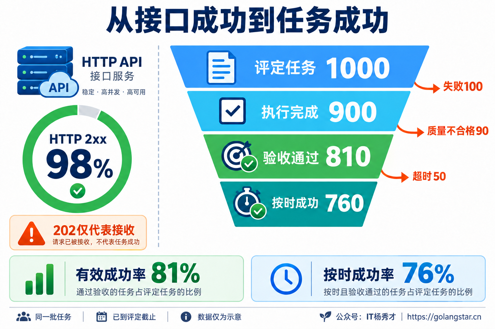
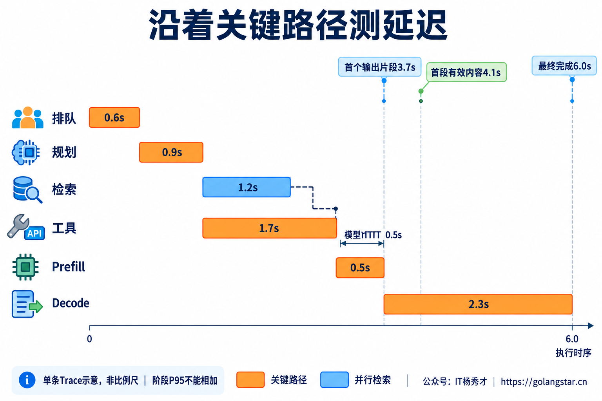
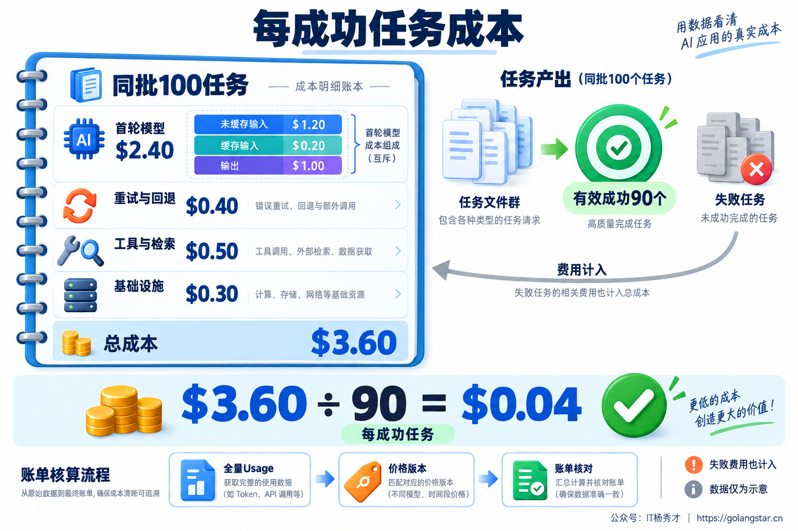
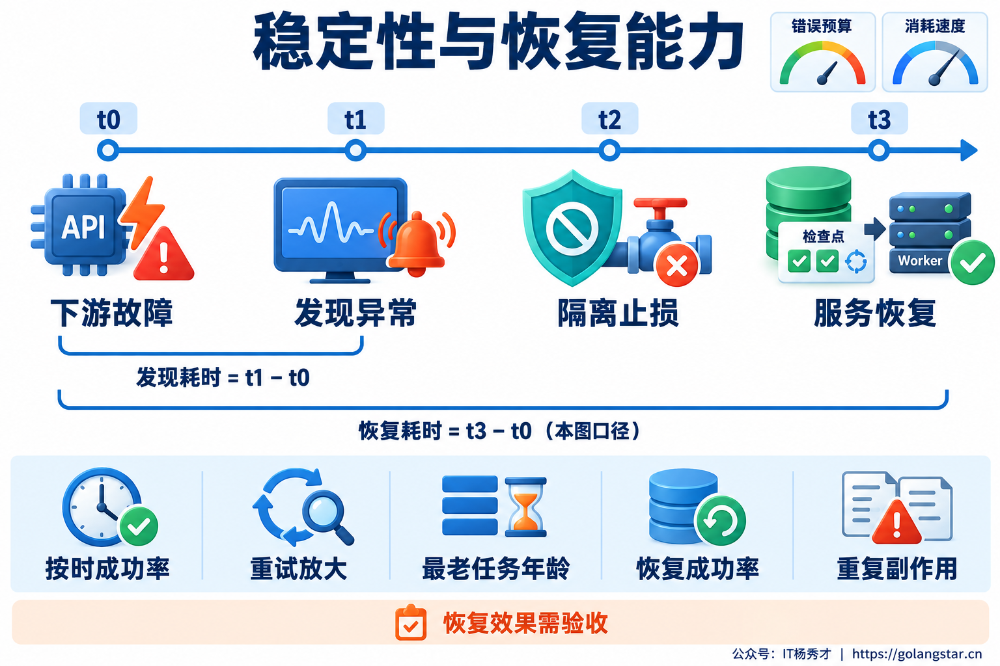
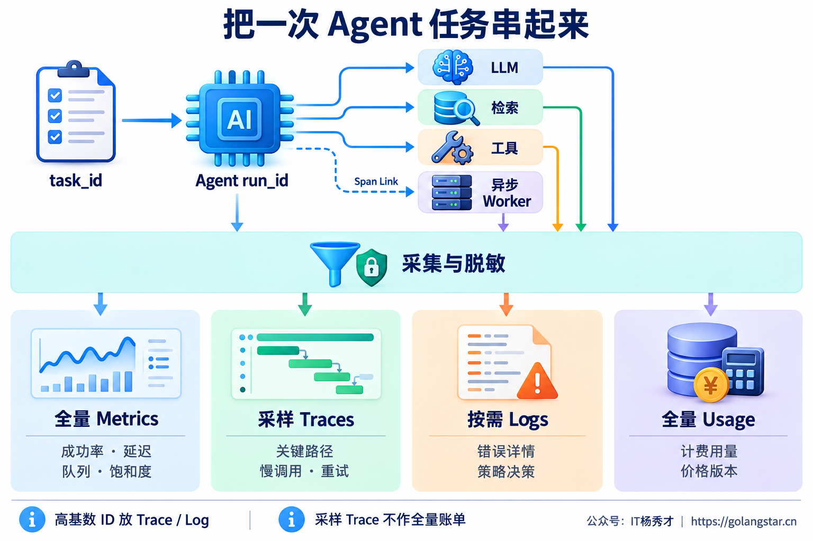
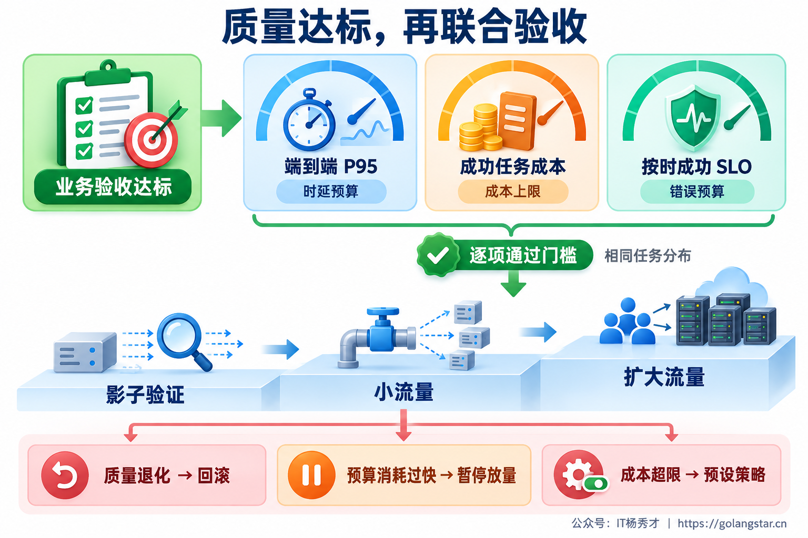

## **1. 题目分析**

模型接口的成功率一片绿色，用户却在投诉：报告一直生成不完，工具执行到一半中断，同一个任务重试几次后账单翻倍。这种情况在 Agent 服务中并不矛盾。接口监控记录的是某一次调用，用户购买的却是一件事情被完整解决。

更麻烦的是，三个看板还可能同时给出误导。提前返回“正在处理”让首包变快，减少检索让 Token 变少，大量重试让最终接口成功率变高；但任务质量、等待时间和实际费用都可能变差。因此，评估首先需要一个共同尺度：**同一批业务任务，在质量达标的前提下，完成得多快、花了多少钱、能否持续可靠地完成。**

### **1.1 先把任务的分母对齐**

工程上应区分逻辑任务、执行过程和调用尝试。`task_id` 标识一次去重后的业务需求，`run_id` 标识执行过程，`attempt_id` 标识某个步骤的一次尝试。一个任务故障恢复三次，仍然只是一件业务任务，不能因此把任务总数增加三次。

成功也需要独立验收。查询型 Agent 要检查结果相关性、事实依据与必要字段；执行型 Agent 要验证数据库或外部系统中的最终状态。模型回答“预订成功”，而订单没有实际创建，不能算业务成功。[Anthropic 的 Agent 评估实践](https://www.anthropic.com/engineering/demystifying-evals-for-ai-agents)也强调区分执行轨迹与环境中的真实结果。

任务台账至少保留接收时间、执行截止时间、终态、验收结果和验收规则版本。有效请求范围要提前约定：非法输入与正常业务拒绝单独归类，容量不足导致的有效请求拒绝需要进入相应的服务体验统计；不能只统计成功进入 Worker 的请求。用户取消、人工接管、降级完成也分别记录，不能统一折算成成功。

异步任务尤其容易算错。按小时统计费用，再除以该小时完成的任务数，可能把昨天启动的长任务与今天的新任务混在一起。更稳妥的办法是按提交批次归集，并等到该批任务走完约定评定窗口再核算。未到期的任务显示 Pending；已经超过截止时间的任务，即使仍在运行，也不能从按时完成率的分母里消失。人工等待时间是否暂停某个服务时钟，也必须事先明确，同时保留用户感知的总历时。

图中数字仅为示意：同一批 1000 个已到评定截止时间的任务，900 个执行完成，810 个通过验收，760 个按时通过验收。有效成功率是 81%，按时成功率是 76%。旁边的 HTTP 成功率属于另一种统计单位，不能拿来替代这两个结果。

在这个共同口径上，核心看板可以收敛成三组：

| 维度 | 面向业务的核心指标 | 用于定位问题的下钻指标 |
| --- | --- | --- |
| 性能 | 端到端 P95/P99、首个有用内容时间、有效吞吐 | 排队、模型首输出、流式停顿、检索与工具耗时 |
| 成本 | 每任务成本、每有效成功任务成本、任务成本长尾 | 各阶段用量、重试与回退费用、模型占比、账单差异 |
| 稳定性 | 有效成功率、按时成功率、错误预算、恢复能力 | 超时、中断、重试放大、队列年龄、依赖错误与资源饱和 |

### **1.2 性能沿着用户等待的路径测量**

端到端 RT 的起点是应用接收到任务，终点是业务终态及结果对用户可用。排队、检索、多轮推理、工具调用和重试都在其中。异步接口返回 202 的耗时只能作为接收接口延迟，不能充当长任务完成耗时。

交互型 Agent 还需要测首个有用内容时间。“正在思考”和心跳包只能说明连接仍然存在，不能代表业务已经取得进展。首个有用内容应由产品场景定义，例如出现第一段有依据的答案，或返回第一个可使用的检索结果，不能由模型随意打标。

模型层的 TTFT 则是另一段时钟：客户端从发出模型请求开始计时，服务端可能从接收或调度开始计时。首个流式 chunk 还可能只有角色或元数据，所以埋点必须写清“首包”“首输出片段”与“首 Token”的测点。输出阶段可以统计 TPOT、输出速率及长停顿比例，但 chunk 可能包含多个 Token，chunk 间隔不等于真实 Token 间隔。[vLLM 的基准指标说明](https://github.com/vllm-project/vllm/blob/main/docs/benchmarking/cli.md)也提醒比较指标前先对齐公式与采集方式。

这条示意 Trace 中，检索与工具调用并行，最终模型等待较慢的工具分支结束。最终模型首输出只用了 0.5 秒，用户却已经等待 3.7 秒；第一段有效内容在 4.1 秒出现，完整任务在 6 秒结束。单看模型 TTFT，很难解释用户为什么觉得慢。

聚合时保留 P50、P95、P99，同时展示样本量、失败率与超时率。只画成功请求的 RT，会让大量慢请求超时退出后呈现“性能改善”。超时请求应进入超时 SLI，按实际观测到的等待时间单独记录，不能伪造它们本来会在何时成功。

**总 P95 需要从端到端分布计算，不能把阶段 P95 相加，也不能平均各 Pod 的 P95。** 跨实例应先聚合兼容的 Histogram，再计算分位数；桶精度会影响估算，SLO 阈值附近需要足够分辨率。具体原理可参见 [Prometheus Histogram 文档](https://prometheus.io/docs/practices/histograms/)。

容量评估还要同时看入口到达率、实际接收率、在途任务数、最老排队任务年龄与完成速率。本文把单位时间内“通过业务验收且满足时延目标”的任务数定义为有效吞吐 Goodput。QPS 上升而有效吞吐下降，通常意味着系统正在用更多资源处理排队、超时和无效尝试。

### **1.3 成本按成功完成一件事结算**

Token 总量适合描述消耗，但不同模型、缓存类型和服务档位的单价不同，同样的 Token 数并不对应同样的费用。成本台账需要按任务归集所有实际计费尝试，覆盖规划、生成、Embedding、Rerank、工具 API，以及选定核算范围内的计算、存储、观测和人工接管费用。

两个口径应同时保留：**每任务成本 = 同批任务全部成本 ÷ 任务数；每成功任务成本 = 同批任务全部成本 ÷ 验收成功任务数。** 后者的分子必须包含失败、重试、回退和恢复消耗。没有成功任务时应显示“无成功产出，无法计算”，不能显示零成本。

图中的示意账本把首轮模型、额外尝试、工具检索和基础设施分摊分别核算。同批 100 个任务共花费 3.60 美元，90 个有效成功，成功任务单价为 0.04 美元。缓存输入仍按对应规则收费，失败任务的支出也没有被隐藏。示例金额不代表任何厂商真实报价。

这种口径能识别“账单下降，产出更贵”的情况。假设方案 A 处理同一组 100 个任务花 10 个成本单位，成功 90 个；方案 B 花 8 个单位，成功 60 个。总支出下降 20%，成功任务单价却从约 0.111 升至 0.133。性能与成本比较必须带着业务质量一起看。

用量归一化需要供应商适配层。不能把不同接口里同名的 `input_tokens` 直接混加；例如 Claude 的缓存读写与普通输入分开返回，需要按其字段口径归集，参见 [Claude 缓存用量说明](https://platform.claude.com/docs/en/build-with-claude/prompt-caching)。推理 Token 也可能已经包含在输出总量中，例如 [OpenAI 的推理用量](https://developers.openai.com/api/docs/guides/reasoning)，不能把明细再次叠加计费。

每条用量事件保留原始 Usage、归一化用量、模型版本、计费档位、币种、价格版本和对账状态。流式中断或超时导致 Usage 缺失时，应标记未知或估算，随后与供应商账单核对，不能当成免费。自建模型核算 GPU、空闲容量和基础设施分摊，外部 API 按实际采购费用核算，避免把同一笔费用计算两遍。

日常还要看单任务成本 P95/P99、调用轮数、输入输出分布、重试费用占比与预算耗尽率。总账单上涨可能只是业务量增长；成功任务单价、任务结构和失败浪费一起上升，才更像链路正在失控。

### **1.4 稳定性需要业务结果和恢复证据**

稳定性至少包含三个层面。业务层观察有效成功率、按时成功率、错误结果与人工接管；执行层观察超时、流式中断、步骤上限触发、悬挂任务和重试放大；依赖层观察模型 429/5xx、工具失败、检索错误、连接池等待和资源饱和。资源层检查 CPU、内存、GC 与 Worker 利用率，自建推理还需下钻 GPU、KV Cache 与调度等待。重试放大按同类逻辑调用统计，为实际尝试次数除以逻辑调用次数，不能把正常的多轮推理都算成重试。

一次工具失败后重试成功，任务层可以成功，工具层仍应保留失败记录。降级返回了内容，也要按降级质量档位单独展示；一段无法解决问题的兜底话术不能记成完整任务成功。SSE 连接建立后中断，接口层可能仍显示 200，应用层需要检查终态事件与结果可达性。

SLO 应按任务类型制定。在线问答、批量报告和需要人工审批的任务，时延承诺与验收方式不同，不能套用一个统一的“99.99%”。本文采用“约定窗口内按时有效完成的任务数 ÷ 纳入统计的任务数”作为一种业务 SLI，并据此设定目标。Google SRE 对 [SLI 与错误预算](https://sre.google/workbook/implementing-slos/)的定义提供了这一设计基础。

若目标是 99%，错误预算比例就是 1%；某个观察窗口内坏任务率达到 5%，预算燃烧率为 `5% ÷ 1% = 5`。它表示当前消耗速度是目标允许速度的 5 倍，不等于已经用掉整个月预算的 5 倍。累计预算仍需按目标窗口的实际事件数核算。

告警可以采用长短窗口同时判断：短窗口确认问题仍在发生，长窗口确认影响已经持续。低流量业务还要结合失败事件数和合成探测，避免单个事件反复触发。阈值应匹配业务量与值班响应能力，而非直接照抄示例，参见 [Google SRE 多窗口告警](https://sre.google/workbook/alerting-on-slos/)。越权或重复扣款等安全事件不能因为错误预算充足而被容忍。

故障之后还要观察恢复成功率、恢复耗时分布、无法继续的任务数，以及恢复后的重复副作用。图中把从故障发生到服务恢复定义为一次恢复耗时；跨事故汇总平均值时才涉及 MTTR，而且必须声明起止点。Pod 重新启动不代表用户任务已经恢复，长任务可能仍卡在检查点、待核对的外部动作或积压队列中。

### **1.5 让指标能够追溯到具体任务**

指标出现异常后，排查路径应能从任务类型和发布版本下钻到具体 Trace，再找到慢步骤、失败尝试与成本事件。根层记录任务生命周期，子层记录规划、LLM、检索、工具和等待；跨队列传播上下文，长期或多来源异步执行使用合适的 Span Link，不能到 Worker 就断链。

Metrics、Traces、Logs 和费用台账承担不同职责。全量计数与 Histogram 描述总体分布，采样 Trace 解释关键路径，按需日志保留错误详情与策略决策，全量 Usage 台账负责计费归集与对账。它们通过标识关联，但**计费台账不能从采样 Trace 推导**。专门保留慢请求、错误请求的 Trace 样本有明显偏向，也不能直接代表总体成功率或 P95。

模型调用可以采用 OpenTelemetry GenAI 约定，再补充业务指标。截至本文核验，其 [GenAI 指标规范](https://github.com/open-telemetry/semantic-conventions-genai/blob/main/docs/gen-ai/gen-ai-metrics.md)仍处于 Development，工程上需要固定约定与埋点版本，不能假定升级后字段和含义永远不变。

常规指标标签使用任务类型、受控模型路由、结果类型、有限发布版本等低基数维度。`task_id`、`run_id`、用户 ID 放在 Trace、日志或台账中，避免时序数量随请求数增长。原始 Prompt、用户资料、工具凭据和完整输出默认不采集；确需分析内容时，单独实施授权、脱敏、访问控制和保留期限。

观测系统本身也需要监控采集丢失、队列积压、Usage 缺失率与账单差异。埋点漏报造成的“成功率上升”，属于数据质量故障，不能当作业务改善。

### **1.6 用可比较的实验完成验收**

看板能描述线上状态，版本是否更好还需要实验。先固定代表性任务集、验收规则和模型、Prompt、工具、知识版本；按复杂度、上下文长度与任务类型分层，多次运行观察波动。能够确定性验证的结果直接检查真实业务状态，主观质量由人工标注或经过人工校准的评估模型补充，同时报告评估覆盖率与不确定性。

压测回放真实到达率和任务长度分布，覆盖冷/热缓存、长时间负载、下游限流、工具超时与 Worker 重启。只用固定并发闭环压测，系统变慢时客户端会自动减少请求，可能掩盖过载；因此还需采用到达率模型，检查压测端是否漏发，相关区别见 [k6 开放与闭环负载模型](https://grafana.com/docs/k6/latest/using-k6/scenarios/concepts/open-vs-closed/)。

比较时要求质量达到门槛，再同时检查端到端尾延迟、成功任务单价、有效吞吐和任务 SLO。灰度过程按相同任务分布或分层结果比较，避免候选版本恰好接到更多简单任务。质量退化触发回滚，错误预算快速消耗暂停放量，成本超限执行事先定义的限额或路由策略。

最终验收应保留每个维度的独立门槛。一个加权总分会允许低成本抵消严重错误，或者让漂亮的平均延迟掩盖长任务失败。生产级 Agent 的评估结论，需要能够回答：具体哪类任务，在什么负载下，以什么质量和成本，持续完成到了什么程度。

***

## **2. 参考回答**

我会先统一到业务任务口径，用 task_id 去重，把多轮推理、重试和恢复都归到同一个任务，并定义业务验收标准和截止时间。HTTP 200 或模型正常返回只能代表局部成功，最终还要验证结果或外部业务状态。性能上重点看端到端 P95/P99、首个有用内容时间和满足质量、时延要求的有效吞吐，再通过 Trace 下钻排队、模型首输出、检索、工具和流式停顿。分位数从整体 Histogram 计算，不能平均各实例 P95，也不能把阶段 P95 相加。

成本上我会看每任务成本和每有效成功任务成本，把同一批任务的失败、重试、回退费用全部计入，通过全量 Usage 台账按模型与价格版本归集、对账。稳定性看有效成功率、按时成功率、超时和流式中断、重试放大、队列年龄以及恢复成功率，并按任务类型设 SLO，用错误预算消耗速度告警。落地时用 Metrics 看全局、Trace 查路径、日志查细节，费用台账独立保留。最后通过代表性任务集、真实负载压测和灰度验证，要求质量达标、性能和成本受控、稳定性不退化，避免只优化某一张看板。

## **学习交流**

> 如果您觉得文章有帮助，可以关注下秀才的<strong style="color: red;">公众号：IT杨秀才</strong>，后续更多优质的文章都会在公众号第一时间发布，不一定会及时同步到网站。点个关注👇，优质内容不错过

🔥 配套实战项目，拆得开、跑得起、能写进简历

多 Agent 编排 + RAG 混合检索 · 31 篇深度教程 + 50+ 面试题

<a href="/projects/dev-support.html" style="display: inline-block; margin-top: 14px; background: #ff7a18; color: #fff; font-size: 18px; font-weight: bold; padding: 10px 28px; border-radius: 24px; text-decoration: none;">点击查看 DevSupport AI 实战项目 →</a>

