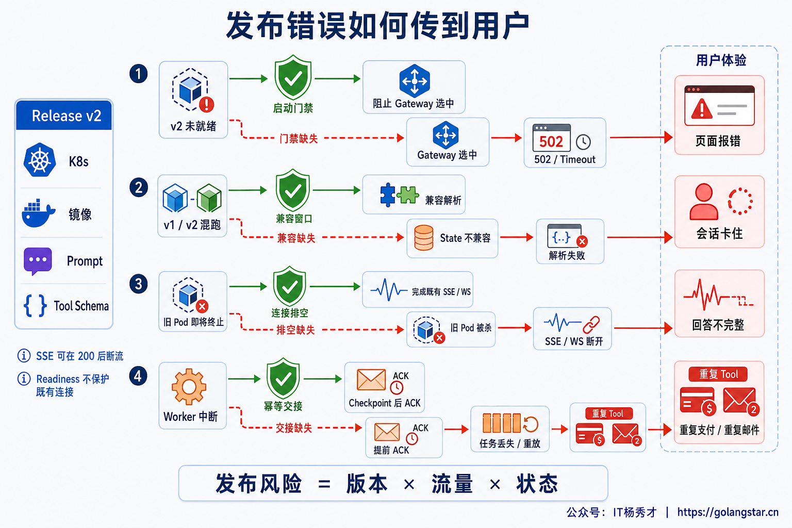
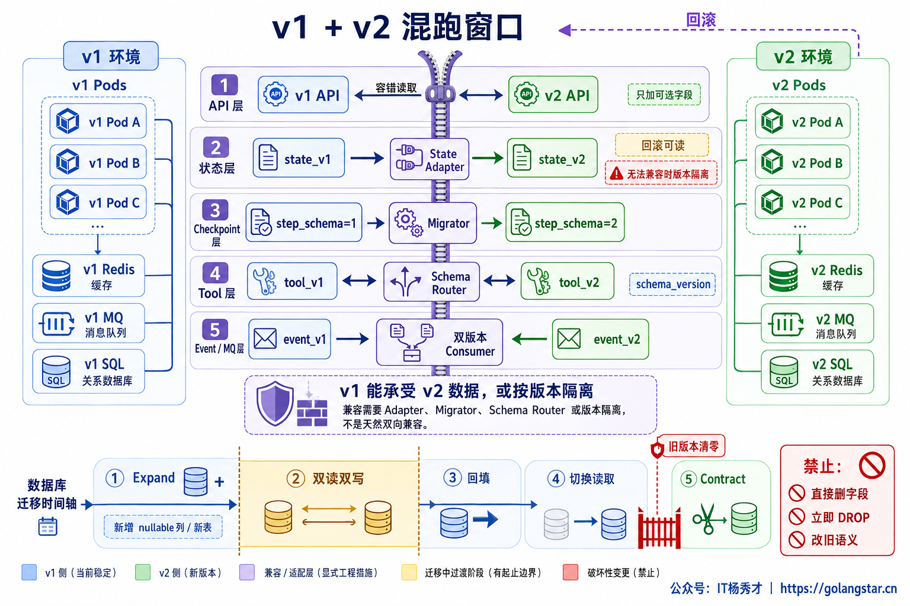
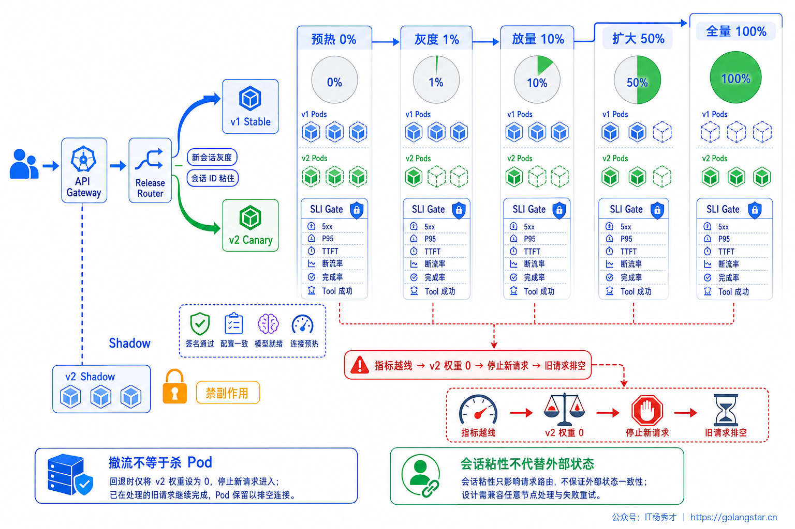
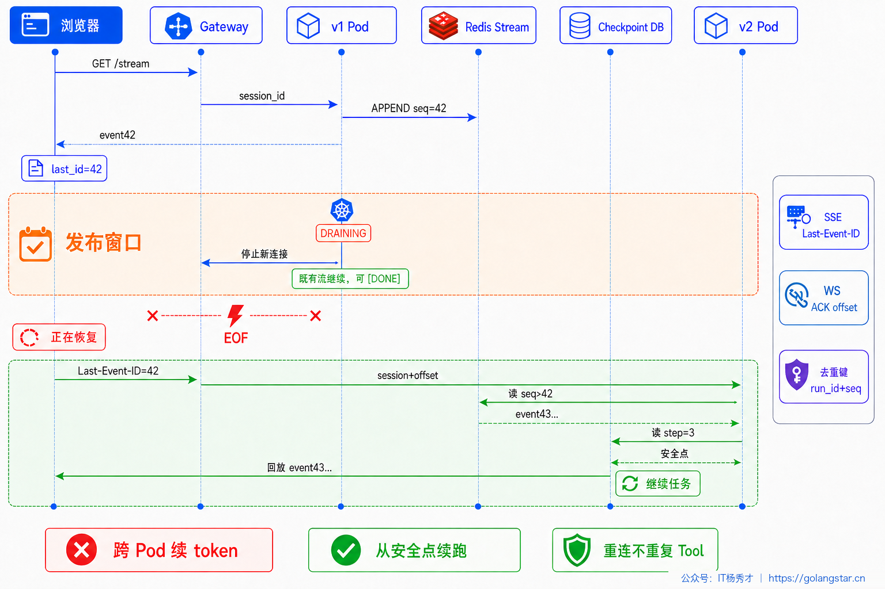
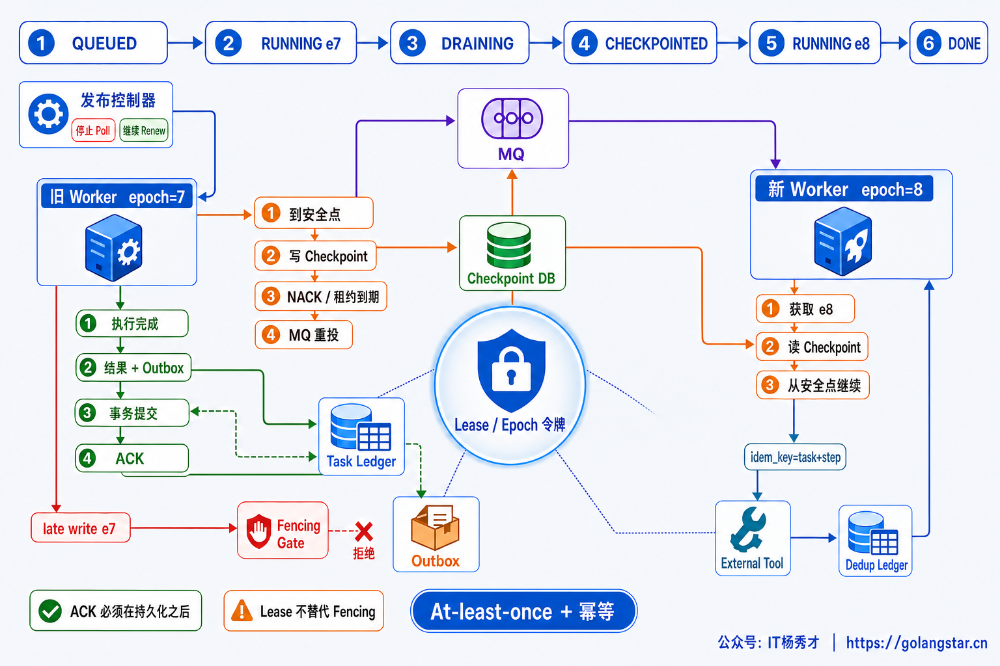
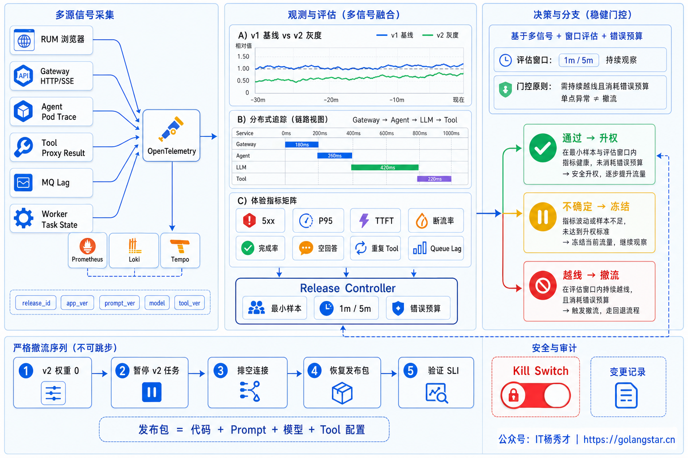

## **1. 题目分析**

发布控制台显示全部 Pod 已经 Ready，并不代表用户真的无感。一次 Agent 发布期间，普通接口可能出现 502，已经输出半段内容的 SSE 可能突然断开，跑了十分钟的任务可能回到起点，甚至某个“发送邮件”Tool 已经成功却因结果未落盘而再次执行。后两类问题往往发生在 HTTP 已经返回 200 之后，单看发布状态和 5xx 根本发现不了。

这类问题的根源，是把发布理解成了“用新 Pod 替换旧 Pod”。Agent 的真实发布对象远不止镜像，还包括 Prompt、Workflow、Tool Schema、模型路由策略、Checkpoint、消息格式、数据库结构、索引与缓存版本。滚动窗口内，新旧版本会同时读取和写入这些状态；只要其中一项不能共存，错误就可能沿着流量、连接或任务链路传给用户。

因此，发布体验保障需要守住五个结果：新请求只进入真正可服务的版本；一个进行中的 Run 不在中途切换执行契约；已开始的流式回答可完成或可恢复；异步任务不丢失且副作用不重复；异常版本可以先撤流，再安全回退。



### **1.1 先把一次发布定义成不可变的 Release Bundle**

最常见的隐患是只给应用镜像打版本，而 Prompt 在配置中心被覆盖、Tool Schema 原地修改、模型路由规则随时变化。此时同一个 `app_version` 可能对应多套实际行为，线上报错既无法复现，也无法完整回滚。

工程上应把一次变更封装成不可变的 Release Bundle，至少记录：

```text
release_id = {
  app_ver, workflow_ver, prompt_ver, tool_schema_ver,
  model_policy_ver, config_ver, checkpoint_schema_ver,
  event_schema_ver, db_schema_compat, index_ver, cache_epoch
}
```

每个新建 `run_id` 在创建时绑定一个 Bundle，后续规划、工具调用、恢复和写回都沿用它。发布期间即使路由策略或 Prompt 已升级，正在运行的 Run 也不能悄悄换版本，否则前一步按旧 Tool 参数生成的计划，可能在下一步交给新 Tool Schema 解析；旧 Workflow 写下的 Checkpoint，也可能被结构完全不同的新图加载。

这并不意味着旧 Pod 必须一直存活。状态和任务所有权外置后，新 Worker 可以加载旧 Bundle 对应的兼容执行器继续运行。无法兼容时，则需要让未结束的 Run 保持版本亲和，等自然排空后再回收旧执行环境。

### **1.2 发布前先证明新旧版本能够同时工作**

滚动发布必然存在 `v1 + v2` 混跑窗口，兼容性必须在切流之前解决。API 和事件格式优先采用增量演进：新增字段先设为可选，Reader 忽略未知字段，删除或改变旧字段语义要等旧版本彻底清零。Tool 的兼容范围不只是函数名，还包括参数、返回结构、错误码和副作用语义；高风险变更更适合发布新版本 Tool，由 Schema Router 根据 Bundle 选择，而不是覆盖旧定义。

数据库变更通常采用 `Expand → Migrate → Contract`。先增加 nullable 列、新表或兼容索引，让 v1、v2 都能运行；再双读或双写并完成回填；确认旧版本和旧数据访问都已清零后，才删除旧结构。破坏性 DDL 一旦执行，回滚镜像并不能让旧代码重新读懂数据库。

Checkpoint 和消息协议同样需要版本号。新代码要么能读取旧状态并通过 Migrator 升级，要么把旧状态隔离给旧执行器；消费者要在整个混跑窗口兼容新旧事件。缓存 Key 也必须包含 `release_id` 中真正影响结果的版本，例如 `prompt_ver`、`tool_schema_ver`、`model_policy_ver` 和 `index_ver`，否则 Canary 可能命中 Stable 的旧结果，既污染实验，也把兼容问题伪装成偶发错误。



发布门禁不能只做单元测试。更可靠的组合是：契约测试验证 API、Tool、Event 和 Checkpoint 的双向兼容；固定 Agent Eval 验证任务完成率、工具选择和答案质量；脱敏生产 Trace Replay 覆盖真实长上下文和边界输入；新版本启动后再执行不产生副作用的合成探测。只有这些检查通过，实例才取得切流资格。

### **1.3 切流要按用户旅程渐进，而不是按 Pod 数量碰运气**

新版本 Ready 后不应直接全量。更稳妥的路径是预热、Shadow、Canary、分阶段放量。预热要覆盖连接池、Prompt 与工具注册表、热点索引以及自部署模型；Shadow 可以复制真实请求验证性能和输出，但必须禁止支付、发消息、写库等副作用，不能把一次验证变成两次真实执行。

Canary 的分桶粒度也很关键。简单按 Pod 比例分流，可能让同一会话的第一轮落在 v1、第二轮落在 v2。Agent 的多轮上下文和长 Run 与版本强相关，通常应按 `tenant_id / conversation_id / run_id` 做稳定哈希：新会话按比例进入 v2，一旦创建 Run 就固定 Bundle，直到结束。粘性路由只是避免混版本，业务状态仍需外置，不能把 Pod 本地内存当作会话存储。



放量可以从 `0% → 1% → 10% → 50% → 100%` 逐级进行，但百分比不是固定答案。每一级都要满足最小样本量、观察窗口和业务 SLI 门禁；低流量导致样本不足时应保持当前权重，而不是自动判定通过。Canary 还要覆盖真实的意图、长短 Prompt、Tool 类型和租户等级，若 1% 流量只有简单问答，就无法验证真正高风险的 Agent 链路。

出现异常时，第一动作是把 v2 权重降为 0，阻止新请求进入，再排空 v2 的既有连接和任务。直接杀 Pod 虽然看起来回滚更快，却会把版本问题升级为断流、重复调用和任务丢失。

这里还要区分“副本滚动”和“精确切流”。原生 Deployment 通过 `maxSurge`、`maxUnavailable` 控制新旧副本数量，但 Pod 数量并不等于实际请求比例，长短请求、连接复用和热点会让流量分布明显偏离。需要可控百分比时，应由 Gateway、Service Mesh 或 Progressive Delivery Controller 承担流量权重；`maxUnavailable: 0` 只能降低容量缺口，无法证明新版协议兼容，也无法保护已经建立的长连接。

几个 Kubernetes 配置也容易被误当成安全兜底。`progressDeadlineSeconds` 只能把卡住的 Deployment 标记为发布失败，不会自动完成业务回滚；PDB 主要约束节点维护等自愿驱逐，并不替代 Deployment 的滚动策略；`preStop` 还会消耗同一份 `terminationGracePeriodSeconds`，不是额外赠送的排空时间。因此发布控制器必须显式编排“停止升权、撤走新流量、进入 Draining、等待或交接在途任务”，并把路由传播 P99、请求完成预算、Checkpoint P99 和 Flush 余量一起纳入终止期限。

对于功能开关、Prompt 和模型策略，稳定分桶要在 Run 创建时完成并持久化，不能在每一步重新求值。否则同一任务可能在开关比例不变的情况下跨越两套行为。回滚时也要恢复整个 Bundle，而不是只恢复镜像、却继续读取新版 Prompt 或路由配置。

只有流量权重、版本契约和任务生命周期由同一个发布状态驱动，控制面看到的“回滚成功”才可能与用户实际感受到的恢复一致。

### **1.4 长连接要设计可恢复体验，而不是只设计优雅关闭**

SSE、WebSocket 和 gRPC Stream 一旦建立，通常不会因为路由权重变化自动迁移到新 Pod。旧实例进入 Draining 后，应先拒绝新连接，让已有连接尽量自然完成；宽限期覆盖不了所有长回答时，系统必须把“连接断开”和“任务失败”拆开处理。

SSE 事件需要包含单调递增的 `id`，服务端把已发送事件追加到短期回放缓冲，浏览器保存最后确认的事件号。断开后客户端携带 `Last-Event-ID` 和 `run_id` 重连，新实例先回放缺失事件，再根据 Checkpoint 判断任务已经完成、仍在运行，还是需要从语义安全点恢复。WebSocket 没有原生的 `Last-Event-ID` 语义，需要应用层设计 `seq / ACK / resume_token`，并使用带 Jitter 的重连退避。



恢复不能承诺“从另一个 Pod 精确续写下一个 Token”。模型状态、KV Cache、版本和采样环境发生变化后，即使输入相同也未必逐字一致。可靠语义是回放已经确认的事件，并从最近一个持久化的 Agent 节点继续；如果继续生成会产生文本分叉，前端应显示“正在恢复”，通过新的消息段或替换事件明确表达，而不是悄悄拼出一段自相矛盾的回答。

重连还必须与 Tool 状态分离。已经成功扣款或发送邮件的步骤，要从幂等账本读取结果，绝不能因为 Stream 重建而重新执行。用户侧最终看到的是连续的会话，系统内部实现的是“事件可回放 + 工作流可恢复 + 副作用可去重”。

### **1.5 异步任务发布时要交接所有权，而不是依赖进程退出**

发布期间，Worker 进入 Draining 后先停止 Poll 新消息，但继续维护已经领取任务的 Lease。能在预算内完成的任务，应在业务结果、Checkpoint 和 Outbox 事务提交成功后再 ACK；无法完成的任务，在安全点写入 Checkpoint，然后 NACK、停止续租或等待可见性超时，让消息重新投递。

新 Worker 获得任务后以更大的 Epoch 取得 Lease，所有写回都携带 Fencing Token。旧 Worker 即使因网络延迟仍然返回结果，Store 也会拒绝旧 Epoch，避免两个版本同时推进同一 Run。MQ 通常提供的是至少一次投递，因此正确目标不是幻想 Exactly Once，而是用稳定的 `task_id + step_id`、幂等键、去重账本和 Outbox 把重复投递变成相同业务结果。



最危险的是 Tool 已成功、响应却丢失的 UNKNOWN 状态。恢复后盲目重试可能制造重复副作用，因此外部请求需要业务幂等键；第三方支持查询时先对账，不支持幂等也无法确认时进入补偿或人工队列。发布窗口结束并不代表这类风险已经消失，重复邮件、重复工单或重复支付往往稍后才被用户发现。

### **1.6 自动回滚必须以用户体验指标为证据**

基础设施指标只能说明 Pod 是否健康，不能说明 Agent 是否完成了用户任务。每条 Trace、日志和指标都应携带低基数的 `release_id`、应用版本、Prompt 版本和模型策略版本，从而直接比较 Canary 与 Stable。租户 ID、会话 ID 和请求 ID 放入 Trace 或日志，不应全部作为 Prometheus 标签制造高基数。

发布门禁至少包含三类信号。传输层观察 5xx、超时、首 Token 成功率、SSE/WS 异常断开与恢复成功率；Agent 层观察任务完成率、空回答、循环超限、Checkpoint 恢复率和版本不兼容错误；副作用层观察 Tool 成功率、UNKNOWN 数量、重复执行和补偿率。再结合 P95/P99、TTFT、Queue Lag 与语义 Eval，才能区分“接口没报错”和“用户真正拿到了正确结果”。



自动控制器应同时使用最小样本、多时间窗和错误预算：指标明确改善或持平才升权；样本不足或结果不确定就冻结；Canary 显著劣化则立刻撤流并触发 Kill Switch。Kubernetes 的 Rollout 完成、Pod Ready 或发布进度超时都不能代替业务判断，回滚动作也不能停在“旧镜像已恢复”。正确顺序是 `v2 权重归零 → 停止新任务 → 排空在途工作 → 恢复完整 Bundle → 验证 SLI 恢复`。

还要识别回滚边界。代码回滚无法撤销已发生的支付、消息、数据库破坏性变更，也无法自动恢复被覆盖的 Prompt 和模型策略。发布包必须整体可回退，Schema 删除要延迟到回滚窗口之后，不可逆状态则走 Forward Fix、补偿和对账。最终验收不是部署命令成功，而是用户旅程恢复、没有新增重复副作用，旧 Run 仍能完成。

### **1.7 用故障演练验证“用户无感”是否成立**

上线前需要主动制造发布窗口中的真实故障：Canary 只加载了一半工具定义；v1 正在输出 SSE 时收到强杀；v2 读取旧 Checkpoint 失败；Tool 已执行但 Worker 尚未记账；新版事件进入队列后立即回滚；缓存 Key 遗漏 Prompt 版本。演练时不仅检查服务恢复，还要从同一用户视角验证会话是否连续、回答是否重复、任务最终状态是否明确、外部副作用是否只发生一次。

发布期间避免用户报错，本质上不是追求“永远不断连接”，而是把变更控制在可兼容、可分桶、可观测、可恢复、可撤销的边界内。实例启停只是底座；真正决定体验的是，新旧版本共同存在时是否仍遵守同一份业务契约。

***

## **2. 参考回答**

生产环境里，我不会把发布只当成 Pod 滚动替换，而是把它当成新旧版本并存的一段分布式协议。首先会把代码、Workflow、Prompt、Tool Schema、模型策略、Checkpoint 和事件格式组成不可变的 Release Bundle，让每个 `run_id` 在创建时固定版本。发布前用契约测试、Agent Eval 和生产 Trace Replay 验证兼容性，数据库和消息采用 Expand–Migrate–Contract，确保 v1、v2 在回滚窗口内都能读写。新版本完成真实预热后先跑禁副作用的 Shadow，再按会话或 Run 做粘性 Canary，依据 5xx、TTFT、断流率、任务完成率、Tool 错误和语义质量逐级放量。

在线体验上，旧版本先停止接新流量再排空，SSE 用 `run_id + event_id + Last-Event-ID` 回放，WebSocket 用应用层 ACK 和 resume token，Agent 从 Checkpoint 的安全点恢复，不承诺跨 Pod 精确续 Token。异步 Worker 停止拉新任务，结果、Checkpoint 和 Outbox 落盘后才 ACK，交接依靠 Lease、Epoch、Fencing 和 Tool 幂等键。指标越线时先把 Canary 权重降为 0，再排空并回退完整发布包；数据库破坏性变更和外部副作用不能靠代码回滚，需要延迟 Contract、对账或补偿。这样才能保证发布期间不丢任务、不重复副作用，并把用户可见错误控制在最小范围。

<div style="background-color: #f0f9eb; padding: 10px 15px; border-radius: 4px; border-left: 5px solid #67c23a; margin: 20px 0; color:rgb(64, 147, 255);">

## <span style="color: #006400;">**学习交流**</span>
<span style="color:rgb(4, 4, 4);">
> 如果您觉得文章有帮助，可以关注下秀才的<strong style="color: red;">公众号：IT杨秀才</strong>，后续更多优质的文章都会在公众号第一时间发布，不一定会及时同步到网站。点个关注👇，优质内容不错过
</span>


<div style="text-align: center; margin-top: 22px; padding-top: 20px; border-top: 1px solid #c2e7b0;">
<div style="color: #006400; font-size: 20px; font-weight: bold;">🔥 配套实战项目，拆得开、跑得起、能写进简历</div>
<div style="color: red; font-size: 16px; font-weight: bold; margin-top: 8px;">多 Agent 编排 + RAG 混合检索 · 31 篇深度教程 + 50+ 面试题</div>
<a href="/projects/dev-support.html" style="display: inline-block; margin-top: 14px; background: #ff7a18; color: #fff; font-size: 18px; font-weight: bold; padding: 10px 28px; border-radius: 24px; text-decoration: none;">点击查看 DevSupport AI 实战项目 →</a>
</div>
</div>
