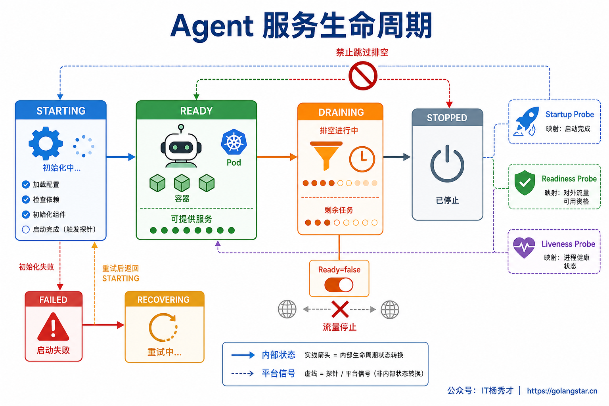
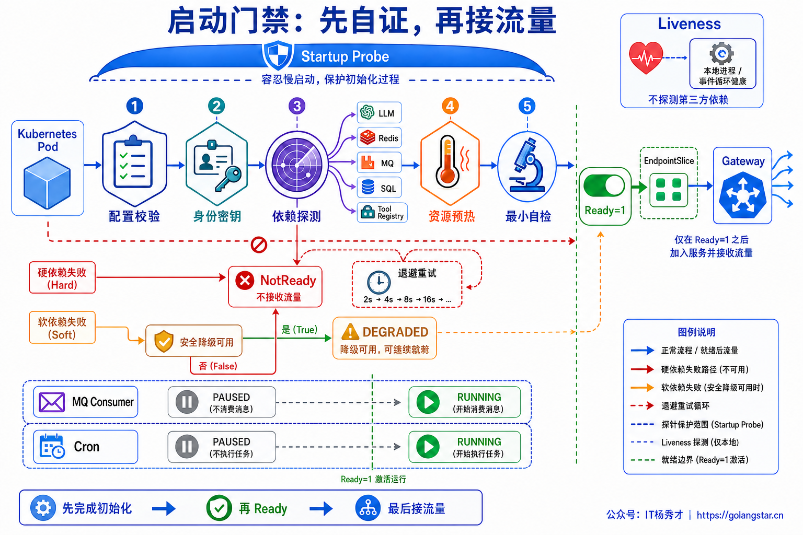
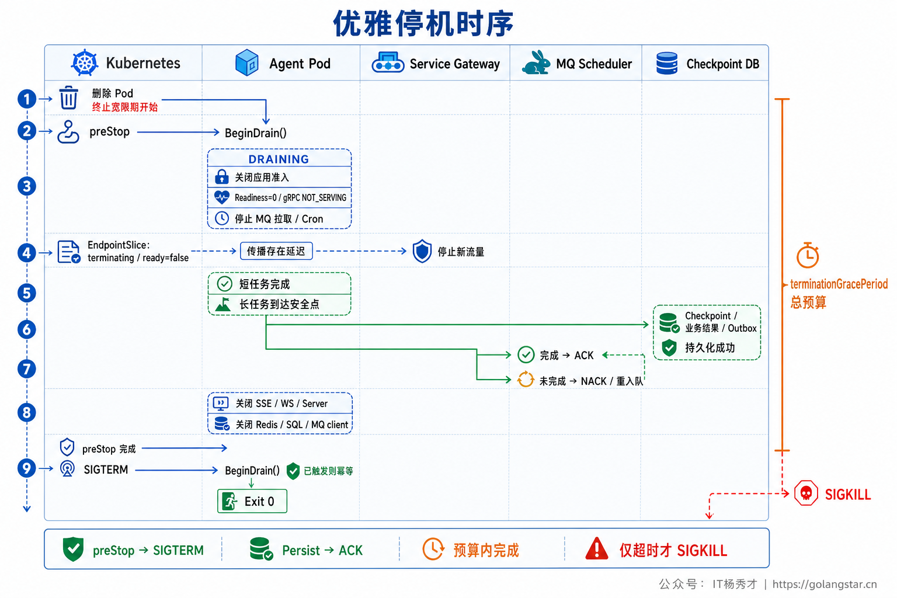
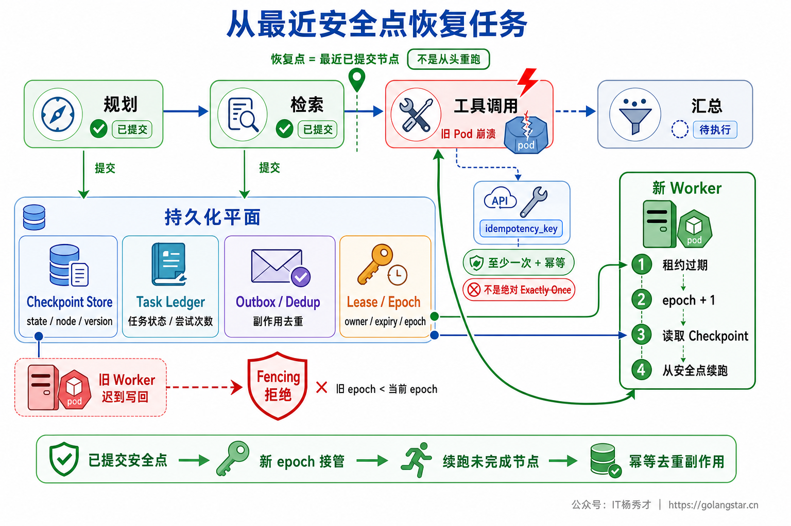
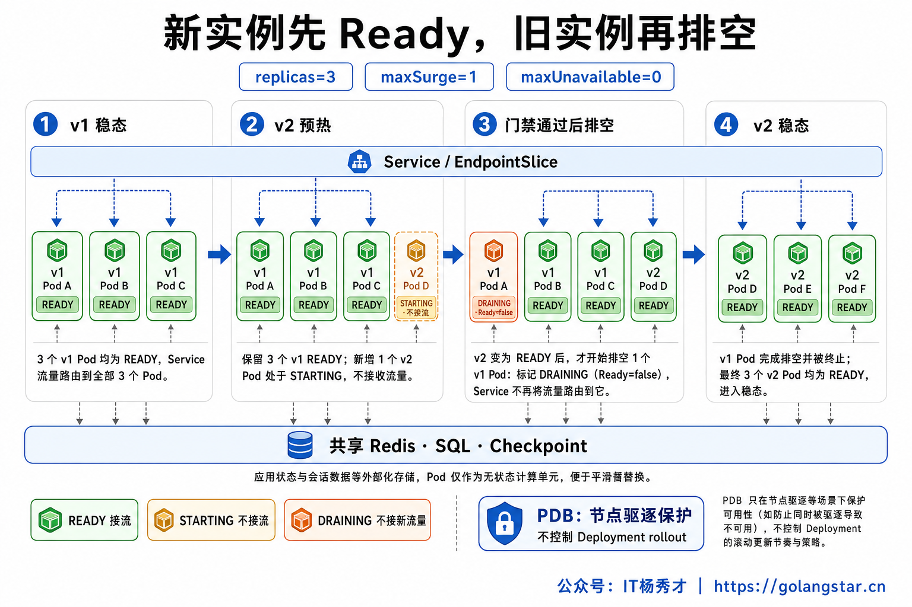
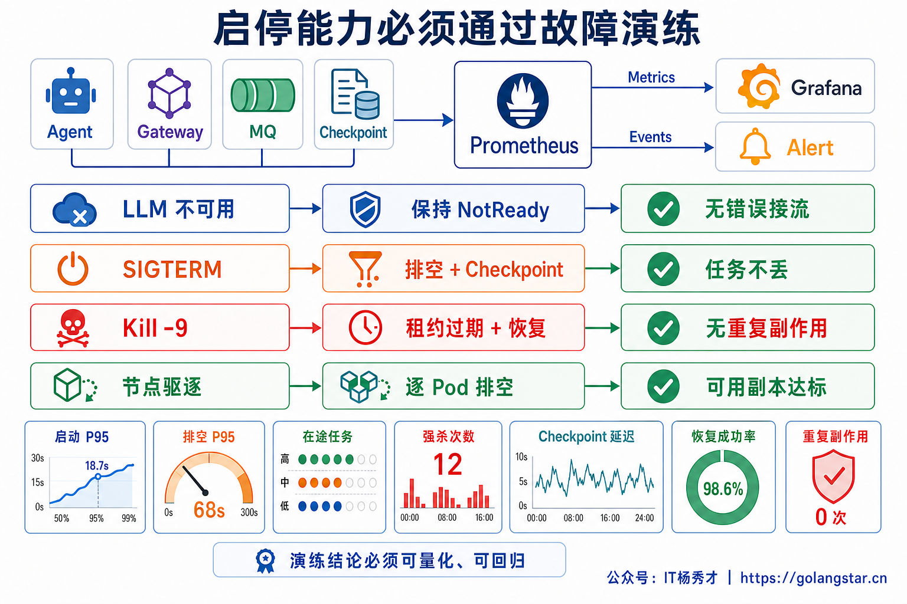

## **1. 题目分析**

一次看似普通的滚动发布，可能同时制造三类事故：新 Pod 的端口已经监听，但 Prompt、工具注册表和连接池还没准备好，第一批请求直接失败；旧 Pod 收到 `SIGTERM` 后立刻退出，跑到第八步的 Agent 任务从头重来；发送邮件的 Tool 已经成功，Worker 却没来得及记录结果，恢复后又发送了一遍。

这些问题不是“少配了一个 `preStop`”这么简单。Agent 服务同时承载短请求、长链路、流式连接、异步任务和外部副作用，启动与停止都在改变三件事：**实例是否允许接收新流量、在途任务归谁处理、资源何时可以释放**。因此，启停设计的核心不是两个生命周期 Hook，而是一套可验证的状态机。

### **1.1 先定义生命周期状态机**

一个生产实例至少需要 `STARTING → READY → DRAINING → STOPPED` 四个主状态。初始化失败进入 `FAILED`，但正常停机绝不能从 `READY` 直接跳到 `STOPPED`。

`STARTING` 表示进程已经存在，但尚未取得接流资格；`READY` 表示启动门禁全部通过，可以创建新的 Run；`DRAINING` 表示实例仍活着，也会继续处理已有任务，但不再获得任何新任务；`STOPPED` 表示监听器、租约和连接已经释放，进程可以退出。

状态机需要守住几个不变量：只有启动门禁通过才能进入 `READY`；一旦进入 `DRAINING`，HTTP、gRPC、MQ Consumer 和定时调度器都不能再创建新工作；只有在途任务已完成或已完成持久化交接，实例才能进入 `STOPPED`。停止信号还可能发生在预热过程中，因此初始化必须支持取消，已经创建的资源按逆序回收，并且取消后的实例不能再因为迟到的预热回调误入 `READY`。

状态转换要由单一的 Lifecycle Controller 管理，并通过 CAS 或锁保证单向、幂等。`SIGTERM`、管理接口、`preStop` 和进程内部故障可能同时触发停机，多次调用 Drain 必须得到同一个结果，不能启动多套互相竞争的清理逻辑。

### **1.2 启动不是端口监听成功，而是拿到接流资格**

启动流程应该从最便宜、最确定的检查开始。先安装信号处理器，再校验配置、密钥、环境、数据库 Schema、Prompt 版本和工具定义；这些内容不合法时直接失败，避免实例带着错误配置进入集群。数据库迁移不适合由每个 Pod 在启动时并发执行，通常由独立 Job 或发布流水线完成，应用只验证兼容性。

接下来初始化 Trace、日志、连接池、Checkpoint Store、MQ Client、Tool Registry 和模型客户端。MQ Consumer、Cron 和恢复扫描器此时只能启动在 Pause 状态，因为 Readiness 只控制 Service 流量，并不会阻止进程主动去队列抢任务。它们必须和 HTTP 准入使用同一个 Lifecycle Gate，在实例进入 `READY` 后才能一起打开。

依赖还要分成两类：Checkpoint、鉴权、核心数据库等硬依赖不可用时保持 `NotReady`；画像服务、可选 Rerank 等软依赖可以在存在明确降级路径时带着降级标记启动。把所有第三方依赖都塞进一个“全通过才启动”的检查，会让一次局部故障把整批实例同时摘掉。

最后才做资源预热。外部 LLM 场景可以提前完成 DNS、TLS、连接复用和模型能力探测；RAG 场景加载索引元数据和热点分区；自部署模型则需要加载权重、编译 Kernel，并执行代表性的 Warmup。预热完成后跑一条不产生副作用的最小自检，只有该链路能在启动预算内返回，才打开准入开关并报告 Ready。

Kubernetes 的三种探针必须分工。`startupProbe` 给慢启动留出窗口，成功之前不执行 Liveness 和 Readiness；`readinessProbe` 回答“现在能不能接新请求”；`livenessProbe` 只判断进程是否卡死、事件循环是否停止等不可自行恢复的问题。Liveness 不应深度绑定第三方 LLM 或数据库，否则共享依赖抖动时，所有 Pod 会同时被重启，反而放大故障。探针接口应读取进程内已经聚合好的状态，不能每秒再同步调用一次收费且会抖动的 LLM API。

### **1.3 优雅停机的顺序是先停生产，再排空库存**

不管入口是 `preStop`、`SIGTERM` 还是运维接口，都应调用同一个 `BeginDrain()`。Kubernetes 配置了 `preStop` 时，会先执行 Hook，再向 PID 1 发送 `SIGTERM`；两个入口可能先后到达，所以停机函数必须幂等。第一步不是关闭数据库连接，也不是立即取消根 Context，而是原子地进入 `DRAINING`。实例先关闭应用层准入、把 Readiness 或 gRPC Health 改成 `NOT_SERVING`，同时停止 MQ 拉取、Cron 抢占和新子任务派生。EndpointSlice 和负载均衡的摘流存在传播时间，已有 Keep-Alive 连接也可能继续发送请求，因此 Pod 内部的准入门禁不能省略。

第二步才处理在途工作。剩余时间足够的短请求可以继续完成；长任务在最近的安全点写入 Checkpoint；可取消的 LLM、RAG 和只读 Tool 调用向下传播取消；已经开始返回 Token 的流式请求不能由网关静默重试到另一实例，而应结束当前流、保存事件序号，并让客户端通过 `run_id` 恢复。所有动作都受同一个 Drain Deadline 约束，不能让每个组件重新获得一份完整宽限期。

第三步是提交状态，再释放所有权。已完成任务先落业务结果、Checkpoint 和 Outbox，再 ACK；无法完成的任务先持久化安全点，再 NACK、重入队或等待租约到期。随后刷新必要的 Trace 和指标，关闭 SSE、WebSocket、HTTP/gRPC Server，最后再关 MQ、Redis、SQL 和 Tool Client。依赖连接必须活到在途任务处理结束，过早关闭只会把一次计划内停机变成批量失败。

宽限期耗尽后必须有强制退出兜底。`preStop` 的执行时间也计算在 `terminationGracePeriodSeconds` 内，因此用固定 `sleep` 占掉大半预算并不等于优雅停机。宽限期应按“摘流传播时间 + Drain P99 + 状态刷新时间 + 安全余量”测量出来，并为 gRPC `GracefulStop`、HTTP Shutdown 和自定义流式连接设置更短的内部截止时间，最后才允许强制关闭。

容器还要确保业务进程能真正收到信号。Docker 应优先使用 exec form 的 `ENTRYPOINT` 或由入口脚本 `exec` 业务进程；若业务进程躲在不会转发信号的 Shell 后面，Kubernetes 发出的 `SIGTERM` 到不了应用，所有优雅停机代码都会失效。

### **1.4 不同在途工作不能用同一种停机策略**

Agent 实例里的工作负载至少要分成以下几类：

| 在途工作 | 进入 Draining 后 | 超出 Drain Deadline 后 |
| --- | --- | --- |
| 短 HTTP/gRPC 请求 | 在预算内继续完成 | 取消并返回明确错误 |
| SSE/WebSocket/LLM Stream | 停止创建新流，维护已有流 | 持久化事件序号，通知客户端恢复 |
| MQ 长任务 | 停止拉新，继续维护当前 Lease | Checkpoint 后重入队或释放 Lease |
| 定时任务 | 停止抢占新调度，保留已有任务所有权 | 写入进度后交接 Leader Lease |
| 有副作用 Tool | 查询幂等账本和远端执行状态 | 标记 `UNKNOWN`，进入对账而非盲目重试 |

HTTP Server 的 Graceful Shutdown 通常能等待普通活动连接，但 WebSocket 等被 Hijack 的长连接需要应用自己登记、通知和关闭。gRPC Graceful Stop 也必须配超时后的 Force Stop，否则一个永不结束的 Stream 会让 Pod 一直卡在 Terminating。

MQ Consumer 停止拉取之后，如果计划在本实例完成任务，就要继续续租并在持久化完成后 ACK；如果决定交接，则先写 Checkpoint，再主动 NACK、缩短可见性或停止续租。消息系统通常是至少一次投递，即使处于 Visibility Timeout 内也不能把“不重复”当成绝对保证，所以恢复路径仍然需要稳定的 `task_id`、`step_id` 和幂等键。

最危险的是外部副作用处于未知状态。支付、发消息或写第三方系统可能已经成功，只是本地在记录结果之前被终止。此时简单重跑会造成重复操作。工具步骤需要持久化 `PREPARED → SENT → CONFIRMED` 状态，远端请求携带 Idempotency Key；停在 `SENT` 的任务恢复后先查询或对账，无法确认时进入人工处理队列。

### **1.5 Checkpoint 保存进度，租约和 Fencing 决定所有权**

优雅停机只是一种最佳努力，进程崩溃、节点断电和 `SIGKILL` 都不会给清理代码留下机会。真正的恢复能力必须来自进程外的 Checkpoint、任务账本和幂等记录，而不是内存里的 Future、闭包、连接对象或 Agent 实例。

Checkpoint 需要保存可重放的业务状态：当前节点、输入输出、版本、已完成 Tool Step、下一步候选和事件序号。粒度太粗会在恢复时重复大量 LLM 和 Tool 调用，粒度太细则增加存储和延迟；通常以 Agent 图节点或副作用边界作为安全点。

任务交接还需要 Lease 和 Fencing Token。新 Worker 只能在旧租约过期后以更大的 Epoch 取得所有权，写回时 Store 校验 Epoch，拒绝旧 Worker 的迟到结果。这样即使旧 Pod 因网络分区仍短暂运行，也不能覆盖新 Worker 已经恢复的状态。

发布新版本时还要考虑 Checkpoint 兼容性。状态中应记录 Workflow、Prompt、Tool Schema 和模型策略版本；新代码要么兼容旧状态，要么把未完成 Run 固定到原工作流版本。直接删除或重命名正在被 Checkpoint 引用的节点，可能让任务有数据却无处恢复。

恢复扫描也不能在每个新 Pod 启动时无界进行。应由协调器按过期 Lease 找到孤儿任务，限速恢复并根据 Deadline、租户和副作用风险排序，避免一批 Pod 同时启动又形成恢复风暴。

### **1.6 Kubernetes 滚动发布只负责换 Pod，业务仍要负责排空**

一次无损发布需要保证新实例先 Ready，旧实例再 Draining。对于容量敏感的在线 Agent，可以从 `maxUnavailable: 0`、`maxSurge: 1` 起步，再根据副本数和资源余量压测调整；`minReadySeconds` 可以避免刚刚 Ready 又立刻崩溃的实例过早被视为 Available。`progressDeadlineSeconds` 用来发现卡住的 Rollout。

`preStop` 可以调用幂等的 `/drain` 接口，让实例提早关闭准入并留出端点传播时间，但它不能代替进程对 `SIGTERM` 的处理。Kubernetes 在终止 Pod 时会把 EndpointSlice 中的 `ready` 置为 false，并保留 `terminating` 状态；支持高级 Drain 的流量层还可以参考 `serving` 条件处理已有连接。

PodDisruptionBudget 保护的是节点维护等自愿驱逐场景，不能代替 Deployment 自己的 `maxUnavailable` 和 `maxSurge`。无论使用哪种控制器，跨实例会话、任务状态和 Checkpoint 都必须外置，发布期间旧版和新版还会短暂共存，因此数据库 Schema、消息格式和 Checkpoint 至少要做到滚动窗口内向后兼容。

### **1.7 用指标和演练证明启停真的安全**

启停设计不能用“Pod 最后 Exit 0”作为验收标准。启动侧至少观察 `startup_duration`、各门禁失败率、Warmup 延迟、Ready 抖动和启动后首批请求错误率；停止侧观察 `drain_duration`、进入 Draining 后的新任务数、在途请求与 Stream 数、Checkpoint/NACK/ACK 数、强杀次数、租约过期恢复时长和重复副作用数。

上线前需要在真实并发下演练四种情况：预热过程中收到停止信号；长 LLM Stream 进行中触发滚动发布；Tool 已发出副作用但本地尚未确认时直接 `kill -9`；节点驱逐导致多个 Worker 同时交接。验收要落到业务不变量：Draining 后不再拿新任务，已 ACK 的结果一定可见，重投不会重复副作用，旧 Epoch 不能迟到写回，Rollout 期间可用容量和 P95/P99 仍在 SLO 内。

启停真正做对之后，实例才会变成可以安全替换的计算单元：启动时先证明具备服务能力，停止时先撤销新任务所有权，再把已有工作交代清楚，最后才退出进程。

***

## **2. 参考回答**

我会把 Agent 服务启停设计成 `STARTING、READY、DRAINING、STOPPED` 的显式状态机，而不是只写两个 Hook。启动时先安装信号处理器，校验配置、密钥和版本，初始化 Trace、连接池、Checkpoint、MQ 和 Tool Registry，再完成必要的模型、RAG 与连接预热。`startupProbe` 保护慢启动，`readinessProbe` 决定是否接流，`livenessProbe` 只判断进程是否卡死；硬依赖不通就保持 NotReady，软依赖只有存在安全降级路径才允许启动。

停机时收到 `SIGTERM` 先原子进入 Draining，立即关闭应用层准入、Readiness、MQ 拉取和定时任务，再按统一 Drain Deadline 处理在途工作。短请求尽量完成，长任务在安全点写 Checkpoint，流式请求保存事件序号并支持客户端恢复，有副作用的 Tool 依赖幂等键和执行账本，不能盲目重试。状态、Outbox 落盘后才能 ACK，最后才关闭 HTTP/gRPC、MQ、Redis 和数据库连接。任务恢复使用外部 Checkpoint、Lease 和 Fencing Token，新 Worker 取得更高 Epoch 后续跑，旧 Worker 的迟到写回会被拒绝。Kubernetes 发布时保证新 Pod 预热并 Ready 后再排空旧 Pod，结合 `maxSurge`、`maxUnavailable`、宽限期和 PDB。最后通过 SIGTERM、`kill -9`、长 Stream 和副作用中断演练，验证不丢任务、不重复副作用、Draining 后不接新任务。

## **学习交流**

> 如果您觉得文章有帮助，可以关注下秀才的<strong style="color: red;">公众号：IT杨秀才</strong>，后续更多优质的文章都会在公众号第一时间发布，不一定会及时同步到网站。点个关注👇，优质内容不错过

🔥 配套实战项目，拆得开、跑得起、能写进简历

多 Agent 编排 + RAG 混合检索 · 31 篇深度教程 + 50+ 面试题

<a href="/projects/dev-support.html" style="display: inline-block; margin-top: 14px; background: #ff7a18; color: #fff; font-size: 18px; font-weight: bold; padding: 10px 28px; border-radius: 24px; text-decoration: none;">点击查看 DevSupport AI 实战项目 →</a>

