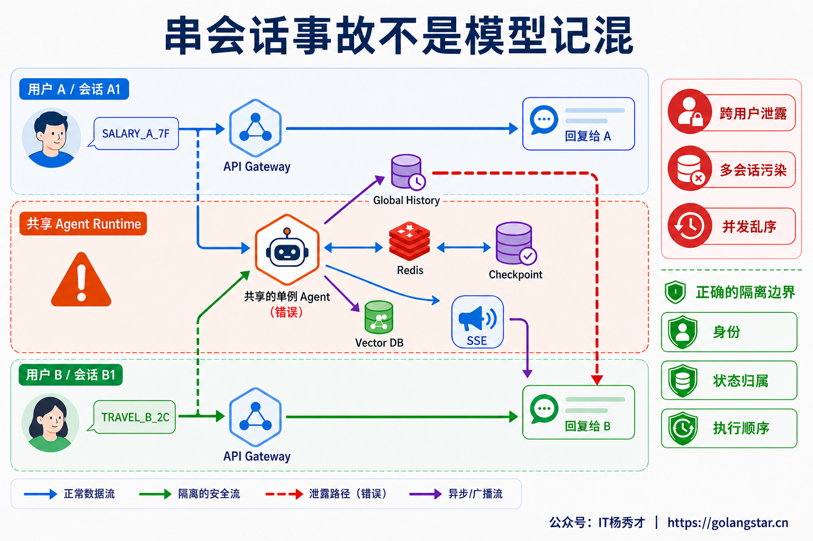
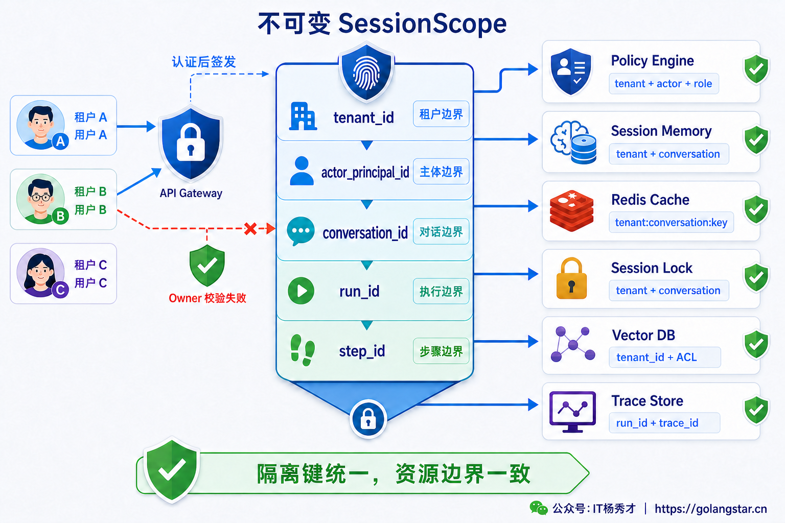
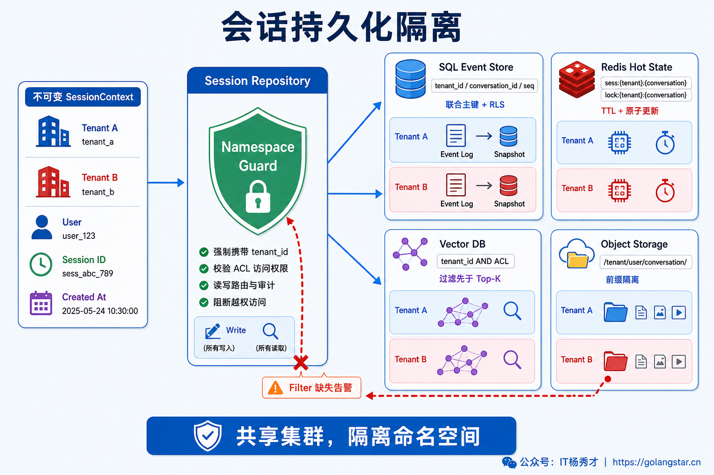
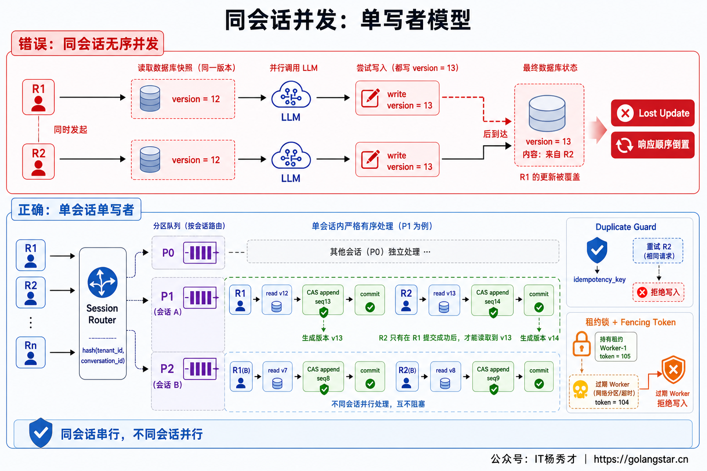
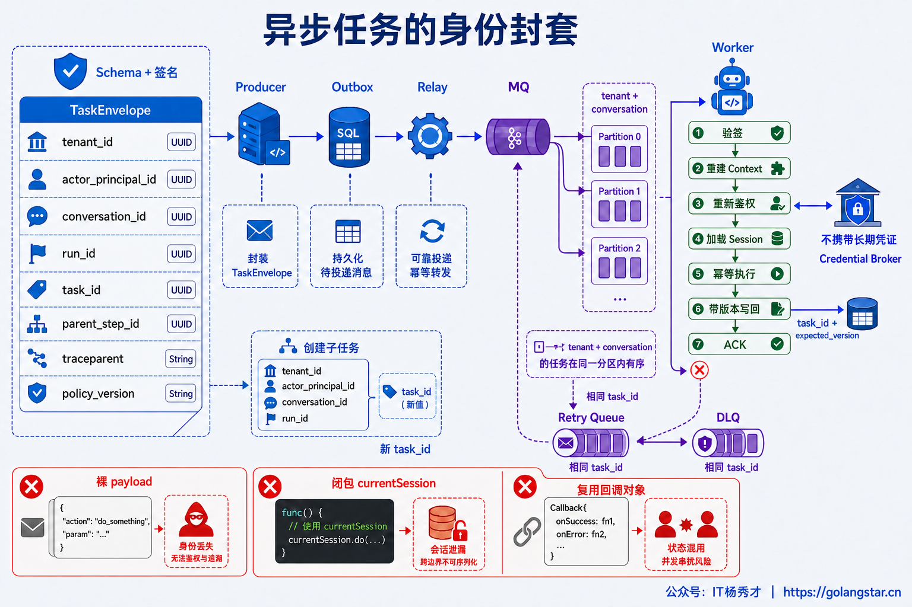
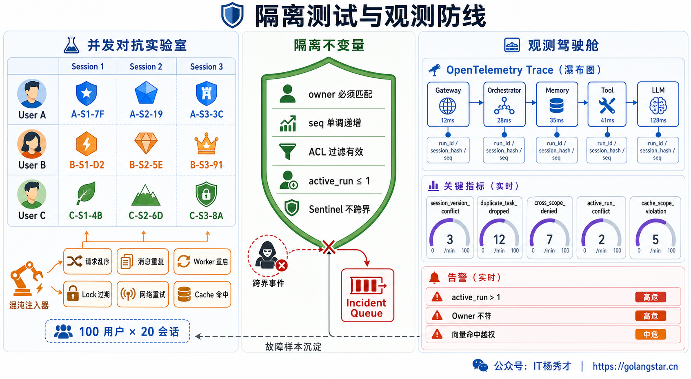

## **1. 题目分析**

用户 A 刚问完一份内部薪资数据，用户 B 的回答里却出现了 A 的姓名；同一个账号打开两个对话窗口，第二个窗口莫名接上了第一个窗口的任务；两条消息同时提交后，页面先看到新答案，刷新却又退回旧上下文。这些现象看起来像是模型“记混了”，根因通常不在 LLM，而是身份、状态所有权或执行顺序在某个工程边界断了链。

串会话也不只是给 Redis Key 多加一个 `session_id`。一次 Agent Run 会穿过 Gateway、Memory、Checkpoint、MQ、RAG、Cache、Tool 和流式通道，任一层丢失租户或会话范围，都可能把正确的数据交给错误的人。每份状态都必须能回答：属于谁、哪个执行可修改、当前调用方是否仍有权限。

### **1.1 先区分三种串会话**

第一种是**跨用户泄露**。A 用户的消息、检索结果或 Tool Result 被 B 用户读取，这是直接的数据安全事故。常见原因包括全局 History、固定的 LangGraph `thread_id`、缺少租户维度的缓存 Key、向量检索忘记加 ACL，以及复用单例 Tool Client 时动态修改了公共 Authorization Header。

第二种是**同一用户的多会话污染**。长期 Memory、摘要或 Provider Conversation ID 若只按 `user_id` 保存，“旅行规划”和“代码排障”两个窗口就会互相带入历史。用户长期偏好可以共享，消息、Scratchpad、Checkpoint 和未完成任务则必须属于 Conversation。

第三种是**同一会话的并发乱序**。请求 R1 和 R2 同时读到版本 12，各自完成一次耗时推理，然后都把结果写成版本 13。后提交的写入覆盖先提交的写入，或者先发出的请求反而最后返回，最终出现消息丢失、上下文倒退和重复工具操作。这类问题即使完全没有跨用户访问，也属于会话一致性故障。



### **1.2 用不可变作用域定义所有权**

会话隔离需要先建立一套全链路统一的 Scope，而不是让每个组件自由解释 `session_id`。一个实用的作用域可以写成：

```text
ExecutionScope = env + tenant_id + actor_principal_id + conversation_id + run_id + step_id
ResourceOwner  = resource_scope_type + resource_scope_id
```

`actor_principal_id` 表示当前认证主体，ResourceOwner 则表示资源属于 User、Team 还是 Public，两者不能混为一谈。`conversation_id` 标识对话，`run_id` 标识一次 Agent 执行，`step_id` 或 `tool_call_id` 标识可重试步骤。各层可选择所需的最小前缀，但不能丢掉租户边界；用户画像属于 `tenant + user`，对话历史属于 `tenant + conversation`，工具副作用继续细化到 Run 和 Step。

身份必须由 Gateway 根据已验证的 Token 或服务凭证生成，不能相信请求体里的 `user_id`、`tenant_id` 或内部 Header。`conversation_id` 由服务端生成唯一标识并记录 Owner；知道 ID 只代表“能定位”，不代表“有权读取”。打开、恢复、删除和订阅时都要验证 `tenant + principal + conversation` 的所有权。

共享必须显式声明 Public、Team、User 等 Scope 并经过策略授权；未声明的数据默认留在最窄的 Conversation Scope。



### **1.3 让上下文穿过每个执行边界**

入口完成认证后，应创建一份不可变的 `ExecutionContext`，包含 Scope、Trace ID、Deadline、取消信号和策略版本，并显式传给后续组件。在 Go 服务中可以使用 `context.Context` 传播这些轻量元数据和控制信号，但完整消息历史、可变 Session 对象和大段 Tool Result 不应塞进 Context，而应通过 Repository 按 Scope 加载。

几个做法尤其危险：包级 `currentSession`、单例 Agent 的可变 History、只含 `session_id` 的进程内 Map、依赖 ThreadLocal 跨线程传播，以及临时修改共享 HTTP Client 的默认 Token。它们在单用户测试中正常，并发交错后却会让后一个请求改掉前一个仍在使用的状态。

进入 MQ、延迟任务或回调系统时，要把可信 Scope、`run_id`、`task_id`、`expected_version`、`traceparent` 和 Deadline 写进 `TaskEnvelope`。Worker 重验来源与资源所有权后再加载状态；消息中不放长期用户凭证，执行前按 Scope 换取短期 Tool Token。

### **1.4 存储层必须强制带上隔离条件**

应用代码里“记得加过滤”不够可靠，隔离条件要下沉到统一 Repository 和存储约束。SQL 消息表用 `(tenant_id, conversation_id, seq)` 联合主键，同时保存 Owner、Run、Message 和版本号；Row-Level Security 做第二道防线。消息采用追加写，Snapshot 只是事件日志的加速投影，避免多个 Worker 覆盖整块 State。

Redis Key 需要体现命名空间，例如：

```text
session:{env}:{tenant}:{principal}:{conversation}:state
lock:{env}:{tenant}:{conversation}
run:{env}:{tenant}:{conversation}:{run}:events
```

向量库必须先用 `tenant_id + ACL + memory_scope` 过滤，再做 Top-K，不能全局召回后补权限。对象存储先鉴权，再仅为确定对象和方法签发短 TTL 预签名 URL；它是 Bearer Credential，泄露后在有效期内可被持有者使用。

短期消息、摘要、Scratchpad 和计划属于 Conversation，长期偏好可以属于 User，组织知识经审核后才能进入共享 Tenant Scope。LangGraph 每条会话对应独立内部 Thread，并由服务端保存 Thread 与 Owner 映射，禁止客户端随意传固定 `thread_id`。Provider Conversation ID 也只是映射值，必须绑定内部 Scope。



### **1.5 同会话需要明确的并发语义**

跨会话任务可以充分并行，同一会话却不能默认无序并发。产品层首先要定义冲突策略：新消息是排在当前 Run 后面，取消旧 Run 后重新开始，返回冲突让客户端重试，还是从当前 Checkpoint Fork 出一条新分支。这个选择必须显式，不能由两个 Worker 谁最后写入来决定。

顺序严格时使用 Keyed Executor、Actor 或 Mailbox：`hash(tenant_id, conversation_id)` 把同一会话路由到同一分区，每次只允许一个 Active Run，其他会话仍可并行。不要在整个 LLM 推理期间持有数据库行锁。

无法完全串行时用乐观并发控制守住提交点。Run 读取 `version=12`，提交时执行 `UPDATE ... WHERE version=12` 或 CAS；冲突后只能重载、合并或失败。租约锁还要配合单调递增的 Fencing Token，拒绝锁过期后的旧 Worker 回写。

MQ 通常至少投递一次，Tool 超时后也可能已经成功。本地变更把幂等记录与业务写入放在同一事务；远程 Tool 传稳定 Idempotency Key 并持久化调用状态；Outbox 只负责可靠派发，不能让远程副作用原子化。



### **1.6 异步任务和流式通道也要重新鉴权**

异步链路采用 `业务事务 + Outbox` 创建任务，由 Relay 投递到按 Conversation 分区的队列；Worker 完成 Envelope 校验、Context 重建、权限复核、幂等执行、带版本写回和 ACK。重试沿用原 `task_id`，子任务继承父 Scope 但生成新的 Task 与 Step 标识。

SSE、WebSocket 和 Pub/Sub 不能只凭一个可猜测的 Channel 名订阅。连接建立和断线重连时都要验证用户对 `conversation_id + run_id` 的访问权，服务端只转发 Scope 完全匹配的事件。`Last-Event-ID` 只能在当前 Run 内恢复，不能借它跨到别人的事件流。模型流式回调也应捕获本次 Run 的不可变 Context，禁止向全局 Broadcaster 写入没有归属的 Token Chunk。

Tool 层同样需要请求级隔离。每次调用按 Scope 注入短期凭证、Region、数据域和审计信息，Tool Result 写回前再次检查 Run 是否仍是当前有效执行。用户已经取消或会话已经 Fork 后，迟到结果可以进入审计记录，但不能继续污染当前上下文。



### **1.7 用不变量证明没有串会话**

隔离要转换成可验证的不变量：读取结果的 Owner 与 Scope 一致；`seq` 单调递增；串行策略下单会话 `active_run ≤ 1`；Checkpoint、Memory、RAG、Cache 和 Tool Result 的租户与 ACL 全部匹配；Scope 缺失或冲突立即 Fail Closed。

并发测试为 A、B 多个会话写入不同 Sentinel，再用 Barrier 强制关键步骤交错，覆盖多 Pod、Worker 复用、重复投递、锁过期、Checkpoint 恢复、Cache 命中、SSE 重连和 Tool 重试。只要 B 的模型输入、输出、Trace 或检索候选出现 A 的 Sentinel，就阻断发布。

线上 Trace 携带脱敏后的 tenant、conversation、run、version 和 sequence，日志平台也实施租户级访问控制。重点指标包括 `cross_scope_denied`、`session_version_conflict`、`duplicate_task_dropped`、`active_runs_per_session`、Owner 不匹配和向量 ACL 拦截数，用于提前发现固定 Thread、漏过滤、迟到写入和订阅错流。

整套方案的原则是：身份不能来自请求体，状态不能跟着进程对象走，权限过滤不能事后补，同一会话不能无序并发。



***

## **2. 参考回答**

生产环境里我先把串会话拆成跨用户泄露、多会话污染和同会话并发乱序。隔离不能只靠 `session_id`，而要定义 `tenant_id + principal_id + conversation_id + run_id + step_id` 的不可变 Scope。身份从认证 Token 派生，Conversation 由服务端生成并校验 Owner；Scope 显式贯穿 Gateway、Agent、MQ、Memory、Checkpoint、RAG、Tool 和 SSE，绝不放进全局变量或单例的可变字段。

各存储按复合命名空间隔离，LangGraph Thread 与 Provider Conversation ID 保存 Owner 映射。跨会话并行，同会话默认 Mailbox 串行；并发提交用版本号、CAS 和 Fencing Token，副作用按 `run_id + step_id` 幂等。最后用 A/B Sentinel 交错压测，覆盖重投、锁过期、Checkpoint、缓存和 SSE 重连；任何归属不一致都 Fail Closed。

<div style="background-color: #f0f9eb; padding: 10px 15px; border-radius: 4px; border-left: 5px solid #67c23a; margin: 20px 0; color:rgb(64, 147, 255);">

## <span style="color: #006400;">**学习交流**</span>
<span style="color:rgb(4, 4, 4);">
> 如果您觉得文章有帮助，可以关注下秀才的<strong style="color: red;">公众号：IT杨秀才</strong>，后续更多优质的文章都会在公众号第一时间发布，不一定会及时同步到网站。点个关注👇，优质内容不错过
</span>


<div style="text-align: center; margin-top: 22px; padding-top: 20px; border-top: 1px solid #c2e7b0;">
<div style="color: #006400; font-size: 20px; font-weight: bold;">🔥 配套实战项目，拆得开、跑得起、能写进简历</div>
<div style="color: red; font-size: 16px; font-weight: bold; margin-top: 8px;">多 Agent 编排 + RAG 混合检索 · 31 篇深度教程 + 50+ 面试题</div>
<a href="/projects/dev-support.html" style="display: inline-block; margin-top: 14px; background: #ff7a18; color: #fff; font-size: 18px; font-weight: bold; padding: 10px 28px; border-radius: 24px; text-decoration: none;">点击查看 DevSupport AI 实战项目 →</a>
</div>
</div>
