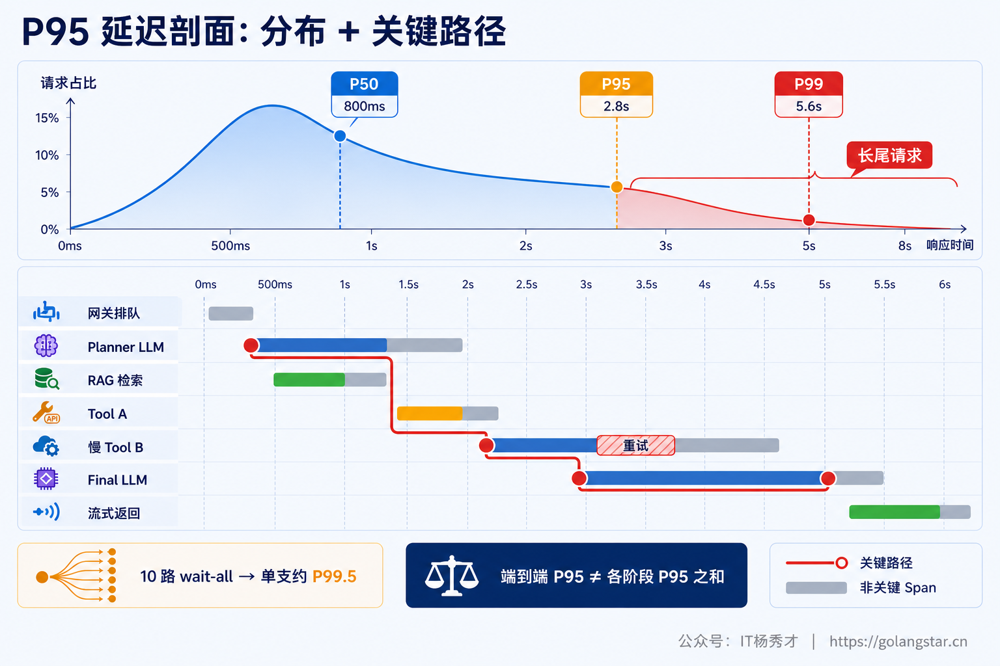
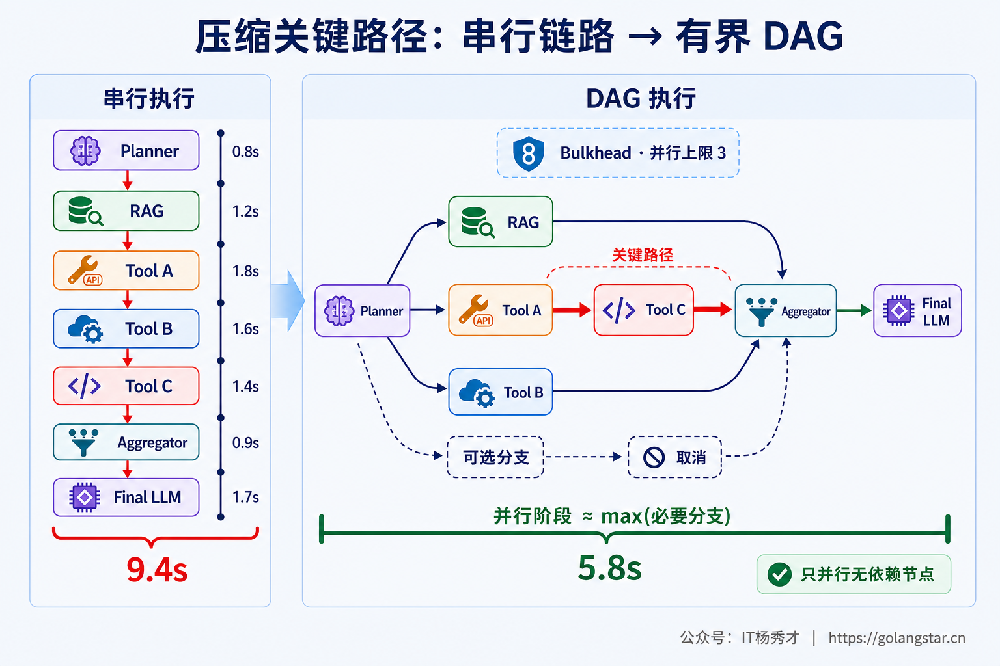
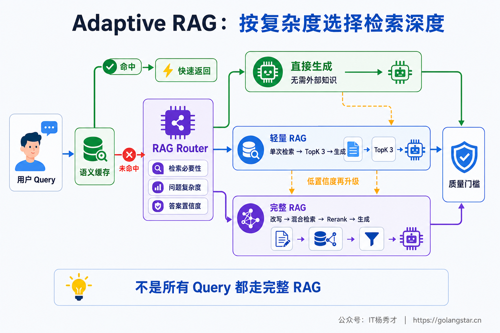
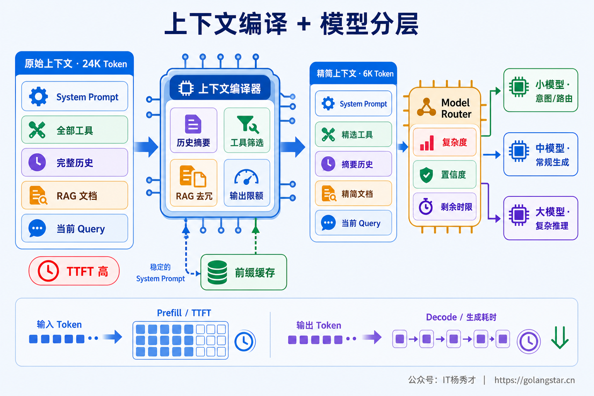
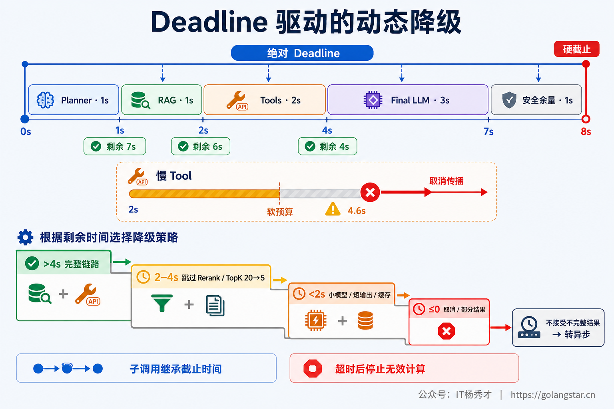
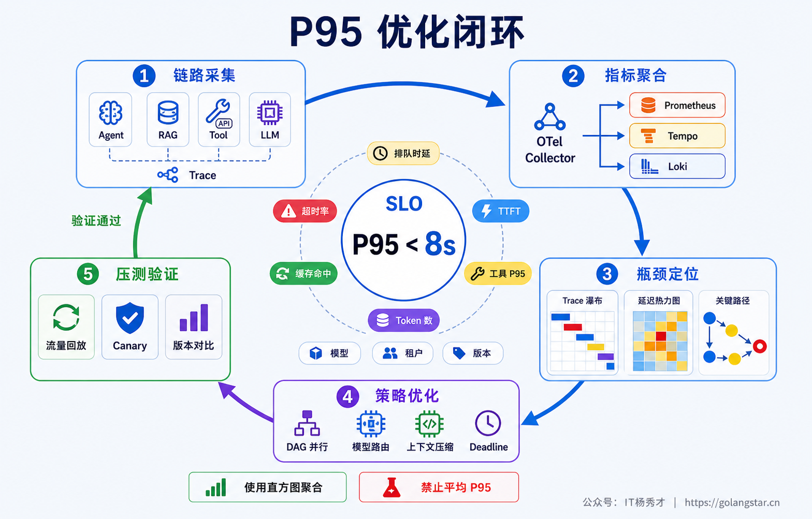

## **1. 题目分析**

这道题看似在问“怎么把某个步骤做快”，实际考察的是生产级 Agent 的端到端性能设计。一次请求可能经历任务分类、规划、Query Rewrite、向量检索、Rerank、多个工具、多轮 ReAct、最终合成和流式返回。只把向量查询从 200ms 优化到 100ms，或者换一个更快的模型，未必能让端到端 P95 明显下降，因为真正决定响应时间的是执行图中的**关键路径**，决定 P95 的则是排队、慢分支、循环轮数和 Token 长度共同形成的长尾。

一个有说服力的回答应按“测量—减法—并行—尾部治理—验证”展开：先明确 P95 的统计口径并从 Trace 中定位关键路径，再减少不必要的 Agent 轮次和检索工作，把无依赖步骤改成有界 DAG 并行；随后治理 wait-all、straggler、排队和重试造成的尾延迟，最后用质量指标证明优化不是靠牺牲答案换来的。

### **1.1 先定义端到端 RT，再定位慢请求的关键路径**

LLM 链路至少有三个容易混淆的指标：TTFT 表示请求进入到首个 Token 返回；完整 RT（也可称 TTLT）表示请求进入到最终答案生成完成；感知延迟则表示用户何时看到第一段有价值的内容。Streaming 能明显改善 TTFT 和感知延迟，但通常不会减少完整生成所需的计算，所以题目中的 P95 RT 应优先按“网关收到请求到最终答案可用”统计。

还需要按请求类型分别观察简单问答、单跳 RAG、多跳 RAG、单工具、多工具和长输出请求。把这些请求混成一个全局 P95，流量结构稍有变化，指标就可能失真。正确做法是用直方图直接聚合端到端分布，并把 P95、P99 的 Trace Exemplars 拉出来分析，而不是对实例级 P95 再求平均。

对一条具体请求，可以把 Agent 还原为执行 DAG。其响应时间可近似表示为：

```text
T_e2e = T_queue + max(执行图中的依赖路径耗时) + T_post
```

串行节点的耗时会相加，并行节点的耗时由最慢的必要分支决定；ReAct、重规划和反思则会动态增加 DAG 深度。因此，各阶段 P95 不能简单相加得到端到端 P95，必须通过同一条 Trace 找到那次慢请求实际经过的最长路径。



长链路还有一个典型的 **Tail Amplification**。假设 N 个独立工具同时执行，并且汇总节点必须等待全部结果，单工具延迟分布为 `F(t)`，则：

```text
P(max_latency <= t) = F(t)^N
```

当 10 个工具都必须在阈值内完成，若希望整体成功概率达到 95%，单个工具在该阈值内完成的概率需要达到 `0.95^(1/10) ≈ 99.49%`。换句话说，十路 wait-all 的整体 P95 已经接近单路 P99.5。并行虽然减少了平均串行时间，但扇出越宽，撞上一个 straggler 的概率越高，这正是 Agent P95 难降的核心原因之一。

定位关键路径之后，还需要把产品侧的 P95 SLO 转换成可执行的延迟预算。假设端到端目标是 8 秒，可以示意性地给 Planner、RAG、最慢的必要工具分支和 Final LLM 分配 1 秒、1 秒、2 秒和 3 秒，最后保留 1 秒用于结果汇总、降级和网络回传。这里的阶段数值不是把各组件历史 P95 相加，而是根据同类请求的生产 Trace、依赖关系和质量要求反推，并在真实并发下校准。

预算还要区分软边界与硬边界。软边界用于触发取消可选分支、减少 `top_k` 或切换快路径；硬边界用于保证最终响应不会穿透端到端 SLO。每次编排变更、模型升级或知识库规模变化后，都要重新比较各阶段的预算消耗率。若某阶段经常借用后续预算，即使当前端到端 P95 尚未超标，也说明链路已经缺少安全余量，应该提前治理，而不是等到用户侧指标恶化后再扩大 Timeout。

### **1.2 先做减法：减少串行模型往返和无效工作**

最有效的优化通常不是把每个节点提速 10%，而是直接删掉一轮模型调用。常见慢链路是“意图识别 LLM → 是否检索 LLM → Query Rewrite LLM → 工具选择 LLM → 结果判断 LLM → Reflection LLM → 最终回答 LLM”，每一轮都会重复支付网络、排队、Prompt Prefill 和生成开销。

工程上可以把 Query Rewrite、检索判断和工具计划合并为一次结构化 Planner 输出；确定性的权限判断、状态流转和参数转换直接写成程序；简单分类优先用规则、Embedding 分类器或小模型；默认关闭 Reflection、Judge、二次润色，只在低置信度或高风险请求上按需启用。同时设置 `max_agent_turns`、`max_tool_calls` 和 `max_reasoning_steps`，证据充分或任务已经完成时立即 Early Exit，避免少量 7～10 轮请求把尾部拉长。

缓存也属于“减少工作量”而不是单纯加速。可缓存 Query Embedding、权限过滤结果、稳定检索结果和确定性工具响应；相同并发请求用 Singleflight 合并，防止缓存击穿；系统提示和 Tool Schema 保持稳定前缀以提高 Prompt Cache 命中率。缓存 Key 必须包含租户、权限、知识库版本和数据新鲜度，不能为追求命中率造成越权或返回过期事实。

### **1.3 把链式 ReAct 改成有界 DAG，只并行真正无依赖的节点**

如果 Planner 已经知道任务依赖关系，就不必每执行一步再回到 LLM 决定下一步。更合适的方式是让 Planner 一次输出带依赖边的 Tool DAG，由确定性执行器调度。Dense Search 与 BM25、多知识库只读检索、用户画像加载、多个互不依赖的只读工具都可以并行；有参数依赖、共享可变状态或外部副作用的工具仍然串行。

并行阶段也不应默认 wait-all。业务只需要一条可靠证据时采用 first-good；需要多数数据源一致时采用 quorum；达到证据覆盖阈值后立即取消剩余分支。每个请求还要限制最大 fan-out，并通过 Bulkhead 给检索、数据库和外部工具设置独立并发池，否则一次请求虽然自己的关键路径缩短，却可能制造资源竞争，把全站 P95 推高。



Speculative Execution 也可以使用，但必须计算命中率。例如某类请求有很高概率需要检索，可以让 Planner 与检索准备并行；Planner 最终判定无需检索时立刻取消检索。系统需要记录推测分支的命中率、浪费时间、额外 Token 和连接占用，只有节省的关键路径时间高于额外成本时才值得保留。

### **1.4 Adaptive RAG：按问题复杂度选择检索深度**

长 Agent 链路常见的浪费是所有请求都执行“Query Rewrite → 混合检索 → Rerank → 多跳补检 → 大模型生成”。更合理的做法是把请求划分为三档：已有上下文足够或无需外部事实的请求直接生成；普通事实问题走单次轻量检索；只有跨文档、多约束、低置信度问题才启用完整的多跳 RAG。

Router 最好复用 Planner 的结构化输出，或使用规则和轻量模型，不能为了省一次检索又串行增加一次昂贵大模型。检索阶段动态设置 `top_k`，候选差异明显时跳过 Cross-Encoder Rerank，证据覆盖充分时 Early Exit；只有结果歧义或引用要求高时才升级到完整路径。Dense 与 Sparse 可以并行，但应按质量阈值接收当前最佳结果，而不是无条件等最慢数据源。



Adaptive RAG 的关键不是“少检索”，而是建立质量门槛。线上必须重点监控 Router 的 False Negative，也就是本应检索却走了直接生成的请求。金融、医疗、合规以及强时效问题不能为了 RT 跳过必要证据；短路径校验失败时应按需升级，而不是带着低置信度答案结束。

### **1.5 模型分层与上下文编译同时做**

模型选择应与节点职责匹配。意图识别、Query Rewrite、工具路由和短摘要使用小模型；常规单跳 RAG 使用中等模型；复杂规划、多跳推理和高价值最终合成再使用强模型。路由应尽量在入口一次完成，对明显复杂请求直接进入强模型，避免“小模型先失败、再串行升级大模型”的 Cascade 反而拉高 P95。

上下文则要像编译器一样按本轮任务裁剪，而不是把完整历史、全部工具和所有检索文档原样塞入 Prompt。常用手段包括：把历史对话压成带事实槽位的摘要；只注入当前可用的工具 Schema；对 RAG Chunk 去重并设置总 Token 上限；工具返回结构化字段而非大段原文；限制最终输出长度并使用明确停止条件。输入 Token 主要影响 Prefill 与 TTFT，输出 Token 直接决定自回归 Decode 时长，长回答往往是完整 RT 最稳定的优化杠杆。



### **1.6 专门治理 straggler、排队和重试长尾**

关键分支和可选分支应在 DAG 中显式标记。主检索、核心权限数据属于关键分支；画像补充、额外数据源、二次 Rerank 和润色通常属于可选分支。可选分支到达软预算后直接舍弃，关键分支失败则取消仍在运行的兄弟任务，并进入受控降级。在线短请求、交互式长请求和离线任务还应分队列与资源池，避免长上下文任务造成队头阻塞。

对于延迟分布有明显长尾、存在独立副本、且只读幂等的检索或元数据工具，可以谨慎使用 Hedged Request：先发送主请求，超过该依赖的动态阈值仍未返回时再向另一副本补发，首个成功结果胜出并立即取消 loser。Hedging 不能从请求开始就双发，也不适合有副作用的工具、昂贵的长输出 LLM、共享同一拥塞底座的两个逻辑地址；否则只是用双倍负载制造更严重的尾延迟。

重试同样只允许一个层级负责，并且必须服从 Retry Budget 和剩余 Deadline。接近截止时间时，重试通常不会挽救请求，只会挤掉最终回答的预算。网络连接应复用并预热，服务尽量同地域部署，客户端断开后取消信号要传到所有工具与模型流，避免用户已经离开而后台仍在生成 Token。

### **1.7 用统一 Deadline 驱动动态降级**

入口应为整棵调用树创建绝对 Deadline，各节点根据 `deadline - now` 获取剩余预算，不能在每一层重新获得一份完整 Timeout。以 8 秒端到端 SLO 为例，可以给 Planner、RAG、必要工具和 Final LLM 分配阶段预算，并预留至少 1 秒用于汇总、降级和响应回传。阶段启动前必须判断剩余时间是否还能容纳“该阶段最小耗时 + 最终回答预留”。



剩余预算充足时执行完整链路；预算收紧时依次关闭 Judge、Reflection、二次检索和 Rerank，降低 `top_k`；更紧张时切换快模型、缩短输出或使用满足新鲜度要求的缓存。无法接受不完整结果的复杂任务可转异步并返回任务 ID。高风险操作若证据或安全校验不足，应明确失败，不能把缺失步骤伪装成完整结果。降级必须在 Deadline 到期前触发，否则所有步骤都超时之后再走 Fallback 已经没有意义。

### **1.8 用“性能 + 质量”闭环验证，而不是凭感觉调参数**

每次 Agent 运行都应形成完整 Trace：Router、Planner、每轮 LLM、Embedding、Dense/Sparse Search、Rerank、每个 Tool、Retry/Hedge、Final Synthesis 和 Streaming 都是独立 Span。关键属性至少包括请求复杂度、Agent 轮数、DAG 深度与宽度、queue wait、TTFT、输入/输出/缓存 Token、`top_k`、fan-out、剩余 Deadline、重试与取消原因。P95、P99 的慢 Trace 再按“关键路径贡献”做 Pareto，优化资源才会投到真正影响尾部的节点上。



验证时需要使用接近生产的长短请求比例、上下文长度、工具组合和并发度，覆盖冷缓存、慢工具、模型抖动、重试和取消传播。优化前后除了比较端到端 P50/P95/P99、TTFT、轮数、Token 和成本，还必须同时比较 Answer Correctness、Faithfulness、引用质量、工具调用正确率、Router 误判率和任务完成率。只有 P95 下降且质量守住门槛，才算真正完成优化。

几种常见误区也值得在面试中主动指出：只优化单次 LLM API、不看整条 Trace；把 Streaming 当成完整 RT 下降；把各阶段 P95 直接相加；盲目并行后仍然 wait-all；无上限 fan-out；Router 本身又调用一次慢模型；临近 Deadline 继续重试；只在热缓存和单请求下压测；以及通过少检索、少推理让答案质量明显下降。能把这些边界讲清楚，才体现出对生产性能工程的完整理解。

***

## **2. 参考回答**

我会先把问题定义成端到端尾延迟治理，而不是只优化某次 LLM 调用。入口到最终答案建立完整 Trace，把 Planner、每轮模型、RAG、Rerank 和每个 Tool 拆成 Span，按请求复杂度统计 P95/P99，并从慢请求中找执行 DAG 的关键路径，不能把各阶段 P95 简单相加。

优化顺序上先做减法：合并检索判断和 Query Rewrite，确定性流程移出 LLM，限制 Agent 轮数，证据充分就 Early Exit。然后让 Planner 一次输出 Tool DAG，无依赖的检索和只读工具有界并行，采用 first-good 或 quorum，拿到足够结果后取消慢分支。RAG 按复杂度路由为不检索、单跳和多跳，动态控制 top_k 与 Rerank；路由和改写用小模型，强模型只处理复杂推理，同时压缩历史、工具定义和检索上下文，限制输出 Token。

入口还会下发统一 Deadline，每个子调用按剩余预算决定执行、降级或取消；时间不足时依次跳过 Judge、Rerank 和次要数据源，切快模型或转异步。Hedging 只用于幂等、低成本、低相关性的只读依赖。最后用真实流量回放和故障注入比较 P95/P99、Token、成本以及 Faithfulness、引用质量和任务完成率，确保不是牺牲答案质量换速度。

<div style="background-color: #f0f9eb; padding: 10px 15px; border-radius: 4px; border-left: 5px solid #67c23a; margin: 20px 0; color:rgb(64, 147, 255);">

## <span style="color: #006400;">**学习交流**</span>
<span style="color:rgb(4, 4, 4);">
> 如果您觉得文章有帮助，可以关注下秀才的<strong style="color: red;">公众号：IT杨秀才</strong>，后续更多优质的文章都会在公众号第一时间发布，不一定会及时同步到网站。点个关注👇，优质内容不错过
</span>


<div style="text-align: center; margin-top: 22px; padding-top: 20px; border-top: 1px solid #c2e7b0;">
<div style="color: #006400; font-size: 20px; font-weight: bold;">🔥 配套实战项目，拆得开、跑得起、能写进简历</div>
<div style="color: red; font-size: 16px; font-weight: bold; margin-top: 8px;">多 Agent 编排 + RAG 混合检索 · 31 篇深度教程 + 50+ 面试题</div>
<a href="/projects/dev-support.html" style="display: inline-block; margin-top: 14px; background: #ff7a18; color: #fff; font-size: 18px; font-weight: bold; padding: 10px 28px; border-radius: 24px; text-decoration: none;">点击查看 DevSupport AI 实战项目 →</a>
</div>
</div>
