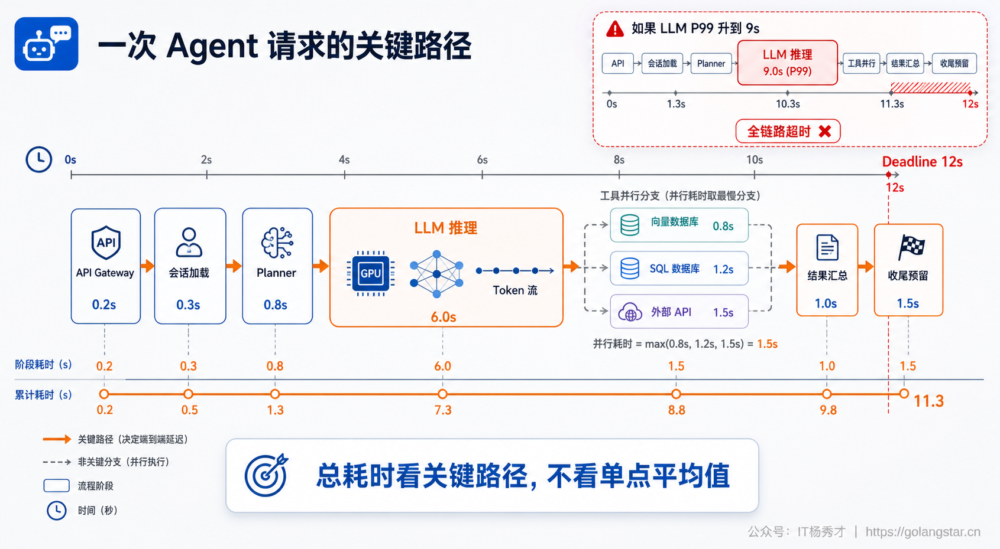
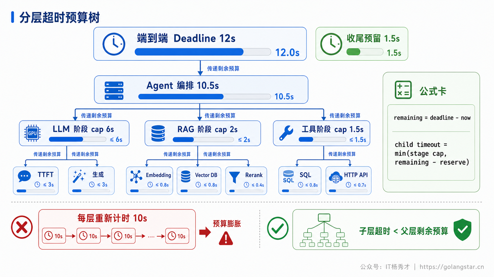
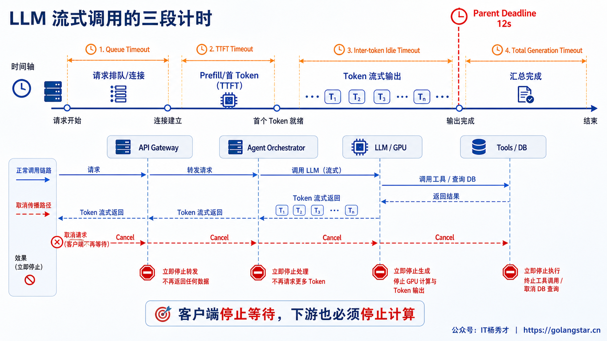
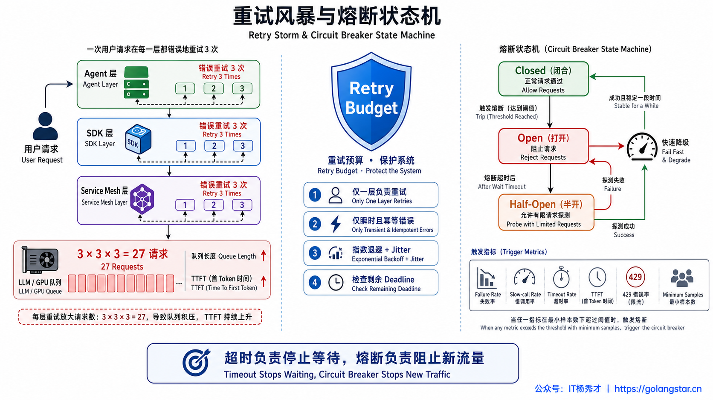
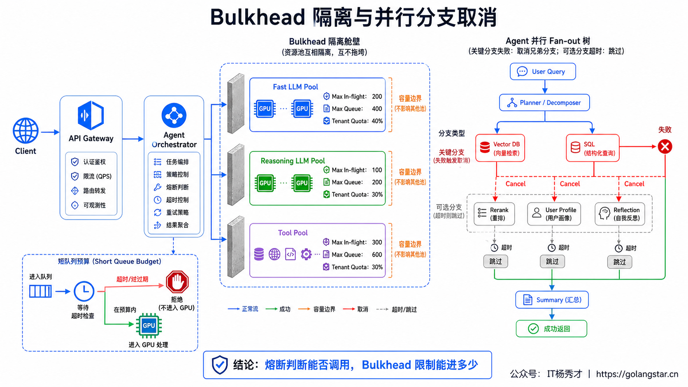
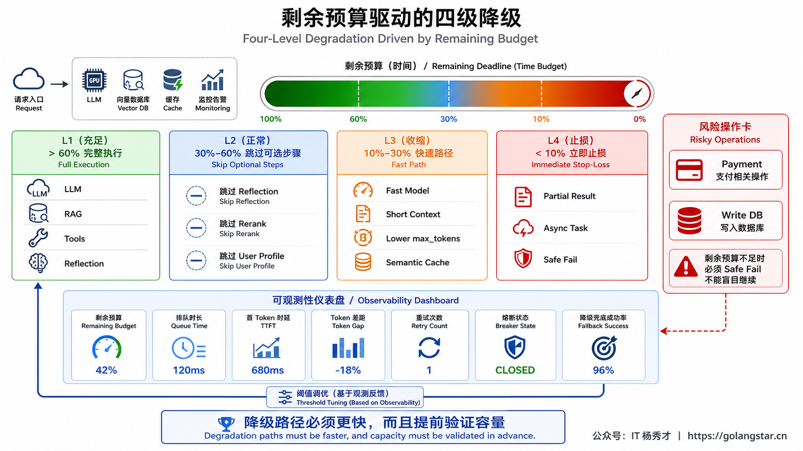

## **1. 题目分析**

Agent 链路的超时问题，最危险的情况不是某一次 LLM 调用偶尔慢了几秒，而是链路中的每一层都在用自己的超时和重试规则：网关愿意等 15 秒，Agent 编排器愿意等 20 秒，LLM Gateway 又愿意等 30 秒，工具层失败后还各自重试。最外层请求早已结束，内部的模型推理、工具调用和回调任务却仍在运行，既消耗 GPU 和连接池，又把下一批请求堵在队列里。一次模型抖动，很快就会演变成重试放大、线程占满和全链路雪崩。

因此，分层超时并不是“每一层都配置一个 timeout”这么简单。真正需要解决的是三个问题：整条请求最多能花多少时间；每个阶段可以拿走多少预算；某个依赖持续变慢时，怎样阻止新流量继续进入。对应到工程机制上，分别是 **Deadline、Timeout 和 Circuit Breaker**。此外还需要 Bulkhead 限制并发、Retry Budget 控制重试、Fallback 负责降级，这几类机制必须放在同一套延迟预算中设计。

### **1.1 先找到端到端链路的关键路径**

一次 Agent 请求通常会经过 API Gateway、会话加载、意图识别、规划、一次或多次 LLM 推理、RAG 检索、工具调用、结果汇总和流式输出。部分步骤是串行的，耗时会直接相加；部分工具可以并行，最终耗时取决于最慢的关键分支；ReAct、反思和重规划又可能让同一阶段循环多次。

如果只看单次 LLM 的平均延迟，很容易低估真实风险。假设模型平均 2 秒返回，但 P99 需要 7 秒，Agent 又可能连续调用两次模型，那么仅模型阶段的尾延迟就可能超过入口层的总超时。并行工具也不是“取平均值”，只要汇总节点必须等待全部结果，最慢分支就会成为整个请求的关键路径。



所以第一步不是直接写一个 10 秒的配置，而是把 Trace 中的真实时间拆开：排队花了多少时间、连接建立花了多少时间、LLM 首个 Token 等了多久、完整生成花了多久、工具调用是否串行、重试又增加了多少时间。只有先画出关键路径，超时预算才有分配依据。

### **1.2 用一个绝对 Deadline 管住整条调用树**

生产环境更适合使用绝对 Deadline，而不是在每一层重新开始计算一个完整 Timeout。入口收到请求时就确定最终截止时刻，后续每个 Agent 节点、LLM 调用和工具调用都从同一个 Deadline 计算剩余预算：

```text
remaining_budget = deadline - now
child_timeout = min(stage_cap, remaining_budget - reserve)
```

`stage_cap` 是该阶段允许使用的最大时长，`reserve` 是为结果组装、错误转换、降级响应和网络回传预留的时间。如果剩余预算已经不足以完成一个阶段，就应该直接跳过、降级或失败，而不是明知来不及仍然发起昂贵的模型请求。

例如端到端 SLO 是 12 秒，可以给 Agent 编排器 10.5 秒的执行窗口，至少保留 1.5 秒用于最终汇总和流式收尾；在编排器内部，再把预算分给 LLM、检索和工具。这里的数值只是示意，真实配置需要根据各阶段 P95、P99、业务优先级和负载测试结果确定。关键原则是：**子层预算必须小于剩余的父层预算，并且越往下越不能重新获得一整份时间。**



同一阶段还需要区分不同的超时边界。排队超时用于避免请求长期占据等待队列；连接超时限制 DNS、TCP 和 TLS 建连；单次尝试超时限制一次上游请求；阶段超时约束一个完整节点；端到端 Deadline 则约束整棵调用树。把这些概念混成一个“大超时”，出现问题时既无法定位，也无法做精确降级。

### **1.3 LLM 调用至少要拆成三段计时**

LLM 的“响应时间”不是一个单一指标。对流式模型调用而言，至少需要拆成三段：

第一段是 **TTFT（Time To First Token）**。它包含模型网关排队、动态批处理、Prompt Prefill 和首个 Token 生成。TTFT 持续升高通常说明模型实例饱和、上下文过长或上游正在限流，这时继续堆积请求只会让队列更长。

第二段是 **流式空闲超时**。模型已经开始返回 Token，但某个时间窗口内没有新 Token，可能是网络中断、推理进程卡住或流式连接异常。仅设置总超时会让这种“半开连接”一直占用资源，因此需要独立的 inter-token idle timeout。

第三段是 **完整生成超时**。即使 Token 一直在流动，生成内容过长也可能耗尽整条链路预算。系统需要同时限制 `max_tokens`、总生成时长和剩余 Deadline，不能因为流式输出尚未中断就无限等待。



Deadline 还必须随调用上下文向下传播。父节点取消后，LLM 流、工具请求、并行子任务和回调都要收到取消信号并停止工作。只让客户端停止等待而不终止下游计算，会产生大量“无人接收的结果”：Token 仍在生成、数据库仍在查询、工具仍在执行，但这些结果已经不可能返回给用户。每个昂贵阶段开始前都应该再次检查剩余预算，发现请求已经注定失败时立即停止。

### **1.4 重试必须服从预算，熔断必须识别慢调用**

超时后立刻重试看似能提高成功率，实际上很容易把一次模型抖动放大成重试风暴。Agent 层、LLM Gateway、SDK 和服务网格如果都重试两三次，最底层看到的请求数会按层数相乘。上游本来只是变慢，额外重试又继续占用它的队列和 GPU，最终从局部尾延迟变成整体不可用。

重试需要遵守四条约束。第一，只重试明确的瞬时错误，例如连接重置、部分 429、可恢复的 5xx 和单次尝试超时；参数错误、鉴权失败和确定性的业务错误不能重试。第二，只有一个层级拥有主要重试权，避免 SDK、网关和业务层重复重试。第三，采用指数退避和随机抖动，并设置全局 Retry Budget。第四，每次重试前计算剩余时间，只有在“单次尝试预算 + 退避时间 + 收尾预留”仍放得下时才允许发起。

熔断器解决的是另一个问题：当某个模型提供方已经持续变慢或失败时，是否还允许新请求继续进入。LLM 场景不能只统计异常率，还要统计 **慢调用比例、超时率、TTFT 超标率和限流比例**。在满足最小样本量后，如果滑动窗口中的失败率或慢调用率超过阈值，熔断器从 CLOSED 进入 OPEN，直接拒绝新调用并触发降级；等待冷却时间后进入 HALF_OPEN，只放少量探测请求，探测恢复后再关闭熔断。



熔断粒度也很重要。模型 A 变慢，不应把模型 B 一起熔断；某个地域异常，不应扩大成全局不可用。常见做法是按“提供方 + 模型 + 地域 + 调用类型”建立隔离的熔断实例，同时设置全局保护阈值。这样既能快速切走故障流量，又不会因为一个局部依赖异常误伤全部请求。

### **1.5 熔断器之外还需要 Bulkhead 和并行取消**

熔断器判断的是“调用是否应该被放行”，它本身并不限制并发数量。即使熔断器处于 CLOSED，只要大量慢请求同时进入，连接池、协程、线程、队列和 GPU 并发槽位仍然可能被耗尽。因此 LLM Gateway 还要配置 Bulkhead：限制最大 in-flight 请求、最大等待队列、每个租户的并发配额，以及不同模型和优先级使用的独立资源池。

排队预算通常应该明显短于推理预算。请求在队列中已经消耗了大部分 Deadline，即使后来拿到执行槽位，也很可能无法按时完成。与其让它继续占用昂贵的 GPU，不如在队列阶段快速失败或切换到低延迟模型。容量熔断关注的指标包括 `max_pending_requests`、连接数、活跃请求数和重试并发，这类保护可以在依赖彻底报错之前阻止过载扩散。



Agent 的并行分支还要区分关键任务和可选任务。主检索、核心数据库查询属于关键分支，失败后整条请求可能无法继续；画像补充、二次 Rerank、额外反思属于可选分支，超时后可以舍弃。关键分支确定失败时，应取消所有仍在运行的兄弟任务；可选分支超时时，只取消该分支并使用已有结果继续汇总。这样才能避免一个不重要的慢工具拖死整条链路。

### **1.6 降级策略要跟剩余预算绑定**

熔断打开后如果只有“返回系统繁忙”，系统虽然保住了，但用户体验并不好。更成熟的做法是根据剩余预算和任务风险准备分层降级路径。

预算充足时可以执行完整的多步规划、RAG、工具调用和反思；预算开始收紧时，先关闭非关键的反思、二次检索、Rerank 和画像补充；预算继续下降时，切换到低延迟模型、缩短上下文、降低 `max_tokens`，或者使用语义缓存；只剩很少预算时，可以返回已完成部分、给出明确的降级答案，或把长任务转为异步任务并返回任务 ID。涉及支付、写数据库和外部副作用的高风险操作不能用模糊结果勉强完成，剩余预算不足时应该安全失败。



降级链路本身也要受 Deadline 约束。主模型已经耗掉 9 秒后，再切一个同样需要 8 秒的备用模型没有意义。Fallback 必须比主路径更快、更简单，并且在熔断触发前就经过容量验证，否则故障时所有流量同时涌向备用模型，只会把备用模型也压垮。

### **1.7 用可观测性持续校准，而不是凭感觉设阈值**

分层超时最怕大量硬编码。模型版本、上下文长度、动态批处理和业务流量变化后，原本合理的阈值可能立刻失效。每条 Trace 至少应记录入口 Deadline、各节点开始时的 remaining budget、排队时间、连接时间、TTFT、Token 间隔、生成总时长、重试次数、取消原因、熔断状态和最终降级路径。

监控上不能只看平均延迟，需要同时观察 P50、P95、P99 和延迟分布。还要重点关注超时发生在哪一层、父请求取消后下游是否仍在消耗 Token、熔断打开率、HALF_OPEN 探测成功率、Fallback 成功率、排队拒绝率和 Retry Budget 使用率。阈值调整应通过真实流量回放、故障注入和长稳压测验证，目标不是把超时设得足够大，而是让系统在依赖变慢时及时停止无效工作，并把有限容量留给仍有机会成功的请求。

### **1.8 四种常见配置会让超时治理失效**

第一种错误是所有层都设置相同的 10 秒超时。入口、编排器和 LLM 同时到期，内部没有任何收尾空间，外层只能拿到模糊的超时错误，也来不及执行降级。正确关系应该是由外向内逐层收紧，并始终保留返回响应的预算。

第二种错误是把熔断器做成全局开关。一个长上下文模型的 P99 上升，就把同一提供方的所有模型全部切断，会造成不必要的可用性损失。熔断实例需要与模型、地域和调用类型对齐，并通过全局容量保护处理真正的系统性故障。

第三种错误是把所有超时都当成可重试错误。请求已经在队列中消耗了大部分 Deadline，重试只会产生第二份注定来不及完成的工作。重试决策必须结合错误类型、幂等性和剩余预算，而不是只看 `timeout` 字样。

第四种错误是只取消本地 Future，没有把取消传给模型提供方和工具服务。上层协程虽然结束，下游计费和计算仍在继续，这种“逻辑取消、物理未取消”会浪费 Token，并让过载状态迟迟无法恢复。超时治理是否真正生效，最终要看下游 in-flight、连接数和 Token 消耗是否随取消同步下降。

***

## **2. 参考回答**

我会先把这类问题定义成端到端延迟预算管理，而不是简单给每层配一个 timeout。入口收到请求时生成统一的 Deadline，Agent 编排器、LLM Gateway、RAG 和工具调用都从这个 Deadline 计算剩余预算，子调用的超时必须小于父层剩余时间，并给结果汇总和降级预留收尾时间。LLM 调用会拆成排队、TTFT、流式空闲和总生成超时；父节点超时或客户端断开后，取消信号要向下传播，立即终止模型流、工具请求和并行子任务，避免产生无效计算。

重试方面只对幂等的瞬时错误做有限重试，由一个层级统一负责，使用指数退避、Jitter 和 Retry Budget，每次重试前都检查剩余 Deadline。熔断器按提供方、模型和地域隔离，除了失败率，还监控慢调用率、超时率、TTFT 超标率和 429；超过阈值后进入 OPEN，直接走快速模型、缓存、缩短上下文或跳过非关键节点，冷却后通过少量 HALF_OPEN 请求探测恢复。

另外会用 Bulkhead 限制每个模型的并发、等待队列和租户配额，因为熔断器本身不控制并发。并行 Agent 分支会区分关键和可选任务，关键路径失败就取消兄弟任务，可选任务超时则舍弃结果继续汇总。最后通过 Trace 持续观察 remaining budget、TTFT、重试放大、取消传播、熔断打开率和降级成功率，再根据 P99 和故障演练结果校准阈值。

<div style="background-color: #f0f9eb; padding: 10px 15px; border-radius: 4px; border-left: 5px solid #67c23a; margin: 20px 0; color:rgb(64, 147, 255);">

## <span style="color: #006400;">**学习交流**</span>
<span style="color:rgb(4, 4, 4);">
> 如果您觉得文章有帮助，可以关注下秀才的<strong style="color: red;">公众号：IT杨秀才</strong>，后续更多优质的文章都会在公众号第一时间发布，不一定会及时同步到网站。点个关注👇，优质内容不错过
</span>


<div style="text-align: center; margin-top: 22px; padding-top: 20px; border-top: 1px solid #c2e7b0;">
<div style="color: #006400; font-size: 20px; font-weight: bold;">🔥 配套实战项目，拆得开、跑得起、能写进简历</div>
<div style="color: red; font-size: 16px; font-weight: bold; margin-top: 8px;">多 Agent 编排 + RAG 混合检索 · 31 篇深度教程 + 50+ 面试题</div>
<a href="/projects/dev-support.html" style="display: inline-block; margin-top: 14px; background: #ff7a18; color: #fff; font-size: 18px; font-weight: bold; padding: 10px 28px; border-radius: 24px; text-decoration: none;">点击查看 DevSupport AI 实战项目 →</a>
</div>
</div>
