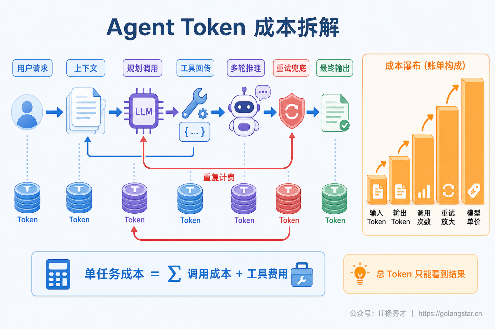
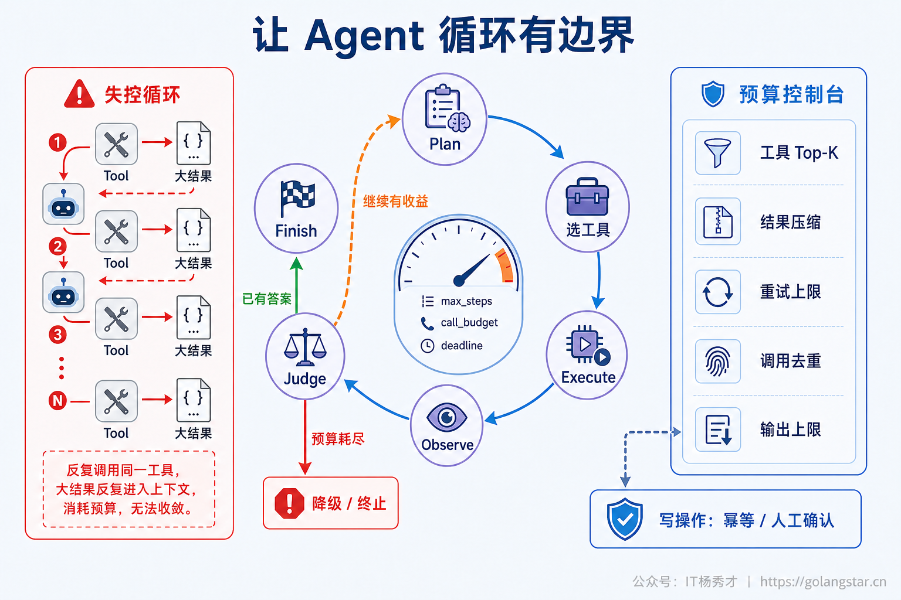
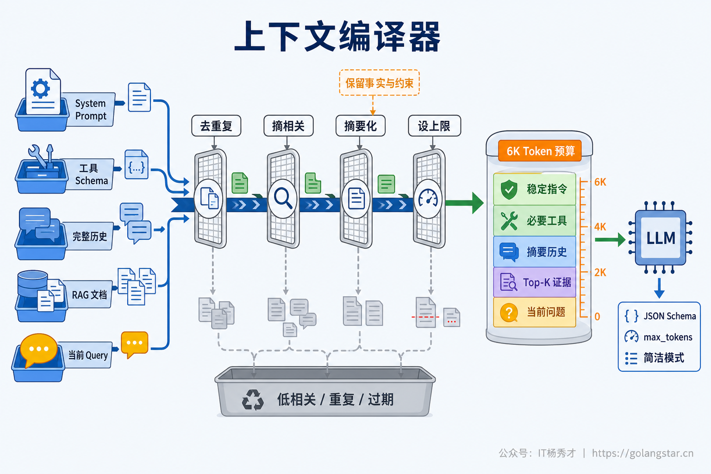
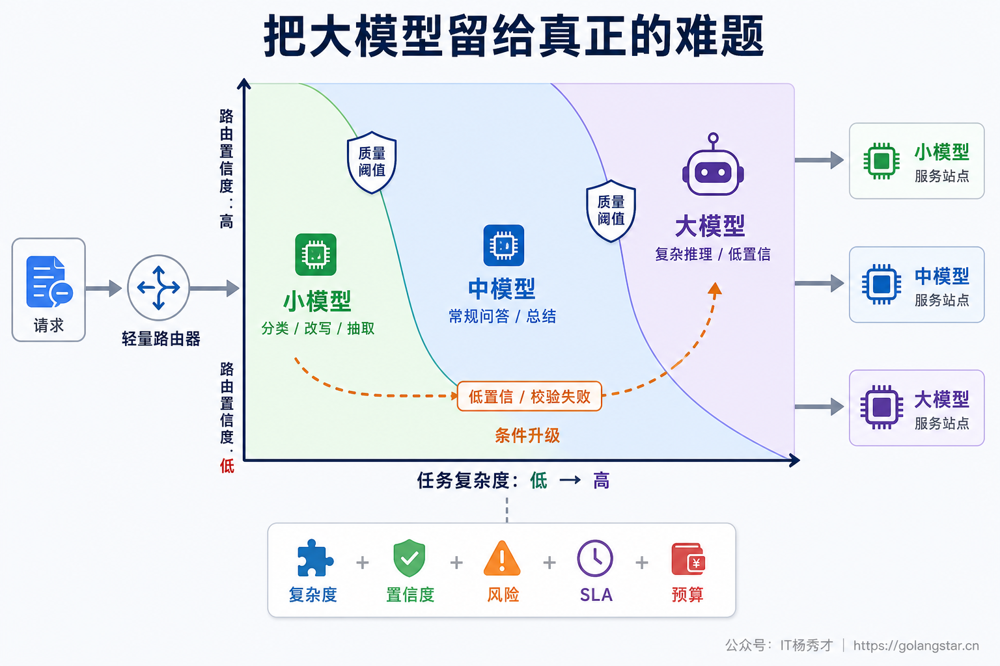
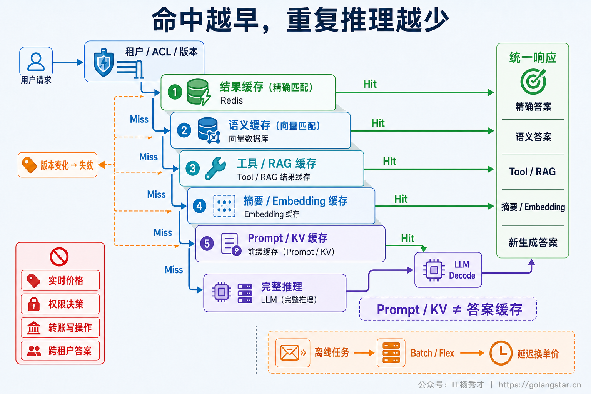
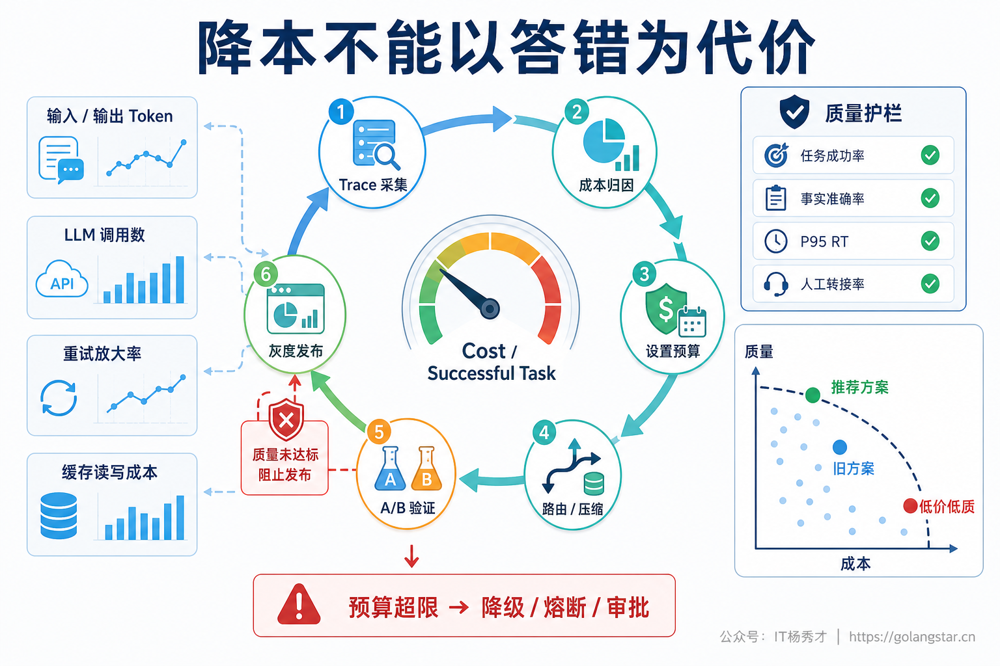

## **1. 题目分析**

Token 账单很少是某一天突然失控的，更常见的情况是几个小变化同时发生：对话历史变长了，工具数量增加了，Agent 平均多跑了两轮，失败请求开始自动重试，简单任务也被路由到强模型，最终回答又比原来长了一倍。每个变化单看都不惊人，乘在一起之后，月度成本就会持续爬升。

因此，降本不能从“换一个便宜模型”开始，也不能只盯总 Token。生产环境首先需要回答三个问题：钱花在哪个 Agent 节点，增长来自流量还是单任务成本，削减之后任务是否仍然一次完成。只有把成本还原到一次成功任务的执行链路，Prompt 瘦身、模型路由、缓存和 Batch 才不会变成零散技巧。

### **1.1 先把账算明白**

一次 Agent Run 往往包含 Router、Planner、RAG、多个 Tool、Judge、Reflection 和 Final Answer。每个模型节点还可能产生普通输入、缓存读取、缓存写入和输出 Token，不同部分的单价并不相同。一个更完整的成本模型可以写成：

```text
C_run = Σ [U_in × P_in + U_cache_read × P_cache_read
         + U_cache_write × P_cache_write + U_out × P_out] + C_tool

C_success = Σ C_run / 质量达标且成功完成的任务数
```

其中 `C_tool` 是搜索、代码执行、第三方 API 等非 Token 费用，不能混进 Token 单价。各 Provider 的计量字段和缓存规则不同，成本服务需要使用响应中的真实 usage 对账，而不是只靠请求前估算。

第二个容易忽略的问题是**上下文重复计费**。多轮 Agent 的第二次调用会把前一轮消息、工具调用和 Tool Result 再次作为输入，第三次调用又会携带更长的历史。最终上下文只有 20K Token，并不意味着整个任务只支付了 20K 输入 Token，真实输入量是每一轮输入的累加。工具返回的大段 JSON、网页全文和重复检索结果一旦进入历史，后续每轮都会继续放大。

成本归因应落实到 Trace 的每个 Span，至少记录模型、节点、Prompt 版本、输入/输出/缓存 Token、工具结果字节数、调用原因、重试来源和最终状态。总账上涨还要拆成 `请求量 × 每任务调用数 × 每调用 Token × 单价 × 重试放大率`。这样才能判断问题究竟来自业务增长、流量结构变化，还是某次发布让 Agent 多走了无效步骤。



### **1.2 先砍掉不必要的模型调用**

最便宜的 Token 永远来自没有发生的那次调用。很多链路会把意图识别、是否检索、Query Rewrite、工具选择、结果检查和答案润色分别交给 LLM，表面上每个节点职责清晰，实际却在反复支付相似的上下文。工程上可以让一次结构化 Planner 同时输出任务类型、检索需求、工具计划和预算；权限判断、枚举映射、状态机流转、参数转换等确定性逻辑直接使用程序实现；简单 FAQ、固定工作流和明确命令则走 Fast Path，不进入完整 ReAct 循环。

Judge、Reflection 和多模型复核不应默认全量开启。低风险且结构校验通过的请求可以直接结束，只有低置信度、高风险操作或质量门槛未通过时才追加验证。多 Agent 也不是默认的降本方案，Agent 之间的消息、独立上下文和汇总调用会增加 Token；只有专业分工带来的成功率提升能够覆盖通信成本时才值得拆分。

循环必须具备硬边界和收益判断。每个 Run 需要设置 `max_steps`、`max_llm_calls`、`max_tool_calls`、总 Token Budget 与 Deadline；连续调用相同工具、参数高度相似、证据没有新增时触发重复检测。预算接近上限后，应优先 Early Exit、使用当前最佳证据降级回答或转异步，而不是再开一轮“试试看”。重试只能由一个架构层负责，并区分格式修复、临时网络错误和不可重试的业务错误；有副作用的工具还必须经过幂等校验或人工确认。

并行主要降低墙上时间，不天然减少 Token。若三个推理分支全部执行并在最后汇总，账单往往比串行选择一个分支更高。并行探索应配合 `first-good`、quorum、分支预算和及时取消，客户端断开后的取消信号也要传到 Provider，否则页面虽然结束，后台仍在继续生成并计费。



### **1.3 把上下文当成编译产物**

生产 Prompt 不应该是历史、工具和检索结果的简单拼接，而应是根据本轮任务编译出来的最小充分上下文。系统需要先给各部分分配预算，再决定哪些内容进入模型：当前问题和安全约束必须保留；工具、记忆与证据按相关性注入；低价值、重复和过期内容直接丢弃。

System Prompt 可以删除重复说明和模型已经通过 Schema 获得的信息，但权限、安全和输出契约不能为了省 Token 被删掉。稳定的指令、Few-shot 与公共参考材料放在前缀，用户数据、时间戳和实时证据放在后缀，既便于版本管理，也有利于 Prompt Cache 复用。工具较多时只注入当前意图相关的 Schema，或者使用延迟加载的 Tool Search，不能让几十个工具定义在每一轮重复出现。

RAG 的目标不是塞满窗口，而是在限定预算内提供足够证据。常见做法是缩小检索范围、Chunk 去重、Rerank 后只保留高价值片段，再对长片段做 Query-aware Compression。Tool Result 同样应该先在代码层做字段投影、过滤和聚合，只把模型做下一步判断真正需要的字段放回上下文；多个查询能由程序批量执行并汇总时，不必让原始结果逐轮经过模型。

长对话可以保留“最近原文 + 已确认事实 + 未完成任务 + 历史摘要”，旧 Tool Result 在完成作用后清理。摘要不是免费压缩，也不是无损压缩，必须计算摊销：

```text
未来复用次数 × 每次减少的输入成本
> 摘要生成成本 + 缓存前缀重写成本
```

若对话马上结束，额外调用大模型生成摘要可能反而更贵；若摘要遗漏权限、数字、否定条件或未完成状态，成本下降也会换来错误结果。因此上下文压缩必须经过事实槽位校验，并与原始会话持久化分离。



### **1.4 让模型和推理预算匹配任务**

模型路由需要细化到 Agent 节点，而不是给整个应用固定一个模型。意图分类、Query Rewrite、字段抽取、短摘要可以使用经过评测的小模型；常规问答和单跳 RAG 使用中等模型；复杂规划、多跳推理、高风险决策和最终证据合成才进入强模型。路由条件至少包含任务复杂度、置信度、风险等级、上下文长度、SLA 和剩余预算。

路由器本身不能成为新的昂贵调用。明确场景优先使用规则、Embedding 分类器或轻量模型，也可以复用 Planner 已经输出的复杂度。Cascade 同样要算期望成本：

```text
E(C_cascade) = C_small + P(升级) × C_large
```

如果小模型经常失败并携带更长上下文升级，级联成本可能高于直接调用强模型。阈值应通过真实流量校准，对明显复杂或高风险请求直接路由到强模型，避免“先便宜失败一次”制造额外账单。

输出 Token 是另一块稳定的成本杠杆。回答应根据场景定义输出合同，例如一句结论、固定字段 JSON、最多五条建议或指定字数；结构化输出能减少解释性废话，明确停止条件可以避免重复总结。`max_output_tokens` 只是防失控的硬上限，不等于合适的目标长度，设置过小会造成截断和二次追问。支持推理强度控制的模型还应按节点调节 Effort，简单抽取无需使用最高推理预算，也不应要求模型把 Raw CoT 输出给应用。



### **1.5 复用与异步调度**

缓存要按“省掉什么”来区分。精确答案缓存和经过严格隔离的语义缓存能够直接省掉整次 Agent Run；Embedding、检索结果和确定性 Tool Cache 省掉局部计算；Prompt Cache 与自部署模型的 Prefix/KV Cache 复用相同前缀的 Prefill，但后续答案仍要重新 Decode。Prompt Cache 命中并不代表逻辑上下文 Token 消失，账单还要同时观察普通输入、Cache Read 与 Cache Write，频繁改动前缀可能让写入成本抵消收益。

高并发下相同任务同时到达时，可以使用 Singleflight 合并在途请求，避免多个实例在缓存 Miss 后一起调用模型。所有结果缓存都必须遵守租户、ACL、模型、Prompt、知识库和数据版本边界；实时价格、权限判定、转账和发消息等强实时或有副作用操作，不能为了命中率直接复用旧结果。

不要求实时返回的离线评估、批量摘要、Embedding、报表和内容生成，可以进入 Provider 的 Batch 或更低优先级服务档位。此类模式通常用更长完成时间换更低单价，但折扣、时限和支持的模型会变化，需要按实际 Provider 规则核算。自部署模型则可以通过 Continuous Batching、量化、Prefix Cache 和提高 GPU 利用率降低每 Token 的基础设施 TCO；这些手段降低的是计算单价，不会减少业务语义上的 Token 数量。



### **1.6 用成功任务成本做长期治理**

降本最后必须变成持续治理，而不是一次 Prompt 清理活动。Gateway 和 Agent Trace 应按租户、功能、意图、模型、节点、Prompt 版本和发布版本聚合成本，核心看板至少包括：每个成功任务成本、每 Run 的 P50/P95 Token、平均 LLM 调用数、输入输出占比、缓存读写成本、模型升级率、重试放大率、异常终止率和取消后残留消耗。总 Hit Rate 或平均 Token 都可能掩盖少量极贵的长尾任务，因此还要对成本最高的一组 Trace 做 Pareto 分析。

预算守卫可以分成三层：租户和功能的日/月预算控制总盘子，单任务预算限制调用数、Token、工具结果大小和最大分支数，节点预算约束 Planner、Worker、Judge 与 Final Answer 各自的消耗。超过软阈值时切换短上下文、小模型、缓存答案或异步路径；超过硬阈值时停止新增推理并返回可解释的降级结果。金融、医疗、权限和写操作等高风险场景不能跳过必要校验，预算不足时应失败或转人工，而不是生成未经验证的答案。

所有降本变更都需要在固定评测集和脱敏生产 Replay 上验证，再按租户或意图灰度发布。除了 Token 和费用，还要同时比较任务完成率、一次解决率、事实准确率、工具调用正确率、安全违规率和 P95 RT。成本从 0.10 元降到 0.06 元，但一次解决率下降导致大量用户重新发问，最终的 `Cost per Successful Task` 可能更高。

真正稳定的优化目标不是 Token 越少越好，而是在质量门槛之上找到成本更低的 Pareto 点。先解决浪费最大的节点，再逐步压缩预算，每次改动都能回滚、能归因、能证明收益，Token 成本才会从“月底看账单”变成可度量、可预测、可治理的工程指标。



***

## **2. 参考回答**

生产环境里我会先做成本归因，而不是直接换便宜模型。核心指标是每个质量达标且成功完成任务的成本，把一次 Agent Run 拆到 Router、Planner、RAG、Tool、Judge 和 Final Answer，记录每个节点的输入、输出、缓存 Token、调用次数和重试来源，先确认增长来自流量、上下文、循环次数还是模型路由。

优化顺序上，先删除不必要的 LLM 调用：确定性逻辑写成程序，合并 Planner 决策，Judge 和 Reflection 按风险触发，并给每个任务设置步骤、调用、Token 和重试预算。然后做任务级上下文编译，只保留相关历史、必要工具和 Top-K 证据，Tool Result 先过滤聚合；按节点做模型分层，低置信或校验失败才升级强模型，同时约束推理强度和输出长度。最后使用结果缓存、Prompt Cache、Singleflight、Batch 和自部署推理优化进一步摊薄单价。所有方案都通过 Replay、A/B 和灰度验证，并同时看任务完成率、准确率和 P95，避免用答错或重复提问换取账面降本。

<div style="background-color: #f0f9eb; padding: 10px 15px; border-radius: 4px; border-left: 5px solid #67c23a; margin: 20px 0; color:rgb(64, 147, 255);">

## <span style="color: #006400;">**学习交流**</span>
<span style="color:rgb(4, 4, 4);">
> 如果您觉得文章有帮助，可以关注下秀才的<strong style="color: red;">公众号：IT杨秀才</strong>，后续更多优质的文章都会在公众号第一时间发布，不一定会及时同步到网站。点个关注👇，优质内容不错过
</span>


<div style="text-align: center; margin-top: 22px; padding-top: 20px; border-top: 1px solid #c2e7b0;">
<div style="color: #006400; font-size: 20px; font-weight: bold;">🔥 配套实战项目，拆得开、跑得起、能写进简历</div>
<div style="color: red; font-size: 16px; font-weight: bold; margin-top: 8px;">多 Agent 编排 + RAG 混合检索 · 31 篇深度教程 + 50+ 面试题</div>
<a href="/projects/dev-support.html" style="display: inline-block; margin-top: 14px; background: #ff7a18; color: #fff; font-size: 18px; font-weight: bold; padding: 10px 28px; border-radius: 24px; text-decoration: none;">点击查看 DevSupport AI 实战项目 →</a>
</div>
</div>
