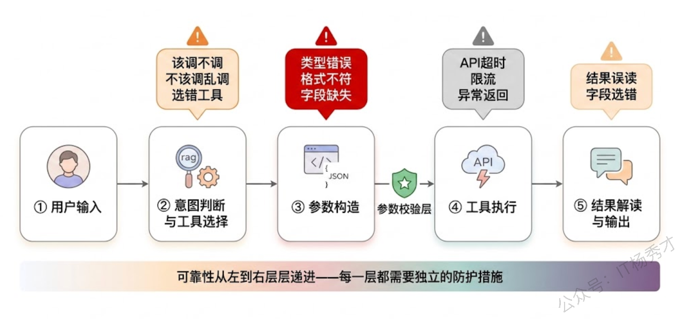
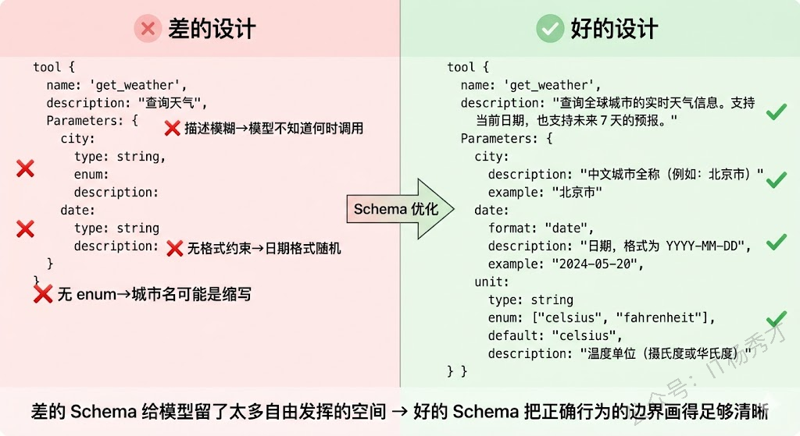
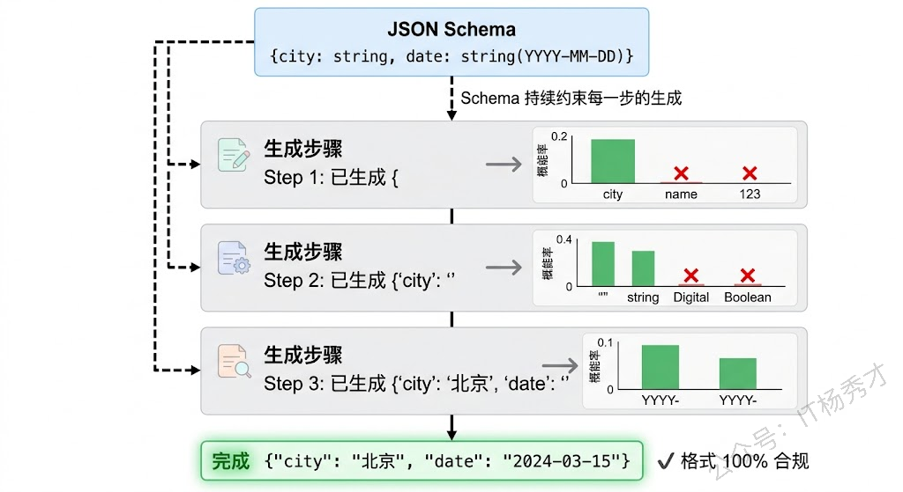
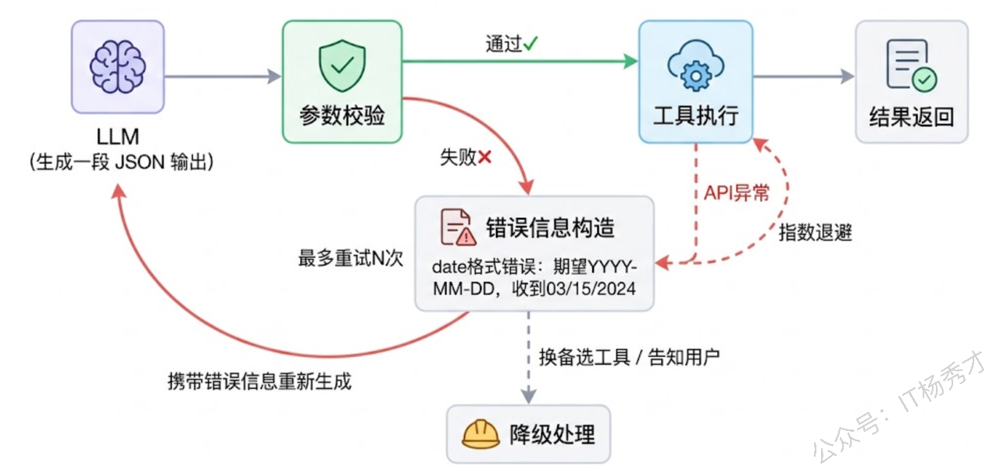
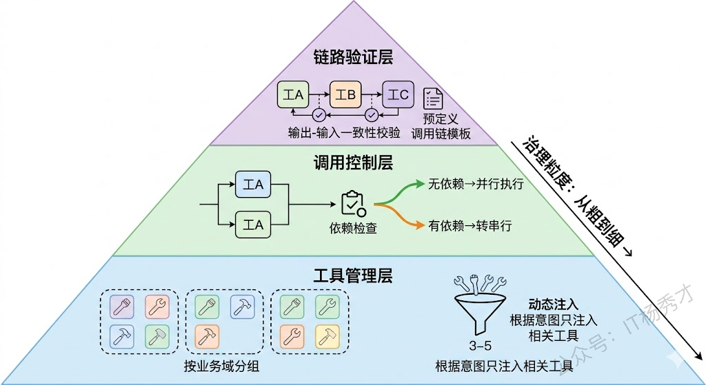
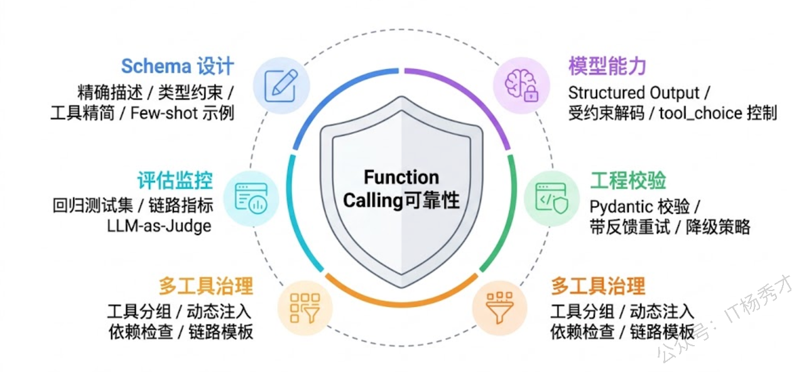

## **1. 题目分析**

Function Calling 大概是 LLM 应用开发中最拧巴的一个环节——你让一个概率模型去做一件需要百分之百精确的事。模型生成的自然语言可以有措辞差异、可以有风格变化，用户多半不会在意，但一个工具调用的参数少了一个字段、日期格式从 `YYYY-MM-DD` 变成了 `DD/MM/YYYY`、或者枚举值 `pending` 拼成了 `Pending`，下游系统直接报错，整个 Agent 流程就断了。这就是 Function Calling 可靠性问题的本质：**一个模糊的系统在试图产出精确的结果。**

面对这个问题，不能只是泛泛而谈"做好 Prompt 就行了"，而是要能把这个问题拆成若干具体的失败模式，然后针对每种失败模式给出工程上的应对手段。能讲清楚"哪里会出错"和"怎么防住"，才能说明你真的在生产环境中跟 Function Calling 打过交道。

### **1.1 先搞清楚到底哪里会出错**

要保障可靠性，第一步是建立对失败模式的完整认知。Function Calling 的失败不是一种，而是一串，发生在调用链路的不同环节。按照一次工具调用从"模型决策"到"结果返回"的完整路径来梳理，大致可以分为五类问题。

**该调的时候不调，不该调的时候乱调。** 这是意图识别层面的错误。用户说"帮我查一下明天北京的天气"，模型应该调用天气查询工具，但它可能直接用自己的知识编造了一个天气预报；反过来，用户只是随口说"天气真好啊"，模型却触发了天气查询。这类问题在工具数量较多、工具功能有重叠的时候尤其严重——十几个工具摆在面前，模型很容易选错或者在不需要工具的时候画蛇添足。

**调对了工具，但参数构造出错。** 这是最常见也是最棘手的一类失败。模型正确地选择了天气查询工具，但传的城市名是 `"BJ"` 而不是 `"北京"`，或者日期格式不对，或者漏掉了必填的 `unit` 参数。参数构造错误的形态非常多样——类型错误、格式不符、值域越界、字段缺失、多余字段——它们在传统开发中靠编译器和类型系统就能拦住，但在 LLM 生成的世界里，每一个都可能发生。

**格式层面的解析失败。** 模型返回的 JSON 不合法——多了个逗号、少了个引号、在 JSON 外面包了一层 markdown 代码块，甚至直接返回了自然语言而不是 JSON。虽然现在主流模型的 structured output 能力已经大幅改善，但在使用开源模型或者老版本 API 时，这个问题仍然常见。

**工具执行层面的失败。** 参数没问题，格式也没问题，但外部 API 本身超时了、限流了、返回了错误码、或者返回了一个出乎意料的数据结构。这不是模型的错，但 Agent 需要能理解并应对这些失败。

**结果误用。** 工具成功返回了结果，但模型在解读结果时出了偏差——比如把美元当成了人民币，或者在多个返回字段中选错了要用的那个。

### **1.2 Schema 设计是第一道防线**

很多人把 Function Calling 的可靠性问题归结为模型能力不够，但实际上有相当一部分错误可以通过更好的 Schema 设计来避免。Schema 写得好不好，直接决定了模型犯错的空间有多大。

**工具描述（description）要写给模型看，不是写给人看。** 很多开发者习惯性地用简短的技术注释来写工具描述，比如 `查询天气数据`。但模型需要的是更明确的使用指南：什么时候该用这个工具、什么时候不该用、输入应该是什么样的。一个好的描述是 `"当用户询问某个城市未来的天气状况时调用此工具。不要用于查询历史天气。城市名称需使用中文全称，如'北京'而非'BJ'"`。描述越具体，模型的决策边界就越清晰。

**参数的约束要在 Schema 里写死，不要指望模型自觉。** JSON Schema 本身提供了丰富的约束能力——`enum` 限定可选值、`pattern` 用正则约束格式、`minimum/maximum` 限定数值范围、`required` 标明必填字段。这些约束不只是给下游校验用的，模型在生成参数时也会参考 Schema 中的约束信息。一个写了 `"enum": ["celsius", "fahrenheit"]` 的 `unit` 字段，比一个只写了 `"type": "string"` 的字段，出错率低得多。

**控制工具数量，避免选择困难症。** 实验数据表明，当可用工具超过 10-15 个时，模型的选择准确率会明显下降。如果你的系统确实有几十个工具，应该做分组或分级——根据用户意图先做一轮粗筛，只把相关的 3-5 个工具放进当前 prompt，而不是把全部工具一股脑塞给模型。这种动态工具注入的策略在实际项目中效果非常好。

**用 few-shot 示例来校准模型的调用行为。** 在 System Prompt 中给出 2-3 个完整的调用示例——包括用户输入、期望的工具选择、期望的参数格式——可以显著降低模型的调用错误率。示例的作用不仅是教模型"怎么调"，更重要的是帮模型建立"什么情况下调"和"什么情况下不调"的判断标准。

### **1.3 Structured Output 与受约束解码**

Schema 设计再好，最终还是要靠模型来生成符合要求的输出。好消息是，主流模型厂商这两年在这方面的投入非常大，已经提供了多种机制来从模型侧保障输出的格式可靠性。

**Structured Output（结构化输出）** 是目前最强的格式保障手段。OpenAI 在 2024 年推出的 Structured Outputs 功能，可以保证模型的输出 100% 符合你提供的 JSON Schema——不是"尽量符合"，是"一定符合"。它的底层原理是**受约束解码（Constrained Decoding）**：在模型生成每个 token 时，根据当前已生成的内容和目标 Schema，动态计算出下一个 token 的合法候选集，把所有不合法的 token 的概率置零。比如当模型刚生成了 `{"city": ` 之后，如果 Schema 要求 city 是 string 类型，那么下一个 token 只能是引号开头的字符串，数字和布尔值的 token 概率直接被清零。

这种机制从根本上消除了格式层面的错误——不会再出现 JSON 不合法、字段类型错误、缺少必填字段等问题。但要注意，Structured Output 保证的是格式正确，不保证语义正确。模型可能生成一个格式完美但值完全离谱的 JSON，比如把城市名填成了用户名。

**Function Calling 模式本身也自带一定的格式保障。** 当你通过 API 的 `tools` 参数传入工具定义时，模型会进入一种特殊的生成模式，输出的格式比普通 chat completion 要稳定得多。结合 `tool_choice` 参数，你还可以控制模型是自己决定是否调用（auto）、必须调用某个工具（指定工具名）、还是不许调用任何工具（none），进一步缩小决策空间。

### **1.4 验证层、重试与降级**

模型侧的能力再强，工程上也不能把所有赌注压在模型身上。一个成熟的 Function Calling 系统一定有独立于模型的验证和容错机制。

**参数校验中间层是最基本的工程实践。** 在模型输出工具调用指令和实际执行工具之间，插入一个校验层。这个校验层做的事情很具体：拿模型生成的参数去跟 JSON Schema 做一次严格校验（用 jsonschema 库或者 Pydantic 模型），检查类型是否正确、必填字段是否齐全、枚举值是否合法、数值是否在范围内。校验不通过的，不要直接报错，而是把错误信息反馈给模型，让它修正后重新生成。这种"生成→校验→反馈→重试"的循环，实测中能修复 80% 以上的参数错误。

说到重试，**重试策略的设计也有讲究**。不是简单地失败了就再来一次，而是要区分失败类型来决定怎么重试。参数校验失败，应该把具体的校验错误信息（比如"date 字段格式不符，期望 YYYY-MM-DD，实际收到 03/15/2024"）拼进 prompt 让模型修正，这叫"带反馈的重试"。API 超时或限流导致的失败，应该用指数退避（Exponential Backoff）重试，跟模型无关。如果同一个工具连续失败 N 次，就应该触发降级策略——要么换一个功能类似的备选工具，要么直接告诉用户这个操作暂时无法完成，而不是无限重试。

**Pydantic 在 Python 生态中几乎是 Function Calling 的标配。** 用 Pydantic 定义工具参数的数据模型，一方面自动生成 JSON Schema 给模型用，另一方面自动完成参数解析和校验。如果模型返回的参数不符合 Pydantic 模型的定义，会直接抛出带有详细错误信息的 ValidationError，这些错误信息可以直接拼进下一轮 prompt。LangChain 的 `@tool` 装饰器和 OpenAI 的 function calling 示例中大量使用了这种模式。

### **1.5 多工具场景下的可靠性挑战**

当系统中只有两三个工具时，上面这些手段基本够用了。但当工具数量上升到十几个甚至几十个，可靠性问题会变得复杂得多。

**工具之间的混淆是头号问题。** 功能相近的工具特别容易被混淆——`search_products` 和 `search_inventory` 都是搜索，模型怎么知道该用哪个？`send_email` 和 `send_notification` 都是发消息，边界在哪里？解决这个问题要从两方面入手。一方面在工具描述中明确写清彼此的区别，不是各自描述自己就行，而是要告诉模型"当 X 场景用工具 A，当 Y 场景用工具 B"。另一方面要做工具分组，把工具按业务域分成几组，模型先选组再选工具，像一个两级菜单一样，减少每一级的选择数量。

**Parallel Function Calling（并行调用）引入了新的复杂度。** 现在主流模型支持在一次回复中同时调用多个工具。这在效率上是好事，但也带来了新问题：模型可能在本该串行的场景中错误地并行调用（比如先查用户信息才能下单，模型同时调了查询和下单），或者并行调用的多个工具之间有隐含的参数依赖但模型没意识到。工程上需要在执行层做依赖检查——如果检测到并行调用之间存在数据依赖，自动将其转为串行执行。

**工具调用链路的组合也需要验证。** 在复杂 Agent 中，完成一个任务可能需要调用 3-5 个工具，每个工具的输出是下一个工具的输入。单个工具调用的可靠性都保住了，但组合在一起时可能出现语义层面的不一致——第一个工具返回的是 ID，第二个工具期望的是名称，模型需要做一次转换但可能转错。对于关键的工具调用链路，可以预定义一些常见的调用模板（Tool Chain Template），限制模型只能在预定义的链路模式中选择，而不是完全自由组合。

### **1.6 评估与监控：持续度量才能持续改进**

可靠性不是一次性做到位的事情，它需要持续度量、持续优化。工程上要建立一套完整的评估和监控体系。

**离线评估要建标准测试集。** 收集真实用户的请求和期望的工具调用结果，构建一个 benchmark 数据集。每次修改了 Schema、调整了 Prompt、升级了模型版本，都要跑一遍测试集，看工具选择准确率、参数正确率、端到端任务完成率这几个核心指标是涨了还是跌了。这跟传统软件的回归测试是一个道理，只不过评估的对象从代码输出变成了模型调用行为。

**线上监控要跟踪关键链路指标。** 在生产环境中，至少需要监控这些指标：工具调用的触发率（是否在该调的时候调了）、参数校验通过率（参数质量怎么样）、工具执行成功率（下游服务是否稳定）、重试率和重试成功率（容错机制是否有效）、端到端任务完成率（用户视角的体验）。这些指标要有告警阈值，一旦某个指标异常下降，能及时发现并排查。

**LLM-as-Judge 可以做更细粒度的质量评估。** 对于一些难以用规则判断对错的场景——比如模型选了一个也说得过去但不是最优的工具，或者参数在语义上有微妙的偏差——可以用另一个 LLM 来做裁判，评估调用决策的合理性。这种方式成本较高，通常用于离线的抽样评估，而不是线上实时检查。

最后补充一个实践中的重要认知：**可靠性保障的投入应该和业务风险成正比。** 一个内部的数据查询助手，工具调用出错了大不了让用户重新问一次，做基本的参数校验和重试就够了。但如果是一个能操作用户账户、发起交易的 Agent，每一次误操作都可能造成真实损失，那就需要在关键操作前加人工确认、在高风险工具上设置更严格的参数约束、甚至对某些操作做"双模型交叉验证"（两个模型都认为该执行才执行）。没有一刀切的方案，工程上的权衡永远是在可靠性、延迟和成本之间找平衡点。

***

## **2. 参考回答**

Function Calling 的可靠性保障需要从多个层面来做，我把它理解成一个纵深防御的体系。首先从源头上，Schema 设计是第一道防线。工具描述要写得足够具体，不只是说"做什么"，还要说"什么时候用、什么时候不用"。参数定义要用好 JSON Schema 的约束能力——enum 限定可选值、pattern 约束格式、required 标明必填字段。工具数量多的时候要做分组和动态注入，避免模型面对太多选择时犯迷糊。配合 few-shot 示例来校准调用行为，效果提升会很明显。

在模型侧，现在主流模型都支持 Structured Output，底层用受约束解码来保证输出 100% 符合 JSON Schema，这从根本上解决了格式层面的可靠性问题。但它只保证格式正确，不保证语义正确，所以工程侧还需要独立的兜底机制。

工程上最关键的实践是在模型输出和工具执行之间插一个参数校验层，我们项目中用 Pydantic 来做。校验失败的不直接报错，而是把具体的校验错误信息反馈给模型让它修正重试，这种"带反馈的重试"能修复大部分参数错误。同时要区分失败类型——参数错误走反馈重试，API 超时走指数退避，连续失败 N 次走降级策略，不能一刀切地处理所有失败。

最后是持续的评估和监控。我们会维护一个基于真实用户请求的标准测试集，每次改 Schema 或升级模型都跑回归测试。线上则监控工具调用触发率、参数校验通过率、执行成功率这些关键指标，设好告警阈值。整体来说，可靠性不是某一层做到极致就够的，而是每一层都做好基本功，形成纵深防御。

## **学习交流**

> 如果您觉得文章有帮助，可以关注下秀才的<strong style="color: red;">公众号：IT杨秀才</strong>，后续更多优质的文章都会在公众号第一时间发布，不一定会及时同步到网站。点个关注👇，优质内容不错过

