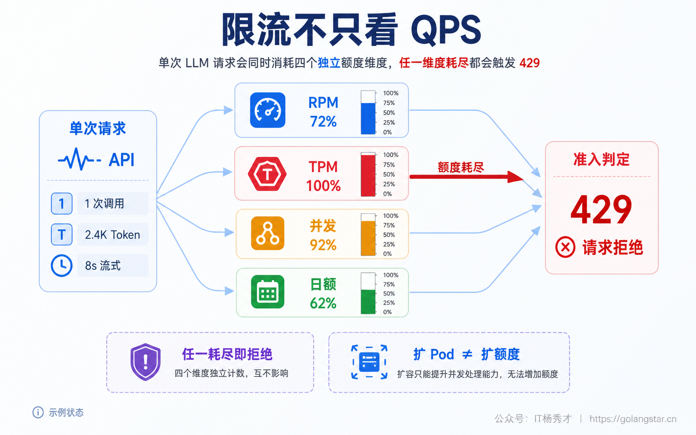
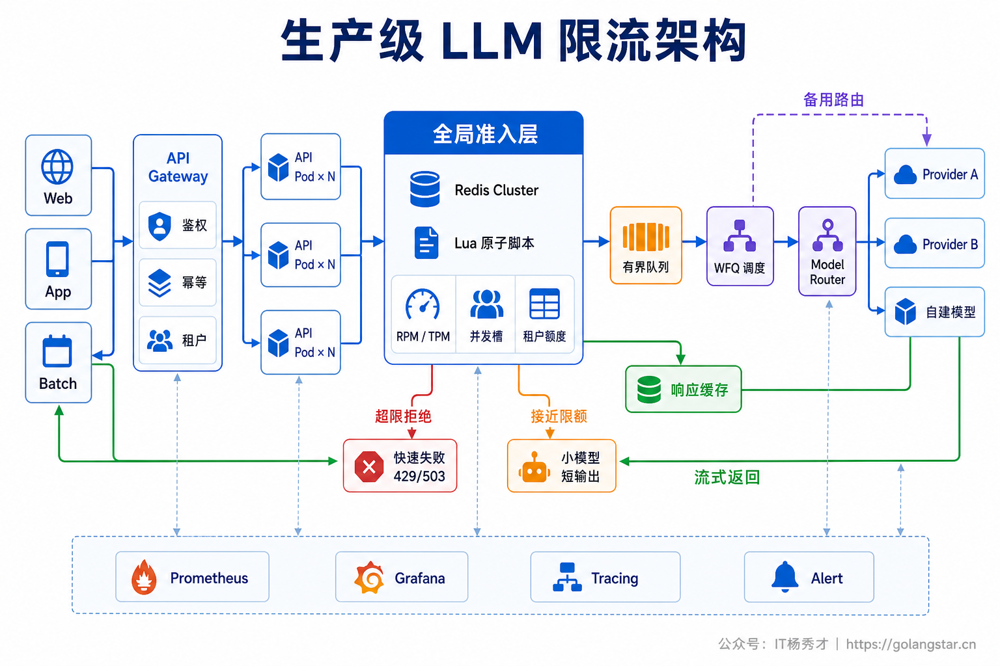
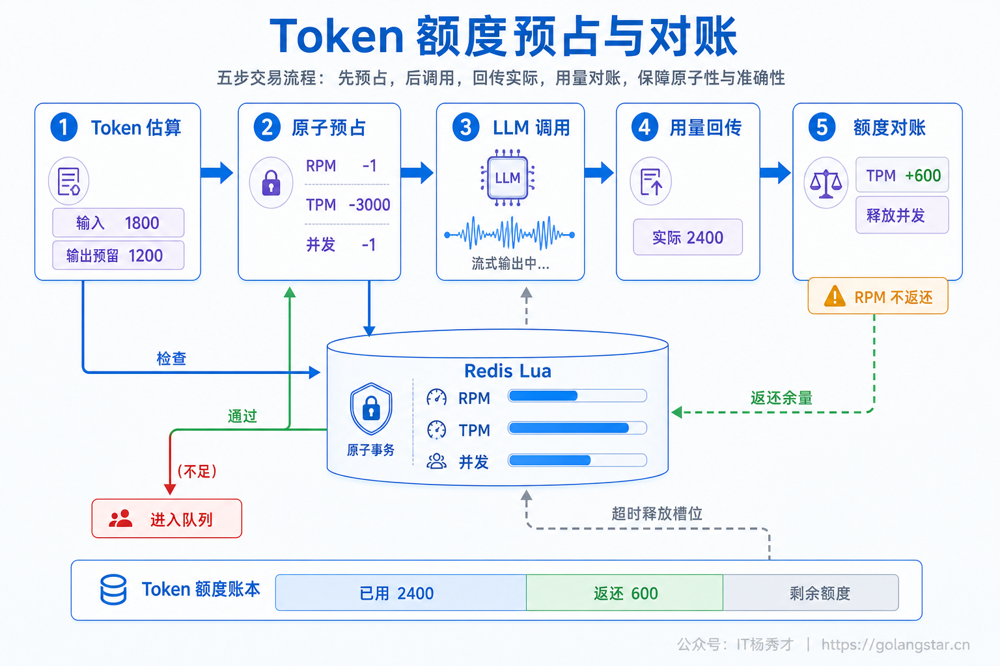
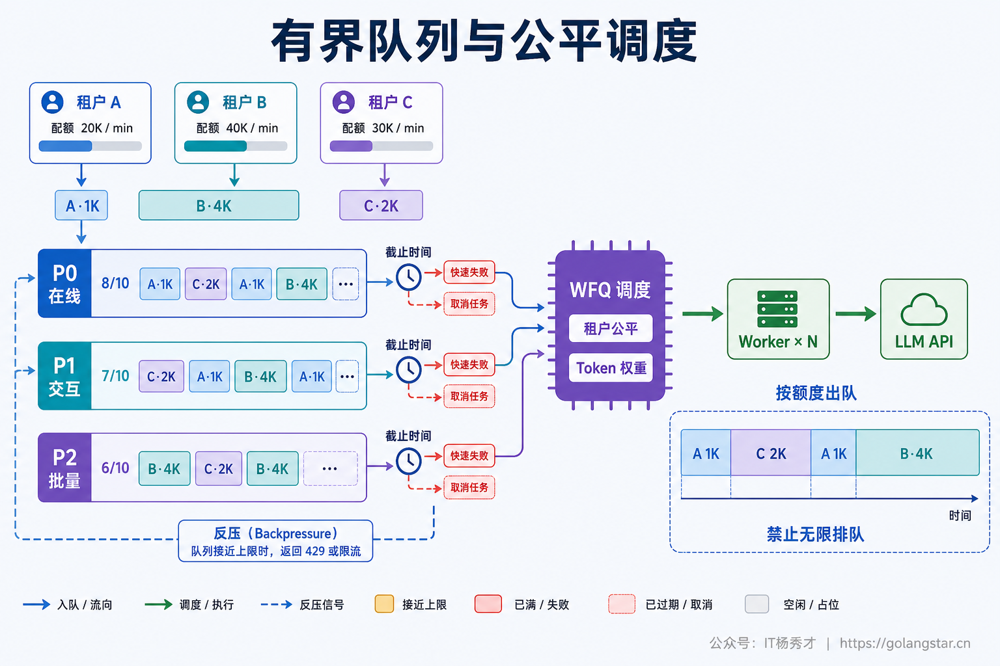
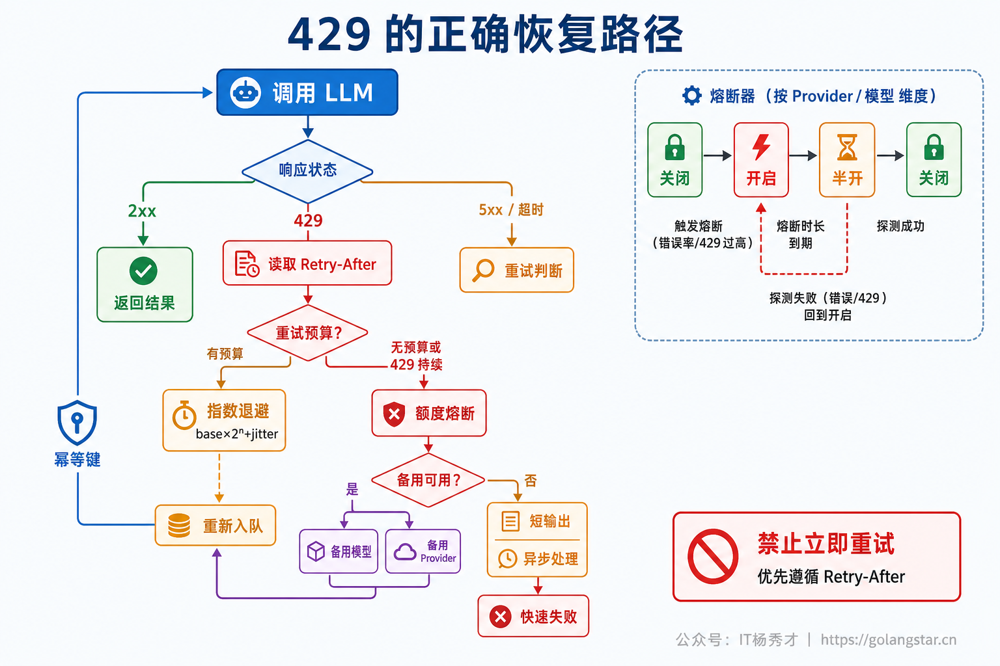
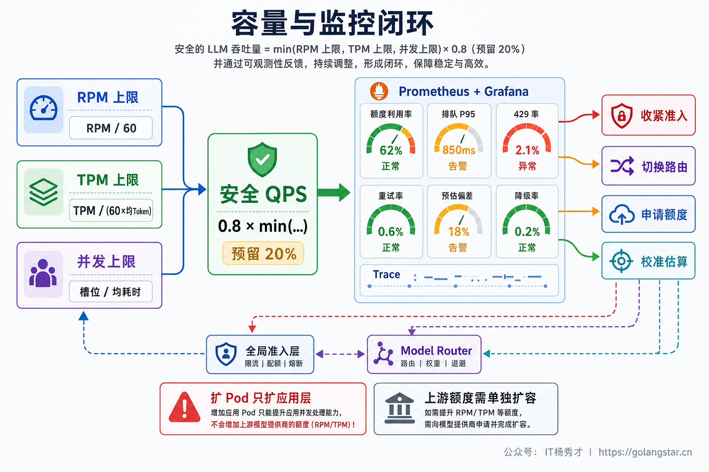

## **1. 题目分析**

LLM 接口开始返回 429 时，最容易发生的误判是把它当成一次普通的网络失败：休眠几秒、重试几次，问题似乎就解决了。低流量时这套做法偶尔有效，高并发时却可能正好相反。失败请求继续消耗调用额度，大量实例又在相近时间醒来重试，原本只差一点的配额很快被重试流量吃光，429 随后扩散成排队、超时和全链路雪崩。

这类问题难就难在，LLM 接口虽然看起来也是一个 HTTP API，消耗单位却不是简单的“请求”。短问答可能只占用几百个 Token 和几百毫秒，一次长上下文推理却可能占用几万个 Token，并保持流式连接几十秒。生产系统真正要调度的是**请求次数、Token 吞吐和在途并发共同构成的容量池**。因此，解决 LLM 接口限流的核心不是“怎样把 429 重试成功”，而是尽量在请求发出去之前完成准入、排队和路由，让 429 只成为容量估算失准时的最后反馈。

### **1.1 先确认撞到的是哪一道限制**

大模型供应商的限流通常是多维的。常见维度包括 RPM（每分钟请求数）、TPM（每分钟 Token 数）、分别统计的输入与输出 Token、最大并发请求或流式连接数，以及日额度、月度费用和批任务队列上限。部分平台还会在流量突然爬升或共享资源池拥塞时返回 429，此时账户账面额度可能仍有剩余。

这些限制彼此独立。大量短请求容易先耗尽 RPM，少量超长 Prompt 可能先耗尽输入 TPM，长时间流式生成又可能卡住输出 TPM 或并发槽。业务 Pod 扩得再多，也不会自动增加外部模型的组织级配额，反而可能把请求更快地压向同一个上游。



容量评估可以先用一个简单公式确定上界。假设平均每次请求消耗 `I` 个输入 Token、`O` 个输出 Token，平均耗时为 `S` 秒，上游提供 `R` RPM、`TI` 输入 TPM、`TO` 输出 TPM 和 `C` 个并发槽，那么可持续请求速率大致受下面四项中的最小值约束：

```text
safe_rps ≈ utilization × min(
  R / 60,
  TI / (60 × I),
  TO / (60 × O),
  C / S
)
```

`utilization` 不能取 100%，通常还要为 Token 长尾、突发流量、重试和故障切流保留余量。实际计算也不应只用平均值，长上下文占比较高的业务至少要观察 P95、P99，否则几个“大请求”就可能让本地估算瞬间失真。

### **1.2 在 LLM Gateway 前完成全局准入**

只依赖供应商返回 429，等于把容量控制权交给故障现场。更稳妥的做法是在 LLM Gateway 前设置统一的 Admission Controller，把每个供应商、模型、区域和租户的可用额度维护成可调度资源。

请求进入后，先经过用户与租户级限流，防止单个调用方成为 noisy neighbor；随后检查目标模型的 RPM、输入 Token、输出 Token 和并发槽。全部预算都能拿到，请求才允许出站；任意一项不足，就进入有界队列、切换路由、降级或快速失败。多实例部署时，额度不能只放在各 Pod 的本地内存中，否则十个 Pod 都以为配额还有一份，实际流量会放大十倍。常见实现是用 Redis 加 Lua 脚本做原子扣减，或者由中心调度器向各节点发放短周期的额度租约。



限流算法也要与目标匹配。Token Bucket 允许在可控范围内吸收突发，适合入口准入；Leaky Bucket 更强调稳定出站，适合保护上游；滑动窗口比固定窗口平滑，代价是状态和计算更复杂。生产环境往往不是四选一，而是请求 Bucket、Token Bucket 和并发 Semaphore 叠加使用，再按“全局 → Provider/模型 → 业务线 → 租户”分层切配额。

### **1.3 Token 需要先预占再对账**

只按请求数扣一次令牌，无法区分 500 Token 的分类任务和 5 万 Token 的长文档分析。Token-aware 限流会在调用前先计算 Prompt 的输入 Token，再根据任务类型、历史分位数和 `max_tokens` 预留一部分输出额度，同时占用一个并发槽。

这几个资源需要一次性原子获取。若 RPM 有余量但 TPM 不足，请求不能先占住并发槽等 Token；若 Token 足够但没有并发槽，也不能提前消耗请求额度。调用完成后，系统根据响应中的实际 usage 对账：实际输出少于预留就返还差额，超出估算则补扣并更新估算系数；流式结束、取消或超时后释放并发槽。RPM 对应的调用已经发生，通常不能像未使用的 Token 预算那样返还。



不同供应商对 Token 计量、Prompt Cache、模型共享额度和响应头的定义并不完全相同，因而这层逻辑需要放进 Provider Adapter，而不是把一套公式硬编码到所有模型。响应中的剩余额度、重置时间和真实 usage 是权威反馈，本地 Bucket 只是预测器，需要持续用反馈校准。

### **1.4 队列只能削峰，不能创造容量**

短时流量峰值可以进入队列等待额度恢复，但队列必须有上限、有截止时间，还要支持背压。若请求到达速度长期大于上游放行速度，无限队列只会把“立即失败”变成“等待很久以后失败”，同时占用内存、连接和用户耐心。

在线请求通常设置较短的 Queue Deadline，预计无法在时限内获得配额时直接返回 429 或 503，并附带合理的 `Retry-After`；允许异步的报告、评测和数据清洗任务可以返回任务 ID，进入持久化队列。任务过期后应主动丢弃，不能等到获得额度时再执行一个已经失去业务价值的请求。



单一 FIFO 也不够。一个 5 万 Token 的长任务排在队首，可能让后面几十个短请求一起等待，形成队头阻塞。更合适的调度方式是把在线、交互和离线任务拆成不同优先级 Lane，再通过 Weighted Fair Queue 或 Deficit Round Robin 按租户权重和 Token 成本公平出队。核心业务可以预留少量配额，低优先级任务通过 Aging 避免永久饥饿。

### **1.5 先减少需求，再讨论扩容**

最便宜的一次模型调用，是没有发生的那次调用。限流治理不能只盯着怎样放行，还要从源头减少请求数和 Token 消耗。

完全相同且允许复用的请求可以走精确缓存；语义近似且业务能容忍近似答案的场景可以使用 Semantic Cache；高并发下同一热点问题同时到达时，可以用 Singleflight 合并在途请求，避免缓存击穿。固定的 System Prompt、工具定义和长文档上下文，如果供应商的计量规则支持 Prompt Cache，也能显著提高有效吞吐。缓存键必须包含模型版本、Prompt 模板、采样参数、知识库版本和租户权限域，不能让私有数据跨租户复用。

Token 侧可以压缩 System Prompt、裁剪无关对话、对长会话做摘要、降低 RAG `top_k`，并根据任务设置合理的输出上限。Agent 场景还要约束最大步骤数、最大并行分支和总 Token 预算，因为一个入口请求经 Planner、多个 Worker 和 Judge 放大后，可能变成十几次模型调用。Embedding、离线摘要和批量评测适合合并或走 Batch API；实时聊天则不能为了批处理牺牲首 Token 延迟。

### **1.6 429 要受控重试，不能原地猛冲**

本地准入仍可能因为计量误差、共享资源波动或突发限制收到 429。正确动作是先读取错误类型和 `Retry-After`、reset 等响应信息，再判断原请求是否还有足够 Deadline 和 Retry Budget。能够恢复的 429、部分 5xx 与网络瞬断才进入重试；参数错误、鉴权失败、余额不足和确定性的硬配额问题应直接失败或切换方案。



没有明确等待时间时，可以采用带 Full Jitter 的指数退避，并限制最大次数和总重试时长。重试权应集中在一个层级，避免 SDK、Gateway 和业务 Worker 各重试三次，把一次调用最坏放大成 27 次。重试任务也不应让 Worker 原地 `sleep` 并继续占用并发槽，而应释放资源后进入延迟队列，到期重新参加准入调度。对于 Agent 中带外部副作用的步骤，还要用幂等键和步骤状态避免模型重试间接导致重复发消息、重复下单或重复写库。

429 还可以反向驱动自适应调度。稳定成功且延迟正常时缓慢增加放行速率；429、TTFT 或 P99 上升时快速收紧并发，这类“加性增、乘性减”的控制方式比固定阈值更能适应共享容量波动。持续不可用的模型按“Provider + 模型 + 区域”隔离熔断，Half-open 只放少量探测流量，不能因为一个模型限流就把全部供应商一起关掉。

### **1.7 路由和降级要围绕业务价值**

当主模型额度紧张时，Model Router 可以结合任务复杂度、当前配额余量、延迟、成本和质量要求选择备用模型、其他区域或其他 Provider。简单的分类、改写和摘要优先交给小模型，高价值复杂请求保留强模型配额，后台任务主动避开在线高峰。需要特别确认备用模型是否真的使用独立配额池；同组织下轮换 API Key，或者切到共享额度的同系列模型，通常不能增加实际容量。

跨供应商也不只是替换 Base URL。Tokenizer、上下文长度、Tool Calling、JSON Schema、流式协议、安全策略和输出质量都可能不同，备用路由必须先完成协议适配和回归评测。无法无损切换时，就按提前设计好的 Brownout 阶梯降级：先关闭非必要的反思、Judge 和多候选生成，再减少检索文档和输出长度，然后切小模型、返回缓存、转异步，最后丢弃低价值任务或快速失败。权限校验、内容安全和高风险操作确认不能随着性能一起降级。

### **1.8 用监控闭环校准真实容量**

限流策略上线后，至少要按 Provider、模型、区域、业务和租户拆分观察：准入与拒绝请求数、RPM/TPM 利用率、Token 预占与实际偏差、in-flight、队列深度与最老任务年龄、429 原因、重试放大系数、TTFT、完整延迟、Fallback 与降级比例、缓存命中率和单请求成本。只有一个总 429 比例，无法判断究竟是 RPM、TPM、并发还是某个租户突然打满了额度。



压测也要使用真实的 Token 分布，而不是全部发送同样大小的短 Prompt。测试集应包含突发短请求、超长上下文、长流式输出、Agent 扇出和热点缓存击穿，并主动注入 429、慢响应和备用模型故障，观察队列能否清空、Retry Budget 是否生效、降级后质量是否仍然达标。

如果稳态需求长期接近配额上限，限流算法已经不能解决容量缺口。最终选择只能是申请更高额度、购买预置吞吐、接入真正独立的供应商或部署自有推理服务，同时继续削减低价值流量。队列能搬运时间，重试能跨过瞬时故障，但二者都不能凭空创造 Token 吞吐。

### **1.9 几种方案看似有效却会放大故障**

限流治理中最危险的做法，往往不是完全没有保护，而是保护机制之间互相打架。业务层看到 429 后立即重试，SDK 也在自动重试，队列消费者失败后又重新投递，同一个请求就可能被多层放大。应用 Worker 随流量自动扩容也有类似问题：消费能力变强了，上游配额却没有变化，结果只是让队列更快地撞向供应商。

通过轮换多个 API Key 分摊流量同样需要先确认配额归属。多个 Key 如果共享组织或项目额度，轮换不会获得新的吞吐，还会让额度账本和审计变得更混乱。备用模型也要核对是否共用模型家族配额，不能只看模型名称不同就认为容量独立。

缓存和降级也有边界。缓存不能跨越租户权限和数据时效要求，限流期间更不能为了速度跳过安全检查；全局熔断则容易把一个区域、一个模型的局部限流扩大成整个平台不可用。成熟方案会明确每一层的责任：准入层控制预算，调度层处理等待，重试层只修复瞬时故障，路由层负责容量切换，业务层决定哪些能力可以降级。职责清楚以后，高峰期的行为才可预测。

***

## **2. 参考回答**

高并发下处理 LLM 接口限流，我不会只做 429 重试，而是先把上游的 RPM、输入和输出 TPM、并发槽以及共享配额建模成一个容量池。在 LLM Gateway 前做全局准入，请求进入时先计算输入 Token、预留输出 Token，并原子获取请求额度和并发槽；拿不到预算就进入有界优先级队列，按租户权重、任务优先级和 Token 成本公平调度。队列只吸收短时突发，预计超过 Deadline 的请求会直接降级、转异步或快速失败，不能无限积压。

收到临时 429 后会优先遵循 `Retry-After`，否则使用带 Jitter 的指数退避，同时限制重试次数、总时长和 Retry Budget，并且只允许一个架构层负责重试。重试任务会释放并发槽后回到延迟队列，避免原地等待。容量紧张时通过缓存、Singleflight、Prompt Cache、上下文压缩和 Batch 减少调用，再按任务复杂度切小模型、备用 Provider 或走预设降级链。线上重点监控 RPM/TPM 余量、Token 预估偏差、队列年龄、in-flight、429 原因、重试放大和降级质量；如果稳态需求长期超过上限，最终还是要提额、购买预置吞吐或增加独立模型容量，因为队列和重试本身不能创造吞吐。

<div style="background-color: #f0f9eb; padding: 10px 15px; border-radius: 4px; border-left: 5px solid #67c23a; margin: 20px 0; color:rgb(64, 147, 255);">

## <span style="color: #006400;">**学习交流**</span>
<span style="color:rgb(4, 4, 4);">
> 如果您觉得文章有帮助，可以关注下秀才的<strong style="color: red;">公众号：IT杨秀才</strong>，后续更多优质的文章都会在公众号第一时间发布，不一定会及时同步到网站。点个关注👇，优质内容不错过
</span>


<div style="text-align: center; margin-top: 22px; padding-top: 20px; border-top: 1px solid #c2e7b0;">
<div style="color: #006400; font-size: 20px; font-weight: bold;">🔥 配套实战项目，拆得开、跑得起、能写进简历</div>
<div style="color: red; font-size: 16px; font-weight: bold; margin-top: 8px;">多 Agent 编排 + RAG 混合检索 · 31 篇深度教程 + 50+ 面试题</div>
<a href="/projects/dev-support.html" style="display: inline-block; margin-top: 14px; background: #ff7a18; color: #fff; font-size: 18px; font-weight: bold; padding: 10px 28px; border-radius: 24px; text-decoration: none;">点击查看 DevSupport AI 实战项目 →</a>
</div>
</div>
