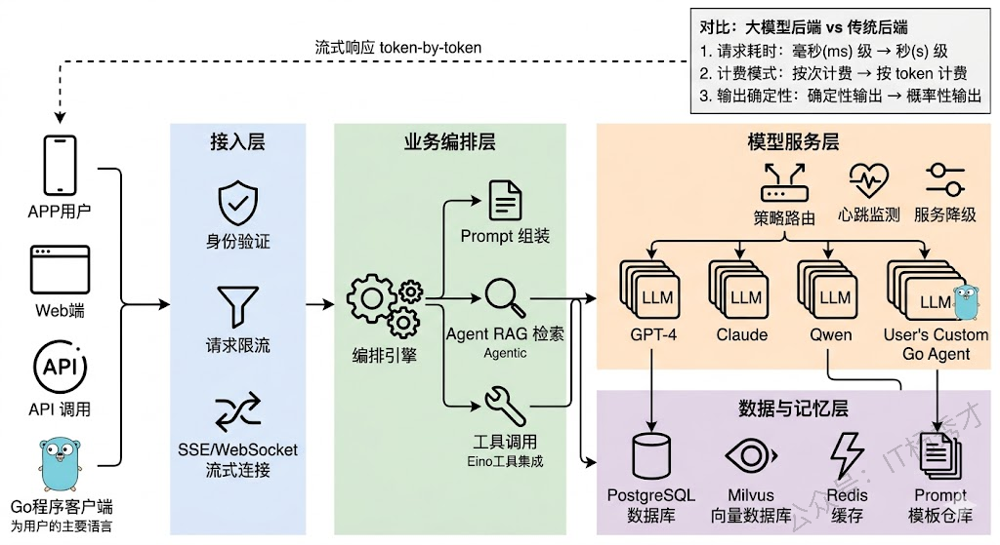
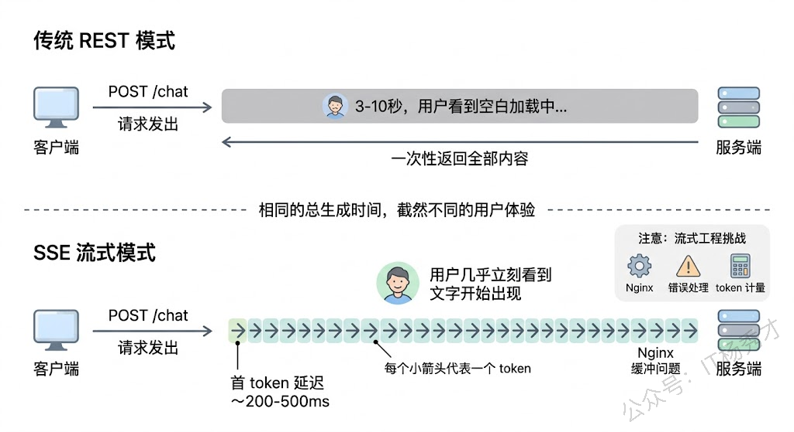
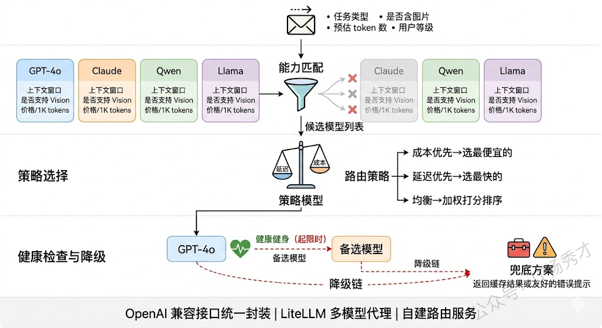
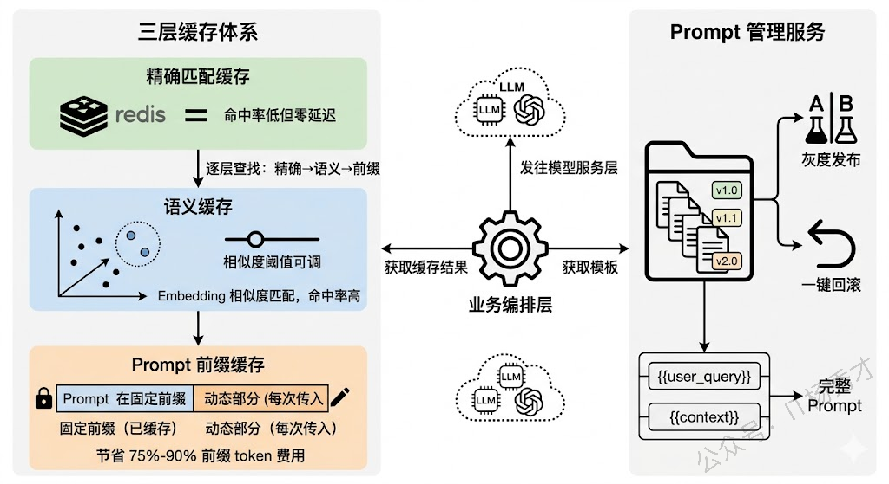
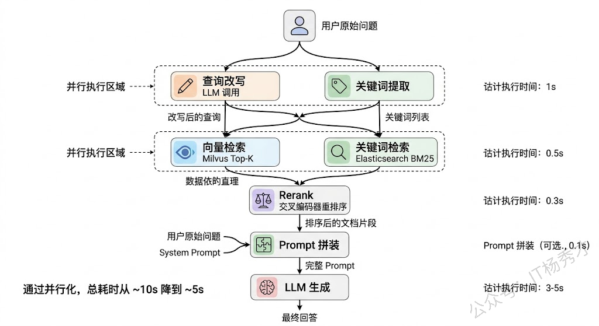
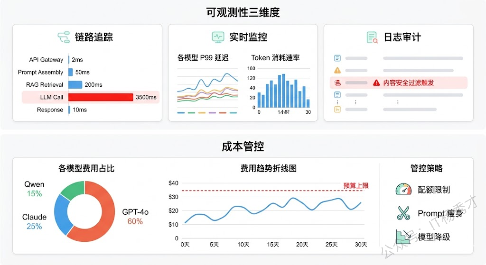

## **1. 题目分析**

传统 Web 后端的核心瓶颈通常在数据库——查询慢了加索引，并发高了加缓存，数据量大了分库分表，整套方法论经过十几年的打磨已经非常成熟。但当你把 LLM 引入后端架构的那一刻，这些规则就变了。一个普通的数据库查询耗时毫秒级，一次 LLM 调用动辄几秒甚至十几秒；数据库查询按次计费几乎可以忽略不计，LLM 调用按 token 收费，一个活跃用户一天的对话成本可能就是几毛到几块钱；最关键的是，数据库查询是确定性的，同样的 SQL 永远返回同样的结果，而 LLM 的输出每次都可能不同。**慢、贵、不确定**——就是后端架构设计必须要考虑的三大核心因素

### **1.1 整体分层与请求流转**

先说大的框架。一个生产级的大模型应用后端，从外到内通常可以分成四层：**接入层**负责协议处理、认证鉴权和流量控制；**业务编排层**负责理解用户意图、组装 Prompt、编排多步调用逻辑；**模型服务层**负责管理和调用各种 LLM，做路由、负载均衡和容错降级；**数据与记忆层**负责对话历史、向量检索、用户画像等持久化存储。

这四层的划分看起来和传统微服务架构差不多，但每一层内部的设计重心完全不同。传统后端的接入层主要关心的是鉴权和限流，大模型应用的接入层还要处理 SSE 长连接和流式传输；传统后端的业务层通常是"接收请求→查数据库→返回结果"这种同步短链路，大模型应用的业务层可能需要编排多轮 LLM 调用、工具调用、RAG 检索，整个链路又长又慢；传统后端的数据层主要是关系型数据库，大模型应用的数据层还要加上向量数据库、会话缓存、Prompt 模板库等一系列新组件。

### **1.2 流式响应**

在传统 REST API 中，客户端发一个请求，服务端处理完毕后一次性返回完整响应，整个过程可能只需要几十毫秒，用户几乎感知不到等待。但大模型应用完全不是这个节奏——一次 LLM 调用可能需要 3-10 秒才能生成完整回复，如果是复杂的 Agent 任务甚至需要几十秒。让用户干等这么久，体验会非常糟糕。

所以大模型后端架构必须把**流式响应**作为一等公民来设计，而不是事后补丁。实现方案主要是 SSE（Server-Sent Events）或 WebSocket。SSE 更适合单向推送场景（服务端向客户端逐 token 输出），实现简单且天然兼容 HTTP 协议；WebSocket 适合需要双向通信的场景，比如用户在生成过程中发送"停止生成"指令。

但流式传输带来的工程复杂度不小。**中间件兼容性**是第一个坑——Nginx 默认会缓冲后端响应再一次性发给客户端，你必须显式关掉 `proxy_buffering` 才能实现真正的流式传输，很多 API 网关和 WAF 也有类似的缓冲问题。**错误处理的时机**也变了——流式场景下 HTTP 200 已经发出去了，中间出错没法改状态码，只能在流中插入错误事件让前端处理。还有 **token 计量**——流式输出时需要在服务端准确统计每次调用的 token 消耗，这涉及到流的拦截和计数。

工程上比较成熟的做法是建一个**流式代理网关**，专门负责维护长连接、做流的中继转发、附加 token 统计元数据、处理超时和异常中断，把流的复杂性封装在一层里。

### **1.3 模型服务层**

模型服务层是整个架构中技术含量最高的一层，因为它要直接面对 LLM 的"慢、贵、不确定"三大特性。

**多模型路由与降级**是这一层最核心的设计。生产环境中几乎不会只用一个模型——你可能用 GPT-4o 做复杂推理、用 Claude 做长文档理解、用开源的 Qwen 做一些简单的分类和提取任务。这就需要一个模型路由器，根据任务类型、复杂度、成本预算等条件把请求分发到合适的模型。更重要的是降级策略：当首选模型 API 超时或返回错误时，系统应该自动 fallback 到备选模型，而不是直接报错给用户。一个典型的降级链可能是 GPT-4o → Claude → Qwen，越往后模型能力可能稍弱但可用性更高。

实现上，路由器通常维护一张**模型能力矩阵**——记录每个模型的上下文窗口、支持的功能（Function Calling、Vision 等）、平均延迟、每千 token 价格和当前健康状态。路由决策可以基于规则（"含图片的请求只发给支持 Vision 的模型"），也可以基于策略（"优先选延迟最低的健康模型，成本超阈值时降级"）。

**并发与队列管理**同样关键。LLM API 通常有严格的 Rate Limit，系统并发量大时必须在这一层做请求排队和令牌桶限速。对于自部署的开源模型，还需要做 Dynamic Batching 来提高 GPU 利用率，vLLM 和 TGI 在这方面做了很多优化。

### **1.4 缓存策略**

缓存在传统后端是锦上添花，在大模型后端是必须有的基础设施。原因很直接：LLM 调用既慢又贵，如果同样的问题能从缓存中直接返回，省下的时间和成本非常可观。

最直接的是**精确匹配缓存**——把用户输入的 hash 作为 key，LLM 的响应作为 value 存入 Redis。完全相同的问题直接命中缓存，延迟从几秒降到几毫秒。但这种方案的命中率通常很低，因为自然语言表达的多样性意味着同一个意思有无数种问法，"Python 怎么读取 JSON 文件"和"用 Python 解析 JSON 文件的方法"虽然语义相同但 hash 完全不同。

所以更实用的是**语义缓存（Semantic Cache）**。核心思路是把用户输入转成 Embedding 向量，在缓存中做向量相似度检索，相似度超过阈值就直接返回缓存结果。GPTCache 就是专门做这个的开源方案。语义缓存的命中率远高于精确匹配，但相似度阈值需要根据业务场景调优——设太高命中率低，设太低可能返回不太相关的结果。

还有一层容易被忽视的缓存是 **Prompt 模板缓存**。在实际项目中，System Prompt 和 Few-shot 示例通常是固定的，每次请求都带上这些固定前缀会浪费大量 token。OpenAI 的 Prompt Caching 和 Anthropic 的 Cache Control 机制就是针对这个场景——把 Prompt 的固定前缀缓存在模型服务端，后续请求只需传增量部分，既减少了网络传输量也降低了 token 费用（缓存命中的 token 价格通常是原价的 10%-25%）。

### **1.5 Prompt 管理**

Prompt 在大模型应用中的角色，相当于传统应用中的业务逻辑代码——它直接决定了应用的行为和输出质量。但很多团队在早期会犯一个错误：把 Prompt 硬编码在代码里，和业务逻辑混在一起。这在原型阶段没问题，但一旦进入生产环境就会遇到各种麻烦。

问题一是**迭代效率低**——Prompt 的调优频率远高于代码，你可能每天都要微调措辞、补充示例，如果写在代码里每次都要走完整的发布流程，太重了。问题二是**版本管理和回滚**——Prompt 改了一版效果变差想回滚，如果和代码绑定就会影响同次发布的其他功能。

所以生产环境中通常会建一个独立的 **Prompt 管理服务**，本质上是一个带版本控制的模板仓库，支持灰度发布（10% 流量走新 Prompt）和快速回滚。模板通过变量占位符（`{{user_query}}`、`{{context}}`）和业务数据做动态拼装。LangFuse 和 PromptLayer 都提供了这种能力。

### **1.6 异步与任务编排**

传统 Web API 绝大部分请求可以在几百毫秒内同步返回，但大模型应用中有大量"重任务"——比如基于 RAG 的长文档问答（需要先检索、再拼装、再调用 LLM）、多步 Agent 任务（可能涉及十几次工具调用和 LLM 推理）、批量内容生成等。这些任务的耗时可能从十几秒到几分钟不等，用同步 HTTP 请求来承载显然不合适。

成熟的做法是把重任务走**异步任务队列**——用户提交后立即返回 task\_id，后台 Worker 异步执行，前端通过轮询或 WebSocket 接收进度推送。Celery + Redis 是 Python 生态最常用的方案。

异步任务内部还需要一个**编排引擎**来协调多步骤的执行。比如一个 RAG 问答流程：先并行执行"查询改写"和"关键词提取"，完成后再并行做"向量检索"和"关键词检索"，汇总后 Rerank，最后送入 LLM 生成回答。这里面有串行有并行，步骤之间有数据依赖。LangGraph 用有向图来定义这种编排逻辑，每个节点是一个处理步骤，边定义数据流向和条件分支，比较适合这种场景。

### **1.7 可观测性与成本管控**

大模型应用的可观测性需求比传统后端复杂得多。传统后端主要关心 QPS、延迟、错误率这些指标，大模型后端除了这些之外还需要追踪：每次 LLM 调用的 token 消耗（input tokens + output tokens）、Prompt 的完整内容和模型的完整输出（用于质量审计和问题复盘）、缓存命中率、模型路由命中分布等。

一个完善的可观测性体系通常包含三个维度。**链路追踪（Tracing）** 记录每个请求从接入到返回的完整调用链，特别是 LLM 调用链路——哪个模型、什么 Prompt、返回了什么、耗时多久、花了多少 token。LangSmith 和 LangFuse 都提供了这种 LLM 原生的 Tracing 能力。**实时监控（Metrics）** 聚焦系统层面的健康指标——各模型的 P99 延迟、错误率、token 消耗速率、队列积压深度等，通常接入 Prometheus + Grafana。**日志审计（Logging）** 侧重合规和安全——记录敏感操作、异常输出、触发内容安全过滤的请求等。

成本管控是大模型后端运营中最现实的问题。没有做好成本管控的团队，往往上线一两个月后才发现 LLM 调用费用远超预算。管控手段包括：按用户/租户设置**每日 token 配额**，超出后降级到更便宜的模型或限制调用频率；建立**成本看板**，按模型、功能模块、用户分组统计 token 消耗和费用；定期做**Prompt 瘦身**，去掉冗余的指令和示例来减少每次调用的 token 数。

### **1.8 安全与合规**

这一块在面试中提一嘴会是很好的加分项。大模型应用面临一些传统后端不存在的安全风险：**Prompt 注入**（用户通过精心构造的输入试图覆盖 System Prompt 的指令）、**数据泄露**（模型在回答中无意间暴露训练数据或其他用户的对话内容）、**有害内容生成**（模型输出涉及暴力、色情、歧视等内容）。

应对措施包括：在接入层做输入过滤，检测和拦截已知的 Prompt 注入模式；在输出侧接入内容安全审核（可以用专门的审核模型或规则引擎）；对 RAG 检索结果做权限控制，确保用户只能检索到自己有权限访问的文档；对对话历史做脱敏处理后再用于模型调优或数据分析。

***

## **2. 参考回答**

我设计大模型应用后端的出发点，是 LLM 和传统服务的三个本质差异：调用慢、按 token 计费、输出不确定。整体上我会分四层——接入层做鉴权限流和 SSE 流式管理，业务编排层负责 Prompt 拼装和多步任务编排，模型服务层做多模型路由和降级，数据层涵盖向量库、会话缓存和 Prompt 模板库。

几个设计重点：流式响应必须一开始就设计好，LLM 生成太慢不做流式体验不可接受；模型服务层要有路由器维护能力矩阵，根据任务类型做路由，同时设计降级链保证可用性；缓存做三层——精确匹配、语义缓存、Prompt 前缀缓存，叠加下来成本能省不少；复杂的 Agent 和 RAG 流程走异步队列加 DAG 编排，把可并行的步骤并行化降低延迟。最后是可观测性和成本管控，用 LangFuse 追踪 LLM 调用链路，配合 token 配额和成本看板控制预算。核心思路就是针对 LLM 的慢、贵、不确定，在每一层做针对性设计。

## **学习交流**

> 如果您觉得文章有帮助，可以关注下秀才的<strong style="color: red;">公众号：IT杨秀才</strong>，后续更多优质的文章都会在公众号第一时间发布，不一定会及时同步到网站。点个关注👇，优质内容不错过

🔥 配套实战项目，拆得开、跑得起、能写进简历

多 Agent 编排 + RAG 混合检索 · 31 篇深度教程 + 50+ 面试题

<a href="/projects/dev-support.html" style="display: inline-block; margin-top: 14px; background: #ff7a18; color: #fff; font-size: 18px; font-weight: bold; padding: 10px 28px; border-radius: 24px; text-decoration: none;">点击查看 DevSupport AI 实战项目 →</a>

