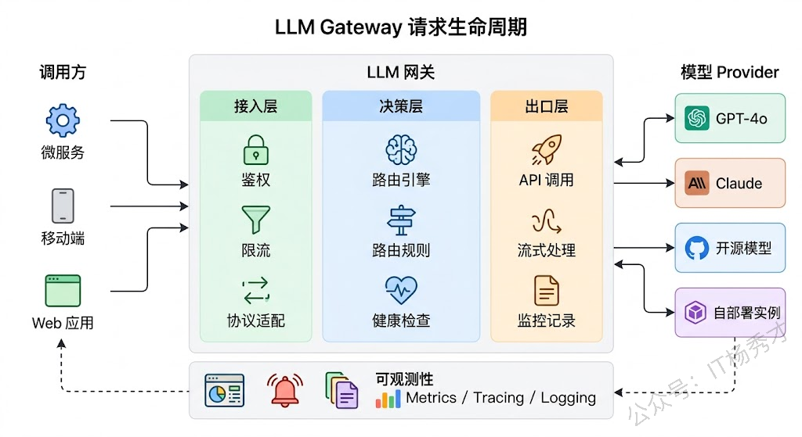
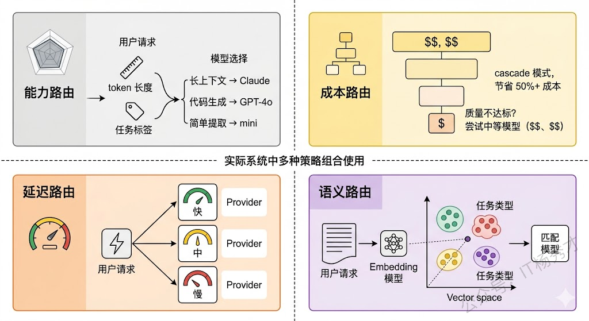
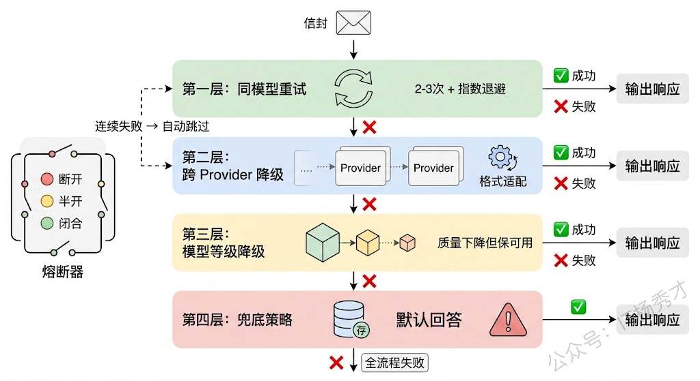
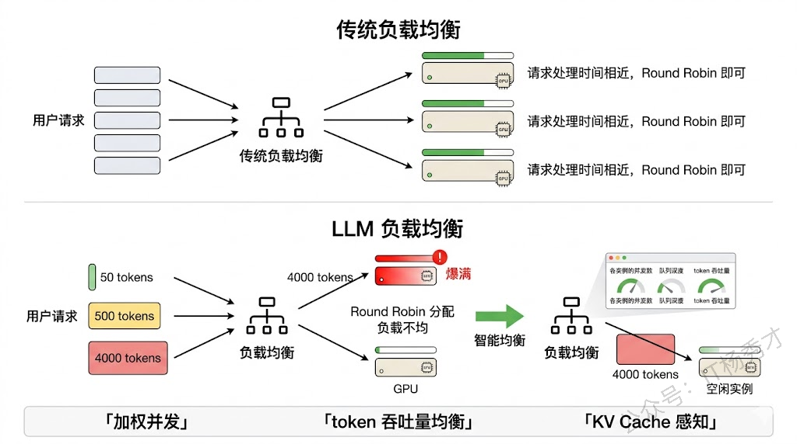
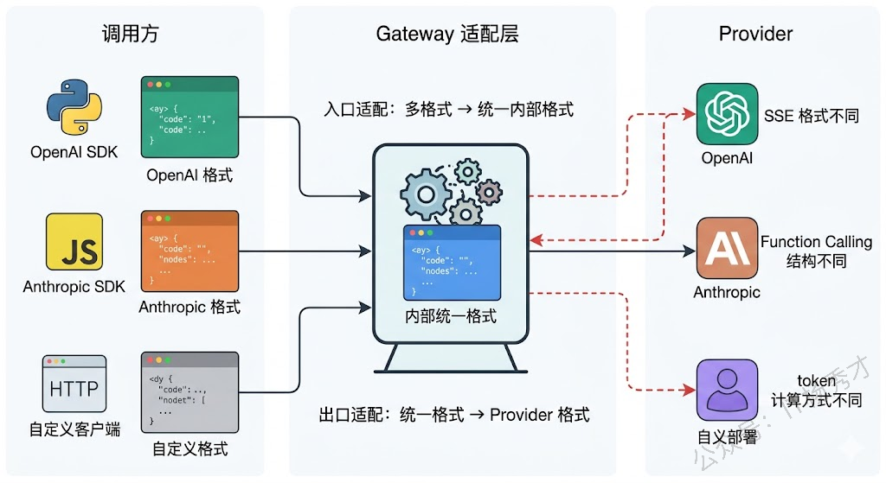
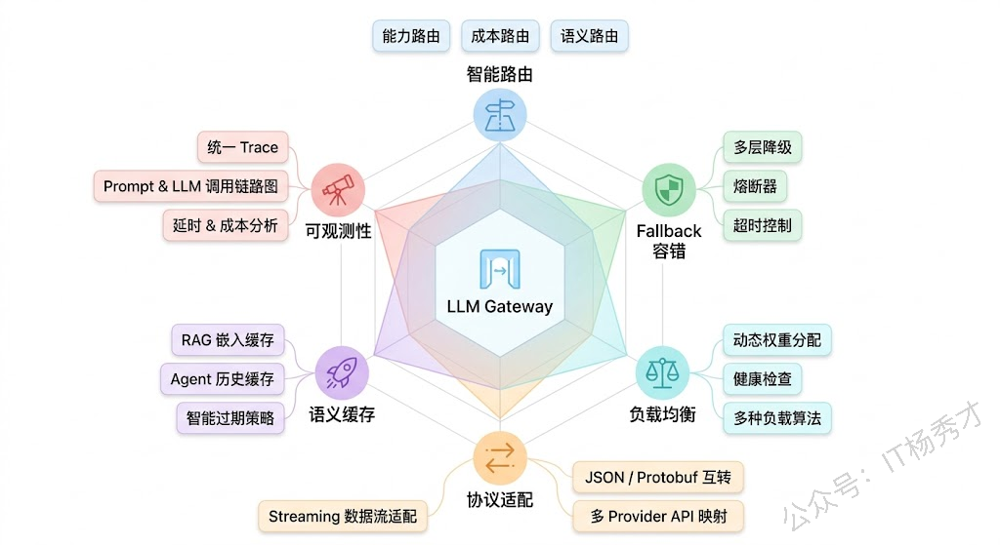

## **1. 题目分析**

当你的系统只调用一个模型、一个 Provider 的时候，一切看起来都很简单——拼好 Prompt，发个 HTTP 请求，拿到结果。但当业务做大以后，你会发现自己同时在用 GPT-4o 处理复杂推理、用 Claude 做长文档分析、用开源模型跑一些对延迟敏感的轻量任务，还可能在不同云厂商之间部署了多个推理实例。每个调用方都在各自的代码里硬编码模型名称和 API Key，散落在几十个微服务中。某天 OpenAI 突然限流了，整条链路直接挂掉，排查半天才发现是某个服务没做降级。

这就是 LLM Gateway 要解决的问题。它的角色类似于传统微服务架构中的 API Gateway，但面对的是大模型调用这个特殊场景。所有模型调用都经过这一层统一的中间件，由它来决定"这个请求该发给谁、发失败了怎么办、多个实例之间怎么分配流量"。

在回答这道题的时候，不要只是简单的列出"路由、fallback、负载均衡"这三个词然后各说两句，而是要把整个系统从架构到细节完整地想清楚——请求从进来到出去的完整链路是什么样的，路由决策背后的考量有哪些，fallback 不是简单重试那么直白，负载均衡在 LLM 场景下和传统场景有什么本质不同，这样才能体现出深度。

### **1.1 整体架构**

一个生产级的 LLM Gateway 大致分为三层：接入层、决策层、出口层。

接入层负责接收上游的调用请求，做协议适配和参数规范化。因为不同调用方可能用的是不同的 SDK 格式（有人按 OpenAI 格式发请求，有人按 Anthropic 格式），接入层要把这些统一成内部标准格式。同时在这一层完成鉴权、限流、配额检查这些基础网关职责。

决策层是整个 Gateway 的核心大脑。它拿到一个标准化的请求之后，要做出几个关键决策：这个请求该路由给哪个模型？如果首选模型不可用，fallback 链路是什么？当前各实例的负载情况如何，该发给哪个实例？这些决策依赖一套路由规则引擎和实时的模型健康状态数据。

出口层负责把决策结果执行到底——向目标模型 Provider 发起实际的 API 调用，处理流式响应（Streaming SSE），做响应格式的反向转换（把不同 Provider 的返回统一成标准格式给调用方），以及记录整个调用链路的日志和指标。

### **1.2 路由策略**

路由是 Gateway 最有技术含量的部分，因为 LLM 调用的路由远比传统 API 网关复杂。传统网关通常按 URL path 或 header 来做路由，规则非常确定。但 LLM Gateway 的路由决策需要综合考虑多个维度，而且这些维度之间经常存在 trade-off。

**基于能力的路由**是最基础的一层。不同模型擅长的事情不同：GPT-4o 在复杂推理和代码生成上表现很好，Claude 在长上下文处理和指令遵循上有优势，轻量级模型如 GPT-4o-mini 在简单分类、提取等任务上性价比极高。Gateway 可以根据请求中携带的任务类型标签，或者根据输入的 token 长度来判断——比如上下文超过 100K tokens 的请求自动路由到支持长上下文的模型。

**基于成本的路由**是生产环境中非常现实的考量。不同模型的价格差距可以达到 10 倍甚至 100 倍。一个聪明的做法是实现"分级路由"：先用便宜的小模型尝试处理，如果小模型的输出质量不达标（通过置信度评分或规则检查判断），再升级到大模型。这种模式在业界叫 "cascade routing" 或者 "model cascade"，实际能节省 50% 以上的调用成本。

**基于延迟的路由**在实时交互场景中特别重要。不同 Provider 在不同时间段的响应延迟可能差异很大，Gateway 可以维护一个各 Provider 的实时延迟统计（用滑动窗口平均值或 P95），把对延迟敏感的请求优先路由到当前响应最快的 Provider。

还有一种越来越常见的做法是**语义路由**（Semantic Router）。它不是靠人工定义规则来判断请求类型，而是用一个轻量级的 Embedding 模型把请求内容向量化，然后和预定义的任务类别向量做相似度匹配，自动判断这个请求属于什么类型、该路由给哪个模型。这种方式的好处是不需要调用方显式指定任务类型，对调用方完全透明。

### **1.3 Fallback 机制**

很多人对 fallback 的理解停留在"调用失败了就重试一次，或者换个模型再试"。但在生产级系统中，fallback 的设计远比这复杂，它本质上是一套多层次的容错体系。

第一层是**同模型重试**。请求失败后，在同一个 Provider 上重试，但要注意几个细节：重试次数不能太多（通常 2-3 次），需要加指数退避（exponential backoff）避免雪崩，而且要区分失败类型——超时和 429 限流可以重试，但 400 参数错误重试一百次也不会好。

第二层是**跨 Provider 降级**。同模型重试都失败后，切换到备用 Provider。这里的难点在于不同 Provider 的 API 格式不同、能力不同。Gateway 需要维护一个预定义的降级链，比如 "GPT-4o → Claude Sonnet → 自部署 Llama"。切换时，Gateway 要在出口层做请求格式的适配转换，把 OpenAI 格式的请求转成 Anthropic 格式，对调用方完全无感。

第三层是**跨模型等级降级**。如果高端模型全都不可用或者排队太长，可以降级到低一级的模型——比如 GPT-4o 不可用就降级到 GPT-4o-mini。虽然输出质量会下降，但至少保证了服务可用性。这种降级通常需要业务方预先确认哪些场景允许降级、降级到什么程度。

第四层是**兜底策略**。所有模型都不可用时的最后防线——返回缓存的历史结果、返回预设的默认回答、或者优雅地告知用户"当前服务繁忙"。

把这四层串起来，fallback 的完整链路大致是：同模型重试（带退避）→ 跨 Provider 切换 → 降级到小模型 → 兜底返回。每一层之间需要设置合理的超时阈值，避免用户等太久。

还有一个关键组件是**熔断器**（Circuit Breaker）。当某个 Provider 在短时间内连续失败达到阈值时，熔断器会"断开"，后续请求直接跳过这个 Provider 走降级链路，不再浪费时间去尝试一个大概率会失败的调用。过一段时间后，熔断器会进入"半开"状态，放少量请求去探测 Provider 是否恢复。这个模式在微服务架构中已经很成熟，但在 LLM Gateway 中需要针对模型调用的特点做一些调整——比如 LLM 调用的正常延迟本身就比较高（几秒到十几秒），所以超时阈值的设定要比传统微服务宽松。

### **1.4 LLM 场景下的负载均衡**

传统负载均衡（Round Robin、Least Connections）在 LLM 场景下会遇到一些独特的问题。

最核心的区别是：**LLM 请求的处理时间差异极大**。一个生成 50 tokens 的请求可能 1 秒就完成了，一个生成 4000 tokens 的请求可能要 30 秒。如果用简单的 Round Robin，可能把几个长请求都分到同一个实例上，导致它排队严重，而其他实例却很空闲。

所以 LLM Gateway 的负载均衡需要更"聪明"的策略。一种做法是**加权负载均衡**，权重综合考虑实例当前的并发请求数、队列深度、以及预估的处理时长（可以根据输入 token 数粗略估算）。另一种更精细的做法是**基于 token 吞吐量的均衡**——不再按请求数来均衡，而是按 token 处理量来均衡，让每个实例处理的总 token 数大致相当。

对于自部署的模型（比如用 vLLM 部署的开源模型），Gateway 还可以感知推理引擎的内部状态，比如 KV Cache 的占用率、当前 batch 的大小等，用这些更底层的指标来做负载决策。

跨区域部署的场景下还需要考虑**就近路由**——优先把请求发给物理距离近的实例，减少网络延迟。但这要和实例负载做平衡：如果最近的实例已经满载，宁可绕远路发给一个空闲实例。

### **1.5 统一接口与协议适配**

一个好的 LLM Gateway 应该对调用方暴露统一的 API 接口，屏蔽掉后端不同 Provider 的协议差异。这件事听起来简单，做起来有很多细节。

最常见的做法是以 OpenAI 的 API 格式作为事实标准（因为生态最大，大多数开发者最熟悉），Gateway 对外提供兼容 OpenAI 的 `/v1/chat/completions` 接口，内部再做格式转换。调用方只需要把 base\_url 指向 Gateway，完全不需要关心后面是哪个模型在处理。

但不同 Provider 之间的差异不仅是 JSON 字段名不同那么表面。Streaming 的实现方式不同（SSE 的事件格式有差异）、Function Calling 的参数结构不同、token 计算方式不同、错误码体系不同、甚至一些高级特性（比如 Anthropic 的 prompt caching、OpenAI 的 structured output）是某个 Provider 独有的。Gateway 需要在协议适配层处理这些差异，把它们统一成一致的行为，或者通过扩展字段让调用方选择性地使用某些 Provider 特有的能力。

### **1.6 缓存与可观测性**

生产级的 LLM Gateway 还需要两个不可或缺的能力。

**语义缓存**（Semantic Cache）可以大幅降低成本和延迟。和传统的精确匹配缓存不同，LLM 场景下用户的表述方式千变万化，"北京今天天气怎么样"和"今天北京的天气如何"是同一个意思。语义缓存的做法是把请求做 Embedding，在向量数据库中查找相似度超过阈值的历史请求，如果命中就直接返回缓存结果。GPTCache 是这个方向上比较成熟的开源方案。当然，语义缓存有时效性和精度的问题——你不能缓存"今天天气"的结果长期使用，对于需要创造性或个性化的请求也不适合缓存。

**可观测性**是运维的基础。Gateway 是所有 LLM 调用的必经之路，天然就是最好的监控数据采集点。核心指标包括：各 Provider 的调用成功率、P50/P95/P99 延迟、token 消耗量和成本、各路由策略的命中率、fallback 触发频率和原因分布。这些数据不仅用于运维告警，还能反过来优化路由策略——比如某个 Provider 的延迟持续升高，Gateway 可以自动降低它的路由权重。

### **1.7 开源方案**

简单提几个主流的开源 LLM Gateway 方案供参考。**LiteLLM** 是目前最流行的开源选择，用 Python 实现，支持 100+ 模型 Provider，核心卖点是统一的 OpenAI 兼容接口，内置了 fallback、负载均衡和成本追踪。**RouteLLM** 由 LMSys 团队开源，专注于智能路由——它训练了一个轻量级的路由模型来判断每个请求该用强模型还是弱模型，在保持输出质量的前提下节省成本。**Portkey** 的 AI Gateway 则更偏企业级，提供了完善的可观测性、缓存、请求重试等能力。选型时主要看团队的需求侧重：如果只是想快速统一多 Provider 的接口，LiteLLM 几行代码就能搞定；如果想做智能的成本优化路由，RouteLLM 的路由模型方案值得看；如果需要生产级的可观测性和管控能力，Portkey 更合适。

***

## **2. 参考回答**

LLM Gateway 本质上是大模型调用场景下的 API 网关，所有模型调用都经过这一层统一管控。从架构上看，我会分为接入层、决策层和出口层三部分。接入层做协议适配和鉴权限流，把不同格式的请求统一成内部标准格式；决策层是核心，负责路由决策、fallback 编排和负载分配；出口层负责实际调用和响应转换。

路由策略上，实际项目中我们通常组合使用多种维度：基于能力的路由让不同类型的任务去到最合适的模型，基于成本的 cascade 路由先用小模型尝试、不行再升级到大模型，这套机制能节省一半以上的调用费用。延迟敏感的场景还会结合实时延迟统计做动态选择。更高级一点可以用语义路由，通过 Embedding 自动识别请求类型，对调用方完全透明。

Fallback 不是简单的重试，我会设计成四层瀑布结构：同模型重试带指数退避、跨 Provider 切换配合格式适配、降级到小模型保可用性、最后才是兜底策略。同时引入熔断器机制，某个 Provider 连续失败就自动跳过，避免无效等待。这里要注意区分错误类型，429 限流值得重试，400 参数错误就不该重试。

负载均衡方面，LLM 和传统服务最大的区别是请求处理时间差异极大，50 tokens 和 4000 tokens 的请求耗时可能差几十倍，所以简单的 Round Robin 不行，需要基于并发数、队列深度、甚至 token 吞吐量来做加权均衡。工程上我们用 LiteLLM 作为基础来快速支持多 Provider 统一接口，在上面加了语义缓存降低重复调用成本，以及完整的 metrics 体系来驱动路由策略的持续优化。

## **学习交流**

> 如果您觉得文章有帮助，可以关注下秀才的<strong style="color: red;">公众号：IT杨秀才</strong>，后续更多优质的文章都会在公众号第一时间发布，不一定会及时同步到网站。点个关注👇，优质内容不错过

