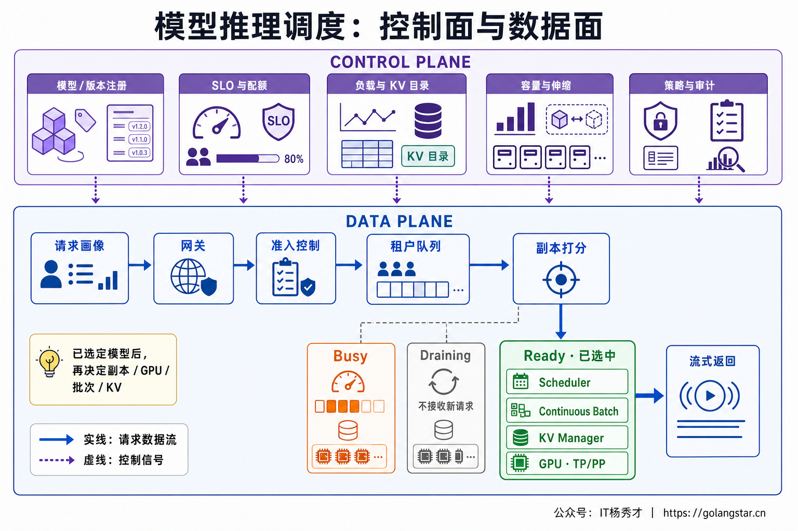
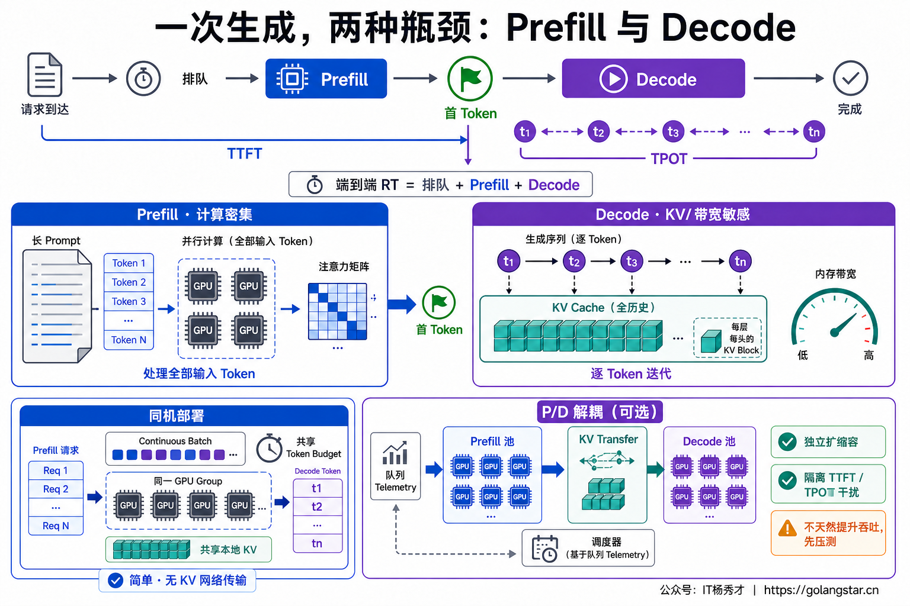
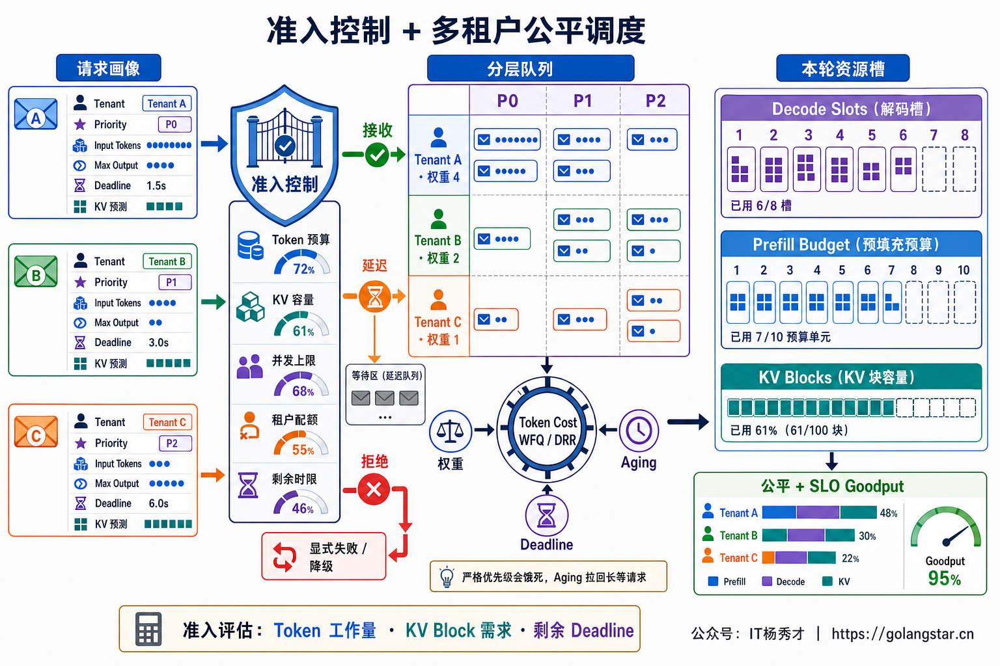
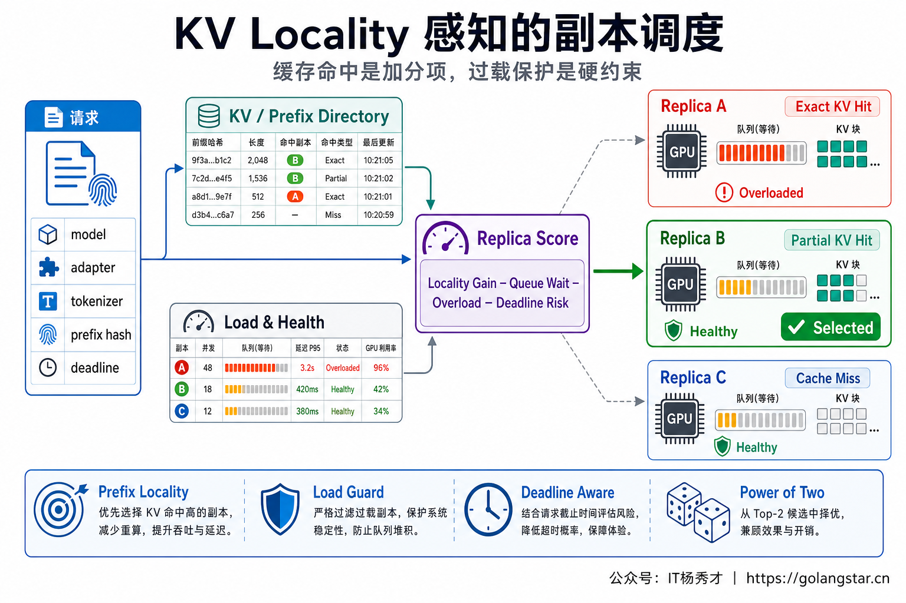
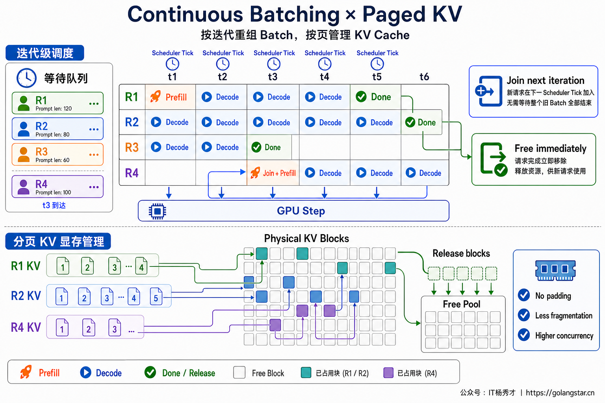
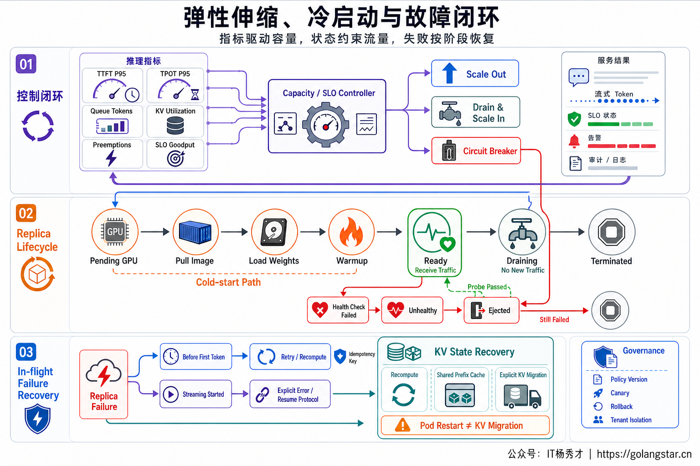

## **1. 题目分析**

两张同型号 GPU 的利用率都显示 60%，实际体验却可能完全不同：一张卡正在处理几个超长 Prompt 的 Prefill，后面的请求迟迟拿不到首 Token；另一张卡跑的是短上下文 Decode，虽然并发数更多，Token 仍在稳定输出。若调度器只按请求数做 Round Robin，这两张卡会被判断为同样繁忙，最终得到的却是完全不同的 TTFT 和 P99。

这正是大模型调度与传统 Web 负载均衡的区别。LLM 请求不是一次执行完的等价任务，而是一段长度未知、持续占用 KV Cache、逐 Token 推进的有状态计算。生产级调度系统要解决的也不只是“发给哪台机器”，而是请求能否准入、进入哪条队列、落到哪个副本、每轮获得多少 Token 预算、显存不足时如何处理，以及扩缩容和故障期间怎样继续守住 SLO。

### **1.1 调度边界**

生产系统里经常把 Model Routing、Replica Routing 和 Engine Scheduling 混在一起。三者虽然都叫“路由或调度”，做的其实是三次不同的决策。

第一层是**模型选择**，根据任务能力、风险和成本决定使用哪个模型或 Provider。上一篇大小模型平衡讨论的就是这一层。第二层是**副本选择**，模型已经确定以后，从同一 Deployment 的多个推理副本中选出一个具体实例。第三层是**引擎内调度**，请求进入 vLLM、TensorRT-LLM 或其他推理引擎后，再决定何时进入 Running Batch、一次执行多少 Token、如何分配 KV Block，以及是否需要抢占其他序列。

架构上可以把它分成控制面和数据面。控制面维护 Model Registry、部署版本、GPU 拓扑、并行策略、期望副本数与扩缩容策略；数据面位于每次请求的热路径上，完成准入、排队、副本打分、Batch 调度和流式返回。控制面可以秒级或分钟级收敛，数据面的决策必须足够轻，不能为了挑一个副本又同步查询一串慢服务。

如果底层调用的是闭源模型 API，系统只能控制 Provider 端点、请求队列、配额和重试，无法干预对方内部的 GPU Batch 与 KV Cache；只有自部署模型才能把调度下钻到 Token 和显存块。面试回答先说明这条边界，后面的方案才不会把两个完全不同的系统揉在一起。



### **1.2 请求画像**

调度器不能把请求只抽象成一个连接。一次生成可以拆成 Prefill 和 Decode 两个阶段：Prefill 并行处理全部输入 Token，通常更吃矩阵计算；Decode 每轮只生成少量新 Token，却要反复读取模型权重和不断增长的 KV Cache，通常更受显存容量与带宽影响。长输入短输出、短输入长输出和多轮共享前缀的请求，对资源的压力完全不同。

端到端延迟可以粗略拆成：

```text
E2E RT = Queue Wait + Prefill + Decode
TTFT   = Queue Wait + Prefill + First Decode Step
Decode ≈ Output Tokens × TPOT
```

因此，原始 QPS 和平均 GPU 利用率都不足以描述容量。更有意义的目标是 **SLO Goodput**，也就是单位时间内同时满足 TTFT、TPOT 和成功率要求的完成请求数。吞吐量很高但一半请求超时，不能算调度成功。

请求进入系统时应生成一份轻量调度画像，至少包含 `model/adapter`、输入 Token 数、输出上限或估算值、租户、优先级、Deadline、会话或前缀摘要、模态类型和流式标记。输出长度无法精确预测，因此只能用历史分桶和保守预算估算，并在 Decode 过程中根据真实增长持续修正。调度决策要记录使用了哪些特征和策略版本，方便之后解释为何某个请求被排队、拒绝或迁移。



### **1.3 准入与公平**

请求在 GPU 前必须先经过 Admission Control。若所有流量都先塞进推理引擎，KV Cache 接近满载后会频繁抢占、重算或换出，吞吐和尾延迟一起抖动，最终比入口处有序拒绝更差。

准入判断应使用 Token 工作量和 KV 压力，而不是只数并发连接。系统可以把输入长度、输出预算、当前可用 KV Block、每轮 Token Budget、队列年龄和剩余 Deadline 合在一起，估算请求是否还有机会在 SLO 内完成。容量不足时要明确选择：低价值请求快速失败，批处理任务进入异步队列，可降级任务缩短输出或切换部署；不能让请求无界等待，最后在客户端超时以后仍占着 GPU 继续生成。

多租户场景还需要把“优先级”和“公平”分开。在线交互、离线批任务可以进入不同 Lane，避免一个超长批任务堵住所有短请求；租户之间可以按 Token 成本使用 Weighted Fair Queue 或 Deficit Round Robin，而不是按请求个数平均，因为一个 20K Token 请求与一个 200 Token 请求根本不是同一份工作量。高优先级允许更早执行，但要配合租户配额和 Aging，防止某个租户长期霸占资源，也防止低优先级任务永远饿死。

Deadline 不是简单的排序字段。预计排队时间已经超过剩余 Deadline 的请求，应在入口处拒绝或降级，避免浪费已经注定无法兑现的计算。对流式请求还要传播客户端取消信号，一旦连接断开，尽快从 Waiting Queue 和 Running Batch 中移除并释放 KV Block。



### **1.4 副本选择**

模型确定以后，最简单的做法是 Round Robin 或 Least Connections，但两者都看不见 LLM 的真实负载。一个副本可能只有两个请求，却各自带着很长的输入和输出；另一个副本有十个即将结束的短请求。仅按连接数选择，反而容易把新流量送到更慢的实例。

工程上通常先用 Power of Two Choices 作为低成本基线，再把比较指标换成推理特征。副本分数可以抽象为：

```text
Score(i) = w1 × Estimated Finish Time
         + w2 × Queued Token Work
         + w3 × KV Pressure
         + w4 × Cold / Adapter Penalty
         - w5 × Prefix Locality
```

其中，Estimated Finish Time 需要结合 Waiting Prefill Token、Active Decode Token 与近期实测速率；KV Pressure 反映显存块水位和可能发生的抢占；Cold Penalty 表示模型或 LoRA Adapter 尚未加载；Prefix Locality 则奖励已经持有相同 System Prompt、长文档或会话前缀 KV Cache 的副本。

Locality 不能变成硬粘滞。共享同一段精确 Token 前缀的请求持续落到一个副本，确实可以提升 Prefix Cache 命中，但该副本队列明显更长时仍要优先负载均衡。一个实用策略是：副本负载差异低于阈值时看前缀匹配，超过阈值就回退到负载策略。会话 Affinity、Adapter Locality 和 NUMA/节点拓扑也都应当是带上限的软偏好，而不是不顾健康状态的固定绑定。

Prefix Cache 还必须服从租户与权限边界。它复用的是**完全相同的 Token 前缀**，不是语义相似的文本；通常也只有已经填满的完整 Block 才能进入缓存，所以它只节省重复 Prefill，不会降低后续 Decode 成本。缓存键至少要绑定模型版本、Tokenizer、Prompt 模板、Adapter 和可信租户域。`cache_salt` 应由网关根据已认证的 Tenant 或 Trust Group 在服务端派生，不能允许客户端任意指定；它用于隔离缓存复用和时序侧信道，不能替代 ACL。路由器保存的前缀索引只是对引擎缓存状态的近似，真实 Block 可能已经被 LRU 淘汰，因此 Cache Hit 应作为打分信号而不是可用性承诺；实际 Miss 以后仍要回到正常 Prefill，不能让请求失败。



### **1.5 引擎内调度**

请求落到副本后，真正决定 GPU 利用率的是引擎 Scheduler。传统 Static Batching 会等一批请求全部结束再换下一批，短输出被长输出拖住，新的请求也无法及时加入。Continuous Batching 把调度粒度降到推理迭代：某个序列完成后立即释放位置，下一轮就可以把 Waiting Queue 中的新请求补进 Batch。

调度约束也不能只有 Batch Size。引擎通常同时限制每轮可处理的序列数、Token 数和可分配 KV Block。PagedAttention 让 KV Cache 以非连续 Block 管理，减少预留和碎片浪费，但它没有消除容量上限；Block 水位过高时，Scheduler 仍可能抢占低优先级序列，并在恢复时重算或从 CPU/外部缓存取回状态。频繁 Preemption 往往意味着准入或 `max_num_seqs`、`max_num_batched_tokens` 等预算配置不合理，不能把它当成正常扩容手段。

长 Prompt 的 Prefill 如果一次独占整轮计算，会让正在 Decode 的请求出现明显生成停顿。Chunked Prefill 把长 Prefill 切成受 Token Budget 约束的多个片段，与已有 Decode 序列交错执行。以当前 vLLM V1 为例，条件允许时会启用 Chunked Prefill：每轮先调度待运行的 Decode，再把剩余的 `max_num_batched_tokens` 预算给 Prefill，超出预算的 Prefill 才被切块。Chunk 太大，Decode 的 TPOT 容易抖动；Chunk 太小则可能增加调度和 Kernel 开销。这个参数没有通用答案，需要用真实的输入输出长度分布，分别观察 TTFT、TPOT 和吞吐量后确定。

调度策略本质上是在三件事之间取舍：尽快让新请求拿到首 Token、保证已有请求稳定出 Token、尽量把每轮 Batch 填满。只优化任何一个指标，都可能把代价转移到另外两个指标上。



### **1.6 部署与伸缩**

大多数场景可以先把 Prefill 和 Decode 放在同一个副本内，用 Continuous Batching 与 Chunked Prefill 控制干扰。只有长 Prompt 比例高、TTFT 与 TPOT SLO 都很紧，且两阶段干扰已经成为主要瓶颈时，才考虑 Prefill/Decode Disaggregation：Prefill Pool 负责处理输入并产生 KV Cache，再通过高速网络把 KV 状态交给 Decode Pool 继续生成。

分离以后，两类资源可以独立扩容和配置并行策略，Decode 也不再被突发长 Prefill 直接阻塞。但它会增加 KV 传输、跨节点网络、池间背压和故障恢复复杂度，**并不提高原始吞吐量**；当前 vLLM 也明确把该能力标为 Experimental，其价值主要是独立调优 TTFT 与 ITL、控制尾部抖动。论文在特定 SLO 下报告的 Goodput 或最大请求率，也不能直接解释成所有工作负载的 Raw Throughput 都更高。若互联带宽不足或输入不长，传输开销可能抵消收益。因此，是否分离应由 TTFT/TPOT SLO、流量长度分布和 KV 传输成本共同决定，而不是因为架构更新就默认采用。

控制面扩缩容也要使用推理指标。单看 CPU 或 GPU Utilization 不足以反映排队和 KV 压力，更合适的信号是 Oldest Queue Age、Waiting/Running Token、KV Cache Usage、TTFT/TPOT 违约率和 SLO Goodput。扩缩容控制环存在采样与决策滞后，模型权重加载、编译和 Kernel Warmup 又可能持续数十秒甚至更久，因此它不能替代入口准入。延迟敏感服务要保留 Warm Floor 与容量余量，提前拉取权重，并在流量到达前预热。缩容时先将副本标记为 Draining，停止接收新请求，等待活跃序列完成或按明确策略迁移，不能直接杀掉仍持有 KV 状态的 Pod。

多 GPU 或多节点模型还要把一个并行组视为完整 Replica。Tensor Parallel、Pipeline Parallel 或 Expert Parallel 的 Worker 必须成组放置，并考虑 NVLink、RDMA 和故障域；只看到集群还有几张空卡，不代表这些碎片资源足以启动一个可用副本。

活跃请求的迁移也不是普通 Pod 重调度。Replica 内存里保存着不断增长的 KV Cache，默认重启只会丢失这部分状态；真正的无中断迁移需要显式复制 KV、同步生成位置并完成连接切换，对网络和实现要求都很高。大多数系统应先采用“停止接流量、等待完成”的 Drain 策略，故障时再按请求幂等性选择重算，而不是把 Kubernetes 重建 Pod 误认为会自动续跑 Token。



### **1.7 故障与度量**

调度系统必须知道什么时候可以重试。目标副本在输出首 Token 前失败，请求仍在 Deadline 和 Retry Budget 内时，可以换健康副本重新执行；流式输出已经开始后，客户端可能收到了部分内容，代理层必须禁止静默自动重试，通常应显式结束本次流、返回可识别错误，再由上层决定是否从头重启。新的 Attempt 也不保证逐字一致，即使固定 Seed，也不能跨副本、版本和 Kernel 承诺确定性。对要触发外部副作用的 Agent 请求，推理重试还必须与业务幂等键分开治理。

线上指标至少要拆到三层。入口层看拒绝率、队列年龄、取消率和各租户获得的 Token 份额；副本层看负载倾斜、Prefix/Adapter 命中、冷启动与故障迁移；引擎层看 Batch Occupancy、Prefill/Decode Token Throughput、KV 水位、Eviction、Preemption、Queue Time、TTFT 和 TPOT。平均值会掩盖长 Prompt、长输出和热点租户造成的尾部问题，但也不能把 Tenant ID、Request ID 直接做成时序指标标签。输入输出长度、模型和优先级等有界维度用于指标分桶，Tenant ID 与 Request ID 进入 Trace 或 Log；租户维度只保留等级、套餐或 Top-N，避免监控系统被高基数拖垮。

上线前需要用真实流量回放长短请求混合、热点前缀、突发批任务和多轮会话，分别压出最大 SLO Goodput；上线时先 Shadow 记录副本决策，再 Canary 新调度策略，并演练 GPU 故障、队列爆满、KV Cache 高水位和扩容冷启动。调度策略的目标不是让 GPU 仪表盘永远显示 100%，而是在公平和容量约束下，让尽可能多的请求按时完成。

策略本身也要版本化。Admission 阈值、副本打分权重、Batch Token Budget、Chunk 大小和扩缩容水位必须和模型版本、硬件类型、流量基线一起记录。任何一个参数变化都可能同时改变 TTFT、TPOT 与公平性，必须经过同一套回放和灰度流程，不能在线直接改成一个看起来更高吞吐的数值。

***

## **2. 参考回答**

我会先把模型路由和推理调度分开。模型路由决定用哪个模型，调度是在模型已经选定以后，决定请求能否准入、落到哪个副本，以及在 GPU 上何时执行。入口会给请求补齐 input token、输出预算、tenant、priority、deadline、prefix hash 和 adapter 等调度特征，按预计 Token 工作量与 KV Block 做有界准入。在线和批任务分 Lane，多租户按 Token 成本做加权公平，预计已经无法满足 Deadline 的请求直接拒绝或降级，避免进入 GPU 后无效排队。

副本选择不会只用 Round Robin 或连接数，而会综合 Waiting/Running Token、预计完成时间、KV 水位、Prefix Cache 与 LoRA Locality、健康状态做打分；缓存亲和只在负载接近时生效，防止热点。副本内部用 Continuous Batching 和 Paged KV Block 按迭代调度，长 Prefill 做 Chunk，避免阻塞正在 Decode 的请求。长上下文流量高且 TTFT、TPOT 都很紧时，再评估 Prefill/Decode 分离并计算 KV 传输成本。扩缩容看 Queue Age、Token Backlog、KV Pressure 和 SLO 违约率，缩容先 Drain。最后通过 Queue Time、TTFT、TPOT、Preemption、Cache Hit 和每租户 Token 份额做压测与灰度闭环，目标是最大化满足 SLO 的 Goodput，而不是单纯追求 GPU 利用率。

如果线上出现 P95 抖动，我会先按输入长度和阶段拆开 Queue、Prefill、Decode，再看 KV 抢占、冷启动和副本负载倾斜，判断问题属于准入、放置还是引擎内预算。所有策略参数都要带版本、灰度与回滚，不能在线直接追求更高的 GPU 利用率。

<div style="background-color: #f0f9eb; padding: 10px 15px; border-radius: 4px; border-left: 5px solid #67c23a; margin: 20px 0; color:rgb(64, 147, 255);">

## <span style="color: #006400;">**学习交流**</span>
<span style="color:rgb(4, 4, 4);">
> 如果您觉得文章有帮助，可以关注下秀才的<strong style="color: red;">公众号：IT杨秀才</strong>，后续更多优质的文章都会在公众号第一时间发布，不一定会及时同步到网站。点个关注👇，优质内容不错过
</span>


<div style="text-align: center; margin-top: 22px; padding-top: 20px; border-top: 1px solid #c2e7b0;">
<div style="color: #006400; font-size: 20px; font-weight: bold;">🔥 配套实战项目，拆得开、跑得起、能写进简历</div>
<div style="color: red; font-size: 16px; font-weight: bold; margin-top: 8px;">多 Agent 编排 + RAG 混合检索 · 31 篇深度教程 + 50+ 面试题</div>
<a href="/projects/dev-support.html" style="display: inline-block; margin-top: 14px; background: #ff7a18; color: #fff; font-size: 18px; font-weight: bold; padding: 10px 28px; border-radius: 24px; text-decoration: none;">点击查看 DevSupport AI 实战项目 →</a>
</div>
</div>
