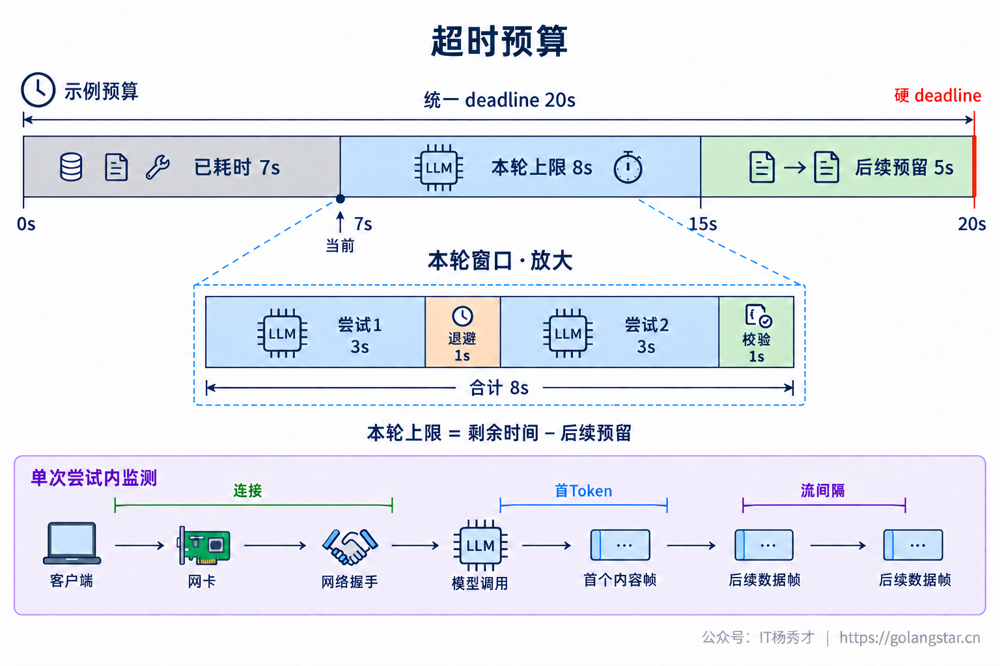
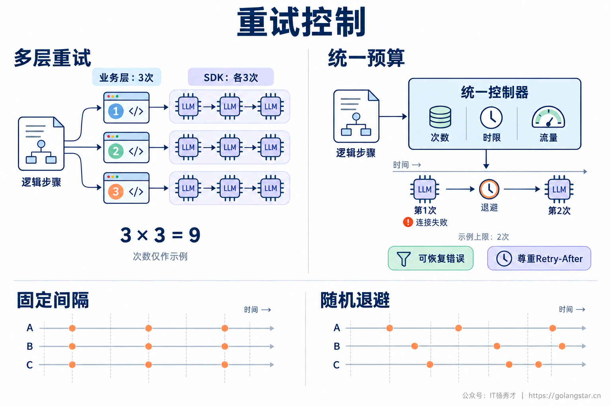
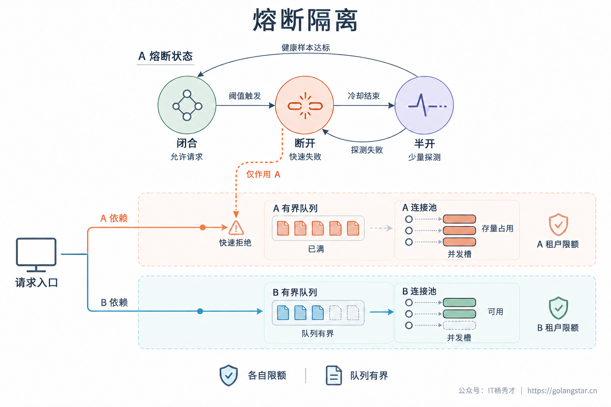
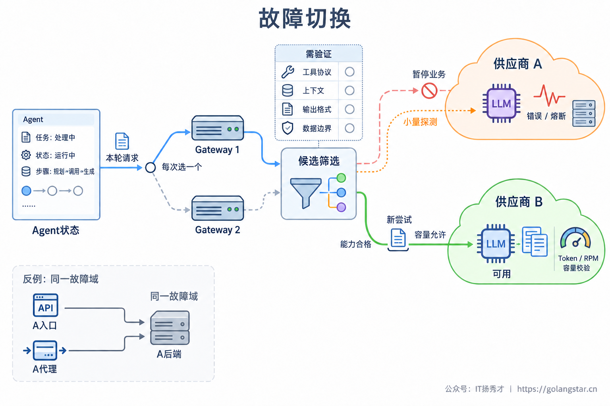
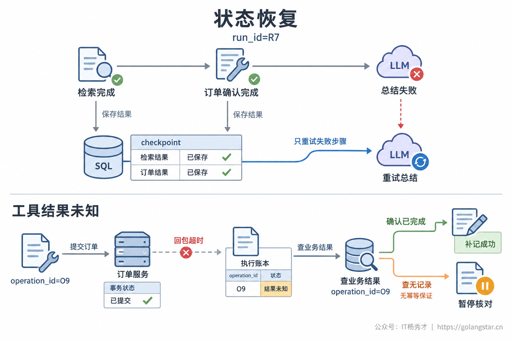
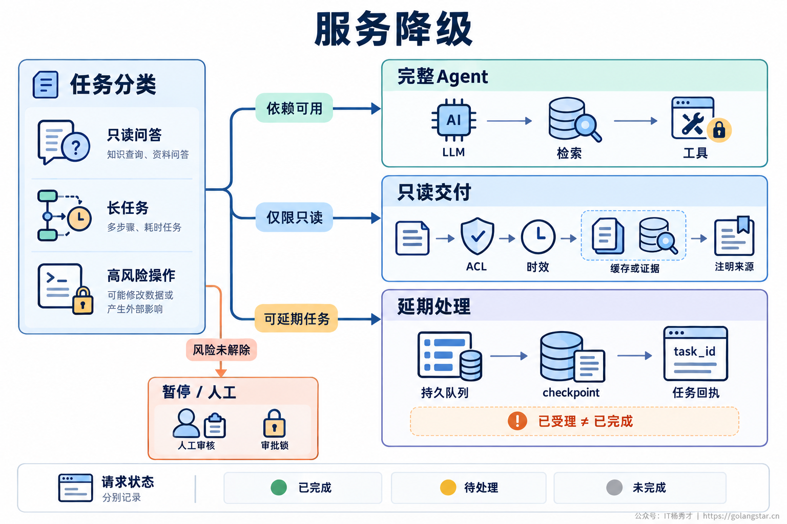

## **1. 题目分析**

订单已经创建成功，Agent 只差调用一次模型，把执行结果整理成回复。这时第三方 LLM 超时了。如果异常处理写在整个任务外面，一次重试就可能从头执行，用户等得更久，还多出一笔订单。

与此同时，其他请求也在等待同一个模型。连接迟迟不释放，新请求继续进入，业务层、网关和 SDK 各自重试。最初只是上游响应变慢，最后却变成自身连接池耗尽、队列积压和整站报错。

因此，这道题不能只回答“多重试几次，再换一个模型”。真正需要保证的是：**故障不会无限占用资源，不会传播到健康业务，已经完成的操作不会丢失或重复；无法继续时，也能给出真实、可恢复的任务状态。** 高可用是在明确服务目标下提高有效完成率，不是承诺外部依赖故障时所有任务仍然成功。

### **1.1 故障分级**

首先把失败归到正确的处理路径。连接中断、部分服务端错误可能是短暂故障；参数非法、凭据失效、权限不足则需要修正请求或配置。把它们都捕获成“模型调用失败”，后面就只能采取同一种错误的重试策略。

限流还要区分速率限制与额度耗尽。前者可能等待窗口恢复，后者通常不能靠几百毫秒退避解决。不能只凭 HTTP 429 就认定值得重试。例如 [Claude 错误文档](https://platform.claude.com/docs/en/api/errors)明确区分了速率限制与支出上限，并说明部分额度型 429 不带 `Retry-After`。工程上需要读取结构化错误类型、响应头和配额作用域，而不是只匹配报错字符串。

请求成功也不能只看状态码。流式接口可能先返回 200，随后在 SSE 中发送错误，或者连接直接断开。只有结束状态、内容完整性和业务校验都满足要求，本次模型步骤才算成功。拒答、输出截断和格式错误应独立分类，不能为了绕过拒答盲目切换供应商，也不能把业务校验失败都算成上游宕机。

在 Agent 与供应商之间设置统一调用层，将这些差异归一化，输出失败原因、可恢复性和建议等待时间。具体是否重试、切换或暂停，仍由工程策略结合剩余预算决定，不交给正在故障的模型临场判断。

### **1.2 超时预算**

每一层都配置超时，不代表总耗时就可控。一次模型调用最多等十秒，如果重试三次，再加排队与工具调用，用户实际等待可能远超预期。解决方法是在任务入口确定截止时间，后续步骤消耗同一份预算，重试和切换都不能重新开始计时。

本轮模型步骤可用时间等于剩余时间减去后续预留，单次尝试再受自身上限约束。假设总预算二十秒，前面已经耗时七秒，后续工具与收尾预留五秒，那么本轮最多使用八秒。图中两次尝试、退避和校验都在这八秒内，只是演示分配关系，不是推荐超时参数。

连接建立、首个有效 Token、流式数据间隔和请求总耗时还需要分别限制。连接正常但一直没有输出，与输出到一半停住，是两种不同的故障。心跳可以说明连接尚在，却不能无限延长任务截止时间；具体超时值应根据请求类型、输入规模和正常时延分布制定。

预算检查应发生在入队、出队和发起新尝试之前，已经没有完成机会的请求不再消耗下游容量。取消信号要传到本地调用任务，并释放连接与并发许可，但客户端取消不代表供应商已经停止计算，更不代表外部业务操作被撤销。容量评估还要考虑取消后可能仍在途的请求。长任务若允许脱离前端连接继续运行，需要拥有独立任务状态和截止时间。

### **1.3 重试控制**

重试只针对可恢复失败，并限制在失败的模型步骤内，不能包住整段包含写操作的 Agent 流程。重试次数、总耗时和额外流量需要一起受控；“最多重试两次”表示最多三次尝试，配置和监控必须统一这个口径。

更常见的问题是各层都认为自己的重试很克制。业务层最多三次尝试，SDK 内部又各做三次，底层就可能收到九次请求。[Google SRE 的级联故障分析](https://sre.google/sre-book/addressing-cascading-failures/)专门讨论了这种乘法放大。需要盘点 SDK、代理和业务层的默认行为，由一个明确层级统筹重试，或者显式分配同一份尝试预算。

等待采用带随机抖动的指数退避，避免大量请求在固定间隔后同时回来。有有效 `Retry-After` 时，遵守供应商的等待约定；若等待后已来不及完成，就切换到允许的替代路径或延期处理，不能把等待时间强行缩短后继续冲击原端点。

此外，按依赖设置重试流量预算。原始请求还能进入，不代表失败请求都能追加一次调用；重试、切换和探测都要计入调用量、Token 配额与成本。预算耗尽时停止追加工作，给健康请求保留容量。输出修复也属于额外尝试，需要限制，不能换个名字就绕过预算。

并行向两个模型竞速不是默认容错手段。它会放大负载和费用，只能在经过验证、无外部副作用的推理步骤中谨慎使用，且需要选定唯一结果再推进任务；失败分支不能各自执行工具。包含服务端工具的模型接口，也要按实际副作用评估，不能默认它只是生成文本。

### **1.4 熔断隔离**

重试处理偶发失败，熔断处理已经显现的持续故障。正常状态允许调用；在足够样本下，错误率或慢调用比例超过阈值后断开；冷却后进入半开，只放少量探测。探测恢复稳定才逐步放量，失败则重新断开，不能一次成功就把积压流量全压回去。[熔断模式说明](https://learn.microsoft.com/en-us/azure/architecture/patterns/circuit-breaker)给出了这三个状态的关系。

熔断统计必须对应真实故障域。例如供应商、模型、地域及配额作用域可以组成隔离维度。某个租户凭据失效或请求参数错误，不应该导致其他租户一起被熔断；自身队列拒绝和主动取消，也不能未经区分就算成供应商失败。

熔断生效前，慢请求已经可能占满资源，因此还需要隔离。供应商 A 与 B 分配独立连接池、并发许可和有界等待队列，租户与优先级再设限额。A 卡住时只能占用自己的份额，不拖住 B 的请求；队列满或等待超限时及时拒绝或延期。这是[资源隔离模式](https://learn.microsoft.com/en-us/azure/architecture/patterns/bulkhead)要解决的问题，不能用一个全局大队列代替。

限流负责控制进入速度，隔离限制占用范围，熔断停止无效尝试，三者不能相互替代。扩容 Agent 实例只会增加本地并发，不会自动提高第三方配额；如果瓶颈在供应商，盲目扩容反而会加重限流。

### **1.5 故障切换**

备选模型首先要能完成当前任务，而不只是接口能连通。提前验证工具协议、上下文容量、输出格式、多模态、效果和数据处理边界，建立可替代关系。支付审批与普通文本润色显然不能共用同一条“越便宜越靠后”的降级链。

切换时，从持久化任务状态重新组装当前步骤的输入，并按目标模型重新校验预算和协议。供应商专属会话 ID、文件 ID、缓存句柄以及带签名的推理块，不能假定跨后端可移植；无法正确转换时，选择安全的步骤边界恢复，而不是原样转发。

多个地址也不一定代表独立能力。两个代理最终都调用同一个模型后端，仍可能同时故障；同一容量池的多个端点也可能共同过载。[Azure 多后端网关说明](https://learn.microsoft.com/en-us/azure/architecture/ai-ml/guide/azure-openai-gateway-multi-backend)提醒了这种共享容量限制。需要核查真实故障域，并提前验证备端容量，按剩余 RPM、Token 配额和并发进行限量切换，避免把备用也冲垮。

统一网关本身要多实例部署，路由策略有版本化的可用配置；关键状态存储同样需要可靠性保障，不能在单模型之外再造一个单点。恢复原供应商时采用少量探测与渐进放量，并设置稳定观察期，避免两端来回抖动。

流式输出还有交付边界。尚未展示内容、当前步骤也没有已提交或结果未知的副作用时，才可按安全重试条件重新尝试；已经展示半段内容后，不能把另一模型的回答直接接在后面，伪装成同一次完整生成。可以标记中断并生成新版本，或使用显式续写流程。[Claude 流式恢复文档](https://platform.claude.com/docs/en/build-with-claude/streaming)也区分了文本续写与不能部分恢复的工具、推理内容块。半截工具参数绝不能进入执行层。

### **1.6 状态恢复**

切换模型只解决“下一次调用发给谁”，还需要解决“从哪里继续”。以任务 ID、步骤 ID 和尝试 ID 区分一次业务流程、一个逻辑步骤和它的多次调用，保存已经确认的结果。开头的例子中，下单完成、总结失败，恢复点就应该是总结，而不是重新检索和下单。

更危险的是工具超时。订单服务可能已经提交事务，只是响应丢失，此时应标记“结果未知”，不能直接标失败。执行层为同一业务意图维护稳定操作 ID，绑定参数与状态，优先查单；确认成功就补记结果，确需重发时按下游幂等契约复用同一个键。模型重试生成的新 `call_id` 不应直接成为新的业务幂等键。

相同参数也不一定是同一操作，用户可能确实要创建两笔相同订单。幂等记录与实际副作用还必须可靠关联，不能以为本地加锁或先写日志，就让外部接口具备了“恰好一次”语义。[AWS 幂等 API 实践](https://aws.amazon.com/builders-library/making-retries-safe-with-idempotent-APIs/)解释了操作标识与执行结果之间的契约。幂等键有效期应覆盖恢复窗口；查无记录也可能是查询延迟，不能直接推断尚未执行。超过幂等有效期，或既无幂等保障又无法确认状态时，保留未知状态，进入对账或人工处理。

超时后旧尝试仍可能迟到。旧模型候选通过版本或条件更新拦截，不能覆盖当前有效结果；迟到的工具成功却是已经发生的业务事实，需要按操作 ID 核对并补记账本。若涉及外部写操作，还要靠业务幂等约束保护副作用，不能只拦住本地状态写入就认为操作安全。

### **1.7 服务降级**

备选全部不可用时，降级应减少依赖，而不是换一种方式继续调用同一批故障模型。只读问答可以返回权限范围内、仍在有效期的缓存答案或检索原文，注明来源与时效；这不需要假装已经完成新的推理。过期、跨租户或个性化条件不匹配的缓存不能作为兜底答案。

允许延期的长任务可以在可靠落盘后返回任务 ID，由有界队列等待恢复，再从检查点继续。需要明确区分“已受理”和“已完成”，提供查询、取消与过期规则。重放也受并发和供应商配额控制，服务刚恢复就同时唤醒全部任务，只会制造第二轮故障。

涉及审批、支付或事实依据不足的任务，宁可暂停或转人工，也不能通过关闭鉴权、跳过审批和编造成功来提高可用率。用户界面应分别展示已完成部分、待处理步骤与未完成原因，避免用户误以为提交没成功而再次操作。

### **1.8 故障演练**

备用配置存在，并不等于故障时真能接管。演练至少覆盖连接失败、首 Token 变慢、流式中断、持续限流、额度耗尽、主备同时过载和写操作回包丢失。还要模拟供应商恢复，观察是否出现探测过量、集中重放和反复切换。测试写操作使用模拟服务或隔离环境。

核心指标是约定期限内的有效任务成功率，同时分别记录延期受理、降级交付和最终失败。模型调用层看首 Token 时延、总耗时、超时与错误分布；保护层看并发占用、排队时间、重试放大、熔断拒绝和切换成功；执行层看重复副作用、未知状态与恢复耗时。维度按模型、地域、租户等级和任务类型切分。

每次尝试保留关联任务 ID、步骤 ID、供应商请求 ID 和路由原因，告警落到有效任务失败率与预算消耗，不能只盯某个错误码。容错策略上线前后，用同一批任务比较质量、端到端时延和总成本。返回一个友好提示不等于业务成功，能从故障中安全恢复才是高可用设计的实际价值。

***

## **2. 参考回答**

我会把第三方模型当成随时可能变慢或失败的依赖，通过统一调用层做容错。先区分临时网络错误、限流、额度不足和请求错误，再给整个任务设置截止时间，排队、重试、切换都消耗同一份预算。只在可恢复错误上做有限重试，使用随机退避并尊重 Retry-After，盘点 SDK 和业务层的重试，避免次数相乘。按供应商隔离连接池、并发和有界队列，持续故障时熔断，半开阶段小流量探测。

备选模型要提前验证能力、协议、数据边界和容量，并确认故障域独立，不能只配置两个地址。切换从当前安全步骤重新组装输入，流式中断不透明拼接不同模型的输出。任务状态持久化，已经成功的工具不重跑；写操作超时先标记结果未知，按稳定业务操作 ID 查结果或幂等恢复，不能直接重复执行。所有模型不可用时，只读任务可返回合规缓存或原始证据，长任务可靠入队后延期，高风险任务暂停或转人工。最后通过故障注入验证恢复过程，同时观察期限内有效成功率、重试放大、端到端时延和重复副作用，不能把兜底提示当成功。

## **学习交流**

> 如果您觉得文章有帮助，可以关注下秀才的<strong style="color: red;">公众号：IT杨秀才</strong>，后续更多优质的文章都会在公众号第一时间发布，不一定会及时同步到网站。点个关注👇，优质内容不错过

🔥 配套实战项目，拆得开、跑得起、能写进简历

多 Agent 编排 + RAG 混合检索 · 31 篇深度教程 + 50+ 面试题

<a href="/projects/dev-support.html" style="display: inline-block; margin-top: 14px; background: #ff7a18; color: #fff; font-size: 18px; font-weight: bold; padding: 10px 28px; border-radius: 24px; text-decoration: none;">点击查看 DevSupport AI 实战项目 →</a>

