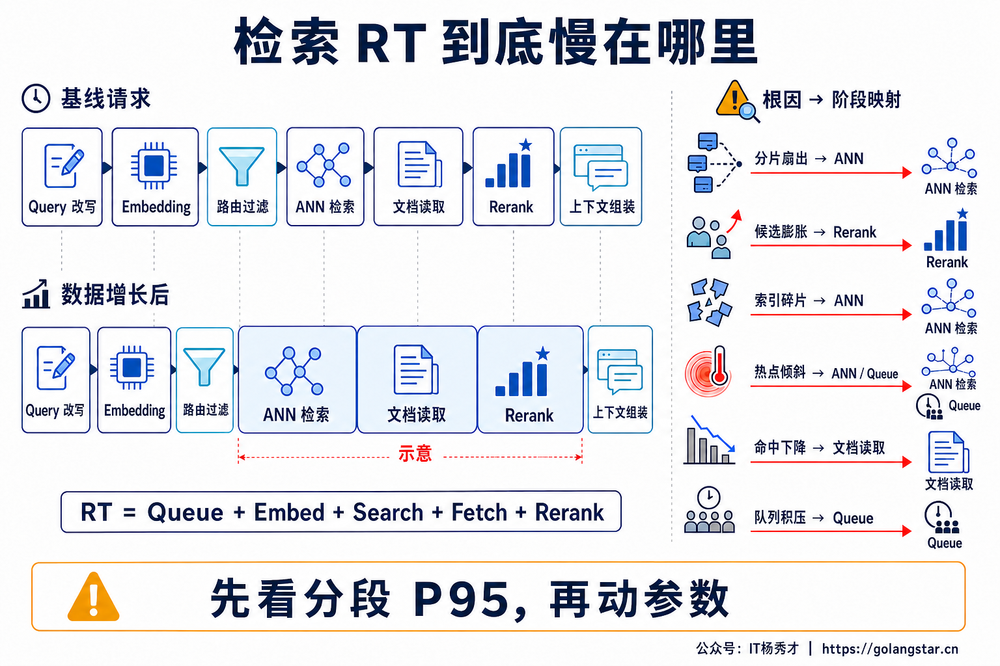
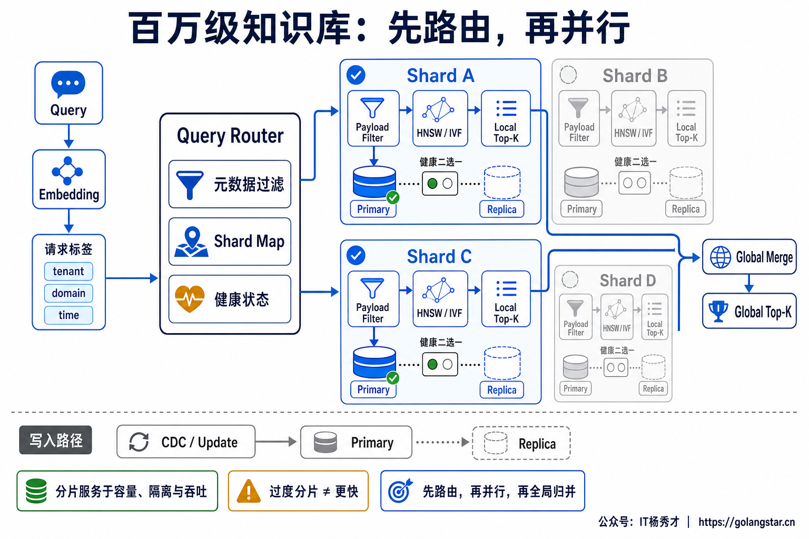
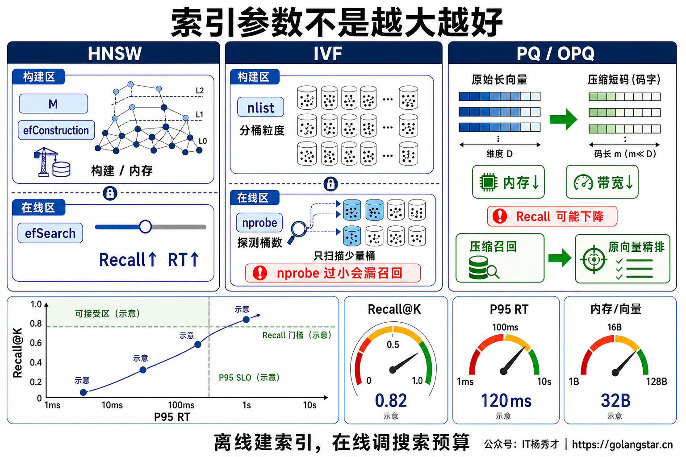
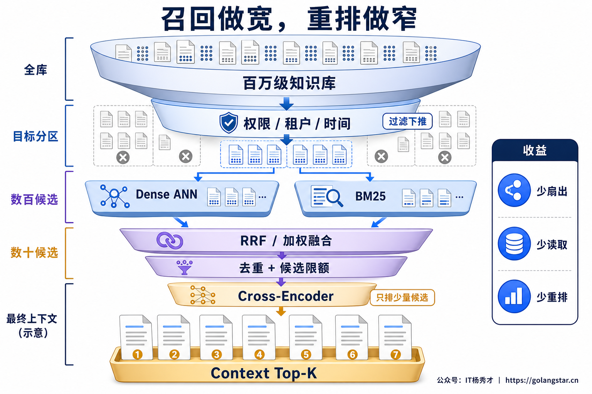
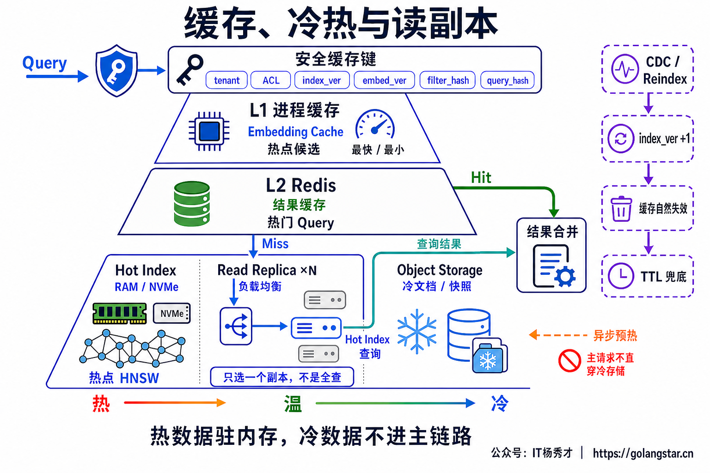
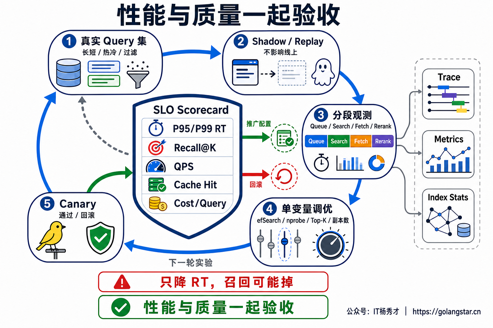

## **1. 题目分析**

百万级知识库并不天然等于慢。100 万个 768 维 `float32` 向量，原始向量大约是 `1,000,000 × 768 × 4 ≈ 3.07 GB`；如果热索引能驻留内存、过滤字段有索引、查询只访问必要分区，单机也可能有很好的延迟。反过来，一个规模更小的库，如果每次都全分片扇出、候选无限膨胀，又遇到索引合并和缓存失效，P95 一样会持续升高。

因此，这道题不是简单回答“换向量数据库、上 HNSW、加机器”，而是要说明：如何找到检索子链路真正的瓶颈，如何减少单次查询做的无效工作，以及怎样在召回质量不下降的前提下守住 P95/P99。讨论范围也应限定在 `Embedding → 过滤与路由 → ANN/BM25 → 融合 → 回表 → Rerank`，而不是把整个 Agent 和最终 LLM 的耗时混进来。

### **1.1 先拆 RT，分清是算得慢还是等得久**

线上只记录一个 `retrieval_rt`，无法指导优化。Dense 与 BM25 并行时，检索阶段可以拆成：

```text
Retrieval RT = Queue Wait
             + Query Rewrite / Embedding
             + max(Dense ANN, BM25)
             + Merge / Dedup
             + Content Fetch
             + Rerank
```

每个阶段都应建立 Trace Span，并按知识库、租户等级、过滤选择度、Top-K、冷热 Query 和分片数观察 P50/P95/P99。Request ID 和 Tenant ID 放入 Trace 或日志，不直接做时序指标标签。

诊断时先看 `Queue Wait` 和 `Service Time`。如果单次 Search 时间没变，队列却随着并发上升，问题在容量、准入或热点；如果 ANN 自身变慢，要继续看扫描候选数、命中分片数、过滤选择度、索引是否驻留和磁盘 Page Fault；如果 Search 很快而 Fetch、Rerank 变宽，说明候选膨胀或发生了 N+1 回表。若只有少数分片 P99 异常，则要排查数据倾斜、热点租户、Compaction 或副本冷启动，而不是先改全局 `efSearch`。



### **1.2 先缩小搜索空间，再调 ANN 参数**

检索优化最有效的一步，往往不是让索引跑得更快，而是让查询根本不要访问无关数据。知识库在写入时应带上 `tenant_id`、`kb_id`、`domain`、`acl_group`、`language`、`effective_time` 等可路由元数据；查询先根据租户、知识域和时间范围定位目标 Partition 或 Shard，再在目标范围内做向量搜索。

其中，权限条件必须在检索阶段下推，不能先从全库召回 Top-K 再做 ACL 过滤。后过滤既可能把无权限结果带入后续链路，也可能过滤完一个候选都不剩，只能反复扩大候选集。常用等值、范围和权限字段要建立标量索引或 Bitmap/倒排结构，让查询计划能够估算过滤后的候选基数。

过滤策略也不是固定的。过滤命中范围很大时，可以在支持过滤的 ANN 图上遍历；条件非常严格、候选集合很小时，精确计算反而可能更便宜；中间区间则依赖 Filter-aware ANN。执行器应根据候选基数选择路径，而不是所有请求都强制走同一套参数。

分区键同样不能滥用。租户、领域、时间这类每次查询都能明确携带的低维路由条件很合适；如果给每个用户、每个标签都建一个物理小分区，会造成大量小索引、文件句柄和调度开销。物理分片用于容量、隔离和并行吞吐，不是“数据到了百万就必须拆”的固定门槛。一次查询访问的分片越多，Scatter-Gather 越重，端到端 P99 也越容易被最慢分片支配。



### **1.3 建容量模型，决定索引和数据如何驻留**

容量规划的对象不是“多少篇文档”，而是最终产生了多少 Chunk、多少向量。原始向量内存可以先按下面的公式估算：

```text
Raw Vector Bytes = Chunk Count × Dimension × Bytes Per Dimension
```

但这只是下限。生产容量还要加上 HNSW 图边、ID 与版本信息、标量索引、Payload、Segment 元数据、缓存、内存分配碎片、后台构建空间以及副本开销。索引水位长期逼近物理内存后，随机 Page Fault 和缓存抖动会把平均 RT 与尾延迟一起拉高，所以要为查询和 Compaction 留出余量，不能按“刚好装下”规划。

热工作集能放进内存时，HNSW 往往是低 Top-K、高召回场景的实用起点；数据显著超过内存后，再考虑标量量化、PQ/OPQ 或磁盘 ANN。量化不是无损加速，较稳妥的方式是用压缩向量召回，再用原始向量对少量候选精排。原文、超大 Payload 和冷快照不应全部塞进热索引，搜索先返回 ID、分数和必要字段，再批量回表。

分片扩大容量与写入并行度；副本提高可用性，并在入口负载均衡时增加读吞吐。单个请求通常只查询每个 Shard 的一个健康副本。过多分片会增加网络和全局归并成本，过少又限制扩容，因此应按单 Shard 工作集、目标 QPS 和故障域压测确定。

### **1.4 ANN 调优必须同时看召回、延迟和内存**

索引选择之前，应先在一份可控样本上用 Flat 精确检索生成 Ground Truth。没有精确基线，ANN 把相关文档漏掉以后，RT 看起来再漂亮也没有意义。

HNSW 中，`M` 和 `efConstruction` 主要是构建期参数：增大它们通常会改善图质量，但会增加构建时间和内存；`efSearch` 才是在线搜索预算，调大往往提高 Recall，也会增加距离计算和 RT。IVF 中，`nlist` 决定离线分桶粒度，`nprobe` 决定查询时探测多少桶；`nprobe` 太小会漏召回，太大又逐渐接近全量扫描。不同向量库的参数名和实现会变化，但方法不变：固定数据、过滤分布和并发，画出 `Recall@K - P95 RT - QPS - Memory` 的 Pareto 曲线，再选满足质量门槛的最低成本点。

参数还要按查询类型分桶。严格过滤、低 Top-K 和全局语义搜索的最优预算可能不同，可以按候选基数、Top-K 和风险设置少量 Profile。参数上线必须带版本并灰度，不能因为平均 RT 降低就全量替换。



### **1.5 控制候选集，避免把成本推给下游**

生产检索通常不是一次 ANN 就结束，而是 Dense、Sparse、融合、去重、回表和 Rerank 的流水线。Dense 与 BM25 没有依赖时可以有界并行，各自只返回受控的局部候选；跨 Shard 先做 Local Top-K，再做 Global Merge；融合去重之后，Cross-Encoder 只处理几十级而不是成百上千的文档。具体数量不能写死，必须和 Recall@K 一起标定。

这里有三个常见放大器。第一，给每个分片都取一个很大的 Top-K，分片数增加后，全局候选线性膨胀；第二，Rerank 在各分片重复执行，浪费算力；第三，候选文档逐条回表，形成 N+1 网络请求。正确做法是设置全局 Candidate Budget，融合后统一 Rerank，并用 `mget` 或批量接口取回原文。对于超长文档，还可以先返回 Chunk 与父文档摘要，确认入选后再取完整上下文。

Query Rewrite 和 Multi-Query 也要按需开启。它们能改善困难问题的召回，但会把一次搜索放大成多次 Embedding、多路检索和更大候选集。简单问句走 Fast Path，只有低置信度或复杂问题才升级到多路召回，并设置最大 Query 数、每路候选上限和阶段 Deadline。



### **1.6 缓存、并发和索引生命周期要一起治理**

缓存键不能只有 Query 文本，至少要包含 `tenant/ACL`、标准化 Query、过滤条件、Top-K、检索策略、Embedding 模型和索引版本；更新时用版本号隔离旧结果，TTL 兜底。热点 Query 可做精确结果缓存，Query Embedding 按模型版本缓存，重复 Miss 用 Singleflight 合并。强权限、强时效场景不默认使用语义缓存，更不能跨租户复用。

热索引与标量索引尽量驻留 RAM 或高速 NVMe，冷文档和快照放对象存储，通过异步任务预热，不能让正常在线查询每次穿透冷层。读副本要通过负载均衡分担流量，并观察每个副本的索引版本和预热状态，防止刚扩出的冷副本反而拉高 P99。

并发上升时，搜索线程、Rerank GPU、回表连接池都要设置独立的有界队列和并发上限。系统接近饱和时要准入、降级或快速失败，不能用无限排队和无限重试把短暂拥塞变成长时间雪崩。热点租户或超大 Top-K 请求可以进入独立 Lane，避免队头阻塞普通查询。

索引本身也有生命周期。增量写入可能产生未建索引的小 Segment、Tombstone 和碎片；后台 Build、Merge、Compaction、Shard Transfer 与 Rebalance 都会争夺 CPU、内存和 I/O。在线读与批量写应隔离资源，Compaction 设置窗口和并发水位；大版本重建使用新旧索引并行、预热、Shadow 校验和原子别名切换，避免把一个尚未预热的新索引直接推给全部流量。



### **1.7 用真实流量做性能与质量的联合验收**

随机生成一批均匀向量只能测出实验室吞吐，测不出生产 P99。压测集要覆盖热门与冷门 Query、不同租户、不同过滤选择度、长短 Chunk、不同 Top-K、Dense/Sparse 混合、并发突刺，同时叠加增量写入、索引构建和 Compaction 等背景负载。还要分别测冷启动、稳定热缓存和单节点故障后的状态。

性能指标至少包括 Queue Wait、P50/P95/P99、QPS、分阶段耗时、最慢分片 RT、CPU/内存、Page Fault、Cache Hit、未索引数据量、Segment、Compaction 和拒绝率；质量侧同时看 Recall@K、MRR 或 NDCG，并与 Flat Ground Truth 对比。

调参过程采用 Replay 或 Shadow 流量，一次只改变一个主要变量，例如 `efSearch`、`nprobe`、Candidate Budget、分片数或副本数。通过 SLO Scorecard 后再 Canary，异常立即回滚。最终沉淀的不是某组“万能参数”，而是一套带流量基线、索引版本、硬件规格和回滚条件的配置。



***

## **2. 参考回答**

我不会把“百万级”直接等同于分库分片，而是先用 Trace 把 RT 拆成 Queue、Embedding、过滤路由、Dense/BM25、归并、回表和 Rerank，判断是服务时间、并发排队，还是热点分片与 Compaction 拉高 P95。容量按 Chunk 数、维度、数据类型，再加图索引、标量索引和副本开销计算，确认热工作集能否驻留内存。

优化时先按 tenant、知识域和时间裁剪 Partition/Shard，ACL 与常用过滤字段建立标量索引并下推；以 Flat 做质量基线，HNSW 调 `efSearch`、IVF 调 `nprobe`，同时看 Recall@K、P95、QPS 和内存。Dense 与 BM25 有界并行，全局融合后只 Rerank 少量候选，原文批量回表。缓存键绑定 tenant、ACL、过滤、模型与索引版本，读副本承接吞吐，写入、建索引和 Compaction 与在线读隔离。最后用真实冷热 Query、过滤分布和并发做 Replay/Canary，在 Recall/NDCG 不下降的前提下守住 P95/P99。

<div style="background-color: #f0f9eb; padding: 10px 15px; border-radius: 4px; border-left: 5px solid #67c23a; margin: 20px 0; color:rgb(64, 147, 255);">

## <span style="color: #006400;">**学习交流**</span>
<span style="color:rgb(4, 4, 4);">
> 如果您觉得文章有帮助，可以关注下秀才的<strong style="color: red;">公众号：IT杨秀才</strong>，后续更多优质的文章都会在公众号第一时间发布，不一定会及时同步到网站。点个关注👇，优质内容不错过
</span>


<div style="text-align: center; margin-top: 22px; padding-top: 20px; border-top: 1px solid #c2e7b0;">
<div style="color: #006400; font-size: 20px; font-weight: bold;">🔥 配套实战项目，拆得开、跑得起、能写进简历</div>
<div style="color: red; font-size: 16px; font-weight: bold; margin-top: 8px;">多 Agent 编排 + RAG 混合检索 · 31 篇深度教程 + 50+ 面试题</div>
<a href="/projects/dev-support.html" style="display: inline-block; margin-top: 14px; background: #ff7a18; color: #fff; font-size: 18px; font-weight: bold; padding: 10px 28px; border-radius: 24px; text-decoration: none;">点击查看 DevSupport AI 实战项目 →</a>
</div>
</div>
