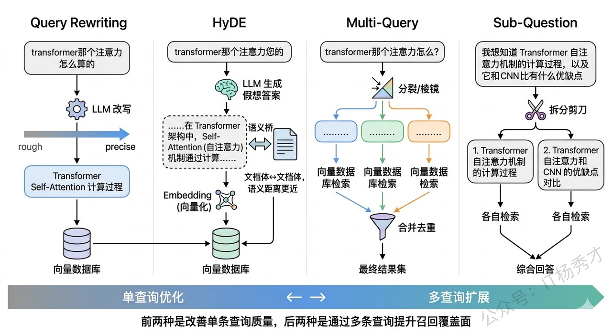
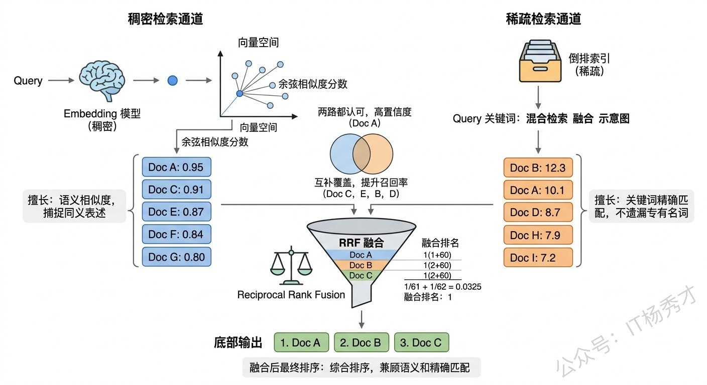
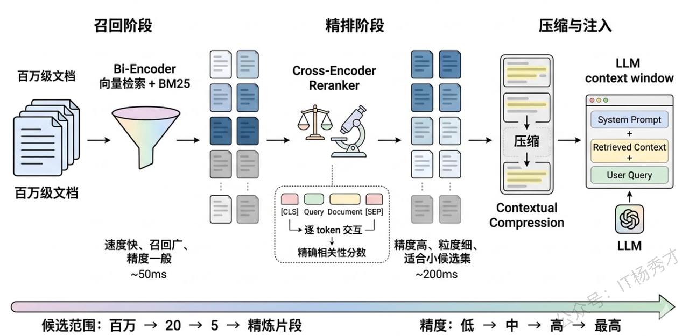

## **1. 题目分析**

这道题是考察你对RAG 系统理解深度的一个非常好的题目。你是只会把文档切片、灌进向量数据库、然后做 top-k 检索，还是真的在实际项目中遇到过检索质量不达标的情况，并且知道从哪些环节入手去优化，通过这个题目，很快就能检验出来。一个真正做过 RAG 优化的人，能够从查询理解、索引构建、检索策略、后处理排序这整条链路上逐一拆解瓶颈并给出对应方案。

要回答好这道题，关键是**不要散点列举**，而是沿着"一条查询从用户提出到最终送进 LLM"的完整链路，在每个环节上分析瓶颈在哪、对应的优化手段是什么。这样面试官能感受到你对 RAG 有体系化的认知，而不是零散地背了几个技术名词。

### **1.1 基础向量检索的瓶颈**

在讨论优化方案之前，我们得先理解基础向量检索到底"弱"在哪里，这样后面每种技术才有存在的合理性。

基础的向量检索流程是：把文档切成固定长度的 chunk，用 Embedding 模型把每个 chunk 编码成向量存入向量数据库，查询时把用户问题也编码成向量，用余弦相似度或内积找出 top-k 最相似的 chunk，拼进 prompt 给 LLM。这个流程有几个本质局限：

**第一，查询和文档之间存在语义鸿沟**。用户的提问方式和文档的表述方式往往差异很大。比如用户问"系统挂了怎么办"，文档里写的是"服务异常恢复流程"——两者语义相关，但措辞完全不同，Embedding 模型不一定能捕捉到这种关联。**第二，向量检索天然不擅长精确匹配**。如果用户问的是"2024年Q3的销售额是多少"，这里面"2024年Q3"是一个需要精确命中的条件，但向量检索做的是模糊的语义相似度计算，可能把 2023 年 Q2 的数据也检索回来。**第三，固定的切片策略导致上下文割裂**。一段完整的论述被机械地切成了 512 token 的碎片，关键信息可能刚好被切断，检索回来的 chunk 只有半句话，LLM 看了也不知道在说什么。

理解了这些瓶颈，后面的优化技术就自然了——它们分别从查询侧、索引侧、检索侧、后处理侧四个维度来逐一攻克这些问题。

### **1.2 查询侧优化**

很多时候检索质量差，根源不在检索引擎，而在用户的查询本身。用户的提问可能太模糊、太口语化、或者包含了多个子问题混在一起。如果能在检索之前先把查询"加工"一下，检索效果会有质的提升。

**Query Rewriting（查询改写）** 是最直接的手段。让 LLM 把用户的原始查询改写成更适合检索的形式。比如用户问"transformer 那个注意力的东西是怎么算的"，改写后变成"Transformer 中 Self-Attention 的计算过程是什么"。改写后的查询更规范、关键词更精确，向量检索和关键词检索都能受益。实际实现时通常用一个轻量级的 prompt 就能完成，成本很低但收益明显。

**HyDE（Hypothetical Document Embeddings）** 是一种更巧妙的做法。它的核心思想是：与其直接用查询去检索，不如先让 LLM 根据查询"凭空生成"一段假想的答案文档，然后用这段假想文档的向量去检索。为什么这样做有效？因为假想答案和真实文档的表述风格更接近——都是"文档体"的陈述句，而不是"提问体"的疑问句。这就巧妙地跨越了前面说的"查询和文档之间的语义鸿沟"。当然，假想答案的内容可能不准确，但没关系，我们要的不是它的内容正确性，而是它的语义方向——它帮我们把查询从"问题空间"映射到了"文档空间"。

**Multi-Query（多查询扩展）** 则是从另一个角度解决问题。一个用户查询可能隐含了多个不同的信息需求，或者同一个意思有多种表达方式。Multi-Query 让 LLM 从不同角度生成 3-5 个变体查询，然后分别检索，最后把所有结果合并去重。比如用户问"RAG 怎么优化"，可以扩展成"提升 RAG 检索准确率的方法"、"RAG 系统的常见优化策略"、"如何改善检索增强生成的效果"等。每个变体可能命中不同的相关文档，合并后召回率显著提升。LangChain 中的 MultiQueryRetriever 就是这种策略的标准实现。

**Sub-Question Decomposition（子问题分解）** 适用于复杂的多步问题。比如用户问"对比 GPT-4 和 Claude 在代码生成任务上的表现"，这其实包含两个子问题——"GPT-4 在代码生成上的表现如何"和"Claude 在代码生成上的表现如何"。直接用原始查询检索，很难同时命中两方面的信息。拆成子问题后分别检索，再综合回答，效果会好很多。

###**1.3 索引侧优化**

查询侧优化是在检索的"入口"做文章，索引侧优化则是在"源头"做文章——通过更好的文档处理和索引构建策略，让相关内容更容易被找到。

**智能切片策略**是索引优化的第一步，也是最容易被低估的一步。很多项目一上来就用固定长度切片（比如每 512 token 切一段），这种做法简单但粗暴。更好的做法是**语义切片**——基于文档的实际结构来切，比如按段落、按章节、按 Markdown 标题层级来分割，确保每个 chunk 是一个语义完整的单元。LangChain 的 RecursiveCharacterTextSplitter 支持按层级分隔符递归切割，能在保证不超长的前提下尽量保持语义完整。更进一步，还可以用 LLM 来判断切分点——让模型识别文本中的语义边界，在主题转换处切开。

**Parent-Child 索引**（也叫 Small-to-Big）是一种非常实用的索引架构。核心思想是：用小 chunk 做检索，但返回大 chunk 给 LLM。具体来说，先把文档切成较大的 chunk（比如 2000 token），再把每个大 chunk 进一步切成小的子 chunk（比如 200 token）。检索时用小 chunk 的向量做匹配——小 chunk 语义集中，匹配更精准；命中后，返回它所属的父级大 chunk 给 LLM——大 chunk 上下文完整，LLM 能更好地理解和利用。这种设计同时兼顾了检索精度和上下文完整性，在实际项目中效果很好。LlamaIndex 中的 ParentDocumentRetriever 就是这个思路的实现。

**文档摘要索引**是另一种巧妙的策略。对于每篇文档，先用 LLM 生成一段摘要，把摘要也做向量化存入索引。检索时，除了匹配原文 chunk，还会匹配摘要。摘要天然是对全文内容的高度凝练，很多时候用户的查询和摘要的匹配度反而比和原文碎片的匹配度更高。命中摘要后，再定位到对应的原文段落，返回详细内容。这种"先粗后细"的两级检索在处理长文档时特别有效。

**多层级索引**则把这个思路推向极致。不只是文档-chunk 两层，而是构建多层级的索引结构——比如"领域 → 主题 → 文档 → 段落"。查询先在高层级做粗筛，确定相关的领域和主题，再在低层级做精确匹配。这种方式在文档量很大（数十万篇以上）时优势明显，因为它避免了在全量向量中做暴力搜索，大幅减少了检索范围。

### **1.4 检索策略优化：混合检索与多路召回**

单纯的向量检索再怎么优化，也有它的能力天花板——因为 Embedding 模型本身就有局限。真正在生产环境中效果好的方案，几乎都不是只用向量检索，而是**混合多种检索方式**。

**Hybrid Search（混合检索）** 是目前工业界最广泛采用的方案。它同时使用稀疏检索（如 BM25）和稠密检索（向量检索），然后用一个混合策略把两路结果合并排序。为什么要混合？因为两种检索方式有很好的互补性：向量检索擅长理解语义——"汽车"和"轿车"虽然字面不同，但向量距离很近；BM25 擅长精确的关键词匹配——查询"GPT-4o"时不会把"GPT-3.5"的内容混进来。在实际测试中，混合检索的效果几乎总是优于单独使用任何一种。

融合两路结果的常用方法是 **Reciprocal Rank Fusion（RRF）**。它的逻辑很简单：对于每个候选文档，根据它在两路检索结果中的排名分别算一个分数（排名越高分数越高），然后把两个分数加起来作为最终得分。这种方法不需要对两路检索的分数做归一化（BM25 的分数和余弦相似度的量纲完全不同），直接用排名来融合，简单有效。Elasticsearch 8.x 和大多数向量数据库（如 Weaviate、Qdrant）都原生支持混合检索。

**元数据过滤**是另一个经常被忽视但非常实用的检索增强手段。在向量检索之前或之后，利用文档的元数据（如时间、来源、类别、作者等）做预过滤。比如用户问"最新的产品定价策略"，先用元数据过滤出最近 3 个月的文档，再在这个子集中做向量检索。这样不仅提升了准确率，还减少了检索的计算量。元数据过滤对于"精确条件 + 语义理解"混合需求的查询特别有效——而现实中的业务查询大多都是这种类型。

### **1.5 后续处理优化**

检索完成后，在结果送进 LLM 之前，还有一个重要的优化环节——后处理。这个环节的核心价值在于，用更精细的模型对检索结果做"二次筛选"，把真正相关的内容留下，把噪声过滤掉。

**Reranking（重排序）** 是后处理环节中最有效的手段，可以说是 RAG 优化的"性价比之王"。它的工作方式是：先用向量检索做粗召回（比如返回 top-20），然后用一个专门的 Cross-Encoder 重排序模型对这 20 个结果逐一精排，重新排列后取 top-5 送给 LLM。

为什么 Reranker 的效果比直接用向量相似度排序要好得多？关键区别在于模型架构：向量检索用的是 **Bi-Encoder**——查询和文档分别独立编码成向量，然后算点积，好处是快（文档向量可以预计算），但代价是查询和文档之间没有交互，模型看不到它们的细粒度关联。Reranker 用的是 **Cross-Encoder**——把查询和文档拼接在一起作为一个整体输入模型，模型能逐 token 地分析查询和文档之间的交叉关系，自然能更准确地判断相关性。代价是慢（每对 query-doc 都要过一遍模型），所以只能用在候选量较小的重排阶段。

这就是经典&#x7684;**"召回-精排"两阶段架构**：第一阶段用速度快但精度一般的 Bi-Encoder 做大范围召回，第二阶段用精度高但速度慢的 Cross-Encoder 做小范围精排。这个架构在搜索引擎和推荐系统中已经用了很多年，移植到RAG 中同样非常有效。常用的 Reranker 模型包括 Cohere Rerank、bge-reranker、以及基于 cross-encoder 架构的各类模型。

**Contextual Compression（上下文压缩）** 是另一种后处理策略。检索回来的 chunk 可能有大量跟查询无关的"水分"——一个 500 token 的 chunk 中可能只有两三句话是真正相关的。上下文压缩就是用 LLM 或专门的提取模型，把每个 chunk 中与查询相关的核心内容提取出来，压缩成精炼的片段。这样不仅减少了送给 LLM 的 token 数量（降低成本），还减少了无关信息的干扰（提升回答质量）。LangChain 的 ContextualCompressionRetriever 提供了开箱即用的实现。

### **1.6 进阶方向**

上面的技术已经能覆盖大多数场景，但如果面试中能再提到一些前沿方向，会是很好的加分项。

**知识图谱增强检索（Graph RAG）** 解决的是向量检索天然不擅长的"关系推理"问题。向量检索能找到"什么"，但不擅长回答"A 和 B 之间是什么关系"、"从 A 到 C 需要经过哪些步骤"这类需要跨文档关联推理的问题。Graph RAG 的做法是：在传统向量索引之外，额外构建一个知识图谱，把文档中的实体和关系抽取出来形成图结构。检索时，先从向量库找到相关的内容片段，再从知识图谱中沿着关系边找到关联的实体和上下文，两路信息合并后一起送给 LLM。微软开源的 GraphRAG 项目就是这个方向的代表，它先用 LLM 从文档中抽取实体关系图，再利用社区检测算法对图做聚类摘要，查询时结合图结构和摘要来检索。

**Agentic RAG（自适应检索）** 是更进一步的演进。传统 RAG 的检索策略是固定的——不管什么查询都走相同的流程。但不同类型的查询需要不同的检索策略：简单的事实性问题可能一次检索就够了，而复杂的分析性问题可能需要多次迭代检索，每次根据上一轮的检索结果来调整下一轮的查询。Agentic RAG 把检索过程交给一个 Agent 来自主决策——它可以判断是否需要检索、用什么策略检索、检索结果够不够好要不要再搜一轮。这种方式更灵活，但也更复杂，工程上需要权衡效果和延迟。

## **2. 参考回答**

提升 RAG 检索质量，我通常沿着查询侧、索引侧、检索策略、后处理这四个环节来系统性地优化。

**查询侧**，核心问题是用户的提问和文档的表述之间存在语义鸿沟。最直接的是 Query Rewriting，让 LLM 把口语化的查询改写成更适合检索的规范表述。更进一步是 HyDE，先让 LLM 生成一段假想答案，用假想答案的向量去检索，因为文档体和文档体之间的语义距离更近。对于复杂问题，可以用 Multi-Query 从多个角度生成变体查询分别检索再合并，提升召回覆盖面。

**索引侧**，最关键的是切片策略的优化。固定长度切片容易割裂语义，更好的做法是基于文档结构的语义切片。我在实际项目中用得最多的是 Parent-Child 索引，用小 chunk 做检索保证精度，命中后返回它的父级大 chunk 给 LLM 保证上下文完整性，效果提升非常明显。

**检索策略**方面，工业界基本都会用混合检索——同时走向量检索和 BM25，用 RRF 做排名融合。两种检索互补性很强，向量擅长语义匹配，BM25 擅长精确关键词匹配，混合后效果几乎总是优于单路。再配合元数据过滤做预筛选，进一步缩小检索范围、提升精度。

**后续处理**环节，Reranking 是性价比最高的优化手段。先用向量检索粗召回 top-20，再用 Cross-Encoder 重排序模型做精排取 top-5。Cross-Encoder 和 Bi-Encoder 的核心区别在于它把 query 和 document 拼在一起做逐 token 的交互分析，相关性判断精度远高于独立编码后算点积。此外还可以做上下文压缩，把 chunk 中的无关内容去掉，只留和查询相关的核心片段送给 LLM。

如果再往深了说，Graph RAG 通过知识图谱补充实体间的关系信息，能处理向量检索搞不定的关系推理问题；Agentic RAG 则让 Agent 自主决定检索策略，根据查询复杂度动态调整检索轮次和方式，是更灵活的进阶方向。

## **学习交流**

> 如果您觉得文章有帮助，可以关注下秀才的<strong style="color: red;">公众号：IT杨秀才</strong>，后续更多优质的文章都会在公众号第一时间发布，不一定会及时同步到网站。点个关注👇，优质内容不错过

