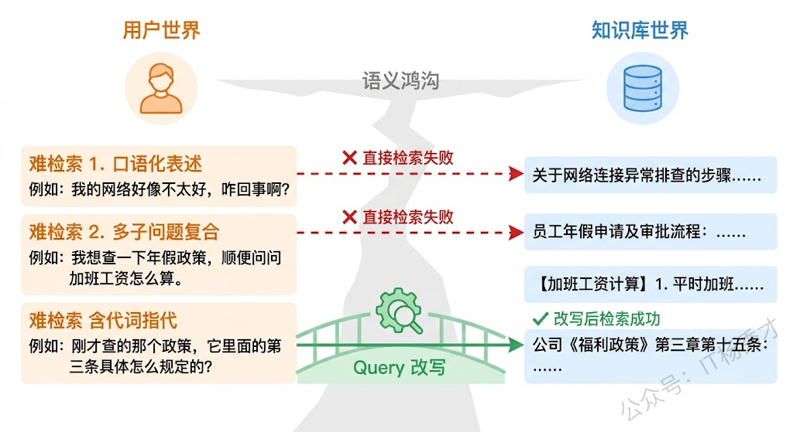
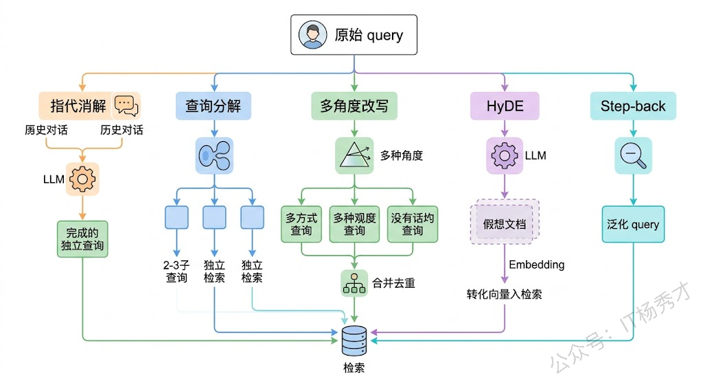
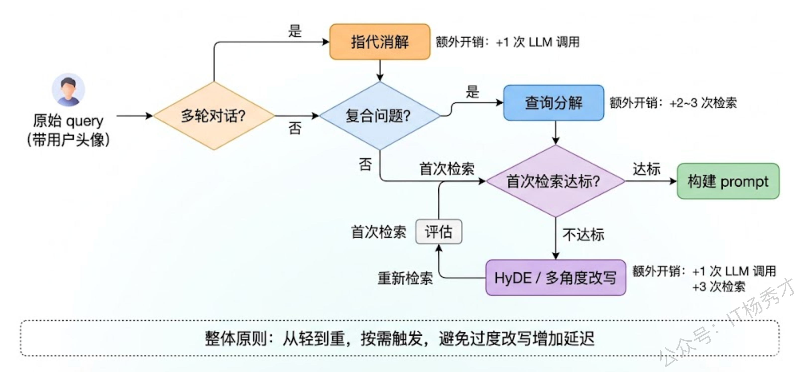
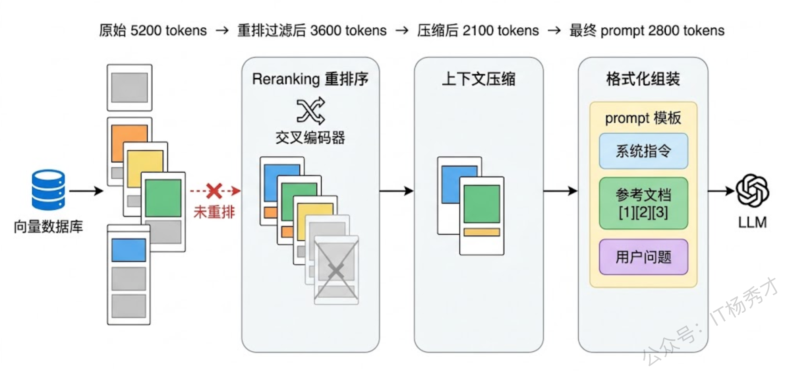
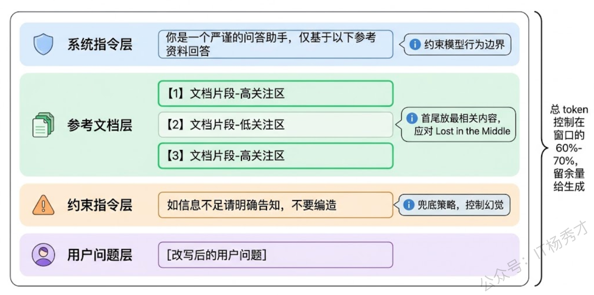
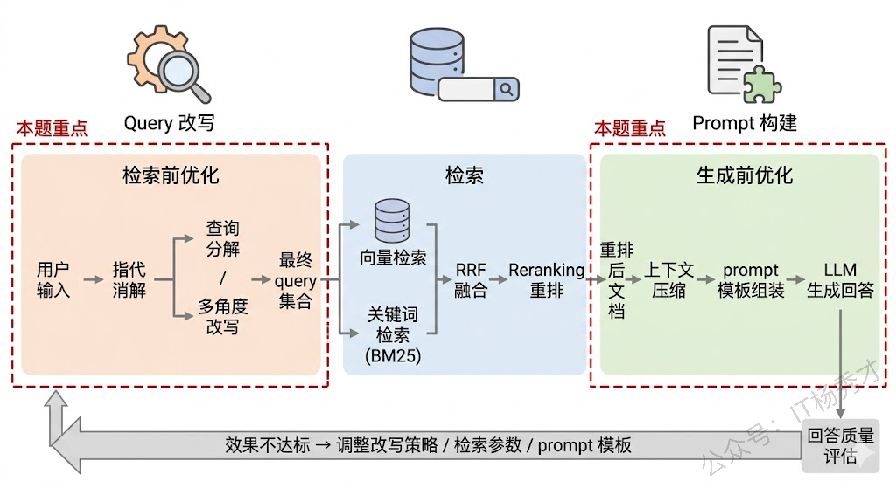

## **1. 题目分析**

很多人搭 RAG 系统时把精力全花在 embedding 模型选型和向量库调参上，结果发现效果还是不行——知识库里明明有答案，就是检索不出来；或者检索出来了，模型的回答还是不靠谱。问题往往出在两个被低估的环节：用户的 query 没有经过适当改写就直接丢给了检索引擎，以及检索回来的文档片段没有被有效组织就塞进了 prompt。这两个环节分别对应 RAG 管线中的检索前优化和生成前优化，是提升端到端效果最直接的手段。

### **1.1 原始 query 为什么不能直接用**

先说一个直觉：用户说话的方式和知识库文档的写法往往差距很大。用户可能输入"上次那个报错怎么解决的"，而知识库里的表述是"ConnectionTimeoutException 的排查步骤"。这中间存在一个巨大的语义鸿沟——用户用口语化、带省略、带指代的方式提问，而知识库是结构化、规范化的专业表述。直接用原始 query 去做 embedding 检索，召回率自然不好。

除了表述差异，还有几种常见的"难检索"场景。用户的问题太笼统，比如"介绍一下你们的产品"，这种 query 的 embedding 向量在高维空间中指向一个模糊的区域，很难精准匹配到具体文档。用户的问题包含多个子问题，比如"对比 MySQL 和 PostgreSQL 在高并发写入下的性能差异，以及各自的锁机制有什么不同"，作为整体去检索，embedding 会被"平均化"，两个子话题都检索得不好。多轮对话中的指代问题更是重灾区——用户第一轮问"RAG 是什么"，第二轮接着问"它的检索阶段有哪些优化方法"，这个"它"如果不做指代消解，检索系统根本不知道在找什么。

### **1.2 主流的 query 改写策略**

理解了为什么要改写，看具体怎么改。实践中常用的策略可以按改写目标分成几类。

**指代消解与上下文补全**是多轮对话场景的刚需。做法是把当前轮的 query 和前几轮的对话历史一起发给 LLM，让它输出一个语义完整、不依赖上下文的独立 query。比如把"它的检索阶段有哪些优化方法"改写成"RAG 系统的检索阶段有哪些优化方法"。这步看起来简单，但在生产环境几乎是必做的——没有它，多轮对话的 RAG 基本不可用。

**查询分解（Query Decomposition）** 针对的是复合问题。把一个包含多个子问题的复杂 query 拆成多个独立子 query，分别检索后再汇总结果。前面那个 MySQL 和 PostgreSQL 的对比问题，可以拆成"MySQL 高并发写入性能"、"PostgreSQL 高并发写入性能"、"MySQL 锁机制"、"PostgreSQL 锁机制"四个子 query，每个的 embedding 更聚焦，检索精度自然更高。

**多角度改写（Multi-Query）** 的思路是：同一个问题换几种不同的说法去检索，最后把所有检索结果合并去重。背后的逻辑是，不同的表述方式可能命中知识库中不同的文档片段，多角度改写可以显著提升召回率。实现上通常让 LLM 对原始 query 生成 3-5 个语义相同但措辞不同的变体。

**HyDE（Hypothetical Document Embeddings）** 是一种很巧妙的方法。它不改写 query 本身，而是让 LLM 先根据 query"假想"出一篇可能的答案文档，然后用这篇假想文档的 embedding 去做检索。原理是：假想答案和真实答案在表述风格上更接近（都是"文档体"），所以在 embedding 空间中距离更近。这个方法在 query 和文档之间表述风格差异大的场景下特别有效。

**Step-back Prompting** 则是反其道而行——不是让 query 更具体，而是更抽象。比如用户问"Python 3.9 中 walrus operator 有哪些使用限制"，step-back 后变成"Python 赋值表达式的语法规则和限制"。更抽象的 query 能检索到更全面的背景知识，适合需要先建立整体理解才能回答具体问题的场景。

### **1.3 改写策略的工程选型**

这些策略不是互斥的，实际项目中往往需要组合使用。一个典型的组合是：先做指代消解保证 query 语义完整，再判断是否需要分解，最后对每个 query 做多角度改写或 HyDE 来提升召回。

选型的关键考量是**成本和延迟**。每多一步改写就多一次 LLM 调用，在高并发场景下开销不容忽视。所以实践中通常做分级处理：简单 query（单句、无指代、目标明确）直接检索不做改写；有指代的做消解；复合问题做分解；只有检索结果质量不达标时才触发 HyDE 或多角度改写这种更重的策略。这种"按需改写"的路由逻辑，本身也可以用一个轻量级的分类模型或规则来实现。

### **1.4 基于检索结果构建有效 prompt**

query 改写解决了"检索得准"的问题，接下来要回答的是：怎么把检索到的文档片段组织进 prompt，让 LLM 能有效利用它们？

这个环节的核心矛盾是**信息量与可用性的冲突**。检索回来的文档可能很多、很长、包含冗余甚至矛盾的信息，而 LLM 的上下文窗口有限，注意力分配也不均匀（"Lost in the Middle"现象）。所以 prompt 构建的本质任务是：在有限的 token 预算内，把最相关、最有用的信息以最容易被模型利用的方式组织起来。

**重排序（Reranking）** 是检索和 prompt 构建之间的桥梁。向量检索的相关性评分是基于 embedding 相似度的粗排，而 Reranker（通常是交叉编码器模型）会把 query 和每个文档片段拼在一起做精细的相关性打分。经过重排后，真正和 query 相关的内容才会排到前面。Cohere Rerank、bge-reranker 都是常用的选择。重排之后，还需要考虑文档在 prompt 中的放置顺序——研究发现，把最相关的内容放在 prompt 的开头和结尾，中间放次相关的，效果比严格按分数降序排好，这正是为了应对 Lost in the Middle。

**上下文压缩（Context Compression）** 是一个被严重低估的技术。检索回来的文档片段中，真正和 query 相关的可能只有其中几句话，其余都是噪声。上下文压缩的做法是用 LLM 或专门的压缩模型从每个片段中提取与 query 直接相关的信息，去掉无关内容。LangChain 的 `ContextualCompressionRetriever` 就是这个思路。压缩后同样的 token 预算可以塞进更多有效信息。

**Prompt 模板的设计**直接影响模型的回答质量。一个好的 RAG prompt 模板通常包含几个关键要素：明确的角色指令，告诉模型基于给定资料回答，不要编造；对检索文档的引用格式规范，比如要求模型用 \[1]\[2] 标注信息来源，这既增加了可追溯性，也在一定程度上迫使模型去真正"看"参考文档而不是凭自己发挥；以及对"不知道就说不知道"的显式约束，这是控制幻觉最直接的手段。

还有一个经常被忽略的细节：**文档片段之间的冲突处理**。当多个片段包含矛盾信息时（比如不同版本的文档），prompt 中需要显式告知模型"以下文档可能存在冲突，请优先参考最新的信息"并标注时间戳。如果片段之间有逻辑递进关系，按逻辑顺序而非相关性分数排列效果更好。

### **1.5 检索结果不够好时怎么办**

现实中检索结果不可能总是完美的。有时候检索回来的文档关联度很低，有时候知识库里压根没有相关信息。怎么处理这些情况，是区分玩具系统和生产系统的分水岭。

一个实用的做法是在 prompt 构建前加一个**相关性判断环节**：用 Reranker 或 LLM 对检索结果做二次打分，如果最高分都低于阈值，就走降级策略——让模型基于自身知识回答但标注"以下回答未基于知识库验证"，或者直接告知用户"未找到相关信息"。

另一个策略是**混合检索**。不只依赖向量检索，同时做关键词检索（BM25），然后通过 Reciprocal Rank Fusion（RRF）融合排序。混合检索在实践中几乎总是比纯向量检索效果好，因为向量检索擅长语义匹配，关键词检索擅长精确匹配，两者互补。

***

## **2. 参考回答**

RAG 系统的效果优化，query 改写和 prompt 构建是两个最直接的手段，分别对应检索前和生成前的优化。query 改写要解决的核心问题是用户表达和知识库表述之间的语义鸿沟。实际做的时候，首先是指代消解，这在多轮对话场景中是刚需，把代词和省略补全成完整独立的 query；其次是查询分解，复合问题拆成多个子 query 分别检索再合并；还有多角度改写，用 LLM 生成同一问题的多种表述来提升召回率；以及 HyDE，让 LLM 先生成一篇假想答案文档，用它的 embedding 去检索，因为文档和文档之间的语义匹配天然比 query 和文档的匹配更准。工程上这些策略不是无脑全上，而是做分级路由——简单 query 直接检索，有指代的做消解，复合的做分解，只有检索质量不达标时才触发更重的改写。

prompt 构建方面，核心矛盾是 token 预算有限而检索信息量大。几个关键处理：一是用 Reranker 对检索结果做二次精排，交叉编码器比向量相似度的相关性判断准确得多；二是上下文压缩，从每个片段中只提取与 query 直接相关的内容，去掉噪声；三是模板设计上，最相关的内容放开头和结尾来应对 Lost in the Middle，同时显式约束模型信息不足就说不知道。此外检索层面我们通常做混合检索，向量检索加 BM25 关键词检索通过 RRF 融合排序，效果比纯向量检索好不少。

## **学习交流**

> 如果您觉得文章有帮助，可以关注下秀才的<strong style="color: red;">公众号：IT杨秀才</strong>，后续更多优质的文章都会在公众号第一时间发布，不一定会及时同步到网站。点个关注👇，优质内容不错过

