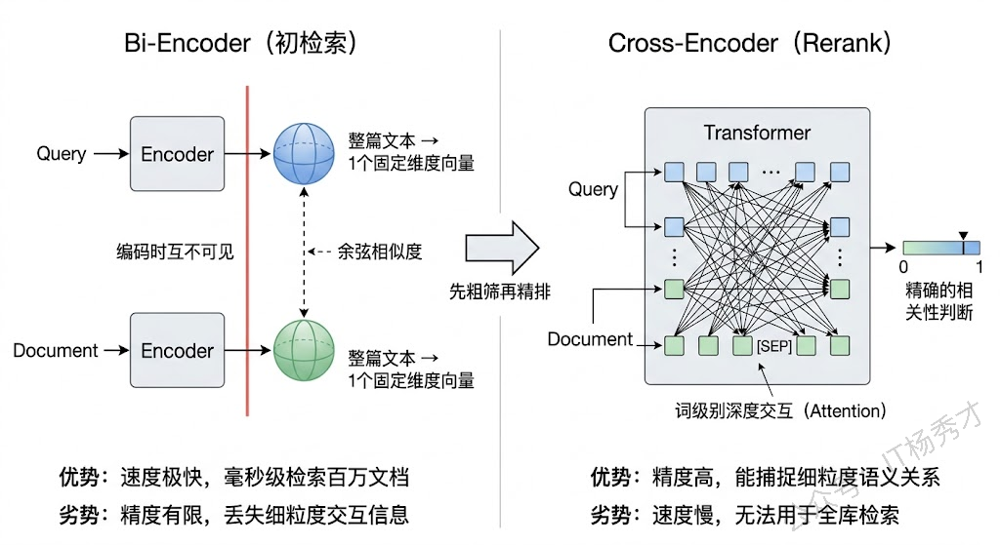
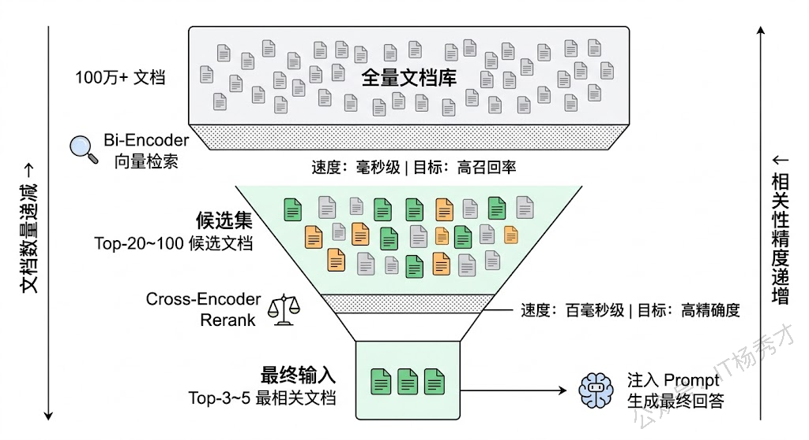
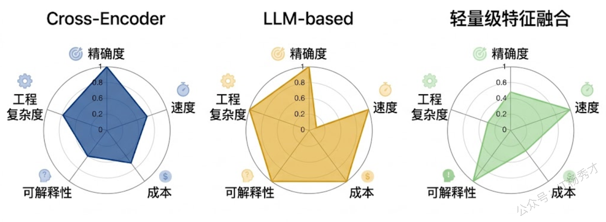
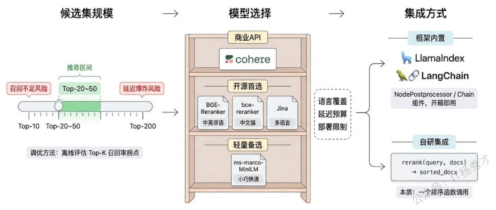
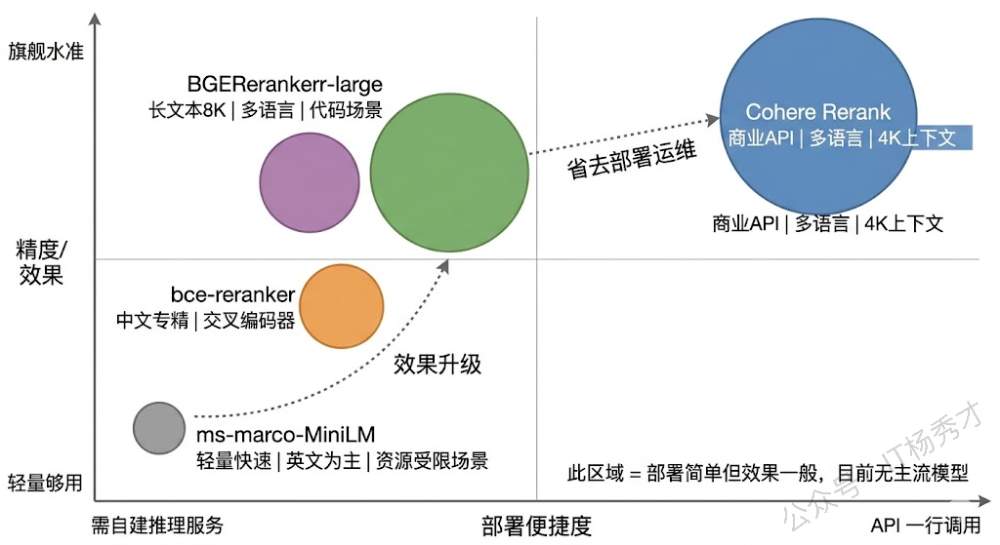
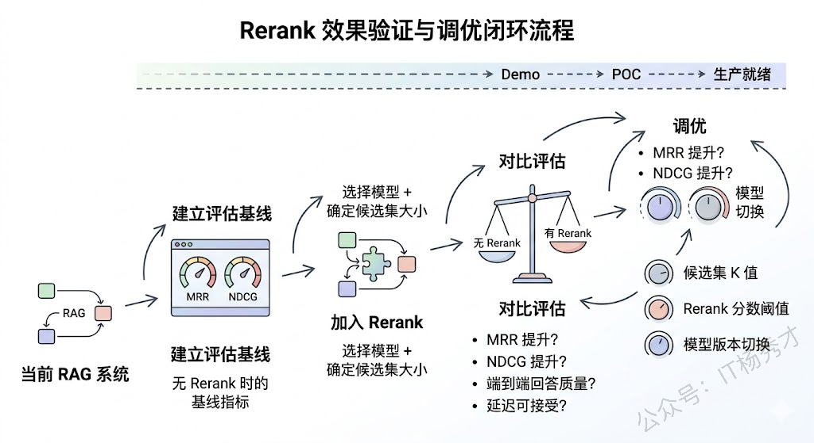

## **1. 题目分析**

RAG 系统里有一个容易被忽视的中间过程，检索拿回来的文档，和最终塞给 LLM 的文档之间，其实还隔着一道至关重要的筛选工序，这道工序就是 Rerank。很多人搭 RAG 的第一版原型时根本没加这一步，向量检索 Top-K 直接喂给大模型，效果也还凑合。但真到了线上要优化质量的时候，Rerank 往往是投入产出比最高的一环——不改 Embedding、不改 Chunk 策略、不动 Prompt，仅仅在中间插一层重排序，回答质量就能有肉眼可见的提升。面试官问这道题，本质上想看你有没有真正优化过 RAG 的召回质量，而不是只会搭一个 demo 跑通就交差。

### **1.1 为什么需要 Rerank？**

要理解 Rerank 的价值，得先理解向量检索到底"差"在哪。

RAG 的第一阶段检索，通常用的是双塔（Bi-Encoder）架构的 Embedding 模型。它的工作方式是把 Query 和每个文档**分别独立地**编码成一个向量，然后通过余弦相似度或点积来计算相关性。这种方式的最大优势是速度快——文档向量可以提前算好存进向量数据库，线上只需要算一次 Query 向量，然后做一次近似最近邻（ANN）搜索，毫秒级就能从百万级文档中捞出 Top-K。

但速度的代价是精度。Bi-Encoder 有一个根本性的弱点：**Query 和 Document 在编码时完全看不到对方**。它们各自被压缩成一个固定长度的向量（通常是 768 维或 1024 维），一篇几百字的文档的所有语义信息全部被塞进这一个向量里。这种压缩不可避免地会丢失细粒度的语义信息，特别是对于那些需要理解 Query 和 Document 之间**词级别交互关系**才能判断相关性的场景，Bi-Encoder 经常判断不准。

举个实际的例子。假设用户问"Python 中怎么处理大文件的内存溢出问题"，向量检索可能同时召回了这么几个文档片段：一篇讲 Python 内存管理机制的文章（高度相关）、一篇讲 Java 大文件处理的文章（主题相似但语言不对）、一篇讲 Python 基础语法的文章（语言对但主题偏了）。Bi-Encoder 算出来的向量相似度，三篇可能都差不多，因为它们在语义空间中的向量本来就离得不远。但一个真正理解问题的人，一眼就能排出高下——这就是 Rerank 要做的事。

### **1.2 Rerank 到底在做什么？**

说白了，Rerank 就是对初检索拿回来的 Top-K 文档做一次**精细化的二次排序**。

整个 RAG 的检索过程可以类比为一个漏斗。最上面是全量文档库（可能有几十万甚至上百万条），向量检索作为第一道粗筛，用 Bi-Encoder 快速从海量文档中捞出一个候选集（通常是 Top-20 到 Top-100）。这一步要的是**召回率**——宁可多捞一些不太相关的，也不能漏掉真正相关的。然后 Rerank 作为第二道精筛，用更强大的模型对这个小规模候选集逐一做精细评估，重新打分排序，把真正最相关的文档排到前面。这一步要的是**精确度**——在候选集里挑出最好的那几条。最终排在最前面的 Top-3 或 Top-5 文档，才会被拼接到 Prompt 里给 LLM 生成答案。

这个"先粗筛再精排"的两阶段范式并不是 RAG 独创的，它在搜索引擎和推荐系统领域已经用了十几年了。搜索引擎的经典架构就是"召回 → 粗排 → 精排 → 重排"四级漏斗，RAG 的 Retrieval + Rerank 本质上就是这个漏斗的简化版。

### **1.3 Rerank 的主流技术方案**

Rerank 不只有一种做法，根据模型架构和工程约束，主要有以下几种方案：

**Cross-Encoder 重排**是目前效果最好、也最主流的方案。Cross-Encoder 和 Bi-Encoder 最本质的区别在于：它不是把 Query 和 Document 分开编码，而是把两者**拼接成一个序列**一起送进 Transformer 模型，让 Query 中的每个 token 和 Document 中的每个 token 之间做全注意力交互（Full Attention），最终输出一个标量的相关性分数。这种深度交互让模型能够捕捉到非常细粒度的语义匹配关系——比如"Python 内存溢出"和"Python 内存管理"的区别，"大文件处理"和"文件基本操作"的区别，这些 Bi-Encoder 容易混淆的 case，Cross-Encoder 通常都能区分开。

代价就是慢。因为每一对 (Query, Document) 都要独立过一遍完整的 Transformer 前向推理，无法像 Bi-Encoder 那样预计算文档向量。如果候选集有 50 条文档，就要做 50 次推理。所以 Cross-Encoder 绝对不能用来做全库检索，只适合对一个小规模候选集做重排——这也是为什么 Rerank 必须放在初检索之后。

**LLM-based 重排**是近两年随着大模型能力增强而出现的新思路。最简单的做法是直接用 Prompt 让 LLM 对候选文档排序——比如把候选文档列出来，让 GPT-4 判断哪些和 Query 最相关。更系统的做法比如 RankGPT，它用滑动窗口的 Listwise 排序策略，让 LLM 每次看一组文档并输出排序结果，然后窗口滑动处理下一组，最终合并出全局排序。这种方案在某些任务上效果甚至可以超过专门训练的 Cross-Encoder，但成本和延迟都非常高，更多是在离线评估或对质量要求极高的场景中使用。

**轻量级特征融合重排**则是一种更务实的折中方案。它不只看语义相似度，还把其他信号也纳入排序的考量——文档的新鲜度、来源的权威性、关键词的精确匹配度（BM25 分数）、文档的点击率等。最后用一个简单的加权公式或者一个小的 Learning-to-Rank 模型把这些特征融合在一起，输出最终排序。这种方案速度最快，适合对延迟极度敏感的场景，但效果天花板不如 Cross-Encoder。

> 实际项目中，这几种方案并不是互斥的。一种常见的组合是：向量检索召回 Top-50 → Cross-Encoder 精排到 Top-10 → 再结合业务规则（如时效性、来源优先级）做最终筛选取 Top-5。如果延迟预算充裕，还可以在 Cross-Encoder 之后再叠一层 LLM-based 的验证。

### **1.4 工程实践：Rerank 怎么落地？**

知道原理之后，面试官很可能追问"具体怎么做"。在实际项目中，Rerank 的落地主要涉及三个工程决策。

**第一个决策是候选集大小**。初检索召回多少条交给 Rerank？这是一个召回率和延迟之间的权衡。召回太少（比如只拿 Top-10），可能真正相关的文档压根没进候选集，Rerank 再精准也无能为力——巧妇难为无米之炊。召回太多（比如 Top-200），Cross-Encoder 要做 200 次推理，延迟直接飙升。工程经验是 Top-20 到 Top-50 是一个比较好的平衡点，具体数字取决于你的文档库特征和延迟预算。一个实用的调优方法是：先在离线评估集上跑一组实验，观察 Top-K 召回率随 K 增大的边际收益，找到那个收益开始变得平缓的拐点。

**第二个决策是模型选择**。目前主流的 Rerank 模型可以大致分为三个梯队。第一梯队是商业 API：Cohere Rerank（开箱即用，效果稳定）和各云厂商提供的重排服务。第二梯队是开源的 Cross-Encoder 模型：BGE-Reranker 系列（智源出品，中英文效果都很好，有 base/large/v2 多个版本可选）、bce-reranker（网易有道出品，在中文场景表现突出）、Jina Reranker。第三梯队是通用的 sentence-transformers Cross-Encoder（如 `cross-encoder/ms-marco-MiniLM-L-12-v2`），体积小速度快但精度稍逊。选型时要综合考虑语言覆盖（如果业务涉及中文，BGE 和 bce 是优先选择）、模型大小和推理延迟、以及是否能本地部署。

**第三个决策是集成方式**。好消息是主流的 RAG 框架都已经内置了 Rerank 的支持。LlamaIndex 提供了 `SentenceTransformerRerank`、`CohereRerank` 等开箱即用的 NodePostprocessor；LangChain 也有 `CohereRerank`、`CrossEncoderReranker` 等组件可以直接插入检索链。如果用的是自研的 RAG 框架，集成也不复杂——本质上就是在检索之后、生成之前加一个函数调用：输入是 (query, documents) 列表，输出是重新排序后的 documents 列表。

### **1.5 常用 Rerank 模型盘点**

把目前业界常用的 Rerank 模型做一个系统性的梳理，这也是面试官明确问到的点。

**Cohere Rerank** 是商业级 Rerank 服务的标杆。它提供 API 调用，不需要自己部署模型，使用极其简单——传入 query 和 documents 列表，返回重排后的结果和相关性分数。最新的 Rerank 3.5 模型支持多语言，上下文长度支持到 4096 tokens，在多个公开评测中表现领先。适合不想自己折腾模型部署、追求稳定效果的团队，缺点是有 API 调用成本且数据需要发送到外部。

**BGE-Reranker 系列**（智源 BAAI）是开源社区中综合表现最好的选择之一。它有多个版本：`bge-reranker-base`（轻量，适合低延迟场景）、`bge-reranker-large`（效果更好）、`bge-reranker-v2-m3`（多语言版本，支持中英日韩等多种语言）。BGE 系列的优势在于中英文效果都很强，和 BGE Embedding 模型配合使用效果更佳，而且开源免费可以本地部署。在国内 RAG 项目中使用率非常高。

**bce-reranker**（网易有道 BCE）在中文场景下表现尤为突出。它基于交叉编码器架构，针对中文语料做了深度优化，在中文相关性判断的准确度上有时甚至优于 BGE。如果你的 RAG 系统以中文为主，bce-reranker 值得重点评估。

**Jina Reranker** 是 Jina AI 推出的开源重排模型，最新的 `jina-reranker-v2` 支持多语言和长文本（最长 8192 tokens），并且支持代码和结构化查询等特殊场景。它在处理长文档时有优势，因为很多其他 Reranker 的上下文长度只有 512 tokens，超长文档要截断。

**ms-marco-MiniLM Cross-Encoder**（如 `cross-encoder/ms-marco-MiniLM-L-6-v2`）是 sentence-transformers 项目提供的经典轻量级 Reranker，基于 MS MARCO 数据集训练。模型体积小、推理快，适合延迟敏感的场景和资源受限的环境。但它主要针对英文优化，在中文场景下效果会打折扣。

### **1.6 Rerank 的效果验证和调优**

最后聊一下怎么验证 Rerank 到底有没有用、用得好不好，这也是工程落地中容易被忽视的环节。

最直接的评估指标是 \*\*MRR（Mean Reciprocal Rank）\*\*和 **NDCG（Normalized Discounted Cumulative Gain）**。MRR 衡量的是"第一个真正相关的文档排在了第几位"，NDCG 衡量的是"整个排序列表的质量"。加了 Rerank 之后，这两个指标应该有明显的提升——如果没有，说明要么初检索的召回率就不够（Rerank 无法凭空变出好文档），要么 Rerank 模型和你的数据领域不匹配。

另一个更接地气的评估方式是看**端到端的生成质量**。毕竟 Rerank 的最终目的是让 LLM 生成更好的回答，所以可以用一组标注好的 QA 对作为测试集，分别跑"有 Rerank"和"无 Rerank"两个版本，对比最终回答的准确率和相关性。用 LLM-as-Judge 来做自动化评估也是一种高效的方式。

调优方面，除了调候选集大小之外，还有一个经常被忽略的技巧：**Rerank 的分数可以作为过滤阈值使用**。Cross-Encoder 输出的相关性分数（通常是 0 到 1 之间的值）本身就包含了有用的信息——如果所有候选文档的 Rerank 分数都很低（比如都低于 0.3），这可能说明检索库里根本没有和这个 Query 相关的好文档，与其把一堆低质量文档塞给 LLM 硬生成答案，不如直接告诉用户"没找到相关信息"。这种基于分数的动态过滤，能有效避免 LLM 在缺乏好文档支撑的情况下编造答案。

***

## **2. 参考回答**

Rerank 是 RAG 系统中检索和生成之间的精排环节。它的核心作用是对向量检索初步召回的候选文档做二次排序，把真正最相关的文档排到最前面再喂给 LLM。之所以需要这一步，是因为向量检索用的 Bi-Encoder 架构天然有精度瓶颈——Query 和 Document 是独立编码的，无法做词级别的深度交互，所以在细粒度的相关性判断上经常不够准。

具体做法上，目前最主流的方案是 Cross-Encoder 重排。它把 Query 和 Document 拼接成一个序列一起送进 Transformer 做全注意力交互，输出一个精确的相关性分数。因为每对 Query-Document 都要独立推理一次，所以速度比较慢，只能对初检索的 Top-20 到 Top-50 这个量级的候选集做重排，不能直接用于全库检索。工程落地上其实不复杂，LlamaIndex 和 LangChain 都有现成的 Rerank 组件可以直接用，本质上就是在检索链路里插一个排序函数。

在模型选型上，如果团队不想自己部署模型，Cohere Rerank 是最省心的商业 API 选择，效果稳定且支持多语言。如果需要本地部署，开源方案里 BGE-Reranker 系列是综合首选，中英文效果都很好，在国内用的也最广泛；bce-reranker 在纯中文场景下表现很突出；Jina Reranker 的优势在长文本支持最长到 8K。轻量场景下 sentence-transformers 的 ms-marco Cross-Encoder 可以兜底，模型小推理快但主要针对英文。实际项目中我的经验是，在已有的 RAG 系统上加一层 Rerank，回答质量的提升往往比调 Embedding 模型或 Chunk 策略来得更直接，属于性价比很高的优化手段。

## **学习交流**

> 如果您觉得文章有帮助，可以关注下秀才的<strong style="color: red;">公众号：IT杨秀才</strong>，后续更多优质的文章都会在公众号第一时间发布，不一定会及时同步到网站。点个关注👇，优质内容不错过

