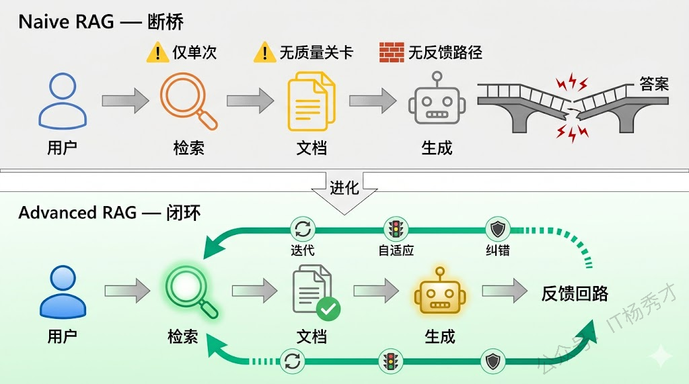
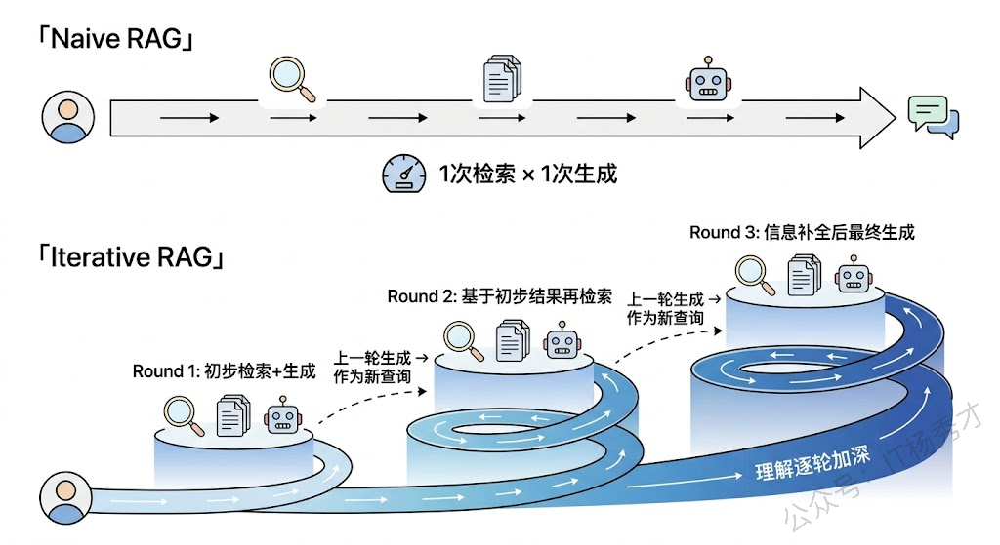
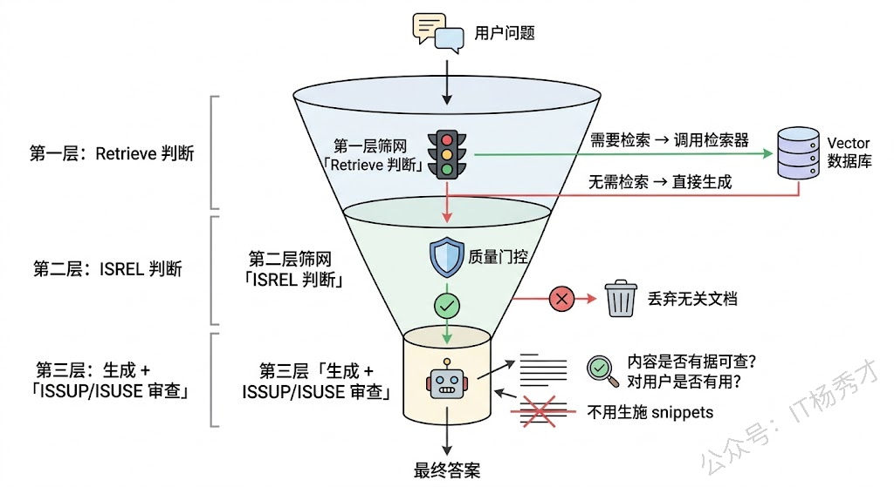
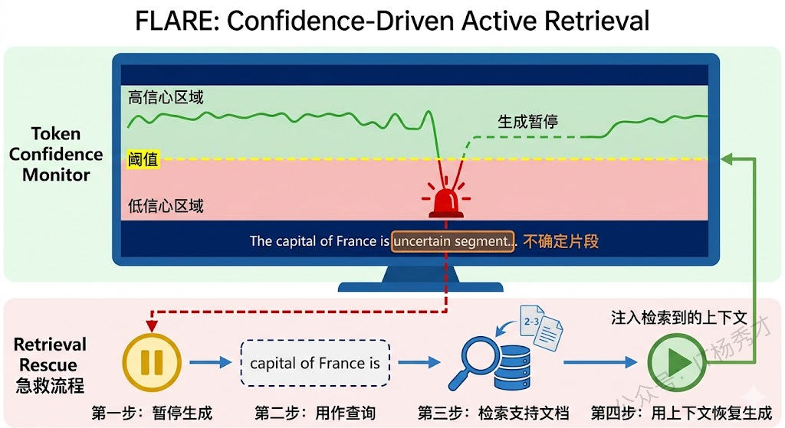
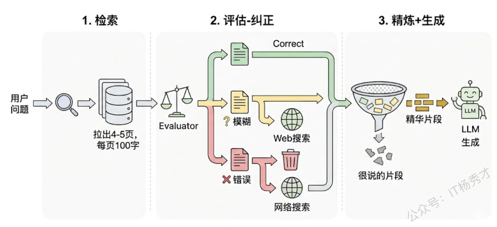
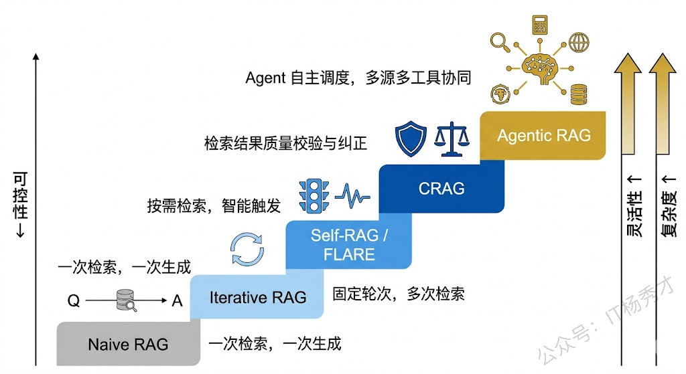

## **1. 题目分析**

先看一个例子，比如你去图书馆写一篇论文，最简单的做法是：先去书架上找几本相关的书先参考一下，然后从头写到尾。这就是传统 RAG 的工作方式——Retrieve once, then Generate。问题是，写到第三段你发现需要一个之前没想到的数据，写到第五段你发现第一次找的那本书里的信息根本不对。但你的检索机会已经用完了，这时候你很可能就只能往下编了。

这就是 Naive RAG 最致命的结构性缺陷：**检索和生成是割裂的两个阶段，检索不知道生成需要什么，生成也没法反过来要求补充检索**。面试官抛出这道题，考的就是你能不能跳出这个"一次检索、一次生成"的固化思维，去理解 RAG 系统如何演进出更精密的"检索-生成"协作模式。

### **1.1 Naive RAG 到底差在哪**

在深入各种高级范式之前，得先搞清楚 Naive RAG 的瓶颈在哪，否则后面的改进方案就成了无的放矢。

Naive RAG 的流程很直白：用户提问 → 对问题做 Embedding → 从向量数据库检索 Top-K 相关文档 → 把文档和问题一起塞进 LLM 的 Prompt → 生成回答。整条链路只有一次检索、一次生成，中间没有任何反馈回路。这带来几个实际的工程问题。

**第一，复杂问题一次检索根本不够用**。比如用户问"对比 2023 和 2024 年的新能源汽车政策变化对特斯拉中国市场份额的影响"，这个问题至少涉及三块独立的信息：两年的政策文档、特斯拉市场数据、以及二者之间的因果关系。一次检索大概率只能覆盖其中的一部分，遗漏的部分 LLM 只能靠猜——也就是幻觉。

**第二，检索质量无法验证**。Naive RAG 拿到 Top-K 就直接用，完全不评估这些文档是否真的回答了用户的问题。如果检索出来的文档跑偏了，LLM 会被错误的上下文带偏，输出的答案比不检索时可能更离谱——这就是所谓的"垃圾进，垃圾出"。

**第三，无法处理需要推理才能检索的问题**。有些问题的答案不是直接躺在某个文档里的，而是需要先推理出中间结论，再根据中间结论去检索下一步信息。这种多步推理（Multi-hop Reasoning）场景，Naive RAG 完全无能为力。

### **1.2 Iterative RAG**

打破"一次检索"限制最直觉的思路就是：多检索几次。Iterative RAG（迭代式 RAG）的核心思想是让检索和生成交替进行——先检索一批文档，生成初步内容，然后根据已生成的内容和尚未解答的部分，再发起新一轮检索，拿到补充材料后继续生成。这个循环可以迭代多轮，直到信息足够完整。

ITER-RETGEN 是这个方向的代表性工作。它在每轮迭代中，把上一轮 LLM 的生成结果作为新的检索查询的一部分，拿去检索更多相关文档。背后的直觉很朴素：模型已经生成的文本里包含了它对问题的初步理解，这些理解能帮助检索系统找到更精准的补充材料，就像你写论文写到一半，对题目的理解比刚开始深了不少，这时候再去找资料会比一开始找得更准。

迭代式的好处很明显：每一轮检索都站在前一轮的"肩膀"上，信息覆盖面随迭代次数逐步增长。但代价也很直接——每多一轮迭代就多一次检索和一次 LLM 调用，延迟和成本线性增长。而且迭代次数是预设的，不管问题简单还是复杂，都跑固定轮数，简单问题被浪费了资源，复杂问题可能轮数还不够。

这就引出一个关键键问题：**能不能让模型自己判断什么时候需要检索、什么时候不需要？**

### **1.3 Adaptive RAG 与 Self-RAG**

固定迭代次数是一种"笨"方案——不分青红皂白每次都检索。更优雅的做法是让模型学会判断：这个问题我自己就能答，还是需要外部信息支撑？

**Self-RAG** 是这个方向的标志性工作，2023 年由 Akari Asai 等人提出。它的核心设计是在 LLM 内部引入一组特殊的"反思 token"（Reflection Tokens），让模型在生成过程中实时做出三个层面的判断：

第一层，**Retrieve 判断**——当前是否需要检索？模型在生成每一个片段之前，先输出一个特殊 token 表示"需要检索"或"不需要检索"。对于事实性问题（"2024年诺贝尔化学奖得主是谁"），模型大概率会触发检索；对于创意性问题（"写一首关于春天的诗"），它可以跳过检索直接生成。

第二层，**ISREL 判断**——检索回来的文档和问题相关吗？如果模型判断检索到的文档不相关，它会丢弃这些文档，而不是被无关信息带偏。这一步相当于给检索结果加了一个质量门控。

第三层，**ISSUP 和 ISUSE 判断**——生成的内容有文档支撑吗？最终回答对用户有用吗？这是在生成之后的自我审查，确保输出不是在"编造"没有依据的信息。

Self-RAG 的巧妙之处在于，这些反思能力不是靠 Prompt Engineering 硬塞进去的，而是通过在训练数据中标注反思 token，让模型在微调过程中内化了这种"边生成边评估"的能力。效果上，Self-RAG 在多个知识密集型基准测试中超越了 Naive RAG，同时由于跳过了不必要的检索，平均延迟反而更低。

### **1.4 FLARE**

Self-RAG 通过微调让模型学会了反思，但微调本身有成本。有没有不用微调、纯靠推理策略就能实现"按需检索"的方案？FLARE（Forward-Looking Active REtrieval）给出了一个很聪明的答案。

FLARE 的核心思路是：**监控 LLM 在生成过程中的"信心水平"，一旦发现模型开始不确定了，立刻暂停生成并触发检索**。具体怎么衡量"信心"？它用的是 token 级别的生成概率。当模型生成某个 token 的概率低于设定阈值时，说明模型对这部分内容"心里没底"，此时 FLARE 会把当前正在生成的句子作为检索查询，去知识库里找支撑材料，拿到之后再继续生成。

这个设计背后的直觉非常优雅：**低概率 token 就是模型在说"我不太确定"**。与其让它在不确定的情况下硬着头皮编，不如在这个节点给它补充弹药。而且 FLARE 是"前瞻性"的——它把模型即将要说的话（而不是已经说完的话）作为检索查询，这样检索到的内容正好是当前生成所需要的。

相比 Self-RAG，FLARE 最大的优势是不需要微调模型，对任何黑盒 LLM API 都能用。但局限也很明显：它依赖 token 概率作为不确定性信号，而很多商业 API（比如 GPT-4）并不暴露逐 token 的概率信息，这限制了 FLARE 在实际工程中的适用范围。

### **1.5 Corrective RAG（CRAG）**

前面聊的几种方案主要在解决"什么时候检索"和"检索几次"的问题，但还有一个经常被忽视的环节：**检索回来的东西质量怎么保障？**

CRAG（Corrective Retrieval Augmented Generation）专门针对这个问题。它在检索和生成之间插入了一个"评估-纠正"环节：先用一个轻量评估器对检索到的每篇文档打分，根据得分把文档分成三档——"正确"、"模糊"和"错误"。对于"正确"的文档，提取关键信息后送给 LLM；对于"错误"的文档，直接丢弃，并触发外部搜索（比如调 Web Search API）来补充新的信息源；对于"模糊"的文档，两种来源的结果都用。

CRAG 的设计哲学跟 Self-RAG 有点互补：Self-RAG 是在模型内部做反思，CRAG 是在模型外部做质控。二者可以结合使用——Self-RAG 决定要不要检索，CRAG 确保检索回来的东西是可靠的。

工程上，CRAG 还有一个很实用的设计细节叫 Knowledge Refinement。它不是把检索到的整篇文档都塞给 LLM，而是先对文档做细粒度分割，把每个小片段独立评估相关性，过滤掉不相关的片段后只保留精华部分。这既减少了上下文长度（省 token），又降低了无关信息干扰 LLM 的风险。

### **1.6 Agentic RAG**

上面这些方案，不管是迭代、自适应、还是纠错，本质上都是在 RAG 的流水线里加各种"补丁"。而 Agentic RAG 的思路更彻底——干脆把整个 RAG 流程交给一个 Agent 来自主调度。

在 Agentic RAG 中，LLM 不再只是最后那个"根据文档生成回答"的角色，它同时担任决策者：决定什么时候需要检索、检索哪个知识库、检索到的结果是否满意、是否需要换个查询词重新检索、是否需要调用其他工具（计算器、代码执行器、Web 搜索）来补充信息。整个过程是一个 ReAct 式的循环——思考当前状态、选择行动、观察结果、继续思考。

这种范式的灵活性是最强的。比如面对"特斯拉和比亚迪 2024 年在欧洲市场的销量对比"这种问题，Agentic RAG 可以：先检索特斯拉销量数据 → 发现内部知识库没有 → 切换到 Web Search → 拿到特斯拉数据 → 再检索比亚迪数据 → 内部知识库有 → 拿到比亚迪数据 → 调用计算工具做对比分析 → 生成最终回答。这种动态的多源检索和工具组合调用，是前面那些固定流水线方案做不到的。

当然，灵活性的代价是复杂性和可控性。Agent 的决策链越长，出错的概率越高，调试也越困难。工程上通常需要设置最大迭代次数、每步超时、以及关键节点的校验逻辑来兜底。

### **1.7 工程选型**

这些范式不存在"哪个最好"的结论，选型永远取决于具体场景的约束条件。

简单的事实查询（"某个产品的价格是多少"），Naive RAG 加上好的 Chunking 和查询改写就够了，没必要上复杂架构。需要多步推理的复杂问题（"对比两个季度的财务指标变化原因"），Iterative RAG 或 Agentic RAG 才能覆盖多块信息。对延迟敏感的在线场景，Self-RAG 和 FLARE 的按需检索可以避免不必要的检索开销。对准确性要求极高的领域（法律、医疗），CRAG 的检索纠错机制可以提供额外的安全网。

实际项目中，这些范式经常是混合使用的。比如用 Self-RAG 的思路决定是否检索，用 CRAG 的思路校验检索结果，最后用 Agentic RAG 的框架来编排整个流程——这种组合式的方案在生产环境中最为常见。

***

## **2. 参考回答**

传统 RAG 的"先检索后生成"是一个单向流水线，检索和生成之间没有反馈回路，这在处理复杂问题时会暴露出信息覆盖不全、检索质量无法验证等结构性缺陷。针对这些缺陷，业界演化出了几种更精密的范式。

最直接的改进是 Iterative RAG，让检索和生成交替迭代多轮，每轮把上一轮的生成结果融入下一轮的检索查询，逐步加深对问题的理解和信息覆盖。但固定轮次比较粗放，更优雅的方案是自适应检索——Self-RAG 通过微调让模型内化了反思能力，在生成过程中实时判断是否需要检索、检索结果是否相关、生成内容是否有据可查；FLARE 则不需要微调，它监控生成过程中每个 token 的置信度，一旦概率跌破阈值就主动触发检索，相当于模型"心里没底"的时候自动去查资料。在检索质量保障方面，CRAG 在检索和生成之间插入了评估纠正环节，对检索到的文档打分分档，丢弃错误文档并通过 Web 搜索补充，再做细粒度的知识精炼。最彻底的是 Agentic RAG，直接用 Agent 来自主调度整个检索生成流程，动态决定检索哪个数据源、是否换查询词重试、是否调用其他工具辅助。
在实际项目中，这些范式往往是组合使用的，比如用自适应策略决定检索时机，用 CRAG 的思路做结果校验，用 Agent 框架编排整体流程。选型上没有银弹，关键是根据问题复杂度、延迟要求和准确性需求来匹配合适的范式。

## **学习交流**

> 如果您觉得文章有帮助，可以关注下秀才的<strong style="color: red;">公众号：IT杨秀才</strong>，后续更多优质的文章都会在公众号第一时间发布，不一定会及时同步到网站。点个关注👇，优质内容不错过

