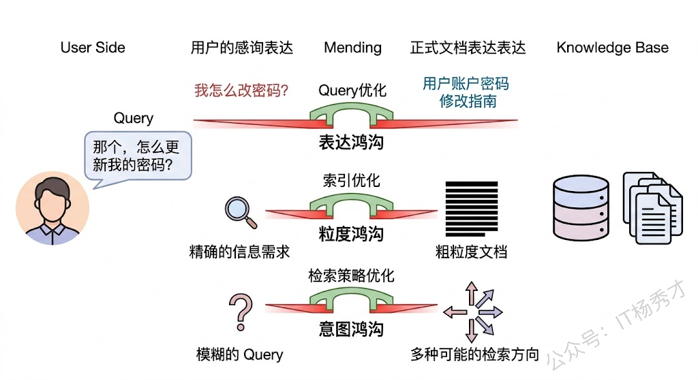
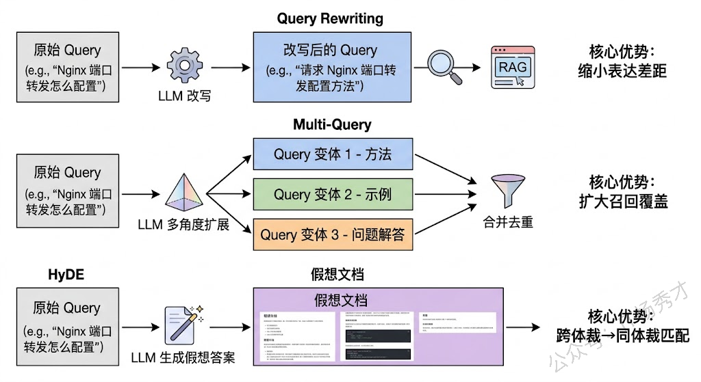
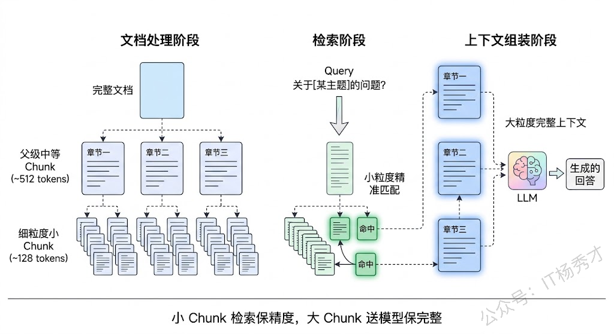
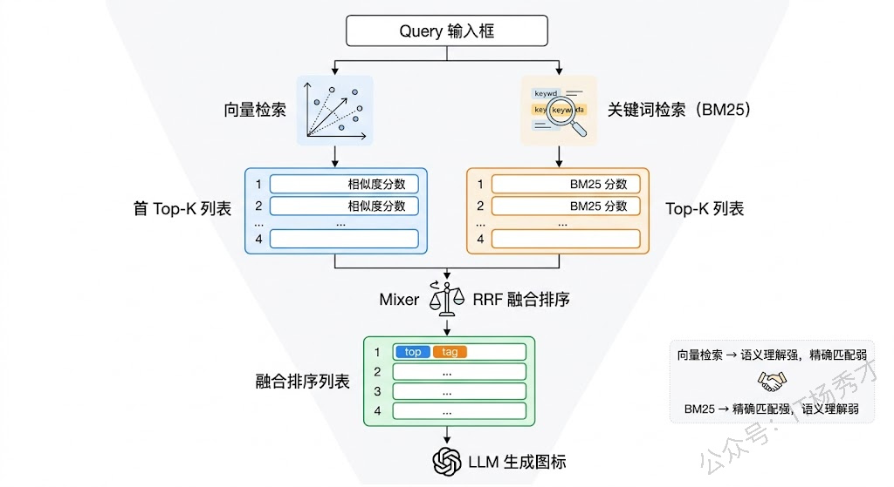
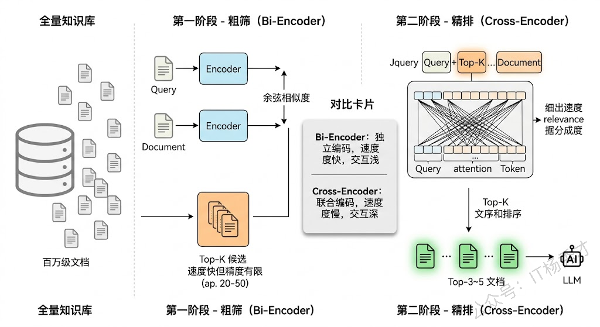
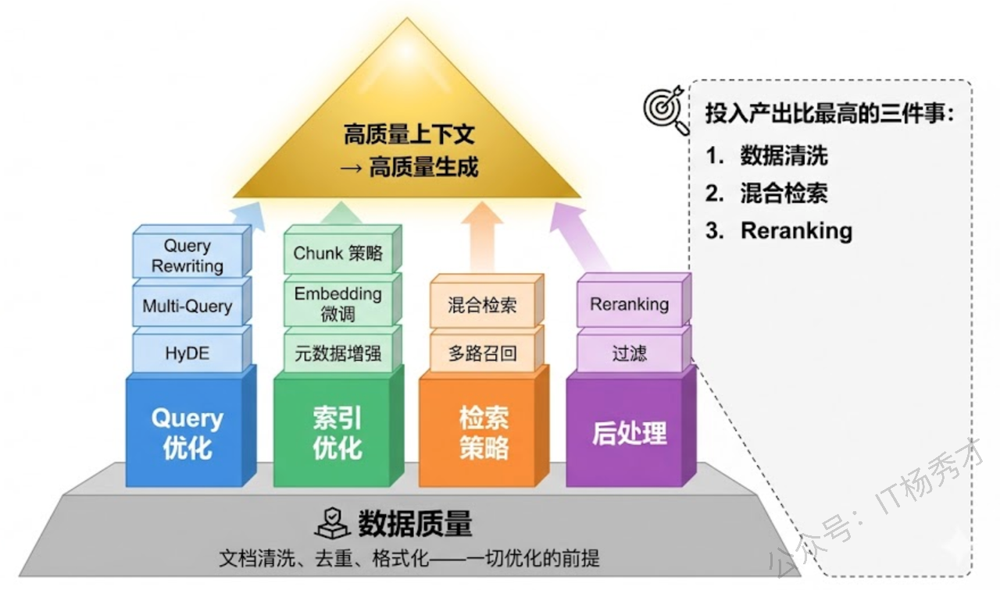

## **1. 题目分析**

RAG 系统里最容易被低估的环节，恰恰是检索。很多人把精力花在 Prompt 调优或者换更强的生成模型上，结果发现效果依然不理想——问题根本不在生成端，而是检索端喂进去的上下文就是错的。垃圾进，垃圾出，这个道理在 RAG 中体现得淋漓尽致。所以这道题实际上切中了 RAG 工程化落地中最关键的痛点：**你怎么确保从知识库里捞出来的内容，真的是回答用户问题所需要的那些？**

要把这个问题讲透，我们需要先搞清楚检索"不正确"到底是怎么发生的，然后再分层去看有哪些手段可以在各个环节做优化。

### **1.1 检索失败的根因**

RAG 检索出错，表面上看是"找的内容不对"，但背后的原因可以归纳为三重鸿沟。

**第一重是表达鸿沟**。用户问问题的方式和知识库中存储答案的表述方式往往差异很大。用户可能问"模型老是胡说八道怎么办"，但知识库里的文档写的是"大语言模型幻觉问题的缓解策略"。语义上它们讲的是同一件事，但在 Embedding 空间中这两段文本的向量可能距离不近，因为一个是口语化的提问，一个是学术化的陈述。

**第二重是粒度鸿沟**。用户的问题通常指向一个具体的点，但知识库中的文档可能是一篇长文，真正相关的内容只占其中一两段。如果 Chunk 切得太大，检索回来的片段里有效信息密度低，会被大量无关内容稀释；切得太小，又可能把一个完整的论述拆散，失去上下文导致语义不完整。

**第三重是意图鸿沟**。用户的 Query 往往是简短甚至模糊的，背后真正的信息需求并没有被完整表达出来。比如用户问"Transformer 的注意力机制"，他到底是想了解原理？还是想看代码实现？还是想知道和 RNN 的对比？Query 本身没有给出足够的信息来精确定位检索方向。

理解了这三重鸿沟，我们就能更有针对性地讨论各种优化手段了——每一种方法，本质上都在试图弥合其中一道或多道鸿沟。

### **1.2 Query 侧优化**

最直接的优化思路是改造用户的 Query——既然原始 Query 和知识库之间存在表达和意图上的鸿沟，那就在检索之前把 Query 变换成更容易命中目标的形式。

**Query Rewriting（查询改写）** 是最基础也最有效的手段之一。做法是在检索前用 LLM 对用户的原始 Query 进行一次改写，让它在保持语义不变的前提下更接近知识库的表述风格。比如把"模型老是胡说八道怎么办"改写成"如何减少大语言模型的幻觉输出"。改写后的 Query 在 Embedding 空间中会更贴近知识库文档的向量表示，从而提高召回率。改写可以是简单的风格转换，也可以是更深层次的语义补全——比如把一个代词指代不清的追问（"它为什么会这样？"）结合上下文补全成一个独立完整的问题。

**Multi-Query（多查询扩展）** 则走得更远一步。它不是把 Query 改写成一个更好的版本，而是让 LLM 从不同角度生成多个变体 Query，每个变体侧重不同的方面，然后分别用这些 Query 去检索，最后合并去重结果。这背后的直觉很朴素：一个 Query 只能从一个角度"照亮"知识库，多个 Query 就像从多个方向打了探照灯，照到的范围自然更大。比如用户问"如何优化 RAG 系统"，LLM 可能生成"RAG 检索阶段的优化技巧"、"RAG 系统中 Chunk 策略的最佳实践"、"提升 RAG 生成质量的方法"三个变体，各自检索的结果取并集，能覆盖更多相关文档。

**HyDE（Hypothetical Document Embeddings）** 是一种更巧妙的思路。它不去改写 Query，而是让 LLM 直接为这个 Query 生成一个"假想的理想答案文档"。注意这个答案可能在事实上不准确——但没关系，关键在于它在文体和表述方式上和知识库中的真实文档非常接近。然后用这个假想文档的 Embedding 去检索，相当于"用文档找文档"，比"用问题找文档"在向量空间中的匹配度天然更高。这个方法直接攻克了表达鸿沟——它本质上把 Query-Document 的跨体裁匹配问题，转化成了 Document-Document 的同体裁匹配问题。

### **1.3 索引侧优化**

Query 侧的优化是"改造问题去适应知识库"，索引侧的优化则是反过来——"改造知识库去适应问题"。这一层的工作发生在离线的数据预处理阶段，效果往往更根本性。

**Chunk 策略**是索引优化的核心问题。最朴素的做法是按固定长度切（比如每 512 个 token 一个 Chunk），但这完全无视文档的语义结构，经常把一段完整的论述从中间劈开。更合理的方式是**基于语义边界切分**——按段落、按章节、或者用 LLM / 句子相似度检测来找到语义转折点，确保每个 Chunk 内部是一个自洽的信息单元。

进一步的优化是**多层级 Chunk 组织**。一种经典方案叫"小 Chunk 检索，大 Chunk 喂模型"——检索时用小粒度的 Chunk（比如 128 token）来保证精准匹配，命中之后再把这个小 Chunk 所在的上级大 Chunk（比如整个段落或整页）送给 LLM 作为上下文，兼顾了检索精度和上下文完整性。LangChain 中的 Parent Document Retriever 就是这个思路的实现。

**Embedding 模型的选择和微调**同样至关重要。通用的 Embedding 模型（如 OpenAI 的 text-embedding-3 或开源的 BGE 系列）在大多数场景下都不错，但如果你的知识库是某个高度专业化的领域（比如医学文献、法律条文、金融研报），通用模型对领域术语的理解可能不够精准。这时候用领域内的问答对数据对 Embedding 模型做微调，可以显著提升检索效果。微调的本质是让模型把领域内语义相近的概念在向量空间中拉得更近。

**元数据增强**是一个常被忽视但非常实用的手段。在构建索引时，除了文本本身的 Embedding，还可以为每个 Chunk 附加结构化的元数据——比如来源文档的标题、章节层级、文档类型、时间戳、作者等。检索时结合元数据做过滤，可以大幅减少无关结果。比如用户问"2024 年最新的 GPT-4 技术报告说了什么"，在向量检索之前先用时间戳和文档类型过滤一遍，能去掉大量年份不对的噪声文档。

### **1.4 检索策略侧优化**

前面两层分别优化了"问什么"和"在哪找"，这一层则是优化"怎么找"。

**混合检索（Hybrid Search）** 可能是投入产出比最高的单一优化手段。纯向量检索擅长语义匹配，但对精确关键词匹配反而不灵敏——用户搜一个特定的 API 名称或错误码，向量检索可能给你返回一堆语义相关但不包含那个精确词的结果。传统的关键词检索（如 BM25）恰好相反，它对精确匹配非常敏感，但理解不了同义词和语义关联。混合检索把两者结合起来，同时用向量检索和 BM25 各跑一遍，然后用 **RRF（Reciprocal Rank Fusion）** 等算法将两路结果融合排序。这样既能捕获语义相似的内容，又不会漏掉精确匹配的关键词结果。实际工程中，几乎所有成熟的 RAG 系统都在用混合检索，效果提升非常稳定。

**多路召回（Multi-Route Retrieval）** 是混合检索思想的进一步延伸。除了向量和关键词两路，还可以引入更多召回源——比如知识图谱检索（适合实体关系类的问题）、SQL 查询（适合结构化数据中的精确查找）、甚至全文搜索引擎（如 Elasticsearch）。不同的召回源擅长处理不同类型的问题，多路并行可以提高整体的召回覆盖率。

### **1.5 Reranking**

即使经过了前面所有的优化，初次检索返回的 Top-K 结果中仍然可能混入不相关的文档。这时候就需要一个"精筛"步骤——**Reranking（重排序）**。

Reranking 的工作原理和初次检索有一个关键区别。初次检索（无论是向量检索还是关键词检索）为了效率必须把 Query 和每个文档独立编码，然后比较它们的向量——这是一种 **Bi-Encoder** 架构，速度快但交互不够深。Reranker 则采用 **Cross-Encoder** 架构，它把 Query 和候选文档拼接成一个序列一起送进模型，让 Query 和文档中的每个 token 都能充分交互注意力，从而做出更精确的相关性判断。代价是速度慢——所以只对初次检索返回的少量候选（通常 Top-20 到 Top-50）做重排，而不是对整个知识库做。

这个"粗筛+精排"的两阶段架构在搜索和推荐领域已经是标准范式了。在 RAG 中，加一层 Reranking 通常能让最终送给 LLM 的上下文质量提升一个台阶。常用的 Reranker 包括 Cohere Rerank API、BGE-Reranker、以及用 LLM 本身做 Reranking（让 LLM 对每个候选打相关性评分）。

### **1.6 数据质量**

最后要提一点：上面所有的花哨技术，都建立在一个前提之上——**你的源数据本身质量要过关**。如果灌进知识库的文档充满格式混乱、内容重复、信息过时、甚至互相矛盾的问题，那无论检索策略多先进，捞出来的还是垃圾。

实际项目中，数据清洗和预处理往往占到 RAG 系统建设工作量的一半以上。这包括：去除 PDF 转文本时产生的乱码和格式噪声；合并内容重复的文档避免同一信息在知识库中存在多个版本；识别并标注过时内容的时效性；对表格、图片等非文本内容做结构化提取。很多团队在这一步投入不足，然后花大量精力在检索策略上调参，这属于方向性的资源错配。

***

## **2. 参考回答**

提高 RAG 检索正确率这件事，我一般从四个层面来系统思考。

首先是 **Query 层面的优化**。用户的原始查询往往和知识库的表述风格差距很大，我们在实际项目中会用 LLM 对 Query 做改写，让它更贴近文档的表达方式。更进一步的做法是 Multi-Query，让 LLM 从不同角度生成多个查询变体分别检索再合并结果，相当于多个角度去捞。还有一个比较巧妙的技巧叫 HyDE，直接让 LLM 生成一个假想的答案文档，然后用这个文档的 Embedding 去检索，把问题找文档变成文档找文档，在向量空间中的匹配效果更好。

第二个层面是**索引和文档处理**。Chunk 策略非常关键，我们的经验是不能简单按固定长度切，要根据文档的语义结构来切分。工程上常用的一个方案是"小 Chunk 检索、大 Chunk 喂模型"，检索时用细粒度保证精准命中，生成时用它的父级 Chunk 保证上下文完整。另外如果是垂直领域，对 Embedding 模型做微调能带来明显的效果提升。

第三个层面是**检索策略**。我认为投入产出比最高的是混合检索——同时用向量检索和 BM25 关键词检索，通过 RRF 融合排序，因为两者在能力上是互补的：向量检索擅长语义匹配，BM25 擅长精确关键词匹配。

第四个层面是 **Reranking**。初次检索返回的 Top-K 结果用 Cross-Encoder 做一轮重排序，Cross-Encoder 让 Query 和文档的每个 token 充分交互，相关性判断比 Bi-Encoder 精细得多。加这一层通常能显著提升最终送给 LLM 的上下文质量。

当然，所有这些技术手段都有一个前提——源数据本身的质量要过关。实际项目中数据清洗往往占一半以上的工作量，文档质量不行的话再好的检索策略也救不回来。

## **学习交流**

> 如果您觉得文章有帮助，可以关注下秀才的<strong style="color: red;">公众号：IT杨秀才</strong>，后续更多优质的文章都会在公众号第一时间发布，不一定会及时同步到网站。点个关注👇，优质内容不错过

