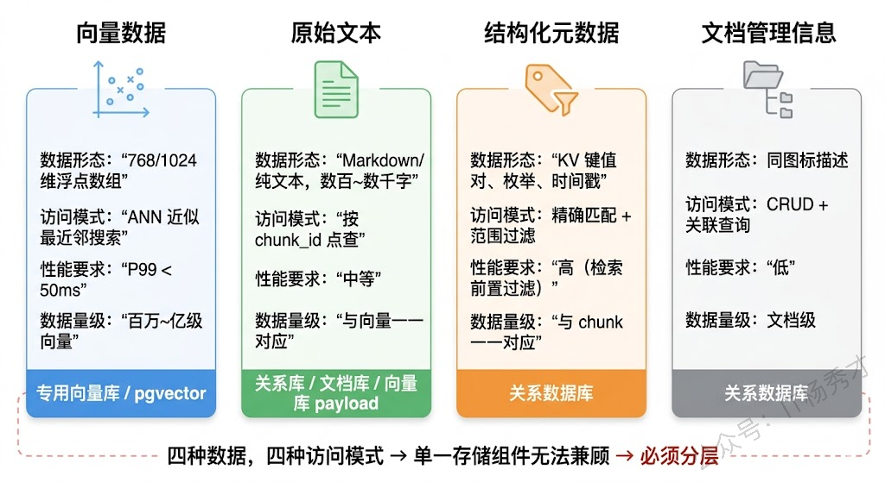
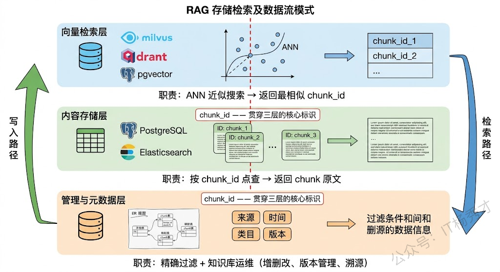
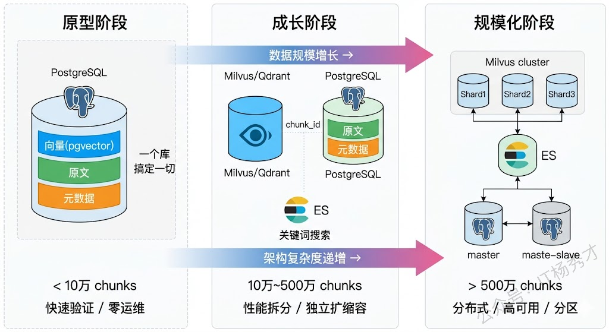
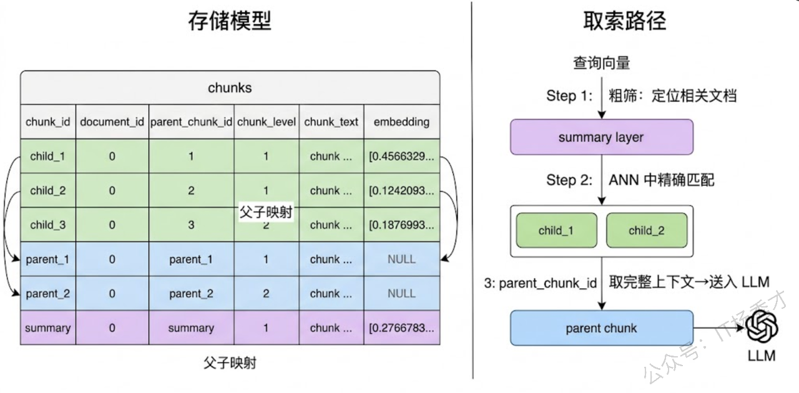
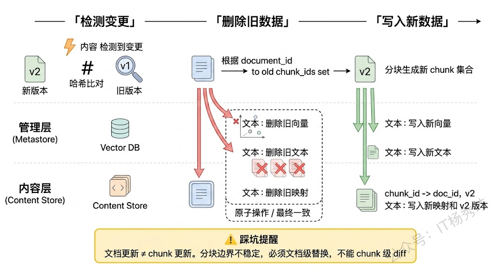
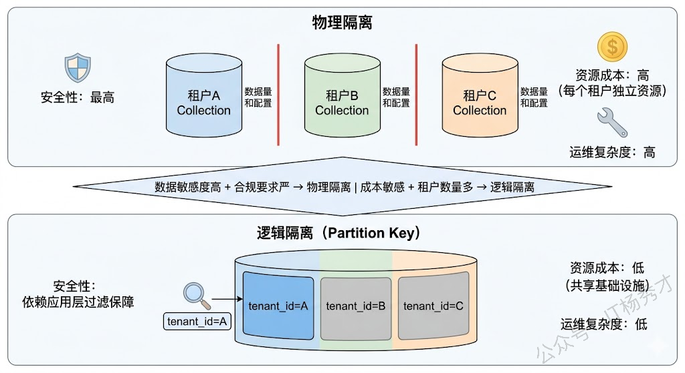

## **1. 题目分析**

RAG 系统里最容易被低估的就是存储层。很多人把 RAG 理解成"文档切片→扔进向量库→检索→喂给 LLM"的线性流水线，存储仿佛只是中间一个"放东西的地方"。但真正做过生产级 RAG 的人都知道，存储架构的设计深度远超一个向量数据库的选型——你需要想清楚：**哪些数据存哪里、不同存储组件之间怎么协作、怎么兼顾检索性能和数据管理、怎么支撑业务不断增长的知识规模。** 这些问题的回答方式，直接暴露你是"调了个 Demo"还是"真正设计过一套系统"。

面试官听这道题的时候，脑子里有一张架构图——他期待你也能画出一张。不是 RAG 原理图，是你项目里存储层的组件拓扑：有几类存储、各自承担什么职责、数据怎么流转、为什么这么分。

### **1.1 一种存储搞不定所有需求**

要理解 RAG 存储架构为什么要分层，得先看清楚 RAG 系统里到底有哪些类型的数据需要存储，以及它们各自的访问模式有多不同。

最显而易见的是**向量数据**——每个文档 chunk 经过 Embedding 模型编码后生成的高维向量，用于语义相似度检索。向量数据的访问模式非常独特：写入是批量的（一次性灌入大量文档），读取是近似最近邻搜索（ANN），要求毫秒级延迟返回 Top-K 结果。这种访问模式需要专门的索引结构（HNSW、IVF 等）来支撑，传统的 B-Tree 或哈希索引在这个场景下完全无用。

但只有向量远远不够。每个 chunk 还有对应的**原始文本**——这是最终要塞进 LLM Prompt 的内容。向量库检索返回的是"最相似的 chunk ID"，你还得拿着这个 ID 去取回原文。有些向量数据库（如 Milvus、Qdrant）支持在向量旁边附带存储 payload/原文，但当 chunk 文本很长或者需要存储多种格式（Markdown 原文、清洗后纯文本、HTML 渲染版本）时，把所有内容都塞进向量库不是好主意——会严重影响向量索引的内存效率和构建速度。

还有**结构化元数据**——文档来源、作者、创建时间、所属部门、知识类目、版本号、权限标签等。这些元数据的访问模式是精确查询和范围过滤（"只看法务部门的文档"、"只看2024年之后的"），这恰恰是关系数据库的强项，向量库在这方面先天不足。

最后是**文档级的管理信息**——原始文件的存储路径、文档和 chunk 之间的父子关系、chunk 之间的前后顺序关系、文档的解析状态和版本记录。这些信息和检索无关，但对知识库的日常运维（增删改查文档、追溯 chunk 来源、支撑增量更新）至关重要。

这四类数据的访问模式、性能要求、存储特性完全不同。试图用单一存储组件搞定所有需求，结果一定是哪个需求都满足得不好。这就是 RAG 存储架构必须分层的根本原因。

### **1.2 典型的三层存储架构**

理解了为什么要分层，就可以来看实际项目中最常见的存储架构了。大多数生产级 RAG 系统的存储层都可以归结为**三层结构：向量检索层、内容存储层、管理与元数据层**。三层各司其职，通过 chunk\_id 和 document\_id 这两个核心标识串联在一起。

**向量检索层**是整个架构中对性能要求最高的部分，它只负责一件事：根据查询向量快速找到最相似的 chunk\_id。这一层的核心是向量数据库和它的索引结构。具体选型上，专用向量库（Milvus、Qdrant、Weaviate）在大数据量下的性能和稳定性最好，Milvus 支持分布式部署、数据分片和多种索引策略（HNSW 适合高召回场景，IVF\_PQ 适合内存受限场景），是千万级以上向量规模的首选。如果规模在百万以下且团队已有 PostgreSQL 基础设施，pgvector 插件是性价比极高的方案——一个数据库同时承担向量检索和结构化存储的角色，少一个运维组件就少一份心智负担。Weaviate 的特色在于原生支持混合检索（向量 + BM25），适合对关键词精确匹配有强需求的场景。

**内容存储层**负责存放 chunk 的原始文本和解析后的结构化内容。最常见的做法是直接用关系数据库（PostgreSQL/MySQL）的一张 chunk 表来存：chunk\_id 主键、chunk\_text 存原文、document\_id 外键关联到文档表。也有团队把原文存在向量库的 payload 字段里，省去一次跨库查询——但这会增加向量库的存储压力，而且当你需要对原文做全文搜索、正则匹配这类操作时，向量库的 payload 查询能力就捉襟见肘了。另一种常见方案是用 Elasticsearch 同时承担原文存储和 BM25 关键词检索的角色，一石二鸟。

**管理与元数据层**用关系数据库来实现是最自然的选择。这一层通常包含几张核心表：**文档表**（document\_id、文件名、来源、上传时间、解析状态、版本号）、**chunk 元数据表**（chunk\_id、document\_id、在文档中的位置序号、chunk 类型标记、标题层级路径、业务标签）、以及**document-chunk 映射表**（维护父子关系，支撑多级索引和增量更新时的批量删除）。这些表看起来普通，但对知识库的长期运维极其重要——当你需要"删除某份过期文档的所有 chunk"或者"查看某个回答引用了哪篇文档的第几个段落"时，没有这层管理信息就寸步难行。

三层之间的数据流是这样的：文档入库时，原始文件经解析分块后，chunk 文本写入内容存储层，对应的向量写入检索层，元数据和文档信息写入管理层，三处共用同一个 chunk\_id。检索时方向反过来——查询向量在检索层做 ANN 搜索拿到 chunk\_id 列表，再分别去内容层取原文、去管理层取元数据用于后续过滤和溯源。

### **1.3 不同规模下的架构演进**

存储架构不是一步到位的，它应该随着数据规模和业务复杂度的增长而演进。一上来就搞一套"大而全"的分布式架构，既浪费资源也增加了维护成本。反过来，只用一个 SQLite 或 ChromaDB 撑着也走不远。理解架构在不同阶段该长什么样，是面试中非常有区分度的一个点。

**早期/原型阶段（< 10 万 chunks）**：这个阶段的核心诉求是快速验证效果。用 pgvector 把向量、原文、元数据全塞在一个 PostgreSQL 里是最务实的选择——一个 `chunks` 表搞定所有事情，字段包括 chunk\_id、document\_id、chunk\_text、embedding（vector 类型）、metadata（JSONB 类型）。检索就是一条 SQL：先 WHERE 过滤元数据，再 ORDER BY embedding 的余弦距离。一个库、一张表、一条查询，运维为零。ChromaDB 或 FAISS 也行，但它们对元数据过滤的支持弱，稍微有点业务逻辑的过滤需求就得在应用层自己写。

**成长阶段（10 万 \~ 500 万 chunks）**：pgvector 在这个量级开始出现性能瓶颈——ANN 查询延迟显著上升，尤其是在高并发场景下。这时候应该把向量检索拆出来交给专用向量库（Milvus Lite 或 Qdrant），原文和元数据继续留在 PostgreSQL。拆分的好处不只是性能：向量库可以独立扩缩容、独立调参、独立升级，不影响业务数据库的稳定性。如果业务上有 BM25 关键词检索的需求（大概率有），这时候引入 Elasticsearch 做内容存储兼关键词搜索层也是合理的。

**规模化阶段（> 500 万 chunks）**：存储架构要认真考虑分布式和高可用了。Milvus 支持分片（Sharding）和多副本，可以水平扩展到亿级向量。数据需要按业务维度做分区（按租户、按知识库、按时间），避免全量扫描。元数据层也要考虑读写分离和索引优化，避免复杂的元数据过滤查询成为性能瓶颈。

### **1.4 多级索引在存储层的落地**

存储架构设计中有一个精巧的机制值得单独拎出来说——**多级索引的存储实现**。这个机制直接影响检索质量，但它的落地本质上是个存储设计问题。

核心思想是：**检索时用细粒度的小 chunk 做匹配（精准），生成时用粗粒度的大 chunk 提供上下文（完整）**。要实现这一点，存储层需要同时维护两级 chunk，并且建立它们之间的映射关系。

具体的存储设计是这样的：chunk 表中每条记录增加两个字段——`parent_chunk_id`（指向父级 chunk）和 `chunk_level`（标记是 child 还是 parent）。Child chunk（比如 256 token）和 Parent chunk（比如 1024 token）各自独立存储，child 的 `parent_chunk_id` 指向它所属的 parent。向量检索层**只索引 child chunk 的向量**，parent chunk 不做向量索引。检索时在 child 级别做 ANN 搜索，命中后通过 `parent_chunk_id` 回溯到 parent，取 parent 的原文送给 LLM。

这个设计还可以进一步扩展到三级：在 parent 之上再加一层 **document summary**（文档摘要）。对每篇文档生成一段摘要并存储在 chunk 表中（chunk\_level = 'summary'），也做向量索引。检索时先在 summary 层做一次粗筛确定相关文档，再到这些文档的 child chunk 中做细粒度搜索。这种"先粗后细"的路由可以在知识库特别大时（比如覆盖几百份文档）显著减少无关文档的干扰。

### **1.5 索引更新**

存储架构设计中还有一个绕不开的话题——知识库更新。文档会新增、修改、删除，存储层必须有机制来应对这些变化，否则用户检索到的就是过时甚至错误的知识。

增量更新的核心难点在于**分块边界的不稳定性**。一篇文档修改了中间一段话后重新分块，新旧 chunk 的切分位置很可能完全对不上——不是简单地"某个 chunk 内容变了"，而是整篇文档的 chunk 列表都变了。所以增量更新不能做 chunk 级别的 diff，只能做**文档级别的替换**：先通过 document\_id 删除该文档的所有旧 chunk（从向量层、内容层、管理层三处都要删），再把重新分块后的新 chunk 全量写入。

这个操作对存储层的要求是：**三层存储的删除和写入必须保持一致性**。如果向量层删了但管理层没删，就会出现"幽灵元数据"；如果内容层写了但向量层没写成功，就会出现"搜不到但实际存在"的 chunk。生产环境中通常的做法是将三层的写入操作封装在一个事务或者补偿机制中——如果全在 PostgreSQL 里（pgvector 方案），天然有事务保障；如果是多库架构，就需要先写管理层记录更新任务的状态，再异步执行向量层和内容层的更新，通过状态机保证最终一致性。

另外，文档管理表中的**版本号和更新时间戳**在检索侧也有用。当同一个话题在不同版本的文档中有冲突描述时，检索策略可以基于这些元数据做时间衰减加权——越新的 chunk 排序越靠前。

### **1.6 权限隔离**

如果你的 RAG 系统面向多个用户或多个业务线（这在企业级应用中几乎是必然的），存储架构还需要考虑**数据隔离和权限控制**。

最直接的隔离方式是**按租户做物理隔离**——每个租户一个独立的向量库 Collection（Milvus 的术语）或 Namespace（Pinecone 的术语），甚至独立的数据库实例。这种方式隔离性最好、没有数据泄露风险，但运维成本高，资源利用率也低。

更常见的做法是**逻辑隔离**——所有租户的数据混在一个向量库中，但每个 chunk 的元数据里带上 `tenant_id`，检索时强制加上 `tenant_id` 的过滤条件。这种方式资源效率高，但要求向量库支持高效的元数据过滤，而且应用层必须保证不会漏掉 `tenant_id` 的过滤——一旦漏掉，就是数据越权访问的安全事故。

Milvus 的 Partition Key 机制为逻辑隔离提供了很好的底层支持：把 `tenant_id` 设为 Partition Key 后，同一个租户的数据会被自动路由到同一个 Partition 中，检索时只在对应 Partition 内搜索，既有物理隔离的性能优势，又不需要为每个租户手动创建 Collection。

***

## **2. 参考回答**

我们项目中 RAG 的存储架构是一个三层的分层设计。最上层是向量检索层，用的 Milvus，只存 chunk 的向量和 chunk\_id，专门做 ANN 搜索。中间是内容存储层，chunk 原文存在 PostgreSQL 里，同时部署了 Elasticsearch 做 BM25 关键词检索，向量和关键词两路结果用 RRF 融合。底层是管理与元数据层，也在 PostgreSQL，主要是文档表和 chunk 元数据表，记录来源、版本号、时间戳、业务标签，支撑元数据前置过滤和知识库日常运维。三层通过 chunk\_id 和 document\_id 贯穿。

在 chunk 组织上用了多级索引——256 token 的 child chunk 建向量索引用于检索，1024 token 的 parent chunk 只存原文不建索引，命中 child 后通过 parent\_chunk\_id 回溯取完整上下文送给 LLM。索引更新是文档级替换，因为重新分块后切分位置会变，没法做 chunk 级增量，检测到文档变更就通过 document\_id 把三层里的旧数据全删再写入新的，多库之间通过状态机保证最终一致性。多租户隔离用了 Milvus 的 Partition Key，按 tenant\_id 自动分区，兼顾了隔离性和资源效率。这套架构也不是一步到位的，早期用 pgvector 单库搞定所有事，数据量上来之后才拆分成现在的多组件架构。

## **学习交流**

> 如果您觉得文章有帮助，可以关注下秀才的<strong style="color: red;">公众号：IT杨秀才</strong>，后续更多优质的文章都会在公众号第一时间发布，不一定会及时同步到网站。点个关注👇，优质内容不错过

