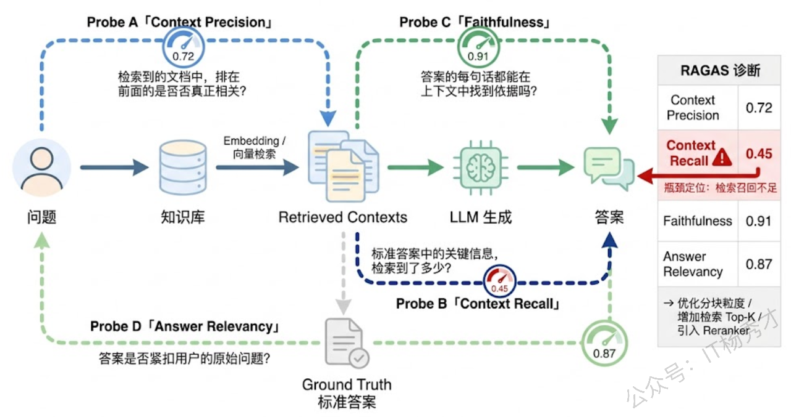
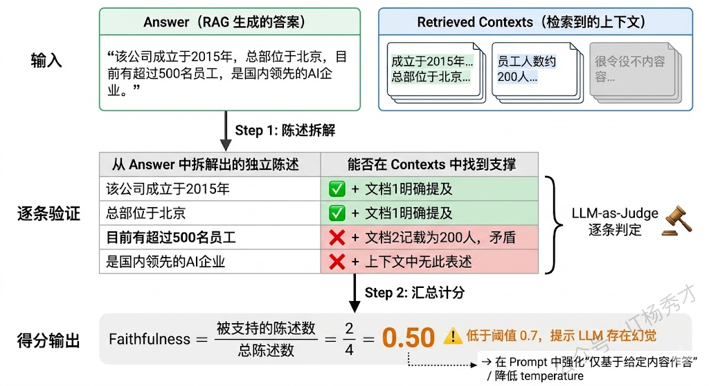
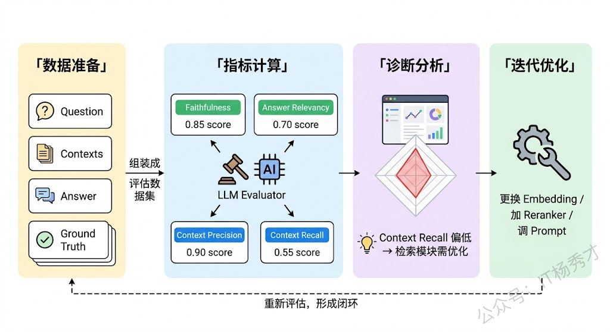
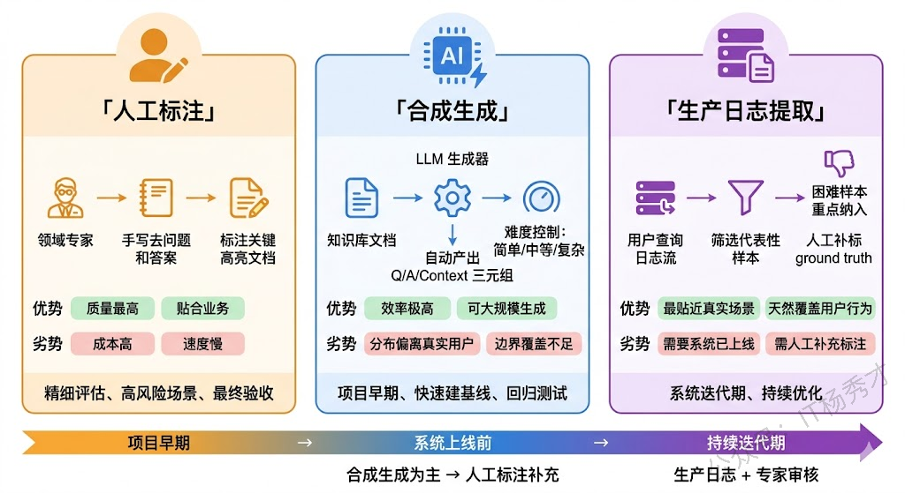
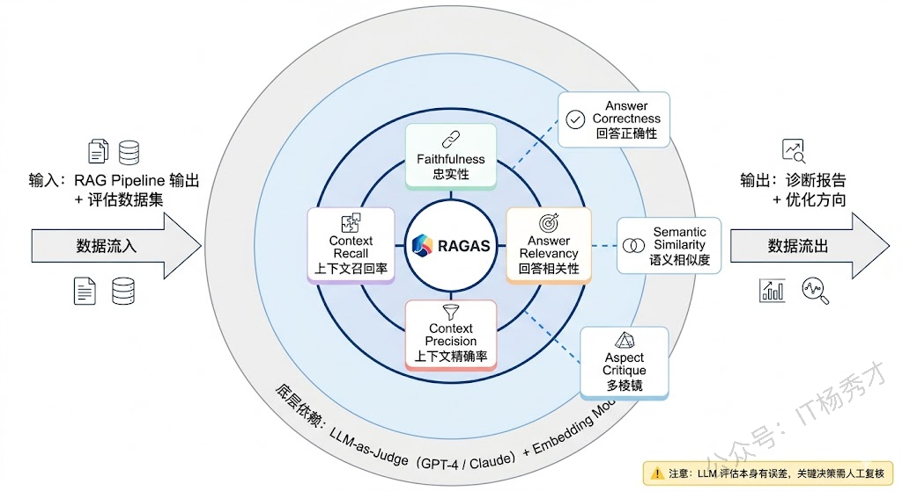

## **1. 题目分析**

做过 RAG 项目的人大概都有过这种体验：系统搭完了，效果怎么样？说好也行，说不好也行，全凭主观感觉。你觉得检索结果挺相关的，老板觉得回答不够精准；你觉得答案已经很准了，用户说漏掉了关键信息，没有一套量化的评估体系来具体量化效果到底怎么样。

RAGAS 就是为了解决这个痛点而生的。它是目前 RAG 评估领域最被广泛采用的开源框架之一，名字本身就是 **R**etrieval **A**ugmented **G**eneration **As**sessment 的缩写。但 RAGAS 的价值不仅仅在于"提供了几个评分指标"，更在于它背后的一套评估哲学——**把 RAG 系统拆解成检索和生成两个独立的环节，分别评估，精准定位瓶颈所在**。这个思路才是面试官真正想听到的东西。

### **1.1 为什么 RAG 评估这么难？**

传统 NLP 任务的评估逻辑很清晰：有标准答案，跟标准答案对比就行。机器翻译有 BLEU，文本摘要有 ROUGE，分类任务有 F1。但 RAG 系统面临的评估挑战要复杂得多，根源在于**它是一个双阶段系统，每个阶段都可能出错，而且错误会互相掩盖**。

什么意思？假设用户问了一个问题，RAG 最终给出了一个错误答案。问题出在哪？可能是检索阶段就没找到正确的文档（检索失败），也可能是检索到了正确文档但 LLM 没有正确利用（生成失败），甚至可能两个阶段都有问题。如果你只看最终答案对不对，你根本无法区分这两种故障模式，自然也就不知道该去优化检索策略还是优化 Prompt。

反过来，有时候检索阶段拉回了一堆不太相关的文档，但 LLM 凭借自身的知识储备"蒙对了"答案——这种情况在端到端评估中会显示为"通过"，但实际上你的检索模块是有问题的。下次换一个 LLM 知识覆盖不到的问题，马上就会暴露。

RAGAS 的核心设计思想就是解决这个矛盾：**不做笼统的端到端评估，而是把检索质量和生成质量拆开，用不同的指标分别衡量，让你精确知道系统的短板在哪里**。

### **1.2 RAGAS 的四大核心指标**

RAGAS 框架定义了四个核心评估指标，恰好覆盖了检索和生成两个环节的质量维度。理解这四个指标之间的关系，比死记每个指标的计算公式重要得多。

**Faithfulness（忠实度）** 衡量的是：生成的答案有没有"编东西"？具体来说，它检查答案中的每一个陈述（statement）是否都能从检索到的上下文（context）中找到支撑。Faithfulness 高意味着答案"言之有据"，低则意味着 LLM 出现了幻觉——答案里有些话是模型自己编的，在检索到的文档里根本找不到依据。

> 它的计算逻辑分两步：先让 LLM 把答案拆解成若干个独立的事实陈述（比如"公司成立于2015年""总部位于北京"），然后逐一检验每个陈述是否能被上下文支持。最终得分 = 被支持的陈述数 / 总陈述数。这个指标不关心答案是否正确，只关心答案是否"忠于检索到的材料"——就像判断一个学生写论文时有没有乱编引用，而不是判断论文观点对不对。

**Answer Relevancy（答案相关性）** 衡量的是：答案有没有"跑题"？它检查生成的答案与用户原始问题之间的语义对齐程度。一个高 Answer Relevancy 的回答应该紧扣问题、不含多余信息、不偏离主题。

它的实现方式很巧妙：不是直接比较问题和答案的相似度，而是**反向生成**——给定答案，让 LLM 生成若干个"这个答案可能在回答什么问题"的候选问题，然后计算这些候选问题与原始问题的语义相似度（用 Embedding 余弦相似度）。如果候选问题和原始问题高度一致，说明答案确实在回答用户的问题；如果偏差很大，说明答案跑题了。这种反向验证的思路比直接做问答语义匹配要鲁棒得多。

**Context Precision（上下文精确率）** 衡量的是：检索回来的文档中，有多少是真正有用的？如果检索返回了 5 个文档片段，其中只有 1 个真正包含回答问题所需的信息，其他 4 个都是噪声，那 Context Precision 就很低。更进一步，RAGAS 不仅关心"有多少是相关的"，还关心**相关文档的排名位置**——相关文档排在前面比排在后面得分更高，因为 LLM 通常对排在前面的上下文关注度更高。

**Context Recall（上下文召回率）** 衡量的是：回答问题所需的信息有没有被检索到？它把标准答案（ground truth）拆解成若干个关键信息点，然后检查这些信息点在检索到的上下文中能找到多少。Context Recall 低意味着检索模块"漏掉"了关键文档，即使生成模块再强也巧妇难为无米之炊。

### **1.3 评估流程：LLM-as-Judge 的自动化闭环**

理解了指标之后，一个自然的问题是：这些评分是怎么算出来的？靠人工标注吗？如果每次迭代都要人工评估，那效率也太低了。

RAGAS 的核心技术手段是 **LLM-as-Judge**——用一个 LLM（比如 GPT-4 这类强模型）来充当评估者，对 RAG 系统的输出进行自动化打分。整个评估流程可以拆成四步。

**第一步：准备评估数据集**。每条评估样本需要包含四个要素：用户问题（question）、检索到的上下文列表（contexts）、RAG 系统生成的答案（answer）、以及标准参考答案（ground truth）。其中前三个是 RAG 系统实际运行的产出，ground truth 是预先标注的"正确答案"。值得注意的是，并非所有指标都需要 ground truth——Faithfulness 和 Answer Relevancy 不需要，它们只看问题、上下文和答案之间的关系；但 Context Recall 必须有 ground truth 才能计算，因为它需要知道"完整正确的答案包含哪些信息点"。

**第二步：逐指标计算**。对数据集中的每条样本，RAGAS 会分别计算四个指标的得分。以 Faithfulness 为例，RAGAS 先用 LLM 将答案分解为独立陈述，再用 LLM 逐一判断每个陈述是否有上下文支持，最终汇总为 0-1 之间的分数。不同指标的内部计算逻辑不同，但都依赖 LLM 来做语义层面的判断，而非简单的字符串匹配。

**第三步：聚合与分析**。所有样本的得分聚合后，你会得到每个指标的整体分布和均值。关键不只是看"总分高不高"，而是看**指标之间的对比关系**：如果 Context Recall 很高但 Faithfulness 很低，说明检索到了正确信息但 LLM 没有忠实使用，问题出在生成端；如果 Faithfulness 很高但 Context Recall 很低，说明 LLM 很忠实但检索没找对，问题出在检索端。这种交叉诊断能力正是 RAGAS 分指标设计的价值所在。

**第四步：迭代优化**。根据诊断结果针对性调整，然后重新跑评估，形成闭环。比如发现 Context Precision 低（检索噪声多），就去优化分块策略或加一层 Reranker；发现 Faithfulness 低（LLM 幻觉多），就在 Prompt 中强化"仅基于给定上下文作答"的指令。

### **1.4 评估数据的获取与构造**

很多人一听到 RAGAS 就去研究指标怎么算、代码怎么调，却忽略了一个更基础的问题：**评估数据集从哪来？** 没有高质量的评估数据，指标算得再精确也没有意义。这其实是整个 RAG 评估中最费力、也最容易出问题的环节。

**方式一：人工标注**。最传统也最可靠的方式。领域专家根据知识库内容，手工编写问题、提供标准答案，有时还会标注哪些文档片段是回答该问题的关键上下文。优点是数据质量高、贴合真实业务场景；缺点也很明显——成本高、速度慢、难以规模化。一个中等复杂度的 RAG 项目，要积累几百条高质量的标注数据往往需要几周时间。实际操作中有个经验：**先让 RAG 系统跑一批真实用户问题，然后让标注人员在系统的输出基础上修正，而不是从零开始写标准答案**。这样既减少了标注工作量，又能让评估数据更贴近系统的实际表现分布。

**方式二：RAGAS 自带的合成数据生成**。这是 RAGAS 框架的一个亮点功能。它可以基于你的知识库文档，用 LLM 自动生成 question-context-answer-ground\_truth 的完整评估样本。生成过程大致是：先从文档中抽取关键信息片段，然后让 LLM 基于这些片段构造问题，再生成对应的标准答案。RAGAS 还支持控制生成问题的难度分布——简单的事实性问题、需要跨段落推理的复杂问题、需要多跳检索的问题等，可以按比例混合生成。

> 合成数据的最大优势是**效率高、可大规模生成**，适合在项目早期快速搭建一个基线评估集。但它有一个不可忽视的局限：合成问题的分布可能和真实用户的提问习惯差距很大。用户会问很多"奇怪的"问题——措辞不规范、指代模糊、包含错别字、问到知识库边界之外的内容——这些在合成数据中很难覆盖到。

**方式三：从生产日志中提取**。如果 RAG 系统已经上线运行，用户的真实查询日志是一座金矿。从日志中筛选出有代表性的 question，配合人工标注 ground truth，就能构建出最贴近真实场景的评估数据集。还可以结合用户的隐式反馈（如点击率、追问率、负面反馈）来标记哪些 case 是系统表现不好的"困难样本"，重点纳入评估集。

实际项目中最稳妥的做法是**三种方式组合使用**：先用合成数据快速搭建基线，再用生产日志补充真实分布，最后由领域专家做质量审核和边界 case 补充。评估数据集不是一次性的产物，而是随着系统迭代持续更新的活文档。

### **1.5 RAGAS 的进阶能力**

除了上面四个核心指标，RAGAS 在后续版本中还扩展了一些进阶评估维度，了解这些在面试中能展现你对框架掌握的深度。

**Answer Correctness（答案正确性）** 是一个端到端的指标，它直接衡量生成答案与 ground truth 之间的一致程度，综合了语义相似度和事实性重叠两个维度。这个指标更接近"用户感知"——用户不关心你的检索质量还是生成质量，只关心最终答案对不对。

**Answer Semantic Similarity（答案语义相似度）** 用 Embedding 计算生成答案与 ground truth 之间的语义距离，是一个更轻量的正确性衡量方式。

**Aspect Critique（多维度批评）** 允许你自定义评估维度，比如答案是否有害、是否包含敏感信息、是否符合特定的语气要求等。这在企业级应用中非常实用，因为不同业务场景对答案质量的定义可能差异很大。

另外值得一提的是，RAGAS 的评估本身也有局限性。它高度依赖 LLM-as-Judge 的判断质量，而这个"裁判"本身也可能犯错——对于细微的语义差异、领域专业知识的准确性判断，LLM 的评估未必比人类专家靠谱。工程上的应对方式是：**在关键决策点（如版本上线前）用 RAGAS 做初筛，然后对低分样本做人工复核**，而不是完全信任自动化评估的结果。

### **1.6 工程实战**

最后补充几个在实际项目中使用 RAGAS 的实战经验，这些在面试中提到会非常加分。

**评估数据集的规模问题**。很多人觉得评估集越大越好，实际上对于大部分 RAG 项目，200-500 条高质量的评估样本就足够支撑日常迭代了。关键是样本要覆盖足够多的**问题类型**——事实查询、比较推理、多文档综合、否定查询（"哪些条件不满足？"）、时效性问题等。覆盖度比数量重要。

**评估成本的控制**。RAGAS 的每次评估都需要大量 LLM 调用（每条样本、每个指标都需要至少一次 LLM 调用），评估一个 500 条样本的数据集可能要花好几美元的 API 费用。常见的优化方式是在日常开发中用小模型（如 GPT-3.5）做快速评估，只在版本发布前用 GPT-4 做精确评估。

**和 CI/CD 的集成**。成熟的 RAG 团队会把 RAGAS 评估嵌入持续集成流程——每次修改检索策略、更新知识库或调整 Prompt 后，自动触发评估并和上一个版本对比。如果核心指标下降超过阈值就阻断发布。这是 RAG 系统走向工程化成熟的标志。

***

## **2. 参考回答**

RAGAS 是目前 RAG 评估领域最主流的开源框架，它的核心设计理念是把 RAG 系统拆成检索和生成两个环节分别评估，这样能精准定位瓶颈所在，而不是只看端到端结果。它定义了四个核心指标：检索端有 Context Precision 衡量检索结果中有多少是真正有用的、Context Recall 衡量回答所需的关键信息有没有被检索到；生成端有 Faithfulness 检查答案是否忠实于检索到的上下文、没有出现幻觉，Answer Relevancy 检查答案是否紧扣用户问题、没有跑题。这四个指标正好形成了一个"精确性×完整性"和"检索×生成"的评估矩阵。

评估流程上，RAGAS 基于 LLM-as-Judge 实现自动化评估。每条评估样本需要准备 question、contexts、answer 和 ground truth 四个字段，框架会用 LLM 逐指标打分，比如 Faithfulness 会先把答案拆解成独立陈述再逐一验证是否有上下文支持。拿到各指标得分后做交叉分析——如果 Context Recall 高但 Faithfulness 低，说明检索没问题但生成有幻觉；反过来则说明要优化检索策略。

评估数据的获取在实际项目中是最费力的环节。我们通常三种方式组合：项目早期用 RAGAS 自带的合成数据生成功能基于知识库自动构造 Q\&A 对来快速建基线；系统上线后从生产日志里提取真实用户查询、结合隐式反馈筛选困难样本；再由领域专家做质量审核和边界 case 补充。工程实践上，我们会把评估集成到 CI/CD 里，每次改动都自动跑评估跟上个版本比较，核心指标掉了就阻断发布，这是 RAG 系统工程化成熟的一个重要标志。

## **学习交流**

> 如果您觉得文章有帮助，可以关注下秀才的<strong style="color: red;">公众号：IT杨秀才</strong>，后续更多优质的文章都会在公众号第一时间发布，不一定会及时同步到网站。点个关注👇，优质内容不错过

