

<h2><strong>关注秀才公众号：</strong><strong>IT杨秀才</strong><strong>，回复：</strong><strong>面试</strong></h2>

<strong>领取后端/AI面试题库PDF</strong>

 

## **1. 数据结构**

### **1.1 讲一下 Redis 底层的数据结构**

Redis 常见的数据类型有五种：String、Hash、List、Set、Zset。后续版本又新增了四种：BitMap（2.2版）、HyperLogLog（2.8版）、GEO（3.2版）、Stream（5.0版）。

这些数据类型各自有比较典型的应用场景。String 用来做缓存对象、计数器、分布式锁、共享session这些；List 可以做消息队列，不过它有两个限制，一是生产者需要自己实现全局唯一ID，二是不支持消费组模式；Hash 适合缓存对象和购物车场景；Set 擅长做聚合计算，比如点赞、共同关注、抽奖这些需要交并差集的场景；Zset 因为带了分数排序能力，天然适合排行榜、排名这些场景。

后面新增的四种也各有用处。BitMap 适合做二值状态统计，比如签到、用户登录状态；HyperLogLog 用来做海量数据的基数统计，比如百万级网页UV计数，占用内存非常小；GEO 存储地理位置信息，像滴滴叫车那种附近的人；Stream 是5.0引入的，专门用来做消息队列，相比List实现的消息队列，它能自动生成全局唯一消息ID，还支持消费组。

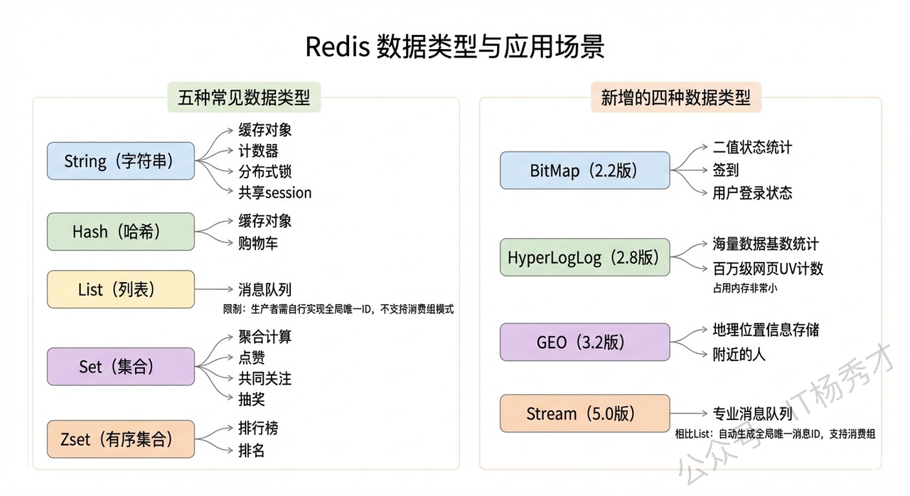

***

### **1.2 Redis 中 Set 和 ZSet 区别是什么？**

核心区别在于有序性。Set是无序的唯一元素集合，ZSet是有序的唯一元素集合，每个元素会关联一个score分数，按分数自动排序。

具体来说，Set只能做集合层面的操作，比如SADD添加、SMEMBERS查看、SISMEMBER判断存在、SINTER求交集、SUNION求并集这些。而ZSet因为有分数的概念，才有了很多基于分数和排名的操作，比如ZRANGEBYSCORE按分数范围查、ZRANGE按排名范围查、ZRANK算排名、ZINCRBY增减分数等等。

所以适用场景也不一样。Set适合去重且不需要排序的场景，比如用户ID集合、标签集合；ZSet适合需要排序、排名或者权重相关的场景，比如排行榜、延迟任务队列。

***

### **1.3 Zset 底层是怎么实现的？**

Zset底层有两种实现方式，具体用哪种取决于数据量的大小。当有序集合的元素个数小于128个，并且每个元素值小于64字节时，Redis会使用压缩列表（ziplist）来实现；不满足这个条件的话，就会使用跳表（skiplist）来实现。

补充一点，在Redis 7.0中，压缩列表已经被废弃了，改用listpack来替代。

***

### **1.4 跳表是怎么实现的？**

跳表本质上是在链表基础上做的改进，实现了一种多层的有序链表。普通链表查找元素只能逐个遍历，时间复杂度是O(N)。跳表通过建立多层索引，让查找可以"跳着走"，查找复杂度降到了O(logN)。

举个例子，假设有一个3层的跳表，L0层有全部节点1、2、3、4、5，L1层有节点2、3、5，L2层只有节点3。查找节点4的时候，可以先从最高层L2跳到节点3，发现还没到，就往下一层继续往前找到节点4，只需要2次查找，比遍历链表的4次快很多。

从数据结构上看，每个跳表节点包含几个关键字段：ele保存元素值，score保存权重分数，backward是后向指针方便倒序遍历，还有一个level数组，数组的每个元素代表一层，里面有forward前向指针和span跨度。跨度是用来计算排名的，不是用来遍历的，遍历只需要forward指针就行。

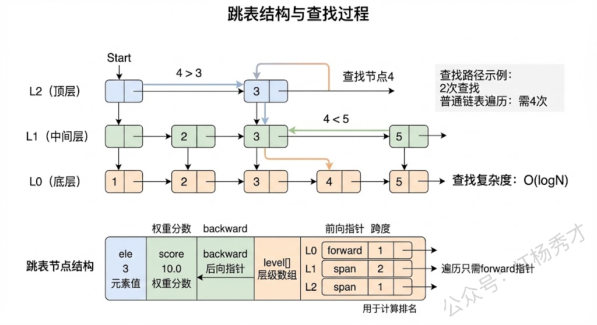

***

### **1.5 跳表是怎么设置层高的？**

跳表在创建节点的时候，用随机数来决定层高。具体做法是生成一个\[0,1]的随机数，如果小于0.25就层数加1，然后继续生成下一个随机数，直到大于0.25才停止。也就是说每增加一层的概率是25%，层高越高概率越低，最大层高限制是64。这种随机化的方式避免了严格维护相邻两层节点数量2:1比例的复杂性，实现简单且性能稳定。

***

### **1.6 Redis 为什么使用跳表而不是用 B+ 树？**

最根本的原因是场景不同。B+树是为磁盘IO优化的，它的核心设计目标是降低树的高度来减少磁盘IO次数。而Redis是纯内存数据库，内存中指针跳转速度很快，不存在磁盘IO的瓶颈，所以B+树那套复杂的页管理机制在内存场景下显得多余。

第二个原因是实现复杂度。跳表本质就是多层链表，插入删除只需要改指针，几百行C代码就能实现。B+树的插入删除可能触发节点分裂和合并，甚至需要全局重平衡，实现起来复杂得多。Redis作者Antirez很看重代码的简洁性和可读性。

第三个原因是写入性能。B+树写入时可能引发页分裂，产生性能抖动。跳表的插入删除是局部操作，只改前后节点的指针，不需要全局调整，性能更稳定。

简单总结就是：B+树是磁盘场景的最优解，跳表是Redis内存有序数据场景的最优解，技术选型的核心是适配场景。

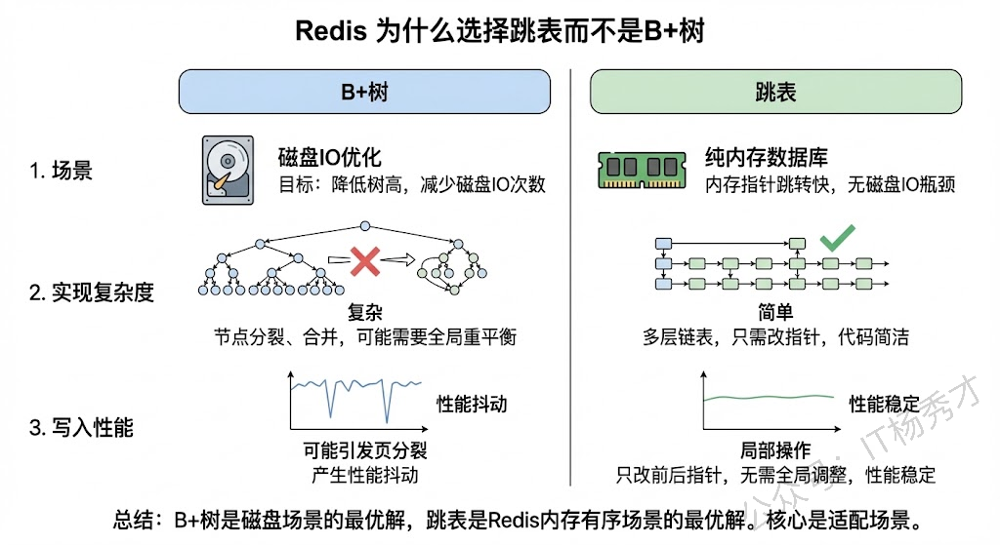

***

### **1.7 压缩列表是怎么实现的？**

压缩列表是Redis为了节省内存而设计的一种紧凑型数据结构，本质上是一块连续的内存空间，类似数组。

它的结构分为表头和节点两部分。表头有三个字段：zlbytes记录整个压缩列表的内存字节数，zltail记录尾节点的偏移量，zllen记录节点数量。末尾还有个zlend标记结束，固定值0xFF。

因为有zltail，定位首尾元素的复杂度是O(1)，但查找中间元素只能逐个遍历，复杂度是O(N)，所以压缩列表不适合保存太多元素。

每个节点包含三部分：prevlen记录前一个节点的长度，用来支持从后向前遍历；encoding记录当前数据的类型和长度；data是实际数据。prevlen和encoding会根据数据大小采用不同的空间分配，这就是Redis节省内存的设计思想。

但压缩列表有个比较大的缺点，就是连锁更新问题。因为每个节点的prevlen记录了前一个节点的长度，当某个节点大小变化后，可能导致后续节点的prevlen字段也需要扩展，从而引发一连串的内存重新分配，影响性能。所以后来Redis引入了quicklist和listpack来解决这个问题。

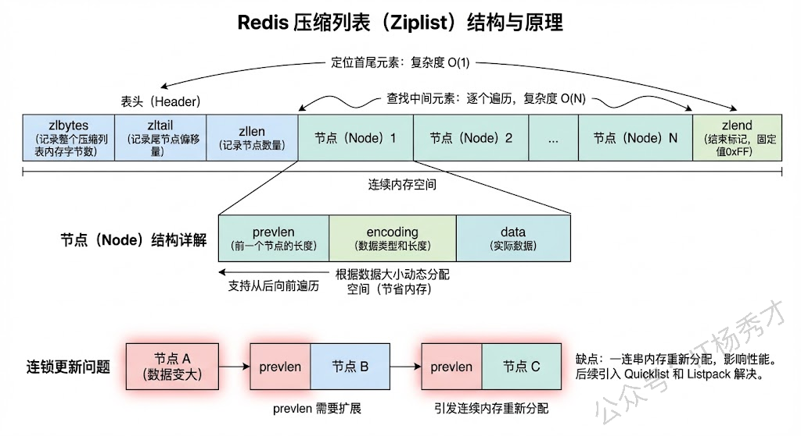

***

### **1.8 介绍一下 Redis 中的 listpack**

listpack是Redis 5.0引入的数据结构，目标是替代压缩列表，彻底解决连锁更新问题。

它保留了压缩列表的很多优点，比如用连续内存空间紧凑存储数据，不同大小的数据用不同编码方式来节省内存。

结构上，listpack头部有两个字段记录总字节数和元素数量，末尾有个结尾标识。每个节点包含三部分：encoding定义编码类型，data存放实际数据，len记录encoding+data的总长度。

关键的改进在于，listpack节点不再记录前一个节点的长度了，只记录自己的长度。所以向listpack插入新元素时，不会影响其他节点的长度字段，从根本上避免了压缩列表的连锁更新问题。

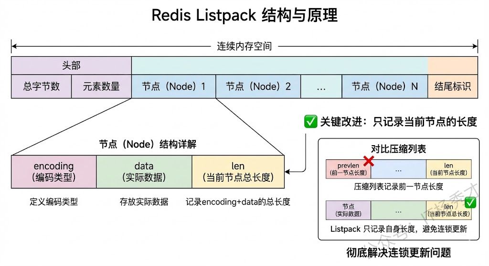

***

### **1.9 哈希表是怎么扩容的？**

Redis的哈希表扩容采用的是渐进式rehash。正常情况下数据都写在哈希表1里，哈希表2是空的。当触发扩容时，分三步走：第一步，给哈希表2分配空间，一般是哈希表1的2倍；第二步，把哈希表1的数据迁移到哈希表2；第三步，释放哈希表1，把哈希表2设为新的哈希表1，再创建一个空的哈希表2备用。

但如果一次性迁移的话，数据量大的时候会阻塞Redis，所以Redis采用渐进式的做法：不是一次迁完，而是每次有增删改查操作时，顺便把哈希表1中当前索引位置的所有key-value迁移到哈希表2。随着请求的不断处理，最终会把所有数据迁完。

在渐进式rehash期间，新增的数据只往哈希表2写，保证哈希表1的数据只减不增，最终变成空表。

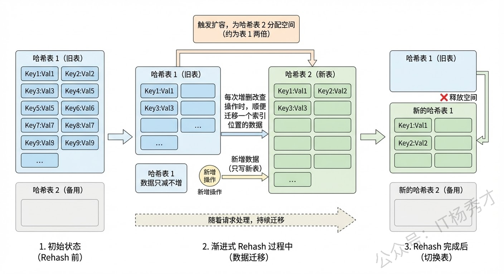

***

### **1.10 哈希表扩容的时候，有读请求怎么查？**

在渐进式rehash期间，读请求会先查哈希表1，如果没找到，再去哈希表2里查。删除、更新这些操作也是一样，两个哈希表都会操作。

***

### **1.11 String 是使用什么存储的？为什么不用 C 语言中的字符串？**

Redis的String使用SDS（Simple Dynamic String）来存储。SDS在原始字符数组的基础上增加了三个元数据字段：len记录字符串长度，alloc记录分配的空间大小，flags标识SDS类型（有sdshdr5、8、16、32、64五种）。

不用C原生字符串主要有三个原因：

第一，获取长度效率不同。C字符串用strlen需要遍历，O(N)复杂度；SDS直接返回len字段，O(1)。

第二，二进制安全。C字符串以'\0'结尾来判断长度，所以没法存包含'\0'的二进制数据。SDS用len来判断长度，足以存储任意二进制数据，不仅能存文本，还能存图片、序列化对象这些。

第三，不会缓冲区溢出。C字符串的操作函数如strcat不会检查缓冲区是否够用，容易溢出。SDS在修改前会通过alloc-len计算剩余空间，不够的话会自动扩容，杜绝了溢出问题。

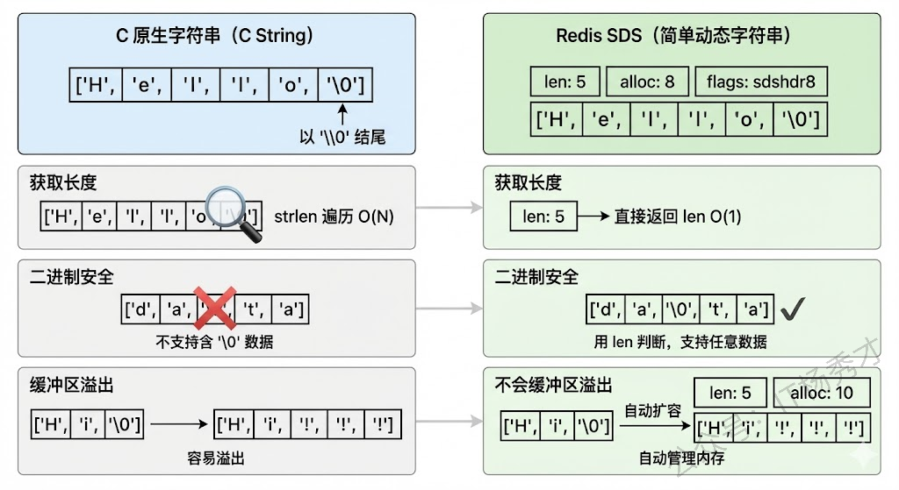

***

### **1.12 Redis 的 Zset，在项目里具体用法是什么？**

我在项目中用Zset主要做过排行榜和延迟任务队列。

排行榜是最典型的场景，比如游戏积分榜，把玩家ID作为元素，积分作为score，用ZADD添加或更新积分，ZREVRANGE取Top N排名，ZREVRANK查某个玩家的名次，ZSCORE查具体积分，这些操作都是实时的而且效率很高。

另一个是延迟任务队列，比如电商里订单30分钟未支付自动取消。做法是把任务ID作为元素，执行时间戳作为score，后台线程用ZRANGEBYSCORE查出score小于当前时间戳的任务去执行，执行完用ZREM删掉就行，不需要引入额外的定时任务框架。

还有就是按范围查询的场景，比如查积分在某个区间内的玩家，用ZRANGEBYSCORE就能快速筛选，比数据库里做排序查询高效得多。

***

## **2. 线程模型**

### **2.1 Redis 为什么快？**

三个核心原因。

第一，Redis的操作都在内存中完成，内存读写速度本身就非常快，瓶颈通常在网络带宽或内存大小上，而不是CPU。

第二，单线程模型。Redis执行命令用的是单线程，避免了多线程之间的锁竞争、上下文切换这些开销，也不会有死锁问题。

第三，IO多路复用机制。Redis通过select/epoll机制，让一个线程可以同时监听和处理多个客户端连接的IO事件，不会因为某个连接阻塞而影响其他连接的处理。

***

### **2.2 Redis 哪些地方使用了多线程？**

首先要明确一点，我们说Redis是单线程，指的是"接收请求、解析、读写数据、返回结果"这个核心流程是单线程。但Redis整个进程不是只有一个线程。

Redis在2.6版本就有2个后台线程（BIO），分别处理关闭文件和AOF刷盘。4.0版本又加了lazyfree线程，用来异步释放内存，比如unlink命令删大key就是交给这个线程，避免主线程卡顿。所以删大key的时候一定要用unlink而不是del。

到Redis 6.0，针对网络IO引入了多线程。因为随着硬件性能提升，瓶颈有时候出在网络IO上，所以6.0对网络IO的读写采用多线程处理，但命令执行仍然是单线程的。默认只对发送响应开启多线程，想对读请求也开启需要配置io-threads-do-reads为yes。

所以6.0之后，Redis默认启动6个线程：1个主线程执行命令，3个BIO后台线程（关闭文件、AOF刷盘、释放内存），3个IO线程处理网络读写。

***

### **2.3 Redis 怎么实现的 IO 多路复用？**

Redis是单线程的，如果用传统阻塞IO的话，一个连接的读写阻塞就会导致整个进程无法处理其他连接。IO多路复用就是解决这个问题的。

具体原理是这样的：当多个客户端连接Redis时，每个连接对应一个socket文件描述符（FD）。Redis用IO多路复用程序（底层通常是epoll）把这些FD注册到监听列表里。当客户端有读写操作时，epoll会同时监控多个FD的状态，哪个FD有数据到来就通知事件处理器去处理对应的命令。

这样整个文件事件处理器虽然跑在单线程上，但通过IO多路复用模块实现了同时监控多个连接，避免了IO阻塞问题。这个模型本质上就是Reactor模式。

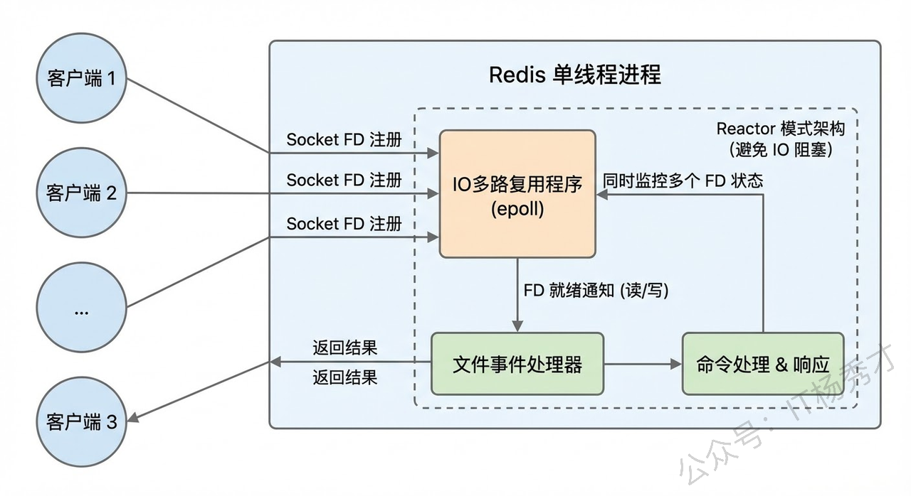

***

### **2.4 Redis 的网络模型是怎样的？**

Redis 6.0之前用的是单Reactor单线程模式。所有工作在一个进程一个线程里完成，实现简单，不用考虑进程间通信和多线程竞争。但缺点也很明显：无法充分利用多核CPU，而且Handler处理业务时其他连接只能等着。不过因为Redis是内存操作，命令执行很快，性能瓶颈不在CPU上，所以这个模式在6.0之前是够用的。

到6.0之后，因为网络硬件性能提升，瓶颈有时候出现在网络IO上，所以Redis把网络IO改成了多线程处理。但注意，命令执行仍然是单线程的，不存在多线程同时执行命令的情况。官方数据显示，引入多线程IO后性能提升至少一倍。

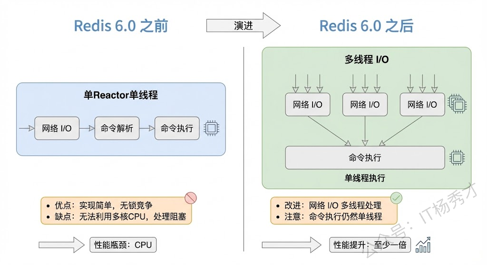

***

## **3. 事务**

### **3.1 如何实现 Redis 原子性？**

Redis执行单条命令本身就是原子的，因为是单线程处理，不存在多线程安全问题。

如果要保证多条命令的原子性，最常用的方式是Lua脚本。Redis会把整个Lua脚本作为一个整体执行，中间不会被其他命令打断。比如分布式锁解锁的时候，需要先判断锁是不是自己的，是的话才删除，这两步操作就通过Lua脚本来保证原子性。

***

### **3.2 除了 Lua 还有什么也能保证 Redis 的原子性？**

Redis事务也可以。通过MULTI开启事务，EXEC提交执行，中间的命令会排队一次性执行。

但要注意，Redis事务的原子性保证是有限的。正常执行没问题，可以保证原子性。但如果事务中某条命令执行报错了，其他命令还是会继续执行，Redis事务没有回滚机制。比如事务里一个LPOP命令操作了String类型数据，运行时报错了，但后面的DECR命令还是会成功执行。所以严格来说，Redis事务在部分出错的情况下是不保证原子性的。

***

## **4. 持久化**

### **4.1 Redis 有哪 2 种持久化方式？分别的优缺点是什么？**

Redis有两种持久化方式：AOF和RDB。

AOF是以追加日志的方式，每执行一条写命令就把命令记录到文件里，恢复的时候把日志里的命令重放一遍。RDB是在某个时间点对内存做快照，以二进制方式写入磁盘，恢复的时候直接把文件加载到内存。

AOF的优点是数据安全性更好，最多只丢最后一次同步之前的数据，而且支持多种同步策略可以灵活调整；缺点是文件通常比RDB大，频繁写磁盘可能影响写性能，恢复速度也慢，因为要重放所有命令。

RDB的优点是文件体积小，备份恢复速度快，而且生成快照是fork子进程做的，对主线程影响小；缺点是两次快照之间的数据可能丢失，实时性不如AOF。

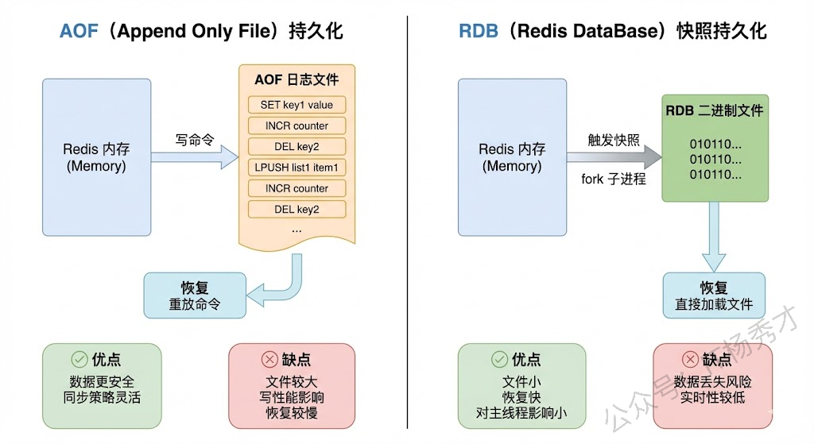

***

### **4.2 AOF 日志是如何实现的？**

Redis执行完一条写操作命令后，会把命令以追加方式写入AOF文件。注意是先执行命令再记日志，不是先写日志再执行。

写回磁盘有三种策略，通过appendfsync配置：Always是每次写完命令就同步刷盘，数据最安全但性能最差；Everysec是先写到内核缓冲区，每秒刷一次盘，最多丢1秒数据，是个折中方案；No是交给操作系统来决定什么时候刷盘，性能最好但数据安全性最差。

另外AOF文件会越来越大，Redis提供了AOF重写机制来优化文件大小，加快恢复速度。

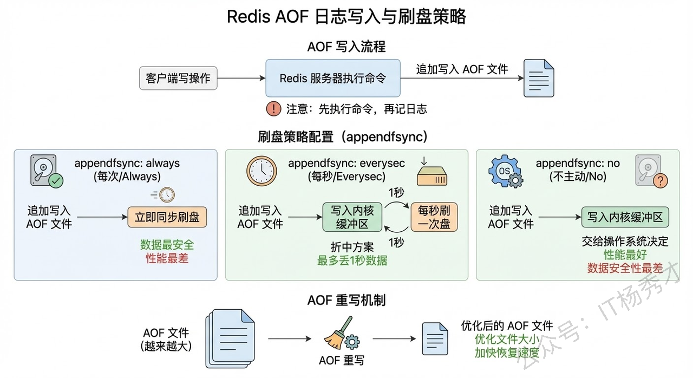

***

### **4.3 RDB 快照是如何实现的？**

RDB快照记录的是某一时刻的内存数据，是实际数据而不是操作命令，所以恢复速度比AOF快。

生成RDB文件有两个命令：save和bgsave。save在主线程执行，会阻塞Redis；bgsave会fork一个子进程来生成RDB文件，不阻塞主线程。生产环境肯定用bgsave。

***

### **4.4 AOF 和 RDB 优缺点是什么？**

AOF的优点是数据安全性高，默认每秒同步一次最多丢1秒数据，支持多种同步策略灵活调节，还有redis-check-aof工具可以修复损坏的文件。缺点是文件体积大、恢复速度慢（需要重放命令），频繁IO可能影响写性能。

RDB的优点是文件体积小、恢复速度快，fork子进程生成对主线程影响小。缺点是两次快照之间有数据丢失风险，实时性不够。

实际项目中通常两种方式结合使用，用RDB做冷备份快速恢复，用AOF保证数据尽量不丢失。

***

## **5. 缓存淘汰与过期删除**

### **5.1 过期删除策略和内存淘汰策略有什么区别？**

这是两个不同的概念。过期删除策略是针对已经设置了过期时间并且到期了的key，决定什么时候把它删掉。内存淘汰策略是当Redis内存满了的时候，决定淘汰哪些key来腾出空间给新数据。

一个是到期删除，一个是内存不够时的淘汰，触发时机和目的都不一样。

***

### **5.2 介绍一下 Redis 内存淘汰策略**

Redis内存淘汰策略一共8种，分两大类：

不淘汰数据的：noeviction，这是Redis 3.0之后的默认策略，内存满了就拒绝写入返回报错，但读和删除还能正常工作。

淘汰数据的又分两类。一类是只在设了过期时间的key里淘汰：volatile-random随机淘汰、volatile-ttl优先淘汰快过期的、volatile-lru淘汰最久没用的、volatile-lfu淘汰使用频率最低的。另一类是在所有key里淘汰：allkeys-random随机淘汰、allkeys-lru淘汰最久没用的、allkeys-lfu淘汰使用频率最低的。

其中LFU相关的策略是Redis 4.0新增的。

***

### **5.3 介绍一下 Redis 过期删除策略**

Redis采用的是惰性删除加定期删除的组合策略。

惰性删除就是不主动删，等到有请求访问某个key时再检查它是否过期，过期了就删掉返回null。这样做的好处是不浪费CPU去主动清理，但缺点是如果一个key过期了一直没人访问，它就会一直占着内存。

定期删除弥补了这个问题。Redis默认每秒做10次过期检查，每次随机抽取20个设了过期时间的key，删掉其中已过期的。如果这一轮过期key超过25%（也就是超过5个），就继续下一轮抽查，直到过期比例低于25%或者达到25ms时间上限才停止。

这两种策略配合使用，在CPU开销和内存浪费之间取得平衡。

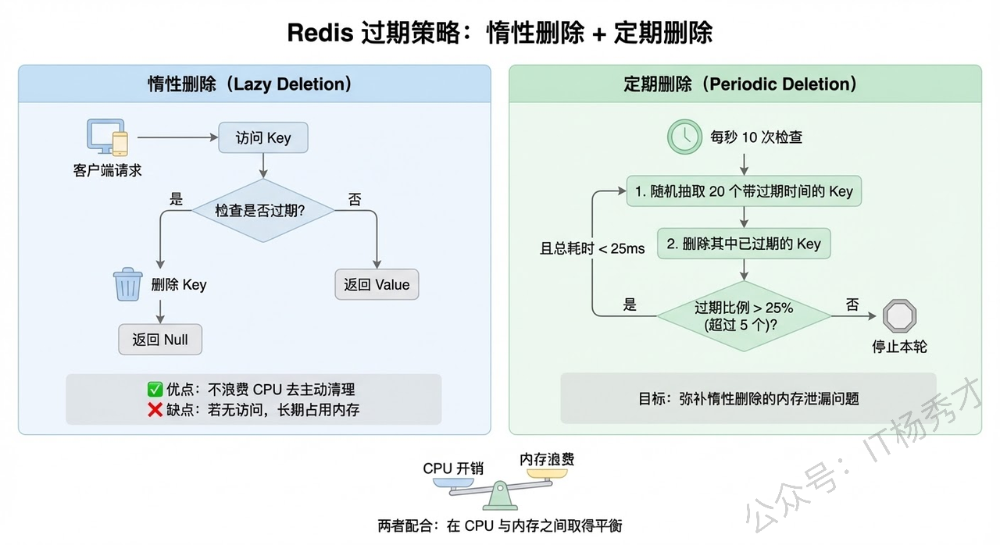

***

### **5.4 Redis 的缓存失效会不会立即删除？**

不会。Redis用的是惰性删除加定期删除的策略，不会在key过期的那一刻就立刻删除它。惰性删除要等有人访问到才删，定期删除是随机抽样去检查。

不采用立即删除是因为，如果过期key特别多，频繁地检查和删除会占用大量CPU时间，影响Redis处理正常请求的性能。在内存不紧张但CPU紧张的情况下，把CPU花在删除过期key上是得不偿失的。

***

## **6. 集群**

### **6.1 Redis 主从同步中的增量和完全同步怎么实现？**

**完全同步**发生在从节点首次连接主节点、或者断开时间太长导致数据差异过大的情况。过程分三个阶段：第一阶段，从节点发送SYNC命令给主节点，协商同步；第二阶段，主节点生成RDB快照文件发给从节点，从节点清空自己的数据然后加载RDB；第三阶段，在RDB生成和传输期间主节点产生的新写命令会记录到replication backlog buffer里，等RDB传完后再把这些命令发给从节点执行，保证数据一致。

**增量同步**基于PSYNC命令，利用了两个关键机制：一个是repl\_backlog\_buffer，这是一个环形缓冲区，主节点会把传播的写命令同时写进去；另一个是replication offset，主从各维护自己的偏移量，主节点记录写到哪了（master\_repl\_offset），从节点记录读到哪了（slave\_repl\_offset）。

网络恢复后，从节点把自己的offset通过psync发给主节点，主节点比较两个offset的差距，如果差异数据还在环形缓冲区里就走增量同步，把差异数据发过去就行；如果已经被覆盖了就只能走全量同步。所以repl\_backlog\_buffer建议设大一点，默认1M太小了，减少触发全量同步的概率。

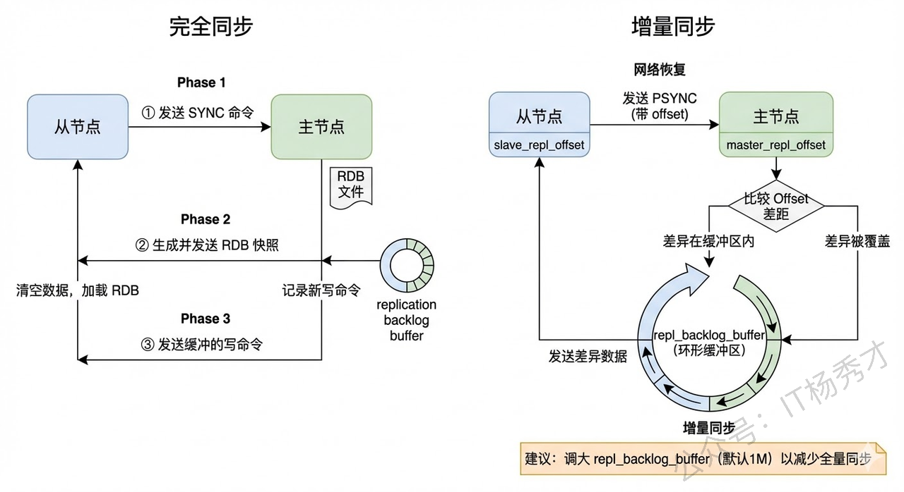

***

### **6.2 Redis 主从和集群可以保证数据一致性吗？**

不能保证强一致性。Redis主从和集群在CAP理论中属于AP模型，优先保证可用性和分区容忍性，牺牲了强一致性。在网络分区的情况下，可能出现部分节点之间数据不一致的情况。

***

### **6.3 哨兵机制原理是什么？**

在主从架构中，如果主节点挂了，需要人工介入去切换主从，不够智能。哨兵（Sentinel）就是为了解决这个问题，它是Redis 2.8引入的自动故障转移机制。

哨兵本质上是一个运行在特殊模式下的Redis进程，核心职责三件事：监控、选主、通知。监控就是持续检测主从节点是否正常；选主就是当主节点挂了自动从从节点中选出新的主节点；通知就是把新主节点的信息告诉其他从节点和客户端。

***

### **6.4 哨兵机制的选主节点的算法介绍一下**

整个过程分四步。

第一步，主观下线。每个哨兵节点定时给集群所有节点发心跳，如果某个节点在down-after-milliseconds时间内没回复，该哨兵就认为这个节点主观下线了。

第二步，客观下线。一个哨兵说下线还不算，得问其他哨兵。如果超过quorum数量的哨兵都认为该节点主观下线，才判定为客观下线。如果客观下线的是从节点或哨兵节点就到此为止，如果是主节点就进入故障转移流程。

第三步，选举Sentinel Leader。需要先从哨兵集群中选一个Leader来执行故障转移。每个哨兵都可以请求其他哨兵投票给自己，先到先得原则，获得票数达到max(quorum, 哨兵数/2+1)就当选Leader。

第四步，Sentinel Leader从从节点中选新主节点。选择逻辑是：先过滤掉故障节点，然后按slave-priority优先级选最高的；优先级一样就选复制偏移量最大的，也就是数据最完整的；再一样就选runid最小的。

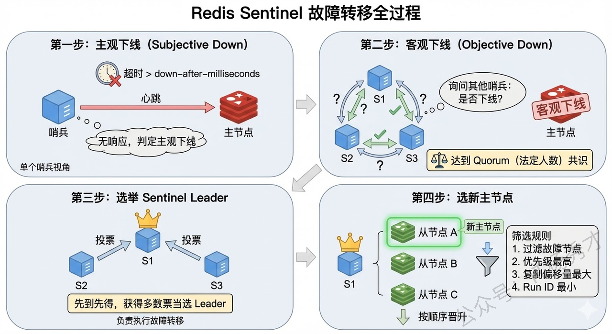

***

### **6.5 Redis 集群模式了解吗？优缺点了解吗？**

当单台Redis扛不住数据量时就需要Redis Cluster切片集群。它把数据分布在多个节点上，通过哈希槽来做数据映射。一共16384个哈希槽，key通过CRC16算法计算后对16384取模，得到对应的槽位，再根据槽位找到对应节点。

槽位分配有两种方式：平均分配是cluster create时自动均分；手动分配是用cluster addslots指定每个节点负责哪些槽位，但要注意16384个槽必须全部分配完，否则集群无法工作。

优点是高可用（节点间主从复制保证容错）、高性能（数据分片提升读写能力）、扩展性好（可以动态增减节点）。

缺点是部署维护复杂（分片规则、主从配置、故障处理都要考虑）、节点间数据同步有延迟、部分功能受限（比如不支持跨节点的事务、某些操作不能跨slot执行）。

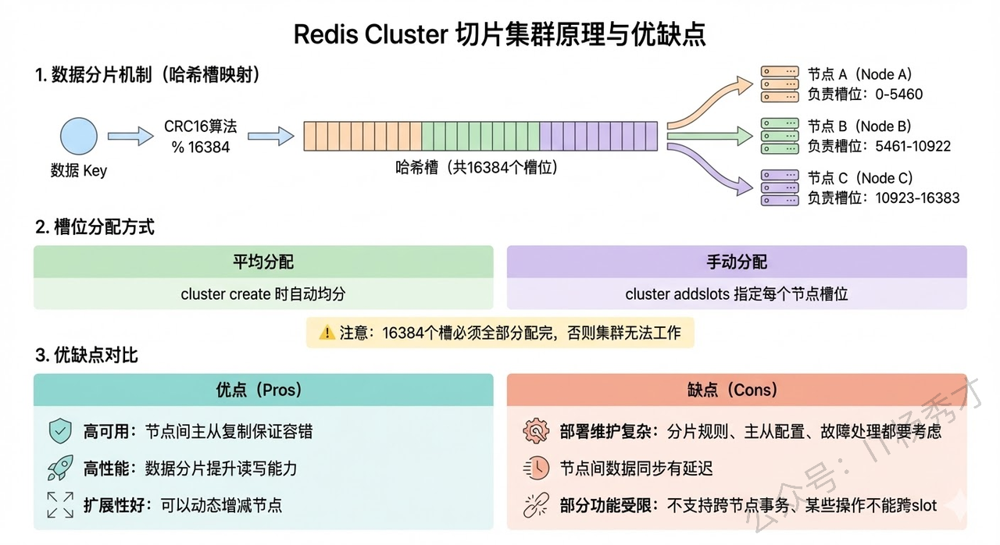

***

### **6.6 Redis 集群客户端是怎样知道该访问哪个分片的？**

客户端启动后先连接集群中任意一个节点，发CLUSTER SLOTS命令拿到全量的"槽位-节点"映射关系，缓存到本地。之后访问某个key时，本地对key做CRC16再对16384取模算出槽位，查本地缓存找到对应节点，直接请求过去。

如果集群发生了槽位迁移或节点变动，客户端访问时会收到MOVED或ASK重定向指令，客户端根据指令更新本地缓存的映射关系，下次就能直接找到正确的节点。整个过程对开发者是透明的。

***

## **7. 场景与应用**

### **7.1 为什么使用 Redis？**

两个核心原因：高性能和高并发。

高性能方面，数据库查询通常要走磁盘IO比较慢，把热点数据缓存到Redis里，下次直接从内存读，速度快很多。

高并发方面，Redis单机QPS能轻松到10万，MySQL单机通常也就几千。把部分请求通过缓存消化掉，可以大大减轻数据库的压力。

***

### **7.2 为什么 Redis 比 MySQL 要快？**

三个方面。第一，存储介质不同，Redis基于内存，MySQL基于磁盘，内存的读写速度比磁盘快了几个数量级。第二，数据结构不同，Redis是键值对存储，查找用哈希表O(1)复杂度，MySQL底层是B+树，O(logN)复杂度。第三，线程模型不同，Redis单线程模型省去了多线程竞争和上下文切换的开销。

***

### **7.3 本地缓存和 Redis 缓存的区别？**

本地缓存就是把数据存在应用进程的内存里，比如Java的Caffeine、Guava Cache。优势是访问速度极快没有网络开销，延迟极低。劣势是受单机内存限制、可扩展性差，而且多个应用实例之间的缓存无法共享，存在数据一致性问题。

Redis是分布式缓存，数据存在独立的Redis服务上。优势是可扩展性强、多个应用实例共享同一份缓存、数据一致性好。劣势是有网络开销，访问速度比本地缓存慢。

选择的时候看场景：数据量小、对延迟要要求极高的用本地缓存；数据量大、需要多实例共享、需要支持高并发的用Redis。实际项目中也经常两级缓存结合使用。

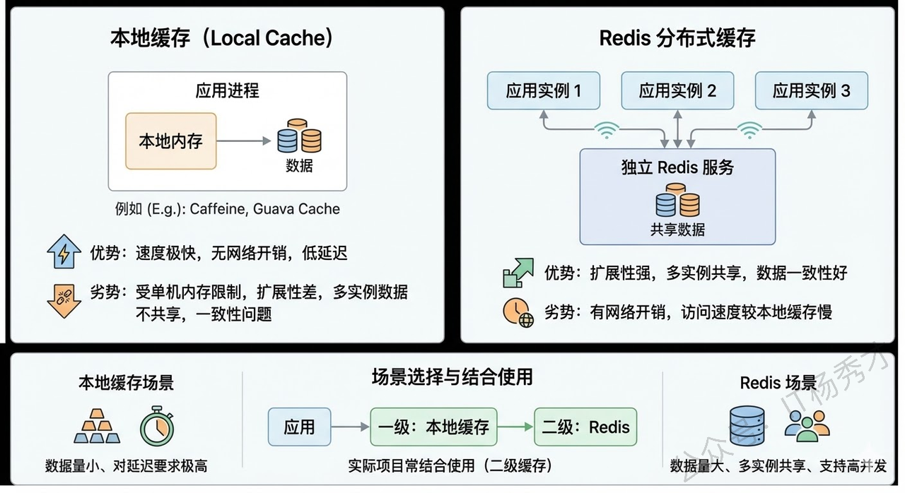

***

### **7.4 高并发场景，Redis 单节点 + MySQL 单节点能有多大的并发量？**

如果缓存命中的话，4核8G的配置下Redis可以支撑10万QPS左右。如果缓存没命中请求打到MySQL，同样配置下MySQL大概只能支撑5000左右的QPS。

***

### **7.5 Redis 有哪些应用场景？**

首先可以用来做缓存，缓存是最常见的，把热点数据放内存里减轻数据库压力。其次还可以用redis的Zset来实现排行榜。基于redis的SET NX命令还可以实现分布式锁，这也是分布式锁最常用的实现方式。还可以实现计数器，利用Redis的原子操作做访问量统计、点赞数这些。最后，消息队列用redis的Pub/Sub或者Stream来也可以实现，作为轻量级的消息通信。

***

## **8. Redis 实战问题**

### **8.1 Redis 支持并发操作吗？**

Redis 是支持高并发访问的，但它的并发模型和传统数据库不太一样。Redis 采用的是 **单线程事件循环模型** 来处理客户端请求，也就是说在同一时刻只有一个命令在执行，所以 **每条命令执行过程中不会被打断，因此天然是原子的**。也正因为这一点，在高并发场景下 Redis 依然可以保证数据的一致性。

不过需要注意，这个原子性是 **单条命令级别的**。如果业务逻辑涉及多条命令，比如先读取再更新，这种情况下就可能出现并发问题。

针对这种场景，Redis提供了几种常见的解决方案：

第一种是 **事务（MULTI / EXEC）**。事务可以把多条命令打包，在 EXEC 时按顺序一次性执行。不过 Redis 的事务和关系型数据库不一样，它 **不支持回滚，也没有严格的隔离级别**，更多只是保证命令的顺序执行。

第二种是 **WATCH 机制**。WATCH 可以理解为一种 **乐观锁**。在执行事务前先监控某些 key，如果这些 key 在事务提交之前被其他客户端修改了，那么当前事务就会执行失败，从而避免并发修改带来的问题。

第三种是 **Lua 脚本**。Lua 脚本在 Redis 中执行也是原子的，脚本执行期间不会被其他命令打断，所以在实现一些需要多步操作的逻辑时，比如分布式锁、库存扣减等，通常会使用 Lua 脚本来保证整体操作的原子性。

所以总结来说，Redis 能支持高并发主要依赖 **单线程模型保证单命令原子性**；而对于多命令的复杂操作，可以通过 **事务、WATCH 乐观锁或者 Lua 脚本** 来保证逻辑上的并发安全。

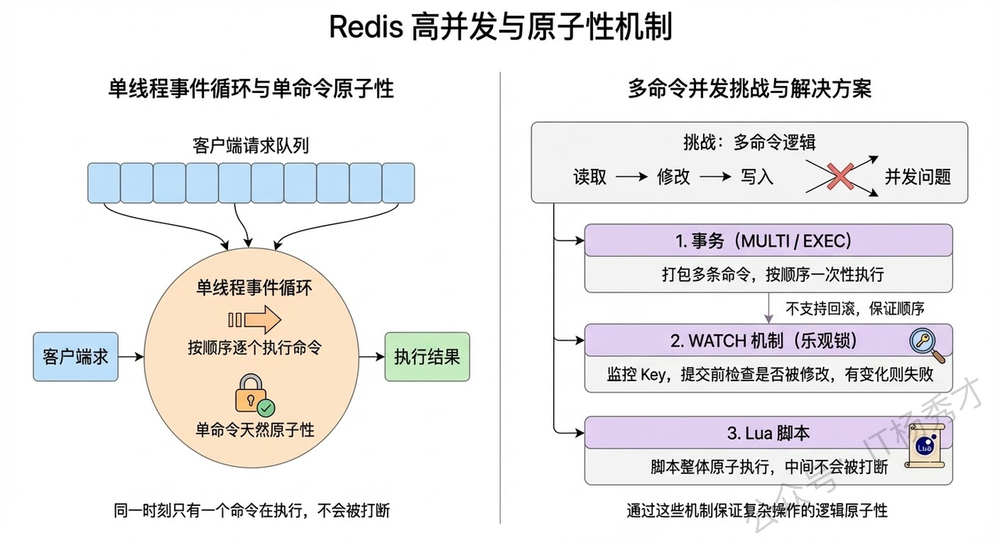

***

### **8.2 Redis 分布式锁的实现原理？什么场景下用到分布式锁？**

分布式锁用于分布式环境下控制某个共享资源同一时刻只能被一个应用使用。

实现原理是使用Redis SET命令的NX参数。加锁：`SET lock_key unique_value NX PX 10000`，NX保证key不存在才能设置成功，PX设置过期时间防止持有锁的客户端崩了导致死锁，unique\_value是客户端唯一标识用来防止误释放。解锁：通过Lua脚本先判断lock\_key的值是不是自己的unique\_value，是的话才del删除，保证原子性。

使用场景比如：多个服务实例操作同一个库存的扣减、防止定时任务在多个节点上重复执行、保证同一用户的并发请求串行处理等。

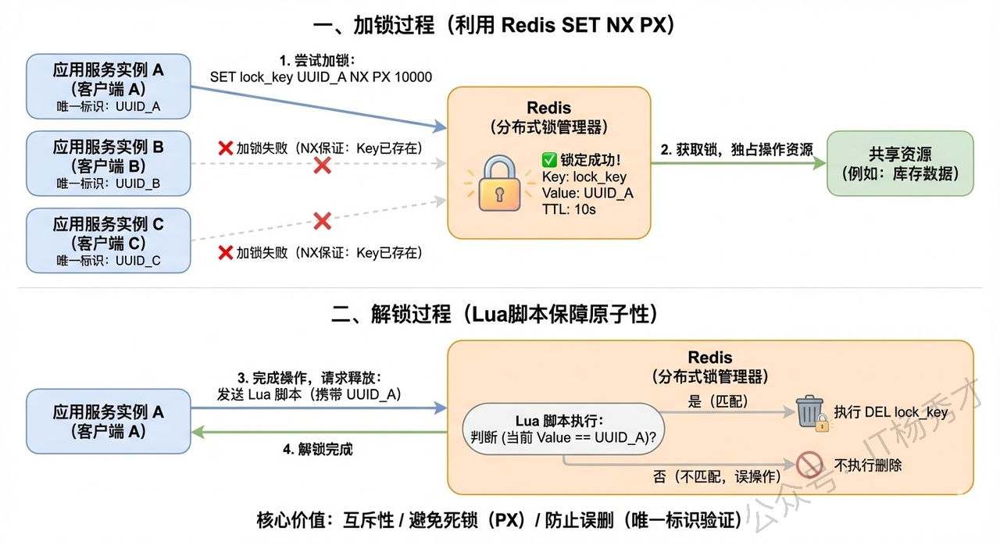

***

## **9. 性能与问题排查**

### **9.1 Redis 的大 Key 问题是什么？**

大key指的是某个key对应的value占用内存空间过大，导致一系列性能问题。

***

### **9.2 到底多大的数据量才算是大 Key？**

没有绝对标准，一般认为String类型value超过1MB，或者集合类型元素数量超过1万个就算大key。但实际要结合业务场景判断，高并发低延迟场景下10KB可能就算大key了，低并发高容量场景下100KB可能都还好。

***

### **9.3 大 Key 问题的缺点？**

影响很多方面。内存占用过高可能触发淘汰策略甚至内存溢出；对大key的读写删操作消耗更多CPU和内存，拉低整体性能；特别是DEL大key时会阻塞主线程，导致Redis一段时间无法响应请求；读取大key产生大量网络流量可能打满带宽；主从同步时大key传输慢导致同步延迟；集群模式下还会造成数据倾斜，某个分片内存远超其他分片。

***

### **9.4 Redis 大 Key 如何解决？**

几个思路。拆分大key，比如一个几万元素的Hash拆成多个小Hash，保证每个key的数据量在合理范围内。清理大key，不适合放Redis的数据迁移到其他存储，删除时要用异步删除（unlink）。做好监控，设置内存使用率和增长率的告警阈值。定期清理过期数据，避免在Hash这类结构中不断追加数据却不清理失效的。

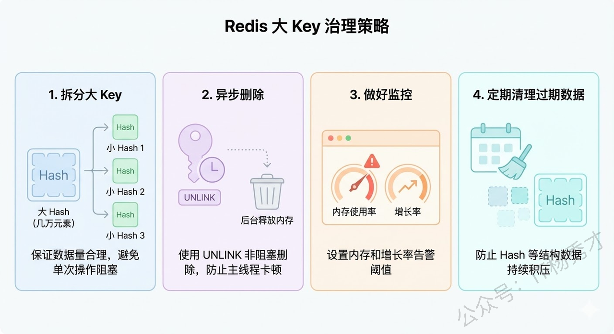

***

### **9.5 什么是热 Key？**

热key就是被高频访问的key。比如Redis整体QPS是1万，其中某个key占了7000；或者一个上千成员的大Hash被频繁HGETALL；或者一个几万成员的Zset被频繁ZRANGE。这些操作会导致请求集中在单个节点上，造成该节点负载过高。

***

### **9.6 如何解决热 Key 问题？**

两个主要方案。第一，在集群中复制热key。把热key foo复制成foo2、foo3、foo4等内容完全一样的key，分散到不同的分片上，请求也随机分散到这些副本上，降低单分片压力。

第二，使用读写分离架构。如果热key主要是读请求，可以加从节点分担读压力。但这种方案会增加架构复杂度，需要加Proxy做负载均衡，从节点增多后故障率也会上升，运维成本更高。

***

## **10. 缓存一致性与缓存问题**

### **10.1 如何保证 Redis 和 MySQL 数据缓存一致性问题？**

首先要明确一点，缓存本身就是通过牺牲强一致性来换性能的，这是CAP理论决定的。如果业务必须强一致，那就不适合用缓存。

我的做法是读数据走旁路缓存策略：先查缓存，命中直接返回，没命中就查数据库然后写入缓存。写数据采用"先更新数据库，再删除缓存"的策略。

缓存一定要设过期时间，不能太短也不能太长，太短缓存命中率低失去意义，太长脏数据存在时间久还浪费内存。

对于删除缓存失败的情况，有两种补偿方案。第一种是消息队列重试，把删除缓存操作放到消息队列里，失败了就从队列重新消费再试，多次失败就报警。第二种是订阅MySQL binlog，用Canal这类中间件监听binlog变更，拿到变更数据后异步删除对应缓存，通过ACK机制保证可靠性。第二种方案对业务代码没有侵入。

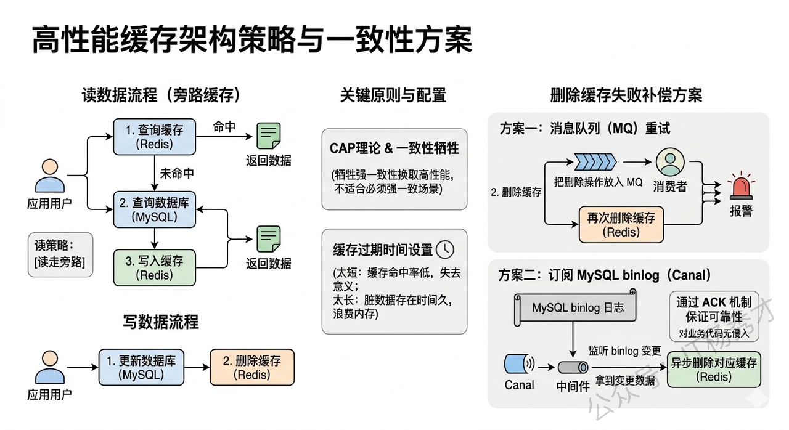

***

### **10.2 缓存雪崩、击穿、穿透是什么？怎么解决？**

这三个概念经常一起被问到，区别很明显。

**缓存雪崩**是大量缓存同时过期或者Redis宕机，导致请求全部涌向数据库。解决方案：给过期时间加随机值避免集中过期；加互斥锁保证同时只有一个请求去重建缓存；后台线程定时更新缓存不设过期时间。

**缓存击穿**是某个热点key过期了，大量并发请求同时打到数据库。本质上是雪崩的单key版本。解决方案：用互斥锁控制只有一个请求去查库重建缓存，其他请求等待或返回默认值；对热点key不设过期时间，由后台异步更新。

**缓存穿透**是请求的数据在缓存和数据库里都不存在，每次都穿透到数据库。通常是恶意攻击或者参数不合法。解决方案：在API入口做参数校验拦截非法请求；查询不到的数据在缓存里设空值或默认值；用布隆过滤器预判数据是否存在，不存在直接返回，避免查库。

**布隆过滤器**的原理是用一个位图数组加N个哈希函数。写数据时，用N个哈希函数算出N个位置，把位图对应位置设为1。查询时检查这N个位置是否全为1，有一个0就说明数据肯定不存在。但全为1不一定存在，因为有哈希冲突导致的误判，不过这个误判率可以通过调整位图大小和哈希函数数量来控制在可接受范围内。

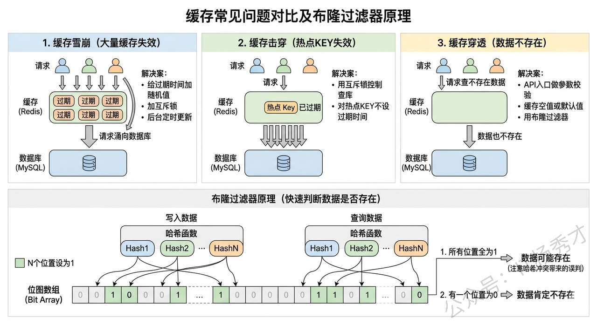

***

## **11. 场景题**

### **11.1 如何设计秒杀场景处理高并发以及超卖现象？**

解决超卖可以从几个层面考虑。

数据库层面，可以用排他锁`SELECT ... FOR UPDATE`锁住库存行，或者在UPDATE时加库存大于0的条件`WHERE stock > 0`。但数据库方案性能不好，高并发下容易超时。

分布式锁方案，同一时间只允许一个请求操作库存，但会导致请求串行化，吞吐量上不去。

分布式锁加分段缓存，把库存拆成多段分散在不同key上，比如100个库存分5个key每个20，用户ID取模决定访问哪个key，这样并发度提升了，但实现复杂度高，某段耗尽需要切换到其他段。

最推荐的是Redis原子操作加异步队列。系统初始化时把库存加载到Redis，收到请求先用DECR原子减库存，库存不足直接返回秒杀失败；库存够的请求放入异步队列，后台消费者从队列取出来校验（比如防重复秒杀），然后扣数据库库存、生成订单。前端轮询查结果。这种方案用Redis抗住了高并发的库存判断，数据库只承受实际成交的写入压力。
