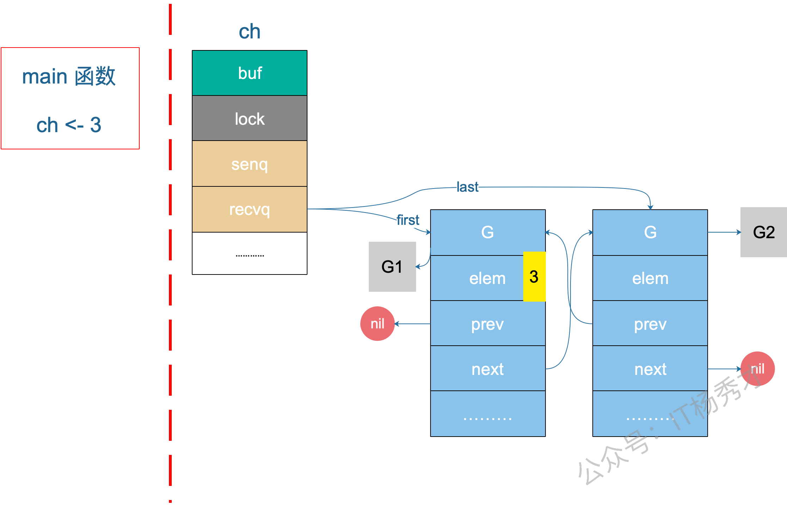

---
tags:
  - Go
  - golang
  - channel
  - 面试题
  - channel面试题
---

# Channel面试题

## 1. 什么是CSP？

CSP（Communicating Sequential Processes，通信顺序进程）并发编程模型，它的核心思想是：通过通信共享内存，而不是通过共享内存来通信。Go 语言的Goroutine 和 Channel机制，就是 CSP 的经典实现，具有以下特点：

1. 避免共享内存：协程（Goroutine）不直接修改变量，而是通过 Channel 通信

2. 天然同步：Channel 的发送/接收自带同步机制，无需手动加锁

3. 易于组合：Channel 可以嵌套使用，构建复杂并发模式（如管道、超时控制）

## 2. Channel的底层实现原理是怎样的？

Channel的底层是一个名为`hchan`的结构体，核心包含几个关键组件：

**环形缓冲区：**&#x6709;缓冲channel内部维护一个固定大小的环形队列，用`buf`指针指向缓冲区，`sendx`和`recvx`分别记录发送和接收的位置索引。这样设计能高效利用内存，避免数据搬移。

**两个等待队列`sendq和recvq`：**&#x7528;来管理阻塞的goroutine。`sendq`存储因channel满而阻塞的发送者，`recvq`存储因channel空而阻塞的接收者。这些队列用双向链表实现，当条件满足时会唤醒对应的goroutine。

**互斥锁：**`hchan`内部有个mutex，所有的发送、接收操作都需要先获取锁，用来保证并发安全。虽然看起来可能影响性能，但Go的调度器做了优化，大多数情况下锁竞争并不激烈。

分析：

hchan定义如下：

```go
type hchan struct {
        // chan 里元素数量
        qcount   uint
        // chan 底层循环数组的长度
        dataqsiz uint
        // 指向底层循环数组的指针
        // 只针对有缓冲的 channel
        buf      unsafe.Pointer
        // chan 中元素大小
        elemsize uint16
        // chan 是否被关闭的标志
        closed   uint32
        // chan 中元素类型
        elemtype *_type // element type
        // 已发送元素在循环数组中的索引
        sendx    uint   // send index
        // 已接收元素在循环数组中的索引
        recvx    uint   // receive index
        // 等待接收的 goroutine 队列
        recvq    waitq  // list of recv waiters
        // 等待发送的 goroutine 队列
        sendq    waitq  // list of send waiters

        // 保护 hchan 中所有字段
        lock mutex
}
```


## 3. 向channel发送数据的过程是怎样的？

向channel发送数据的整个过程都会在mutex保护下进行，保证并发安全。会经历几个关键步骤：

1. **首先是检查是否有等待的接收者**。如果`recvq`队列不为空，说明有goroutine在等待接收数据，这时会直接把数据传递给等待的接收者，跳过缓冲区，这是最高效的路径。同时会唤醒对应的goroutine继续执行。

2. **如果没有等待接收者，就尝试写入缓冲区**。检查缓冲区是否还有空间，如果`qcount < dataqsiz`，就把数据复制到`buf[sendx]`位置，然后更新`sendx`索引和`qcount`计数。这是无缓冲或缓冲区未满时的正常流径。

3. **当缓冲区满了就需要阻塞等待**。创建一个`sudog`结构体包装当前goroutine和要发送的数据，加入到`sendq`等待队列中，然后调用`gopark`让当前goroutine进入阻塞状态，让出CPU给其他goroutine。

**被唤醒后继续执行**。当有接收者从channel读取数据后，会从`sendq`中唤醒一个等待的发送者，被唤醒的goroutine会完成数据发送并继续执行。

**还有个特殊情况是向已关闭的channel发送数据会直接panic**。这是Go语言的设计原则，防止向已关闭的通道写入数据。

**分析：**

```go
package main

import (
    "fmt"
    "time"
)

func goroutineA(a <-chan int) {
    val := <-a
    fmt.Println("goroutine A received data: ", val)
    return
}

func goroutineB(b <-chan int) {
    val := <-b
    fmt.Println("goroutine B received data: ", val)
    return
}

func main() {
    ch := make(chan int)
    go goroutineA(ch)
    go goroutineB(ch)
    ch <- 3
    time.Sleep(time.Second)

    ch1 := make(chan struct{})
}
```

在第 17 行，主协程向 ch 发送了一个元素 3，来看下接下来会发生什么。

sender 发现 ch 的 recvq 里有 receiver 在等待着接收，就会出队一个 sudog，把 recvq 里 first 指针的 sudo “推举”出来了，并将其加入到 P 的可运行 goroutine 队列中。然后，sender 把发送元素拷贝到 sudog 的 elem 地址处，最后会调用 goready 将 G1 唤醒，状态变为 runnable。


当调度器光顾 G1 时，将 G1 变成 running 状态，执行 goroutineA 接下来的代码。G 表示其他可能有的 goroutine。

这里其实涉及到一个协程写另一个协程栈的操作。有两个 receiver 在 channel 的一边虎视眈眈地等着，这时 channel 另一边来了一个 sender 准备向 channel 发送数据，为了高效，用不着通过 channel 的 buf “中转”一次，直接从源地址把数据 copy 到目的地址就可以了，效率高啊！



上图是一个示意图，`3` 会被拷贝到 G1 栈上的某个位置，也就是 val 的地址处，保存在 elem 字段。

## 4. 从Channel读取数据的过程是怎样的？

从channel读取数据也有几个关键步骤：

1. **首先检查是否有等待的发送者**。如果`sendq`队列不为空，说明有goroutine在等待发送数据。对于无缓冲channel，会直接从发送者那里接收数据；对于有缓冲channel，会先从缓冲区取数据，然后把等待发送者的数据放入缓冲区，这样保持FIFO顺序。

2. **如果没有等待发送者，尝试从缓冲区读取**。检查`qcount > 0`，如果缓冲区有数据，就从`buf[recvx]`位置取出数据，然后更新`recvx`索引和`qcount`计数。这是缓冲区有数据时的正常路径。

**缓冲区为空时需要阻塞等待**。创建`sudog`结构体包装当前goroutine，加入到`recvq`等待队列，调用`gopark`进入阻塞状态。当有发送者写入数据时会被唤醒继续执行。

**从已关闭channel读取有特殊处理**。如果channel已关闭且缓冲区为空，会返回零值和false标志；如果缓冲区还有数据，可以正常读取直到清空。这就是为什么`v, ok := <-ch`中的ok能判断channel状态的原因。

## 5. 从一个已关闭Channel仍能读出数据吗？

从一个有缓冲的 channel 里读数据，当 channel 被关闭，依然能读出有效值。只有当返回的 ok 为 false 时，读出的数据才是无效的。

**示例：**

```go
func main() {
        ch := make(chan int, 5)
        ch <- 18
        close(ch)
        x, ok := <-ch
        if ok {
                fmt.Println("received: ", x)
        }

        x, ok = <-ch
        if !ok {
                fmt.Println("channel closed, data invalid.")
        }
}

```

程序输出：

```go
received:  18
channel closed, data invalid.
```

先创建了一个有缓冲的 channel，向其发送一个元素，然后关闭此 channel。之后两次尝试从 channel 中读取数据，第一次仍然能正常读出值。第二次返回的 ok 为 false，说明 channel 已关闭，且通道里没有数据。

## 6. Channel在什么情况下会引起内存泄漏？

Channel引起内存泄漏最常见的是引起goroutine泄漏从而导致的间接内存泄漏，当goroutine阻塞在channel操作上永远无法退出时，goroutine本身和它引用的所有变量都无法被GC回收。比如一个goroutine在等待接收数据，但发送者已经退出了，这个接收者就会永远阻塞下去。或者**select语句使用不当，**&#x5728;没有default分支的select中，如果所有case都无法执行，goroutine会永远阻塞。出现内存泄漏

## 7. 关闭Channel会产生异常吗？

试图重复关闭一个channel、，关闭一个nil值的channel、关闭一个只有接收方向的channel都将导致panic异常。

## 8. 往一个关闭的Channel写入数据会发生什么？

往已关闭的channel写入数据会直接panic。

向已关闭的channel发送数据时，runtime会检测到channel的`closed`标志位已经设置，立即抛出"send on closed channel"的panic。这个检查发生在发送操作的最开始阶段，甚至在获取mutex锁之前就会进行判断，所以不会有任何数据写入的尝试，直接就panic了。

## 9. 什么是select？

select是Go语言专门为channel操作设计的多路复用控制结构，类似于网络编程中的select系统调用。

核心作用是同时监听多个channel操作。当有多个channel都可能有数据收发时，select能够选择其中一个可执行的case进行操作，而不是按顺序逐个尝试。比如同时监听数据输入、超时信号、取消信号等。

## 10. select的执行机制是怎样的？

select的执行机制是随机选择。如果多个case同时满足条件，Go会随机选择一个执行，这避免了饥饿问题。如果没有case能执行就会执行default，如果没有default，当前goroutine会阻塞等待。

```go
select {
case data := <-ch1:
    // 处理ch1的数据
case ch2 <- value:
    // 向ch2发送数据  
case <-timeout:
    // 超时处理
default:
    // 所有channel都不可用时执行
}
```

## 11. select的实现原理是怎样的？

Go语言实现`select`时，定义了一个数据结构scase表示每个`case`语句(包含`default`)。scase结构包含channel指针、操作类型等信息。select操作的整个过程通过selectgo函数在runtime层面实现。

Go运行时会将所有case进行**随机排序**，这是为了避免饥饿问题。然后执行**两轮扫描策略**：**第一轮**直接检查每个channel是否可读写，如果找到就绪的立即执行；如果都没就绪，第二轮就把当前goroutine加入到所有channel的发送或接收队列中，然后调用gopark进入睡眠状态，使**当前goroutine**让出CPU。

当某个channel变为可操作时，调度器会唤醒对应的goroutine，此时需要从其他channel的等待队列中清理掉这个goroutine，然后执行对应的case分支。

其核心原理是：case随机化 + 双重循环检测

**分析：**

scase结构定义：

```go
type scase struct {
    c    *hchan   // channel指针
    elem unsafe.Pointer  // 数据元素指针，用于存放发送/接收的数据
    kind uint16   // case类型：caseNil、caseRecv、caseSend、caseDefault
    pc   uintptr  // 程序计数器，用于调试
    releasetime int64  // 释放时间，用于竞态检测
}
```


在默认的情况下，select 语句会在编译阶段经过如下过程的处理：

1. 将所有的 `case` 转换成包含`  Channel  `以及类型等信息的 scase 结构体；

2. 调用运行时函数 `selectgo `获取被选择的`scase` 结构体索引，如果当前的`  scase  `是一个接收数据的操作，还会返回一个指示当前`case` 是否是接收的布尔值；

3. 通过`  for  `循环生成一组`  if  `语句，在语句中判断自己是不是被选中的 `case`。

