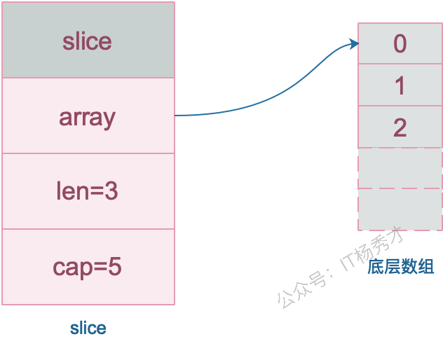
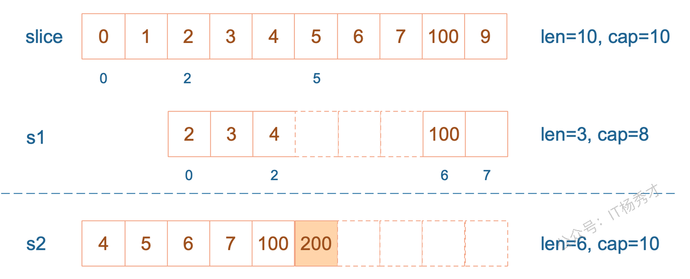
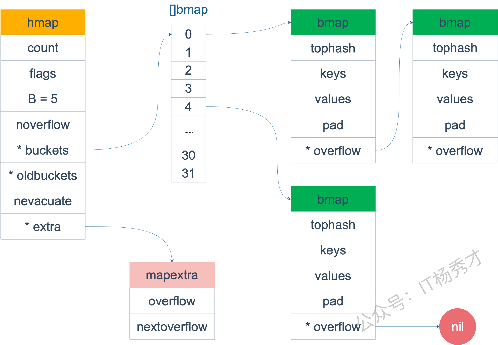
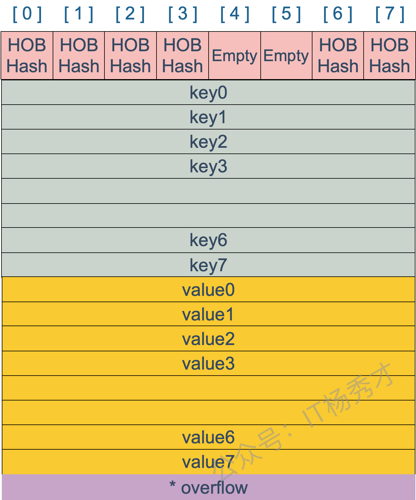
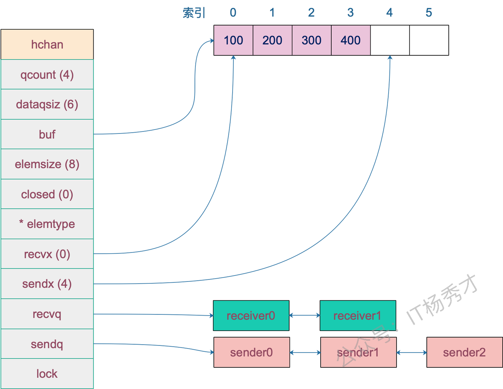
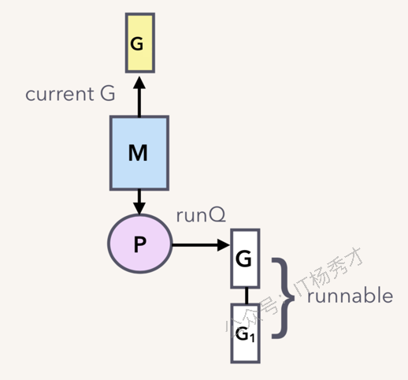
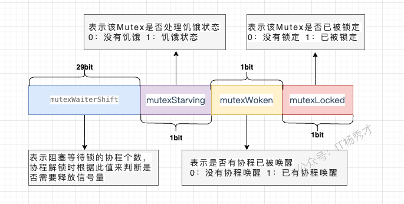
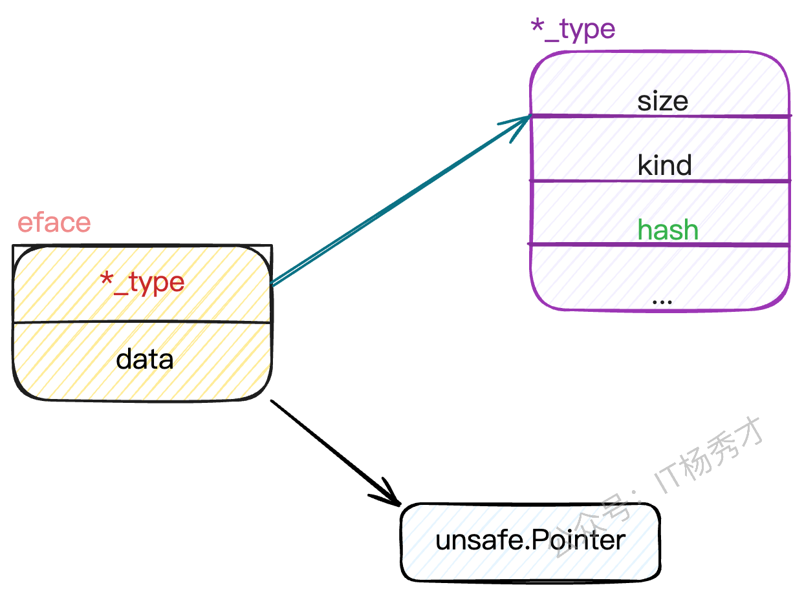
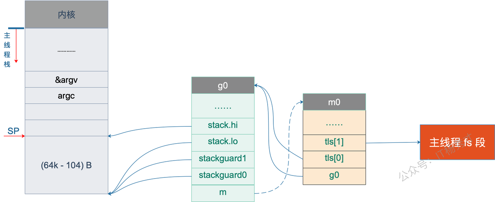
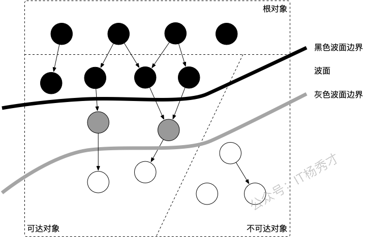

# Go面试题库

## **1. 基础面试题**

### **1.1 与其他语言相比，使用 Go 有什么好处?**

* 与其他语言不同，Go 代码的设计是务实的，Go的语法更简洁。每个功能和语法决策都旨在让程序员的开发效率更高

* Golang 针对并发进行了优化，支持协程，并且实现了高效的GMP调度模型。

* 由于单一的标准代码格式，Golang 通常被认为比其他语言更具可读性。

* 有高效的垃圾回收机制，支持并行垃圾回收，垃圾回收效率比比 Java 或 Python 更高

### **1.2 什么是协程？**

协程是用户态轻量级线程，它是线程调度的基本单位。通常在函数前加上go关键字就能实现并发。一个Goroutine会以一个很小的栈启动2KB或4KB，当遇到栈空间不足时，栈会自动伸缩， 因此可以轻易实现成千上万个goroutine同时启动。

### **1.3 协程和线程和进程的区别？**

* 进程:进程是具有一定独立功能的程序，进程是系统资源分配和调度的最小单位。 每个进程都有自己的独立内存空间，不同进程通过进程间通信来通信。由于进程比较重量，占据独立的内存，所以上下文进程间的切换开销（栈、寄存器、虚拟内存、文件句柄等）比较大，但相对比较稳定安全。

* 线程:线程是进程的一个实体,线程是内核态,而且是 CPU 调度和分派的基本单位,它是比进程更小的能独立运行的基本单位。线程间通信主要通过共享内存，上下文切换很快，资源开销较少，但相比进程不够稳定容易丢失数据。

* 协程:协程是一种用户态的轻量级线程，协程的调度完全是由用户来控制的。协程拥有自己的寄存器上下文和栈。 协程调度切换时，将寄存器上下文和栈保存到其他地方，在切回来的时候，恢复先前保存的寄存器上下文和栈，直接操作栈则基本没有内核切换的开销，可以不加锁的访问全局变量，所以上下文的切换非常快。

### **1.4 Golang 中 make 和 new 的区别？**

**回答：**

`make` 和 `new` 都是用于内存分配的内建函数，但它们的使用场景和功能有所不同：

1. **`make`**：

   * 用于初始化并分配内存，只能用于创建 `slice`、`map` 和 `channel` 三种类型。

   * 返回的是初始化后的数据结构，而不是指针。

2. **`new`**：

   * 用于分配内存，但不初始化，返回的是指向该内存的指针。

   * 可以用于任何类型的内存分配。

**分析：**

```go
// 使用 make 创建 slice
s := make([]int, 5) // 创建一个长度为 5 的 slice
fmt.Println(s)      // 输出: [0 0 0 0 0]// 使用 new 创建 int 指针
p := new(int)       // 分配内存给 int 类型
fmt.Println(*p)     // 输出: 0 (初始值)
```

`make` 函数创建的是数据结构（`slice`、`map`、`channel`）本身，且返回初始化后的值。而`new` 函数创建的是可以指向任意类型的指针，返回指向未初始化零值的内存地址。

### **1.5 Golang 中数组和切片的区别？**

**数组:&#x20;**

数组固定长度。数组长度是数组类型的一部分，所以\[3]int 和\[4]int 是两种不 同的数组类型数组需要指定大小，不指定也会根据初始化，自动推算出大小， 大小不可改变。数组是通过值传递的
**切片:&#x20;**

切片可以改变长度。切片是轻量级的数据结构，三个属性，指针，长度，容量 不需要指定大小切片是地址传递(引用传递)可以通过数组来初始化，也可以通过内置函数 make()来初始化，初始化的时候 len=cap，然后进行扩容&#x20;

**分析：**

slice 的底层数据其实也是数组，slice 是对数组的封装，它描述一个数组的片段。slice 实际上是一个结构体，包含三个字段：长度、容量、底层数组。

```go
// runtime/slice.go
type slice struct {
        array unsafe.Pointer // 元素指针
        len   int // 长度 
        cap   int // 容量
}
```


### **1.6 使用for range 的时候，它的地址会发生变化吗？**

在Go1.22之前，对于 `for range` 循环中的迭代变量，其内存地址是不会发生变化的。但是，Go1.22之后的地址是临时的，是变化的，不一样的，不再是共享内存了

**分析：**

Go1.22之前：

```go
for index, value := range collection {
    // ...
}
```

这里 `value` 是一个**副本**。在每次迭代中，`collection` 中的当前元素值会被**复制**到 `value` 这个变量中。Go 编译器通常会为 `value` 分配一块固定的内存地址，然后在每次迭代时，将当前元素的值覆盖到这块内存中。所以，当你打印 `&value` 时，你会发现它的内存地址在整个循环过程中都是保持不变的。

但是在Go1.23及以后，使用 `for range` 遍历一个集合时，**迭代变量的地址会发生变化**。这是因为 `for range` 每次迭代时都会重新生成迭代变量（如 `value`），这些变量在内存中是不同的地址

### **1.7 如何高效地拼接字符串？**

拼接字符串的方式有：`+` , `fmt.Sprintf` , [`strings.Builder`](https://zhida.zhihu.com/search?content_id=192906787\&content_type=Article\&match_order=1\&q=strings.Builder\&zhida_source=entity), [`bytes.Buffer`](https://zhida.zhihu.com/search?content_id=192906787\&content_type=Article\&match_order=1\&q=bytes.Buffer\&zhida_source=entity), `strings.Join`

1. &#x20;"+"

使用`+`操作符进行拼接时，会对字符串进行遍历，计算并开辟一个新的空间来存储原来的两个字符串。

2. &#x20;fmt.Sprintf

由于采用了接口参数，必须要用反射获取值，因此有性能损耗。

3. strings.Builder：

用WriteString()进行拼接，内部实现是指针+切片，同时String()返回拼接后的字符串，它是直接把\[]byte转换为string，从而避免变量拷贝。

4. bytes.Buffer

`bytes.Buffer`是一个一个缓冲`byte`类型的缓冲器，这个缓冲器里存放着都是`byte`，

`bytes.buffer`底层也是一个`[]byte`切片。

5.  strings.join

`strings.join`也是基于`strings.builder`来实现的,并且可以自定义分隔符，在join方法内调用了b.Grow(n)方法，这个是进行初步的容量分配，而前面计算的n的长度就是我们要拼接的slice的长度，因为我们传入切片长度固定，所以提前进行容量分配可以减少内存分配，很高效。

**性能比较：**

strings.Join ≈ strings.Builder > bytes.Buffer > "+" > fmt.Sprintf

5种拼接方法的实例代码

```go
func main(){
        a := []string{"a", "b", "c"}
        //方式1：+
        ret := a[0] + a[1] + a[2]
        //方式2：fmt.Sprintf
        ret := fmt.Sprintf("%s%s%s", a[0],a[1],a[2])
        //方式3：strings.Builder
        var sb strings.Builder
        sb.WriteString(a[0])
        sb.WriteString(a[1])
        sb.WriteString(a[2])
        ret := sb.String()
        //方式4：bytes.Buffer
        buf := new(bytes.Buffer)
        buf.Write(a[0])
        buf.Write(a[1])
        buf.Write(a[2])
        ret := buf.String()
        //方式5：strings.Join
        ret := strings.Join(a,"")
}
```

### **1.8  defer 的执行顺序是怎样的？defer 的作用或者使用场景是什么?&#x20;**

defer执行顺序和调用顺序相反，类似于栈后进先出(LIFO)

defer 的作用是：当 defer 语句被执行时，跟在 defer 后面的函数会被延迟执行。直到 包含该 defer 语句的函数执行完毕时，defer 后的函数才会被执行，不论包含 defer 语句的函数是通过 return 正常结束，还是由于 panic 导致的异常结束。 你可以在一个函数中执行多条 defer 语句，它们的执行顺序与声明顺序相反。&#x20;

defer 的常用场景:&#x20;

* defer语句经常被用于处理成对的操作，如打开、关闭、连接、断开连接、 加锁、释放锁。&#x20;

* 通过defer机制，不论函数逻辑多复杂，都能保证在任何执行路径下，资 源被释放。&#x20;

* 释放资源的defer应该直接跟在请求资源的语句后。&#x20;

**分析：**

```go
func test() int {
        i := 0
        defer func() {
                fmt.Println("defer1")
        }()
        defer func() {
                i += 1
                fmt.Println("defer2")
        }()
        return i
}

func main() {
        fmt.Println("return", test())
}

// 输出：
// defer2
// defer1
// return 0
```

上面这个例子中，test返回值并没有修改，这是由于Go的返回机制决定的，执行Return语句后，Go会创建一个临时变量保存返回值。如果是有名返回（也就是指明返回值`func test() (i int)`）

```go
func test() (i int) {
        i = 0
        defer func() {
                i += 1
                fmt.Println("defer2")
        }()
        return i
}

func main() {
        fmt.Println("return", test())
}
// 输出：
// defer2
// return 1

```

这个例子中，返回值被修改了。对于有名返回值的函数，执行 return 语句时，并不会再创建临时变量保存，因此，defer 语句修改了 i，即对返回值产生了影响。

### **1.9 什么是 rune 类型？**

Go 语言的字符有以下两种：

* uint8 类型，或者叫 byte 型，代表了 ASCII 码的一个字符。

* rune 类型，代表一个 UTF-8 字符，当需要处理中文、日文或者其他复合字符时，则需要用到 rune 类型。rune 类型等价于 int32 类型。

```go
package main
import "fmt"

func main() {
    var str = "hello 你好" //思考下 len(str) 的长度是多少？
    
    //golang中string底层是通过byte数组实现的，直接求len 实际是在按字节长度计算  
    //所以一个汉字占3个字节算了3个长度
    fmt.Println("len(str):", len(str))  // len(str): 12

    //通过rune类型处理unicode字符
    fmt.Println("rune:", len([]rune(str))) //rune: 8
}
```

### **1.10 Go 语言 tag 有什么用？**

tag可以为结构体成员提供属性。常见的：

1. json序列化或反序列化时字段的名称

2. db: sqlx模块中对应的数据库字段名

3. form: gin框架中对应的前端的数据字段名

4. binding: 搭配 form 使用, 默认如果没查找到结构体中的某个字段则不报错值为空, binding为 required 代表没找到返回错误给前端

### **1.11 go 打印时 %v %+v %#v 的区别？**

* %v 只输出所有的值；

* %+v 先输出字段名字，再输出该字段的值；

* %#v 先输出结构体名字值，再输出结构体（字段名字+字段的值）；

```go
package main
import "fmt"
 
type student struct {
  id   int32
  name string
}
 
func main() {
  a := &student{id: 1, name: "微客鸟窝"}

  fmt.Printf("a=%v  \n", a) // a=&{1 微客鸟窝}  
  fmt.Printf("a=%+v  \n", a) // a=&{id:1 name:微客鸟窝}  
  fmt.Printf("a=%#v  \n", a) // a=&main.student{id:1, name:"微客鸟窝"}
}
```

### **1.12 Go语言中空 struct{} 占用空间么？**

可以使用 unsafe.Sizeof 计算出一个数据类型实例需要占用的字节数，空struct{}不占用任何空间

```go
package main

import (
  "fmt"
  "unsafe"
)

func main() {
  fmt.Println(unsafe.Sizeof(struct{}{}))  //0
}
```

### **1.13 Go语言中，空 struct{} 有什么用？**

* 用map模拟一个set，那么就要把值置为struct{}，struct{}本身不占任何空间，可以避免任何多余的内存分配。

```go
type Set map[string]struct{}

func main() {
        set := make(Set)

        for _, item := range []string{"A", "A", "B", "C"} {
                set[item] = struct{}{}
        }
        fmt.Println(len(set)) // 3
        if _, ok := set["A"]; ok {
                fmt.Println("A exists") // A exists
        }
}
```

* 有时候给通道发送一个空结构体,channel<-struct{}{}，可以节省空间

```go
func main() {
        ch := make(chan struct{}, 1)
        go func() {
                <-ch
                // do something
        }()
        ch <- struct{}{}
        // ...
}
```

* 表示仅有方法的结构体

```go
type Lamp struct{}
```

### **1.14 init() 函数是什么时候执行的？**

**简答：** 在main函数之前执行。

**详细：**&#x69;nit()函数是go初始化的一部分，由runtime初始化每个导入的包，初始化不是按照从上到下的导入顺序，而是按照解析的依赖关系，没有依赖的包最先初始化。

每个包首先初始化包作用域的常量和变量（常量优先于变量），然后执行包的`init()`函数。同一个包，甚至是同一个源文件可以有多个`init()`函数。`init()`函数没有入参和返回值，不能被其他函数调用，同一个包内多个`init()`函数的执行顺序不作保证。

执行顺序：import –> const –> var –>`init()`–>`main()`

一个文件可以有多个`init()`函数！


### **1.15 2 个 interface 可以比较吗 ？**

Go 语言中，interface 的内部实现包含了 2 个字段，类型 `T` 和 值 `V`，interface 可以使用 `==` 或 `!=` 比较。2 个 interface 相等有以下 2 种情况

1. 两个 interface 均等于 nil（此时 V 和 T 都处于 unset 状态）

2. 类型 T 相同，且对应的值 V 相等。

```go
type Stu struct {
     Name string
}

type StuInt interface{}

func main() {
     var stu1, stu2 StuInt = &Stu{"Tom"}, &Stu{"Tom"}
     var stu3, stu4 StuInt = Stu{"Tom"}, Stu{"Tom"}
     fmt.Println(stu1 == stu2) // false
     fmt.Println(stu3 == stu4) // true
}
```

`stu1` 和 `stu2` 对应的类型是 `*Stu`，值是 Stu 结构体的地址，两个地址不同，因此结果为 false。
`stu3` 和 `stu4` 对应的类型是 `Stu`，值是 Stu 结构体，且各字段相等，因此结果为 true。

### **1.16 2 个 nil 可能不相等吗？**

可能不等。interface在运行时绑定值，只有值为nil接口值才为nil，但是与指针的nil不相等。举个例子：

```go
var p *int = nil
var i interface{} = nil
if(p == i){
        fmt.Println("Equal")
}
```

两者并不相同。总结：两个nil只有在类型相同时才相等。

### **1.17 Go 语言函数传参是值类型还是引用类型？**

* 在 Go 语言中只存在值传递，要么是值的副本，要么是指针的副本。无论是值类型的变量还是引用类型的变量亦或是指针类型的变量作为参数传递都会发生值拷贝，开辟新的内存空间。

* 另外值传递、引用传递和值类型、引用类型是两个不同的概念，不要混淆了。引用类型作为变量传递可以影响到函数外部是因为发生值拷贝后新旧变量指向了相同的内存地址。

### **1.18 如何知道一个对象是分配在栈上还是堆上？**

Go和C++不同，Go局部变量会进行逃逸分析。如果变量离开作用域后没有被引用，则优先分配到栈上，否则分配到堆上。那么如何判断是否发生了逃逸呢？

`go build -gcflags '-m -m -l' xxx.go`.

关于逃逸的可能情况：变量大小不确定，变量类型不确定，变量分配的内存超过用户栈最大值，暴露给了外部指针。

### **1.19 Go语言的多返回值是如何实现的？**

Go 语言的多返回值是通过在函数调用栈帧上预留空间并进行**值复制**来实现的。在函数调用发生时，Go 编译器会计算出函数所有返回值的总大小。在为该函数创建**栈帧**时，就会在调用方（caller）的栈帧上，为这些返回值预留出连续的内存空间。

当函数执行到 `return` 语句时，它会将其要返回的各个值**复制**到这些预留好的栈空间中。函数执行完毕后，控制权返回给调用方。此时，调用方可以直接从它自己的栈帧上（即之前为返回值预留的空间）获取这些返回的值。


### **1.20 Go语言中"\_"的作用**

1. 忽略多返回值：在 Go 语言中，函数可以返回多个值。如果你只关心其中的一部分返回值，而不需要使用其余的，就可以用 `_` 来忽略它们，从而避免编译器报错

2. 当你导入一个包时，通常会使用它的某个功能。但有时你可能只想执行包的 `init()` 函数（例如，注册驱动、初始化全局变量等），而不需要直接使用包中的任何导出成员。这时，你就可以使用 `_` 来进行**匿名导入**

示例：

```go
package main

import (
        "fmt"
        _ "net/http/pprof" // 导入 pprof 包，只为了执行其 init 函数注册 profiling 接口
)

func main() {
        fmt.Println("Application started. Profiling tools are likely registered.")
        // 实际应用中，你可能还会启动一个 HTTP 服务器来暴露 pprof 接口
        // go func() {
        //         log.Println(http.ListenAndServe("localhost:6060", nil))
        // }()
}
```

### **1.21 Go语言普通指针和unsafe.Pointer有什么区别？**

普通指针比如`*int`、`*string`，它们有明确的类型信息，编译器会进行类型检查和垃圾回收跟踪。不同类型的指针之间不能直接转换，这是Go类型安全的体现。

而**unsafe.Pointer**是Go的通用指针类型，可以理解为C语言中的`void*`，它绕过了Go的类型系统。unsafe.Pointer可以与任意类型的指针相互转换，也可以与uintptr进行转换来做指针运算。

另外，通指针受GC管理和类型约束，unsafe.Pointer不受类型约束但仍受GC跟踪

### **1.22 unsafe.Pointer与uintptr有什么区别和联系**

unsafe.Pointer和uintptr可以相互转换，这是Go提供的唯一合法的指针运算方式。典型用法是先将unsafe.Pointer转为uintptr做算术运算，然后再转回unsafe.Pointer使用。

最关键的区别在于**GC跟踪**。unsafe.Pointer会被垃圾回收器跟踪，它指向的内存不会被错误回收；而uintptr只是一个普通整数，GC完全不知道它指向什么，如果没有其他引用，对应内存可能随时被回收。

所以记住：unsafe.Pointer有GC保护，uintptr没有，这是它们最本质的区别。 

## **2. Slice面试题**

### **2.1 slice的底层结构是怎样的？**

slice 的底层数据其实也是数组，slice 是对数组的封装，它描述一个数组的片段。slice 实际上是一个结构体，包含三个字段：长度、容量、底层数组。


```go
// runtime/slice.go
type slice struct {
        array unsafe.Pointer // 元素指针
        len   int // 长度 
        cap   int // 容量
}
```



### **2.2 Go语言里slice是怎么扩容的？**

1.17及以前

1. 如果期望容量大于当前容量的两倍就会使用期望容量；

2. 如果当前切片的长度小于 1024 就会将容量翻倍；

3. 如果当前切片的长度大于 1024 就会每次增加 25% 的容量，直到新容量大于期望容量；

Go1.18及以后，引入了新的扩容规则：

当原slice容量(oldcap)小于256的时候，新slice(newcap)容量为原来的2倍；原slice容量超过256，新slice容量newcap = oldcap+(oldcap+3\*256)/4

### **2.3 从一个切片截取出另一个切片，修改新切片的值会影响原来的切片内容吗**

在截取完之后，如果新切片没有触发扩容，则修改切片元素会影响原切片，如果触发了扩容则不会。

示例：

```go
package main

import "fmt"func main() {
        slice := []int{0, 1, 2, 3, 4, 5, 6, 7, 8, 9}
        s1 := slice[2:5]
        s2 := s1[2:6:7]

        s2 = append(s2, 100)
        s2 = append(s2, 200)

        s1[2] = 20

        fmt.Println(s1)
        fmt.Println(s2)
        fmt.Println(slice)
}
```

运行结果：

```shell
[2 3 20]
[4 5 6 7 100 200]
[0 1 2 3 20 5 6 7 100 9]
```

`s1` 从 `slice` 索引2（闭区间）到索引5（开区间，元素真正取到索引4），长度为3，容量默认到数组结尾，为8。 `s2` 从 `s1` 的索引2（闭区间）到索引6（开区间，元素真正取到索引5），容量到索引7（开区间，真正到索引6），为5。


接着，向 `s2` 尾部追加一个元素 100：

```go
s2 = append(s2, 100)
```

`s2` 容量刚好够，直接追加。不过，这会修改原始数组对应位置的元素。这一改动，数组和 `s1` 都可以看得到。


再次向 `s2` 追加元素200

```go
s2 = append(s2, 200)
```

这时，`s2` 的容量不够用，该扩容了。于是，`s2` 另起炉灶，将原来的元素复制新的位置，扩大自己的容量。并且为了应对未来可能的 `append` 带来的再一次扩容，`s2` 会在此次扩容的时候多留一些 `buffer`，将新的容量将扩大为原始容量的2倍，也就是10了。



最后，修改 `s1` 索引为2位置的元素：

```go
s1[2] = 20
```

这次只会影响原始数组相应位置的元素。它影响不到 `s2` 了，人家已经远走高飞了。


再提一点，打印 `s1` 的时候，只会打印出 `s1` 长度以内的元素。所以，只会打印出3个元素，虽然它的底层数组不止3个元素。

### **2.4 slice作为函数参数传递，会改变原slice吗？**

当 slice 作为函数参数时，因为会拷贝一份新的slice作为实参，所以原来的 slice 结构并不会被函数中的操作改变，也就是说，slice 其实是一个结构体，包含了三个成员：len, cap, array并不会变化。但是需要注意的是，尽管slice结构不会变，但是其底层数组的数据如果有修改的话，则会发生变化。若传的是 slice 的指针，则原 slice 结构会变，底层数组的数据也会变。

示例：

```go
package main

func main() {
        s := []int{1, 1, 1}
        f(s)
        fmt.Println(s)
}

func f(s []int) {
        // i只是一个副本，不能改变s中元素的值
        /*for _, i := range s {
                i++
        }
        */

        for i := range s {
                s[i] += 1
        }
}

```

程序输出：

```go
[2 2 2]
```

果真改变了原始 slice 的底层数据。这里传递的是一个 slice 的副本，在 `f` 函数中，`s` 只是 `main` 函数中 `s` 的一个拷贝。在`f` 函数内部，对 `s` 的作用并不会改变外层 `main` 函数的 `s`的结构。

要想真的改变外层 `slice`，只有将返回的新的 slice 赋值到原始 slice，或者向函数传递一个指向 slice 的指针。我们再来看一个例子：

```go
package main

import "fmt"

func myAppend(s []int) []int {
        // 这里 s 虽然改变了，但并不会影响外层函数的 s
        s = append(s, 100)
        return s
}

func myAppendPtr(s *[]int) {
        // 会改变外层 s 本身
        *s = append(*s, 100)
        return
}

func main() {
        s := []int{1, 1, 1}
        newS := myAppend(s)

        fmt.Println(s)
        fmt.Println(newS)

        s = newS

        myAppendPtr(&s)
        fmt.Println(s)
}

```

程序输出

```go
[1 1 1]
[1 1 1 100]
[1 1 1 100 100]
```

`myAppend` 函数里，虽然改变了 `s`，但它只是一个值传递，并不会影响外层的 `s`，因此第一行打印出来的结果仍然是 `[1 1 1]`。

而 `newS` 是一个新的 `slice`，它是基于 `s` 得到的。因此它打印的是追加了一个 `100` 之后的结果： `[1 1 1 100]`。

最后，将 `newS` 赋值给了 `s`，`s` 这时才真正变成了一个新的slice。之后，再给 `myAppendPtr` 函数传入一个 `s 指针`，这回它真的被改变了：`[1 1 1 100 100]`


## **3. Map面试题**

### **3.1 Go语言Map的底层实现原理是怎样的？**

map的就是一个hmap的结构。Go Map的底层实现是一个**哈希表**。它在运行时表现为一个指向`hmap`结构体的指针，`hmap`中记录了**桶数组指针`buckets`**、**溢出桶指针**以及**元素个数**等字段。每个桶是一个`bmap`结构体，能存储**8个键值对**和**8个`tophash`**，并有指向下一个**溢出桶的指针`overflow`**。为了**内存紧凑**，`bmap`中采用的是先存8个键再存8个值的存储方式。

**分析：**
hmap结构定义：
```go
// A header for a Go map.
type hmap struct {
   count     int // map中元素个数
   flags     uint8 // 状态标志位，标记map的一些状态
   B         uint8  // 桶数以2为底的对数，即B=log_2(len(buckets))，比如B=3，那么桶数为2^3=8
   noverflow uint16 //溢出桶数量近似值
   hash0     uint32 // 哈希种子

   buckets    unsafe.Pointer // 指向buckets数组的指针
   oldbuckets unsafe.Pointer // 是一个指向buckets数组的指针，在扩容时，oldbuckets 指向老的buckets数组(大小为新buckets数组的一半)，非扩容时，oldbuckets 为空
   nevacuate  uintptr        // 表示扩容进度的一个计数器，小于该值的桶已经完成迁移

   extra *mapextra // 指向mapextra 结构的指针，mapextra 存储map中的溢出桶
}
```



bmap结构如下：



### **3.2 Go语言Map的遍历是有序的还是无序的？**

Go语言里Map的遍历是**完全随机**的，并没有固定的顺序。map每次遍历,都会从一个随机值序号的桶,在每个桶中，再从按照之前选定随机槽位开始遍历,所以是无序的。

### **3.3 Go语言Map的遍历为什么要设计成无序的？**

map 在扩容后，会发生 key 的搬迁，原来落在同一个 bucket 中的 key，搬迁后，有些 key 就要远走高飞了（bucket 序号加上了 2^B）。而遍历的过程，就是按顺序遍历 bucket，同时按顺序遍历 bucket 中的 key。搬迁后，key 的位置发生了重大的变化，有些 key 飞上高枝，有些 key 则原地不动。这样，遍历 map 的结果就不可能按原来的顺序了。

Go团队为了避免开发者写出依赖底层实现细节的脆弱代码，而**有意为之**的一个设计。通过在遍历时引入随机数，Go从根本上杜绝了程序员依赖特定遍历顺序的可能性，强制我们写出更健壮的代码。

### **3.4 Map如何实现顺序读取？**

如果业务上确实需要有序遍历，最规范的做法就是将Map的键（Key）取出来放入一个切片（Slice）中，用`sort`包对切片进行排序，然后根据这个有序的切片去遍历Map。

```go
package main

import (
   "fmt"
   "sort"
)

func main() {
   keyList := make([]int, 0)
   m := map[int]int{
      3: 200,
      4: 200,
      1: 100,
      8: 800,
      5: 500,
      2: 200,
   }
   for key := range m {
      keyList = append(keyList, key)
   }
   sort.Ints(keyList)
   for _, key := range keyList {
      fmt.Println(key, m[key])
   }
}
```

### **3.5 Go语言的Map是否是并发安全的？**

map 不是线程安全的。

在查找、赋值、遍历、删除的过程中都会检测写标志，一旦发现写标志置位（等于1），则直接 panic。赋值和删除函数在检测完写标志是复位之后，先将写标志位置位，才会进行之后的操作。

检测写标志：

```go
if h.flags&hashWriting == 0 {
                throw("concurrent map writes")
        }
```

设置写标志：

```go
h.flags |= hashWriting
```

### **3.6 Map的Key一定要是可比较的吗？为什么？**

Map的Key必须要可比较。

首先，Map会对我们提供的Key进行哈希运算，得到一个哈希值。这个哈希值决定了这个键值对大概存储在哪个位置（也就是哪个"桶"里）。然而，不同的Key可能会产生相同的哈希值，这就是"哈希冲突"。当多个Key被定位到同一个"桶"里时，Map就没法只靠哈希值来区分它们了。此时，它必须在桶内进行逐个遍历，用我们传入的Key和桶里已有的每一个Key进行\*\*相等（==）\*\*比较。这样才能确保我们操作的是正确的键值对。

### **3.7 Go语言Map的扩容时机是怎样的？**

向 map 插入新 key 的时候，会进行条件检测，符合下面这 2 个条件，就会触发扩容

1. 装载因子超过阈值，源码里定义的阈值是 6.5，这个时候会触发双倍扩容

2. overflow 的 bucket 数量过多：

   1. 当 B 小于 15，也就是 bucket 总数 2^B 小于 2^15 时，如果 overflow 的 bucket 数量超过 2^B；

   2. 当 B >= 15，也就是 bucket 总数 2^B 大于等于 2^15，如果 overflow 的 bucket 数量超过 2^15

这两种情况下会触发双倍扩容

### **3.8 Go语言Map的扩容过程是怎样的？**

Go的扩容是**渐进式（gradual**）的。它不会在触发扩容时"stop the world"来一次性把所有数据搬迁到新空间，而是只分配新空间，然后在后续的每一次插入、修改或删除操作时，才会顺便搬迁一两个旧桶的数据。这种设计将庞大的扩容成本分摊到了多次操作中，极大地减少了服务的瞬间延迟（STW），保证了性能的平滑性。

如果是触发双倍扩容，会新建一个buckets数组，新的buckets数量大小是原来的2倍，然后旧buckets数据搬迁到新的buckets。如果是等量扩容，buckets数量维持不变，重新做一遍类似双倍扩容的搬迁动作，把松散的键值对重新排列一次，使得同一个 bucket 中的 key 排列地更紧密，这样节省空间，存取效率更高

### **3.9 可以对Map的元素取地址吗？**

无法对 map 的 key 或 value 进行取址。会发生编译报错，这样设计主要是因为map一旦发生扩容，key 和 value 的位置就会改变，之前保存的地址也就失效了。

示例：

```go
package main

import "fmt"

func main() {
        m := make(map[string]int)

        fmt.Println(&m["qcrao"])
}
```

会出现编译报错：

```go
./main.go:8:14: cannot take the address of m["qcrao"]
```

### **3.10 Map 中删除一个 key，它的内存会释放么？**

不会，`delete`一个key，并不会立刻释放或收缩Map占用的内存。具体来说，`delete(m, key)` 这个操作，只是把key和value对应的内存块标记为"空闲"，让它们的内容可以被后续的垃圾回收（GC）处理掉。但是，Map底层为了存储这些键值对而分配的"桶"（buckets）数组，它的规模是不会缩小的。只有在置空这个map的时候，整个map的空间才会被垃圾回后释放


### **3.11 Map可以边遍历边删除吗**

map 并不是一个线程安全的数据结构。如果多个线程边遍历，边删除，同时读写一个 map 是未定义的行为，如果被检测到，会直接 panic。

如果是发生在多个协程同时读写同一个 map 的情况下。 如果在同一个协程内边遍历边删除，并不会检测到同时读写，理论上是可以这样做的。但是，遍历的结果就可能不会是相同的了，有可能结果遍历结果集中包含了删除的 key，也有可能不包含，这取决于删除 key 的时间：是在遍历到 key 所在的 bucket 时刻前或者后。这种情况
下，可以通过加读写锁sync.RWMutex来保证 

## **4. Channel面试题**

### **4.1 什么是CSP？**

CSP（Communicating Sequential Processes，通信顺序进程）并发编程模型，它的核心思想是：通过通信共享内存，而不是通过共享内存来通信。Go 语言的Goroutine 和 Channel机制，就是 CSP 的经典实现，具有以下特点：

1. 避免共享内存：协程（Goroutine）不直接修改变量，而是通过 Channel 通信

2. 天然同步：Channel 的发送/接收自带同步机制，无需手动加锁

3. 易于组合：Channel 可以嵌套使用，构建复杂并发模式（如管道、超时控制）

### **4.2 Channel的底层实现原理是怎样的？**

Channel的底层是一个名为`hchan`的结构体，核心包含几个关键组件：

**环形缓冲区：**&#x6709;缓冲channel内部维护一个固定大小的环形队列，用`buf`指针指向缓冲区，`sendx`和`recvx`分别记录发送和接收的位置索引。这样设计能高效利用内存，避免数据搬移。

**两个等待队列`sendq和recvq`：**&#x7528;来管理阻塞的goroutine。`sendq`存储因channel满而阻塞的发送者，`recvq`存储因channel空而阻塞的接收者。这些队列用双向链表实现，当条件满足时会唤醒对应的goroutine。

**互斥锁：**`hchan`内部有个mutex，所有的发送、接收操作都需要先获取锁，用来保证并发安全。虽然看起来可能影响性能，但Go的调度器做了优化，大多数情况下锁竞争并不激烈。

分析：

hchan定义如下：

```go
type hchan struct {
        // chan 里元素数量
        qcount   uint
        // chan 底层循环数组的长度
        dataqsiz uint
        // 指向底层循环数组的指针
        // 只针对有缓冲的 channel
        buf      unsafe.Pointer
        // chan 中元素大小
        elemsize uint16
        // chan 是否被关闭的标志
        closed   uint32
        // chan 中元素类型
        elemtype *_type // element type
        // 已发送元素在循环数组中的索引
        sendx    uint   // send index
        // 已接收元素在循环数组中的索引
        recvx    uint   // receive index
        // 等待接收的 goroutine 队列
        recvq    waitq  // list of recv waiters
        // 等待发送的 goroutine 队列
        sendq    waitq  // list of send waiters

        // 保护 hchan 中所有字段
        lock mutex
}
```



### **4.3 向channel发送数据的过程是怎样的？**

向channel发送数据的整个过程都会在mutex保护下进行，保证并发安全。会经历几个关键步骤：

1. **首先是检查是否有等待的接收者**。如果`recvq`队列不为空，说明有goroutine在等待接收数据，这时会直接把数据传递给等待的接收者，跳过缓冲区，这是最高效的路径。同时会唤醒对应的goroutine继续执行。

2. **如果没有等待接收者，就尝试写入缓冲区**。检查缓冲区是否还有空间，如果`qcount < dataqsiz`，就把数据复制到`buf[sendx]`位置，然后更新`sendx`索引和`qcount`计数。这是无缓冲或缓冲区未满时的正常流径。

3. **当缓冲区满了就需要阻塞等待**。创建一个`sudog`结构体包装当前goroutine和要发送的数据，加入到`sendq`等待队列中，然后调用`gopark`让当前goroutine进入阻塞状态，让出CPU给其他goroutine。

**被唤醒后继续执行**。当有接收者从channel读取数据后，会从`sendq`中唤醒一个等待的发送者，被唤醒的goroutine会完成数据发送并继续执行。

**还有个特殊情况是向已关闭的channel发送数据会直接panic**。这是Go语言的设计原则，防止向已关闭的通道写入数据。

**分析：**

```go
package main

import (
    "fmt"
    "time"
)

func goroutineA(a <-chan int) {
    val := <-a
    fmt.Println("goroutine A received data: ", val)
    return
}

func goroutineB(b <-chan int) {
    val := <-b
    fmt.Println("goroutine B received data: ", val)
    return
}

func main() {
    ch := make(chan int)
    go goroutineA(ch)
    go goroutineB(ch)
    ch <- 3
    time.Sleep(time.Second)

    ch1 := make(chan struct{})
}
```

在第 17 行，主协程向 ch 发送了一个元素 3，来看下接下来会发生什么。

sender 发现 ch 的 recvq 里有 receiver 在等待着接收，就会出队一个 sudog，把 recvq 里 first 指针的 sudo "推举"出来了，并将其加入到 P 的可运行 goroutine 队列中。然后，sender 把发送元素拷贝到 sudog 的 elem 地址处，最后会调用 goready 将 G1 唤醒，状态变为 runnable。



当调度器光顾 G1 时，将 G1 变成 running 状态，执行 goroutineA 接下来的代码。G 表示其他可能有的 goroutine。

这里其实涉及到一个协程写另一个协程栈的操作。有两个 receiver 在 channel 的一边虎视眈眈地等着，这时 channel 另一边来了一个 sender 准备向 channel 发送数据，为了高效，用不着通过 channel 的 buf "中转"一次，直接从源地址把数据 copy 到目的地址就可以了，效率高啊！


上图是一个示意图，`3` 会被拷贝到 G1 栈上的某个位置，也就是 val 的地址处，保存在 elem 字段。

### **4.4 从Channel读取数据的过程是怎样的？**

从channel读取数据也有几个关键步骤：

1. **首先检查是否有等待的发送者**。如果`sendq`队列不为空，说明有goroutine在等待发送数据。对于无缓冲channel，会直接从发送者那里接收数据；对于有缓冲channel，会先从缓冲区取数据，然后把等待发送者的数据放入缓冲区，这样保持FIFO顺序。

2. **如果没有等待发送者，尝试从缓冲区读取**。检查`qcount > 0`，如果缓冲区有数据，就从`buf[recvx]`位置取出数据，然后更新`recvx`索引和`qcount`计数。这是缓冲区有数据时的正常路径。

**缓冲区为空时需要阻塞等待**。创建`sudog`结构体包装当前goroutine，加入到`recvq`等待队列，调用`gopark`进入阻塞状态。当有发送者写入数据时会被唤醒继续执行。

**从已关闭channel读取有特殊处理**。如果channel已关闭且缓冲区为空，会返回零值和false标志；如果缓冲区还有数据，可以正常读取直到清空。这就是为什么`v, ok := <-ch`中的ok能判断channel状态的原因。

### **4.5 从一个已关闭Channel仍能读出数据吗？**

从一个有缓冲的 channel 里读数据，当 channel 被关闭，依然能读出有效值。只有当返回的 ok 为 false 时，读出的数据才是无效的。

**示例：**

```go
func main() {
        ch := make(chan int, 5)
        ch <- 18
        close(ch)
        x, ok := <-ch
        if ok {
                fmt.Println("received: ", x)
        }

        x, ok = <-ch
        if !ok {
                fmt.Println("channel closed, data invalid.")
        }
}

```

程序输出：

```go
received:  18
channel closed, data invalid.
```

先创建了一个有缓冲的 channel，向其发送一个元素，然后关闭此 channel。之后两次尝试从 channel 中读取数据，第一次仍然能正常读出值。第二次返回的 ok 为 false，说明 channel 已关闭，且通道里没有数据。

### **4.6 Channel在什么情况下会引起内存泄漏？**

Channel引起内存泄漏最常见的是引起goroutine泄漏从而导致的间接内存泄漏，当goroutine阻塞在channel操作上永远无法退出时，goroutine本身和它引用的所有变量都无法被GC回收。比如一个goroutine在等待接收数据，但发送者已经退出了，这个接收者就会永远阻塞下去。或者**select语句使用不当，**&#x5728;没有default分支的select中，如果所有case都无法执行，goroutine会永远阻塞。出现内存泄漏

### **4.7 关闭Channel会产生异常吗？**

试图重复关闭一个channel、，关闭一个nil值的channel、关闭一个只有接收方向的channel都将导致panic异常。

### **4.8 往一个关闭的Channel写入数据会发生什么？**

往已关闭的channel写入数据会直接panic。

向已关闭的channel发送数据时，runtime会检测到channel的`closed`标志位已经设置，立即抛出"send on closed channel"的panic。这个检查发生在发送操作的最开始阶段，甚至在获取mutex锁之前就会进行判断，所以不会有任何数据写入的尝试，直接就panic了。

### **4.9 什么是select？**

select是Go语言专门为channel操作设计的多路复用控制结构，类似于网络编程中的select系统调用。

核心作用是同时监听多个channel操作。当有多个channel都可能有数据收发时，select能够选择其中一个可执行的case进行操作，而不是按顺序逐个尝试。比如同时监听数据输入、超时信号、取消信号等。

### **4.10 select的执行机制是怎样的？**

select的执行机制是随机选择。如果多个case同时满足条件，Go会随机选择一个执行，这避免了饥饿问题。如果没有case能执行就会执行default，如果没有default，当前goroutine会阻塞等待。

```go
select {
case data := <-ch1:
    // 处理ch1的数据
case ch2 <- value:
    // 向ch2发送数据  
case <-timeout:
    // 超时处理
default:
    // 所有channel都不可用时执行
}
```

### **4.11 select的实现原理是怎样的？**

Go语言实现`select`时，定义了一个数据结构scase表示每个`case`语句(包含`default`)。scase结构包含channel指针、操作类型等信息。select操作的整个过程通过selectgo函数在runtime层面实现。

Go运行时会将所有case进行**随机排序**，这是为了避免饥饿问题。然后执行**两轮扫描策略**：**第一轮**直接检查每个channel是否可读写，如果找到就绪的立即执行；如果都没就绪，第二轮就把当前goroutine加入到所有channel的发送或接收队列中，然后调用gopark进入睡眠状态，使**当前goroutine**让出CPU。

当某个channel变为可操作时，调度器会唤醒对应的goroutine，此时需要从其他channel的等待队列中清理掉这个goroutine，然后执行对应的case分支。

其核心原理是：case随机化 + 双重循环检测

**分析：**

scase结构定义：

```go
type scase struct {
    c    *hchan   // channel指针
    elem unsafe.Pointer  // 数据元素指针，用于存放发送/接收的数据
    kind uint16   // case类型：caseNil、caseRecv、caseSend、caseDefault
    pc   uintptr  // 程序计数器，用于调试
    releasetime int64  // 释放时间，用于竞态检测
}
```


在默认的情况下，select 语句会在编译阶段经过如下过程的处理：

1. 将所有的 `case` 转换成包含`  Channel  `以及类型等信息的 scase 结构体；

2. 调用运行时函数 `selectgo `获取被选择的`scase` 结构体索引，如果当前的`  scase  `是一个接收数据的操作，还会返回一个指示当前`case` 是否是接收的布尔值；

3. 通过`  for  `循环生成一组`  if  `语句，在语句中判断自己是不是被选中的 `case`。 

## **5. Sync面试题**

### **5.1 除了 mutex 以外还有那些方式安全读写共享变量？**

除了Mutex，主要还有**信号量**、**通道（Channel），原子操作（atomic）**&#x8FD9;几种方式。

信号量的实现其实跟mutex差不多，实现起来也很方便，主要通过信号量计数来保证。chanenl是Go最推崇的方式，它通过通信来传递数据所有权，从根源上避免竞争，更适合复杂的业务逻辑；而原子操作则针对最简单的整型或指针等进行无锁操作，性能最高，常用于实现计数器或状态位。选择哪种，完全取决于数据结构的复杂度和业务的读写模型。

### **5.2 Go 语言是如何实现原子操作的？**

Go语言实现原子操作，其根本是**依赖底层CPU硬件提供的原子指令**，而不是通过操作系统或更上层的锁机制。

具体来说，Go的`sync/atomic`包中的函数，在编译时会被编译器识别，并直接转换成对应目标硬件平台（如x86、ARM）的单条原子机器指令。例如，在x86架构上，`atomic.AddInt64`这类操作会对应到像`LOCK; ADD`这样的指令。前面的`LOCK`前缀是关键，它会锁住总线或缓存行，确保后续的`ADD`指令在执行期间，其他CPU核心不能访问这块内存，从而保证了整个操作的原子性。

### **5.3 聊聊原子操作和锁的区别？**

原子操作和锁最核心的区别在于它们的**实现层级**和**保护范围**。

**原子操作**是CPU硬件层面的"微观"机制，它保证对单个数据（通常是整型或指针）的单次读改写操作是绝对不可分割的，性能极高，因为它不涉及操作系统内核的介入和goroutine的挂起。

**锁**则是操作系统或语言运行时提供的"宏观"机制，它保护的是一个**代码块**（临界区），而不仅仅是单个变量。当获取锁失败时，它会让goroutine休眠，而不是空耗CPU。虽然锁的开销远大于原子操作，但它能保护一段复杂的、涉及多个变量的业务逻辑。

所以，对于简单的计数器或标志位更新，用原子操作追求极致性能；而只要需要保护一段逻辑或多个变量的一致性，就必须用锁。

### **5.4 Go语言互斥锁mutex底层是怎么实现的？**

mutex底层是通过原子操作加信号量来实现的，通过atomic 包中的一些原子操作来实现锁的锁定，通过信号量来实现协程的阻塞与唤醒

**分析**

互斥锁对应的是底层结构是sync.Mutex结构体

```go
type Mutex struct {  
  state int32  
  sema  uint32
 }
```

state表示锁的状态，有锁定、被唤醒、饥饿模式等，并且是用state的二进制位来标识的，不同模式下会有不同的处理方式



sema表示信号量，mutex阻塞队列的定位是通过这个变量来实现的，从而实现goroutine的阻塞和唤醒


### **5.5 Mutex 有几种模式？**

Go的`Mutex`主要有两种模式：**正常模式（Normal Mode）和饥饿模式（Starvation Mode）**。

1. **正常模式**：这是默认模式，讲究的是性能。新请求锁的goroutine会和等待队列头部的goroutine竞争，新来的goroutine有几次"自旋"的机会，如果在此期间锁被释放，它就可以直接抢到锁。这种方式吞吐量高，但可能会导致队列头部的goroutine等待很久，即"不公平"。

2. **饥饿模式**：当一个goroutine在等待队列中等待超过1毫сан（1ms）后，Mutex就会切换到此模式，讲究的是公平。在此模式下，锁的所有权会直接从解锁的goroutine移交给等待队列的头部，新来的goroutine不会自旋，必须排到队尾。这样可以确保队列中的等待者不会被"饿死"。

当等待队列为空，或者一个goroutine拿到锁时发现它的等待时间小于1ms，饥饿模式就会结束，切换回正常模式。这两种模式的动态切换，是Go在性能和公平性之间做的精妙平衡。

### **5.6 在Mutex上自旋的goroutine 会占用太多资源吗**

并不会，因为Go的自旋设计得非常"克制"和"智能"。

首先，自旋不是无休止的空转，它有严格的次数和时间限制，通常只持续几十纳秒。其次，自旋仅仅在特定条件下才会发生，比如CPU核数大于1，并且当前机器不算繁忙（没有太多goroutine在排队）。它是在赌，与其付出"goroutine挂起和唤醒"这种涉及内核调度的巨大代价，不如原地"稍等一下"，因为锁可能马上就释放了。

所以，这种自旋是一种机会主义的短线优化，目的是用极小的CPU开销去避免一次昂贵的上下文切换，在锁竞争不激烈、占用时间极短的场景下，它反而是**节省**了资源。

### **5.7 Mutex 已经被一个 Goroutine 获取了, 其它等待中的 Goroutine 们只能一直等待。那么等这个锁释放后，等待中的 Goroutine 中哪一个会优先获取 Mutex 呢?**

取决于Mutex当前处于正常模式还是饥饿模式。

在**正常模式**下，锁的分配是"不公平"的。当锁被释放时，等待队列中的第一个goroutine会被唤醒，但它**不一定**能拿到锁。它需要和那些此刻刚刚到达、正在自旋的新goroutine进行竞争。新来的goroutine因为正在CPU上运行，很有可能"插队"成功，直接抢到锁。这种策略的优点是吞吐量高，但缺点是可能导致等待队列中的goroutine被饿死。

而一旦Mutex进入**饥饿模式**，锁的分配就变得"绝对公平"。锁被释放后，会直接移交给等待队列的队头goroutine，任何新来的goroutine都不会参与竞争，必须乖乖排到队尾。

### **5.8 sync.Once 的作用是什么，讲讲它的底层实现原理？**

`sync.Once`的作用是**确保一个函数在程序生命周期内，无论在多少个goroutine中被调用，都只会被执行一次**。它常用于单例对象的初始化或一些只需要执行一次的全局配置加载

`sync.Once`保证代码段只执行1次的原理主要是其内部维护了一个标识位，当它 == 0 时表示还没执行过函数，此时会加锁修改标识位，然后执行对应函数。后续再执行时发现标识位 != 0，则不会再执行后续动作了

**分析**

Once其实是一个结构体

```go
type Once struct {
    done uint32  // 标识位
    m    Mutex
}

```

核心依赖一个`uint32`的`done`标志位和一个互斥锁`Mutex`，

当`Once.Do(f)`首次被调用时：

1. 它首先会通过原子操作（`atomic.LoadUint32`）快速检查`done`标志位。如果`done`为1，说明初始化已完成，直接返回，这个路径完全无锁，开销极小。

2. 如果`done`为0，说明可能是第一次调用，这时它会进入一个慢路径（`doSlow`）。

3. 在慢路径里，它会先**加锁**，然后**再次检查**`done`标志位。这个"双重检查"（Double-Checked Locking）是关键，它防止了在多个goroutine同时进入慢路径时，函数`f`被重复执行。

4. 如果此时`done`仍然为0，那么当前goroutine就会执行传入的函数`f`。执行完毕后，它会通过原子操作（`atomic.StoreUint32`）将`done`标志位置为1，最后**解锁**。

之后任何再调用`Do`的goroutine，都会在第一步的原子`Load`操作时发现`done`为1而直接返回。整个过程结合了原子操作的速度和互斥锁的安全性，高效且线程安全地实现了"仅执行一次"的保证

### **5.9 WaiGroup 是怎样实现协程等待？**

`WaitGroup`实现等待，本质上是**一个原子计数器和一个信号量的协作**。

调用`Add`会增加计数值，`Done`会减计数值。而`Wait`方法会检查这个计数器，如果不为零，就利用信号量将当前goroutine高效地挂起。直到最后一个`Done`调用将计数器清零，它就会通过这个信号量，一次性唤醒所有在`Wait`处等待的goroutine，从而实现等待目的。

**分析：**

waitgroup的结构定义：

```go
// A WaitGroup waits for a collection of goroutines to finish.
// The main goroutine calls Add to set the number of goroutines to wait for.
// Then each of the goroutines runs and calls Done when finished. At the same
// time, Wait can be used to block until all goroutines have finished.
//
// A WaitGroup must not be copied after first use.
type WaitGroup struct {
        noCopy noCopy // 用于vet工具检查是否被复制

        // 64位的值：高32位是计数器，低32位是等待的goroutine数量。
        // 通过原子操作访问，保存了状态和等待者数量。
        state atomic.Uint64

        // 用于等待者休眠的信号量。
        sema uint32
}
```

**`noCopy`**: 这是一个特殊的字段，用于静态分析工具（`go vet`）在编译时检查`WaitGroup`实例是否被复制。`WaitGroup`被复制后会导致状态不一致，可能引发程序错误，因此该字段的存在旨在防止此类问题的发生。

**`state`**: 这是`WaitGroup`的核心，一个64位的无符号整型，通过`sync/atomic`包进行原子操作，以保证并发安全。这个64位的空间被巧妙地分成了两部分：

* **高32位**: 作为**计数器（counter）**，记录了需要等待的 goroutine 的数量。

* **低32位**: 作为**等待者计数器（waiter count）**，记录了调用`Wait()`方法后被阻塞的 goroutine 的数量。

**`sema`**: 这是一个信号量，用于实现 goroutine 的阻塞和唤醒。当主 goroutine 调用`Wait()`方法且计数器不为零时，它会通过这个信号量进入休眠状态。当所有子 goroutine 完成任务后，会通过这个信号量来唤醒等待的主 goroutine。

### **5.10 讲讲sync.Map的底层原理**

`sync.Map`的底层核心&#x662F;**"空间换时间"，**&#x901A;过两个Map（`read`和`dirty`）\*\* 的冗余结构，实现"读写分离"，最终达到**针对特定场景的"读"操作无锁优化**。

它的`read`是一个只读的`map`，提供无锁的并发读取，速度极快。写操作则会先操作一个加了锁的、可读写的`dirty` map。当`dirty` map的数据积累到一定程度，或者`read` map中没有某个key时，`sync.Map`会将`dirty` map里的数据"晋升"并覆盖掉旧的`read` map，完成一次数据同步。

**分析：**

`sync.Map`的结构定义

```go
type Map struct {
   mu Mutex             //  用于保护dirty字段的锁
   read atomic.Value    // 只读字段，其实际的数据类型是一个readOnly结构
   dirty map[interface{}]*entry  //需要加锁才能访问的map，其中包含在read中除了被expunged(删除)以外的所有元素以及新加入的元素
   misses int // 计数器，记录在从read中读取数据的时候，没有命中的次数，当misses值等于dirty长度时，dirty提升为read
}
```

`read`字段的类型是`atomic.Value`，但是在使用中里面其实存储的是`readOnly`结构，`readOnly`结构定义如下：

```go
// readOnly is an immutable struct stored atomically in the Map.read field.
type readOnly struct {
   m       map[interface{}]*entry   // key为任意可比较类型，value为entry指针
   amended bool // amended为true，表明dirty中包含read中没有的数据，为false表明dirty中的数据在read中都存在
}
```

`entry`这个结构:

```go
type entry struct {
    p unsafe.Pointer  // p指向真正的value所在的地址
}
```


### **5.11 read map和dirty map之间有什么关联？**

它们之间&#x662F;**"只读缓存"**&#x548C;**"最新全集"**&#x7684;关联。

`read` map是`dirty` map的一个不完全、且可能是过期的只读快照。`dirty` map则包含了所有的最新数据。

具体来说，`read` map中的所有数据，在`dirty` map里一定存在。一个key如果在`read` map里，那它的value要么就是最终值，要么就是一个特殊指针，指向`dirty` map里对应的条目。而`dirty` map里有，`read` map里却可能没有，因为`dirty`是最新、最全的。

当`dirty` map积累了足够多的新数据后，它会"晋升"为新的`read` map，旧的`read` map则被废弃。这个过程，就完成了"缓存"的更新。

### **5.12 为什么要设计nil和expunged两种删除状态？**

设计`nil`和`expunged`这两个状态，是为了解决**在`sync.Map`的"读写分离"架构下，如何高效、无锁地处理"删除"操作**。

因为`read` map本身是只读的，我们不能直接从中删除一个key。所以，当用户调用`Delete`时，如果这个key只存在于`read` map中，系统并不会真的删除它，而是将它的值标记为一个特殊的"已删除"状态，这个状态就是`expunged`。后续的读操作如果看到这个`expunged`标记，就知道这个key其实已经不存在了，直接返回`nil, false`。

而`nil`则是一个中间状态，主要用于`dirty` map和`read` map的同步过程，表示这个key正在被删除或迁移。

简单来说，这两个状态就像是在只读的`read` map上打的"逻辑删除"补丁。它避免了因为一次`Delete`操作就引发加锁和map的整体复制，把真正的物理删除延迟到了`dirty` map"晋升"为`read` map的那一刻，是典型的用状态标记来换取无锁性能的设计。

### **5.13 sync.Map 适用的场景？**

`sync.Map`适合读多写少的场景，而不是和写多读少的场景。

因为我们期望将更多的流量在read map这一层进行拦截，从而避免加锁访问dirty map
对于更新，删除，读取，read map可以尽量通过一些原子操作，让整个操作变得无锁化，这样就可以避免进一步加锁访问dirty map。倘若写操作过多，sync.Map 基本等价于一把互斥锁 + map，其读写效率会大大下降 

## **6. Context面试题**

### **6.1 Go语言里的Context是什么？**

go语言里的context实际上是一个接口，提供了Deadline()，Done()，Err()以及Value()四种方法。它在Go 1.7 标准库被引入。

它本质上是一个**信号传递和范围控制的工具**。它的核心作用是在一个请求处理链路中（跨越多个函数和goroutine），优雅地传递**取消信号（cancellation）、超时（timeout）和截止日期（deadline）**，并能携带一些范围内的键值对数据。

**分析**

```go
type Context interface {
    Deadline() (deadline time.Time, ok bool)  // Deadline方法的第一个返回值表示还有多久到            期， 第二个返回值代表是否被超时时间控制
    Done() <-chan struct{}  // Done() 返回一个 只读channel，当这个channel被关闭时，说明这个            context被取消
    Err() error // Err() 返回一个错误，表示channel被关闭的原因，例如是被取消，还是超时关闭
    Value(key interface{}) interface{}) // value方法返回指定key对应的value，这是context携带           的值
}
```

这个接口定义了四个核心方法，它们共同构成了一套关于**截止时间、取消信号和请求范围值**的协定：

* `Deadline()` - 返回一个时间点，告知任务何时应该被取消。

* `Done()` - 返回一个channel，当`Context`被取消或超时，这个channel会被关闭。这是goroutine监听取消信号的核心。

* `Err()` - 在`Done()`的channel关闭后，它会解释关闭的原因，是主动取消（`Canceled`）还是超时（`DeadlineExceeded`）。

* `Value()` - 允许`Context`在调用链中携带请求范围的键值对数据。

### **6.2 Go语言的Context有什么作用？**

Go的Context主要解决三个核心问题：**超时控制、取消信号传播和请求级数据传递**

在实际项目中，我们最常用的是超时控制。比如一个HTTP请求需要调用多个下游服务，我们通过`context.WithTimeout`设置整体超时时间，当超时发生时，所有子操作都会收到取消信号并立即退出，避免资源浪费。取消信号的传播是通过Context的层级结构实现的，父Context取消时，所有子Context都会自动取消。

另外Context还能传递请求级的元数据，比如用户ID、请求ID等，这在分布式链路追踪中特别有用。需要注意的是，Context应该作为函数的第一个参数传递，不要存储在结构体中，并且传递的数据应该是请求级别的，不要滥用。


### **6.3 Context.Value的查找过程是怎样的**

Context.Value的查找过程是一个**链式递归查找的过程**，从当前Context开始，沿着父Context链一直向上查找直到找到对应的key或者到达根Context。

具体流程是：当调用`ctx.Value(key)`时，首先检查当前Context是否包含这个key，如果当前层没有，就会调用`parent.Value(key)`继续向上查找。这个过程会一直递归下去，直到找到匹配的key返回对应的value，或者查找到根Context返回nil。


### **6.4 Context如何被取消**

Context的取消是通过**channel关闭信号**实现的，主要有三种取消方式。

首先是**主动取消**，通过`context.WithCancel`创建的Context会返回一个cancel函数，调用这个函数就会关闭内部的done channel，所有监听这个Context的goroutine都能通过`ctx.Done()`收到取消信号。

其次是**超时取消**，`context.WithTimeout`和`context.WithDeadline`会启动一个定时器，到达指定时间后自动调用cancel函数触发取消。

最后是**级联取消**，当父Context被取消时，所有子Context会自动被取消，这是通过Context树的结构实现的。

 

## **7. Interface面试题**

### **7.1 Go语言中，interface的底层原理是怎样的？**

Go的interface底层有两种数据结构：**eface和iface**。

**eface是空interface{}的实现**，只包含两个指针：`_type`指向类型信息，`data`指向实际数据。这就是为什么空接口能存储任意类型值的原因，通过类型指针来标识具体类型，通过数据指针来访问实际值。

**iface是带方法的interface实现**，包含`itab`和`data`两部分。`itab`是核心，它存储了接口类型、具体类型，以及方法表。方法表是个函数指针数组，保存了该类型实现的所有接口方法的地址。

**分析：**

eface定义：

```go
type eface struct {
   _type *_type
   data  unsafe.Pointer
}
```




iface定义：

```go
type iface struct {
   tab  *itab
   data unsafe.Pointer
}
```

其中itab的结构定义如下：

```go
type itab struct {
   inter *interfacetype
   _type *_type
   hash  uint32 // copy of _type.hash. Used for type switches.
   _     [4]byte
   fun   [1]uintptr // variable sized. fun[0]==0 means _type does not implement inter.
}
```


### **7.2 iface和eface的区别是什么？**

iface和eface的核心区别在于是否包含方法信息。

eface是空接口interface{}的底层实现，结构非常简单，只有两个字段：`_type`指向类型信息，`data`指向实际数据。因为空接口没有方法约束，所以不需要存储方法相关信息。

iface是非空接口的底层实现，结构相对复杂，包含`itab`和`data`。关键是这个`itab`，它不仅包含类型信息，还包含了一个方法表，存储着该类型实现的所有接口方法的函数指针。

### **7.3 类型转换和断言的区别是什么？**

`类型转换`、`类型断言`本质都是把一个类型转换成另外一个类型。不同之处在于，类型断言是对接口变量进行的操作。对于**类型转换**而言，类型转换是在编译期确定的强制转换，转换前后的两个类型要相互兼容才行，语法是`T(value)`。而**类型断言**是运行期的动态检查，专门用于从接口类型中提取具体类型，语法是`value.(T)`

**安全性差别很大**：类型转换在编译期保证安全性，而类型断言可能在运行时失败。所以实际开发中更常用安全版本的类型断言`value, ok := x.(string)`，通过ok判断是否成功。

**使用场景不同**：类型转换主要解决数值类型、字符串、切片等之间的转换问题；类型断言主要用于接口编程，当你拿到一个interface{}需要还原成具体类型时使用。

**底层实现也不同**：类型转换通常是简单的内存重新解释或者数据格式调整；类型断言需要检查接口的底层类型信息，涉及到runtime的类型系统。

### **7.4 Go语言interface有哪些应用场景**

Go语言的interface主要有几个核心应用场景：

1. **依赖注入和解耦**。通过定义接口抽象，让高层模块不依赖具体实现，比如定义一个`UserRepo`接口，具体可以是MySQL、Redis或者Mock实现。这样代码更容易测试和维护，也符合SOLID原则。

2. **多态实现**。比如定义一个`Shape`接口包含`Area()`方法，不同的图形结构体实现这个接口，就能用统一的方式处理各种图形。这让代码更加灵活和可扩展。

3. **标准库中大量使用interface来提供统一API**。像`io.Reader`、`io.Writer`让文件、网络连接、字符串等都能用统一的方式操作；`sort.Interface`让任意类型都能使用标准库的排序算法。

4. **还有类型断言和反射的配合使用**，比如JSON解析、ORM映射等场景，先用`interface{}`接收任意类型，再通过类型断言或反射处理具体逻辑。

5. **插件化架构也heavily依赖interface**。比如Web框架的中间件、数据库驱动、日志组件等，都通过接口定义规范，让第三方能够轻松扩展功能。

### **7.5 接口之间可以相互比较吗？**

1. 接口值之间可以使用 `==`和 `!＝`来进行比较。两个接口值相等仅当它们都是nil值，或者它们的动态类型相同并且动态值也根据这个动态类型的==操作相等。如果两个接口值的动态类型相同，但是这个动态类型是不可比较的（比如切片），将它们进行比较就会失败并且panic。

2. 接口值在与非接口值比较时，Go会先将非接口值尝试转换为接口值，再比较。

3. 接口值很特别，其它类型要么是可比较类型（如基本类型和指针）要么是不可比较类型（如切片，映射类型，和函数），但是接口值视具体的类型和值，可能会报出潜在的panic。

**分析：**

接口类型和 `nil` 作比较

接口值的零值是指`动态类型`和`动态值`都为 `nil`。当仅且当这两部分的值都为 `nil` 的情况下，这个接口值就才会被认为 `接口值 == nil`。

```go
package main

import "fmt"

type Coder interface {
        code()
}

type Gopher struct {
        name string
}

func (g Gopher) code() {
        fmt.Printf("%s is coding\n", g.name)
}

func main() {
        var c Coder
        fmt.Println(c == nil)
        fmt.Printf("c: %T, %v\n", c, c)

        var g *Gopher
        fmt.Println(g == nil)

        c = g
        fmt.Println(c == nil)
        fmt.Printf("c: %T, %v\n", c, c)
}

```

程序输出：

```go
true
c: <nil>, <nil>
true
false
c: *main.Gopher, <nil>
```

一开始，`c` 的 动态类型和动态值都为 `nil`，`g` 也为 `nil`，当把 `g` 赋值给 `c` 后，`c` 的动态类型变成了 `*main.Gopher`，仅管 `c` 的动态值仍为 `nil`，但是当 `c` 和 `nil` 作比较的时候，结果就是 `false` 了。 

## **8. 反射面试题**

### **8.1 什么是反射？**

反射是指计算机程序在运行时（Run time）可以访问、检测和修改它本身状态或行为的一种能力。用比喻来说，反射就是程序在运行的时候能够"观察"并且修改自己的行为。

### **8.2 Go语言如何实现反射？**

Go语言反射是通过接口来实现的，一个接口变量包含两个指针结构：一个指针指向**类型信息**，另一个指针指向**实际的数据**。当我们将一个具体类型的变量赋值给一个接口时，Go就会把这个变量的类型信息和数据地址都存到这个接口变量里。

有了这个前提，Go语言就可以通过再由`reflect`包的`Type`和`ValueOf`这两个函数读取接口变量里的类型信息和数据信息。把这些内部信息"解包"成可供我们检查和操作的对象，完成在运行时对程序本身的动态访问和修改

### **8.3 Go语言中的反射应用有哪些**

**JSON序列化是最常见的应用**，像`encoding/json`包通过反射动态获取结构体字段信息，实现任意类型的序列化和反序列化。这也是为什么我们能直接用`json.Marshal`处理各种自定义结构体的原因。

**ORM框架是另一个重点应用**，比如GORM通过反射分析结构体字段，自动生成SQL语句和字段映射。它能动态读取struct tag来确定数据库字段名、约束等信息，大大简化了数据库操作。

**Web框架的参数绑定也大量使用反射**，像Gin框架的`ShouldBind`方法，能够根据请求类型自动将HTTP参数绑定到结构体字段上，这背后就是通过反射实现的类型转换和赋值。

**还有配置文件解析、RPC调用、测试框架等场景**。比如Viper配置库用反射将配置映射到结构体，gRPC通过反射实现服务注册和方法调用。

### **8.4 如何比较两个对象完全相同**

**最直接的是用reflect.DeepEqual**，这是标准库提供的深度比relatively方法，能递归比较结构体、切片、map等复合类型的所有字段和元素。比如`reflect.DeepEqual(obj1, obj2)`，它会逐层比较内部所有数据，包括指针指向的值。

**对于简单类型可以直接用==操作符**，但这只适合基本类型、数组、结构体等可比较类型。需要注意slice、map、function这些类型是不能直接用==比较的，会编译报错。

**实际项目中更推荐自定义Equal方法**，根据业务需求定义相等的标准。比如对于用户对象，可能只需要比较ID和关键字段，而不需要比较时间戳这种辅助字段。这样既提高了性能，又符合业务语义。 

## **9. GMP面试题**

### **9.1 Go语言的GMP模型是什么？**

GMP是Go运行时的核心调度模型

**GMP含义**：G是goroutine协程；M是machine系统线程，真正干活的；P是processor，逻辑处理器，它是G和M之间的桥梁。它负责调度G

调度逻辑是这样的，M必须绑定P才能执行G。每个P维护一个自己的本地G队列（长度256），M从P的本地队列取G执行。当本地队列空时，M会按优先级从**全局队列、网络轮询器、其他P队列**中窃取goroutine，这是work-stealing机制。

就是这个模型让Go能在少量线程上调度海量goroutine，是Go高并发的基础。


### **9.2 什么是Go scheduler**

Go scheduler就是Go运行时的**协程调度器**，负责在系统线程上调度执行goroutine。它 是 Go runtime 的一部分，它内嵌在 Go 程序里，和 Go 程序一起运行。它的主要工作是决定哪个goroutine在哪个线程上运行，以及何时进行上下文切换。scheduler的核心是`schedule()`函数，它在无限循环中寻找可运行的goroutine。当找到后通过`execute()`函数切换到goroutine执行，goroutine主动让出或被抢占时再回到调度循环。

### **9.3 Go语言在进行goroutine调度的时候，调度策略是怎样的？**

Go语言采用的是抢占式调度策略。Go 会启动一个线程，一直运行着"sysmon"函数，sysmon 运行在 M上，且不需要P。当 sysmon 发现 M 已运行同一个 G（Goroutine）10ms 以上时，它会将该 G 的内部参数 `preempt` 设置为 true，表示需要被抢占，让出CPU了。只是在Go 1.14之前和Go 1.14之后有所不同

**Go 1.14之前**：调度策略是"协作式"抢占调度，这种调度方式主要是通过函数调用来实现的，在编译期，编译器会在几乎所有的函数调用的入口处，插入一小段检查代码。这段代码会检查当前goroutine是否已经被标记为需要被抢占。如果是，当 G 进行函数调用时，G 会检查自己的 `preempt` 标志，如果它为 true，则它将自己与 M 分离并推入goroutine的全局队列，抢占完成。但这种模式有个明显的缺陷：如果一个goroutine执行了一个不包含任何函数调用的**超大循环**，那么调度器的"抢占"标记就永远得不到检查，这个goroutine就会一直霸占着M，导致同一个P队列里的其他G全都没机会执行，造成**调度延迟**。

**Go 1.14之后**：调度策略**基于信号的异步抢占**机制，sysmon 会检测到运行了 10ms 以上的 G（goroutine）。然后，sysmon 向运行 G 的 M发送信号（SIGURG）。Go 的信号处理程序会调用M上的一个叫作 gsignal 的 goroutine 来处理该信号，并使其检查该信号。gsignal 看到抢占信号，停止正在运行的 G。

### **9.4 发生调度的时机有哪些？**

* 等待读取或写入未缓冲的通道

* 由于 time.Sleep() 而等待

* 等待互斥量释放

* 发生系统调用

### **9.5 M寻找可运行G的过程是怎样的？**

**M会优先检查本地队列（LRQ）**：从当前P的LRQ里`runqget`一个G。（无锁CAS），如果本地队列没有可运行G，**再次检查全局队列（GRQ）**去全局队列里`globrunqget`找。（需要加锁）；如果还没有，就**检查网络轮询器（netpoll），**就去`netpoll`里看看有没有因为网络IO就绪的G。（非阻塞模式），依然没有获取到可运行G，则会**从别的P偷（steal work），这个偷的过程是**随机找一个别的P，从它的LRQ里偷一半的G过来。


### **9.6 GMP能不能去掉P层？会怎么样？**

GMP中的P层理论上可以去掉，但会带来严重的性能问题。

**掉P的后果**：如果直接变成GM模型，所有M都需要从**全局队列**中获取goroutine，这就需要全局锁保护。在高并发场景下，大量M争抢同一把锁会造成严重的**锁竞争**，CPU大部分时间都浪费在等锁上，调度效率急剧下降。

**P层的价值**：P的存在实现了**无锁的本地调度**。每个P维护独立的本地队列，M绑定P后可以直接从本地队列取G执行，大部分情况下都不需要全局锁。只有本地队列空了才去偷取，这大大减少了锁竞争。

### **9.7 P和M在什么时候会被创建？**

**P的创建时机**：P在调度器初始化时**一次性创建**。在`schedinit()`函数中会调用`procresize()`，根据`GOMAXPROCS`值创建对应数量的P对象，存储在全局的`allp`数组中。之后P的数量基本固定，只有在调用`runtime.GOMAXPROCS()`动态调整时才会重新分配P。

**M的创建时机**：M采用**按需创建**策略。初始只有m0存在，当出现以下情况时会创建新的M：

* 所有现有M都在执行阻塞的系统调用，但还有可运行的goroutine需要执行

* 通过`startm()`函数发现没有空闲M可以绑定P执行goroutine

* M的数量受`GOMAXTHREADS`限制，默认10000个

**创建流程**：新M通过`newm()`函数创建，它会调用`newosproc()`创建新的系统线程，并为这个M分配独立的g0。创建完成后，新M会进入`mstart()`开始调度循环。

### **9.8 m0是什么，有什么用**

m0是在Go启动时创建的第一个M，m0对应程序启动时的主系统线程，它在Go程序的整个生命周期中都存在。与其他通过`runtime.newm()`动态创建的M不同，m0是在程序初始化阶段静态分配的，有专门的全局变量存储。

m0主要负责执行Go程序的**启动流程**，包括调度器初始化、内存管理器初始化、垃圾回收器设置等。它会创建并运行第一个用户goroutine来执行`main.main`函数。在程序运行期间，m0也参与正常的goroutine调度，和其他M没有本质区别。m0在程序退出时还负责处理清理工作，比如等待其他goroutine结束、执行defer函数等。



### **9.9 g0是一个怎样的协程，有什么用？**

g0是一个特殊的goroutine，不是普通的用户协程，而是**调度协程**，每个M都有自己的g0。它使用系统线程的原始栈空间，而不是像普通goroutine那样使用可增长的分段栈。g0的栈大小通常是8KB，比普通goroutine的2KB初始栈要大。

**核心作用**：g0专门负责**执行调度逻辑**，包括goroutine的创建、销毁、调度决策等。当M需要进行调度时，会从当前运行的用户goroutine切换到g0上执行`schedule()`函数。g0还负责处理垃圾回收、栈扫描、信号处理等运行时操作。

**运行机制**：正常情况下M在用户goroutine上运行用户代码，当发生调度事件时（如goroutine阻塞、抢占、系统调用返回等），M会切换到g0执行调度器代码，选出下一个要运行的goroutine后再切换过去。

**为什么需要g0**：因为调度器代码不能在普通goroutine的栈上执行，那样会有栈空间冲突和递归调度的问题。g0提供了一个独立的执行环境，确保调度器能安全稳定地工作。

### **9.10 g0栈和用户栈是如何进行切换的？**

g0和用户goroutine之间的栈切换，本质是**SP寄存器和栈指针的切换。**当用户goroutine需要调度时，通过`mcall()`函数切换到g0。这个过程会保存当前用户goroutine的PC、SP等寄存器到其gobuf中，然后将SP指向g0的栈，PC指向传入的调度函数。调度完成后，通过`gogo()`函数从g0切换回用户goroutine，恢复其保存的寄存器状态。

切换逻辑在汇编文件中实现，比如`runtime·mcall`和`runtime·gogo`。这些函数直接操作CPU寄存器，确保切换的原子性和高效性。切换过程中会更新g.sched字段记录goroutine状态。

**分析：**

goroutine的结构如下：

```go
structG
{
    uintptr    stackguard;    // 分段栈的可用空间下界
    uintptr    stackbase;     // 分段栈的栈基址
    Gobuf    sched;           //协程切换时，利用sched域来保存上下文
    uintptr    stack0; 
    FuncVal*    fnstart;        // goroutine运行的函数void*    param;        // 用于传递参数，睡眠时其它goroutine设置param，唤醒时此goroutine可以获取
    int16    status;          // 状态    Gidle,Grunnable,Grunning,Gsyscall,Gwaiting,Gdead
    int64    goid;            // goroutine的id号
    G*    schedlink;
    M*    m;                  // for debuggers, but offset not hard-coded
    M*    lockedm;            // G被锁定只能在这个m上运行
    uintptr    gopc;          // 创建这个goroutine的go表达式的pc...
 };
``` 

## **10. 内存管理面试题**

### **10.1 讲讲Go语言是如何分配内存的？**

Go语言的内存分配采用了**TCMalloc算法**的改进版本，核心是分级分配和本地缓存。

**分配器架构**：Go内存分配有三个层级：**mcache（线程缓存）、mcentral（中央缓存）、mheap（页堆）**。每个P都有独立的mcache，避免了锁竞争；mcentral按对象大小分类管理；mheap负责从操作系统申请大块内存。

**对象分类分配**：根据对象大小分为三类处理：

* **微小对象**（<16字节）：在mcache的tiny分配器中分配，多个微小对象可以共享一个内存块

* **小对象**（16字节-32KB）：通过size class机制，预定义了67种大小规格，优先从P的mcache对应的mspan中分配，如果 mcache 没有内存，则从 mcentral 获取，如果 mcentral 也没有，则向 mheap 申请，如果 mheap 也没有，则从操作系统申请内存。

* **大对象**（>32KB）：直接从mheap分配，跨越多个页面


### **10.2 知道 golang 的内存逃逸吗？什么情况下会发生内存逃逸？**

内存逃逸是编译器在程序编译时期根据逃逸分析策略，将原本应该分配到栈上的对象分配到堆上的一个过程

**主要逃逸场景**：

* **返回局部变量指针**：函数返回内部变量的地址，变量必须逃逸到堆上

* **interface{}类型**：传递给interface{}参数的具体类型会逃逸，因为需要运行时类型信息

* **闭包引用外部变量**：被闭包捕获的变量会逃逸到堆上

* **切片/map动态扩容**：当容量超出编译期确定范围时会逃逸

* **大对象**：超过栈大小限制的对象直接分配到堆上

### **10.3 内存逃逸有什么影响？**

因为堆对象需要垃圾回收机制来释放内存，栈对象会跟随函数结束被编译器回收，所以大量的内存逃逸会给gc带来压力

### **10.4 Channel是分配在栈上，还是堆上？**

channel分配在堆上，Channel 被设计用来实现协程间通信的组件，其作用域和生命周期不可能仅限于某个函数内部，所以 一般情况下golang 直接将其分配在堆上

### **10.5 Go语言在什么情况下会发生内存泄漏？**

以下是一些内存泄漏的场景场景：

**goroutine泄漏**：这是最常见的泄漏场景。goroutine没有正常退出会一直占用内存，比如从channel读取数据但channel永远不会有数据写入，或者死循环没有退出条件。我在项目中遇到过，启动了处理任务的goroutine但没有合适的退出机制，导致随着请求增加goroutine越来越多。

**channel泄漏**：未关闭的channel和等待channel的goroutine会相互持有引用。比如生产者已经结束但没有关闭channel，消费者goroutine会一直阻塞等待，造成内存无法回收。

**slice引用大数组**：当slice引用一个大数组的小部分时，整个底层数组都无法被GC回收。解决方法是使用copy创建新的slice。

**map元素过多**：map中删除元素只是标记删除，底层bucket不会缩减。如果map曾经很大后来元素减少，内存占用仍然很高。

**定时器未停止**：`time.After`或`time.NewTimer`创建的定时器如果不手动停止，会在heap中持续存在。

**循环引用**：虽然Go的GC能处理循环引用，但在某些复杂场景下仍可能出现问题。

### **10.6 Go语言发生了内存泄漏如何定位和优化？**

**定位工具**：

* **pprof**：最重要的工具，通过`go tool pprof http://localhost:port/debug/pprof/heap`分析堆内存分布，`go tool pprof http://localhost:port/debug/pprof/goroutine`分析goroutine泄漏

* **trace工具**：`go tool trace`可以看到goroutine的生命周期和阻塞情况

* **runtime统计**：通过`runtime.ReadMemStats()`监控内存使用趋势，`runtime.NumGoroutine()`监控协程数量

**定位方法**：我通常先看内存增长曲线，如果内存持续上涨不回收，就用pprof分析哪个函数分配内存最多。如果是goroutine泄漏，会看到goroutine数量异常增长，然后分析这些goroutine阻塞在哪里。

**常见优化手段**：

* **goroutine泄漏**：使用context设置超时，确保goroutine有退出机制，避免无限阻塞

* **channel泄漏**：及时关闭channel，使用select+default避免阻塞

* **slice引用优化**：对大数组的小slice使用copy创建独立副本

* **定时器清理**：手动调用`timer.Stop()`释放资源 

## **11. 垃圾回收面试题**

### **11.1 常见的 GC 实现方式有哪些？**

所有的 GC 算法其存在形式可以归结为追踪（Tracing）GC和引用计数（Reference Counting）这两种形式的混合运用。

目前比较常见的实现方式有：

* 标记清扫：从根对象出发，将确定存活的对象进行标记，并清扫可以回收的对象。

* 标记整理：为了解决内存碎片问题而提出，在标记过程中，将对象尽可能整理到一块连续的内存上。

* 增量式：将标记与清扫的过程分批执行，每次执行很小的部分，从而增量的推进垃圾回收，达到近似实时、几乎无停顿的目的。

* 增量整理：在增量式的基础上，增加对对象的整理过程。

* 分代式：将对象根据存活时间的长短进行分类，存活时间小于某个值的为年轻代，存活时间大于某个值的为老年代，永远不会参与回收的对象为永久代。并根据分代假设（如果一个对象存活时间不长则倾向于被回收，如果一个对象已经存活很长时间则倾向于存活更长时间）对对象进行回收。

* 引用计数：根据对象自身的引用计数来回收，当引用计数归零时立即回收。

### **11.2 Go 语言的 GC 使用的是什么？**

Go 的 GC 目前使用的是无分代（对象没有代际之分）、不整理（回收过程中不对对象进行移动与整理）、并发（与用户代码并发执行）的三色标记清扫算法。

### **11.3 三色标记法是什么？**

三色标记法是Go垃圾回收器使用的核心算法

**三色定义**：

* **白色**：未被访问的对象，垃圾回收结束后白色对象会被清理

* **灰色**：已被访问但其引用对象还未完全扫描的对象，是待处理队列

* **黑色**：已被访问且其所有引用对象都已扫描完成的对象，确认存活

**标记流程**：GC开始时所有对象都是白色，从GC Root（全局变量、栈变量等）开始将直接可达对象标记为灰色。然后不断从灰色队列中取出对象，扫描其引用的对象：如果引用对象是白色就标记为灰色，当前对象所有引用扫描完成后标记为黑色。重复这个过程直到灰色队列为空。

**分析：**



当垃圾回收开始时，只有白色对象。随着标记过程开始进行时，灰色对象开始出现（着色），这时候波面便开始扩大。当一个对象的所有子节点均完成扫描时，会被着色为黑色。当整个堆遍历完成时，只剩下黑色和白色对象，这时的黑色对象为可达对象，即存活；而白色对象为不可达对象，即死亡。这个过程可以视为以灰色对象为波面，将黑色对象和白色对象分离，使波面不断向前推进，直到所有可达的灰色对象都变为黑色对象为止的过程。如上图所示

### **11.4 Go语言GC的根对象到底是什么？**

根对象在垃圾回收的术语中又叫做根集合，它是垃圾回收器在标记过程时最先检查的对象，包括：

1. 全局变量：程序在编译期就能确定的那些存在于程序整个生命周期的变量。

2. 执行栈：每个 goroutine 都包含自己的执行栈，这些执行栈上包含栈上的变量及指向分配的堆内存区块的指针。

3. 寄存器：寄存器的值可能表示一个指针，参与计算的这些指针可能指向某些赋值器分配的堆内存区块。

### **11.5 STW 是什么意思？&#x20;**

`STW` 是 `Stop the World` 的缩写，通常意义上指的是用户代码被完全停止运行，`STW` 越长，对用户代码造成的影响（例如延迟）就越大，早期 Go 对垃圾回收器的实现中 `STW` 长达几百毫秒，对时间敏感的实时通信等应用程序会造成巨大的影响。

### **11.6 并发标记清除法的难点是什么？&#x20;**

并发标记清除法的核心难点在于如何保证在用户程序并发修改对象引用时，垃圾回收器仍能正确识别存活对象。

**主要难点**：

* **对象消失问题**：在标记过程中，如果用户程序删除了从黑色对象到白色对象的引用，同时从灰色对象到该白色对象的引用也被删除，这个白色对象就会被错误回收，但它实际上还是可达的

* **新对象处理**：标记期间新分配的对象如何着色？如果标记为白色可能被误回收，标记为黑色可能造成浮动垃圾

**以如下例子来分析：**
| 时序      | 回收器 | 赋值器| ｜说明|
| ----------- | ----------- | ----------- |----------- |
| 1      | shade(A, gray)       | | 回收器：根对象的子节点着色为灰色对象|
| 2   | shade(C, black)        | | 回收器：当所有子节点着色为灰色后，将节点着为黑色|
| 3   |         |C.ref3 = C.ref2.ref1 |赋值器：并发的修改了 C 的子节点  |
| 4   |         |  A.ref1 = nil| 赋值器：并发的修改了 A 的子节点|
| 5   | shade(A.ref1, gray)        | |回收器：进一步灰色对象的子节点并着色为灰色对象，这时由于 A.ref1 为 nil，什么事情也没有发生|
| 6   | shade(A, black)        | | 回收器：由于所有子节点均已标记，回收器也不会重新扫描已经被标记为黑色的对象，此时 A 被着色为黑色，scan(A) 什么也不会发生，进而 B 在此次回收过程中永远不会被标记为黑色，进而错误地被回收 |


* 初始状态：假设某个黑色对象 C 指向某个灰色对象 A ，而 A 指向白色对象 B；

* `C.ref3 = C.ref2.ref1`：赋值器并发地将黑色对象 C 指向（ref3）了白色对象 B；

* `A.ref1 = nil`：移除灰色对象 A 对白色对象 B 的引用（ref2）；

* 最终状态：在继续扫描的过程中，白色对象 B 永远不会被标记为黑色对象了（回收器不会重新扫描黑色对象），进而对象 B 被错误地回收。


### **11.7 Go语言是如何解决并发标记清除时，用户程序并发修改对象引用问题的？**

Go通过**写屏障技术**和**三色不变性维护**来解决这个并发安全问题。

核心挑战是防止"对象消失"现象：当黑色对象新增对白色对象的引用，同时灰色到白色的引用被删除时，白色对象可能被错误回收。Go采用**混合写屏障**策略，在指针赋值时执行额外逻辑：新建引用时将目标对象着为灰色，删除引用时将被删对象标为灰色，这样确保关键对象不会丢失在标记过程中。

同时Go维护了**弱三色不变性**：允许黑色对象指向白色对象，但要保证从白色对象出发存在全灰色路径可达根对象。栈操作因为频繁且开销敏感，没有采用写屏障结束，而是做了特殊处理：标记开始和结束时分别扫描栈，中间过程不加写屏障。

这套机制让Go实现了微秒级STW时间，大部分GC工作都与用户程序并发执行，在保证回收正确性的同时将性能影响降到最低。

### **11.8 什么是写屏障、混合写屏障，如何实现？**

写屏障的本质是在编译器在指针赋值操作中插入的额外很短的指令，当执行`*slot = ptr`这样的指针赋值时，写屏障会在赋值前后执行特定逻辑来标记相关对象，防止并发标记过程中对象被错误回收。

首先Dijkstra**插入写屏障**在建立新引用时将目标对象标为灰色，但删除引用时无保护；**Yuasa删除写屏障**在删除引用时将原对象标为灰色，但新建引用时无保护。两者各有局限性

Go 1.8后采用的混合写屏障，结合两者优点，在堆上在建立新引用和删除引用时分别采用**插入写屏障和删除写屏障的做法。但同时他会做了优化，**&#x5B83;不再需要STW去重扫了。它的新规则是，任何在GC标记阶段，被创建于栈上的新对象，默认都标记为黑色。这样一来，GC就不需要关心栈上的指针指向堆里的哪个白色对象了，因为栈本身就被看作是黑色的，它指向的对象必须是可达的。

### **11.9 Go 语言中 GC 的流程是什么？**

| 阶段 | 说明 | 赋值器状态 |
| ----------- | ----------- | ----------- |
| SweepTermination | 清扫终止阶段，为下一个阶段的并发标记做准备工作，启动写屏障 | STW |
| Mark | 扫描标记阶段，与赋值器并发执行，写屏障开启 | 并发 |
| MarkTermination | 标记终止阶段，保证一个周期内标记任务完成，停止写屏障 | STW |
| GCoff | 内存清扫阶段，将需要回收的内存归还到堆中，写屏障关闭 | 并发 |
| GCoff | 内存归还阶段，将过多的内存归还给操作系统，写屏障关闭 | 并发 |

**分析：**

具体而言，各个阶段的触发函数分别为：


### **11.10 GC触发的时机有哪些？**

1. **主动触发**，通过调用 runtime.GC() 来触发 GC，此调用阻塞式地等待当前 GC 运行完毕。

2. **被动触发**，分为两种方式：

   * go后台有一系统监控线程，当超过两分钟没有产生任何 GC 时，强制触发 GC。

   * 内存使用增长一定比例时有可能会触发，每次内存分配时检查当前内存分配量是否已达到阈值（环境变量GOGC）：默认100%，即当内存扩大一倍时启用GC

     * 我们可以通过debug.SetGCPercent(500)来修改步调，这里表示，如果当前堆大小超过了上次标记的堆大小的500%，就会触发

     * 而第一次GC的触发的临界值是4MB

### **11.11 GC 关注的指标有哪些？**

* CPU 利用率：回收算法会在多大程度上拖慢程序？有时候，这个是通过回收占用的 CPU 时间与其它 CPU 时间的百分比来描述的。

* GC 停顿时间：回收器会造成多长时间的停顿？目前的 GC 中需要考虑 STW 和 Mark Assist 两个部分可能造成的停顿。

* GC 停顿频率：回收器造成的停顿频率是怎样的？目前的 GC 中需要考虑 STW 和 Mark Assist 两个部分可能造成的停顿。

* GC 可扩展性：当堆内存变大时，垃圾回收器的性能如何？但大部分的程序可能并不一定关心这个问题。

### **11.12 有了 GC，为什么还会发生内存泄露？**

有GC机制的话，内存泄漏其实是预期的能很快被释放的内存其生命期意外地被延长，导致预计能够立即回收的内存而长时间得不到回收。

Go用语言主要有以下两种：

1. 内存被根对象引用而没有得到迅速释放 ，比如某个局部变量被赋值到了一个全局变量map中

2. goroutine 泄漏，一些不当的使用，导致goroutine不能正常退出，也会造成内存泄漏

### **11.13 Go 的 GC 如何调优？&#x20;**

1. 合理化内存分配的速度、提高赋值器的 CPU 利用率&#x20;

2. 降低并复用已经申请的内存 ，比如使用sync.pool复用经常需要创建的重复对象

3. 调整 GOGC ，可以适量将 GOGC 的值设置得更大，让 GC 触发的时间变得更晚，从而减少其触发频率，进而增加用户代码对机器的使用率

### **11.14 如何观察 Go GC？**

主要有以下几种方式：
```go
package main

func allocate() {
        _ = make([]byte, 1<<20)
}

func main() {
        for n := 1; n < 100000; n++ {
                allocate()
        }
}

```
方式一：`GODEBUG=gctrace=1`
我们首先可以通过
```go
$ go build -o main
$ GODEBUG=gctrace=1 ./main

gc 1 @0.000s 2%: 0.009+0.23+0.004 ms clock, 0.11+0.083/0.019/0.14+0.049 ms cpu, 4->6->2 MB, 5 MB goal, 12 P
scvg: 8 KB released
scvg: inuse: 3, idle: 60, sys: 63, released: 57, consumed: 6 (MB)
gc 2 @0.001s 2%: 0.018+1.1+0.029 ms clock, 0.22+0.047/0.074/0.048+0.34 ms cpu, 4->7->3 MB, 5 MB goal, 12 P
scvg: inuse: 3, idle: 60, sys: 63, released: 56, consumed: 7 (MB)
gc 3 @0.003s 2%: 0.018+0.59+0.011 ms clock, 0.22+0.073/0.008/0.042+0.13 ms cpu, 5->6->1 MB, 6 MB goal, 12 P
scvg: 8 KB released
scvg: inuse: 2, idle: 61, sys: 63, released: 56, consumed: 7 (MB)
gc 4 @0.003s 4%: 0.019+0.70+0.054 ms clock, 0.23+0.051/0.047/0.085+0.65 ms cpu, 4->6->2 MB, 5 MB goal, 12 P
scvg: 8 KB released
scvg: inuse: 3, idle: 60, sys: 63, released: 56, consumed: 7 (MB)
scvg: 8 KB released
scvg: inuse: 4, idle: 59, sys: 63, released: 56, consumed: 7 (MB)
gc 5 @0.004s 12%: 0.021+0.26+0.49 ms clock, 0.26+0.046/0.037/0.11+5.8 ms cpu, 4->7->3 MB, 5 MB goal, 12 P
scvg: inuse: 5, idle: 58, sys: 63, released: 56, consumed: 7 (MB)
gc 6 @0.005s 12%: 0.020+0.17+0.004 ms clock, 0.25+0.080/0.070/0.053+0.051 ms cpu, 5->6->1 MB, 6 MB goal, 12 P
scvg: 8 KB released
scvg: inuse: 1, idle: 62, sys: 63, released: 56, consumed: 7 (MB)
``` 
在这个日志中可以观察到两类不同的信息：
```go
gc 1 @0.000s 2%: 0.009+0.23+0.004 ms clock, 0.11+0.083/0.019/0.14+0.049 ms cpu, 4->6->2 MB, 5 MB goal, 12 P
gc 2 @0.001s 2%: 0.018+1.1+0.029 ms clock, 0.22+0.047/0.074/0.048+0.34 ms cpu, 4->7->3 MB, 5 MB goal, 12 P
```
以及
```go
scvg: 8 KB released
scvg: inuse: 3, idle: 60, sys: 63, released: 57, consumed: 6 (MB)
scvg: inuse: 3, idle: 60, sys: 63, released: 56, consumed: 7 (MB)
```
对于用户代码向运行时申请内存产生的垃圾回收：
```go
gc 2 @0.001s 2%: 0.018+1.1+0.029 ms clock, 0.22+0.047/0.074/0.048+0.34 ms cpu, 4->7->3 MB, 5 MB goal, 12 P
```
含义由下表所示：
|字段	|含义|
| ----------- | ----------- |
| gc 2 | 第二个 GC 周期 |
| 0.001 | 程序开始后的 0.001 秒 |
| 2% | 该 GC 周期中 CPU 的使用率 |
| 0.018 | 标记开始时， STW 所花费的时间（wall clock） |
| 1.1 | 标记过程中，并发标记所花费的时间（wall clock） |
| 0.029 | 标记终止时， STW 所花费的时间（wall clock） |
| 0.22 | 标记开始时， STW 所花费的时间（cpu time） |
| 0.047 | 标记过程中，标记辅助所花费的时间（cpu time） |
| 0.074 | 标记过程中，并发标记所花费的时间（cpu time） |
| 0.048 | 标记过程中，GC 空闲的时间（cpu time） |
| 0.34 | 标记终止时， STW 所花费的时间（cpu time） |
| 4 | 标记开始时，堆的大小的实际值 |
| 7 | 标记结束时，堆的大小的实际值 |
| 3 | 标记结束时，标记为存活的对象大小 |
| 5 | 标记结束时，堆的大小的预测值 |
| 12 | P 的数量 |
> wall clock 是指开始执行到完成所经历的实际时间，包括其他程序和本程序所消耗的时间； cpu time 是指特定程序使用 CPU 的时间； 他们存在以下关系：
>
> * wall clock < cpu time: 充分利用多核
>
> * wall clock ≈ cpu time: 未并行执行
>
> * wall clock > cpu time: 多核优势不明显

对于运行时向操作系统申请内存产生的垃圾回收（向操作系统归还多余的内存）：
```go
scvg: 8 KB released
scvg: inuse: 3, idle: 60, sys: 63, released: 57, consumed: 6 (MB)
```
含义由下表所示：

|字段	|含义|
| ----------- | ----------- |
| 8 KB released | 向操作系统归还了 8 KB 内存 |
| 3 | 已经分配给用户代码、正在使用的总内存大小 (MB) |
| 60 | 空闲以及等待归还给操作系统的总内存大小（MB） |
| 63 | 通知操作系统中保留的内存大小（MB） |
| 57 | 已经归还给操作系统的（或者说还未正式申请）的内存大小（MB） |
| 6 | 已经从操作系统中申请的内存大小（MB） |

方式二：`go tool trace`

`go tool trace` 的主要功能是将统计而来的信息以一种可视化的方式展示给用户。要使用此工具，可以通过调用 trace API：
```go
package main

func main() {
        f, _ := os.Create("trace.out")
        defer f.Close()
        trace.Start(f)
        defer trace.Stop()
        (...)
}
```
并通过
```go
$ go tool trace trace.out
2019/12/30 15:50:33 Parsing trace...
2019/12/30 15:50:38 Splitting trace...
2019/12/30 15:50:45 Opening browser. Trace viewer is listening on http://127.0.0.1:51839
```
来启动可视化界面：


方式三：`debug.ReadGCStats`

此方式可以通过代码的方式来直接实现对感兴趣指标的监控，例如我们希望每隔一秒钟监控一次 GC 的状态：
```go
func printGCStats() {
        t := time.NewTicker(time.Second)
        s := debug.GCStats{}
        for {
                select {
                case <-t.C:
                        debug.ReadGCStats(&s)
                        fmt.Printf("gc %d last@%v, PauseTotal %v\n", s.NumGC, s.LastGC, s.PauseTotal)
                }
        }
}
func main() {
        go printGCStats()
        (...)
}
```
我们能够看到如下输出：
```go
$ go run main.go

gc 4954 last@2019-12-30 15:19:37.505575 +0100 CET, PauseTotal 29.901171ms
gc 9195 last@2019-12-30 15:19:38.50565 +0100 CET, PauseTotal 77.579622ms
gc 13502 last@2019-12-30 15:19:39.505714 +0100 CET, PauseTotal 128.022307ms
gc 17555 last@2019-12-30 15:19:40.505579 +0100 CET, PauseTotal 182.816528ms
gc 21838 last@2019-12-30 15:19:41.505595 +0100 CET, PauseTotal 246.618502ms
```

方式四：`runtime.ReadMemStats`

除了使用 debug 包提供的方法外，还可以直接通过运行时的内存相关的 API 进行监控：
```go
func printMemStats() {
        t := time.NewTicker(time.Second)
        s := runtime.MemStats{}

        for {
                select {
                case <-t.C:
                        runtime.ReadMemStats(&s)
                        fmt.Printf("gc %d last@%v, next_heap_size@%vMB\n", s.NumGC, time.Unix(int64(time.Duration(s.LastGC).Seconds()), 0), s.NextGC/(1<<20))
                }
        }
}
func main() {
        go printMemStats()
        (...)
}
```

```go
$ go run main.go

gc 4887 last@2019-12-30 15:44:56 +0100 CET, next_heap_size@4MB
gc 10049 last@2019-12-30 15:44:57 +0100 CET, next_heap_size@4MB
gc 15231 last@2019-12-30 15:44:58 +0100 CET, next_heap_size@4MB
gc 20378 last@2019-12-30 15:44:59 +0100 CET, next_heap_size@6MB
```

## **12. 代码面试题**

### **12.1 开启100个协程，顺序打印1-1000，且保证协程号1的，打印尾数为1的数字**

```go
//  同时开启100个协程(分别为1号协程 2号协程 ... 100号协程，
//  1号协程只打印尾数为1的数字，2号协程只打印尾数为2的数，
//   以此类推)，请顺序打印1-1000整数以及对应的协程号；

func main() {
    s := make(chan struct{})
    //通过map的key来保证协程的顺序
    m := make(map[int]chan int, 100)
    //填充map,初始化channel
    for i := 1; i <= 100; i++ {
        m[i] = make(chan int)
    }
    //开启100个协程，死循环打印
    //go func() {  这个协程不加也可以的
        for i := 1; i <= 100; i++ {
            go func(id int) {
                for {
                    num := <-m[id]
                    fmt.Println(num)
                    s <- struct{}{}
                }
            }(i)
        }
    //}()
    //循环1-1000，并把值传递给匹配的map
    //然后通过s限制循序打印
    for i := 1; i <= 1000; i++ {
        id := i % 100
        if id == 0 {
            id = 100
        }
        m[id] <- i
        //通过s这个来控制打印顺序。每次遍历一次i
        //都通过s阻塞协程的打印，最后打印完毕
        <-s
    }

    time.Sleep(10 * time.Second)
}
```

### **12.2 三个goroutinue交替打印abc 10次**

```go
package main

import (
    "fmt"
    "sync"
)

func main() {
    // 定义3个channel
    ch1 := make(chan struct{})
    ch2 := make(chan struct{})
    ch3 := make(chan struct{})
    var wg sync.WaitGroup
    wg.Add(3)
    // 打印a
    go func() {
       defer wg.Done()
       for i := 0; i < 10; i++ {
          <-ch1
          fmt.Println("a")
          ch2 <- struct{}{}
       }
       // 第10次的时候，打印c的goroutine写入了ch1
       // 为了防止阻塞，要消费以下ch1
       <-ch1
    }()
    // 打印b
    go func() {
       defer wg.Done()
       for i := 0; i < 10; i++ {
          <-ch2
          fmt.Println("b")
          ch3 <- struct{}{}
       }
    }()
    // 打印c
    go func() {
       defer wg.Done()
       for i := 0; i < 10; i++ {
          <-ch3
          fmt.Println("c")
          ch1 <- struct{}{}
       }
    }()
    // 启动
    ch1 <- struct{}{}
    wg.Wait()
    close(ch1)
    close(ch2)
    close(ch3)
    fmt.Println("end")
}
```

### **12.3 用不超过10个goroutine不重复的打印slice中的100个元素**

```go
package main

import (
    "fmt"
    "sync"
)

// 用不超过10个goroutine不重复的打印slice中的100个元素
// 容量为10的有缓冲channel实现
// 每次启动10个，累计启动100个goroutine,且无序打印
func main() {
    var wg sync.WaitGroup
    // 创建切片
    ss := make([]int, 100)
    for i := 0; i < 100; i++ {
       ss[i] = i
    }
    ch := make(chan struct{}, 10)
    for i := 0; i < 100; i++ {
       wg.Add(1)
       ch <- struct{}{}
       // 写10个就阻塞了，此时goroutine中打印
       go func(idx int) {
          defer wg.Done()
          fmt.Printf("val: %d \n", ss[idx])
          // 打印结束，从缓冲channel中删除一个
          <-ch
       }(i)

    }
    wg.Wait()
    // 关闭channel
    close(ch)
    fmt.Println("end")
}

// 用不超过10个goroutine不重复的打印slice中的100个元素
// 创建10个无缓冲channel和10个goroutine
// 固定10个goroutine,且顺序打印
func test9() {
    var wg sync.WaitGroup
    // 创建切片
    ss := make([]int, 100)
    for i := 0; i < 100; i++ {
       ss[i] = i
    }
    // 创建channel和goroutine
    hashMap := make(map[int]chan int)
    sort := make(chan struct{})
    for i := 0; i < 10; i++ {
       hashMap[i] = make(chan int)
       wg.Add(1)
       go func(idx int) {
          defer wg.Done()
          for val := range hashMap[idx] {
             fmt.Printf("go id: %d, val: %d \n", idx, val)
             sort <- struct{}{}
          }
       }(i)
    }
    // 循环切片，对10取模，找到对应channel的key，写入值
    for _, v := range ss {
       id := v % 10
       hashMap[id] <- v
       // 有序
       <-sort
    }
    // 循环结束关闭channel,删除map的key
    for k, _ := range hashMap {
       close(hashMap[k])
       delete(hashMap, k)
    }
    wg.Wait()
    close(sort)
    fmt.Println("end")
}
```

### **12.4 两个协程交替打印奇偶数**

```go
package main

import (
    "fmt"
    "time"
)

func main() {
    //golang交替打印奇偶数
    //交替打印，可以通过channel来实现
    chan1 := make(chan struct{})
    //偶数
    go func() {
       for i := 0; i < 10; i++ {
          chan1 <- struct{}{}
          if i%2 == 0 {
             fmt.Println("打印偶数:", i)
          }
       }
    }()
    //奇数
    go func() {
       for i := 0; i < 10; i++ {
          <-chan1
          if i%2 == 1 {
             fmt.Println("打印奇数数:", i)
          }
       }
    }()
    //阻塞
    select {
    case <-time.After(time.Second * 10):
    }
}
```

### **12.5 用单个channel实现0,1的交替打印**

```go
package main

import (
    "fmt"
    "time"
)

func main() {
    msg := make(chan struct{})
    go func() {
       for {
          <-msg
          fmt.Println("0")
          msg <- struct{}{}
       }
    }()
    go func() {
       for {
          <-msg
          fmt.Println("1")
          msg <- struct{}{}
       }
    }()
    msg <- struct{}{}
    time.Sleep(3 * time.Minute)

}
```

### **12.6 sync.Cond实现多生产者多消费者**

```go
package main

import (
    "context"
    "fmt"
    "math/rand"
    "sync"
    "time"
)

func main() {
    var wg sync.WaitGroup
    var cond sync.Cond
    cond.L = new(sync.Mutex)
    msgCh := make(chan int, 5)
    ctx, cancel := context.WithTimeout(context.Background(), 3*time.Second)
    defer cancel()
    rand.Seed(time.Now().UnixNano())

    // 生产者
    producer := func(ctx context.Context, out chan<- int, idx int) {
       defer wg.Done()
       for {
          select {
          case <-ctx.Done():
             // 每次生产者退出，都唤醒一个消费者处理，防止最后有消费者线程死锁
             // 生产者比消费者多，所以cond.Signal()就可以。不然的话建议Broadcast()
             cond.Broadcast()
             fmt.Println("producer finished")
             return
          default:
             cond.L.Lock()
             for len(msgCh) == 5 {
                cond.Wait()
             }
             num := rand.Intn(500)
             out <- num
             fmt.Printf("producer: %d, msg: %d\n", idx, num)
             cond.Signal()
             cond.L.Unlock()
          }
       }
    }

    // 消费者
    consumer := func(ctx context.Context, in <-chan int, idx int) {
       defer wg.Done()
       for {
          select {
          case <-ctx.Done():
             // 消费者可以选择继续消费直到channel为空
             for len(msgCh) > 0 {
                select {
                case num := <-in:
                   fmt.Printf("consumer %d, msg: %d\n", idx, num)
                default:
                   // 如果channel已经空了，跳出循环
                   break
                }
             }
             fmt.Println("consumer finished")
             return
          default:
             cond.L.Lock()
             for len(msgCh) == 0 {
                cond.Wait()
             }
             num := <-in
             fmt.Printf("consumer %d, msg: %d\n", idx, num)
             cond.Signal()
             cond.L.Unlock()
          }
       }
    }

    // 启动生产者和消费者
    for i := 0; i < 5; i++ {
       wg.Add(1)
       go producer(ctx, msgCh, i+1)
    }
    for i := 0; i < 3; i++ {
       wg.Add(1)
       go consumer(ctx, msgCh, i+1)
    }

    // 模拟程序运行一段时间
    wg.Wait()
    close(msgCh)
    fmt.Println("all finished")
}
```

### **12.7 使用go实现1000个并发控制并设置执行超时时间1秒**

```go
package main

import (
    "context"
    "fmt"
    "sync"
    "time"
)

func main() {
    // 创建 1000 个协程，并且进行打印
    // 总共超时时间 1s，1s 没执行完就超时，使用 ctx 进行控制

    // 定义任务 channel
    tasks := make(chan int, 1000)
    // 定义 ctx
    ctx, cancel := context.WithTimeout(context.Background(), 1*time.Second)
    defer cancel()
    var wg sync.WaitGroup

    // 启动 1000 个协程
    for i := 0; i < 1000; i++ {
       wg.Add(1)
       tasks <- i
       go func(id int) {
          defer wg.Done()
          select {
          case <-ctx.Done():
             return
          default:
             fmt.Printf("goroutine id: %d\n", id)
          }
       }(i)
    }

    <-ctx.Done()
    fmt.Println("exec done")
    close(tasks)
    wg.Wait()
    fmt.Println("finish")
}
```

### **12.8 使用两个Goroutine，向标准输出中按顺序按顺序交替打出字母与数字，输出是a1b2c3**

```go
package main

import (
    "fmt"
    "sync"
)

func main() {
    // 定义两个channel，一个打印数字，一个打印字母
    numCh := make(chan struct{})
    strCh := make(chan struct{})
    var wg sync.WaitGroup
    wg.Add(2)
    // 打印字符
    go func() {
       defer wg.Done()
       for i := 'a'; i <= 'z'; i++ {
          fmt.Println(string(i))
          // 通知打印数字
          numCh <- struct{}{}
          // 阻塞等待打印字母
          <-strCh
       }
    }()
    // 打印字母
    go func() {
       defer wg.Done()
       for i := 1; i <= 26; i++ {
          <-numCh
          fmt.Println(i)
          // 通知打印字母
          strCh <- struct{}{}
       }
    }()
    wg.Wait()
    fmt.Println("finished")
}
```

### **12.9 编写一个程序限制10个goroutine执行，每执行完一个goroutine就放一个新的goroutine进来**

```go
package main

import (
    "fmt"
    "sync"
)

// 编写一个程序限制10个goroutine执行，每执行完一个goroutine就放一个新的goroutine进来
func main() {
    var wg sync.WaitGroup
    ch := make(chan struct{}, 10)
    for i := 0; i < 20; i++ {
       wg.Add(1)
       ch <- struct{}{}
       go func(id int) {
          defer wg.Done()
          fmt.Println("id: %d", id)
          <-ch
       }(i)
    }
    wg.Wait()

}
``` 


