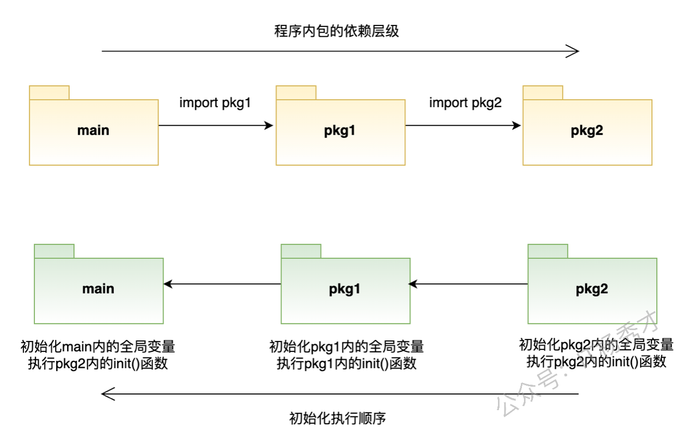

# **程序初始化**

Go应用程序的初始化是在单一的`goroutine`中执行的。对于包这一级别的初始化来说，在一个包里会先进行包级别变量的初始化。一个包下可以有多个`init`函数，每个文件也可以有多个`init` 函数，多个 `init` 函数按照它们的文件名顺序逐个初始化。但是程序不可能把所有代码都放在一个包里，通常都是会引入很多包。如果`main`包引入了`pkg1`包，`pkg1`包本身又导入了包`pkg2`，那么应用程序的初始化会按照什么顺序来执行呢？

对于这个初始化过程我粗略的画了一个示意图，理解起来更直观些。



图的上半部分表示了`main`包导入了`pkg1`包，`pkg1`包又导入了`pkg2`包这样一个包之间的依赖关系。图的下半部分表示了，这个应用初始化工作的执行时间顺序是从被导入的最深层包开始进行初始化，层层递出最后到`main`包，每个包内部的初始化程序依然是先执行包变量初始化再进行`init`函数的执行。

下面通过示例来验证一下这个初始化顺序，在`go_tour`目录下有三个包`package1`和`package2`和`utils`，代码目录如下：

```
├─package1
├─package2
└─utils
```

分别定义测试函数，在`utils`包下有文件`utils.go`，在`package1`包下有文件`package1.go`，在`package2`包下有文件`package2.go`。

```go
package utils

import "fmt"

func TraceLog(t string, v int) int {
   fmt.Printf("TraceLog-----%s--------%d\n", t, v)
   return v
}
```

package1包下有如下程序package1.go：

```go
package package1

import (
   "fmt"
   "go_tour/package2"
   "go_tour/utils"
)

var V1 = utils.TraceLog("init package1 value1", package2.Value1+10)
var V2 = utils.TraceLog("init package1 value2", package2.Value2+10)

func init() {
   fmt.Println("init func in package1")
}
```

package2包下有如下程序package2.go：

```go
package package2

import (
   "fmt"
   "go_tour/utils"
)

var Value1 = utils.TraceLog("init package2 value1", 20)
var Value2 = utils.TraceLog("init package2 value2", 30)

func init() {
   fmt.Println("init func1 in package2")
}

func init() {
   fmt.Println("init func2 in package2")
}
```

主程序`main.go`：

```go
package main

import (
   "fmt"
   "go_tour/package1"
   "go_tour/utils"
)

func init() {
   fmt.Println("init func1 in main")
}

func init() {
   fmt.Println("init func2 in main")
}

var MainValue1 = utils.TraceLog("init M_v1", package1.V1+10)
var MainValue2 = utils.TraceLog("init M_v2", package1.V2+10)

func main() {
   fmt.Println("main func in main")
}
```

执行`go run main.go`，输出结果如下：

```
TraceLog-----init package2 value1--------20
TraceLog-----init package2 value2--------30
init func1 in package2
init func2 in package2                     
TraceLog-----init package1 value1--------30
TraceLog-----init package1 value2--------40
init func in package1                      
TraceLog-----init M_v1--------40           
TraceLog-----init M_v2--------50           
init func1 in main                         
init func2 in main                         
main func in main   
``` 

实验与结论相符合，按照i导入包的层次，最先被依赖的包最先被初始化，且初始化的顺序是先初始化包变量，再说初始化`init`函数。初始化过程总结如下：

- **包级别变量的初始化先于包内`init`函数的执行。**
- **一个包下可以有多个`init`函数，每个文件也可以有多个`init` 函数。**
- **多个 `init` 函数按照它们的文件名顺序逐个初始化。**
- **应用初始化时初始化工作的顺序是，从被导入的最深层包开始进行初始化，层层递出最后到main包。**
- **不管包被导入多少次，包内的`init`函数只会执行一次。**
- **应用在所有初始化工作完成后才会执行`main`函数。**
