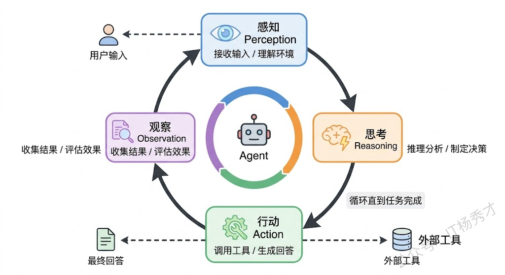
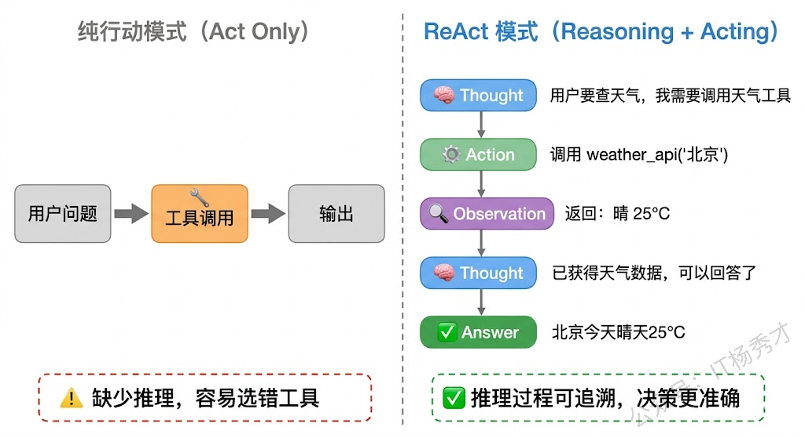
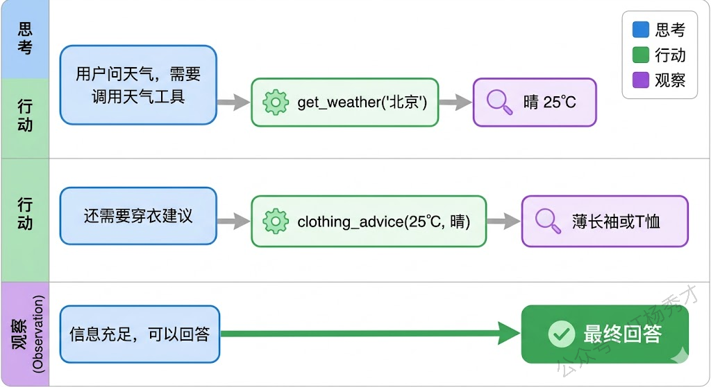
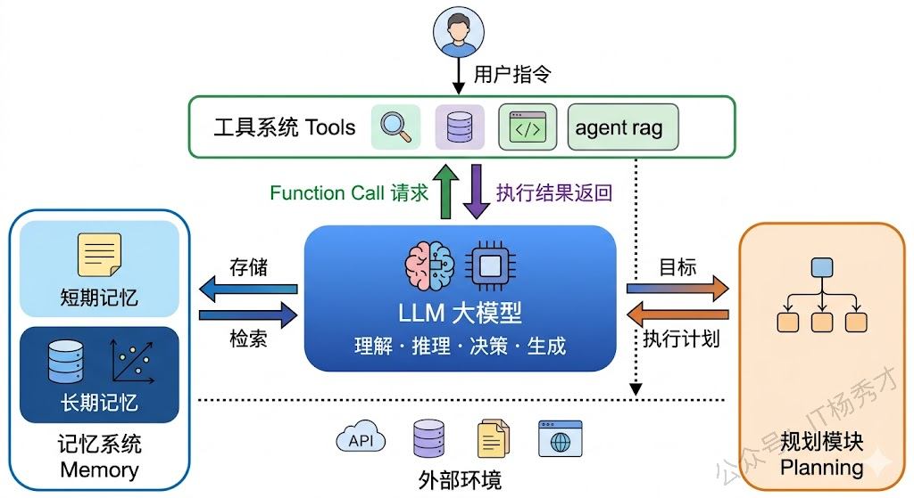
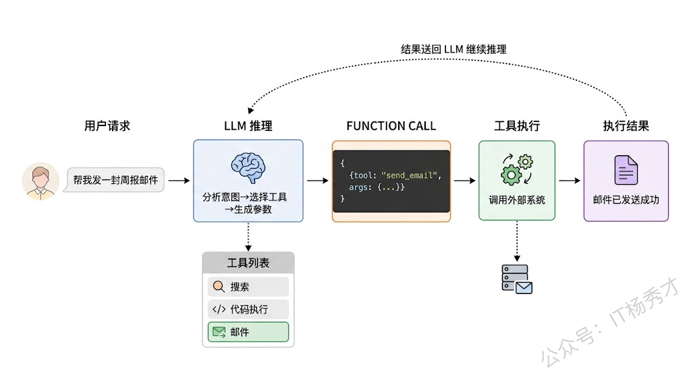
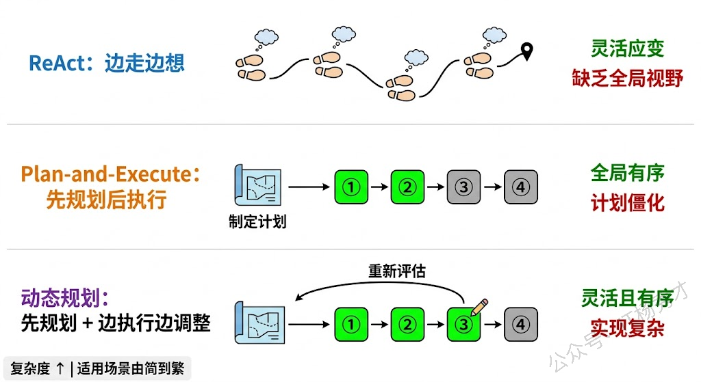
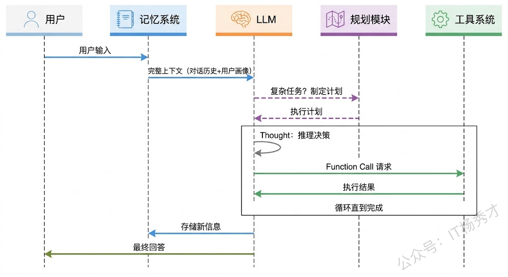

上一篇我们认识了 AI Agent 是什么——它有感知、规划、行动、记忆四大核心能力，本质上是一个以大模型为大脑的自主任务执行系统。但"知道它有什么能力"和"理解它怎么运转"是两回事。

这篇文章，我们就来看看它的内部架构到底是怎样的。这里会从最核心的运行循环开始——感知-思考-行动（Perception-Reasoning-Action）循环，然后深入目前最主流的 Agent 架构范式 ReAct，最后把 Agent 系统的四大组成模块（LLM、工具、记忆、规划）逐一拆解，看看它们各自的职责以及彼此之间是如何协作的。

## **1. 感知-思考-行动**

如果要用一句话概括 Agent 在运行时到底在做什么，那就是：**不断地感知环境、思考对策、执行行动，然后观察行动的结果，再进入下一轮循环**。这个循环是 Agent 最底层的运行机制，所有上层的框架和模式都是在这个基础循环之上构建的。

这个循环和人类处理任务的方式非常相似。想象一个厨师在做菜：他先看一眼菜谱和食材（感知），然后在脑子里想"嗯，先把洋葱切丁"（思考），接着拿起刀开始切（行动），切完之后看一眼效果"嗯，大小合适"（观察），然后再想下一步"该热锅了"（新一轮思考）。这个 感知→思考→行动→观察 的循环会一直持续，直到菜做完端上桌。

Agent 的运行机制一模一样，只不过每个环节换成了技术组件。**感知**环节负责接收和理解信息——用户的输入文本、工具返回的执行结果、环境状态的变化，这些信息都会被整理成大模型能理解的格式。**思考**环节是大模型的主场——它根据当前掌握的所有信息（用户目标、历史上下文、工具返回结果）进行推理，判断任务是否已经完成，如果没完成就决定下一步该做什么。**行动**环节是把思考的结果付诸实践——如果模型决定调用某个工具，就执行工具调用；如果模型认为任务已经完成，就生成最终回答返回给用户。**观察**环节则是收集行动的结果，将其作为新的输入送回感知环节，开启下一轮循环。



这个循环有一个非常重要的特性：**它是自驱动的**。不需要人在每一步都去指挥"下一步该做什么"，Agent 自己通过思考环节来决定。循环什么时候停下来呢？通常有两种情况：一是 Agent 判断任务已经完成（比如用户要的信息已经收集齐了），二是达到了预设的最大循环次数（这是一道安全阀，防止 Agent 陷入无限循环）。

我们用一段 Go 代码来实现这个核心循环的骨架：

```go
package main

import (
    "context"
    "encoding/json"
    "fmt"
    "os"
    "strings"

    openai "github.com/sashabaranov/go-openai"
)

// AgentLoop 实现 Agent 的核心 感知→思考→行动→观察 循环
func AgentLoop(client *openai.Client, goal string, tools []openai.Tool, maxSteps int) string {
    messages := []openai.ChatCompletionMessage{
       {
          Role: "system",
          Content: `你是一个能够使用工具的AI助手。分析用户的目标，决定是否需要调用工具。
如果需要调用工具就调用，如果已经收集到足够信息就直接回答用户。`,
       },
       {Role: "user", Content: goal},
    }

    for step := 1; step <= maxSteps; step++ {
       fmt.Printf("\n=== 循环第 %d 步 ===\n", step)

       // 【思考】大模型根据当前上下文进行推理
       fmt.Println("[思考] 正在分析当前情况...")
       resp, err := client.CreateChatCompletion(context.Background(), openai.ChatCompletionRequest{
          Model:    "qwen-plus",
          Messages: messages,
          Tools:    tools,
       })
       if err != nil {
          fmt.Printf("[错误] 请求失败: %v\n", err)
          return "抱歉，处理过程中出现了错误"
       }

       msg := resp.Choices[0].Message

       // 判断：模型是否决定调用工具？
       if len(msg.ToolCalls) == 0 {
          // 没有工具调用 → 模型认为任务已完成，直接输出回答
          fmt.Println("[完成] Agent 认为任务已完成，生成最终回答")
          return msg.Content
       }

       // 【行动】执行模型选择的工具
       messages = append(messages, msg)
       for _, tc := range msg.ToolCalls {
          fmt.Printf("[行动] 调用工具: %s, 参数: %s\n", tc.Function.Name, tc.Function.Arguments)
          result := executeTool(tc.Function.Name, tc.Function.Arguments)

          // 【观察】收集工具执行结果，送回下一轮循环
          fmt.Printf("[观察] 工具返回: %s\n", result)
          messages = append(messages, openai.ChatCompletionMessage{
             Role:       "tool",
             ToolCallID: tc.ID,
             Content:    result,
          })
       }
       // 自动进入下一轮 感知→思考 ...
    }

    return "已达到最大执行步数，任务未能完成"
}

// executeTool 根据工具名称执行对应操作
func executeTool(name, args string) string {
    switch name {
    case "search":
       var p struct {
          Query string `json:"query"`
       }
       json.Unmarshal([]byte(args), &p)
       // 模拟搜索工具
       if strings.Contains(p.Query, "Go语言") {
          return "Go语言由Google于2009年发布，主要设计者为Robert Griesemer、Rob Pike和Ken Thompson。最新稳定版为Go 1.24。"
       }
       return fmt.Sprintf("关于'%s'的搜索结果：暂无相关信息", p.Query)
    case "calculator":
       var p struct {
          Expression string `json:"expression"`
       }
       json.Unmarshal([]byte(args), &p)
       return fmt.Sprintf("计算结果: %s = 42", p.Expression)
    default:
       return "未知工具"
    }
}

func main() {
    config := openai.DefaultConfig(os.Getenv("DASHSCOPE_API_KEY"))
    config.BaseURL = "https://dashscope.aliyuncs.com/compatible-mode/v1"
    config.APIType = openai.APITypeOpenAI
    client := openai.NewClientWithConfig(config)

    tools := []openai.Tool{
       {
          Type: openai.ToolTypeFunction,
          Function: &openai.FunctionDefinition{
             Name:        "search",
             Description: "搜索互联网获取信息",
             Parameters: json.RawMessage(`{
                                        "type": "object",
                                        "properties": {
                                                "query": {"type": "string", "description": "搜索关键词"}
                                        },
                                        "required": ["query"]
                                }`),
          },
       },
       {
          Type: openai.ToolTypeFunction,
          Function: &openai.FunctionDefinition{
             Name:        "calculator",
             Description: "执行数学计算",
             Parameters: json.RawMessage(`{
                                        "type": "object",
                                        "properties": {
                                                "expression": {"type": "string", "description": "数学表达式"}
                                        },
                                        "required": ["expression"]
                                }`),
          },
       },
    }

    answer := AgentLoop(client, "Go语言是哪一年发布的？最新版本是多少？", tools, 5)
    fmt.Printf("\n最终回答: %s\n", answer)
}
```

运行结果：

```plain&#x20;text
=== 循环第 1 步 ===
[思考] 正在分析当前情况...
[行动] 调用工具: search, 参数: {"query": "Go语言发布年份和最新版本"}
[观察] 工具返回: Go语言由Google于2009年发布，主要设计者为Robert Griesemer、Rob Pike和Ken Thompson。最新稳定版为Go 1.24。

=== 循环第 2 步 ===
[思考] 正在分析当前情况...
[完成] Agent 认为任务已完成，生成最终回答

最终回答: Go语言由Google于2009年发布，最新稳定版本是Go 1.24。
```

这段代码完整地展示了 Agent 核心循环的运行过程。第一步，模型分析用户的问题"Go语言是哪一年发布的"，判断自己的训练数据可能不够准确（尤其是"最新版本"这类实时信息），于是决定调用搜索工具。搜索工具返回结果后，第二步模型拿到了准确信息，判断任务可以完成了，于是直接生成最终回答。两步循环，干净利落。

这里有一个关键点：`maxSteps` 参数。在真实的 Agent 系统中，这个上限非常重要。如果没有它，一旦模型的推理出现偏差（比如反复调用一个无法返回有效结果的工具），Agent 就会陷入无限循环，不断消耗 Token 却毫无进展。设定一个合理的最大步数，既给了 Agent 足够的操作空间，又保证了系统不会失控。

## **2. ReAct**

理解了基础的循环机制之后，我们来看一个非常重要的架构范式——**ReAct（Reasoning + Acting）**。ReAct 是 2022 年由普林斯顿大学和 Google 联合提出的，它的核心思想用一句话概括就是：**让大模型在行动之前先把推理过程说出来**。

为什么要"说出来"？这背后有一个很巧妙的洞察。研究者发现，如果让大模型直接决定"下一步调用什么工具"，它经常会做出不太理想的选择——因为从用户问题直接跳到工具调用，中间缺少了一个"想清楚"的环节。但如果你让模型先用自然语言描述一下"我现在在想什么、为什么要这么做"，再决定行动，效果就会好很多。这有点像考试时要求你写出解题过程——写的过程本身就能帮你理清思路，减少犯错。



ReAct 的每一轮循环包含三个固定步骤：**Thought（思考）→ Action（行动）→ Observation（观察）**。Thought 是模型用自然语言写出的推理过程，比如"用户问的是实时天气，我训练数据里没有这个信息，需要调用天气查询工具"。Action 是基于思考结果做出的具体操作，比如调用天气 API。Observation 是行动的执行结果，比如 API 返回的天气数据。这三个步骤会不断交替，直到模型在 Thought 中判断"我已经有了足够的信息来回答用户"，此时它不再生成 Action，而是直接输出最终回答。

这个"Thought-Action-Observation"的交替模式，让 Agent 的整个推理过程变得**完全可追溯**。当 Agent 做出了一个错误的决策时，你可以通过查看 Thought 日志来定位到底是哪一步的推理出了问题——是理解用户意图时就偏了，还是在选择工具时判断失误，还是在解读工具返回结果时搞错了。这种可追溯性在调试和优化 Agent 时价值巨大。

我们来用 Go 实现一个完整的 ReAct Agent：

```go
package main

import (
        "context"
        "encoding/json"
        "fmt"
        "os"
        "strings"
        "time"

        openai "github.com/sashabaranov/go-openai"
)

// ReActAgent 实现 ReAct 架构的 Agent
type ReActAgent struct {
        client *openai.Client
        tools  []openai.Tool
}

// ReActStep 记录每一步的 Thought-Action-Observation
type ReActStep struct {
        Step        int
        Thought     string
        Action      string
        ActionInput string
        Observation string
}

func NewReActAgent(client *openai.Client, tools []openai.Tool) *ReActAgent {
        return &ReActAgent{client: client, tools: tools}
}

func (a *ReActAgent) Run(goal string, maxSteps int) (string, []ReActStep) {
        var steps []ReActStep

        // ReAct 的核心：通过 system prompt 让模型显式输出 Thought
        systemPrompt := `你是一个使用 ReAct 模式的AI助手。面对用户的问题，你需要：

1. 先在心里思考（Thought）：分析当前情况，判断需要做什么
2. 然后决定行动（Action）：调用合适的工具，或者直接回答

每次回复时，请先用"【思考】"开头写出你的推理过程，然后再决定是调用工具还是直接回答。
如果你认为已经有足够信息来回答用户，就直接给出回答，不需要再调用工具。`

        messages := []openai.ChatCompletionMessage{
                {Role: "system", Content: systemPrompt},
                {Role: "user", Content: goal},
        }

        for step := 1; step <= maxSteps; step++ {
                resp, err := a.client.CreateChatCompletion(context.Background(), openai.ChatCompletionRequest{
                        Model:    "qwen-plus",
                        Messages: messages,
                        Tools:    a.tools,
                })
                if err != nil {
                        fmt.Printf("请求失败: %v\n", err)
                        break
                }

                msg := resp.Choices[0].Message
                record := ReActStep{Step: step}

                // 提取 Thought（模型的文字推理部分）
                if msg.Content != "" {
                        record.Thought = msg.Content
                        fmt.Printf("\n--- Step %d ---\n", step)
                        fmt.Printf("💭 Thought: %s\n", msg.Content)
                }

                // 检查是否有 Action（工具调用）
                if len(msg.ToolCalls) == 0 {
                        // 没有工具调用，说明模型认为可以直接回答了
                        steps = append(steps, record)
                        return msg.Content, steps
                }

                // 执行 Action 并收集 Observation
                messages = append(messages, msg)
                for _, tc := range msg.ToolCalls {
                        record.Action = tc.Function.Name
                        record.ActionInput = tc.Function.Arguments
                        fmt.Printf("🔧 Action: %s(%s)\n", tc.Function.Name, tc.Function.Arguments)

                        result := a.executeTool(tc.Function.Name, tc.Function.Arguments)
                        record.Observation = result
                        fmt.Printf("👁️ Observation: %s\n", result)

                        messages = append(messages, openai.ChatCompletionMessage{
                                Role:       "tool",
                                ToolCallID: tc.ID,
                                Content:    result,
                        })
                }
                steps = append(steps, record)
        }

        return "达到最大步数限制", steps
}

func (a *ReActAgent) executeTool(name, args string) string {
        switch name {
        case "get_weather":
                var p struct {
                        City string `json:"city"`
                }
                json.Unmarshal([]byte(args), &p)
                // 模拟天气 API
                weatherData := map[string]string{
                        "北京": "晴，25°C，湿度40%，东北风3级",
                        "上海": "多云，28°C，湿度65%，东南风2级",
                        "广州": "小雨，30°C，湿度80%，南风4级",
                }
                if w, ok := weatherData[p.City]; ok {
                        return fmt.Sprintf("%s天气: %s", p.City, w)
                }
                return fmt.Sprintf("未找到%s的天气数据", p.City)

        case "get_time":
                return fmt.Sprintf("当前时间: %s", time.Now().Format("2006-01-02 15:04:05"))

        case "clothing_advice":
                var p struct {
                        Temperature int    `json:"temperature"`
                        Weather     string `json:"weather"`
                }
                json.Unmarshal([]byte(args), &p)
                if p.Temperature > 28 {
                        return "建议穿短袖、短裤，注意防晒"
                } else if p.Temperature > 20 {
                        return "建议穿薄长袖或T恤，可带一件薄外套"
                }
                return "建议穿厚外套或毛衣，注意保暖"

        default:
                return "未知工具"
        }
}

func main() {
        config := openai.DefaultConfig(os.Getenv("DASHSCOPE_API_KEY"))
        config.BaseURL = "https://dashscope.aliyuncs.com/compatible-mode/v1"
        config.APIType = openai.APITypeOpenAI
        client := openai.NewClientWithConfig(config)

        tools := []openai.Tool{
                {
                        Type: openai.ToolTypeFunction,
                        Function: &openai.FunctionDefinition{
                                Name:        "get_weather",
                                Description: "查询指定城市的实时天气信息",
                                Parameters: json.RawMessage(`{
                                        "type": "object",
                                        "properties": {
                                                "city": {"type": "string", "description": "城市名称"}
                                        },
                                        "required": ["city"]
                                }`),
                        },
                },
                {
                        Type: openai.ToolTypeFunction,
                        Function: &openai.FunctionDefinition{
                                Name:        "get_time",
                                Description: "获取当前时间",
                                Parameters: json.RawMessage(`{
                                        "type": "object",
                                        "properties": {}
                                }`),
                        },
                },
                {
                        Type: openai.ToolTypeFunction,
                        Function: &openai.FunctionDefinition{
                                Name:        "clothing_advice",
                                Description: "根据天气和温度给出穿衣建议",
                                Parameters: json.RawMessage(`{
                                        "type": "object",
                                        "properties": {
                                                "temperature": {"type": "integer", "description": "温度（摄氏度）"},
                                                "weather": {"type": "string", "description": "天气状况"}
                                        },
                                        "required": ["temperature", "weather"]
                                }`),
                        },
                },
        }

        agent := NewReActAgent(client, tools)
        answer, steps := agent.Run("今天北京天气怎么样？需要带伞吗？穿什么合适？", 10)

        fmt.Println("\n========== 执行摘要 ==========")
        fmt.Printf("共执行 %d 步\n", len(steps))
        for _, s := range steps {
                fmt.Printf("Step %d: ", s.Step)
                if s.Action != "" {
                        fmt.Printf("调用了 %s\n", s.Action)
                } else {
                        fmt.Printf("生成了最终回答\n")
                }
        }
        fmt.Printf("\n最终回答:\n%s\n", cleanAnswer(answer))
}

func cleanAnswer(s string) string {
        // 去除可能的思考标记前缀，只保留实际回答
        if idx := strings.LastIndex(s, "】"); idx != -1 && idx < len(s)-3 {
                return strings.TrimSpace(s[idx+3:])
        }
        return s
}
```

运行结果：

```plain&#x20;text
--- Step 1 ---
💭 Thought: 【思考】用户询问北京今天的天气、是否需要带伞，以及穿衣建议。我需要先获取北京的实时天气信息，然后根据天气和温度给出穿衣建议。带伞的建议可以包含在穿衣建议中，或者从天气状况（如是否有雨）直接推断。因此，我先调用 get_weather 获取北京天气，再调用 clothing_advice 给出穿衣建议。

🔧 Action: get_weather({"city": "北京"})
👁️ Observation: 北京天气: 晴，25°C，湿度40%，东北风3级

--- Step 2 ---
💭 Thought: 【思考】已获取北京天气：晴，25°C，湿度40%，东北风3级。没有降水，因此不需要带伞。接下来调用 clothing_advice，传入 temperature=25 和 weather="晴"，以获取合适的穿衣建议。


🔧 Action: clothing_advice({"temperature": 25, "weather": "晴"})
👁️ Observation: 建议穿薄长袖或T恤，可带一件薄外套

--- Step 3 ---
💭 Thought: 今天北京天气晴朗，气温25°C，湿度适中（40%），东北风3级，无降水，**不需要带伞**。  
穿衣建议：可穿薄长袖衬衫或T恤，早晚微凉，建议携带一件薄外套以备不时之需。

========== 执行摘要 ==========
共执行 3 步
Step 1: 调用了 get_weather
Step 2: 调用了 clothing_advice
Step 3: 生成了最终回答

最终回答:
今天北京天气晴朗，气温25°C，湿度适中（40%），东北风3级，无降水，**不需要带伞**。  
穿衣建议：可穿薄长袖衬衫或T恤，早晚微凉，建议携带一件薄外套以备不时之需。
```

仔细观察这个运行过程，你能清楚地看到 ReAct 的三步交替：每一步模型都先输出了自己的思考（Thought），然后基于思考决定行动（Action），拿到行动结果（Observation）后再进入下一轮思考。第一步思考"需要查天气"→调用天气工具→得到天气数据。第二步思考"晴天不需要带伞，但还需要穿衣建议"→调用穿衣建议工具→得到建议。第三步思考"信息齐了"→直接生成回答。

如果我们去掉 Thought 环节，直接让模型决定调用什么工具，它很可能在第一步就试图同时回答所有问题，或者在拿到天气数据后直接自己编一个穿衣建议而不去调用专门的工具。Thought 的存在，让模型每一步都"想清楚再动手"，这就是 ReAct 的精髓。



## **3. Agent 系统的四大模块**

了解了 Agent 的运行循环和 ReAct 架构之后，我们把视角拉高一层，来看看一个完整的 Agent 系统在架构层面由哪些模块组成。不管你用的是 Google ADK、LangChain、还是自己从零搭建，一个功能完备的 Agent 系统都包含四个核心模块：**LLM（大脑）**、**工具系统（手脚）**、**记忆系统（笔记本）和规划模块（导航仪）**。



### **3.1 LLM**

LLM 是整个 Agent 系统的核心中枢，所有的"智能"都源于此。在 Agent 的每一轮循环中，LLM 承担着几个关键职责。

首先是**意图理解**。用户的输入可能是模糊的、省略的、甚至有歧义的，LLM 需要准确理解用户到底想要什么。比如用户说"把上次那个报告更新一下"，LLM 需要结合上下文（从记忆中检索"上次的报告"是哪个）来理解这个请求。

其次是**推理决策**。在 ReAct 架构中，LLM 负责生成 Thought——分析当前状况，决定下一步该做什么。这是 Agent 最"智能"的部分，也是最依赖模型能力的部分。一个好的模型能做出合理的推理链条，一个差的模型可能会在推理中跑偏。

第三是**工具调度**。LLM 根据推理结果，决定要不要调用工具、调用哪个工具、传什么参数。这里模型需要理解每个工具的功能描述，判断它是否适合当前需要，并生成正确格式的调用参数。

最后是**结果整合和表达**。当所有需要的信息都收集齐了，LLM 负责将这些信息整合成一个连贯、有条理的回答，用用户能理解的方式表达出来。

在实际项目中，LLM 的选择直接决定了 Agent 的"智商上限"。推理能力强的模型（如 qwen-max）适合处理复杂的多步骤任务，响应速度快的模型（如 qwen-turbo）适合简单的工具调用场景。很多成熟的 Agent 系统会针对不同任务使用不同的模型——简单任务用轻量模型快速处理，复杂任务再上大模型，这样既保证了效果又控制了成本。

### **3.2 工具系统**

如果说 LLM 是 Agent 的大脑，那工具系统就是它的手脚。没有工具的 Agent 就是一个只能空想的"纯理论家"，有了工具它才能真正和外部世界交互。

一个工具在技术上的定义其实很简单：一个**函数**加上一段**描述**。函数定义了这个工具能做什么（比如查询天气、发送邮件），描述则告诉 LLM 这个工具在什么场景下适合使用、需要什么参数。LLM 并不会直接执行工具——它只是生成一个"我想调用这个工具，参数是这些"的结构化请求，真正的执行是由应用层代码完成的。

> 工具系统的设计有几个关键原则值得注意。**工具描述要清晰准确**——LLM 完全依赖工具描述来判断该不该用这个工具，如果描述写得模糊或有误导性，模型就会做出错误的选择。**工具粒度要适中**——一个工具做太多事情会让模型困惑（"这个万能工具到底什么时候该用？"），一个工具做太少又会导致完成简单任务也要调用一串工具。**工具的输入输出要有明确的 Schema**——模型需要知道该传什么参数、会得到什么格式的返回，Schema 越清晰，工具调用的准确率就越高。

我们通过一段代码来看看工具系统的设计模式：

```go
package main

import (
        "encoding/json"
        "fmt"
        "strings"
)

// Tool 工具的统一接口
type Tool struct {
        Name        string                 // 工具名称
        Description string                 // 工具描述（给LLM看的）
        Parameters  map[string]interface{} // 参数 Schema
        Execute     func(args string) string // 执行函数
}

// ToolRegistry 工具注册中心
type ToolRegistry struct {
        tools map[string]*Tool
}

func NewToolRegistry() *ToolRegistry {
        return &ToolRegistry{tools: make(map[string]*Tool)}
}

func (r *ToolRegistry) Register(tool *Tool) {
        r.tools[tool.Name] = tool
        fmt.Printf("[注册工具] %s: %s\n", tool.Name, tool.Description)
}

func (r *ToolRegistry) Execute(name, args string) (string, error) {
        tool, ok := r.tools[name]
        if !ok {
                return "", fmt.Errorf("工具 %s 不存在", name)
        }
        fmt.Printf("[执行工具] %s, 参数: %s\n", name, args)
        result := tool.Execute(args)
        fmt.Printf("[工具结果] %s\n", result)
        return result, nil
}

// ListToolDescriptions 生成给 LLM 看的工具列表
func (r *ToolRegistry) ListToolDescriptions() string {
        var descriptions []string
        for _, tool := range r.tools {
                desc := fmt.Sprintf("- %s: %s", tool.Name, tool.Description)
                descriptions = append(descriptions, desc)
        }
        return strings.Join(descriptions, "\n")
}

func main() {
        registry := NewToolRegistry()

        // 注册一组工具
        registry.Register(&Tool{
                Name:        "web_search",
                Description: "搜索互联网获取实时信息，适用于查询新闻、百科知识、最新数据等",
                Execute: func(args string) string {
                        var p struct{ Query string `json:"query"` }
                        json.Unmarshal([]byte(args), &p)
                        return fmt.Sprintf("搜索'%s'的结果: 找到3条相关信息...", p.Query)
                },
        })

        registry.Register(&Tool{
                Name:        "code_executor",
                Description: "执行Python代码片段并返回结果，适用于数据计算、数据可视化等",
                Execute: func(args string) string {
                        var p struct{ Code string `json:"code"` }
                        json.Unmarshal([]byte(args), &p)
                        return fmt.Sprintf("代码执行成功，输出: [计算结果]")
                },
        })

        registry.Register(&Tool{
                Name:        "send_email",
                Description: "发送电子邮件，需要提供收件人、主题和正文",
                Execute: func(args string) string {
                        var p struct {
                                To      string `json:"to"`
                                Subject string `json:"subject"`
                        }
                        json.Unmarshal([]byte(args), &p)
                        return fmt.Sprintf("邮件已发送给 %s，主题: %s", p.To, p.Subject)
                },
        })

        // 打印工具描述（实际使用时这些描述会发送给 LLM）
        fmt.Println("\n可用工具列表:")
        fmt.Println(registry.ListToolDescriptions())

        // 模拟工具调用
        fmt.Println()
        registry.Execute("web_search", `{"query":"2024年诺贝尔物理学奖"}`)
        fmt.Println()
        registry.Execute("send_email", `{"to":"team@example.com","subject":"周报"}`)
}
```

运行结果：

```plain&#x20;text
[注册工具] web_search: 搜索互联网获取实时信息，适用于查询新闻、百科知识、最新数据等
[注册工具] code_executor: 执行Python代码片段并返回结果，适用于数据计算、数据可视化等
[注册工具] send_email: 发送电子邮件，需要提供收件人、主题和正文

可用工具列表:
- web_search: 搜索互联网获取实时信息，适用于查询新闻、百科知识、最新数据等
- code_executor: 执行Python代码片段并返回结果，适用于数据计算、数据可视化等
- send_email: 发送电子邮件，需要提供收件人、主题和正文

[执行工具] web_search, 参数: {"query":"2024年诺贝尔物理学奖"}
[工具结果] 搜索'2024年诺贝尔物理学奖'的结果: 找到3条相关信息...

[执行工具] send_email, 参数: {"to":"team@example.com","subject":"周报"}
[工具结果] 邮件已发送给 team@example.com，主题: 周报
```

这个工具注册中心的设计模式在实际的 Agent 框架中非常常见。每个工具都有名称、描述和执行函数，注册到统一的 Registry 中。当 LLM 决定调用某个工具时，应用层只需要拿着工具名称到 Registry 里查找并执行就行。这种设计让工具的添加和管理变得非常灵活——想给 Agent 增加新能力，只要注册一个新工具就行了。



### **3.3 记忆系统**

上一篇文章已经介绍了 Agent 的三种记忆（短期、长期、工作记忆），这里我们从架构角度来看记忆系统在整个 Agent 中是如何运作的。

记忆系统在 Agent 架构中的位置有点像一个"信息中转站"。在每一轮循环中，记忆系统参与了两个关键环节：**循环开始时提供上下文**和**循环结束时存储新信息**。

循环开始时，记忆系统需要为 LLM 的推理提供足够的背景信息。这包括：把短期记忆（对话历史）整理成消息列表、从长期记忆中检索与当前问题相关的历史知识、从工作记忆中恢复之前执行到一半的任务状态。所有这些信息汇总后，作为 LLM 的输入上下文。

循环结束时，记忆系统需要把这一轮产生的新信息持久化：用户的新消息和 Agent 的回复添加到短期记忆、从对话中提取的重要信息（如用户偏好）保存到长期记忆、任务的中间状态更新到工作记忆。

我们来看一个结合了记忆系统的 Agent 实现：

```go
package main

import (
    "context"
    "fmt"
    "os"
    "strings"
    "sync"

    openai "github.com/sashabaranov/go-openai"
)

// MemorySystem 完整的记忆系统
type MemorySystem struct {
    shortTerm    []openai.ChatCompletionMessage // 短期记忆：对话历史
    longTerm     map[string]string              // 长期记忆：持久化知识
    workingState map[string]string              // 工作记忆：任务中间状态
    mu           sync.RWMutex
}

func NewMemorySystem() *MemorySystem {
    return &MemorySystem{
       shortTerm:    []openai.ChatCompletionMessage{},
       longTerm:     make(map[string]string),
       workingState: make(map[string]string),
    }
}

// BuildContext 构建 LLM 推理所需的完整上下文
func (m *MemorySystem) BuildContext(currentQuery string) []openai.ChatCompletionMessage {
    m.mu.RLock()
    defer m.mu.RUnlock()

    var messages []openai.ChatCompletionMessage

    // 1. 系统提示词（融入长期记忆中的用户画像）
    systemPrompt := "你是一个智能助手。"
    if len(m.longTerm) > 0 {
       systemPrompt += "\n\n你已经了解的用户信息："
       for k, v := range m.longTerm {
          systemPrompt += fmt.Sprintf("\n- %s: %s", k, v)
       }
    }

    // 2. 融入工作记忆中的任务状态
    if len(m.workingState) > 0 {
       systemPrompt += "\n\n当前任务状态："
       for k, v := range m.workingState {
          systemPrompt += fmt.Sprintf("\n- %s: %s", k, v)
       }
    }

    messages = append(messages, openai.ChatCompletionMessage{
       Role:    "system",
       Content: systemPrompt,
    })

    // 3. 附加短期记忆（历史对话，保留最近的几轮）
    maxHistory := 10
    start := 0
    if len(m.shortTerm) > maxHistory {
       start = len(m.shortTerm) - maxHistory
    }
    messages = append(messages, m.shortTerm[start:]...)

    // 4. 当前用户输入
    messages = append(messages, openai.ChatCompletionMessage{
       Role:    "user",
       Content: currentQuery,
    })

    return messages
}

// AfterInteraction 交互后更新记忆
func (m *MemorySystem) AfterInteraction(userMsg, assistantMsg string) {
    m.mu.Lock()
    defer m.mu.Unlock()

    // 更新短期记忆
    m.shortTerm = append(m.shortTerm,
       openai.ChatCompletionMessage{Role: "user", Content: userMsg},
       openai.ChatCompletionMessage{Role: "assistant", Content: assistantMsg},
    )

    // 从对话中提取信息存入长期记忆（简化版，实际应用中应由 LLM 来提取）
    lower := strings.ToLower(userMsg)
    if strings.Contains(lower, "我叫") || strings.Contains(lower, "我是") {
       if strings.Contains(userMsg, "后端") || strings.Contains(userMsg, "Go") {
          m.longTerm["技术方向"] = "Go后端开发"
       }
    }
    if strings.Contains(lower, "项目") && strings.Contains(lower, "在做") {
       m.longTerm["当前项目"] = userMsg
    }
}

// SetWorkingState 设置工作记忆
func (m *MemorySystem) SetWorkingState(key, value string) {
    m.mu.Lock()
    defer m.mu.Unlock()
    m.workingState[key] = value
}

// Status 返回记忆系统的状态概览
func (m *MemorySystem) Status() string {
    m.mu.RLock()
    defer m.mu.RUnlock()

    var parts []string
    parts = append(parts, fmt.Sprintf("短期记忆: %d 条消息", len(m.shortTerm)))
    parts = append(parts, fmt.Sprintf("长期记忆: %d 条", len(m.longTerm)))
    for k, v := range m.longTerm {
       parts = append(parts, fmt.Sprintf("  · %s = %s", k, v))
    }
    parts = append(parts, fmt.Sprintf("工作记忆: %d 条", len(m.workingState)))
    for k, v := range m.workingState {
       parts = append(parts, fmt.Sprintf("  · %s = %s", k, v))
    }
    return strings.Join(parts, "\n")
}

func main() {
    config := openai.DefaultConfig(os.Getenv("DASHSCOPE_API_KEY"))
    config.BaseURL = "https://dashscope.aliyuncs.com/compatible-mode/v1"
    config.APIType = openai.APITypeOpenAI
    client := openai.NewClientWithConfig(config)

    memory := NewMemorySystem()

    // 模拟多轮对话，观察记忆系统的变化
    conversations := []string{
       "你好，我是一名Go后端开发工程师",
       "我最近在做一个微服务项目，用的是gRPC框架",
       "帮我解释一下context包在并发中的作用",
    }

    for i, userMsg := range conversations {
       fmt.Printf("\n====== 第 %d 轮 ======\n", i+1)
       fmt.Printf("用户: %s\n", userMsg)

       // 设置工作记忆（模拟任务状态跟踪）
       memory.SetWorkingState("当前对话轮次", fmt.Sprintf("第%d轮", i+1))

       // 从记忆系统构建完整上下文
       messages := memory.BuildContext(userMsg)

       // 调用 LLM
       resp, err := client.CreateChatCompletion(context.Background(), openai.ChatCompletionRequest{
          Model:    "qwen-plus",
          Messages: messages,
       })
       if err != nil {
          fmt.Printf("请求失败: %v\n", err)
          continue
       }

       reply := resp.Choices[0].Message.Content
       fmt.Printf("Agent: %s\n", reply[:min(len(reply), 200)]) // 截取前200字符展示

       // 交互后更新记忆
       memory.AfterInteraction(userMsg, reply)
    }

    // 展示最终的记忆状态
    fmt.Printf("\n====== 记忆系统状态 ======\n%s\n", memory.Status())
}

func min(a, b int) int {
    if a < b {
       return a
    }
    return b
}
```

运行结果：

```plain&#x20;text
====== 第 1 轮 ======
用户: 你好，我是一名Go后端开发工程师
Agent: 你好！很高兴认识一位 Go 后端开发工程师 👋  
Go 语言在高并发、云原生和微服务领域确实非常出色，简洁的语法、高效的 goroutine 和强大的标准库让很

====== 第 2 轮 ======
用户: 我最近在做一个微服务项目，用的是gRPC框架
Agent: 太棒了！gRPC + Go 是微服务领域的黄金组合 🌟 —— 高性能、强契约、天然支持多语言，特别适合内部服务间通信。

为了更精准地帮到你，我想先了解�

====== 第 3 轮 ======
用户: 帮我解释一下context包在并发中的作用
Agent: 非常好的问题！`context` 包是 Go 并发编程中**最核心、也最容易被低估的基石之一**——它远不止是“传取消信号”那么简单，而是 Go 实现**可控、可组�

====== 记忆系统状态 ======
短期记忆: 6 条消息
长期记忆: 2 条
  · 技术方向 = Go后端开发
  · 当前项目 = 我最近在做一个微服务项目，用的是gRPC框架
工作记忆: 1 条
  · 当前对话轮次 = 第3轮
```

注意看第三轮对话中 Agent 的回答——它不仅解释了 context 包的通用作用，还主动关联到了用户"正在做的 gRPC 微服务项目"。这是因为记忆系统在第二轮对话后就把"当前项目是 gRPC 微服务"这个信息存入了长期记忆，第三轮构建上下文时这个信息被融入了系统提示词，LLM 自然就会结合用户的项目背景来回答。这就是记忆系统的价值——**让 Agent 的每一次回答都基于对用户的完整理解，而不是孤立地处理单个问题**。

### **3.4 规划模块**

规划模块是四大模块中最"高级"的一个——前面三个模块（LLM、工具、记忆）提供了基础能力，而规划模块让 Agent 能够处理真正复杂的任务。

为什么需要规划？因为很多真实世界的任务不是"调一个工具就能搞定"的。比如用户说"帮我做一个竞品分析报告"，这个任务涉及信息搜集、数据整理、对比分析、报告生成等多个阶段，每个阶段可能又需要调用不同的工具、处理不同的数据。如果没有规划，Agent 只能走一步看一步，很容易在中途迷失方向或者遗漏重要步骤。有了规划，Agent 就能在开始执行之前先制定一个全局计划，然后按照计划有条不紊地推进。

目前 Agent 的规划策略主要有三种主流思路。

> **第一种是 ReAct 式的"边走边想"**。这就是我们前面讲的 ReAct 架构，它没有一个独立的"制定计划"环节，而是每一步都重新思考下一步该做什么。这种方式灵活性最高——每一步都能根据最新情况调整方向，但缺点是缺乏全局视野，容易"只见树木不见森林"。

> **第二种是 Plan-and-Execute（先规划后执行）**。这种方式在任务开始时先让 LLM 制定一个完整的执行计划（分解为多个子任务），然后逐一执行这些子任务。好处是有全局视野，不会遗漏步骤；缺点是计划制定后比较"死板"，如果执行过程中情况发生变化，需要额外的机制来更新计划。

> **第三种是两者结合——动态规划**。先制定一个初步计划，但在执行每一步后都会评估是否需要调整计划。这种方式综合了前两者的优点，但实现复杂度也最高。



我们来实现一个 Plan-and-Execute 策略的简化版本：

```go
package main

import (
    "context"
    "encoding/json"
    "fmt"
    "os"

    openai "github.com/sashabaranov/go-openai"
)

// Plan 执行计划
type Plan struct {
    Goal  string   // 总目标
    Steps []string // 分解后的步骤
}

// PlanAndExecuteAgent 先规划后执行的 Agent
type PlanAndExecuteAgent struct {
    client *openai.Client
}

func NewPlanAndExecuteAgent(client *openai.Client) *PlanAndExecuteAgent {
    return &PlanAndExecuteAgent{client: client}
}

// MakePlan 让 LLM 制定执行计划
func (a *PlanAndExecuteAgent) MakePlan(goal string) (*Plan, error) {
    resp, err := a.client.CreateChatCompletion(context.Background(), openai.ChatCompletionRequest{
       Model: "qwen-plus",
       Messages: []openai.ChatCompletionMessage{
          {
             Role: "system",
             Content: `你是一个任务规划专家。用户会给你一个目标，你需要将其分解为3-5个可执行的步骤。
请严格按照JSON格式返回，不要包含其他内容：
{"steps": ["步骤1", "步骤2", "步骤3"]}`,
          },
          {Role: "user", Content: goal},
       },
    })
    if err != nil {
       return nil, err
    }

    var result struct {
       Steps []string `json:"steps"`
    }
    content := resp.Choices[0].Message.Content
    if err := json.Unmarshal([]byte(content), &result); err != nil {
       // 尝试提取 JSON 部分
       return &Plan{
          Goal:  goal,
          Steps: []string{"分析需求", "执行任务", "输出结果"},
       }, nil
    }

    return &Plan{Goal: goal, Steps: result.Steps}, nil
}

// ExecuteStep 执行计划中的单个步骤
func (a *PlanAndExecuteAgent) ExecuteStep(step string, previousResults []string) (string, error) {
    contextInfo := ""
    if len(previousResults) > 0 {
       contextInfo = "\n\n前面步骤的执行结果：\n"
       for i, r := range previousResults {
          contextInfo += fmt.Sprintf("步骤%d结果: %s\n", i+1, r)
       }
    }

    resp, err := a.client.CreateChatCompletion(context.Background(), openai.ChatCompletionRequest{
       Model: "qwen-plus",
       Messages: []openai.ChatCompletionMessage{
          {
             Role:    "system",
             Content: "你是一个任务执行助手。请执行用户指定的步骤并给出简洁的结果。" + contextInfo,
          },
          {Role: "user", Content: fmt.Sprintf("请执行这个步骤: %s", step)},
       },
    })
    if err != nil {
       return "", err
    }
    return resp.Choices[0].Message.Content, nil
}

// Run 完整的规划-执行流程
func (a *PlanAndExecuteAgent) Run(goal string) {
    fmt.Printf("🎯 目标: %s\n", goal)
    fmt.Println("\n📋 正在制定执行计划...")

    // 阶段一：制定计划
    plan, err := a.MakePlan(goal)
    if err != nil {
       fmt.Printf("规划失败: %v\n", err)
       return
    }

    fmt.Printf("✅ 计划制定完成，共 %d 个步骤:\n", len(plan.Steps))
    for i, step := range plan.Steps {
       fmt.Printf("   %d. %s\n", i+1, step)
    }

    // 阶段二：逐步执行
    var results []string
    for i, step := range plan.Steps {
       fmt.Printf("\n🔄 执行步骤 %d/%d: %s\n", i+1, len(plan.Steps), step)

       result, err := a.ExecuteStep(step, results)
       if err != nil {
          fmt.Printf("❌ 步骤执行失败: %v\n", err)
          continue
       }
       results = append(results, result)

       // 只展示结果的前150个字符
       display := result
       if len(display) > 150 {
          display = display[:150] + "..."
       }
       fmt.Printf("   结果: %s\n", display)
    }

    fmt.Println("\n✅ 所有步骤执行完成！")
}

func main() {
    config := openai.DefaultConfig(os.Getenv("DASHSCOPE_API_KEY"))
    config.BaseURL = "https://dashscope.aliyuncs.com/compatible-mode/v1"
    config.APIType = openai.APITypeOpenAI
    client := openai.NewClientWithConfig(config)

    agent := NewPlanAndExecuteAgent(client)
    agent.Run("帮我分析Go语言和Rust语言在Web后端开发领域的优劣势对比")
}
```

运行结果：

```plain&#x20;text
🎯 目标: 帮我分析Go语言和Rust语言在Web后端开发领域的优劣势对比

📋 正在制定执行计划...
✅ 计划制定完成，共 4 个步骤:
   1. 梳理Go语言在Web后端开发中的核心优势和不足
   2. 梳理Rust语言在Web后端开发中的核心优势和不足
   3. 从性能、开发效率、生态、学习曲线等维度进行对比分析
   4. 给出不同场景下的技术选型建议

🔄 执行步骤 1/4: 梳理Go语言在Web后端开发中的核心优势和不足
   结果: Go语言的核心优势：语法简洁易学，编译速度快，原生支持高并发（goroutine+channel），标准库丰富（net/http开箱即用），部署简单（编译成单一二进制文件）。不足之处...

🔄 执行步骤 2/4: 梳理Rust语言在Web后端开发中的核心优势和不足
   结果: Rust的核心优势：内存安全（所有权系统，无GC），极致性能（接近C/C++），类型系统强大，并发安全（编译期保证）。不足：学习曲线陡峭（所有权和生命周期概念），编译速度慢...

🔄 执行步骤 3/4: 从性能、开发效率、生态、学习曲线等维度进行对比分析
   结果: 性能方面：Rust略优于Go，尤其在CPU密集型场景下。开发效率：Go明显优于Rust，同等复杂度的项目Go开发周期通常更短。生态：Go在Web后端生态更成熟（Gin、Echo、gR...

🔄 执行步骤 4/4: 给出不同场景下的技术选型建议
   结果: 建议：追求快速迭代和团队协作效率选Go，追求极致性能和内存安全选Rust。中小型Web服务和微服务推荐Go，高性能基础设施（数据库、代理、消息中间件）推荐Rust...

✅ 所有步骤执行完成！
```

Plan-and-Execute 模式的特点在这个例子中体现得很清楚：Agent 先制定了一个包含 4 个步骤的完整计划，然后严格按照计划逐步执行。每一步的执行结果会传递给后续步骤作为参考（通过 `previousResults` 参数），这保证了步骤之间的连贯性——第三步的对比分析是基于前两步的梳理结果来做的，而不是凭空编造。

## **4. 四大模块的协作全景**

讲完了四个独立模块，最后我们把视角拉到最高，看看它们在一次完整的 Agent 任务中是如何协同工作的。

假设用户对 Agent 说了一句"帮我查查最近的 Go 1.24 有什么新特性，整理成中文摘要"。以下是 Agent 内部的完整运行过程：

首先，**记忆系统**出场。它把用户的这句话和之前的对话历史（短期记忆）、用户的技术偏好（长期记忆里记着"这个用户是 Go 开发者"）一起整理好，构建出完整的上下文。

接着，**LLM** 拿到这个上下文开始推理。它的 Thought 可能是："用户想了解 Go 1.24 的新特性，这是实时信息，我需要先搜索一下。"于是它生成了一个 Function Call 请求：调用 `web_search` 工具，参数是 "Go 1.24 release notes"。

然后，**工具系统**登场。它接收到 LLM 的调用请求，执行 `web_search` 工具，拿到了一堆搜索结果。

结果返回给 **LLM**，它进行第二轮推理："搜索结果拿到了，但内容是英文的，用户要的是中文摘要。我已经有了足够的信息，可以直接整理了。"于是它不再调用工具，而是直接生成了一份中文摘要作为最终回答。

最后，**记忆系统**再次出场，把这次的对话（用户的问题和 Agent 的回答）存入短期记忆，同时可能在长期记忆中更新一条"用户关注 Go 新版本动态"的标签。

在这个过程中，如果任务更复杂（比如"帮我对比 Go 1.24 和 Go 1.23 的性能差异"），**规划模块**也会参与进来，把大任务拆解成"搜索 1.24 特性→搜索 1.23 特性→对比分析→生成报告"这样的执行计划。



四个模块各司其职又紧密配合：LLM 是指挥中心，工具系统是执行部门，记忆系统是档案室，规划模块是参谋部。它们之间的分工明确，但接口统一——这也是为什么像 ADK 这样的框架能把它们优雅地组装在一起的原因。

## **5. 小结**

核心循环（感知→思考→行动→观察）定义了 Agent 的基本运行机制，ReAct 框架在此基础上引入了显式的推理链，使每一步决策都可追溯、可调试。

架构层面，LLM、工具、记忆、规划四个模块各有明确职责：LLM 负责推理与决策，工具扩展 Agent 的行动边界，记忆维护上下文的连续性，规划处理复杂任务的分解与调度。关键在于这四个模块不是独立运行的，而是在每一轮循环中协同工作——理解这一点，就能理解主流 Agent 框架的设计逻辑。


<div style="background-color: #f0f9eb; padding: 10px 15px; border-radius: 4px; border-left: 5px solid #67c23a; margin: 20px 0; color:rgb(64, 147, 255);">

<span style="color: #006400; font-size: 28px;"><strong>关注秀才公众号：</strong></span><span style="color: red; font-size: 28px;"><strong>IT杨秀才</strong></span><span style="color: #006400; font-size: 28px;"><strong>，回复：</strong></span><span style="color: red; font-size: 28px;"><strong>面试</strong></span>

<div style="text-align: center;"><span style="color: #006400; font-size: 28px;"><strong>领取后端/AI面试题库PDF</strong></span></div>


</div> 

