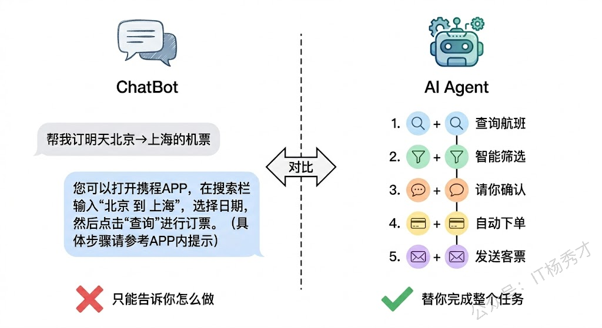
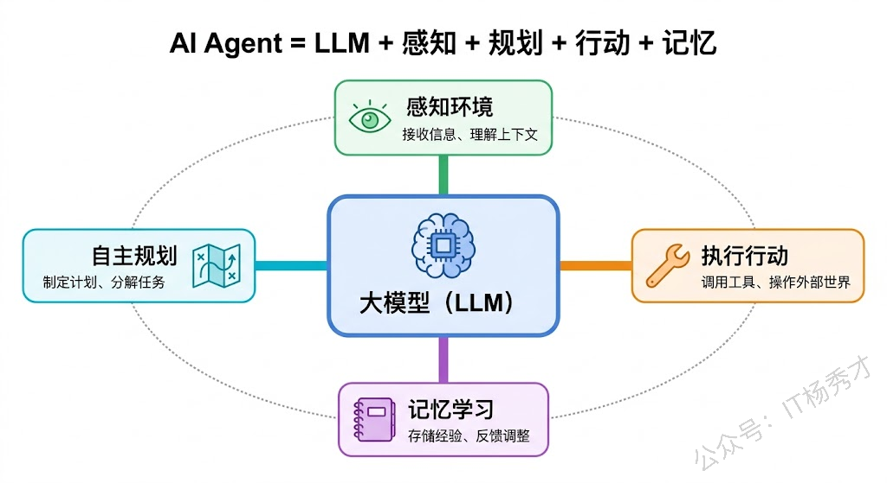
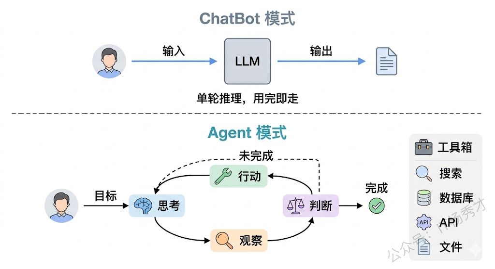
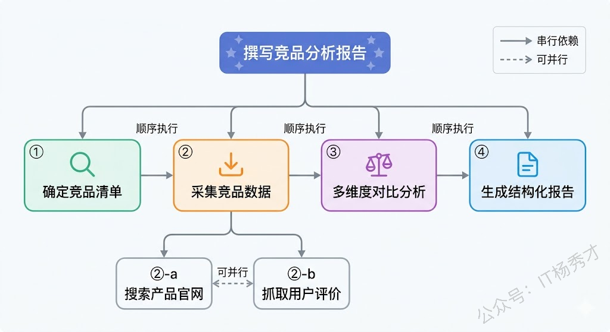
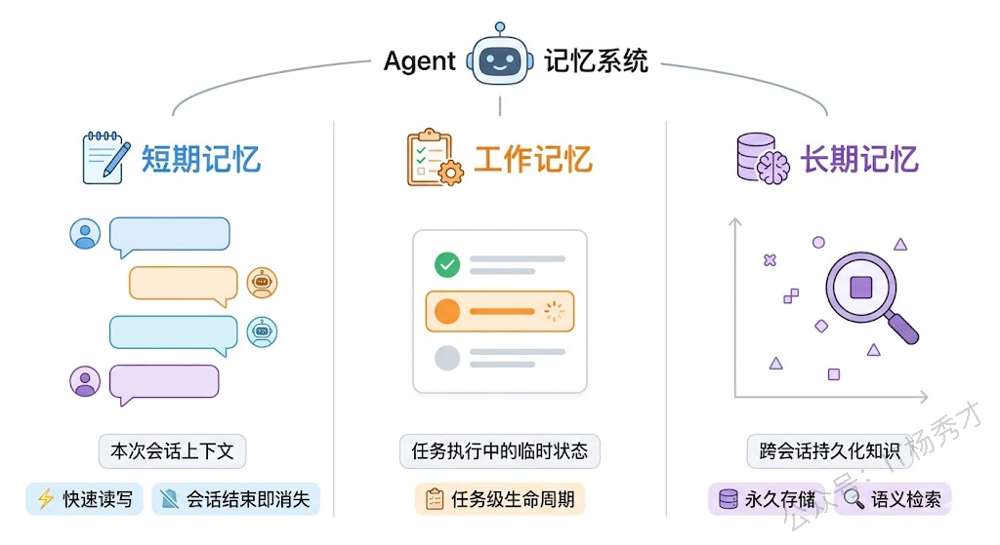
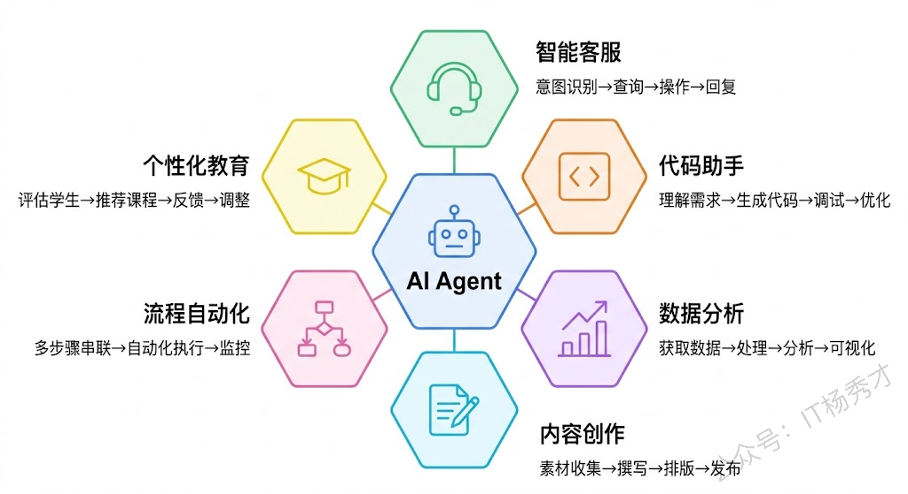
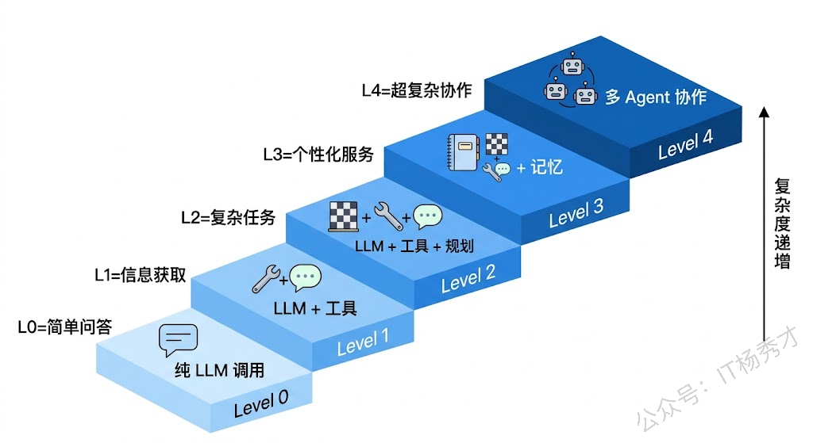

如果说大模型是一颗最强大脑，那么 AI Agent 就是拥有这颗大脑的完整的人——它不仅能思考，还能感知环境、制定计划、使用工具、记住经历，最终自主地完成复杂任务。

过去几篇文章，我们一直在和大模型本身打交道：了解它的原理、学习 Prompt 的写法、用 Go 代码调用 API。你会发现，直接调用大模型 API 虽然已经很强大，但本质上它还是一个被动应答器——你问它一句，它回你一句，聊完就忘，下次还得从头来。如果你想让 AI 帮你完成一个真正复杂的任务，比如"帮我调研竞品、整理成表格、生成分析报告"，仅靠一次 API 调用是远远不够的。你需要的是一个能够**自主思考、自主行动**的系统——这就是 AI Agent。

## **1. 入门案例**

假设你让一个普通的 ChatBot 帮你订一张明天从北京到上海的机票。它大概会这样回答你："好的，您可以打开携程APP，搜索北京到上海的航班，选择明天的日期，然后完成支付。"——说得对，但没什么用。它告诉你怎么做，但不会替你做。

现在换成一个 AI Agent 来处理同样的请求。它的思路可能是这样的：首先，调用航班查询工具，搜索明天所有北京到上海的航班；然后，根据你的偏好（比如历史数据里你总是选东航、偏好靠窗座位），筛选出最合适的三个选项；接着，把结果展示给你确认；你选定之后，它调用订票接口帮你下单；最后，把电子客票信息发送到你的邮箱，还贴心地在你的日历里创建了一个出行提醒。

> 这就是 Agent 和 ChatBot 最本质的区别：**ChatBot 告诉你怎么做，Agent 替你做**。

## **2. AI Agent 的定义**

那到底什么是 AI Agent？业界对这个概念有很多种表述，但核心思想是一致的。

Andrew Ng（吴恩达）在他的演讲中给出了一个非常简洁的定义：Agent 是一个能够使用大模型来推理和规划，调用工具来执行任务，并能够在多个步骤中迭代的系统。OpenAI 的定义则更加直白：Agent 是一个能够独立完成任务的系统，它能理解目标、制定计划、使用工具、并根据执行结果调整策略。

综合这些定义，我们可以给 AI Agent 一个更接地气的描述：**AI Agent 是以大模型为"大脑"，能够自主感知环境、制定计划、调用工具执行任务、并从反馈中学习的智能系统**。

这里面有几个关键点。"以大模型为大脑"意味着 Agent 的智能来源是 LLM，它负责理解、推理和决策。"自主"是最关键的特征——Agent 不是每一步都需要人来指挥，它能够自己判断下一步该做什么。"感知环境"说明 Agent 能够接收和理解外部信息，不仅仅是用户输入的文字，还可能包括数据库的状态、API 的返回结果、甚至传感器数据。"调用工具"让 Agent 突破了纯文本生成的限制，它能操作外部世界——搜索、计算、读写文件、调用 API。"从反馈中学习"则意味着 Agent 能观察自己行动的结果，判断是否达到了目标，如果没有就调整策略重新尝试。

> 用一个更形象的类比：如果大模型是一个智商极高但被关在房间里的学者，那么 Agent 就是给这个学者配上了眼睛（感知）、笔记本（记忆）、计划表（规划）和一整套工具箱（行动），让他走出房间，在真实世界中独立完成任务。

## **3. Agent 与 ChatBot 的本质区别**

很多人初次接触 Agent 时，都会有一个疑问：这不就是一个更高级的 ChatBot 吗？确实，从表面上看两者都在和用户"对话"，但本质上它们的工作方式完全不同。

最核心的区别在于**自主性**。ChatBot 是"一问一答"模式，你说一句，它回一句，对话结束就完了。Agent 则是"目标驱动"模式——你给它一个目标，它会自主地拆解任务、规划步骤、逐步执行，遇到问题还能自己调整方案。一个简单的判断标准是：如果完成任务只需要大模型生成一段文本，那就是 ChatBot 的范畴；如果完成任务需要多个步骤、调用外部工具、根据中间结果做决策，那就需要 Agent 了。

第二个重要区别是**工具使用能力**。ChatBot 只能输出文字，它的能力完全被限制在"生成文本"这件事上。Agent 则拥有一个"工具箱"，里面可以放各种各样的工具：搜索引擎、数据库查询、文件读写、API 调用、代码执行等等。Agent 能根据任务需要自主选择合适的工具来使用。这就好比 ChatBot 是一个只会动嘴的参谋，而 Agent 是一个既能出谋划策又能亲自上阵的执行者。

第三个区别是**记忆能力**。标准的 ChatBot 基本上是"金鱼记忆"——每次对话独立，上一轮聊了什么下一轮就忘了（虽然可以通过带上下文来缓解，但本质上是把聊天记录塞给模型重新读一遍）。Agent 则具备真正的记忆系统——短期记忆（当前会话的上下文）和长期记忆（跨会话的知识积累），它能记住用户的偏好、历史操作，甚至之前犯过的错误，从而在后续任务中表现得越来越好。

第四个区别是**执行模式**。ChatBot 本质上是"单轮推理"——接收输入，生成输出，结束。即使是多轮对话，每一轮本质上也是独立的推理过程。Agent 则运行在一个"循环"中：感知→思考→行动→观察结果→再思考→再行动……直到任务完成或判断无法继续。这个循环让 Agent 具备了处理复杂、多步骤任务的能力。

我们用一段 Go 代码来直观感受一下这两种模式的差异。先看 ChatBot 模式：

运行结果：

ChatBot 的局限很明显——它只能基于训练数据"编"一个回答，无法获取真实的实时信息。现在来看 Agent 模式的思路（这里我们用伪代码展示核心逻辑，后续 ADK 篇会给出完整实现）：

运行结果：

看到区别了吗？Agent 模式下，系统有一个明确的"循环"：先思考该做什么，然后调用工具去做，拿到结果后再思考下一步。这个循环让 Agent 能够处理需要多个步骤才能完成的复杂任务。

## **4. Agent 的四大核心能力**

理解了 Agent 和 ChatBot 的区别后，我们来深入看看 Agent 到底具备哪些核心能力。不管是哪个框架、哪种实现，一个完整的 Agent 系统都离不开这四种能力：**感知（Perception）**、**规划（Planning）**、**行动（Action）** 和 **记忆（Memory）**。

### **4.1 感知**

感知是 Agent 与外部世界交互的第一步。一个没有感知能力的 Agent 就像一个闭着眼睛的人——再聪明也无法完成任务。

Agent 的感知能力主要体现在三个层面。最基础的层面是**理解用户输入**，这包括自然语言的文本消息、上传的图片或文件、甚至语音（转成文本后处理）。大模型强大的语言理解能力让 Agent 能够准确把握用户的真实意图，即使用户的表达模糊或有歧义。

第二个层面是**接收环境反馈**。当 Agent 调用了一个工具（比如查询数据库），它需要能够理解工具返回的结果。这个结果可能是结构化数据（JSON）、纯文本、甚至是错误信息。Agent 必须能够正确解析这些反馈，并将其转化为下一步决策的依据。

第三个层面是**多模态感知**。随着多模态大模型的发展，Agent 的感知能力正在从纯文本扩展到图像、音频甚至视频。比如，你可以给 Agent 发一张设计稿的截图，让它帮你生成对应的前端代码；或者发一段会议录音，让它帮你提取行动项。

### **4.2 规划**

如果说感知让 Agent 有了了解世界的能力，那规划就是让它有了"想清楚再动手"的智慧。规划能力是 Agent 最能体现"智能"的地方，也是它区别于简单脚本自动化的关键。

规划的核心是**任务分解**。面对一个复杂的目标，Agent 需要把它拆解成一系列可执行的子任务。比如用户说"帮我写一份竞品分析报告"，Agent 不会直接开始编造内容，而是会这样规划：第一步，明确要分析哪些竞品；第二步，搜索每个竞品的相关信息；第三步，从产品功能、市场定位、用户评价等维度进行对比；第四步，整理成结构化的报告格式。

除了任务分解，规划还包括**策略选择**。同一个任务可能有多种完成路径，Agent 需要评估哪条路径最高效、最可靠。如果执行过程中遇到了障碍（比如某个 API 调用失败了），Agent 还需要具备**重新规划**的能力——不是傻等或直接报错，而是调整策略，尝试其他途径。

目前主流的 Agent 规划方法包括 ReAct（推理+行动交替进行）、Plan-and-Execute（先制定完整计划再逐步执行）、Tree of Thoughts（探索多个推理路径选最优）等。这些方法我们在后续的文章中会逐一深入讲解。

### **4.3 行动**

光想不做的 Agent 没有任何价值。行动能力让 Agent 从"纸上谈兵"变成了"实干家"，而行动能力的载体就是**工具（Tool）**。

工具是 Agent 连接外部世界的桥梁。一个 Agent 可以拥有各种各样的工具：搜索工具让 Agent 能获取实时信息，数据库工具让它能读写数据，代码执行工具让它能运算和验证，文件操作工具让它能读写文档，API 调用工具让它能与外部系统交互。工具的丰富程度直接决定了 Agent 的能力边界——给 Agent 配备的工具越多越好用，它能完成的任务就越复杂。

Agent 使用工具的方式在技术上叫做 **Function Calling**。简单来说，就是大模型在推理过程中，如果判断需要调用某个外部工具，它会生成一个结构化的"调用请求"（包含工具名称和参数），应用层执行这个工具并将结果返回给模型，模型再基于结果继续推理。这个机制让大模型从"只会说话"变成了"能做事"。

我们来看一个简单的例子，展示 Agent 如何通过工具来完成一个它单凭文本生成无法完成的任务——精确的数学计算：

运行结果：

这段代码清晰地展示了 Agent（工具调用）模式的工作流程：用户提问→模型判断需要工具→生成工具调用请求→执行工具→把结果送回模型→模型生成最终回答。模型自己并不会做精确的数学计算，但通过调用 `calculate` 工具，它就拥有了精确计算的能力。

### **4.4 记忆**

记忆能力让 Agent 从一个"失忆的天才"变成一个"有经验的助手"。没有记忆的 Agent，每次对话都像第一次见面；有了记忆，Agent 能越用越懂你。

Agent 的记忆一般分为三种类型。**短期记忆**就是当前对话的上下文，它存在于一次会话中，记录着这轮对话到目前为止的所有信息——用户说了什么、Agent 做了什么、工具返回了什么结果。短期记忆让 Agent 能在一次复杂任务中保持上下文连贯，不会中途"忘记"之前的步骤。

**长期记忆**则是跨会话的持久化存储。它记录着用户的偏好、历史行为、Agent 之前完成过的任务等信息。长期记忆通常通过向量数据库来实现——把信息转化成向量存储起来，需要的时候通过语义检索快速找到。有了长期记忆，Agent 能记住"这个用户喜欢简洁的回答风格"、"上次帮他调试过一个 gRPC 的连接问题"这类信息。

还有一种叫**工作记忆**，它类似于人类的"心里默记"。在执行一个多步骤任务时，Agent 需要在中间阶段记住一些临时状态——比如"第一步查到了3个候选方案"、"第二步排除了方案A因为价格太贵"。这些信息既不需要永久保存（不属于长期记忆），又不仅仅是对话文本（不仅仅是短期记忆），它们是 Agent 推理过程中的"草稿纸"。

我们用一段代码来感受一下 Agent 记忆的实际效果。下面这个例子实现了一个简单的带记忆的对话 Agent：

运行结果：

这个例子虽然简单，但清晰展示了记忆系统的核心机制：短期记忆维持对话连贯性，长期记忆持久化关键信息。在真实的 Agent 框架（如 ADK）中，记忆系统会更加完善——短期记忆由 Session 自动管理，长期记忆通过向量数据库实现语义检索，工作记忆则通过 Session State 来维护任务中间状态。

## **5. Agent 的应用场景**

了解了 Agent 的核心能力之后，一个自然而然的问题是：Agent 到底能用在哪些场景？答案是——几乎所有需要"多步骤决策+工具操作"的场景都可以用 Agent 来实现。

**智能客服**是目前 Agent 应用最成熟的领域之一。传统客服系统要么是机器人按关键词匹配（"你好，请问您要查询什么？1.账户余额 2.交易记录 3.转人工"），要么就是直接转人工。Agent 客服则能真正理解用户的问题，主动查询用户的订单、物流、账户信息，自动完成退款、改签、投诉等操作，只在处理不了的时候才转人工。这不仅大幅提升了用户体验，还显著降低了人工客服的工作量。

**代码助手**是开发者最能感同身受的场景。市面上已经有了 GitHub Copilot、Cursor 这类产品，但它们更多是"代码补全"级别的工具。一个真正的代码 Agent 应该能做到：你告诉它"帮我给这个项目加上用户认证功能"，它自己分析项目结构、选择合适的认证方案、编写代码、运行测试、修复 bug，直到功能完成。这个过程中你只需要在关键决策点确认一下方向就行。

**数据分析**也是 Agent 大展身手的领域。传统做法是：数据分析师写 SQL → 跑查询 → 看数据 → 做图表 → 写报告。一个数据分析 Agent 可以直接接收自然语言需求（"帮我分析上个月的用户增长数据，重点看留存率"），自动生成 SQL、执行查询、分析数据、生成图表和报告。

除了上面提到的这些，**内容创作**（Agent 帮你采集素材、撰写初稿、SEO 优化）、**流程自动化**（Agent 替代 RPA 完成复杂的跨系统业务流程）、**个性化教育**（Agent 根据学生的知识水平动态调整教学策略和题目难度）等领域也都在快速发展。

如果要用一句话概括 Agent 的应用场景规律，那就是：**凡是需要人类在多个系统之间切来切去、执行多个步骤才能完成的任务，都是 Agent 的潜在用武之地**。

## **6. Agent 的技术实现层次**

在实际开发中，Agent 的实现并不是"要么完全没有，要么全部具备"的二元状态，而是有一个渐进的层次。理解这些层次，能帮你在实际项目中选择合适的实现方案，不至于杀鸡用牛刀，也不至于力不从心。

**Level 0：纯 LLM 调用**。这就是最基础的 ChatBot 模式——接收输入，生成输出，没有工具，没有记忆，没有规划。适合简单的问答、翻译、文案生成等场景。很多时候你并不需要一个 Agent，一个写得好的 Prompt 就够了。

**Level 1：LLM + 工具调用**。在纯 LLM 的基础上加入 Function Calling，让模型能调用外部工具。这一步的跨越是巨大的——模型从"只会说"变成了"能做事"。适合需要获取实时信息、执行精确计算、操作外部系统的场景。我们前面的数学计算示例就属于这个层次。

**Level 2：LLM + 工具 + 规划**。引入规划能力，让模型不仅能调用工具，还能自主地将复杂任务分解为多个步骤并逐步执行。这是真正意义上的 Agent。这个层次的 Agent 能处理需要多步推理和决策的复杂任务，比如"帮我对比三个云服务商的价格并生成推荐报告"。

**Level 3：LLM + 工具 + 规划 + 记忆**。在 Level 2 的基础上加入记忆系统，让 Agent 能够记住历史交互和用户偏好，并能在长期使用中持续提升表现。这是当前最完整的单 Agent 形态。

**Level 4：多 Agent 协作**。当单个 Agent 的能力不足以处理超复杂任务时，可以让多个专长不同的 Agent 协作完成。比如一个"研究 Agent"负责信息采集，一个"分析 Agent"负责数据处理，一个"写作 Agent"负责报告生成，它们之间相互配合。这个层次的实现比较复杂，但在大型应用中非常有价值。

在我们这个系列教程中，会从 Level 0 一路走到 Level 4。大模型基础篇已经覆盖了 Level 0，接下来的 ADK 入门篇会带你实现 Level 1 和 Level 2，ADK 进阶篇会深入 Level 3，项目实战篇则会带你构建 Level 4 的多 Agent 系统。

## **7. 小结**

ChatBot 和 Agent 其实是两种截然不同的 AI 交互范式。一种是把 AI 当成一个"更聪明的搜索引擎"，让它帮你找答案；另一种是把 AI 当成一个"数字员工"，让它帮你做事情。Agent 的意义正在于后者——它让 AI 从信息提供者变成了任务执行者，让"大模型能力"真正转化为"生产力"。

感知、规划、行动、记忆，这四种能力构成了 Agent 的基本骨架。但真正有意思的是，这些能力并不是各自为政。感知到的信息触发规划，规划驱动行动，行动产生的反馈又通过感知回到系统中，而记忆则像一条暗线，把所有历史经验串联起来，让整个循环越转越智能。这就是 Agent 最核心的设计思想——**不是一次性的智能输出，而是持续的智能循环**。

<strong>关注秀才公众号：</strong><strong>IT杨秀才</strong><strong>，回复：</strong><strong>面试</strong>

<strong>领取后端/AI面试题库PDF</strong>

 

