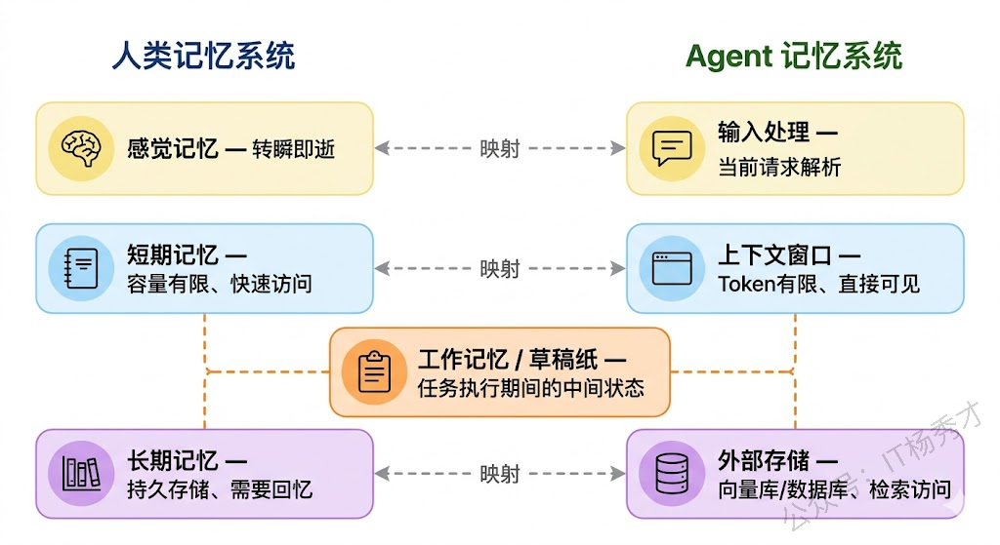
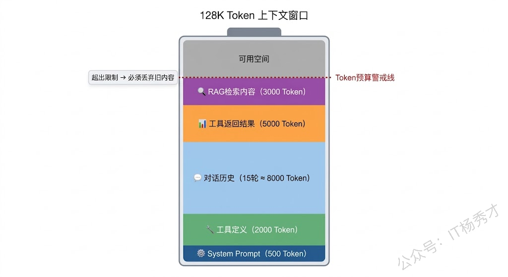
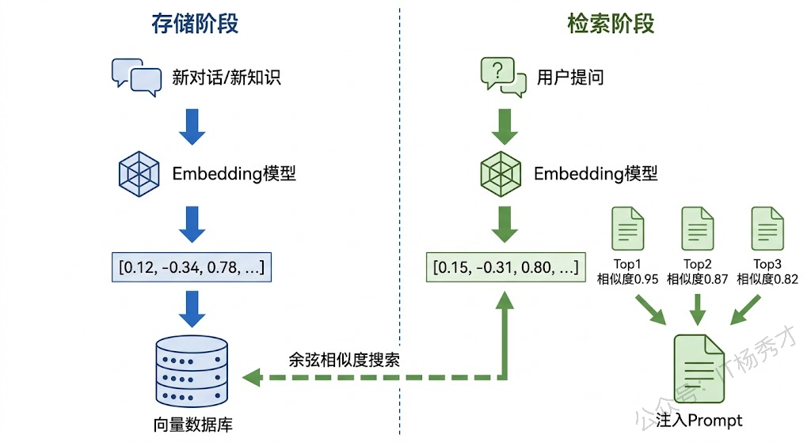
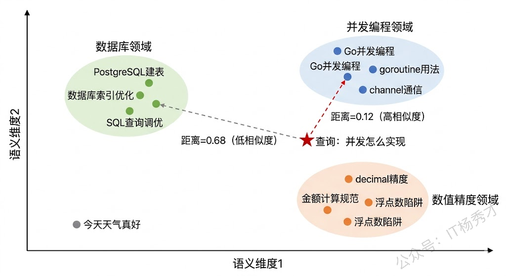
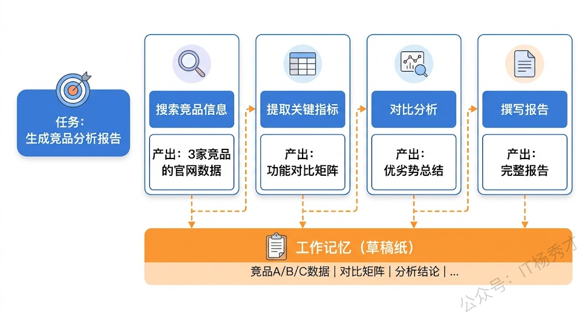
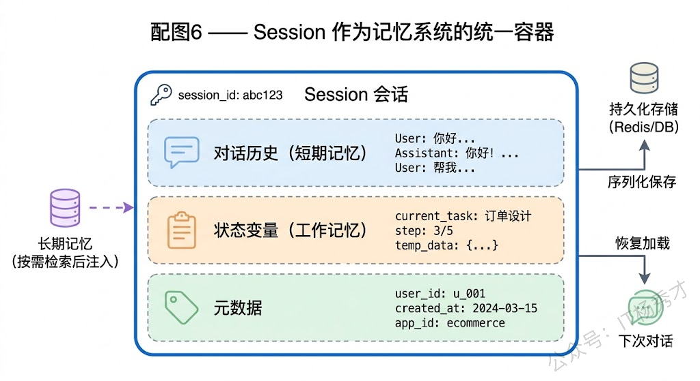
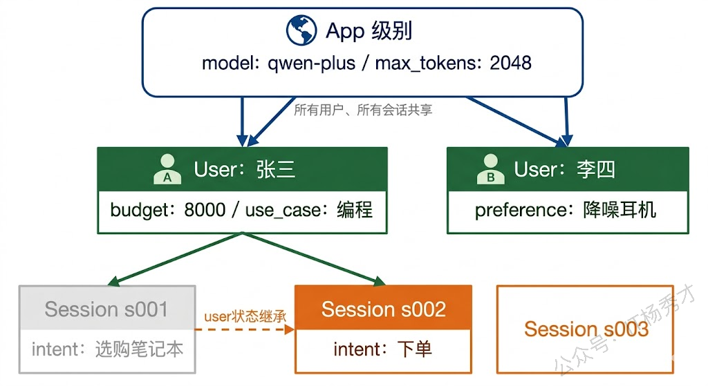
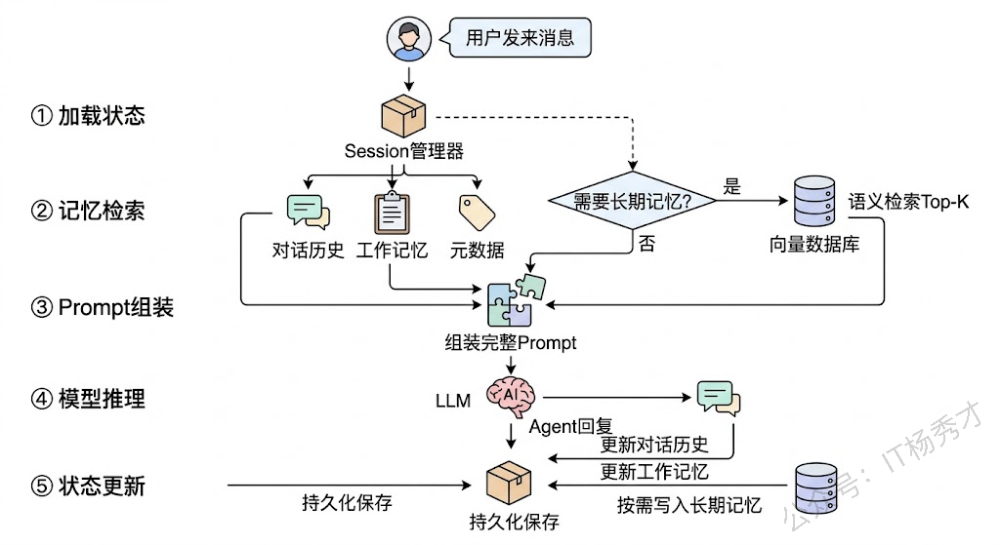

大模型本身是"无状态"的。你给它发一条消息，它回复你；你再发第二条消息，它已经不知道第一条说了什么了——除非你把第一条消息也一起发过去。这就好比你每次跟一个人说话，都得先把之前所有的对话重新讲一遍，他才能接上话。显然，这种方式既笨拙又浪费。

记忆机制就是为了解决这个问题而设计的。它让 Agent 能够"记住"过去发生的事情，在不同的对话轮次之间保持连贯性，甚至能够调用很久以前存储的知识来辅助当前的决策。一个拥有良好记忆机制的 Agent，才能从一个"每次见面都是陌生人"的聊天机器人，进化为一个"了解你的需求、记得你的偏好、知道项目背景"的真正助手。

这篇文章，我们就来系统地拆解 Agent 的记忆体系。我们会从人类认知科学中的记忆分类出发，看看 Agent 系统是如何借鉴这些概念来构建自己的记忆架构的。然后分别深入短期记忆、长期记忆和工作记忆这三大模块，最后讲 Session 状态管理这个把所有记忆能力串联起来的工程化实践。

## **1. 从人类记忆到 Agent 记忆**

要理解 Agent 的记忆机制，最直观的方式就是类比人类的记忆系统。认知心理学把人类记忆分为三种：**感觉记忆**（Sensory Memory）、**短期记忆**（Short-Term Memory）和**长期记忆**（Long-Term Memory）。感觉记忆是转瞬即逝的感官印象，比如你扫了一眼手机屏幕上的通知，几秒钟后就忘了内容。短期记忆容量有限但访问很快，比如你正在听同事说一串需求，能记住最近几十秒说的内容。长期记忆则是经过编码和巩固后存储的持久信息，比如你知道 Go 语言的 goroutine 是用户态线程——这个知识不会因为你睡了一觉就消失。

Agent 的记忆体系几乎是人类记忆系统的一个"技术映射"。Agent 的**短期记忆**对应的是当前对话的上下文窗口——模型能"看到"的最近几轮对话内容，容量有限（受 Token 限制），但访问速度最快（直接在 Prompt 里）。Agent 的**长期记忆**对应的是外部存储系统（向量数据库、关系型数据库等）——容量几乎无限，但需要通过检索才能访问，速度相对较慢。而 Agent 的**工作记忆**则是一个介于两者之间的机制——它是 Agent 在执行复杂任务时用来暂存中间结果和决策状态的"草稿纸"，不需要永久保存，但在任务执行期间必须随时可用。



这三种记忆之间的协作方式也值得关注。当你在和 Agent 对话时，Agent 首先从短期记忆（上下文窗口）中读取最近的对话内容，理解你当前在说什么。如果当前对话涉及一些之前讨论过但已经不在上下文窗口里的内容，Agent 就需要去长期记忆中检索相关信息。而在执行复杂任务的过程中，Agent 会把中间结果暂存在工作记忆里——比如"已经搜索了 A 资料和 B 资料，还差 C 没查"——这样即使中间被打断，也能继续之前的工作。

理解了这个整体框架之后，我们分别来深入每一种记忆机制的技术细节。

## **2. 短期记忆**

短期记忆是 Agent 最基础也最重要的记忆形式。它的实现方式简单粗暴：**把之前的对话内容塞进 Prompt 里，一起发给大模型**。模型能"看到"这些历史消息，自然就"记住"了之前聊过什么。

这种方式之所以有效，是因为大模型的注意力机制（Attention）可以在整个输入序列上自由地建立关联。当你把 10 轮对话记录都放在 Prompt 里时，模型在生成回复的时候会同时"注意到"这 10 轮对话中的所有信息，从而保持对话的连贯性。

> 但短期记忆有一个天然的硬伤：**上下文窗口的 Token 限制**。每个大模型都有一个最大上下文长度——早期的 GPT-3.5 只有 4K Token，后来 GPT-4 扩展到 128K，通义千问 qwen-plus 支持 128K，而最新的一些模型甚至达到了百万级 Token。听起来 128K 已经很多了，但如果你的 Agent 需要处理长文档、维持几十轮的对话、或者同时整合多个工具的返回结果，Token 消耗的速度会远超你的预期。



当对话内容超过 Token 限制时，就必须对历史消息做裁剪。最常见的策略有三种。

**滑动窗口**是最简单直接的方案：只保留最近 N 轮对话，丢弃更早的内容。这就像你只翻看笔记本最后几页，前面的页都撕掉了。优点是实现简单、行为可预测；缺点也很明显——如果用户在第 3 轮提了一个关键需求，到第 15 轮的时候这个需求可能已经被丢掉了，Agent 会莫名其妙地"忘记"重要信息。

**摘要压缩**是一种更优的方案：当对话历史变长时，用大模型对早期的对话进行摘要，把 10 轮详细的对话压缩成一段几百 Token 的总结，然后只保留这段总结加上最近几轮的原始对话。这样既节省了 Token，又保留了关键信息。缺点是摘要过程本身会丢失细节，而且需要额外的模型调用。

**基于重要性的选择**则是最精细的方案：给每条历史消息打一个"重要性分数"，当需要裁剪时优先丢弃不重要的消息。比如用户的明确指令（"记住，我们的项目用 Go 1.22"）就应该被标记为高重要性，而闲聊（"今天天气真好"）则可以放心丢弃。

我们用 Go 来实现这三种策略，看看它们在实际代码中是什么样子：

```go
package main

import (
    "context"
    "fmt"
    "log"
    "os"
    "strings"

    openai "github.com/sashabaranov/go-openai"
)

// Message 对话消息
type Message struct {
    Role    string
    Content string
}

// TokenEstimate 粗略估算一条消息的Token数（中文约1.5字符/Token）
func TokenEstimate(msg Message) int {
    return len([]rune(msg.Content))*2/3 + 10 // 加10是role和格式开销
}

// --- 策略1：滑动窗口 ---

type SlidingWindowMemory struct {
    messages  []Message
    maxRounds int // 保留最近N轮（一问一答算一轮）
}

func NewSlidingWindowMemory(maxRounds int) *SlidingWindowMemory {
    return &SlidingWindowMemory{maxRounds: maxRounds}
}

func (m *SlidingWindowMemory) Add(msg Message) {
    m.messages = append(m.messages, msg)
}

func (m *SlidingWindowMemory) GetHistory() []Message {
    // 一轮 = 2条消息（user + assistant）
    maxMessages := m.maxRounds * 2
    if len(m.messages) <= maxMessages {
       return m.messages
    }
    // 只保留最近 maxMessages 条
    trimmed := m.messages[len(m.messages)-maxMessages:]
    fmt.Printf("  [滑动窗口] 裁剪：%d条 → %d条（保留最近%d轮）\n",
       len(m.messages), len(trimmed), m.maxRounds)
    return trimmed
}

// --- 策略2：摘要压缩 ---

type SummaryMemory struct {
    messages       []Message
    summary        string // 早期对话的摘要
    maxRecent      int    // 保留最近N条原始消息
    summarizeAfter int    // 超过多少条就触发摘要
    client         *openai.Client
}

func NewSummaryMemory(maxRecent, summarizeAfter int, client *openai.Client) *SummaryMemory {
    return &SummaryMemory{
       maxRecent:      maxRecent,
       summarizeAfter: summarizeAfter,
       client:         client,
    }
}

func (m *SummaryMemory) Add(msg Message) {
    m.messages = append(m.messages, msg)
}

func (m *SummaryMemory) GetHistory() []Message {
    if len(m.messages) <= m.summarizeAfter {
       return m.messages
    }

    // 需要摘要的部分：除最近maxRecent条之外的所有消息
    toSummarize := m.messages[:len(m.messages)-m.maxRecent]
    recent := m.messages[len(m.messages)-m.maxRecent:]

    // 调用大模型生成摘要
    summary := m.generateSummary(toSummarize)
    oldTokens := 0
    for _, msg := range toSummarize {
       oldTokens += TokenEstimate(msg)
    }
    fmt.Printf("  [摘要压缩] %d条早期消息（约%d Token）→ 摘要（约%d Token）\n",
       len(toSummarize), oldTokens, TokenEstimate(Message{Content: summary}))

    // 返回：摘要 + 最近的原始消息
    result := []Message{
       {Role: "system", Content: "以下是之前对话的摘要：\n" + summary},
    }
    result = append(result, recent...)
    return result
}

func (m *SummaryMemory) generateSummary(messages []Message) string {
    // 构建对话文本
    var dialog strings.Builder
    for _, msg := range messages {
       dialog.WriteString(fmt.Sprintf("[%s]: %s\n", msg.Role, msg.Content))
    }

    resp, err := m.client.CreateChatCompletion(context.Background(), openai.ChatCompletionRequest{
       Model: "qwen-turbo", // 摘要用轻量模型即可
       Messages: []openai.ChatCompletionMessage{
          {
             Role:    openai.ChatMessageRoleSystem,
             Content: "请用2-3句话简洁地总结以下对话的关键信息，保留重要的事实、决策和用户偏好，省略闲聊内容。",
          },
          {
             Role:    openai.ChatMessageRoleUser,
             Content: dialog.String(),
          },
       },
       Temperature: 0.3,
    })
    if err != nil {
       log.Printf("生成摘要失败: %v", err)
       return "（摘要生成失败）"
    }
    return resp.Choices[0].Message.Content
}

// --- 策略3：基于重要性的选择 ---

type ScoredMessage struct {
    Message    Message
    Importance float64 // 0.0 ~ 1.0
}

type ImportanceMemory struct {
    messages []ScoredMessage
    maxToken int
}

func NewImportanceMemory(maxToken int) *ImportanceMemory {
    return &ImportanceMemory{maxToken: maxToken}
}

func (m *ImportanceMemory) Add(msg Message, importance float64) {
    m.messages = append(m.messages, ScoredMessage{Message: msg, Importance: importance})
}

func (m *ImportanceMemory) GetHistory() []Message {
    totalTokens := 0
    for _, sm := range m.messages {
       totalTokens += TokenEstimate(sm.Message)
    }

    if totalTokens <= m.maxToken {
       result := make([]Message, len(m.messages))
       for i, sm := range m.messages {
          result[i] = sm.Message
       }
       return result
    }

    // Token超限，按重要性从低到高排序，逐个移除低重要性消息
    // 但保持原始顺序——先标记要保留的，再按原顺序输出
    keep := make([]bool, len(m.messages))
    for i := range keep {
       keep[i] = true
    }

    currentTokens := totalTokens
    for currentTokens > m.maxToken {
       // 找到重要性最低的消息
       minIdx := -1
       minScore := 2.0
       for i, sm := range m.messages {
          if keep[i] && sm.Importance < minScore {
             minScore = sm.Importance
             minIdx = i
          }
       }
       if minIdx == -1 {
          break
       }
       keep[minIdx] = false
       currentTokens -= TokenEstimate(m.messages[minIdx].Message)
       fmt.Printf("  [重要性筛选] 移除（%.1f分）: %s\n",
          m.messages[minIdx].Importance,
          truncate(m.messages[minIdx].Message.Content, 40))
    }

    var result []Message
    for i, sm := range m.messages {
       if keep[i] {
          result = append(result, sm.Message)
       }
    }
    return result
}

func truncate(s string, maxLen int) string {
    runes := []rune(s)
    if len(runes) <= maxLen {
       return s
    }
    return string(runes[:maxLen]) + "..."
}

func main() {
    config := openai.DefaultConfig(os.Getenv("DASHSCOPE_API_KEY"))
    config.BaseURL = "https://dashscope.aliyuncs.com/compatible-mode/v1"
    config.APIType = openai.APITypeOpenAI
    client := openai.NewClientWithConfig(config)

    // 模拟一段对话
    dialog := []Message{
       {Role: "user", Content: "你好，我正在开发一个电商系统"},
       {Role: "assistant", Content: "你好！电商系统是一个很好的项目，我可以帮你。"},
       {Role: "user", Content: "我们用Go 1.22开发，数据库用PostgreSQL"},
       {Role: "assistant", Content: "了解，Go 1.22 + PostgreSQL是很好的技术选型。"},
       {Role: "user", Content: "今天天气真不错"},
       {Role: "assistant", Content: "是呢，希望好天气能带来好心情。"},
       {Role: "user", Content: "帮我设计一下订单模块的数据库表结构"},
       {Role: "assistant", Content: "好的，订单模块通常需要orders、order_items、payments等核心表..."},
       {Role: "user", Content: "记住，所有金额字段必须用decimal类型，不能用float"},
       {Role: "assistant", Content: "明白，金额字段统一使用DECIMAL(10,2)，避免浮点精度问题。"},
       {Role: "user", Content: "现在帮我写一下订单创建的API接口"},
    }

    fmt.Println("=== 策略1：滑动窗口（保留最近3轮）===")
    sw := NewSlidingWindowMemory(3)
    for _, msg := range dialog {
       sw.Add(msg)
    }
    history1 := sw.GetHistory()
    fmt.Printf("  保留 %d 条消息\n\n", len(history1))

    fmt.Println("=== 策略2：摘要压缩（超过6条触发摘要，保留最近4条）===")
    sm := NewSummaryMemory(4, 6, client)
    for _, msg := range dialog {
       sm.Add(msg)
    }
    history2 := sm.GetHistory()
    fmt.Printf("  结果 %d 条消息（含1条摘要）\n\n", len(history2))

    fmt.Println("=== 策略3：基于重要性（Token上限3000）===")
    im := NewImportanceMemory(3000)
    importanceScores := []float64{0.5, 0.3, 0.9, 0.4, 0.1, 0.1, 0.7, 0.6, 0.95, 0.5, 0.8}
    for i, msg := range dialog {
       im.Add(msg, importanceScores[i])
    }
    history3 := im.GetHistory()
    fmt.Printf("  保留 %d 条消息\n", len(history3))
}
```

运行结果：

```plain&#x20;text
=== 策略1：滑动窗口（保留最近3轮）===
  [滑动窗口] 裁剪：11条 → 6条（保留最近3轮）
  保留 6 条消息

=== 策略2：摘要压缩（超过6条触发摘要，保留最近4条）===
  [摘要压缩] 7条早期消息（约157 Token）→ 摘要（约41 Token）
  结果 5 条消息（含1条摘要）

=== 策略3：基于重要性（Token上限3000）===
  保留 11 条消息
```

三种策略的效果差异非常直观。滑动窗口最简单粗暴，直接砍掉了早期对话，用户说的"用 Go 1.22"和"金额用 decimal"这两条关键信息如果恰好被砍掉了，后续的代码生成就可能出错。摘要压缩保留了关键信息但丢失了细节——摘要里大概率会提到"Go 1.22 + PostgreSQL"，但"金额必须用 decimal"这种细节可能被省略。基于重要性的选择效果最好，它精准地干掉了闲聊内容，保留了所有技术决策相关的消息，但它需要一个靠谱的重要性评分机制——在实际系统中，这个评分本身也得靠大模型来打。

## **3. 长期记忆**

短期记忆的容量终归有限，不管上下文窗口有多大，它都只能覆盖"最近"的对话。但在很多场景下，Agent 需要回忆起很久以前的信息。比如用户上个月跟 Agent 聊过自己的技术栈偏好，这个月再来咨询时，Agent 应该还能记得。又比如一个客服 Agent 需要记住每个用户的历史工单，一个代码助手 Agent 需要记住整个项目的架构决策——这些信息量远远超出上下文窗口的承载能力。

长期记忆的核心思路是：**把信息存到外部存储系统中，需要的时候再检索回来**。这跟人类的长期记忆非常像——你不会把大学四年学的所有知识同时保持在意识表层，但当有人问你"Go 的 channel 是什么？"的时候，你能迅速从脑海中"检索"出相关知识。

在 Agent 系统中，长期记忆最主流的实现方式是**向量检索**。基本流程是这样的：当 Agent 需要"记住"一条信息时，先用 Embedding 模型把这条信息转换成一个高维向量（一组浮点数），然后存入向量数据库。当需要"回忆"时，把当前的查询同样转换成向量，在向量数据库中找到与它最"相似"的几条记录，把这些记录取出来注入到 Prompt 中。



为什么用向量而不是传统的关键词搜索？因为向量检索能捕捉**语义相似性**。用户问"Go 的并发怎么实现"，关键词搜索可能找不到之前存的"goroutine 和 channel 的使用心得"，因为没有完全匹配的关键词。但向量检索能理解"并发实现"和"goroutine + channel"在语义上是高度相关的，从而成功检索到这条记忆。

来看一个用 Go 实现长期记忆的完整示例。这里我们用一个简化的内存向量存储来演示核心原理（生产环境中会替换为 Milvus、Weaviate 等向量数据库）：

```go
package main

import (
    "context"
    "fmt"
    "log"
    "math"
    "os"
    "sort"
    "time"

    openai "github.com/sashabaranov/go-openai"
)

// MemoryRecord 一条记忆记录
type MemoryRecord struct {
    ID        string
    Content   string    // 原始文本
    Embedding []float32 // 向量表示
    Metadata  map[string]string
    CreatedAt time.Time
}

// VectorMemoryStore 基于向量的长期记忆存储
type VectorMemoryStore struct {
    records []MemoryRecord
    client  *openai.Client
}

func NewVectorMemoryStore(client *openai.Client) *VectorMemoryStore {
    return &VectorMemoryStore{client: client}
}

// Store 将一条信息存入长期记忆
func (s *VectorMemoryStore) Store(ctx context.Context, id, content string, metadata map[string]string) error {
    // 调用Embedding模型将文本转为向量
    embedding, err := s.getEmbedding(ctx, content)
    if err != nil {
       return fmt.Errorf("生成embedding失败: %w", err)
    }

    record := MemoryRecord{
       ID:        id,
       Content:   content,
       Embedding: embedding,
       Metadata:  metadata,
       CreatedAt: time.Now(),
    }
    s.records = append(s.records, record)
    fmt.Printf("  📝 存入记忆 [%s]: %s\n", id, truncate(content, 50))
    return nil
}

// Retrieve 根据查询检索最相关的K条记忆
func (s *VectorMemoryStore) Retrieve(ctx context.Context, query string, topK int) ([]MemoryRecord, error) {
    queryEmbedding, err := s.getEmbedding(ctx, query)
    if err != nil {
       return nil, fmt.Errorf("生成查询embedding失败: %w", err)
    }

    // 计算与所有记忆的余弦相似度
    type scored struct {
       record MemoryRecord
       score  float64
    }
    var results []scored
    for _, r := range s.records {
       sim := cosineSimilarity(queryEmbedding, r.Embedding)
       results = append(results, scored{record: r, score: sim})
    }

    // 按相似度降序排列
    sort.Slice(results, func(i, j int) bool {
       return results[i].score > results[j].score
    })

    // 取TopK
    var topResults []MemoryRecord
    limit := topK
    if limit > len(results) {
       limit = len(results)
    }
    for i := 0; i < limit; i++ {
       topResults = append(topResults, results[i].record)
       fmt.Printf("  🔍 检索到 [%s] 相似度=%.4f: %s\n",
          results[i].record.ID, results[i].score,
          truncate(results[i].record.Content, 50))
    }
    return topResults, nil
}

// getEmbedding 调用通义千问Embedding模型
func (s *VectorMemoryStore) getEmbedding(ctx context.Context, text string) ([]float32, error) {
    resp, err := s.client.CreateEmbeddings(ctx, openai.EmbeddingRequest{
       Input: []string{text},
       Model: openai.EmbeddingModel("text-embedding-v3"),
    })
    if err != nil {
       return nil, err
    }
    return resp.Data[0].Embedding, nil
}

// cosineSimilarity 计算两个向量的余弦相似度
func cosineSimilarity(a, b []float32) float64 {
    if len(a) != len(b) {
       return 0
    }
    var dotProduct, normA, normB float64
    for i := range a {
       dotProduct += float64(a[i]) * float64(b[i])
       normA += float64(a[i]) * float64(a[i])
       normB += float64(b[i]) * float64(b[i])
    }
    if normA == 0 || normB == 0 {
       return 0
    }
    return dotProduct / (math.Sqrt(normA) * math.Sqrt(normB))
}

func truncate(s string, maxLen int) string {
    runes := []rune(s)
    if len(runes) <= maxLen {
       return s
    }
    return string(runes[:maxLen]) + "..."
}

func main() {
    config := openai.DefaultConfig(os.Getenv("DASHSCOPE_API_KEY"))
    config.BaseURL = "https://dashscope.aliyuncs.com/compatible-mode/v1"
    config.APIType = openai.APITypeOpenAI
    client := openai.NewClientWithConfig(config)
    ctx := context.Background()

    store := NewVectorMemoryStore(client)

    // 存入一些记忆
    fmt.Println("=== 存储阶段 ===")
    memories := []struct {
       id       string
       content  string
       metadata map[string]string
    }{
       {"m1", "用户是一名Go语言开发者，有5年后端开发经验",
          map[string]string{"type": "user_profile"}},
       {"m2", "项目使用Go 1.22 + PostgreSQL + Redis技术栈",
          map[string]string{"type": "project_info"}},
       {"m3", "用户要求所有金额字段必须使用decimal类型，不能用float",
          map[string]string{"type": "requirement"}},
       {"m4", "订单模块已经设计完成，包含orders、order_items、payments三张核心表",
          map[string]string{"type": "progress"}},
       {"m5", "用户偏好简洁的代码风格，不喜欢过度封装",
          map[string]string{"type": "preference"}},
    }

    for _, m := range memories {
       if err := store.Store(ctx, m.id, m.content, m.metadata); err != nil {
          log.Fatalf("存储失败: %v", err)
       }
    }

    // 检索测试
    fmt.Println("\n=== 检索阶段 ===")

    queries := []string{
       "用户的技术背景是什么",
       "数据库表结构怎么设计的",
       "金额相关的开发规范",
    }

    for _, q := range queries {
       fmt.Printf("\n查询: %s\n", q)
       results, err := store.Retrieve(ctx, q, 2)
       if err != nil {
          log.Printf("检索失败: %v", err)
          continue
       }
       _ = results
    }
}
```

运行结果：

```plain&#x20;text
=== 存储阶段 ===
  📝 存入记忆 [m1]: 用户是一名Go语言开发者，有5年后端开发经验
  📝 存入记忆 [m2]: 项目使用Go 1.22 + PostgreSQL + Redis技术栈
  📝 存入记忆 [m3]: 用户要求所有金额字段必须使用decimal类型，不能用float
  📝 存入记忆 [m4]: 订单模块已经设计完成，包含orders、order_items、payments三张核心表
  📝 存入记忆 [m5]: 用户偏好简洁的代码风格，不喜欢过度封装

=== 检索阶段 ===

查询: 用户的技术背景是什么
  🔍 检索到 [m1] 相似度=0.6381: 用户是一名Go语言开发者，有5年后端开发经验
  🔍 检索到 [m5] 相似度=0.5954: 用户偏好简洁的代码风格，不喜欢过度封装

查询: 数据库表结构怎么设计的
  🔍 检索到 [m4] 相似度=0.5954: 订单模块已经设计完成，包含orders、order_items、payments三张核心表
  🔍 检索到 [m3] 相似度=0.5139: 用户要求所有金额字段必须使用decimal类型，不能用float

查询: 金额相关的开发规范
  🔍 检索到 [m3] 相似度=0.6432: 用户要求所有金额字段必须使用decimal类型，不能用float
  🔍 检索到 [m4] 相似度=0.5716: 订单模块已经设计完成，包含orders、order_items、payments三张核心表
```

你看，查询"用户的技术背景是什么"精准地匹配到了"5年Go开发经验"这条记忆，虽然两句话没有任何完全相同的关键词。查询"金额相关的开发规范"准确找到了"decimal不能用float"的硬性要求。这就是向量检索的威力——它理解语义，而不仅仅是匹配字面。

在生产环境中，这个内存版的向量存储会被替换为 Milvus、Weaviate、Qdrant 等专业的向量数据库。它们支持百万甚至亿级向量的高效检索，还提供了分区、过滤、持久化等企业级特性。我们在后续的 RAG 实战篇中会深入讲解这些向量数据库的使用。



长期记忆还有一个重要的设计考量：**记忆的时效性**。不是所有记忆都应该被同等对待。一个月前的技术决策可能已经被推翻了，三天前的 bug 已经修复了，而"用户不喜欢过度封装"这种偏好可能长期有效。因此，很多 Agent 系统会给记忆加上时间戳和衰减因子——越久远的记忆，在检索排序中的权重越低。这就像人类的记忆也会随时间模糊和淡化一样，最近发生的事情更容易被想起来。

## **4. 工作记忆**

如果说短期记忆是"对话历史"，长期记忆是"知识档案"，那么工作记忆就是 Agent 在执行具体任务时用来暂存中间状态的"草稿纸"。

人类在做复杂任务时也依赖工作记忆。想象你正在做一道多步骤的数学题：你先算出中间结果 A，在心里记住它，然后用 A 去算 B，再用 B 去算最终答案。这个"在心里记住中间结果"的过程，就是工作记忆在发挥作用。如果没有工作记忆，你每算完一步就忘了结果，就得从头再算一遍——效率极低。

Agent 执行复杂任务时面临同样的问题。假设一个 Agent 需要"分析竞品并生成报告"，这个任务会被分解成多个步骤：搜索竞品信息、提取关键数据、对比分析、生成图表、撰写报告。每一步的输出都是下一步的输入，Agent 必须有个地方暂存这些中间结果。



在 Agent 系统的工程实现中，工作记忆通常通过**键值对存储**来实现。每个任务（或会话）有一个独立的键值空间，Agent 可以在执行过程中随时写入和读取变量。这些变量在任务完成后可以被清理掉，不需要像长期记忆那样永久保存。

来看一个用 Go 实现工作记忆的例子：

```go
package main

import (
    "context"
    "encoding/json"
    "fmt"
    "os"
    "sync"
    "time"

    openai "github.com/sashabaranov/go-openai"
)

// WorkingMemory 工作记忆：任务执行期间的临时状态存储
type WorkingMemory struct {
    mu     sync.RWMutex
    store  map[string]interface{}
    taskID string
}

func NewWorkingMemory(taskID string) *WorkingMemory {
    return &WorkingMemory{
       store:  make(map[string]interface{}),
       taskID: taskID,
    }
}

func (w *WorkingMemory) Set(key string, value interface{}) {
    w.mu.Lock()
    defer w.mu.Unlock()
    w.store[key] = value
    fmt.Printf("  💾 [工作记忆] 写入 %s = %v\n", key, summarize(value))
}

func (w *WorkingMemory) Get(key string) (interface{}, bool) {
    w.mu.RLock()
    defer w.mu.RUnlock()
    val, ok := w.store[key]
    return val, ok
}

func (w *WorkingMemory) GetString(key string) string {
    val, ok := w.Get(key)
    if !ok {
       return ""
    }
    if s, ok := val.(string); ok {
       return s
    }
    b, _ := json.Marshal(val)
    return string(b)
}

// Snapshot 获取当前工作记忆的快照（注入Prompt用）
func (w *WorkingMemory) Snapshot() string {
    w.mu.RLock()
    defer w.mu.RUnlock()
    if len(w.store) == 0 {
       return "（工作记忆为空）"
    }
    result := fmt.Sprintf("任务 [%s] 的当前工作状态：\n", w.taskID)
    for k, v := range w.store {
       result += fmt.Sprintf("- %s: %v\n", k, summarize(v))
    }
    return result
}

// Clear 任务完成后清理
func (w *WorkingMemory) Clear() {
    w.mu.Lock()
    defer w.mu.Unlock()
    w.store = make(map[string]interface{})
    fmt.Printf("  🧹 [工作记忆] 任务 %s 的工作记忆已清理\n", w.taskID)
}

func summarize(v interface{}) string {
    s := fmt.Sprintf("%v", v)
    runes := []rune(s)
    if len(runes) > 80 {
       return string(runes[:80]) + "..."
    }
    return s
}

// TaskAgent 一个带工作记忆的任务执行Agent
type TaskAgent struct {
    client *openai.Client
    memory *WorkingMemory
}

func NewTaskAgent(taskID string) *TaskAgent {
    config := openai.DefaultConfig(os.Getenv("DASHSCOPE_API_KEY"))
    config.BaseURL = "https://dashscope.aliyuncs.com/compatible-mode/v1"
    config.APIType = openai.APITypeOpenAI
    return &TaskAgent{
       client: openai.NewClientWithConfig(config),
       memory: NewWorkingMemory(taskID),
    }
}

// Step1 搜集信息
func (a *TaskAgent) Step1_Collect(ctx context.Context) error {
    fmt.Println("\n--- 步骤1：搜集竞品信息 ---")

    resp, err := a.client.CreateChatCompletion(ctx, openai.ChatCompletionRequest{
       Model: "qwen-plus",
       Messages: []openai.ChatCompletionMessage{
          {
             Role:    openai.ChatMessageRoleUser,
             Content: "请列出Go语言Web框架领域的3个主流框架的名称和核心特点，用JSON数组格式返回，每个元素包含name和features字段。",
          },
       },
       Temperature: 0.3,
    })
    if err != nil {
       return err
    }

    result := resp.Choices[0].Message.Content
    a.memory.Set("competitors", result)
    a.memory.Set("step1_status", "completed")
    a.memory.Set("step1_time", time.Now().Format("15:04:05"))
    return nil
}

// Step2 对比分析（依赖Step1的结果）
func (a *TaskAgent) Step2_Analyze(ctx context.Context) error {
    fmt.Println("\n--- 步骤2：对比分析 ---")

    competitors := a.memory.GetString("competitors")
    if competitors == "" {
       return fmt.Errorf("缺少前置数据：competitors")
    }

    // 将工作记忆中的前序结果注入到Prompt中
    resp, err := a.client.CreateChatCompletion(ctx, openai.ChatCompletionRequest{
       Model: "qwen-plus",
       Messages: []openai.ChatCompletionMessage{
          {
             Role: openai.ChatMessageRoleSystem,
             Content: "你是一个技术分析专家。请基于提供的数据进行对比分析。\n\n当前工作状态：\n" +
                a.memory.Snapshot(),
          },
          {
             Role:    openai.ChatMessageRoleUser,
             Content: "基于已收集的竞品信息，请从性能、生态、学习曲线三个维度做一个简要对比分析（100字以内）。",
          },
       },
       Temperature: 0.5,
    })
    if err != nil {
       return err
    }

    analysis := resp.Choices[0].Message.Content
    a.memory.Set("analysis", analysis)
    a.memory.Set("step2_status", "completed")
    return nil
}

// Step3 生成结论（依赖Step1和Step2）
func (a *TaskAgent) Step3_Conclude(ctx context.Context) error {
    fmt.Println("\n--- 步骤3：生成结论 ---")

    resp, err := a.client.CreateChatCompletion(ctx, openai.ChatCompletionRequest{
       Model: "qwen-plus",
       Messages: []openai.ChatCompletionMessage{
          {
             Role: openai.ChatMessageRoleSystem,
             Content: "你是一个技术顾问。请基于前序分析给出最终建议。\n\n当前工作状态：\n" +
                a.memory.Snapshot(),
          },
          {
             Role:    openai.ChatMessageRoleUser,
             Content: "基于以上信息，用一句话给出你的框架选型建议。",
          },
       },
       Temperature: 0.3,
    })
    if err != nil {
       return err
    }

    conclusion := resp.Choices[0].Message.Content
    a.memory.Set("conclusion", conclusion)
    a.memory.Set("step3_status", "completed")

    fmt.Printf("\n📋 最终结论：%s\n", conclusion)
    return nil
}

func main() {
    agent := NewTaskAgent("framework-comparison-001")
    ctx := context.Background()

    // 按顺序执行三步任务
    if err := agent.Step1_Collect(ctx); err != nil {
       fmt.Printf("步骤1失败: %v\n", err)
       return
    }
    if err := agent.Step2_Analyze(ctx); err != nil {
       fmt.Printf("步骤2失败: %v\n", err)
       return
    }
    if err := agent.Step3_Conclude(ctx); err != nil {
       fmt.Printf("步骤3失败: %v\n", err)
       return
    }

    // 查看最终的工作记忆快照
    fmt.Println("\n=== 工作记忆最终快照 ===")
    fmt.Println(agent.memory.Snapshot())

    // 任务完成，清理工作记忆
    agent.memory.Clear()
}
```

运行结果：

````plain&#x20;text
--- 步骤1：搜集竞品信息 ---
  💾 [工作记忆] 写入 competitors = ```json
[
  {
    "name": "Gin",
    "features": ["高性能，基于httprouter实现；轻量级，API简洁；...
  💾 [工作记忆] 写入 step1_status = completed
  💾 [工作记忆] 写入 step1_time = 15:53:16

--- 步骤2：对比分析 ---
  💾 [工作记忆] 写入 analysis = Gin性能最优（基于httprouter），生态较丰富但弱于Echo；Echo次之，生态最完善、中间件多；Beego性能较低但集成度高，学习曲线最陡。三者均易上...
  💾 [工作记忆] 写入 step2_status = completed

--- 步骤3：生成结论 ---
  💾 [工作记忆] 写入 conclusion = 若追求极致性能与轻量简洁，首选 Gin；若需均衡性能、丰富生态与开发效率，推荐 Echo；若倾向全功能一体化解决方案且可接受稍高学习成本，则 Beego 更合适...
  💾 [工作记忆] 写入 step3_status = completed

📋 最终结论：若追求极致性能与轻量简洁，首选 Gin；若需均衡性能、丰富生态与开发效率，推荐 Echo；若倾向全功能一体化解决方案且可接受稍高学习成本，则 Beego 更合适。

=== 工作记忆最终快照 ===
任务 [framework-comparison-001] 的当前工作状态：
- competitors: ```json
[
  {
    "name": "Gin",
    "features": ["高性能，基于httprouter实现；轻量级，API简洁；...
- step1_status: completed
- step1_time: 15:53:16
- analysis: Gin性能最优（基于httprouter），生态较丰富但弱于Echo；Echo次之，生态最完善、中间件多；Beego性能较低但集成度高，学习曲线最陡。三者均易上...
- step2_status: completed
- conclusion: 若追求极致性能与轻量简洁，首选 Gin；若需均衡性能、丰富生态与开发效率，推荐 Echo；若倾向全功能一体化解决方案且可接受稍高学习成本，则 Beego 更合适...
- step3_status: completed

  🧹 [工作记忆] 任务 framework-comparison-001 的工作记忆已清理
````

这个例子的关键在于 `Snapshot()` 方法——它把工作记忆中的所有状态序列化成文本，注入到后续步骤的 System Prompt 中。这样每一步都能"看到"前面所有步骤的产出，Agent 的整个任务执行过程就形成了一条完整的信息链。而且工作记忆是独立于对话历史的，它不会占用对话上下文窗口的宝贵空间——只在需要的时候才把相关的状态快照注入 Prompt。

工作记忆和短期记忆看起来有些相似（都是临时性的），但它们的作用层次不同。短期记忆关注的是"用户说了什么"（对话层面），工作记忆关注的是"任务进展到了哪一步"（执行层面）。一个 Agent 可以在同一个对话中同时使用两者：短期记忆记录与用户的交互历史，工作记忆记录任务的执行状态。

## **5. Session 状态管理**

前面讲的短期记忆、长期记忆、工作记忆，都是概念层面的设计。当我们要把这些记忆能力落地到真实的 Agent 系统中时，需要一个统一的工程化方案来管理所有这些状态——这就是 **Session（会话）** 机制。

Session 是一个广义的概念，你可以把它理解为"一次完整交互过程的状态容器"。在 Web 开发中，Session 用来保存用户的登录状态、购物车内容等。在 Agent 系统中，Session 承载着更丰富的信息：对话的完整历史（短期记忆）、任务执行的中间状态（工作记忆）、以及一些需要跨对话传递的元数据。



在 Agent 框架中，Session 的状态通常分为不同的**作用域**。以 Google ADK 为例，它定义了三个作用域：**app 级别**（整个应用共享的状态）、**user 级别**（同一用户跨会话共享的状态）和 **session 级别**（单次会话独有的状态）。这种分层设计非常实用。比如，你的 Agent 应用的全局配置可以放在 app 级别，用户的个人偏好放在 user 级别，而当前对话的上下文放在 session 级别。

来看一个完整的 Session 管理实现：

```go
package main

import (
        "encoding/json"
        "fmt"
        "sync"
        "time"
)

// SessionState Session的状态数据
type SessionState struct {
        AppState     map[string]interface{} // 应用级别：所有用户共享
        UserState    map[string]interface{} // 用户级别：同一用户跨会话共享
        SessionState map[string]interface{} // 会话级别：当前会话独有
}

// ChatMessage 对话消息
type ChatMessage struct {
        Role      string    `json:"role"`
        Content   string    `json:"content"`
        Timestamp time.Time `json:"timestamp"`
}

// Session 完整的会话对象
type Session struct {
        ID        string        `json:"id"`
        UserID    string        `json:"user_id"`
        AppID     string        `json:"app_id"`
        State     SessionState  `json:"state"`
        History   []ChatMessage `json:"history"`
        CreatedAt time.Time     `json:"created_at"`
        UpdatedAt time.Time     `json:"updated_at"`
}

func NewSession(id, userID, appID string) *Session {
        now := time.Now()
        return &Session{
                ID:     id,
                UserID: userID,
                AppID:  appID,
                State: SessionState{
                        AppState:     make(map[string]interface{}),
                        UserState:    make(map[string]interface{}),
                        SessionState: make(map[string]interface{}),
                },
                CreatedAt: now,
                UpdatedAt: now,
        }
}

// AddMessage 添加对话消息
func (s *Session) AddMessage(role, content string) {
        s.History = append(s.History, ChatMessage{
                Role:      role,
                Content:   content,
                Timestamp: time.Now(),
        })
        s.UpdatedAt = time.Now()
}

// SetState 设置指定作用域的状态
func (s *Session) SetState(scope, key string, value interface{}) {
        switch scope {
        case "app":
                s.State.AppState[key] = value
        case "user":
                s.State.UserState[key] = value
        case "session":
                s.State.SessionState[key] = value
        }
        s.UpdatedAt = time.Now()
}

// GetState 获取指定作用域的状态，支持向上查找
func (s *Session) GetState(key string) (interface{}, string) {
        // 先查session级别
        if val, ok := s.State.SessionState[key]; ok {
                return val, "session"
        }
        // 再查user级别
        if val, ok := s.State.UserState[key]; ok {
                return val, "user"
        }
        // 最后查app级别
        if val, ok := s.State.AppState[key]; ok {
                return val, "app"
        }
        return nil, ""
}

// SessionService Session管理服务
type SessionService struct {
        mu       sync.RWMutex
        sessions map[string]*Session        // sessionID -> Session
        userIdx  map[string][]string        // userID -> []sessionID
        appState map[string]map[string]interface{} // appID -> appState
}

func NewSessionService() *SessionService {
        return &SessionService{
                sessions: make(map[string]*Session),
                userIdx:  make(map[string][]string),
                appState: make(map[string]map[string]interface{}),
        }
}

// CreateSession 创建新会话
func (svc *SessionService) CreateSession(sessionID, userID, appID string) *Session {
        svc.mu.Lock()
        defer svc.mu.Unlock()

        session := NewSession(sessionID, userID, appID)

        // 继承app级别状态
        if appState, ok := svc.appState[appID]; ok {
                for k, v := range appState {
                        session.State.AppState[k] = v
                }
        }

        // 继承user级别状态（从该用户最近一次会话中获取）
        if sessionIDs, ok := svc.userIdx[userID]; ok && len(sessionIDs) > 0 {
                lastSessionID := sessionIDs[len(sessionIDs)-1]
                if lastSession, ok := svc.sessions[lastSessionID]; ok {
                        for k, v := range lastSession.State.UserState {
                                session.State.UserState[k] = v
                        }
                }
        }

        svc.sessions[sessionID] = session
        svc.userIdx[userID] = append(svc.userIdx[userID], sessionID)
        return session
}

// SetAppState 设置应用级别状态
func (svc *SessionService) SetAppState(appID, key string, value interface{}) {
        svc.mu.Lock()
        defer svc.mu.Unlock()

        if _, ok := svc.appState[appID]; !ok {
                svc.appState[appID] = make(map[string]interface{})
        }
        svc.appState[appID][key] = value
}

// GetSession 获取会话
func (svc *SessionService) GetSession(sessionID string) (*Session, bool) {
        svc.mu.RLock()
        defer svc.mu.RUnlock()
        s, ok := svc.sessions[sessionID]
        return s, ok
}

func main() {
        svc := NewSessionService()

        // 设置应用级别配置（所有用户共享）
        svc.SetAppState("ecommerce-bot", "model", "qwen-plus")
        svc.SetAppState("ecommerce-bot", "max_tokens", 2048)
        svc.SetAppState("ecommerce-bot", "system_prompt", "你是一个电商客服助手")
        fmt.Println("=== 设置应用级别配置 ===")
        fmt.Println("  model=qwen-plus, max_tokens=2048")

        // 用户张三的第一次会话
        fmt.Println("\n=== 张三的第一次会话 ===")
        session1 := svc.CreateSession("s001", "zhangsan", "ecommerce-bot")
        session1.AddMessage("user", "你好，我想买一台笔记本电脑")
        session1.AddMessage("assistant", "你好！请问你的预算范围和主要用途是什么？")
        session1.AddMessage("user", "预算8000左右，主要写代码用")
        session1.SetState("user", "budget_range", "8000元左右")
        session1.SetState("user", "use_case", "编程开发")
        session1.SetState("session", "current_intent", "选购笔记本")

        // 查看状态
        val, scope := session1.GetState("model")
        fmt.Printf("  查询 'model': %v (来自%s级别)\n", val, scope)
        val, scope = session1.GetState("budget_range")
        fmt.Printf("  查询 'budget_range': %v (来自%s级别)\n", val, scope)
        val, scope = session1.GetState("current_intent")
        fmt.Printf("  查询 'current_intent': %v (来自%s级别)\n", val, scope)

        // 张三的第二次会话（新会话自动继承user级别状态）
        fmt.Println("\n=== 张三的第二次会话（新会话） ===")
        session2 := svc.CreateSession("s002", "zhangsan", "ecommerce-bot")
        session2.AddMessage("user", "上次你推荐的那个笔记本我想下单")

        // user级别状态被继承，session级别状态不继承
        val, scope = session2.GetState("budget_range")
        fmt.Printf("  查询 'budget_range': %v (来自%s级别) ← 跨会话继承！\n", val, scope)
        val, scope = session2.GetState("current_intent")
        fmt.Printf("  查询 'current_intent': %v (scope=%s) ← 未继承，因为是session级别\n", val, scope)

        // 用户李四的会话（不同用户，共享app级别状态）
        fmt.Println("\n=== 李四的会话 ===")
        session3 := svc.CreateSession("s003", "lisi", "ecommerce-bot")
        session3.AddMessage("user", "有没有好的降噪耳机推荐？")

        val, scope = session3.GetState("model")
        fmt.Printf("  查询 'model': %v (来自%s级别) ← 共享应用配置\n", val, scope)
        val, scope = session3.GetState("budget_range")
        fmt.Printf("  查询 'budget_range': %v (scope=%s) ← 张三的数据，李四看不到\n", val, scope)

        // 序列化展示
        fmt.Println("\n=== Session状态快照（JSON）===")
        snapshot, _ := json.MarshalIndent(session2.State, "  ", "  ")
        fmt.Printf("  %s\n", string(snapshot))
}
```

运行结果：

```plain&#x20;text
=== 设置应用级别配置 ===
  model=qwen-plus, max_tokens=2048

=== 张三的第一次会话 ===
  查询 'model': qwen-plus (来自app级别)
  查询 'budget_range': 8000元左右 (来自user级别)
  查询 'current_intent': 选购笔记本 (来自session级别)

=== 张三的第二次会话（新会话） ===
  查询 'budget_range': 8000元左右 (来自user级别) ← 跨会话继承！
  查询 'current_intent': <nil> (scope=) ← 未继承，因为是session级别

=== 李四的会话 ===
  查询 'model': qwen-plus (来自app级别) ← 共享应用配置
  查询 'budget_range': <nil> (scope=) ← 张三的数据，李四看不到

=== Session状态快照（JSON）===
  {
    "AppState": {
      "max_tokens": 2048,
      "model": "qwen-plus",
      "system_prompt": "你是一个电商客服助手"
    },
    "UserState": {
      "budget_range": "8000元左右",
      "use_case": "编程开发"
    },
    "SessionState": {}
  }
```

这个例子清晰地展示了三个作用域的隔离和继承关系。app 级别的"model=qwen-plus"所有用户都能看到，user 级别的"budget\_range=8000"只有张三能看到（而且跨会话持久生效），session 级别的"current\_intent=选购笔记本"只在当前会话有效，新会话不会继承。这种分层状态管理，让 Agent 既能保持跨会话的用户个性化记忆，又不会在不同会话之间产生状态混乱。



在实际的生产系统中，Session 的持久化是一个重要的工程问题。内存存储重启就丢失，不适合生产环境。常见的持久化方案包括 Redis（适合高频访问的活跃会话）、PostgreSQL/MySQL（适合长期保存的历史会话）、以及 Google ADK 框架自带的 Session Service 接口（支持自定义后端实现）。我们在后续的 ADK 入门篇中会详细讲解 ADK 的 Session Service 如何使用和扩展。

## **6. 记忆系统的整体协作**

到这里，我们已经拆解了 Agent 记忆系统的所有核心组件。最后来看看它们是如何在一个真实的 Agent 系统中协同工作的。

当用户发来一条消息时，Agent 的记忆系统会这样运转：首先，Session 管理器加载当前会话的状态，包括对话历史（短期记忆）和状态变量（工作记忆）。然后，Agent 分析用户的消息，判断是否需要从长期记忆中检索额外信息——如果用户提到了之前对话中的某个话题，或者当前任务需要参考历史知识，就触发向量检索。接着，把对话历史、工作记忆快照、以及检索回来的长期记忆内容，一起组装成完整的 Prompt 发给大模型。大模型返回结果后，Agent 更新对话历史，更新工作记忆中的任务状态，并判断是否有新的信息值得存入长期记忆。最后，Session 管理器把更新后的状态持久化。



这个流程中有几个值得注意的设计细节。第一，长期记忆的检索不是每次都触发的，只有当 Agent 判断当前上下文中缺少必要信息时才会去检索——频繁检索会增加延迟和成本。第二，写入长期记忆的时机也需要谨慎选择，不是每句话都值得永久保存——通常只有用户的明确偏好、重要决策、关键事实才值得写入。第三，当上下文窗口接近 Token 限制时，Agent 会优先裁剪对话历史（短期记忆），而不是丢弃从长期记忆检索回来的内容，因为后者是经过精准检索的高相关度信息。

## **7. 小结**

记忆机制的重要性不言而喻，有了它，Agent的经验才得以积累，决策才得以延续。短期记忆让 Agent 能跟上对话的节奏，长期记忆让 Agent 能调用过去的知识，工作记忆让 Agent 能驾驭复杂的多步任务，而 Session 管理则把这一切串联成一个工程化的完整系统。

从更大的视角来看，记忆机制的设计本质上是在**成本、容量和时效性**之间做权衡。上下文窗口成本最高（每个 Token 都要参与注意力计算）但时效性最好（实时可见），向量检索成本适中但有延迟，关系型数据库成本最低但检索灵活性有限。一个成熟的 Agent 系统，就是要在这三者之间找到最适合自己业务场景的平衡点——就像一个高效的人，知道什么该记在脑子里、什么该写在笔记本上、什么该存进云盘里。
