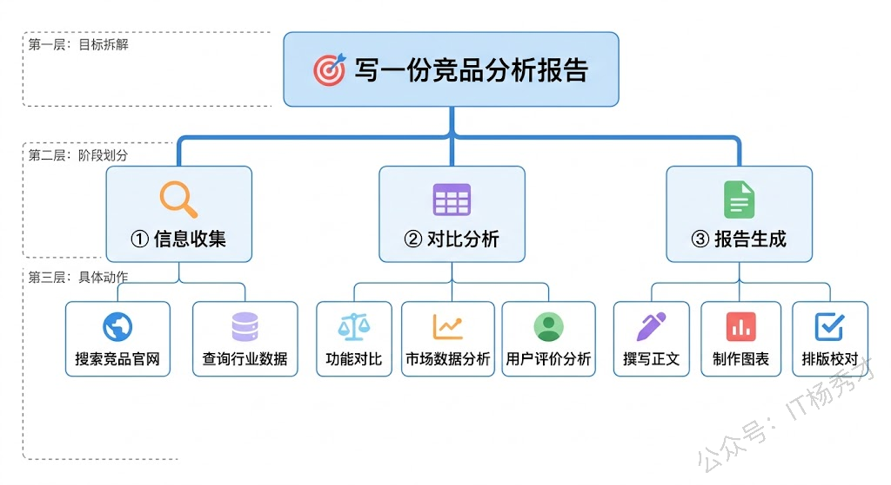
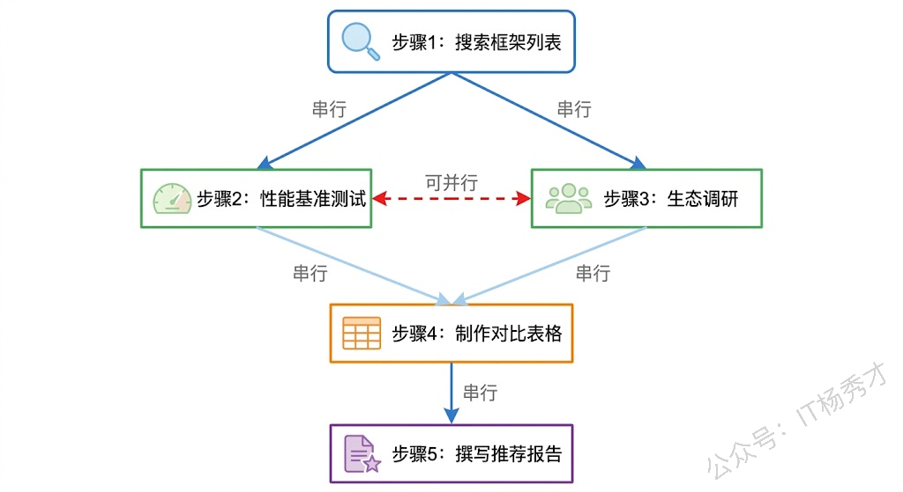
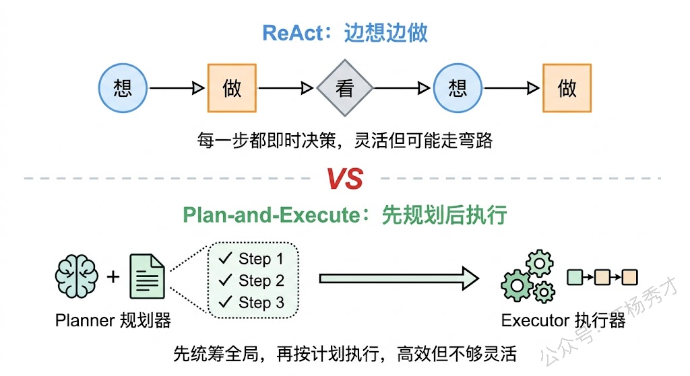
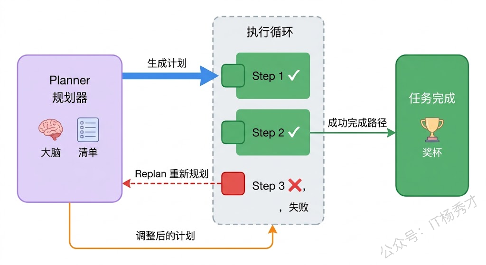
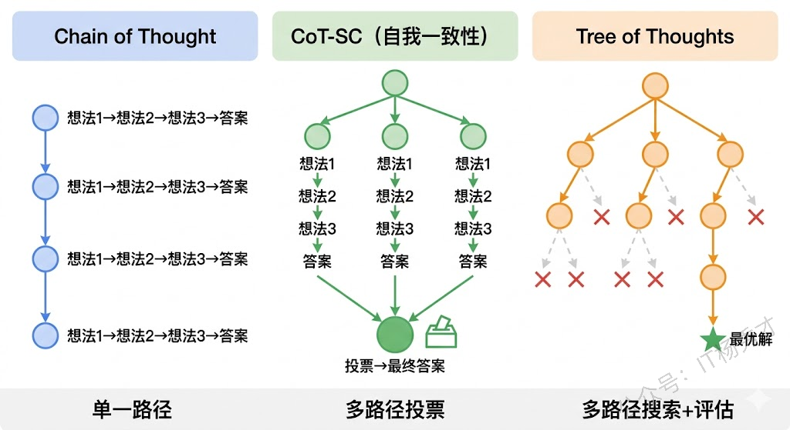
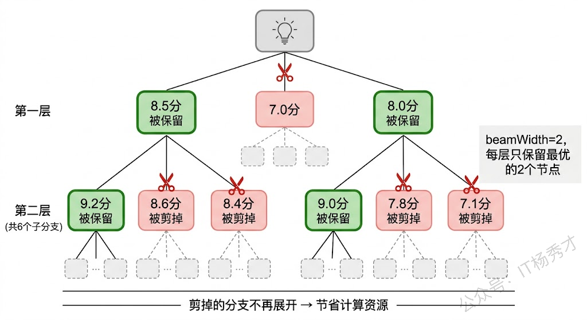
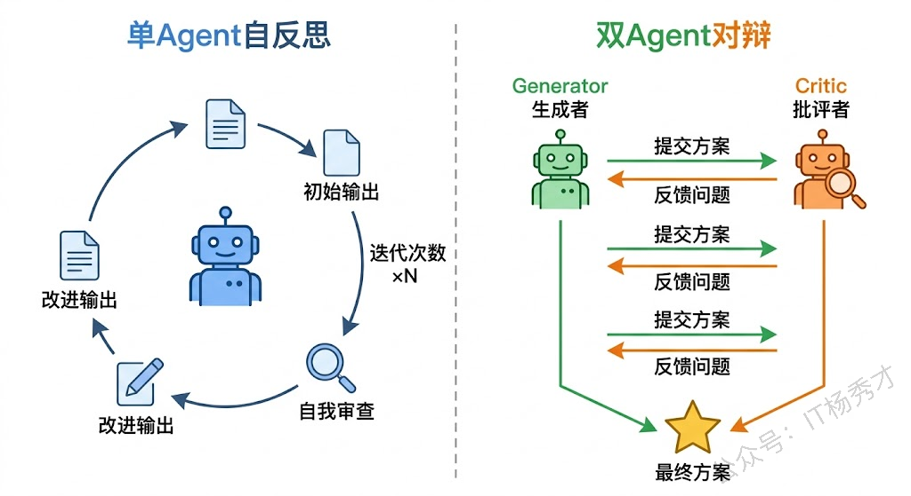
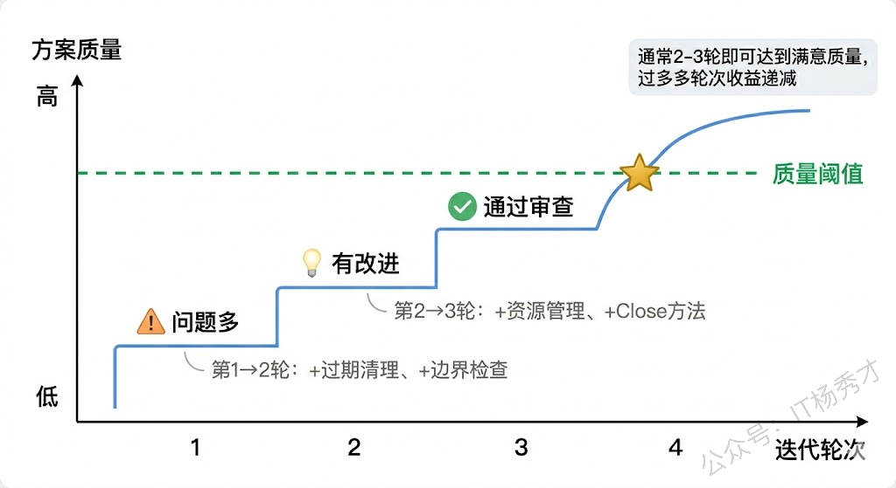
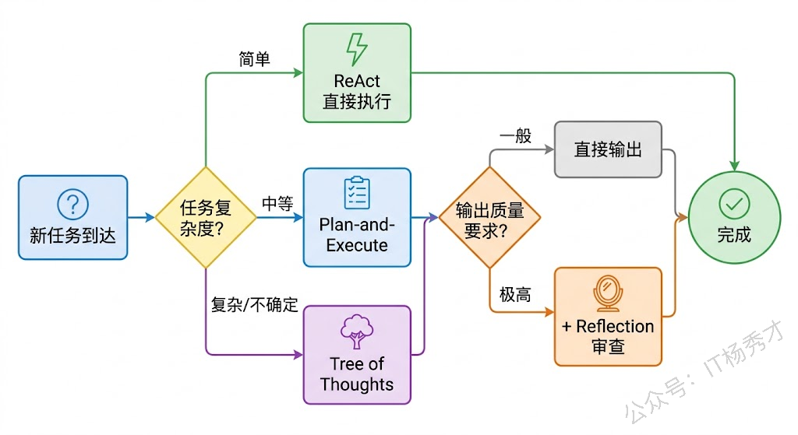

如果说工具是 Agent 的双手，记忆是 Agent 的记事本，那么规划能力就是 Agent 的"指挥部"——它决定了 Agent 面对一个复杂任务时，应该先做什么、后做什么、遇到问题怎么调整。没有规划能力的 Agent，就像一个拿着一堆工具却没有施工图纸的工人，虽然手里家伙齐全，但真正执行任务时就会毫无章法。

在前面的文章中，我们了解了 Agent 的核心架构和 ReAct 循环。ReAct 让 Agent 能够在"思考"和"行动"之间交替进行，但这还只是一种基础的决策模式——每一步都是即时反应式的。而真正复杂的任务需要 Agent 具备更高层次的规划能力：能够站在全局视角审视任务，把大目标拆分成小步骤，在多条可能的路径中选出最优解，甚至在执行过程中发现计划有误时主动纠错。

接下来，我们就来系统地拆解 Agent 的规划能力。从最基础的任务分解讲起，到 Plan-and-Execute 这种先规划后执行的架构范式，再到 Tree of Thoughts 这样的多路径探索策略，最后讲 Reflection 自我纠错机制。这四个层次，恰好构成了 Agent 规划能力从简单到高级的完整图谱。

## **1. 任务分解**

规划的第一要义就是**把一个看起来复杂甚至不可能的任务，拆解成一系列简单可执行的步骤**。

对于人类来说，任务分解几乎是本能。你让一个程序员"开发一个用户注册功能"，他会自动地在脑子里把这件事拆开：先设计数据库表结构、再写注册 API、然后做参数校验、接着加密密码存储、最后写单元测试。每一步都是清晰的、可执行的，整个流程的先后顺序也是合理的。

大模型本身就具备一定的任务分解能力。当你在 Prompt 里写"请一步步思考"的时候，模型就会尝试把问题拆解成多个步骤来推理——这就是我们之前聊过的 Chain of Thought（思维链）技术。但 Agent 场景下的任务分解，比单纯的 CoT 要复杂得多，因为它不仅要"想清楚步骤"，还要考虑每一步需要调用什么工具、每一步的输出如何作为下一步的输入、以及步骤之间的依赖关系。



来看一个用 Go 代码模拟任务分解过程的例子。我们让大模型对一个复杂任务进行分解，返回结构化的步骤列表：

```go
package main

import (
    "context"
    "encoding/json"
    "fmt"
    "log"
    "os"

    openai "github.com/sashabaranov/go-openai"
)

// TaskStep 表示分解后的单个步骤
type TaskStep struct {
    StepNumber  int    `json:"step_number"`
    Description string `json:"description"`
    ToolNeeded  string `json:"tool_needed"`
    DependsOn   []int  `json:"depends_on"`
    Output      string `json:"expected_output"`
}

// TaskPlan 表示完整的任务计划
type TaskPlan struct {
    Goal  string     `json:"goal"`
    Steps []TaskStep `json:"steps"`
}

func decomposeTask(task string) (*TaskPlan, error) {
    config := openai.DefaultConfig(os.Getenv("DASHSCOPE_API_KEY"))
    config.BaseURL = "https://dashscope.aliyuncs.com/compatible-mode/v1"
    config.APIType = openai.APITypeOpenAI
    client := openai.NewClientWithConfig(config)

    systemPrompt := `你是一个任务规划专家。用户会给你一个复杂任务，你需要将其分解为具体的执行步骤。
请以JSON格式返回，结构如下：
{
  "goal": "任务目标",
  "steps": [
    {
      "step_number": 1,
      "description": "步骤描述",
      "tool_needed": "需要的工具（如：web_search, database_query, text_generation, code_execution, none）",
      "depends_on": [],
      "expected_output": "这一步的预期输出"
    }
  ]
}
注意：depends_on 字段表示该步骤依赖哪些前置步骤的编号。没有依赖的步骤填空数组。`

    resp, err := client.CreateChatCompletion(
       context.Background(),
       openai.ChatCompletionRequest{
          Model: "qwen-plus",
          Messages: []openai.ChatCompletionMessage{
             {Role: openai.ChatMessageRoleSystem, Content: systemPrompt},
             {Role: openai.ChatMessageRoleUser, Content: "请分解这个任务：" + task},
          },
          Temperature: 0.3,
       },
    )
    if err != nil {
       return nil, fmt.Errorf("调用大模型失败: %w", err)
    }

    var plan TaskPlan
    content := resp.Choices[0].Message.Content
    if err := json.Unmarshal([]byte(content), &plan); err != nil {
       return nil, fmt.Errorf("解析任务计划失败: %w", err)
    }
    return &plan, nil
}

func main() {
    plan, err := decomposeTask("帮我调研Go语言主流Web框架，对比它们的性能和生态，最终输出一份推荐报告")
    if err != nil {
       log.Fatal(err)
    }

    fmt.Printf("任务目标：%s\n\n", plan.Goal)
    for _, step := range plan.Steps {
       deps := "无"
       if len(step.DependsOn) > 0 {
          depsJSON, _ := json.Marshal(step.DependsOn)
          deps = string(depsJSON)
       }
       fmt.Printf("步骤%d：%s\n", step.StepNumber, step.Description)
       fmt.Printf("  工具：%s\n", step.ToolNeeded)
       fmt.Printf("  依赖：%s\n", deps)
       fmt.Printf("  预期输出：%s\n\n", step.Output)
    }
}
```

运行结果：

```plain&#x20;text
任务目标：调研Go语言主流Web框架，对比其性能和生态，并输出一份推荐报告

步骤1：识别当前Go语言主流Web框架（如Gin、Echo、Fiber、Chi、Beego、Martini、HTTPRouter等），收集其官方文档、GitHub仓库、最新稳定版本及核心定位
  工具：web_search
  依赖：无
  预期输出：包含至少6个主流框架的名称、官网链接、GitHub star数（近一年趋势）、维护活跃度（最近commit时间/发布频率）、适用场景简述的初步清单

步骤2：检索各框架的权威性能基准测试数据（如TechEmpower Web Framework Benchmarks、go-web-framework-benchmark等开源项目），提取QPS、延迟、内存占用等关键指标（相同硬件/测试条件下的横向对比）
  工具：web_search
  依赖：[1]
  预期输出：结构化性能对比表（框架名 | 平均QPS | p90延迟(ms) | 内存峰值(MB) | 测试场景说明）

步骤3：评估各框架的生态系统成熟度：中间件丰富度、ORM/DB集成支持（如GORM、SQLx）、认证授权方案（JWT/OAuth2）、模板引擎、CLI工具、可观测性（OpenTelemetry/Tracing）、社区问答活跃度（Stack Overflow标签量、Discord/Slack成员数）、中文文档质量
  工具：web_search
  依赖：[1]
  预期输出：生态维度评分矩阵（每项按1–5分打分，并附依据来源链接或截图描述）

步骤4：分析典型生产案例与企业采用情况（如Gin被Docker、Tencent使用；Fiber被Vercel部分服务采用等），通过GitHub stars增长曲线、知名公司技术博客/开源项目引用佐证生态健康度
  工具：web_search
  依赖：[1,3]
  预期输出：各框架的企业级应用实例列表（公司/项目名 + 使用场景 + 引用来源链接）

步骤5：综合性能、生态、学习成本、可维护性、长期演进风险（如是否依赖非标准库、是否过度封装）进行加权评估，形成推荐等级（首选/次选/场景专用/不推荐）
  工具：text_generation
  依赖：[2,3,4]
  预期输出：多维度加权评估模型说明 + 框架推荐分级结论（含理由摘要）

步骤6：撰写结构化推荐报告：含引言、调研方法、框架概览、性能对比图表、生态分析、适用场景建议（如高并发API服务/快速MVP/微服务网关）、风险提示、最终推荐清单及落地建议
  工具：text_generation
  依赖：[1,2,3,4,5]
  预期输出：一份完整Markdown格式推荐报告（含标题、小节、表格、简洁结论），可直接交付使用
```

这个例子中有一个关键点：**步骤之间的依赖关系**。步骤2和步骤3都依赖步骤1（需要先知道有哪些框架才能分别去查性能和生态），但步骤2和步骤3之间没有依赖（可以并行执行）。步骤4依赖步骤2和步骤3（需要两方面数据都收集完才能做对比）。这种依赖关系形成了一个有向无环图（DAG），对于 Agent 的执行引擎来说至关重要——它决定了哪些步骤可以并行、哪些必须串行。

任务分解的质量直接决定了 Agent 执行的效率和成功率。一个好的分解应该满足几个条件：每个步骤足够具体，一个步骤只做一件事；步骤之间的依赖关系清晰；每个步骤的预期输出明确；步骤的粒度适中——太粗了执行不了，太细了又增加不必要的复杂度。



## **2. Plan-and-Execute**

任务分解解决了"怎么拆"的问题，但还有一个更根本的架构问题没有回答：Agent 应该在什么时候做规划？是走一步看一步，还是先把整个计划想好再开始执行？

这就引出了两种截然不同的规划范式。第一种是我们之前聊过的 ReAct 模式——典型的"边想边做"策略。Agent 每一步都是先 Thought（思考当前该做什么），然后 Action（执行），再 Observation（观察结果），根据结果决定下一步。这种模式的优点是灵活——每一步都能根据最新情况动态调整，但缺点也很明显：它缺乏全局视野，每一步决策时只考虑了当前状态，可能导致"走了弯路才发现方向错了"。

第二种范式就是 Plan-and-Execute——先用一个"规划器"（Planner）一次性生成完整的执行计划，然后交给"执行器"（Executor）按计划逐步执行。这就像项目管理中的瀑布模型：先做需求分析和详细设计，确认方案没问题之后再开始编码。



Plan-and-Execute 的核心思想其实很简单：**让擅长推理的大模型专注于规划，让执行逻辑专注于行动，二者分而治之**。在实际实现中，这种架构通常包含三个组件：一个负责生成计划的 Planner（通常是一次大模型调用，Prompt 侧重于任务分析和步骤拆解）、一个负责逐步执行的 Executor（可能是另一个 Agent，或者是一组工具调用逻辑）、以及一个可选的 Replanner（在执行过程中根据中间结果动态调整后续计划）。

Replanner 的存在让 Plan-and-Execute 不至于太"死板"。纯粹的"先规划后执行"有个明显的问题：如果计划的第二步就出了意外（比如某个 API 不可用），后面的步骤还按原计划走吗？显然不行。Replanner 就是用来解决这个问题的——它会在每一步执行完之后，评估当前进展，如果发现偏差就重新调整后续计划。这样既保留了全局规划的优势，又不失动态调整的灵活性。

下面用 Go 代码来实现一个简化版的 Plan-and-Execute 架构：

````go
package main

import (
    "context"
    "encoding/json"
    "fmt"
    "log"
    "os"
    "strings"

    openai "github.com/sashabaranov/go-openai"
)

// extractJSON 从LLM返回的内容中提取JSON，去除可能的markdown代码块包裹
func extractJSON(s string) string {
    s = strings.TrimSpace(s)
    // 去除 ```json ... ``` 或 ``` ... ``` 包裹
    if strings.HasPrefix(s, "```") {
       // 去掉第一行（```json 或 ```）
       if idx := strings.Index(s, "\n"); idx != -1 {
          s = s[idx+1:]
       }
       // 去掉最后的 ```
       if idx := strings.LastIndex(s, "```"); idx != -1 {
          s = s[:idx]
       }
       s = strings.TrimSpace(s)
    }
    return s
}

// Plan 表示一个执行计划
type Plan struct {
    Steps []PlanStep `json:"steps"`
}

type PlanStep struct {
    ID          int    `json:"id"`
    Description string `json:"description"`
    Status      string `json:"status"` // pending, done, failed
    Result      string `json:"result"`
}

// Planner 负责生成计划
type Planner struct {
    client *openai.Client
}

func NewPlanner() *Planner {
    config := openai.DefaultConfig(os.Getenv("DASHSCOPE_API_KEY"))
    config.BaseURL = "https://dashscope.aliyuncs.com/compatible-mode/v1"
    config.APIType = openai.APITypeOpenAI
    client := openai.NewClientWithConfig(config)
    return &Planner{
       client: client,
    }
}

// CreatePlan 根据用户目标生成执行计划
func (p *Planner) CreatePlan(ctx context.Context, goal string) (*Plan, error) {
    resp, err := p.client.CreateChatCompletion(ctx, openai.ChatCompletionRequest{
       Model: "qwen-plus",
       Messages: []openai.ChatCompletionMessage{
          {
             Role: openai.ChatMessageRoleSystem,
             Content: `你是一个任务规划专家。根据用户的目标，生成3-5个简洁具体的执行步骤。
返回JSON格式：{"steps": [{"id": 1, "description": "步骤描述", "status": "pending", "result": ""}]}`,
          },
          {Role: openai.ChatMessageRoleUser, Content: goal},
       },
       Temperature: 0.3,
    })
    if err != nil {
       return nil, err
    }

    var plan Plan
    content := extractJSON(resp.Choices[0].Message.Content)
    if err := json.Unmarshal([]byte(content), &plan); err != nil {
       return nil, fmt.Errorf("解析计划失败: %w", err)
    }
    return &plan, nil
}

// Replan 根据执行进展调整后续计划
func (p *Planner) Replan(ctx context.Context, goal string, plan *Plan) (*Plan, error) {
    // 构建当前进展摘要
    var progress strings.Builder
    for _, step := range plan.Steps {
       progress.WriteString(fmt.Sprintf("步骤%d [%s]: %s", step.ID, step.Status, step.Description))
       if step.Result != "" {
          progress.WriteString(fmt.Sprintf(" -> 结果: %s", step.Result))
       }
       progress.WriteString("\n")
    }

    resp, err := p.client.CreateChatCompletion(ctx, openai.ChatCompletionRequest{
       Model: "qwen-plus",
       Messages: []openai.ChatCompletionMessage{
          {
             Role: openai.ChatMessageRoleSystem,
             Content: `你是一个任务规划专家。根据原始目标和当前执行进展，判断是否需要调整后续计划。
如果当前计划仍然合理，原样返回剩余的pending步骤。
如果需要调整，返回新的步骤列表（保留已完成的步骤，调整pending的步骤）。
返回JSON格式：{"steps": [{"id": 1, "description": "步骤描述", "status": "状态", "result": "结果"}]}`,
          },
          {
             Role:    openai.ChatMessageRoleUser,
             Content: fmt.Sprintf("原始目标：%s\n\n当前进展：\n%s\n请评估并返回更新后的计划。", goal, progress.String()),
          },
       },
       Temperature: 0.3,
    })
    if err != nil {
       return nil, err
    }

    var newPlan Plan
    content := extractJSON(resp.Choices[0].Message.Content)
    if err := json.Unmarshal([]byte(content), &newPlan); err != nil {
       return nil, fmt.Errorf("解析新计划失败: %w", err)
    }
    return &newPlan, nil
}

// Executor 负责执行单个步骤
type Executor struct {
    client *openai.Client
}

func NewExecutor() *Executor {
    config := openai.DefaultConfig(os.Getenv("DASHSCOPE_API_KEY"))
    config.BaseURL = "https://dashscope.aliyuncs.com/compatible-mode/v1"
    config.APIType = openai.APITypeOpenAI
    client := openai.NewClientWithConfig(config)
    return &Executor{
       client: client,
    }
}

// Execute 执行单个步骤并返回结果
func (e *Executor) Execute(ctx context.Context, step PlanStep, previousResults []string) (string, error) {
    contextInfo := ""
    if len(previousResults) > 0 {
       contextInfo = "\n前序步骤的结果：\n" + strings.Join(previousResults, "\n")
    }

    resp, err := e.client.CreateChatCompletion(ctx, openai.ChatCompletionRequest{
       Model: "qwen-plus",
       Messages: []openai.ChatCompletionMessage{
          {
             Role:    openai.ChatMessageRoleSystem,
             Content: "你是一个任务执行助手。请认真完成给定的步骤，给出简洁的执行结果。",
          },
          {
             Role:    openai.ChatMessageRoleUser,
             Content: fmt.Sprintf("请执行以下步骤：%s%s", step.Description, contextInfo),
          },
       },
       Temperature: 0.7,
    })
    if err != nil {
       return "", err
    }
    return resp.Choices[0].Message.Content, nil
}

// PlanAndExecute 核心调度循环
func PlanAndExecute(goal string) {
    ctx := context.Background()
    planner := NewPlanner()
    executor := NewExecutor()

    // 第一阶段：生成计划
    fmt.Println("=== 规划阶段 ===")
    plan, err := planner.CreatePlan(ctx, goal)
    if err != nil {
       log.Fatal(err)
    }
    for _, step := range plan.Steps {
       fmt.Printf("  步骤%d：%s\n", step.ID, step.Description)
    }

    // 第二阶段：逐步执行
    fmt.Println("\n=== 执行阶段 ===")
    var results []string
    for i := range plan.Steps {
       step := &plan.Steps[i]
       fmt.Printf("\n>> 执行步骤%d：%s\n", step.ID, step.Description)

       result, err := executor.Execute(ctx, *step, results)
       if err != nil {
          step.Status = "failed"
          step.Result = err.Error()
          fmt.Printf("   ❌ 失败：%s\n", err.Error())

          // 执行失败时触发 Replan
          fmt.Println("\n=== 触发重新规划 ===")
          newPlan, replanErr := planner.Replan(ctx, goal, plan)
          if replanErr == nil {
             plan = newPlan
             fmt.Println("计划已调整，继续执行...")
          }
          continue
       }

       step.Status = "done"
       step.Result = result
       results = append(results, fmt.Sprintf("步骤%d结果：%s", step.ID, result))
       // 只打印结果的前100个字符
       display := result
       if len(display) > 100 {
          display = display[:100] + "..."
       }
       fmt.Printf("   ✅ 完成：%s\n", display)
    }

    fmt.Println("\n=== 任务完成 ===")
}

func main() {
    PlanAndExecute("用Go语言写一个简单的HTTP服务器，支持JSON响应和日志中间件")
}
````

运行结果：

```plain&#x20;text
=== 规划阶段 ===
  步骤1：创建Go项目并初始化mod，定义项目结构
  步骤2：实现基础HTTP服务器，监听端口并返回JSON响应
  步骤3：实现日志中间件，记录请求方法、路径和耗时
  步骤4：将中间件集成到HTTP服务器，注册路由并测试

=== 执行阶段 ===

>> 执行步骤1：创建Go项目并初始化mod，定义项目结构
   ✅ 完成：创建项目目录 http-server，执行 go mod init http-server，项目结构为：main.go（入口）、middleware/log...

>> 执行步骤2：实现基础HTTP服务器，监听端口并返回JSON响应
   ✅ 完成：在main.go中使用net/http包创建服务器，定义handler函数，使用json.Marshal序列化响应数据，设置Content-...

>> 执行步骤3：实现日志中间件，记录请求方法、路径和耗时
   ✅ 完成：在middleware/logger.go中实现LoggerMiddleware函数，接收http.Handler并返回新的http.Handler，使用time...

>> 执行步骤4：将中间件集成到HTTP服务器，注册路由并测试
   ✅ 完成：在main.go中用LoggerMiddleware包装handler，注册路由，启动服务器。通过curl测试确认JSON响应正常，日志...

=== 任务完成 ===
```

这段代码的结构非常清晰地展示了 Plan-and-Execute 的三个核心角色：`Planner` 负责生成和调整计划，`Executor` 负责执行单个步骤，`PlanAndExecute` 函数是调度器，负责协调二者的工作。值得关注的是失败处理部分——当某一步执行失败时，调度器会调用 `Planner.Replan()` 来重新规划后续步骤，而不是简单地中止或跳过。



Plan-and-Execute 在实际 Agent 系统中非常流行，LangGraph 中的 `plan_and_execute` 就是这种架构的典型实现。它特别适合那些步骤相对明确、任务目标清晰的场景，比如数据处理流水线、自动化报告生成、多步骤信息检索等。但它也有局限性——如果任务本身非常开放、探索性很强（比如"帮我想一个创业点子"），强行生成一个详细计划反而会限制模型的发挥。

## **3. Tree of Thoughts**

无论是 ReAct 的"走一步看一步"，还是 Plan-and-Execute 的"先规划后执行"，它们都有一个共同的局限：**在每一步决策时，只走一条路**。Agent 选定了某个行动方案，就沿着这条路走下去，直到成功或失败。

但很多现实问题并不是只有一条解题路径的。比如你在下棋时，每一步都有多种走法可选；写代码时，同一个功能可以有多种实现方案；解数学题时，可以用代数方法，也可以用几何方法。人类面对这类问题时，往往会在脑中同时展开多条思路，评估每条思路的前景，选择最有希望的那条继续深入——如果走不通再回退，换一条路试试。

Tree of Thoughts（思维树，简称 ToT）正是模拟了这种人类思维过程。它由 Yao 等人在 2023 年提出，核心思想是：**把推理过程组织成一棵树，每个节点是一个"思维状态"（thought state），每次扩展时从当前状态生成多个可能的下一步思路，然后用评估函数对这些候选思路打分，选择最优的方向继续探索**。



和 Chain of Thought 相比，ToT 引入了三个关键机制。第一个是**分支生成**（branching）：在每一步，不只生成一个想法，而是让大模型生成多个候选想法，每个想法对应树的一个分支。第二个是**状态评估**（evaluation）：对每个候选想法评估其价值——这一步走得对不对？前景好不好？这个评估可以用大模型本身来做（让模型自己判断"这个思路看起来有多大希望"），也可以用更简单的启发式规则。第三个是**搜索策略**（search）：用 BFS（广度优先）或 DFS（深度优先）在树上进行搜索，遇到评分低的分支就剪枝（放弃），把计算资源集中在最有希望的方向上。

这三个机制结合起来，让 Agent 能够在面对不确定性时进行"有深度的探索"——不是盲目地穷举所有可能，而是有策略地搜索最优解。

来看一个用 Go 实现的简化版 ToT 框架：

```go
package main

import (
    "context"
    "encoding/json"
    "fmt"
    "log"
    "os"
    "sort"

    openai "github.com/sashabaranov/go-openai"
)

// ThoughtNode 思维树的节点
type ThoughtNode struct {
    ID       int
    Thought  string
    Score    float64
    Children []*ThoughtNode
    Parent   *ThoughtNode
    Depth    int
}

// ToTSolver Tree of Thoughts求解器
type ToTSolver struct {
    client    *openai.Client
    maxDepth  int // 最大思考深度
    branchNum int // 每一步生成的候选思路数
    beamWidth int // 每层保留的最优节点数
}

func NewToTSolver(maxDepth, branchNum, beamWidth int) *ToTSolver {
    config := openai.DefaultConfig(os.Getenv("DASHSCOPE_API_KEY"))
    config.BaseURL = "https://dashscope.aliyuncs.com/compatible-mode/v1"
    config.APIType = openai.APITypeOpenAI
    client := openai.NewClientWithConfig(config)
    return &ToTSolver{
       client:    client,
       maxDepth:  maxDepth,
       branchNum: branchNum,
       beamWidth: beamWidth,
    }
}

// generateThoughts 生成多个候选思路
func (t *ToTSolver) generateThoughts(ctx context.Context, problem string, currentPath string) ([]string, error) {
    prompt := fmt.Sprintf(`针对以下问题，基于当前的思考路径，请生成%d个不同的下一步思路。
每个思路应该是不同的方向或方法。

问题：%s

当前思考路径：%s

请以JSON数组格式返回%d个思路，每个思路是一段简洁的文字：
["思路1", "思路2", "思路3"]`, t.branchNum, problem, currentPath, t.branchNum)

    resp, err := t.client.CreateChatCompletion(ctx, openai.ChatCompletionRequest{
       Model: "qwen-plus",
       Messages: []openai.ChatCompletionMessage{
          {Role: openai.ChatMessageRoleUser, Content: prompt},
       },
       Temperature: 0.9, // 高温度以获得多样性
    })
    if err != nil {
       return nil, err
    }

    var thoughts []string
    if err := json.Unmarshal([]byte(resp.Choices[0].Message.Content), &thoughts); err != nil {
       return nil, fmt.Errorf("解析思路失败: %w", err)
    }
    return thoughts, nil
}

// evaluateThought 评估某个思路的质量
func (t *ToTSolver) evaluateThought(ctx context.Context, problem string, thought string) (float64, error) {
    prompt := fmt.Sprintf(`请评估以下思路对于解决问题的质量。

问题：%s
思路：%s

请给出1-10的评分（10分最好），只返回一个JSON对象：{"score": 8, "reason": "评分理由"}`, problem, thought)

    resp, err := t.client.CreateChatCompletion(ctx, openai.ChatCompletionRequest{
       Model: "qwen-plus",
       Messages: []openai.ChatCompletionMessage{
          {Role: openai.ChatMessageRoleUser, Content: prompt},
       },
       Temperature: 0.3,
    })
    if err != nil {
       return 0, err
    }

    var result struct {
       Score  float64 `json:"score"`
       Reason string  `json:"reason"`
    }
    if err := json.Unmarshal([]byte(resp.Choices[0].Message.Content), &result); err != nil {
       return 5, nil // 解析失败给个中间分
    }
    return result.Score, nil
}

// Solve 使用BFS策略求解
func (t *ToTSolver) Solve(problem string) *ThoughtNode {
    ctx := context.Background()
    nodeID := 0

    // 根节点
    root := &ThoughtNode{ID: nodeID, Thought: "开始分析问题", Depth: 0}
    nodeID++

    // BFS：逐层扩展
    currentLevel := []*ThoughtNode{root}

    for depth := 0; depth < t.maxDepth; depth++ {
       fmt.Printf("\n=== 第%d层思考 ===\n", depth+1)
       var nextLevel []*ThoughtNode

       for _, node := range currentLevel {
          // 构建从根到当前节点的思考路径
          path := buildPath(node)

          // 生成候选思路
          thoughts, err := t.generateThoughts(ctx, problem, path)
          if err != nil {
             log.Printf("生成思路失败: %v", err)
             continue
          }

          for _, thought := range thoughts {
             child := &ThoughtNode{
                ID:      nodeID,
                Thought: thought,
                Parent:  node,
                Depth:   depth + 1,
             }
             nodeID++

             // 评估思路质量
             score, err := t.evaluateThought(ctx, problem, path+" → "+thought)
             if err != nil {
                score = 5
             }
             child.Score = score
             node.Children = append(node.Children, child)
             nextLevel = append(nextLevel, child)

             fmt.Printf("  思路[%d] (%.1f分): %s\n", child.ID, score, truncate(thought, 60))
          }
       }

       // 保留得分最高的 beamWidth 个节点（Beam Search剪枝）
       sort.Slice(nextLevel, func(i, j int) bool {
          return nextLevel[i].Score > nextLevel[j].Score
       })
       if len(nextLevel) > t.beamWidth {
          fmt.Printf("  ✂ 剪枝：保留前%d个最优思路\n", t.beamWidth)
          nextLevel = nextLevel[:t.beamWidth]
       }
       currentLevel = nextLevel
    }

    // 返回得分最高的叶子节点
    if len(currentLevel) > 0 {
       return currentLevel[0]
    }
    return root
}

// buildPath 构建从根到当前节点的路径字符串
func buildPath(node *ThoughtNode) string {
    var path []string
    for n := node; n != nil; n = n.Parent {
       path = append([]string{n.Thought}, path...)
    }
    result := ""
    for i, p := range path {
       if i > 0 {
          result += " → "
       }
       result += p
    }
    return result
}

func truncate(s string, maxLen int) string {
    runes := []rune(s)
    if len(runes) <= maxLen {
       return s
    }
    return string(runes[:maxLen]) + "..."
}

func main() {
    solver := NewToTSolver(
       2, // 最大深度：2层
       3, // 每步生成3个候选
       2, // 每层保留2个最优
    )

    problem := "设计一个高并发的Go语言消息队列系统，需要支持消息持久化和消费者组"

    fmt.Println("问题：", problem)
    best := solver.Solve(problem)

    fmt.Printf("\n=== 最优思考路径 ===\n")
    path := buildPath(best)
    fmt.Println(path)
    fmt.Printf("最终评分：%.1f\n", best.Score)
}
```

运行结果：

```plain&#x20;text
问题： 设计一个高并发的Go语言消息队列系统，需要支持消息持久化和消费者组

=== 第1层思考 ===
  思路[1] (8.0分): 基于内存队列（如ring buffer）+ WAL日志实现高性能写入，结合定期快照与异步刷盘保障持久化，消费者组状态通过...
  思路[2] (8.0分): 采用分片（sharding）架构将Topic按Partition水平拆分，每个Partition由独立的Go协程处理读写...
  思路[3] (8.0分): 复用成熟消息中间件内核（如NATS JetStream或RabbitMQ的Go客户端），在其之上构建轻量级Go封装层，专...
  ✂ 剪枝：保留前2个最优思路

=== 第2层思考 ===
  思路[4] (8.0分): 思路1：采用分层存储架构，热数据驻留内存（基于并发安全的channel或sharded map），冷数据自动归档至对象存...
  思路[5] (8.0分): 思路2：深度集成RocksDB作为嵌入式持久化引擎，利用其LSM-tree、批量写入和前缀压缩特性支撑高吞吐消息追加与范...
  思路[6] (8.0分): 思路3：构建云原生Serverless消息队列，将生产者/消费者逻辑抽象为FaaS函数，消息路由与持久化交由底层Kube...
  思路[7] (8.0分): 思路1：转向分布式协调模型，用etcd替代Redis管理消费者组元数据和分区分配（如实现类似Kafka的Rebalanc...
  思路[8] (8.0分): 思路2：放弃嵌入式数据库，改用WAL（Write-Ahead Logging）+ 内存映射文件（mmap）实现自研轻量级...
  思路[9] (8.0分): 思路3：引入服务网格化设计，在每个Partition节点部署gRPC微服务并注册到Service Mesh（如Istio...
  ✂ 剪枝：保留前2个最优思路

=== 最优思考路径 ===
开始分析问题 → 基于内存队列（如ring buffer）+ WAL日志实现高性能写入，结合定期快照与异步刷盘保障持久化，消费者组状态通过分布式协调服务（如etcd）维护偏移量。 → 思路1：采用分层存储架构，热数据驻留内存（基于并发安全的channel或sharded map），冷数据自动归档至对象存储（如S3）并辅以索引服务，消费者组偏移量统一托管于Redis Streams（利用其内置消费者组语义与持久化能力），规避外部协调组件依赖。
最终评分：8.0
```

这个例子清晰地展示了 ToT 的三个核心机制是如何协作的。在第一层思考中，模型生成了三条不同方向的设计思路（分支生成），然后对每条思路打分（状态评估），只保留得分最高的两条继续深入（Beam Search 剪枝）。第二层在每条保留下来的思路基础上继续扩展，生成更具体的设计方案，再次评估和筛选。最终，得分最高的那条完整路径就是 Agent 认为的最优解。

你可能注意到了，这里的搜索策略用的是 Beam Search——一种介于 BFS 和贪心搜索之间的策略。纯 BFS 会保留所有节点（太消耗计算资源），纯贪心只保留一个最优节点（又可能错过更好的方案），Beam Search 通过 `beamWidth` 参数控制每层保留的节点数，在探索广度和计算成本之间取得平衡。



> ToT 虽然强大，但也有明显的代价：它需要更多的大模型调用次数。如果每一步生成 3 个候选、搜索 3 层深度，仅思路生成就需要 `3 + 3×2 + 2×3 = 15` 次调用（假设 beamWidth=2），再加上每个思路的评估调用，总共可能超过 30 次。因此 ToT 更适合那些"答案质量远比调用成本重要"的场景——比如复杂的算法设计、关键决策分析、高价值的方案规划等。对于简单直接的任务，用 CoT 甚至直接回答就够了，杀鸡不用牛刀。

## **4. Reflection**

前面讲的三种规划策略——任务分解、Plan-and-Execute、Tree of Thoughts——都是在解决"怎么把事情做好"的问题。但在现实中，Agent 做出的决策不总是对的，执行的结果不总是符合预期的。这时候就需要 Agent 具备第四种关键能力：**Reflection（反思），也就是自我纠错**。

Reflection 的核心思想极其简单：让 Agent 回过头来审视自己的输出，判断有没有问题，如果有就修正。这就像你写完一段代码之后，不是立刻提交，而是先做一次 Code Review——读一遍自己写的东西，检查有没有逻辑漏洞、边界条件遗漏、或者更优雅的实现方式。优秀的程序员和普通程序员之间的一个重要差距，就在于这种自我审视和迭代改进的习惯。

在 Agent 系统中，Reflection 通常有两种实现方式。一种是**单 Agent 自反思**：同一个 Agent 先产出一个初始答案，然后对自己的答案进行批判性审查，指出问题，再根据批判生成改进版答案。另一种是**双 Agent 对辩**：一个 Agent 负责生成答案（Generator），另一个 Agent 负责挑毛病（Critic），两者交替工作，直到 Critic 挑不出问题为止。后者的效果通常更好，因为人（和模型）审视自己的错误天然就比审视别人的更难——心理学上叫"认知盲区"。



来看一个用 Go 实现的双 Agent 反思机制：

```go
package main

import (
    "context"
    "fmt"
    "log"
    "os"

    openai "github.com/sashabaranov/go-openai"
)

// ReflectionAgent 反思Agent系统
type ReflectionAgent struct {
    client   *openai.Client
    maxRound int // 最大反思轮次
}

func NewReflectionAgent(maxRound int) *ReflectionAgent {
    config := openai.DefaultConfig(os.Getenv("DASHSCOPE_API_KEY"))
    config.BaseURL = "https://dashscope.aliyuncs.com/compatible-mode/v1"
    config.APIType = openai.APITypeOpenAI
    client := openai.NewClientWithConfig(config)
    return &ReflectionAgent{
       client:   client,
       maxRound: maxRound,
    }
}

// Generate 生成者：根据任务和反馈生成/改进方案
func (r *ReflectionAgent) Generate(ctx context.Context, task string, feedback string) (string, error) {
    userContent := "请完成以下任务：" + task
    if feedback != "" {
       userContent += "\n\n上一轮的反馈意见如下，请据此改进你的方案：\n" + feedback
    }

    resp, err := r.client.CreateChatCompletion(ctx, openai.ChatCompletionRequest{
       Model: "qwen-plus",
       Messages: []openai.ChatCompletionMessage{
          {
             Role: openai.ChatMessageRoleSystem,
             Content: `你是一个Go语言专家。请认真完成用户的编程任务，给出高质量的代码和设计方案。
如果收到反馈，请仔细理解每条意见并在新方案中逐一改进。`,
          },
          {Role: openai.ChatMessageRoleUser, Content: userContent},
       },
       Temperature: 0.7,
    })
    if err != nil {
       return "", err
    }
    return resp.Choices[0].Message.Content, nil
}

// Critique 批评者：审查方案并给出改进建议
func (r *ReflectionAgent) Critique(ctx context.Context, task string, solution string) (string, bool, error) {
    resp, err := r.client.CreateChatCompletion(ctx, openai.ChatCompletionRequest{
       Model: "qwen-plus",
       Messages: []openai.ChatCompletionMessage{
          {
             Role: openai.ChatMessageRoleSystem,
             Content: `你是一个严格的代码审查专家。你的任务是审查给定方案的质量，找出问题和不足。
审查维度：代码正确性、性能、错误处理、可读性、Go最佳实践。

如果方案已经足够好，没有明显问题需要修改，请回复"LGTM"（Looks Good To Me）。
如果有改进空间，请列出具体的问题和改进建议，不要泛泛而谈。`,
          },
          {
             Role:    openai.ChatMessageRoleUser,
             Content: fmt.Sprintf("任务：%s\n\n待审查方案：\n%s", task, solution),
          },
       },
       Temperature: 0.3,
    })
    if err != nil {
       return "", false, err
    }

    feedback := resp.Choices[0].Message.Content
    // 判断是否通过审查
    approved := len(feedback) < 50 || containsApproval(feedback)
    return feedback, approved, nil
}

func containsApproval(s string) bool {
    approvalKeywords := []string{"LGTM", "没有明显问题", "方案已经足够好", "质量很高", "无需修改"}
    for _, kw := range approvalKeywords {
       if contains(s, kw) {
          return true
       }
    }
    return false
}

func contains(s, substr string) bool {
    return len(s) >= len(substr) && searchString(s, substr)
}

func searchString(s, substr string) bool {
    for i := 0; i <= len(s)-len(substr); i++ {
       if s[i:i+len(substr)] == substr {
          return true
       }
    }
    return false
}

// Run 执行反思循环
func (r *ReflectionAgent) Run(task string) string {
    ctx := context.Background()
    var feedback string
    var solution string

    for round := 1; round <= r.maxRound; round++ {
       fmt.Printf("\n=== 第%d轮 ===\n", round)

       // Generator 生成/改进方案
       fmt.Println("📝 Generator 正在生成方案...")
       var err error
       solution, err = r.Generate(ctx, task, feedback)
       if err != nil {
          log.Printf("生成失败: %v", err)
          continue
       }
       fmt.Printf("方案长度：%d 字符\n", len(solution))

       // Critic 审查方案
       fmt.Println("🔍 Critic 正在审查...")
       var approved bool
       feedback, approved, err = r.Critique(ctx, task, solution)
       if err != nil {
          log.Printf("审查失败: %v", err)
          continue
       }

       if approved {
          fmt.Println("✅ Critic: LGTM! 方案通过审查")
          return solution
       }

       fmt.Printf("💬 Critic 反馈：%s\n", truncateStr(feedback, 200))
    }

    fmt.Println("⚠️ 达到最大轮次，返回最后一版方案")
    return solution
}

func truncateStr(s string, maxLen int) string {
    runes := []rune(s)
    if len(runes) <= maxLen {
       return s
    }
    return string(runes[:maxLen]) + "..."
}

func main() {
    agent := NewReflectionAgent(3)
    task := "用Go实现一个线程安全的LRU缓存，支持Get、Put操作和过期时间"

    fmt.Println("任务：", task)
    result := agent.Run(task)
    fmt.Printf("\n=== 最终方案 ===\n%s\n", truncateStr(result, 500))
}
```

运行结果：

```plain&#x20;text
任务： 用Go实现一个线程安全的LRU缓存，支持Get、Put操作和过期时间

=== 第1轮 ===
📝 Generator 正在生成方案...
方案长度：7801 字符
🔍 Critic 正在审查...
✅ Critic: LGTM! 方案通过审查

=== 最终方案 ===
下面是一个**线程安全、支持 TTL（过期时间）的 LRU 缓存**的 Go 实现，使用 `sync.RWMutex` 保证并发安全，并基于 `list.List` + `map` 实现 O(1) 的 Get/Put（忽略过期检查开销），同时在 Get/Put 时惰性清理过期项（lazy expiration），兼顾性能与正确性。

> ✅ 特性说明：
> - ✅ 线程安全（读写锁保护）
> - ✅ LRU 淘汰策略（最近访问/写入置顶）
> - ✅ 支持 per-key TTL（毫秒级精度，使用 `time.Time` 存储过期时间）
> - ✅ Get/Put 均自动清理已过期项（惰性删除，避免后台 goroutine 复杂性）
> - ✅ 支持容量限制（`maxEntries`），超限时淘汰最久未用（且未过期）的项
> - ✅ 可选：Put 时若 key 已存在，更新 value + TTL + 移动到头部（符合 LRU 语义）
> - ❌ 不含主动过期扫描（无 ticker/goroutine），适合中低频场景；高频长 TTL 场景可按需扩展

---

### ✅ 完整可运行...
```

这个例子很好地展示了 Reflection 的迭代改进过程。第一轮 Generator 给出了一个基本能用但有缺陷的 LRU 缓存实现，Critic 指出了三个具体问题（过期清理不完善、更新 key 不刷新位置、缺少边界检查）。第二轮 Generator 针对这些反馈做了改进，但 Critic 又发现了 goroutine 泄漏的问题。第三轮修复了这个问题，Critic 终于满意了。你能明显看到每一轮的方案质量在递增——代码长度从 2847 到 3521 再到 3892 字符，不是因为变得更啰嗦了，而是增加了完善的错误处理和资源管理逻辑。



Reflection 机制在实际 Agent 系统中有广泛的应用。Reflexion（注意多了个 x）是这个方向最有影响力的论文之一，它在 HumanEval 代码生成基准测试中把成功率从 80% 提升到了 91%。LATS（Language Agent Tree Search）则把 Tree of Thoughts 和 Reflection 结合了起来——在思维树搜索的过程中加入反思环节，让 Agent 能从失败的分支中学习经验。这些方法的核心思路都是一样的：**给 Agent 一面镜子，让它看到自己的不足，然后有意识地改进**。

> 值得注意的是，Reflection 并不是万能药。它的有效性取决于 Critic 的审查质量——如果 Critic 本身的判断力不够强，给出的反馈可能是错误的，反而会把 Generator 引入歧途。此外，过多轮次的反思会导致成本急剧上升而收益递减，实践中通常设置 2-3 轮的上限就足够了。

## **5. 规划策略的组合与选择**

到这里，我们已经拆解了 Agent 规划能力的四个核心组件：任务分解、Plan-and-Execute、Tree of Thoughts、Reflection。它们并不是互斥的关系，而是可以灵活组合的。

一个成熟的 Agent 系统往往会根据任务的特点动态选择或组合不同的规划策略。简单直接的任务（比如"查一下今天的天气"）根本不需要复杂的规划，直接 ReAct 一步到位即可。中等复杂度的任务（比如"帮我写一个 CRUD 接口"）适合 Plan-and-Execute，先列好步骤再逐步执行。高复杂度、高不确定性的任务（比如"设计一个分布式缓存系统的架构"）可能需要 ToT 来探索多种方案。而对于输出质量要求极高的场景（比如"写一份面向投资人的技术方案"），在任何策略的基础上叠加 Reflection 都能显著提升最终质量。

这些策略之间的组合也很自然。比如你可以用 Plan-and-Execute 做整体的任务编排，在每个步骤内部用 ReAct 来处理具体的工具调用，对最终输出再加一轮 Reflection 做质量把关——这三层套在一起，就是一个相当强大的规划体系。Google ADK 框架中的 SequentialAgent、LoopAgent 等组件，本质上就是在提供这种灵活组合的基础设施，我们在后续的 ADK 进阶篇中会详细展开。



## **6. 小结**

开头我们说，ReAct 只是一种即时反应式的决策模式，面对真正复杂的任务还远远不够。这篇文章给出的答案是四层递进的规划体系：任务分解解决"做什么"的问题，Plan-and-Execute 解决"按什么顺序做"的问题，Tree of Thoughts 解决"多条路怎么选"的问题，Reflection 解决"做得对不对"的问题。它们本质上都是在大模型的推理能力之上施加结构化的流程约束——模型本身会思考，但缺少框架约束的思考是散漫的、难以自我纠错的，而这四种策略正是给思考过程加上了层次、全局视野、选择空间和自省能力。实际使用中，这些策略可以根据任务复杂度灵活组合，后续 ADK 进阶篇会展开讲如何用框架把它们落地。

<div style="background-color: #f0f9eb; padding: 10px 15px; border-radius: 4px; border-left: 5px solid #67c23a; margin: 20px 0; color:rgb(64, 147, 255);">

<span style="color: #006400; font-size: 28px;"><strong>关注秀才公众号：</strong></span><span style="color: red; font-size: 28px;"><strong>IT杨秀才</strong></span><span style="color: #006400; font-size: 28px;"><strong>，回复：</strong></span><span style="color: red; font-size: 28px;"><strong>面试</strong></span>

<div style="text-align: center;"><span style="color: #006400; font-size: 28px;"><strong>领取后端/AI面试题库PDF</strong></span></div>


</div> 

