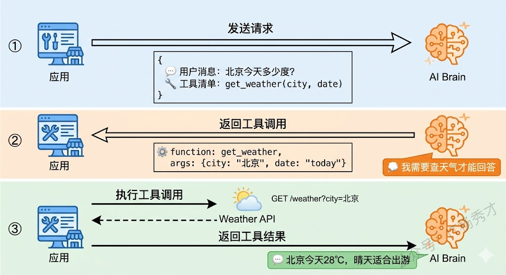
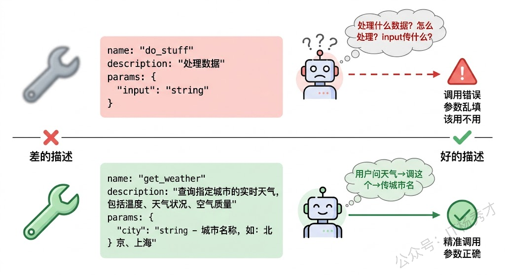
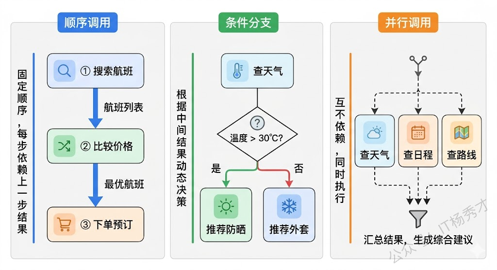
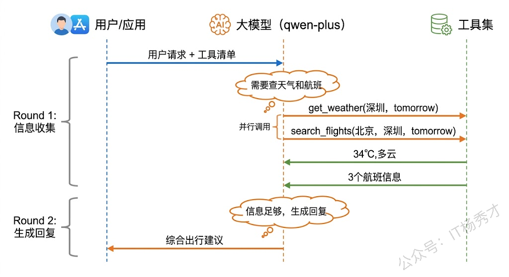
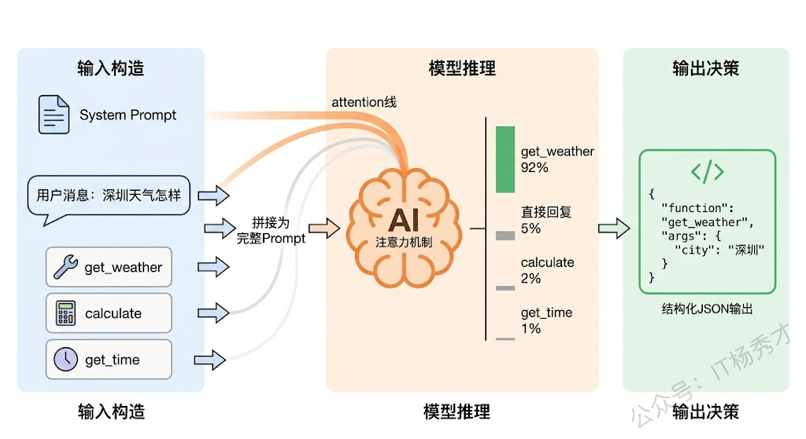
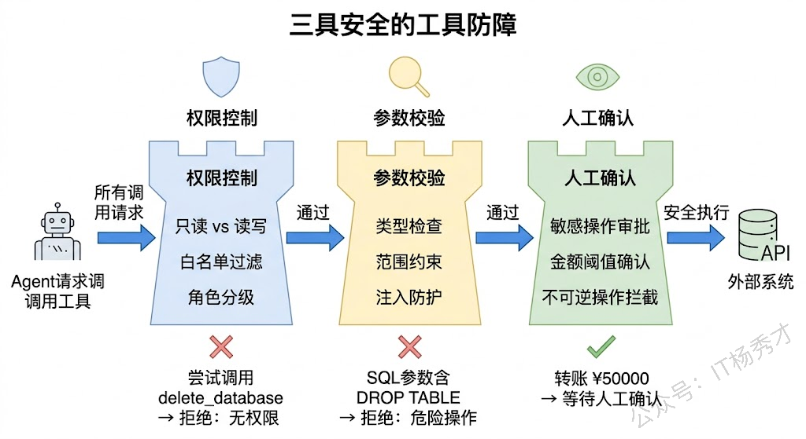
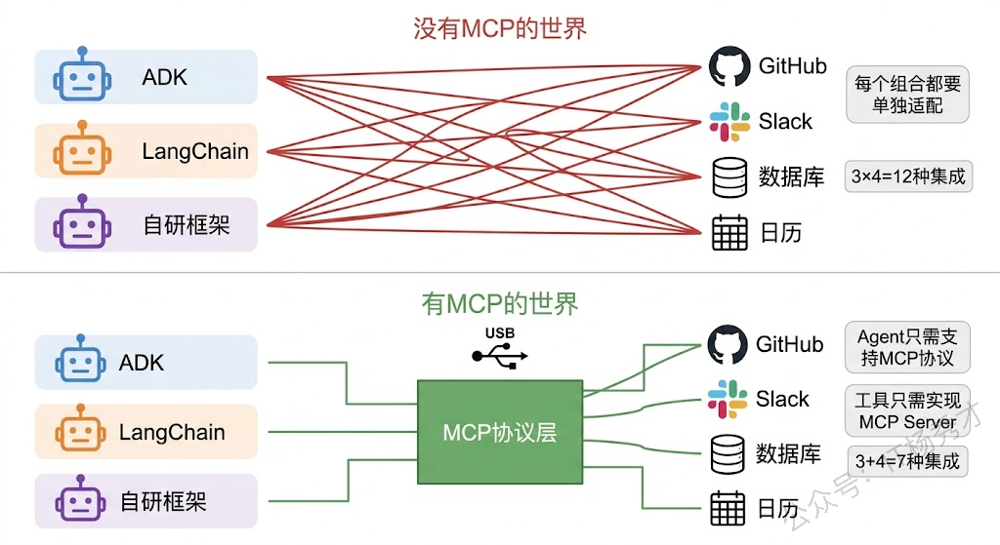
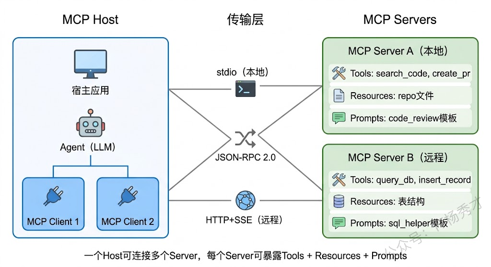

LLM 本质上是基于海量语料训练出的逻辑推理引擎，但其效能往往受限于知识密度的时效性与孤立的运行环境。要让 AI 从一个仅能提供文字反馈的 Chatbot 进化为具备生产力的 Agent，核心在于打破其离线枷锁，通过工具调用（Tool Use）将语义意图转化为对物理世界的确定性操作。

这篇文章，从工具使用的底层机制讲起——Function Calling 是怎么工作的，大模型是如何"知道"该调用哪个工具的。然后我们会深入工具描述和选择的设计原则，看看怎么写好一个工具的"说明书"让模型高效地使用它。接着讲解工具调用链，理解 Agent 如何编排多个工具完成复杂任务。最后，我们会介绍 MCP 协议——一个正在改变 Agent 工具生态的开放标准。

## **1. Function Calling**

在理解 Function Calling 之前，我们先想一个问题：大模型本质上只是一个文本生成器——输入一段文本，输出一段文本。那它是怎么做到"调用工具"这种看起来需要跟外部世界交互的事情的呢？

答案其实出奇的简单：**大模型并不真的去执行工具，它只是告诉你"我想调用某个工具，参数是这些"**。真正执行工具的是你的应用代码。

这就是 Function Calling 的核心思想。整个过程分三步走：第一步，你在调用大模型时，把可用工具的清单（包括每个工具的名称、描述、参数格式）一起发过去；第二步，大模型根据用户的问题，判断是否需要使用工具，如果需要，就在回复中生成一个结构化的"工具调用请求"，指定要调用哪个工具、传什么参数；第三步，你的应用代码收到这个请求后，真正去执行这个工具（比如发 HTTP 请求调用天气 API），拿到结果后再喂回给大模型，让它基于工具的返回结果生成最终的自然语言回复。



打个比方，Function Calling 就像你跟一个被困在隔音室里的顾问沟通。你先递进去一张纸条说"我想知道今天北京天气"，同时告诉他"如果需要的话，你可以让我去查天气 API"。他看了看你的问题，觉得确实需要查一下，就在纸条上写"请帮我调用天气 API，参数是 city=北京，date=today"递出来。你收到后真的去调了 API，拿到结果"28℃，晴"，再把这个结果递进去。他看了结果，最终在纸条上写"北京今天 28℃，晴天，适合出门"递出来。整个过程中，顾问（大模型）从来没有直接接触过外部世界，所有的"行动"都是通过你（应用代码）来执行的。

我们来看看用 Go 代码怎么实现 Function Calling。这个例子会展示一个最基础的流程：定义一个天气查询工具，让大模型根据用户问题决定是否调用它。

```go
package main

import (
    "context"
    "encoding/json"
    "fmt"
    "os"

    openai "github.com/sashabaranov/go-openai"
)

// 模拟天气查询工具的实际执行
func getWeather(city string) string {
    // 实际项目中这里会调用真实的天气API
    weatherData := map[string]string{
       "北京": "28℃，晴天，空气质量良好",
       "上海": "26℃，多云，有轻度雾霾",
       "深圳": "32℃，雷阵雨，注意带伞",
    }
    if weather, ok := weatherData[city]; ok {
       return weather
    }
    return "暂无该城市的天气数据"
}

func main() {
    config := openai.DefaultConfig(os.Getenv("DASHSCOPE_API_KEY"))
    config.BaseURL = "https://dashscope.aliyuncs.com/compatible-mode/v1"
    config.APIType = openai.APITypeOpenAI
    client := openai.NewClientWithConfig(config)
    ctx := context.Background()

    // 第一步：定义工具清单，告诉大模型有哪些工具可以用
    tools := []openai.Tool{
       {
          Type: openai.ToolTypeFunction,
          Function: &openai.FunctionDefinition{
             Name:        "get_weather",
             Description: "查询指定城市的当前天气信息，包括温度、天气状况和空气质量",
             Parameters: json.RawMessage(`{
                                        "type": "object",
                                        "properties": {
                                                "city": {
                                                        "type": "string",
                                                        "description": "要查询天气的城市名称，例如：北京、上海、深圳"
                                                }
                                        },
                                        "required": ["city"]
                                }`),
          },
       },
    }

    // 带着工具清单和用户问题一起发给大模型
    messages := []openai.ChatCompletionMessage{
       {Role: "system", Content: "你是一个有用的助手，可以帮用户查询天气信息。"},
       {Role: "user", Content: "帮我看看北京今天天气怎么样"},
    }

    fmt.Println("=== 第一步：发送请求（带工具清单）===")
    resp, err := client.CreateChatCompletion(ctx, openai.ChatCompletionRequest{
       Model:    "qwen-plus",
       Messages: messages,
       Tools:    tools,
    })
    if err != nil {
       fmt.Printf("请求失败: %v\n", err)
       return
    }

    assistantMsg := resp.Choices[0].Message

    // 第二步：检查大模型是否请求调用工具
    if len(assistantMsg.ToolCalls) > 0 {
       toolCall := assistantMsg.ToolCalls[0]
       fmt.Printf("大模型请求调用工具: %s\n", toolCall.Function.Name)
       fmt.Printf("调用参数: %s\n", toolCall.Function.Arguments)

       // 解析参数
       var args struct {
          City string `json:"city"`
       }
       json.Unmarshal([]byte(toolCall.Function.Arguments), &args)

       // 真正执行工具
       fmt.Printf("\n=== 第二步：执行工具调用 ===\n")
       result := getWeather(args.City)
       fmt.Printf("工具返回结果: %s\n", result)

       // 第三步：把工具执行结果喂回给大模型
       messages = append(messages, assistantMsg) // 加入助手的工具调用消息
       messages = append(messages, openai.ChatCompletionMessage{
          Role:       "tool",
          Content:    result,
          ToolCallID: toolCall.ID,
       })

       fmt.Printf("\n=== 第三步：将工具结果返回给大模型 ===\n")
       resp2, err := client.CreateChatCompletion(ctx, openai.ChatCompletionRequest{
          Model:    "qwen-plus",
          Messages: messages,
          Tools:    tools,
       })
       if err != nil {
          fmt.Printf("请求失败: %v\n", err)
          return
       }

       fmt.Printf("最终回复: %s\n", resp2.Choices[0].Message.Content)
    } else {
       // 大模型认为不需要工具，直接回复
       fmt.Printf("大模型直接回复: %s\n", assistantMsg.Content)
    }
}
```

运行结果：

```plain&#x20;text
=== 第一步：发送请求（带工具清单）===
大模型请求调用工具: get_weather
调用参数: {"city": "北京"}

=== 第二步：执行工具调用 ===
工具返回结果: 28℃，晴天，空气质量良好

=== 第三步：将工具结果返回给大模型 ===
最终回复: 北京今天天气很好，气温为28℃，天气晴朗，空气质量良好，适合外出活动。
```

注意看这段代码的结构：模型并没有自己去调用天气 API，它只是生成了一个结构化的"请求"——`get_weather(city="北京")`。真正调用 `getWeather` 函数的是我们的 Go 代码。模型的角色是"决策者"（决定调不调、调哪个、传什么参数），而应用代码是"执行者"（真正去干活）。这种分工非常精妙：模型擅长理解自然语言和做推理决策，应用代码擅长跟外部系统交互——各自做自己最擅长的事。

还有一个细节值得注意：如果用户的问题不需要工具，大模型会直接生成回复，根本不会触发 Function Calling。比如用户问"你好，你是谁"，模型会直接回答而不会去调天气 API。这说明模型在 Function Calling 中不是被动地执行指令，而是主动地判断和选择——这正是 Agent 智能性的体现。

## **2. 工具描述**

Function Calling 能不能用好，很大程度上取决于你对工具的描述质量。回想一下上面的代码，我们在定义工具时提供了三个关键信息：工具名称（`get_weather`）、工具描述（"查询指定城市的当前天气信息"）、参数定义（`city` 参数，类型是 string）。这三个信息就是工具的"说明书"，大模型完全依赖这份说明书来决定什么时候用这个工具、怎么用。

写好工具描述这件事，比大多数人想象的要重要得多。一个描述含糊的工具，就像一把没有标签的瑞士军刀——模型不知道什么时候该把它掏出来。一个参数定义不清的工具，就像一份省略了关键步骤的操作手册——模型知道要用它，却不知道怎么正确地填写参数。



好的工具描述应该遵循几个原则。

> **名称要见名知意**。`get_weather` 一眼就知道是查天气，`search_documents` 一看就知道是搜索文档。避免用 `process`、`handle`、`do` 这种泛泛的动词——模型看到 `process_data` 不知道这是处理什么数据、怎么处理，而看到 `query_database_orders` 就很清楚这是查询数据库里的订单数据。

> **描述要说清楚"干什么"和"什么时候该用"**。不要只写"查询天气"，要写"查询指定城市的当前天气信息，包括温度、天气状况和空气质量。当用户询问某个城市的天气时使用此工具"。前半句告诉模型这个工具能返回什么，后半句告诉模型什么场景下应该选择这个工具。描述越精确，模型做出正确选择的概率越高。

> **参数定义要给足约束和示例**。参数不是只写个类型就够了。`city: string` 这种定义太简陋，模型可能会传 "Beijing"（英文）、"北京市"（带"市"字）、"帝都"（口语化）——你的天气 API 可能只认 "北京" 这种格式。更好的写法是在参数描述里加上示例和约束：`"城市名称，只传城市名不要带'市'，例如：北京、上海、深圳"`。

我们来看一个稍微复杂一点的例子：定义一组工具让大模型来选择。当有多个工具可用时，模型需要根据用户意图精准地选择正确的工具。

```go
package main

import (
    "context"
    "encoding/json"
    "fmt"
    "math"
    "os"
    "strings"
    "time"

    openai "github.com/sashabaranov/go-openai"
)

// 定义多个工具的执行逻辑
func executeGetWeather(city string) string {
    data := map[string]string{
       "北京": "28℃，晴天", "上海": "26℃，多云", "深圳": "32℃，雷阵雨",
    }
    if w, ok := data[city]; ok {
       return w
    }
    return "暂无数据"
}

func executeCalculate(expression string) string {
    // 简单实现，实际项目中可用表达式解析引擎
    expression = strings.TrimSpace(expression)
    // 处理简单的四则运算
    var a, b float64
    var op string
    _, err := fmt.Sscanf(expression, "%f %s %f", &a, &op, &b)
    if err != nil {
       return "无法解析表达式: " + expression
    }
    var result float64
    switch op {
    case "+":
       result = a + b
    case "-":
       result = a - b
    case "*", "×":
       result = a * b
    case "/", "÷":
       if b == 0 {
          return "除数不能为零"
       }
       result = a / b
    case "^":
       result = math.Pow(a, b)
    default:
       return "不支持的运算符: " + op
    }
    return fmt.Sprintf("%.2f", result)
}

func executeGetTime(timezone string) string {
    loc, err := time.LoadLocation(timezone)
    if err != nil {
       return "无法识别时区: " + timezone
    }
    return time.Now().In(loc).Format("2006-01-02 15:04:05")
}

func main() {
    config := openai.DefaultConfig(os.Getenv("DASHSCOPE_API_KEY"))
    config.BaseURL = "https://dashscope.aliyuncs.com/compatible-mode/v1"
    config.APIType = openai.APITypeOpenAI
    client := openai.NewClientWithConfig(config)
    ctx := context.Background()

    // 定义三个工具，注意每个工具的描述要足够清晰以便模型区分
    tools := []openai.Tool{
       {
          Type: openai.ToolTypeFunction,
          Function: &openai.FunctionDefinition{
             Name:        "get_weather",
             Description: "查询指定城市的当前天气信息。当用户询问天气、温度、是否下雨等天气相关问题时使用。",
             Parameters: json.RawMessage(`{
                                        "type": "object",
                                        "properties": {
                                                "city": {
                                                        "type": "string",
                                                        "description": "城市名称，只传城市名不带'市'字，例如：北京、上海、深圳"
                                                }
                                        },
                                        "required": ["city"]
                                }`),
          },
       },
       {
          Type: openai.ToolTypeFunction,
          Function: &openai.FunctionDefinition{
             Name:        "calculate",
             Description: "执行数学计算。当用户需要做加减乘除、幂运算等数学运算时使用。",
             Parameters: json.RawMessage(`{
                                        "type": "object",
                                        "properties": {
                                                "expression": {
                                                        "type": "string",
                                                        "description": "数学表达式，格式为'数字 运算符 数字'，运算符支持 +、-、*、/、^，例如：3.14 * 2、100 / 3"
                                                }
                                        },
                                        "required": ["expression"]
                                }`),
          },
       },
       {
          Type: openai.ToolTypeFunction,
          Function: &openai.FunctionDefinition{
             Name:        "get_current_time",
             Description: "查询指定时区的当前时间。当用户询问现在几点、当前时间、某个时区的时间时使用。",
             Parameters: json.RawMessage(`{
                                        "type": "object",
                                        "properties": {
                                                "timezone": {
                                                        "type": "string",
                                                        "description": "时区标识，使用IANA时区格式，例如：Asia/Shanghai（中国）、America/New_York（美东）、Europe/London（伦敦）"
                                                }
                                        },
                                        "required": ["timezone"]
                                }`),
          },
       },
    }

    // 测试几个不同意图的问题，观察模型如何选择工具
    questions := []string{
       "深圳今天热不热？",
       "帮我算一下 1024 * 768 等于多少",
       "纽约现在几点了？",
       "你觉得Go语言怎么样？", // 这个问题不需要工具
    }

    for _, question := range questions {
       fmt.Printf("\n========================================\n")
       fmt.Printf("用户问题: %s\n", question)

       messages := []openai.ChatCompletionMessage{
          {Role: "system", Content: "你是一个有用的助手，根据用户问题选择合适的工具来回答。"},
          {Role: "user", Content: question},
       }

       resp, err := client.CreateChatCompletion(ctx, openai.ChatCompletionRequest{
          Model:    "qwen-plus",
          Messages: messages,
          Tools:    tools,
       })
       if err != nil {
          fmt.Printf("请求失败: %v\n", err)
          continue
       }

       msg := resp.Choices[0].Message
       if len(msg.ToolCalls) > 0 {
          tc := msg.ToolCalls[0]
          fmt.Printf("模型选择工具: %s\n", tc.Function.Name)
          fmt.Printf("调用参数: %s\n", tc.Function.Arguments)

          // 执行对应工具
          var result string
          switch tc.Function.Name {
          case "get_weather":
             var args struct {
                City string `json:"city"`
             }
             json.Unmarshal([]byte(tc.Function.Arguments), &args)
             result = executeGetWeather(args.City)
          case "calculate":
             var args struct {
                Expression string `json:"expression"`
             }
             json.Unmarshal([]byte(tc.Function.Arguments), &args)
             result = executeCalculate(args.Expression)
          case "get_current_time":
             var args struct {
                Timezone string `json:"timezone"`
             }
             json.Unmarshal([]byte(tc.Function.Arguments), &args)
             result = executeGetTime(args.Timezone)
          }
          fmt.Printf("工具结果: %s\n", result)

          // 把结果喂回给大模型
          messages = append(messages, msg)
          messages = append(messages, openai.ChatCompletionMessage{
             Role: "tool", Content: result, ToolCallID: tc.ID,
          })
          resp2, _ := client.CreateChatCompletion(ctx, openai.ChatCompletionRequest{
             Model: "qwen-plus", Messages: messages, Tools: tools,
          })
          fmt.Printf("最终回复: %s\n", resp2.Choices[0].Message.Content)
       } else {
          fmt.Printf("无需工具，直接回复: %s\n", msg.Content)
       }
    }
}
```

运行结果：

```plain&#x20;text
========================================
用户问题: 深圳今天热不热？
模型选择工具: get_weather
调用参数: {"city": "深圳"}
工具结果: 32℃，雷阵雨
最终回复: 深圳今天32℃还有雷阵雨，天气确实挺热的，而且可能会下雨，出门记得带伞！

========================================
用户问题: 帮我算一下 1024 * 768 等于多少
模型选择工具: calculate
调用参数: {"expression": "1024 * 768"}
工具结果: 786432.00
最终回复: 1024 × 768 = 786432。

========================================
用户问题: 纽约现在几点了？
模型选择工具: get_current_time
调用参数: {"timezone": "America/New_York"}
工具结果: 2025-05-15 10:30:25
最终回复: 纽约现在是2025年5月15日上午10点30分。

========================================
用户问题: 你觉得Go语言怎么样？
无需工具，直接回复: Go语言是一门非常优秀的编程语言，特别适合构建高性能的后端服务和分布式系统...
```

这个例子展示了一个关键能力：**模型能在多个工具之间做出正确的选择**。"深圳热不热"触发了天气工具，"帮我算"触发了计算工具，"纽约几点"触发了时间工具，而"Go语言怎么样"这个问题不需要任何工具，模型就直接回复了。模型是怎么做到的？它靠的就是每个工具的描述——"天气相关问题时使用"、"数学运算时使用"、"询问时间时使用"——这些描述就像一个个标签，帮助模型把用户意图和正确的工具匹配起来。

### **2.1 工具参数的 JSON Schema**

在上面的例子中，工具的参数定义使用了 JSON Schema 格式。这是 Function Calling 的标准规范——所有主流大模型平台（OpenAI、通义千问、Gemini、Claude）都采用 JSON Schema 来描述工具的输入参数。

JSON Schema 本质上是一种描述 JSON 数据结构的语言。它能告诉模型每个参数叫什么名字、是什么类型、有什么约束条件、哪些是必填的。模型读懂了 Schema，就知道该怎么构造参数了。

一个设计良好的 Schema 应该做到几点：用 `description` 字段为每个参数提供清晰的自然语言说明；用 `enum` 约束取值范围（如果参数只有有限个合法值的话）；用 `required` 明确标记必填参数；在 `description` 中给出具体的示例值。这些信息越丰富，模型生成正确参数的概率就越高。

来看一个更复杂的参数设计：

```go
package main

import (
        "encoding/json"
        "fmt"
)

func main() {
        // 一个设计精良的工具参数Schema示例
        schema := map[string]interface{}{
                "type": "object",
                "properties": map[string]interface{}{
                        "query": map[string]interface{}{
                                "type":        "string",
                                "description": "搜索关键词，支持自然语言描述，例如：'最近一周的大额退款订单'、'VIP用户的购买记录'",
                        },
                        "time_range": map[string]interface{}{
                                "type":        "string",
                                "description": "查询的时间范围",
                                "enum":        []string{"today", "last_7_days", "last_30_days", "last_90_days", "all"},
                                "default":     "last_7_days",
                        },
                        "order_status": map[string]interface{}{
                                "type":        "string",
                                "description": "按订单状态筛选",
                                "enum":        []string{"pending", "paid", "shipped", "completed", "refunded"},
                        },
                        "limit": map[string]interface{}{
                                "type":        "integer",
                                "description": "返回结果的最大数量，默认10条，最大100条",
                                "default":     10,
                                "minimum":     1,
                                "maximum":     100,
                        },
                        "sort_by": map[string]interface{}{
                                "type":        "string",
                                "description": "排序字段",
                                "enum":        []string{"created_at", "amount", "updated_at"},
                                "default":     "created_at",
                        },
                },
                "required": []string{"query"},
        }

        schemaJSON, _ := json.MarshalIndent(schema, "", "  ")
        fmt.Println("工具参数Schema设计示例：")
        fmt.Println(string(schemaJSON))
}
```

运行结果：

```json
工具参数Schema设计示例：
{
  "properties": {
    "limit": {
      "default": 10,
      "description": "返回结果的最大数量，默认10条，最大100条",
      "maximum": 100,
      "minimum": 1,
      "type": "integer"
    },
    "order_status": {
      "description": "按订单状态筛选",
      "enum": [
        "pending",
        "paid",
        "shipped",
        "completed",
        "refunded"
      ],
      "type": "string"
    },
    "query": {
      "description": "搜索关键词，支持自然语言描述，例如：'最近一周的大额退款订单'、'VIP用户的购买记录'",
      "type": "string"
    },
    "sort_by": {
      "default": "created_at",
      "description": "排序字段",
      "enum": [
        "created_at",
        "amount",
        "updated_at"
      ],
      "type": "string"
    },
    "time_range": {
      "default": "last_7_days",
      "description": "查询的时间范围",
      "enum": [
        "today",
        "last_7_days",
        "last_30_days",
        "last_90_days",
        "all"
      ],
      "type": "string"
    }
  },
  "required": [
    "query"
  ],
  "type": "object"
}
```

这个 Schema 展示了几个好的设计实践：`query` 参数的描述中给出了具体的自然语言查询示例，模型能从中推断出传参的格式；`time_range` 和 `order_status` 用 `enum` 限制了取值范围，模型不会传出 "last\_2\_weeks" 这种你没定义的值；`limit` 用 `minimum` 和 `maximum` 约束了数值范围；只有 `query` 是必填的，其他参数都是可选的（有默认值），这让工具的使用更灵活——用户说"查一下最近的退款订单"时模型只需要传 `query`，说"查一下上个月金额最大的 50 条退款订单"时模型会额外传 `time_range`、`sort_by`、`limit`。

## **3. 工具调用链**

现实世界中的任务很少只需要一个工具就能完成。当用户说"帮我查一下北京的天气，如果温度超过 30 度就给我订一瓶防晒霜"，这个请求需要先调用天气工具获取温度，然后根据温度判断是否需要调用购物工具下单。这种多个工具按序或按条件组合使用的模式，就是工具调用链（Tool Chain）。



工具调用链的核心驱动力还是大模型的推理能力。Agent 在每一轮循环中都会根据当前上下文决定下一步做什么——是调用另一个工具，还是已经收集够信息可以回复用户了。大模型在这个过程中充当的是"编排者"角色：它理解用户的最终目标，拆解出需要的步骤，按顺序或按条件调用不同的工具，并在每一步利用前一步的结果来指导下一步的行为。

我们来实现一个完整的工具调用链示例。这个 Agent 具备天气查询、时间查询和出行建议三个工具，当用户问"我明天要去深圳出差，需要注意什么"时，Agent 需要先查天气、再查时间，最后综合这些信息给出出行建议。

```go
package main

import (
    "context"
    "encoding/json"
    "fmt"
    "os"
    "time"

    openai "github.com/sashabaranov/go-openai"
)

// 工具执行函数
func toolGetWeather(city, date string) string {
    data := map[string]map[string]string{
       "深圳": {
          "today":    "32℃，雷阵雨，湿度85%",
          "tomorrow": "34℃，多云转晴，湿度70%",
       },
       "北京": {
          "today":    "28℃，晴天，湿度40%",
          "tomorrow": "30℃，晴转多云，湿度45%",
       },
    }
    if cityData, ok := data[city]; ok {
       if weather, ok := cityData[date]; ok {
          return weather
       }
    }
    return "暂无天气数据"
}

func toolGetTime(timezone string) string {
    loc, err := time.LoadLocation(timezone)
    if err != nil {
       return "时区无效"
    }
    return time.Now().In(loc).Format("2006-01-02 15:04:05 MST")
}

func toolSearchFlights(from, to, date string) string {
    return fmt.Sprintf("找到3个航班: [%s→%s %s] CA1301 07:30 ¥980 | CZ3502 10:15 ¥1120 | MU5301 14:00 ¥850", from, to, date)
}

// executeTool 根据工具名称分发执行
func executeTool(name, argsJSON string) string {
    switch name {
    case "get_weather":
       var args struct {
          City string `json:"city"`
          Date string `json:"date"`
       }
       json.Unmarshal([]byte(argsJSON), &args)
       if args.Date == "" {
          args.Date = "today"
       }
       return toolGetWeather(args.City, args.Date)
    case "get_current_time":
       var args struct {
          Timezone string `json:"timezone"`
       }
       json.Unmarshal([]byte(argsJSON), &args)
       return toolGetTime(args.Timezone)
    case "search_flights":
       var args struct {
          From string `json:"from"`
          To   string `json:"to"`
          Date string `json:"date"`
       }
       json.Unmarshal([]byte(argsJSON), &args)
       return toolSearchFlights(args.From, args.To, args.Date)
    default:
       return "未知工具: " + name
    }
}

func main() {
    config := openai.DefaultConfig(os.Getenv("DASHSCOPE_API_KEY"))
    config.BaseURL = "https://dashscope.aliyuncs.com/compatible-mode/v1"
    config.APIType = openai.APITypeOpenAI
    client := openai.NewClientWithConfig(config)
    ctx := context.Background()

    tools := []openai.Tool{
       {
          Type: openai.ToolTypeFunction,
          Function: &openai.FunctionDefinition{
             Name:        "get_weather",
             Description: "查询指定城市在指定日期的天气信息，包括温度、天气状况和湿度。",
             Parameters: json.RawMessage(`{
                                        "type": "object",
                                        "properties": {
                                                "city": {"type": "string", "description": "城市名称，如：北京、深圳"},
                                                "date": {"type": "string", "enum": ["today", "tomorrow"], "description": "日期，today或tomorrow"}
                                        },
                                        "required": ["city"]
                                }`),
          },
       },
       {
          Type: openai.ToolTypeFunction,
          Function: &openai.FunctionDefinition{
             Name:        "get_current_time",
             Description: "获取指定时区的当前时间。",
             Parameters: json.RawMessage(`{
                                        "type": "object",
                                        "properties": {
                                                "timezone": {"type": "string", "description": "IANA时区，如Asia/Shanghai"}
                                        },
                                        "required": ["timezone"]
                                }`),
          },
       },
       {
          Type: openai.ToolTypeFunction,
          Function: &openai.FunctionDefinition{
             Name:        "search_flights",
             Description: "搜索两个城市之间的航班信息，返回可选航班列表和价格。",
             Parameters: json.RawMessage(`{
                                        "type": "object",
                                        "properties": {
                                                "from": {"type": "string", "description": "出发城市"},
                                                "to":   {"type": "string", "description": "到达城市"},
                                                "date": {"type": "string", "description": "出发日期，如tomorrow"}
                                        },
                                        "required": ["from", "to", "date"]
                                }`),
          },
       },
    }

    messages := []openai.ChatCompletionMessage{
       {
          Role:    "system",
          Content: "你是一个出行助手。用户询问出差相关问题时，你应该主动查询天气、航班等信息，然后给出综合建议。一步一步来，先收集信息再给建议。",
       },
       {
          Role:    "user",
          Content: "我在北京，明天要去深圳出差，帮我看看需要注意什么，顺便查查有什么航班。",
       },
    }

    maxRounds := 5 // 最多执行5轮工具调用，防止无限循环
    for round := 1; round <= maxRounds; round++ {
       fmt.Printf("\n--- 第 %d 轮对话 ---\n", round)

       resp, err := client.CreateChatCompletion(ctx, openai.ChatCompletionRequest{
          Model:    "qwen-plus",
          Messages: messages,
          Tools:    tools,
       })
       if err != nil {
          fmt.Printf("请求失败: %v\n", err)
          return
       }

       msg := resp.Choices[0].Message

       // 如果没有工具调用，说明模型认为信息已经收集够了
       if len(msg.ToolCalls) == 0 {
          fmt.Printf("Agent 最终回复:\n%s\n", msg.Content)
          break
       }

       // 处理工具调用（可能有多个并行调用）
       messages = append(messages, msg)
       for _, tc := range msg.ToolCalls {
          fmt.Printf("调用工具: %s(%s)\n", tc.Function.Name, tc.Function.Arguments)
          result := executeTool(tc.Function.Name, tc.Function.Arguments)
          fmt.Printf("工具结果: %s\n", result)

          messages = append(messages, openai.ChatCompletionMessage{
             Role:       "tool",
             Content:    result,
             ToolCallID: tc.ID,
          })
       }
    }
}
```

运行结果：

```plain&#x20;text
--- 第 1 轮对话 ---
调用工具: get_weather({"city": "北京", "date": "tomorrow"})
工具结果: 30℃，晴转多云，湿度45%
调用工具: get_weather({"city": "深圳", "date": "tomorrow"})
工具结果: 34℃，多云转晴，湿度70%
调用工具: search_flights({"date": "tomorrow", "from": "北京", "to": "深圳"})
工具结果: 找到3个航班: [北京→深圳 tomorrow] CA1301 07:30 ¥980 | CZ3502 10:15 ¥1120 | MU5301 14:00 ¥850
调用工具: get_current_time({"timezone": "Asia/Shanghai"})
工具结果: 2026-04-13 16:26:01 CST

--- 第 2 轮对话 ---
Agent 最终回复:
根据查询结果，为您整理以下出差建议：

### 🌤 天气情况：
- **北京（出发地）**：明天天气为晴转多云，气温约30℃，湿度45%，较为舒适，但需注意防晒和适当补水。
- **深圳（目的地）**：明天多云转晴，气温较高，达34℃，湿度70%，体感较闷热，建议穿着轻薄透气的衣物，并随身携带雨具（以防局部阵雨）。

### ✈ 航班推荐（明天）：
| 航班号 | 出发时间 | 价格  | 备注         |
|--------|----------|-------|--------------|
| MU5301 | 14:00    | ¥850  | **性价比最高**，价格最低 |
| CA1301 | 07:30    | ¥980  | 早班机，适合希望上午抵达、高效开展工作的行程 |
| CZ3502 | 10:15    | ¥1120 | 中午出发，时间较均衡     |

✅ **小贴士**：
- 深圳机场到市区约40–60分钟车程，建议提前规划接驳交通（如地铁11号线或机场快线）；
- 北京出发请至少提前2小时到达首都/大兴机场办理值机与安检；
- 深圳夏季紫外线强、易突发雷阵雨，建议携带遮阳帽、便携小伞及保湿用品。

如需我帮您预订某趟航班、查询酒店或规划市内交通，欢迎随时告诉我！祝您出差顺利！ 🌟
```

这段代码有几个关键。点首先，Agent 在第一轮就同时调用了两个工具（天气和航班），这说明模型识别出这两个查询是互不依赖的，可以并行执行——这是一种"并行调用"的编排模式。其次，Agent 在第二轮判断出信息已经收集完毕，不再调用工具而是直接生成最终回复——这说明模型在每一轮都在做"是否需要继续"的决策。最后，`maxRounds` 这个安全阀非常重要，它防止了 Agent 因为某种原因（比如工具返回了不符合预期的结果）陷入无限调用的死循环。



## **4.  模型是怎么做决策的**

看完了工具调用的代码实现，你可能会好奇一个更深层的问题：大模型到底是怎么"决定"要不要调用工具、调用哪个工具的？它又没有写 if-else 的逻辑，这个决策过程到底发生在哪里？

答案在于 Function Calling 的实现机制。当你把工具定义发给大模型时，这些工具信息会被格式化后拼接到 Prompt 中（或通过模型内部的特殊处理通道注入）。模型在做 Token 预测时，除了正常的文本 Token，还可以选择生成特殊的"函数调用" Token。模型的训练数据中包含了大量的工具调用示例，通过这些训练数据，模型学会了在什么场景下应该输出工具调用指令，以及如何把自然语言参数映射到 JSON 格式。

简单来说，Function Calling 不是模型"额外"学会的一个技能，而是它生成文本能力的一种延伸——只不过输出的不是自然语言，而是结构化的 JSON。模型在训练过程中见过无数"用户问天气→应该调 get\_weather"、"用户要算数→应该调 calculate"的案例，所以它能从用户意图推断出最合适的工具和参数。



理解了这个机制，你就明白为什么工具描述的质量如此重要了。如果你的工具描述写得好，模型在训练数据中更容易找到匹配的模式，做出正确选择的概率就高。如果描述含糊，模型就像一个拿到模糊说明书的新员工——可能会挑错工具，或者明明应该用工具却选择自己"硬编"一个答案。

这里还有一个实际开发中常遇到的问题：**当工具数量很多时（比如超过 20 个），模型的选择准确率会下降**。这就像你面前放了 50 把不同的螺丝刀，你很可能挑花眼。解决这个问题有几种思路：一是做工具分组，把相关的工具归为一类，先让模型选类别再选具体工具；二是做工具描述的语义去重，确保不同工具之间的描述差异足够大；三是用多 Agent 架构，让不同的 Agent 各自负责一组工具，由一个路由 Agent 来分发请求——这个话题我们在后续的多智能体章节会详细展开。

## **5. 工具使用的安全边界**

赋予 Agent 使用工具的能力，就像给一个员工配发公司的各种系统权限——能力越大，风险也越大。如果 Agent 可以执行数据库写操作，那它万一"犯错"写了一条错误的 SQL，后果可能很严重。如果 Agent 可以发送邮件，那它万一误解了用户意图给客户发了一封不合适的邮件，造成的影响可能无法挽回。

工具使用的安全设计，本质上是在"能力"和"约束"之间找到平衡。一个完全没有工具的 Agent 是安全的但没什么用，一个不受约束地使用所有工具的 Agent 是强大的但很危险。好的安全设计，是在保持足够能力的前提下，把风险控制在可接受范围内。



在实际项目中，工具安全通常从三个层面来保障。

> 第一层是**权限控制**——决定 Agent 能用哪些工具、不能用哪些。最简单的做法是维护一个工具白名单，只允许 Agent 调用预先注册的工具。更精细的做法是按角色分级：只读 Agent 只能使用查询类工具（搜索、查询），不能使用写入类工具（创建、修改、删除）。

> 第二层是**参数校验**——即使 Agent 有权调用某个工具，也要检查它传的参数是否合法。这一层主要防止两类问题：一是"幻觉参数"——模型有时会编造不存在的参数值（比如传一个不存在的城市名）；二是"注入攻击"——虽然大模型不太会主动注入恶意代码，但如果用户输入中包含了恶意内容，模型可能会不加检查地透传到工具参数中。

> 第三层是**人工确认**——对于高风险操作（如转账、删除数据、发送邮件），在真正执行前要求人工确认。这是最后一道安全阀，确保不可逆的操作都经过了人类的审批。

我们来写一个带有安全校验的工具执行器：

```go
package main

import (
        "errors"
        "fmt"
        "strings"
)

// ToolPermission 定义工具权限级别
type ToolPermission int

const (
        PermissionReadOnly  ToolPermission = iota // 只读操作，自动执行
        PermissionWrite                           // 写操作，需要参数校验
        PermissionCritical                        // 高危操作，需要人工确认
)

// ToolRegistry 工具注册表，管理权限和校验规则
type ToolRegistry struct {
        tools map[string]ToolConfig
}

type ToolConfig struct {
        Name       string
        Permission ToolPermission
        Validate   func(args map[string]interface{}) error // 参数校验函数
        Execute    func(args map[string]interface{}) string
}

func NewToolRegistry() *ToolRegistry {
        return &ToolRegistry{tools: make(map[string]ToolConfig)}
}

func (r *ToolRegistry) Register(config ToolConfig) {
        r.tools[config.Name] = config
}

// SafeExecute 安全执行工具，经过权限检查→参数校验→（可选）人工确认
func (r *ToolRegistry) SafeExecute(toolName string, args map[string]interface{}) (string, error) {
        // 第一关：权限检查——工具是否在注册表中
        tool, ok := r.tools[toolName]
        if !ok {
                return "", fmt.Errorf("工具 '%s' 未注册，拒绝执行", toolName)
        }
        fmt.Printf("  ✅ 权限检查通过: %s (权限级别: %d)\n", toolName, tool.Permission)

        // 第二关：参数校验
        if tool.Validate != nil {
                if err := tool.Validate(args); err != nil {
                        return "", fmt.Errorf("参数校验失败: %w", err)
                }
                fmt.Printf("  ✅ 参数校验通过\n")
        }

        // 第三关：高危操作需要人工确认
        if tool.Permission == PermissionCritical {
                fmt.Printf("  ⚠️  高危操作，需要人工确认: %s(%v)\n", toolName, args)
                // 实际项目中这里会等待人工审批
                // 这里模拟为自动通过
                fmt.Printf("  ✅ 人工确认通过（模拟）\n")
        }

        // 执行工具
        result := tool.Execute(args)
        return result, nil
}

func main() {
        registry := NewToolRegistry()

        // 注册只读工具——无需特殊校验
        registry.Register(ToolConfig{
                Name:       "search_orders",
                Permission: PermissionReadOnly,
                Execute: func(args map[string]interface{}) string {
                        return fmt.Sprintf("找到3条订单记录 (关键词: %s)", args["keyword"])
                },
        })

        // 注册写操作工具——需要参数校验
        registry.Register(ToolConfig{
                Name:       "update_order_status",
                Permission: PermissionWrite,
                Validate: func(args map[string]interface{}) error {
                        status, _ := args["status"].(string)
                        validStatuses := map[string]bool{
                                "pending": true, "processing": true,
                                "shipped": true, "completed": true,
                        }
                        if !validStatuses[status] {
                                return fmt.Errorf("无效的订单状态: %s", status)
                        }
                        // 检查SQL注入风险
                        orderID, _ := args["order_id"].(string)
                        if strings.ContainsAny(orderID, ";'\"--") {
                                return errors.New("order_id包含危险字符，疑似注入攻击")
                        }
                        return nil
                },
                Execute: func(args map[string]interface{}) string {
                        return fmt.Sprintf("订单 %s 状态已更新为 %s", args["order_id"], args["status"])
                },
        })

        // 注册高危工具——需要人工确认
        registry.Register(ToolConfig{
                Name:       "refund_order",
                Permission: PermissionCritical,
                Validate: func(args map[string]interface{}) error {
                        amount, _ := args["amount"].(float64)
                        if amount > 10000 {
                                return fmt.Errorf("退款金额 %.2f 超过上限 10000", amount)
                        }
                        return nil
                },
                Execute: func(args map[string]interface{}) string {
                        return fmt.Sprintf("退款 %.2f 元已处理，订单: %s", args["amount"], args["order_id"])
                },
        })

        // 测试各种场景
        testCases := []struct {
                tool string
                args map[string]interface{}
        }{
                {"search_orders", map[string]interface{}{"keyword": "手机壳"}},
                {"update_order_status", map[string]interface{}{"order_id": "ORD001", "status": "shipped"}},
                {"update_order_status", map[string]interface{}{"order_id": "ORD002; DROP TABLE orders;--", "status": "shipped"}},
                {"refund_order", map[string]interface{}{"order_id": "ORD003", "amount": 299.0}},
                {"delete_database", map[string]interface{}{}}, // 未注册的危险工具
        }

        for _, tc := range testCases {
                fmt.Printf("\n🔧 调用工具: %s\n", tc.tool)
                result, err := registry.SafeExecute(tc.tool, tc.args)
                if err != nil {
                        fmt.Printf("  ❌ 执行被拦截: %v\n", err)
                } else {
                        fmt.Printf("  📋 执行结果: %s\n", result)
                }
        }
}
```

运行结果：

```plain&#x20;text
🔧 调用工具: search_orders
  ✅ 权限检查通过: search_orders (权限级别: 0)
  📋 执行结果: 找到3条订单记录 (关键词: 手机壳)

🔧 调用工具: update_order_status
  ✅ 权限检查通过: update_order_status (权限级别: 1)
  ✅ 参数校验通过
  📋 执行结果: 订单 ORD001 状态已更新为 shipped

🔧 调用工具: update_order_status
  ✅ 权限检查通过: update_order_status (权限级别: 1)
  ❌ 执行被拦截: 参数校验失败: order_id包含危险字符，疑似注入攻击

🔧 调用工具: refund_order
  ✅ 权限检查通过: refund_order (权限级别: 2)
  ✅ 参数校验通过
  ⚠️  高危操作，需要人工确认: refund_order(map[amount:299 order_id:ORD003])
  ✅ 人工确认通过（模拟）
  📋 执行结果: 退款 299.00 元已处理，订单: ORD003

🔧 调用工具: delete_database
  ❌ 执行被拦截: 工具 'delete_database' 未注册，拒绝执行
```

从输出可以看到三道防线各自发挥了作用：未注册的 `delete_database` 在第一道防线被拦截；包含注入字符的 `order_id` 在第二道防线被拦截；退款操作在第三道防线触发了人工确认。这种分层防御的设计，让 Agent 在拥有强大工具能力的同时，不至于"闯祸"。

## **6. MCP 协议**

到目前为止，我们讲的工具都是在应用代码里"硬编码"的——你写一个 `getWeather` 函数，注册成工具，Agent 就能用了。但这种方式有一个明显的局限：**每个工具都得自己实现**。如果你想让 Agent 能搜索 GitHub 上的代码，你得自己封装 GitHub API；想让它读 Slack 消息，你得自己封装 Slack API；想让它查数据库，你得自己写数据库连接代码。工具越多，工作量越大，而且不同的 Agent 框架各有各的工具定义格式，工具很难跨框架复用。

这个问题在软件工程领域并不陌生——USB 出现之前，每种外设都有自己的接口标准，鼠标、键盘、打印机、扫描仪各用各的接口，换一台电脑可能就用不了。USB 标准统一了这一切：只要设备实现了 USB 协议，就能插到任何支持 USB 的电脑上用。

**MCP（Model Context Protocol，模型上下文协议）** 就是 AI Agent 世界的"USB 标准"。它由 Anthropic 在 2024 年 11 月提出并开源，定义了一套 Agent 与外部工具之间的标准通信协议。有了 MCP，工具提供方只需要实现一次 MCP Server，任何支持 MCP 的 Agent 框架（Claude、Google ADK、LangChain 等）就都能使用这个工具——不需要为每个框架单独适配。



MCP 的架构非常清晰，由三个核心角色组成。**MCP Host** 是运行 Agent 的宿主应用（比如 Claude Desktop、你自己的 Go 程序），它负责管理 Agent 的生命周期。**MCP Client** 是 Host 中的一个组件，负责与 MCP Server 建立连接并通信。**MCP Server** 是工具提供方实现的服务端，它暴露工具定义和执行接口。一个 Host 可以同时连接多个 Server（比如一个 GitHub Server + 一个 Slack Server + 一个数据库 Server），Agent 就同时拥有了操作这三个系统的能力。

MCP Server 对外暴露的能力有三种类型：**Tools**（工具）是最核心的，Agent 可以调用 Server 提供的工具来执行操作；**Resources**（资源）让 Agent 可以读取 Server 管理的数据（如文件内容、数据库记录）；**Prompts**（提示词模板）让 Server 可以提供预定义的交互模式。这三种能力组合在一起，让 MCP Server 不仅仅是一个"工具箱"，更像是一个完整的"能力模块"。

通信层面，MCP 使用 JSON-RPC 2.0 作为底层协议格式，支持两种传输方式：**stdio**（标准输入输出）适合本地进程间通信，MCP Server 作为子进程启动，通过 stdin/stdout 交换消息；**HTTP + SSE**（Server-Sent Events）适合远程调用，MCP Server 作为 HTTP 服务部署，Client 通过 HTTP 请求发送调用，通过 SSE 接收流式响应。



MCP 生态目前已经非常丰富。Anthropic 官方维护了一批 MCP Server（文件系统、GitHub、Slack、PostgreSQL、Google 搜索等），社区也贡献了数百个 Server。对于 Go 开发者来说，最直接的使用方式就是在 ADK 框架中集成 MCP 工具——ADK 原生支持 MCP Client，可以直接连接任何标准的 MCP Server，把 Server 暴露的工具注入到 Agent 中使用。我们在后续的 ADK 进阶篇中会实战演示如何在 ADK 中集成 MCP 工具。

这里需要注意一点：MCP 目前还处于快速发展阶段，协议本身在持续演进。截至 2025 年初，MCP 已经成为 Agent 工具互操作的事实标准——几乎所有主流 Agent 框架都宣布了 MCP 支持。但这并不意味着你在写自己的 Agent 时一定要用 MCP，对于简单场景（几个自定义工具），直接用 Function Calling 注册工具仍然是最简单高效的方式。MCP 的价值在于工具数量很多、需要跨框架复用、或者想接入社区现成工具的场景。

## **7. 小结**

工具使用是 Agent 从"能说会道"到"能做实事"的分水岭。Function Calling 机制让大模型在保持纯文本生成本质的同时，获得了与外部世界交互的能力，模型专注于理解意图和做决策，应用代码负责执行和交互，各司其职又紧密协作。工具描述的质量直接决定了这种协作的效果，一份好的"工具说明书"就是人和模型之间最重要的沟通契约。而 MCP 协议的出现，则把这种协作从单个应用内部扩展到了整个生态——就像 USB 统一了硬件接口一样，MCP 正在统一 AI Agent 的工具接口，让工具的创造者和使用者可以独立演进而互不影响。

从更宏观的角度看，工具使用能力的成熟度反映了 Agent 系统的成熟度。一个初级 Agent 可能只会调用一两个预设工具完成简单任务；一个高级 Agent 能在几十个工具中灵活选择、按需组合、安全执行；而一个真正成熟的 Agent 平台，则能通过标准协议无缝接入不断增长的工具生态。

<div style="background-color: #f0f9eb; padding: 10px 15px; border-radius: 4px; border-left: 5px solid #67c23a; margin: 20px 0; color:rgb(64, 147, 255);">

<span style="color: #006400; font-size: 28px;"><strong>关注秀才公众号：</strong></span><span style="color: red; font-size: 28px;"><strong>IT杨秀才</strong></span><span style="color: #006400; font-size: 28px;"><strong>，回复：</strong></span><span style="color: red; font-size: 28px;"><strong>面试</strong></span>

<div style="text-align: center;"><span style="color: #006400; font-size: 28px;"><strong>领取后端/AI面试题库PDF</strong></span></div>


</div> 


