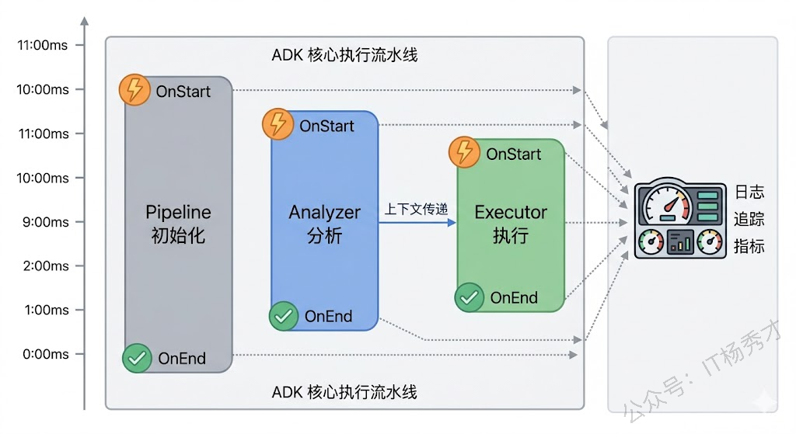
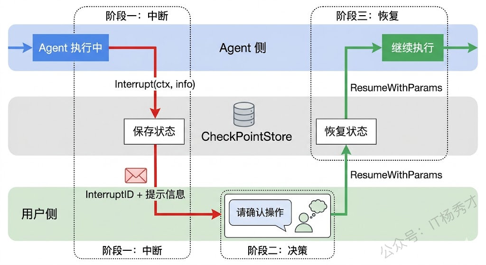
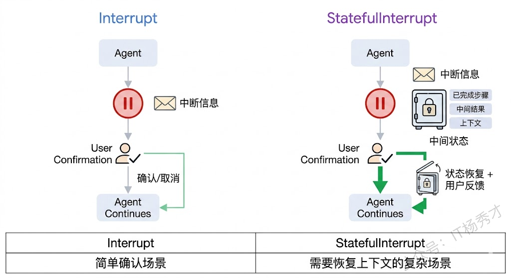
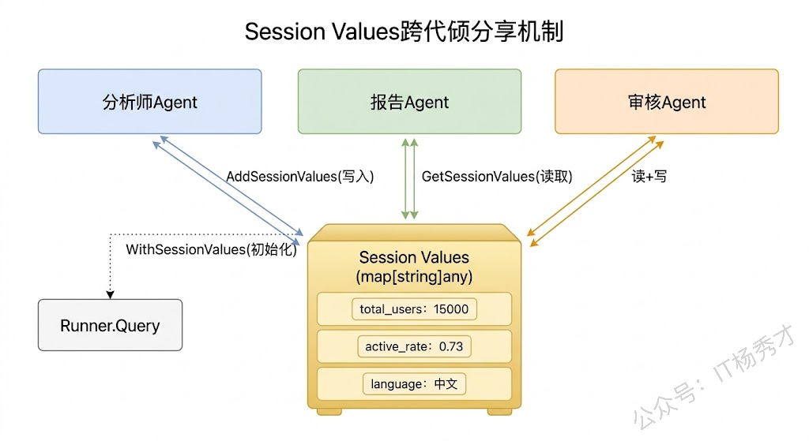
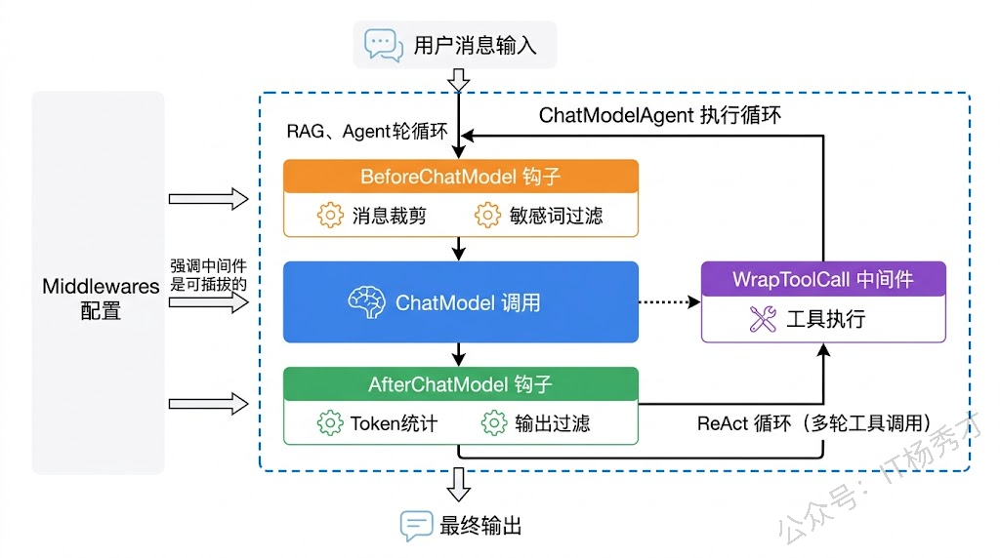

上一篇我们学会了用 ADK 的四种 Agent 类型搭建多智能体系统——ChatModelAgent 负责思考，SequentialAgent 串流水线，ParallelAgent 跑并行，LoopAgent 做循环。但能跑起来和能在生产环境稳定运行之间还有不小的距离。生产环境中你会面对很多实际问题：Agent 执行到一半需要人工确认怎么办？执行过程中发生了什么我怎么知道？多个 Agent 之间怎么共享数据？Agent 的行为怎么在不改代码的前提下扩展？

接下来我们就来重点探讨这些问题。深入 ADK 的四个高级特性：回调与事件监听、人机协作中断机制（Human-in-the-Loop）、Session Values 状态管理，以及 AgentMiddleware 中间件扩展。这些能力就是把 Agent 系统从Demo 级推向生产级的关键。

## **1. 回调与事件监听**

在多 Agent 系统中，调试和监控是绑定在一起的硬需求。你的 SequentialAgent 套了 ParallelAgent，ParallelAgent 里面又有三个 ChatModelAgent，当系统行为不符合预期时，你怎么知道是哪个环节出了问题？Eino 的回调机制就是为这个场景设计的。

### **1.1 回调的基本概念**

Eino 的回调系统基于 `callbacks.HandlerBuilder` 构建。你可以注册 `OnStart`（组件开始执行时触发）和 `OnEnd`（组件执行完成时触发）两种回调函数。在 ADK 场景下，每个 Agent 的启动和结束都会触发回调，通过 `callbacks.RunInfo` 中的组件信息，你可以区分事件来自哪个 Agent。

回调函数注册好之后，通过 `adk.WithCallbacks` 选项传给 Runner，Runner 会在执行过程中自动调用你注册的回调函数。

### **1.2 实战：为多Agent系统添加日志追踪**

我们用一个 SequentialAgent（串联两个子 Agent）的例子，给整个执行过程加上详细的日志追踪：

```go
package main

import (
    "context"
    "fmt"
    "log"
    "os"
    "time"

    "github.com/cloudwego/eino-ext/components/model/openai"
    "github.com/cloudwego/eino/adk"
    "github.com/cloudwego/eino/callbacks"
)

func main() {
    ctx := context.Background()

    chatModel, err := openai.NewChatModel(ctx, &openai.ChatModelConfig{
       BaseURL: "https://dashscope.aliyuncs.com/compatible-mode/v1",
       APIKey:  os.Getenv("DASHSCOPE_API_KEY"),
       Model:   "qwen-plus",
    })
    if err != nil {
       log.Fatal(err)
    }

    // 构建回调 Handler
    handler := callbacks.NewHandlerBuilder().
       OnStartFn(func(ctx context.Context, info *callbacks.RunInfo, input callbacks.CallbackInput) context.Context {
          // 只关注 Agent 组件的回调，过滤掉其他组件（如 ChatModel、Tool 等）
          if info.Component == adk.ComponentOfAgent {
             agentInput := adk.ConvAgentCallbackInput(input)
             if agentInput.Input != nil {
                fmt.Printf("[%s] 🚀 Agent [%s] 开始执行，输入消息数: %d\n",
                   time.Now().Format("15:04:05"), info.Name, len(agentInput.Input.Messages))
             } else {
                fmt.Printf("[%s] 🔄 Agent [%s] 从中断恢复执行\n",
                   time.Now().Format("15:04:05"), info.Name)
             }
          }
          return ctx
       }).
       OnEndFn(func(ctx context.Context, info *callbacks.RunInfo, output callbacks.CallbackOutput) context.Context {
          if info.Component == adk.ComponentOfAgent {
             fmt.Printf("[%s] ✅ Agent [%s] 执行完成\n",
                time.Now().Format("15:04:05"), info.Name)
          }
          return ctx
       }).
       Build()

    // 创建两个 Agent 组成流水线
    analyzer, _ := adk.NewChatModelAgent(ctx, &adk.ChatModelAgentConfig{
       Name:        "analyzer",
       Description: "分析用户需求的专家",
       Instruction: "你是需求分析师。请简要分析用户需求的核心要点，100字以内。",
       Model:       chatModel,
    })

    executor, _ := adk.NewChatModelAgent(ctx, &adk.ChatModelAgentConfig{
       Name:        "executor",
       Description: "根据分析结果执行任务",
       Instruction: "你是执行专家。根据需求分析结果给出具体的执行方案，150字以内。",
       Model:       chatModel,
    })

    pipeline, _ := adk.NewSequentialAgent(ctx, &adk.SequentialAgentConfig{
       Name:        "pipeline",
       Description: "分析-执行流水线",
       SubAgents:   []adk.Agent{analyzer, executor},
    })

    // 创建 Runner，通过 WithCallbacks 注入回调
    runner := adk.NewRunner(ctx, adk.RunnerConfig{Agent: pipeline})
    iter := runner.Query(ctx, "我想用Go开发一个智能客服系统",
       adk.WithCallbacks(handler),
    )

    for {
       event, ok := iter.Next()
       if !ok {
          break
       }
       if event.Err != nil {
          log.Fatal(event.Err)
       }
       if event.Output != nil && event.Output.MessageOutput != nil {
          fmt.Printf("\n[%s 输出] %s\n\n",
             event.AgentName,
             event.Output.MessageOutput.Message.Content)
       }
    }
}
```

运行结果：

```plain&#x20;text
[12:22:46] 🚀 Agent [pipeline] 开始执行，输入消息数: 1
[12:22:46] ✅ Agent [pipeline] 执行完成
[12:22:46] 🚀 Agent [analyzer] 开始执行，输入消息数: 1
[12:22:46] ✅ Agent [analyzer] 执行完成

[analyzer 输出] 核心需求：基于Go构建高性能、可扩展的智能客服系统，需支持实时对话（WebSocket/HTTP）、自然语言理解（NLU）、意图识别与槽位填充、多轮对话管理、知识库检索（如FAQ匹配）、基础对话状态跟踪，并预留AI模型集成接口（如调用LLM API）。强调并发处理能力、低延迟响应和模块化架构。

[12:22:49] 🚀 Agent [executor] 开始执行，输入消息数: 2
[12:22:49] ✅ Agent [executor] 执行完成

[executor 输出] 采用Go微服务架构：用Gin/Fiber提供REST/WebSocket双协议API；对话管理模块基于状态机实现多轮会话；NLU层集成轻量模型（如TinyBERT）+规则引擎，支持意图识别与槽位填充；知识库用Elasticsearch实现FAQ语义检索；对话状态存Redis；预留LLM调用接口（如OpenAI/千问API适配器）。全链路使用context控制超时与取消，goroutine池限流，Prometheus+Grafana监控。模块间通过gRPC或消息队列解耦，确保高并发低延迟。
```

从日志中可以清楚地看到整个执行链路：pipeline 启动 → analyzer 执行 → analyzer 完成 → executor 执行 → executor 完成 → pipeline 完成。这种可观测性在调试复杂的多 Agent 系统时非常有用。

值得注意的是回调中的 `info.Component` 字段。ADK 中不只有 Agent 组件，ChatModel、Tool 等也会触发回调。通过判断 `info.Component == adk.ComponentOfAgent`，我们可以只监听 Agent 级别的事件，避免日志被底层组件的回调淹没。当然，如果你需要更细粒度的监控（比如想知道每次 ChatModel 调用的 Token 消耗），也可以去掉这个过滤条件。



## **2. 人机协作中断机制**

Agent 系统在很多场景下不能完全自动化——执行敏感操作前需要人工确认，遇到模糊信息需要向用户澄清，生成的内容需要人工审核后才能发出去。这就是 Human-in-the-Loop（HITL）机制要解决的问题。

Eino 的 ADK 提供了完整的中断-恢复机制：Agent 可以在执行过程中主动中断，把控制权交还给用户；用户做出决策后，Agent 从中断点恢复继续执行，而不是从头来过。

### **2.1 中断与恢复的核心流程**

整个 HITL 流程分为三个阶段：

第一阶段是**中断**。Agent 在执行过程中调用 `adk.Interrupt(ctx, info)` 发出中断信号，其中 `info` 是传给用户的提示信息（比如"即将删除 100 条记录，是否确认？"）。Runner 收到中断信号后，会自动把当前执行状态保存到 CheckPointStore 中，然后把中断事件推送到事件流里。

第二阶段是**用户决策**。调用方从事件流中读取到中断事件，从中提取 `InterruptID`（中断点的唯一标识）。然后展示中断信息给用户，等待用户做出决策。

第三阶段是**恢复**。用户做完决策后，调用 `runner.ResumeWithParams` 方法，把 InterruptID 和用户的决策结果传进去。Runner 从 CheckPointStore 恢复执行状态，找到中断点，把用户的决策结果注入进去，Agent 从中断点继续执行。

这套机制的精妙之处在于：中断和恢复可以发生在不同的进程甚至不同的机器上，只要使用相同的 CheckPointID 和 CheckPointStore。这意味着你可以把 Agent 部署为无状态服务——中断时状态存到 Redis/数据库，恢复时从存储中加载状态，完美适配分布式场景。



### **2.2 实战：带人工确认的工具调用**

我们来构建一个最常见的 HITL 场景：Agent 在调用敏感工具之前，先暂停等待用户确认。这个例子里，Agent 有一个"删除文件"的工具，每次调用前都需要用户确认。

实现思路是：自定义一个 Agent，在它的 `Run` 方法中检测到敏感操作时调用 `adk.Interrupt` 中断执行；在 `Resume` 方法中读取用户的确认结果，决定是继续执行还是取消操作。

```go
package main

import (
    "context"
    "fmt"
    "log"
    "os"

    "github.com/cloudwego/eino-ext/components/model/openai"
    "github.com/cloudwego/eino/adk"
    "github.com/cloudwego/eino/components/tool"
    "github.com/cloudwego/eino/components/tool/utils"
    "github.com/cloudwego/eino/compose"
)

// 内存版 CheckPointStore（生产环境建议用 Redis 等持久化存储）
type memCheckPointStore struct {
    m map[string][]byte
}

func (s *memCheckPointStore) Get(_ context.Context, id string) ([]byte, bool, error) {
    v, ok := s.m[id]
    return v, ok, nil
}

func (s *memCheckPointStore) Set(_ context.Context, id string, data []byte) error {
    s.m[id] = data
    return nil
}

// 删除文件工具的参数
type DeleteFileParams struct {
    FilePath string `json:"file_path" jsonschema:"description=要删除的文件路径"`
}

// 删除文件工具函数——这里只是模拟，实际不会真的删除
func deleteFile(ctx context.Context, params *DeleteFileParams) (string, error) {
    // 检查是否处于中断恢复流程
    wasInterrupted, _, _ := compose.GetInterruptState[string](ctx)
    if !wasInterrupted {
       // 首次调用，中断等待用户确认
       return "", compose.Interrupt(ctx, fmt.Sprintf("即将删除文件: %s，是否确认？", params.FilePath))
    }

    // 从中断恢复，检查用户的确认结果
    isTarget, hasData, approval := compose.GetResumeContext[string](ctx)
    if !isTarget || !hasData {
       // 不是恢复目标，重新中断
       return "", compose.Interrupt(ctx, fmt.Sprintf("即将删除文件: %s，是否确认？", params.FilePath))
    }

    if approval == "yes" {
       return fmt.Sprintf("文件 %s 已成功删除", params.FilePath), nil
    }
    return fmt.Sprintf("用户取消了删除操作，文件 %s 未被删除", params.FilePath), nil
}

func main() {
    ctx := context.Background()

    chatModel, err := openai.NewChatModel(ctx, &openai.ChatModelConfig{
       BaseURL: "https://dashscope.aliyuncs.com/compatible-mode/v1",
       APIKey:  os.Getenv("DASHSCOPE_API_KEY"),
       Model:   "qwen-plus",
    })
    if err != nil {
       log.Fatal(err)
    }

    // 创建删除文件工具
    deleteTool, err := utils.InferTool(
       "delete_file",
       "删除指定路径的文件，执行前需要用户确认",
       deleteFile,
    )
    if err != nil {
       log.Fatal(err)
    }

    // 创建带工具的 Agent
    agent, _ := adk.NewChatModelAgent(ctx, &adk.ChatModelAgentConfig{
       Name:        "file_manager",
       Description: "文件管理助手",
       Instruction: "你是一个文件管理助手。当用户要求删除文件时，使用 delete_file 工具执行操作。",
       Model:       chatModel,
       ToolsConfig: adk.ToolsConfig{
          ToolsNodeConfig: compose.ToolsNodeConfig{
             Tools: []tool.BaseTool{deleteTool},
          },
       },
    })

    // 创建 Runner，必须配置 CheckPointStore 才能使用中断恢复
    store := &memCheckPointStore{m: make(map[string][]byte)}
    runner := adk.NewRunner(ctx, adk.RunnerConfig{
       Agent:           agent,
       CheckPointStore: store,
    })

    // 第一次执行：Agent 会调用 delete_file 工具，触发中断
    checkPointID := "session-001"
    iter := runner.Query(ctx, "请帮我删除 /tmp/old_logs.txt 这个文件",
       adk.WithCheckPointID(checkPointID),
    )

    var interruptID string
    for {
       event, ok := iter.Next()
       if !ok {
          break
       }
       if event.Err != nil {
          log.Fatal(event.Err)
       }
       // 检测到中断事件
       if event.Action != nil && event.Action.Interrupted != nil {
          interruptID = event.Action.Interrupted.InterruptContexts[0].ID
          fmt.Println("⏸️  Agent 中断，等待用户确认...")
          fmt.Printf("   中断信息: %v\n", event.Action.Interrupted.InterruptContexts[0].Info)
          fmt.Printf("   中断ID: %s\n", interruptID)
       }
       if event.Output != nil && event.Output.MessageOutput != nil {
          fmt.Printf("[%s] %s\n", event.AgentName, event.Output.MessageOutput.Message.Content)
       }
    }

    // 模拟用户确认
    fmt.Println("\n--- 用户确认: yes ---\n")

    // 恢复执行，传入用户的确认结果
    resumeIter, err := runner.ResumeWithParams(ctx, checkPointID, &adk.ResumeParams{
       Targets: map[string]any{
          interruptID: "yes",
       },
    })
    if err != nil {
       log.Fatal(err)
    }

    for {
       event, ok := resumeIter.Next()
       if !ok {
          break
       }
       if event.Err != nil {
          log.Fatal(event.Err)
       }
       if event.Output != nil && event.Output.MessageOutput != nil {
          fmt.Printf("[%s] %s\n", event.AgentName, event.Output.MessageOutput.Message.Content)
       }
    }
}
```

运行结果：

```plain&#x20;text
[file_manager] 我将帮您删除 `/tmp/old_logs.txt` 文件。在执行删除操作前，需要您确认。

是否确认删除文件 `/tmp/old_logs.txt`？


⏸️  Agent 中断，等待用户确认...
   中断信息: 即将删除文件: /tmp/old_logs.txt，是否确认？
   中断ID: 4c053bc8-d562-4cff-b5b3-95106bec4af1

--- 用户确认: yes ---

[file_manager] 文件 /tmp/old_logs.txt 已成功删除
[file_manager] 文件 `/tmp/old_logs.txt` 已成功删除。
```

这段代码的核心在于 deleteFile 工具函数内部的中断逻辑。第一次被调用时，它通过 compose.GetInterruptState 判断当前不是恢复流程，于是调用 compose.Interrupt 发出中断信号。当用户确认后 Runner恢复执行，工具函数再次被调用，这次 wasInterrupted 为 true，接着通过 compose.GetResumeContext 获取用户传入的确认结果，根据结果决定是否执行删除。

注意几个关键点：第一，创建工具必须用 utils.InferTool 而非 utils.NewTool，前者会自动从结构体推断参数的 JSON Schema，否则 LLM 无法知道工具需要哪些参数；第二，CheckPointStore是必须的，没有它中断恢复就无法工作，但框架没有提供公开的内存实现，需要自己实现 Get/Set 两个方法；第三，ToolsConfig 内嵌的是 compose.ToolsNodeConfig，不是 adk.ToolsNodeConfig；第四，WithCheckPointID是每次调用 Runner 时指定的检查点标识，恢复时需要用同一个 ID 才能找到之前保存的状态。 &#x20;

### **2.3 StatefulInterrupt：保存中间状态**

前面的 `Interrupt` 只保存了中断点的位置信息。但有些场景下，Agent 在中断时已经计算了一些中间结果，恢复后需要用到这些结果。这时候就需要用 `StatefulInterrupt`——它在中断的同时保存 Agent 的内部状态。

```go
// 假设你的 Agent 在处理一个多步骤任务
type TaskState struct {
        CompletedSteps int
        PartialResult  string
}

// 执行到第3步时需要人工确认
currentState := &TaskState{
        CompletedSteps: 3,
        PartialResult:  "已完成数据清洗和初步分析",
}

// 中断并保存状态——恢复时可以从第3步继续，而不是从头开始
return adk.StatefulInterrupt(ctx, "分析结果需要人工审核后才能继续", currentState)
```

恢复时，通过 `ResumeInfo.InterruptState` 可以取回之前保存的状态：

```go
func (a *myAgent) Resume(ctx context.Context, info *adk.ResumeInfo, opts ...adk.AgentRunOption) *adk.AsyncIterator[*adk.AgentEvent] {
        if info.WasInterrupted && info.IsResumeTarget {
                // 恢复之前保存的状态
                state := info.InterruptState.(*TaskState)
                fmt.Printf("从第 %d 步恢复，之前的结果: %s\n", state.CompletedSteps, state.PartialResult)

                // 获取用户传入的审核意见
                if info.ResumeData != nil {
                        feedback := info.ResumeData.(string)
                        fmt.Printf("用户反馈: %s\n", feedback)
                }

                // 从第4步继续执行...
        }
        // ...
}
```

`Interrupt` 和 `StatefulInterrupt` 的选择很简单：如果恢复时不需要知道中断前的上下文（比如只是一个简单的"确认/取消"），用 `Interrupt` 就够了；如果恢复时需要继续使用中断前的中间结果（比如已经处理了 3/5 的数据），用 `StatefulInterrupt`。



## **3. Session Values 状态管理**

多 Agent 协作时，Agent 之间往往需要共享一些信息。比如用户的偏好设置、当前对话的语言、前面某个 Agent 的计算结果等。如果每次都靠消息传递来共享，不仅麻烦，还可能因为消息格式不统一而出错。

ADK 提供了 Session Values 机制来解决这个问题。Session Values 是一个键值对存储，在同一次 Runner 执行中，所有 Agent 共享同一份数据。任何 Agent 都可以读写 Session Values，写入的数据立即对其他 Agent 可见。

### **3.1 外部注入 Session Values**

最常见的用法是在启动 Runner 时通过 `WithSessionValues` 注入一些全局变量，这些变量会自动替换 Instruction 中的占位符：

```go
agent, _ := adk.NewChatModelAgent(ctx, &adk.ChatModelAgentConfig{
        Name:        "assistant",
        Description: "个人助手",
        // Instruction 中的 {user_name} 和 {language} 会被 Session Values 自动替换
        Instruction: "你是 {user_name} 的私人助手。请使用{language}回复所有问题。",
        Model:       chatModel,
})

runner := adk.NewRunner(ctx, adk.RunnerConfig{Agent: agent})

iter := runner.Query(ctx, "介绍一下Go语言",
        adk.WithSessionValues(map[string]any{
                "user_name": "小明",
                "language":  "中文",
        }),
)
```

这样，Agent 收到的实际 System Prompt 会是"你是小明的私人助手。请使用中文回复所有问题。"这种模板替换机制让你可以用同一个 Agent 定义服务不同的用户，只需要在调用时注入不同的 Session Values。

### **3.2 Agent之间共享状态**

更有意思的是在 Agent 执行过程中动态读写 Session Values，实现 Agent 之间的状态共享。下面这个例子里，第一个 Agent 把分析结果的关键指标写入 Session Values，第二个 Agent 读取这些指标来生成报告：

```go
package main

import (
    "context"
    "fmt"
    "log"
    "os"

    "github.com/cloudwego/eino-ext/components/model/openai"
    "github.com/cloudwego/eino/adk"
    "github.com/cloudwego/eino/components/tool"
    "github.com/cloudwego/eino/components/tool/utils"
    "github.com/cloudwego/eino/compose"
)

// 数据分析工具——分析完后把关键指标写入 Session Values
type AnalyzeParams struct {
    DataSource string `json:"data_source" jsonschema:"description=数据源名称"`
}

func analyzeData(ctx context.Context, params *AnalyzeParams) (string, error) {
    // 模拟分析过程，得到一些关键指标
    totalUsers := 15000
    activeRate := 0.73
    avgRevenue := 128.5

    // 把关键指标写入 Session Values，后续 Agent 可以直接读取
    adk.AddSessionValues(ctx, map[string]any{
       "total_users": totalUsers,
       "active_rate": activeRate,
       "avg_revenue": avgRevenue,
       "data_source": params.DataSource,
    })

    return fmt.Sprintf("分析完成：总用户 %d，活跃率 %.0f%%，人均收入 %.1f 元",
       totalUsers, activeRate*100, avgRevenue), nil
}

// 报告生成工具——从 Session Values 读取指标
type ReportParams struct {
    ReportType string `json:"report_type" jsonschema:"description=报告类型：summary/detail"`
}

func generateReport(ctx context.Context, params *ReportParams) (string, error) {
    // 从 Session Values 读取之前分析得到的指标
    values := adk.GetSessionValues(ctx)

    totalUsers, _ := values["total_users"].(int)
    activeRate, _ := values["active_rate"].(float64)
    avgRevenue, _ := values["avg_revenue"].(float64)
    dataSource, _ := values["data_source"].(string)

    return fmt.Sprintf("[%s报告] 数据源: %s | 总用户: %d | 活跃率: %.0f%% | 人均收入: ¥%.1f",
       params.ReportType, dataSource, totalUsers, activeRate*100, avgRevenue), nil
}

func main() {
    ctx := context.Background()

    chatModel, err := openai.NewChatModel(ctx, &openai.ChatModelConfig{
       BaseURL: "https://dashscope.aliyuncs.com/compatible-mode/v1",
       APIKey:  os.Getenv("DASHSCOPE_API_KEY"),
       Model:   "qwen-plus",
    })
    if err != nil {
       log.Fatal(err)
    }

    analyzeTool, err := utils.InferTool("analyze_data", "分析指定数据源的用户数据", analyzeData)
    if err != nil {
       log.Fatal(err)
    }

    reportTool, err := utils.InferTool("generate_report", "根据已有分析结果生成报告", generateReport)
    if err != nil {
       log.Fatal(err)
    }

    // Agent 1：数据分析师，负责分析数据并把指标写入 Session
    analyst, _ := adk.NewChatModelAgent(ctx, &adk.ChatModelAgentConfig{
       Name:        "analyst",
       Description: "数据分析师",
       Instruction: "你是数据分析师。收到分析请求后使用 analyze_data 工具分析数据。",
       Model:       chatModel,
       ToolsConfig: adk.ToolsConfig{
          ToolsNodeConfig: compose.ToolsNodeConfig{
             Tools: []tool.BaseTool{analyzeTool},
          },
       },
    })

    // Agent 2：报告撰写者，从 Session 读取指标生成报告
    reporter, _ := adk.NewChatModelAgent(ctx, &adk.ChatModelAgentConfig{
       Name:        "reporter",
       Description: "报告撰写者",
       Instruction: "你是报告撰写者。使用 generate_report 工具生成数据报告，然后用自然语言总结报告内容。",
       Model:       chatModel,
       ToolsConfig: adk.ToolsConfig{
          ToolsNodeConfig: compose.ToolsNodeConfig{
             Tools: []tool.BaseTool{reportTool},
          },
       },
    })

    // 串成流水线
    pipeline, _ := adk.NewSequentialAgent(ctx, &adk.SequentialAgentConfig{
       Name:        "data_pipeline",
       Description: "数据分析报告流水线",
       SubAgents:   []adk.Agent{analyst, reporter},
    })

    runner := adk.NewRunner(ctx, adk.RunnerConfig{Agent: pipeline})
    iter := runner.Query(ctx, "请分析用户行为数据库的数据，并生成一份汇总报告")

    for {
       event, ok := iter.Next()
       if !ok {
          break
       }
       if event.Err != nil {
          log.Fatal(event.Err)
       }
       if event.Output != nil && event.Output.MessageOutput != nil {
          fmt.Printf("[%s] %s\n\n", event.AgentName, event.Output.MessageOutput.Message.Content)
       }
    }
}
```

运行结果：

```plain&#x20;text
[analyst] 

[analyst] 分析完成：总用户 15000，活跃率 73%，人均收入 128.5 元

[analyst] 以下是用户行为数据库的汇总报告：

- **总用户数**：15,000  
- **用户活跃率**：73%（即约 10,950 名用户为活跃用户）  
- **人均收入**：128.5 元  

如需进一步按时间、地域、用户分层（如新老用户、高价值用户等）进行细分分析，或生成可视化图表与洞察建议，请随时告知！

[reporter] 

[reporter] [summary报告] 数据源: 用户行为数据库 | 总用户: 15000 | 活跃率: 73% | 人均收入: ¥128.5

[reporter] 已基于用户行为数据库生成汇总报告，核心数据如下：

- **总用户数**：15,000  
- **用户活跃率**：73%（对应约 10,950 名活跃用户）  
- **人均收入**：¥128.5  

该报告简洁呈现了整体用户规模、参与度与变现能力的关键指标。如需深入分析（例如按月活跃趋势、地域分布、新老用户对比、高价值用户画像，或生成图表与运营建议），欢迎随时提出，我可立即为您定制详细报告。

```

Session Values 的核心价值在于**解耦了数据传递和消息传递**。如果没有 Session Values，analyst 的分析结果只能通过消息文本传递给 reporter，reporter 需要从自然语言中"理解"这些数值，不仅容易出错，还浪费 Token。有了 Session Values，结构化数据直接通过键值对传递，既精确又高效。

Session Values 的 API 也很简单，一共就四个函数：

```go
// 写入单个值
adk.AddSessionValue(ctx, "key", value)

// 批量写入
adk.AddSessionValues(ctx, map[string]any{"key1": val1, "key2": val2})

// 读取单个值
value, exists := adk.GetSessionValue(ctx, "key")

// 读取全部值
allValues := adk.GetSessionValues(ctx)
```



## **4. AgentMiddleware 中间件**

随着 Agent 系统变复杂，你会发现有些逻辑需要在每次模型调用前后都执行——比如日志记录、消息裁剪、敏感词过滤、Token 用量统计等。把这些逻辑硬编码到每个 Agent 的 Instruction 或工具里显然不合适，因为它们是通用的横切关注点。

ADK 的 `AgentMiddleware` 机制就是为这类需求设计的。它允许你在不修改 Agent 核心逻辑的前提下，给 Agent 注入额外的指令、工具和钩子函数。

### **4.1 AgentMiddleware 的结构**

一个 AgentMiddleware 包含五个可选字段：

```go
type AgentMiddleware struct {
        // 附加指令：会追加到 Agent 的 System Prompt 末尾
        AdditionalInstruction string

        // 附加工具：会追加到 Agent 可用的工具列表中
        AdditionalTools []tool.BaseTool

        // 模型调用前钩子：每次调用 ChatModel 之前执行
        BeforeChatModel func(context.Context, *ChatModelAgentState) error

        // 模型调用后钩子：每次调用 ChatModel 之后执行
        AfterChatModel func(context.Context, *ChatModelAgentState) error

        // 工具调用包装器：包装工具调用的中间件逻辑
        WrapToolCall compose.ToolMiddleware
}
```

其中 `ChatModelAgentState` 包含当前对话的完整消息列表，你可以在钩子中读取甚至修改这些消息。这给了你非常大的灵活性——比如在 `BeforeChatModel` 中裁剪历史消息来控制 Token 消耗，或者在 `AfterChatModel` 中过滤模型输出中的敏感信息。

### **4.2 实战：消息裁剪中间件**

在 Agent 长时间运行的场景（比如 LoopAgent 反复迭代），对话历史会越来越长，最终可能超出模型的上下文窗口。我们可以写一个中间件，在每次模型调用前自动裁剪超出长度的历史消息：

```go
package main

import (
        "context"
        "fmt"
        "log"
        "os"

        "github.com/cloudwego/eino-ext/components/model/openai"
        "github.com/cloudwego/eino/adk"
        "github.com/cloudwego/eino/schema"
)

// 创建消息裁剪中间件
func newMessageTrimMiddleware(maxMessages int) adk.AgentMiddleware {
        return adk.AgentMiddleware{
                BeforeChatModel: func(ctx context.Context, state *adk.ChatModelAgentState) error {
                        if len(state.Messages) <= maxMessages {
                                return nil
                        }

                        // 保留第一条消息（System Prompt）和最后 maxMessages-1 条消息
                        trimmed := make([]*schema.Message, 0, maxMessages)
                        trimmed = append(trimmed, state.Messages[0]) // System Prompt
                        start := len(state.Messages) - (maxMessages - 1)
                        trimmed = append(trimmed, state.Messages[start:]...)

                        fmt.Printf("  [中间件] 消息裁剪: %d → %d 条\n", len(state.Messages), len(trimmed))
                        state.Messages = trimmed
                        return nil
                },
        }
}

// 创建 Token 计数中间件
func newTokenCountMiddleware() adk.AgentMiddleware {
        return adk.AgentMiddleware{
                AfterChatModel: func(ctx context.Context, state *adk.ChatModelAgentState) error {
                        // 统计最新一条 Assistant 消息的大致字数（简化版，实际应用中应使用 tokenizer）
                        if len(state.Messages) > 0 {
                                lastMsg := state.Messages[len(state.Messages)-1]
                                if lastMsg.Role == schema.Assistant {
                                        charCount := len([]rune(lastMsg.Content))
                                        fmt.Printf("  [中间件] 模型输出: ~%d 字\n", charCount)
                                }
                        }
                        return nil
                },
        }
}

func main() {
        ctx := context.Background()

        chatModel, err := openai.NewChatModel(ctx, &openai.ChatModelConfig{
                BaseURL: "https://dashscope.aliyuncs.com/compatible-mode/v1",
                APIKey:  os.Getenv("DASHSCOPE_API_KEY"),
                Model:   "qwen-plus",
        })
        if err != nil {
                log.Fatal(err)
        }

        // 创建带中间件的 Agent
        agent, _ := adk.NewChatModelAgent(ctx, &adk.ChatModelAgentConfig{
                Name:        "writer",
                Description: "写作助手",
                Instruction: "你是一个写作助手。请根据用户的要求创作内容，控制在100字以内。",
                Model:       chatModel,
                Middlewares: []adk.AgentMiddleware{
                        newMessageTrimMiddleware(10), // 最多保留10条消息
                        newTokenCountMiddleware(),    // 统计输出字数
                },
        })

        runner := adk.NewRunner(ctx, adk.RunnerConfig{Agent: agent})
        iter := runner.Query(ctx, "请用Go语言写一首关于并发编程的打油诗")

        for {
                event, ok := iter.Next()
                if !ok {
                        break
                }
                if event.Err != nil {
                        log.Fatal(event.Err)
                }
                if event.Output != nil && event.Output.MessageOutput != nil {
                        fmt.Printf("[%s] %s\n", event.AgentName, event.Output.MessageOutput.Message.Content)
                }
        }
}
```

运行结果：

```plain&#x20;text
  [中间件] 模型输出: ~87 字
[writer] goroutine 轻又快，channel 把话传。
select 多路等，sync 锁住安全线。
并发不用怕，Go 帮你搞定它。
一杯茶的功夫到，百万协程跑完啦。
```

中间件的执行顺序和注册顺序一致。在上面的例子中，每次模型调用前先执行 `MessageTrimMiddleware`（裁剪消息），模型调用后执行 `TokenCountMiddleware`（统计字数）。你可以按需叠加多个中间件，它们会按顺序依次执行。

### **4.3 Eino 内置的实用中间件**

Eino 在 `adk/middlewares` 包下提供了一些开箱即用的中间件，最实用的是 `reduction` 包中的工具结果裁剪中间件。在 Agent 大量调用工具的场景下，工具返回的结果往往很长（比如搜索结果、数据库查询结果），随着迭代次数增加，这些历史工具结果会占据大量上下文空间。`reduction` 中间件会自动检测并替换掉较早的工具结果，只保留最近的几次，从而有效控制 Token 消耗。

这种"自动裁剪旧的工具结果"的策略比简单地裁剪消息条数更精细——它只针对工具返回值这个占空间最大的部分做裁剪，不会误删重要的对话历史。



## **5. 综合实战：可中断的审批工作流**

把前面学到的所有高级特性串起来，构建一个贴近真实场景的审批工作流系统。场景是这样的：用户提交一个采购申请，系统先自动评估风险，然后根据金额决定是否需要人工审批——小额直接通过，大额中断等待审批。整个过程有日志追踪、状态共享和中断恢复。

```go
package main

import (
    "context"
    "fmt"
    "log"
    "os"
    "time"

    "github.com/cloudwego/eino-ext/components/model/openai"
    "github.com/cloudwego/eino/adk"
    "github.com/cloudwego/eino/callbacks"
    "github.com/cloudwego/eino/components/tool"
    "github.com/cloudwego/eino/components/tool/utils"
    "github.com/cloudwego/eino/compose"
)

// 内存版 CheckPointStore
type memCheckPointStore struct {
    m map[string][]byte
}

func (s *memCheckPointStore) Get(_ context.Context, id string) ([]byte, bool, error) {
    v, ok := s.m[id]
    return v, ok, nil
}

func (s *memCheckPointStore) Set(_ context.Context, id string, data []byte) error {
    s.m[id] = data
    return nil
}

// ===== 工具定义 =====

type AssessParams struct {
    Amount      float64 `json:"amount" jsonschema:"description=采购金额（元）"`
    Description string  `json:"description" jsonschema:"description=采购描述"`
}

func assessRisk(ctx context.Context, params *AssessParams) (string, error) {
    // 评估风险并将结果写入 Session Values
    riskLevel := "低风险"
    needApproval := false
    if params.Amount > 10000 {
       riskLevel = "高风险"
       needApproval = true
    } else if params.Amount > 5000 {
       riskLevel = "中风险"
       needApproval = true
    }

    adk.AddSessionValues(ctx, map[string]any{
       "amount":        params.Amount,
       "risk_level":    riskLevel,
       "need_approval": needApproval,
       "description":   params.Description,
    })

    return fmt.Sprintf("风险评估完成 | 金额: %.0f元 | 风险等级: %s | 需要审批: %v",
       params.Amount, riskLevel, needApproval), nil
}

type ApprovalParams struct {
    Action string `json:"action" jsonschema:"description=执行的审批动作: submit"`
}

func submitApproval(ctx context.Context, params *ApprovalParams) (string, error) {
    // 从 Session Values 读取风险评估结果
    needApproval, _ := adk.GetSessionValue(ctx, "need_approval")
    amount, _ := adk.GetSessionValue(ctx, "amount")

    if need, ok := needApproval.(bool); ok && need {
       // 需要审批——中断等待人工确认
       wasInterrupted, _, _ := compose.GetInterruptState[string](ctx)
       if !wasInterrupted {
          return "", compose.Interrupt(ctx,
             fmt.Sprintf("采购申请需要审批 | 金额: %.0f元 | 请审批人确认（approve/reject）", amount))
       }

       // 从恢复中获取审批结果
       isTarget, hasData, decision := compose.GetResumeContext[string](ctx)
       if isTarget && hasData {
          if decision == "approve" {
             return "审批通过，采购申请已提交", nil
          }
          return "审批被拒绝，采购申请已取消", nil
       }
       return "", compose.Interrupt(ctx,
          fmt.Sprintf("采购申请需要审批 | 金额: %.0f元 | 请审批人确认（approve/reject）", amount))
    }

    return fmt.Sprintf("金额 %.0f 元低于审批阈值，自动通过", amount), nil
}

func main() {
    ctx := context.Background()

    chatModel, err := openai.NewChatModel(ctx, &openai.ChatModelConfig{
       BaseURL: "https://dashscope.aliyuncs.com/compatible-mode/v1",
       APIKey:  os.Getenv("DASHSCOPE_API_KEY"),
       Model:   "qwen-plus",
    })
    if err != nil {
       log.Fatal(err)
    }

    // 构建日志回调
    handler := callbacks.NewHandlerBuilder().
       OnStartFn(func(ctx context.Context, info *callbacks.RunInfo, input callbacks.CallbackInput) context.Context {
          if info.Component == adk.ComponentOfAgent {
             fmt.Printf("[%s] ▶ %s 开始\n", time.Now().Format("15:04:05"), info.Name)
          }
          return ctx
       }).
       OnEndFn(func(ctx context.Context, info *callbacks.RunInfo, output callbacks.CallbackOutput) context.Context {
          if info.Component == adk.ComponentOfAgent {
             fmt.Printf("[%s] ■ %s 完成\n", time.Now().Format("15:04:05"), info.Name)
          }
          return ctx
       }).
       Build()

    // 创建工具
    assessTool, err := utils.InferTool("assess_risk", "评估采购申请的风险等级", assessRisk)
    if err != nil {
       log.Fatal(err)
    }
    approvalTool, err := utils.InferTool("submit_approval", "提交采购审批，大额采购需要人工审批", submitApproval)
    if err != nil {
       log.Fatal(err)
    }

    // Agent 1：风险评估师
    assessor, _ := adk.NewChatModelAgent(ctx, &adk.ChatModelAgentConfig{
       Name:        "risk_assessor",
       Description: "评估采购申请的风险",
       Instruction: "你是风险评估师。收到采购申请后，使用 assess_risk 工具评估风险。输出评估结果即可。",
       Model:       chatModel,
       ToolsConfig: adk.ToolsConfig{
          ToolsNodeConfig: compose.ToolsNodeConfig{
             Tools: []tool.BaseTool{assessTool},
          },
       },
    })

    // Agent 2：审批处理器
    approver, _ := adk.NewChatModelAgent(ctx, &adk.ChatModelAgentConfig{
       Name:        "approval_handler",
       Description: "处理采购审批流程",
       Instruction: "你是审批处理器。使用 submit_approval 工具提交采购审批。如果审批通过，输出确认信息；如果被拒绝，输出拒绝原因。",
       Model:       chatModel,
       ToolsConfig: adk.ToolsConfig{
          ToolsNodeConfig: compose.ToolsNodeConfig{
             Tools: []tool.BaseTool{approvalTool},
          },
       },
    })

    // 串成审批流水线
    pipeline, _ := adk.NewSequentialAgent(ctx, &adk.SequentialAgentConfig{
       Name:        "approval_pipeline",
       Description: "采购审批流水线",
       SubAgents:   []adk.Agent{assessor, approver},
    })

    store := &memCheckPointStore{m: make(map[string][]byte)}
    runner := adk.NewRunner(ctx, adk.RunnerConfig{
       Agent:           pipeline,
       CheckPointStore: store,
    })

    checkPointID := "purchase-001"
    fmt.Println("========== 提交采购申请 ==========")
    iter := runner.Query(ctx, "我需要采购一批服务器，预算 25000 元，用于部署新的AI推理服务",
       adk.WithCheckPointID(checkPointID),
       adk.WithCallbacks(handler),
    )

    var interruptID string
    for {
       event, ok := iter.Next()
       if !ok {
          break
       }
       if event.Err != nil {
          log.Fatal(event.Err)
       }
       if event.Action != nil && event.Action.Interrupted != nil {
          interruptID = event.Action.Interrupted.InterruptContexts[0].ID
          fmt.Printf("\n⏸️  流程中断: %v\n", event.Action.Interrupted.InterruptContexts[0].Info)
       }
       if event.Output != nil && event.Output.MessageOutput != nil {
          fmt.Printf("  [%s] %s\n", event.AgentName, event.Output.MessageOutput.Message.Content)
       }
    }

    if interruptID != "" {
       fmt.Println("\n========== 审批人确认 ==========")
       fmt.Println("审批决定: approve")

       resumeIter, err := runner.ResumeWithParams(ctx, checkPointID, &adk.ResumeParams{
          Targets: map[string]any{
             interruptID: "approve",
          },
       })
       if err != nil {
          log.Fatal(err)
       }

       for {
          event, ok := resumeIter.Next()
          if !ok {
             break
          }
          if event.Err != nil {
             log.Fatal(event.Err)
          }
          if event.Output != nil && event.Output.MessageOutput != nil {
             fmt.Printf("  [%s] %s\n", event.AgentName, event.Output.MessageOutput.Message.Content)
          }
       }
    }
}
```

运行结果：

```plain&#x20;text
========== 提交采购申请 ==========
[14:03:44] ▶ approval_pipeline 开始
[14:03:44] ■ approval_pipeline 完成
[14:03:44] ▶ risk_assessor 开始
[14:03:44] ■ risk_assessor 完成
  [risk_assessor] 
  [risk_assessor] 风险评估完成 | 金额: 25000元 | 风险等级: 高风险 | 需要审批: true
  [risk_assessor] 高风险
[14:03:46] ▶ approval_handler 开始
[14:03:46] ■ approval_handler 完成
  [approval_handler] 

⏸️  流程中断: 采购申请需要审批 | 金额: 25000元 | 请审批人确认（approve/reject）

========== 审批人确认 ==========
审批决定: approve
  [approval_handler] 审批通过，采购申请已提交
  [approval_handler] 采购申请已成功提交，审批已通过。
```

这个例子综合运用了本文介绍的所有高级特性。回调机制提供了全链路日志追踪，让你清楚看到每个 Agent 的启停时间；Session Values 在 `assessor` 和 `approver` 之间传递风险评估结果，避免了通过自然语言解析数值的不可靠性；中断恢复机制让审批流程可以优雅地暂停等待人工决策，然后无缝继续执行。

## **6. 小结**

如果说上一篇介绍的四种 Agent 类型构成了多智能体系统的基础结构，那么本文讨论的这些高级特性，则是系统能够在真实生产环境中稳定运行的关键能力。它们解决的不是“能不能跑”的问题，而是“如何可控、可观测、可扩展地运行”。

具体来看：回调（Callback）提供可观测性能力，用于追踪执行过程；Session Values 负责跨 Agent 的状态共享，避免依赖不稳定的自然语言传递；中断与恢复机制用于在关键节点引入人工干预，并保证流程可继续执行；中间件则用于统一处理日志、安全过滤、消息裁剪等横切逻辑。

这些能力在设计上相互独立，但在实际系统中通常组合使用。一个面向生产的 Agent 系统，往往会同时引入回调（监控与追踪）、Session Values（状态管理）、中间件（统一治理），以及在涉及高风险操作时配合中断恢复机制。通过这些机制，可以将系统从简单的流程编排，提升为具备稳定性与可维护性的工程化系统。

<div style="background-color: #f0f9eb; padding: 10px 15px; border-radius: 4px; border-left: 5px solid #67c23a; margin: 20px 0; color:rgb(64, 147, 255);">

<span style="color: #006400; font-size: 28px;"><strong>关注秀才公众号：</strong></span><span style="color: red; font-size: 28px;"><strong>IT杨秀才</strong></span><span style="color: #006400; font-size: 28px;"><strong>，回复：</strong></span><span style="color: red; font-size: 28px;"><strong>面试</strong></span>

<div style="text-align: center;"><span style="color: #006400; font-size: 28px;"><strong>领取后端/AI面试题库PDF</strong></span></div>


</div> 