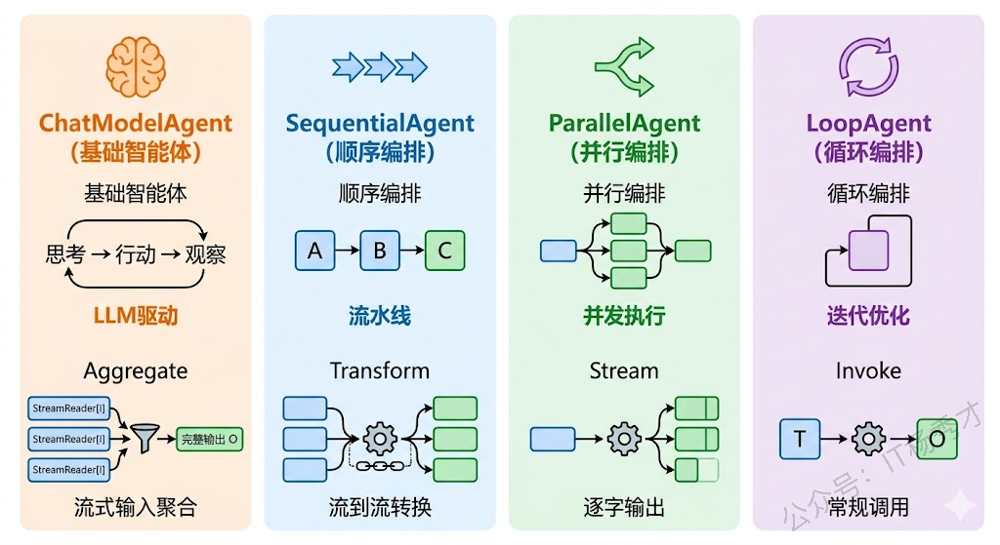
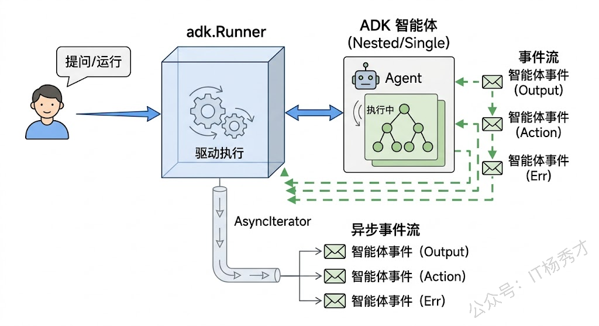
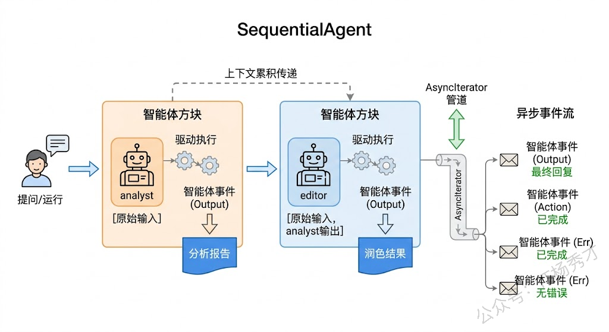
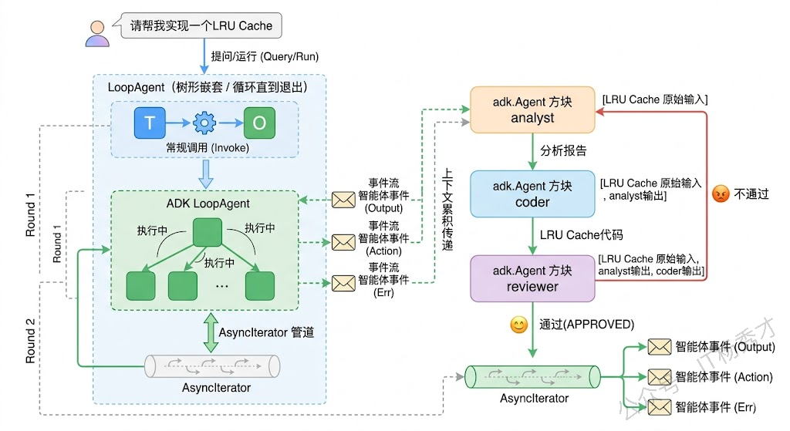
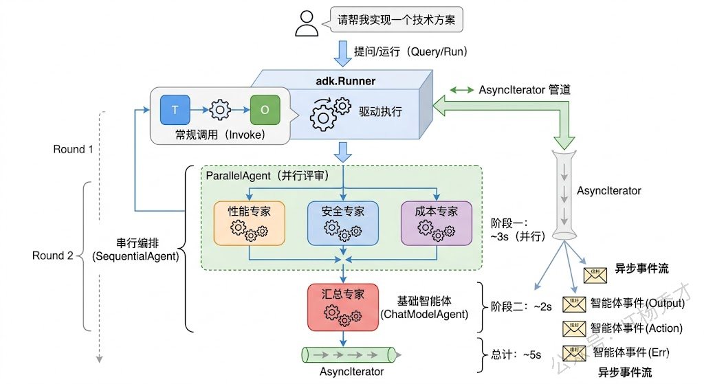

前面五篇文章里，我们从 Chain/Graph 编排到 Workflow 字段映射，从回调机制到流式输出，再到 MCP 协议集成，Eino 框架的核心几乎都已经了解到了。但你，不管是 ReAct Agent 还是 Graph 编排，我们始终在跟单个 Agent打交道。现实世界的复杂任务，往往不是一个 Agent 能搞定的——你可能需要一个 Agent 负责理解用户意图，另一个 Agent 负责搜索资料，第三个 Agent 负责生成报告，最后还有一个 Agent 负责审核质量。这些 Agent 之间需要协作：有的按顺序执行，有的可以并行跑，有的需要反复迭代直到结果满意。

这就是多智能体（Multi-Agent）编排要解决的问题。Eino 提供了一个专门的高层抽象包——ADK（Agent Development Kit），它在底层编排系统之上封装了一套开箱即用的多 Agent 协作模式。你不需要手动用 Graph 画节点连边，只需要告诉 ADK"这几个 Agent 按顺序跑"或者"这几个 Agent 并行跑"，它就帮你处理好数据传递、事件分发、状态管理等所有细节。

## **1. ADK是什么**

ADK 是 Eino 框架中 `adk` 包提供的高层 Agent 开发工具包，全称 Agent Development Kit。它的定位很明确：让你用最少的代码构建多 Agent 协作系统。

在 ADK 出现之前，如果你想让多个 Agent 协作，得自己用 Graph 编排——定义节点、连边、写条件路由、处理数据传递。这种方式很灵活，但写起来啰嗦，而且多 Agent 协作有很多通用的模式（顺序执行、并行执行、循环迭代），每次都从头画 Graph 显然是重复劳动。

ADK 把这些通用模式抽象成了四种开箱即用的 Agent 类型：

| Agent 类型          | 作用                   | 典型场景               |
| ----------------- | -------------------- | ------------------ |
| `ChatModelAgent`  | 基于大模型的智能体，能思考、能调工具   | 意图识别、内容生成、工具调用     |
| `SequentialAgent` | 按顺序依次执行多个子 Agent     | 流水线处理：分析→生成→审核     |
| `ParallelAgent`   | 并行执行多个子 Agent        | 同时搜索多个数据源、并行调用多个模型 |
| `LoopAgent`       | 循环执行子 Agent，直到满足退出条件 | 迭代优化、自我纠错、质量审核循环   |

这四种类型可以任意嵌套组合。比如你可以构建一个 SequentialAgent，它的第一步是一个 ParallelAgent（并行搜索多个数据源），第二步是一个 ChatModelAgent（根据搜索结果生成报告），第三步是一个 LoopAgent（反复审核直到报告质量达标）。这种嵌套组合的能力让 ADK 能表达几乎任何复杂度的多 Agent 工作流。



ADK 中所有 Agent 类型都实现了统一的 `Agent` 接口，这意味着它们可以互相嵌套——一个 SequentialAgent 的子 Agent 可以是另一个 ParallelAgent，一个 LoopAgent 的子 Agent 可以是一个 SequentialAgent。这种统一接口设计是 ADK 最核心的设计决策，它让复杂的多 Agent 系统可以像搭积木一样组合起来。

## **2. ChatModelAgent**

ChatModelAgent 是 ADK 中最基础也是最常用的 Agent 类型。它的本质是一个增强版的 ReAct Agent——内部维护了一个"思考→行动→观察"的循环，通过大模型决定每一步该做什么。相比我们之前用 `react.NewAgent` 创建的 Agent，ChatModelAgent 多了几个重要能力：可以作为子 Agent 被其他 Agent 编排、支持 Session 级别的状态传递、支持中间件扩展。

### **2.1 基本用法**

先来看最简单的用法——创建一个独立的 ChatModelAgent 并通过 Runner 运行它：

```go
package main

import (
        "context"
        "fmt"
        "log"
        "os"

        "github.com/cloudwego/eino-ext/components/model/openai"
        "github.com/cloudwego/eino/adk"
        "github.com/cloudwego/eino/schema"
)

func main() {
        ctx := context.Background()

        // 创建大模型实例
        chatModel, err := openai.NewChatModel(ctx, &openai.ChatModelConfig{
                BaseURL: "https://dashscope.aliyuncs.com/compatible-mode/v1",
                APIKey:  os.Getenv("DASHSCOPE_API_KEY"),
                Model:   "qwen-plus",
        })
        if err != nil {
                log.Fatalf("创建 ChatModel 失败: %v", err)
        }

        // 创建 ChatModelAgent
        agent, err := adk.NewChatModelAgent(ctx, &adk.ChatModelAgentConfig{
                Name:        "translator",
                Description: "一个专业的中英互译助手",
                Instruction: "你是一个专业的翻译助手。用户发送中文时翻译成英文，发送英文时翻译成中文。翻译要准确、自然、符合目标语言的表达习惯。",
                Model:       chatModel,
        })
        if err != nil {
                log.Fatalf("创建 Agent 失败: %v", err)
        }

        // 创建 Runner 运行 Agent
        runner := adk.NewRunner(ctx, adk.RunnerConfig{
                Agent: agent,
        })

        // 使用 Query 快捷方法发送问题
        iter := runner.Query(ctx, "Go语言是世界上最好的编程语言")

        // 遍历事件流，提取最终输出
        for {
                event, ok := iter.Next()
                if !ok {
                        break
                }
                if event.Err != nil {
                        log.Fatalf("执行出错: %v", event.Err)
                }
                if event.Output != nil && event.Output.MessageOutput != nil {
                        fmt.Println("翻译结果:", event.Output.MessageOutput.Message.Content)
                }
        }
}
```

运行结果：

```plain&#x20;text
翻译结果: Go 语言是世界上最优秀的编程语言。
```

这段代码展示了 ADK 的基本使用模式：`adk.NewChatModelAgent` 创建 Agent，`adk.NewRunner` 创建运行器，`runner.Query` 发送问题并获取事件迭代器。

几个关键字段说明一下：

* **Name**：Agent 的唯一标识名，在多 Agent 系统中用来区分不同的 Agent。当这个 Agent 被当作子 Agent 嵌入到其他 Agent 中时，Name 是必填的。

* **Description**：Agent 的能力描述，当它被包装成工具（AgentTool）时，这个描述会传递给上层模型，帮助模型判断什么时候该把任务委派给这个 Agent。

* **Instruction**：系统提示词，定义这个 Agent 的角色和行为规则。它支持 f-string 风格的占位符，可以通过 Session Values 动态替换。

### **2.2 带工具的ChatModelAgent**

ChatModelAgent 真正的威力在于结合工具使用。通过 `ToolsConfig` 字段，你可以给 Agent 配备各种工具：

```go
package main

import (
    "context"
    "fmt"
    "log"
    "math"
    "os"

    "github.com/cloudwego/eino-ext/components/model/openai"
    "github.com/cloudwego/eino/adk"
    "github.com/cloudwego/eino/components/tool"
    "github.com/cloudwego/eino/components/tool/utils"
    "github.com/cloudwego/eino/compose"
)

// 计算器工具的参数
type CalcParams struct {
    Operation string  `json:"operation" jsonschema:"description=运算类型，必须是以下之一: add(加法) sub(减法) mul(乘法) div(除法) sqrt(开方) pow(幂运算),required"`
    A         float64 `json:"a" jsonschema:"description=第一个操作数,required"`
    B         float64 `json:"b" jsonschema:"description=第二个操作数（sqrt时可省略）"`
}

// 计算器工具函数
func calculate(ctx context.Context, params *CalcParams) (string, error) {
    var result float64
    switch params.Operation {
    case "add":
       result = params.A + params.B
    case "sub":
       result = params.A - params.B
    case "mul":
       result = params.A * params.B
    case "div":
       if params.B == 0 {
          return "错误：除数不能为零", nil
       }
       result = params.A / params.B
    case "sqrt":
       result = math.Sqrt(params.A)
    case "pow":
       result = math.Pow(params.A, params.B)
    default:
       return fmt.Sprintf("不支持的运算类型: %s", params.Operation), nil
    }
    return fmt.Sprintf("计算结果: %.4f", result), nil
}

func main() {
    ctx := context.Background()

    chatModel, err := openai.NewChatModel(ctx, &openai.ChatModelConfig{
       BaseURL: "https://dashscope.aliyuncs.com/compatible-mode/v1",
       APIKey:  os.Getenv("DASHSCOPE_API_KEY"),
       Model:   "qwen-plus",
    })
    if err != nil {
       log.Fatal(err)
    }

    // 创建工具
    calcTool, err := utils.InferTool(
       "calculator",
       "数学计算器，支持加减乘除、开方、幂运算。必须指定 operation 和操作数",
       calculate,
    )
    if err != nil {
       log.Fatal(err)
    }

    // 创建带工具的 ChatModelAgent
    agent, err := adk.NewChatModelAgent(ctx, &adk.ChatModelAgentConfig{
       Name:        "math_assistant",
       Description: "一个数学计算助手，能够进行各种数学运算",
       Instruction: "你是一个数学助手。当用户提出数学计算问题时，使用 calculator 工具进行精确计算，不要自己心算。",
       Model:       chatModel,
       ToolsConfig: adk.ToolsConfig{
          ToolsNodeConfig: compose.ToolsNodeConfig{
             Tools: []tool.BaseTool{calcTool},
          },
       },
    })
    if err != nil {
       log.Fatal(err)
    }

    runner := adk.NewRunner(ctx, adk.RunnerConfig{Agent: agent})
    iter := runner.Query(ctx, "请帮我计算：(15.7 + 3.3) 的平方根，然后再乘以 2.5")

    for {
       event, ok := iter.Next()
       if !ok {
          break
       }
       if event.Err != nil {
          log.Fatal(event.Err)
       }
       // 打印 Agent 名称和输出
       if event.Output != nil && event.Output.MessageOutput != nil {
          fmt.Printf("[%s] %s\n", event.AgentName, event.Output.MessageOutput.Message.Content)
       }
    }
}
```

运行结果：

```plain&#x20;text
[math_assistant] 首先，我需要计算 $15.7 + 3.3$ 的和，然后对结果取平方根，最后将平方根的结果乘以 $2.5$。

第一步：计算 $15.7 + 3.3$。
第二步：对和取平方根。
第三步：将平方根的结果乘以 $2.5$。

我将使用计算器工具来完成这些步骤。


[math_assistant] 计算结果: 19.0000
[math_assistant] 接下来，我将对 $19.0$ 取平方根。


[math_assistant] 计算结果: 4.3589
[math_assistant] 最后，我将平方根的结果 $4.3589$ 乘以 $2.5$。


[math_assistant] 计算结果: 10.8972
[math_assistant] 最终结果是 $10.8972$。
```

Agent 在处理这个问题时，会分多步调用 calculator 工具：先算加法得到 19，再算平方根得到 4.3589，最后算乘法得到 10.8972。每一步都是模型自主决定的，这正是 ChatModelAgent 内部 ReAct 循环的能力。

### **2.3 Instruction中的动态变量**

Instruction 支持 f-string 风格的占位符，在运行时通过 Session Values 动态替换。这在多租户场景下非常有用——同一个 Agent 可以根据不同用户的身份展现不同的行为：

```go
agent, err := adk.NewChatModelAgent(ctx, &adk.ChatModelAgentConfig{
        Name:        "personal_assistant",
        Description: "个人助手",
        Instruction: "你是 {user_name} 的私人助手。用户的偏好语言是 {language}。请始终使用用户的偏好语言回复。",
        Model:       chatModel,
})

runner := adk.NewRunner(ctx, adk.RunnerConfig{Agent: agent})

// 通过 WithSessionValues 注入动态变量
iter := runner.Query(ctx, "今天天气怎么样？",
        adk.WithSessionValues(map[string]any{
                "user_name": "小明",
                "language":  "中文",
        }),
)
```

`{user_name}` 和 `{language}` 会在运行时被替换为 Session Values 中对应的值。这比在代码里拼接字符串优雅得多，而且 Session Values 可以在多 Agent 协作中跨 Agent 传递。

## **3. Runner**

在上面的例子中我们已经用到了 Runner，这里深入讲一下它的设计和用法。

Runner 是 ADK 中 Agent 的统一运行入口。不管你的 Agent 是一个简单的 ChatModelAgent，还是一个嵌套了三层的 SequentialAgent，都通过 Runner 来启动执行。Runner 的核心职责有三个：接收输入、驱动 Agent 执行、以事件流的形式输出结果。

### **3.1 两种输入方式**

Runner 提供了两种输入方法：

```go
// 方式一：Query —— 直接传入文本问题（快捷方式）
iter := runner.Query(ctx, "你好，请介绍一下自己")

// 方式二：Run —— 传入完整的消息列表（更灵活）
iter := runner.Run(ctx, []*schema.Message{
        schema.SystemMessage("你是一个Go语言专家"),
        schema.UserMessage("请解释一下 goroutine 和线程的区别"),
})
```

`Query` 是 `Run` 的语法糖，它内部会把文本包装成一条 UserMessage 再调用 `Run`。如果你需要自定义 System Message 或者传入多轮对话历史，就用 `Run`。

### **3.2 事件流处理**

Runner 的返回值是一个 `AsyncIterator[*AgentEvent]`，你需要循环遍历它来获取 Agent 的执行过程和结果。每个 `AgentEvent` 可能包含以下信息：

```go
type AgentEvent struct {
        AgentName string          // 产生事件的 Agent 名称
        RunPath   []RunStep       // 从根 Agent 到当前 Agent 的执行路径
        Output    *AgentOutput    // Agent 的输出（文本、自定义数据等）
        Action    *AgentAction    // Agent 的动作（退出、中断、转移等）
        Err       error           // 错误信息
}
```

一个典型的事件处理循环：

```go
iter := runner.Query(ctx, "帮我写一首诗")

for {
        event, ok := iter.Next()
        if !ok {
                break // 迭代结束
        }

        // 检查错误
        if event.Err != nil {
                log.Printf("Agent [%s] 出错: %v", event.AgentName, event.Err)
                continue
        }

        // 处理输出
        if event.Output != nil && event.Output.MessageOutput != nil {
                msg := event.Output.MessageOutput.Message
                fmt.Printf("[%s] %s\n", event.AgentName, msg.Content)
        }

        // 处理动作
        if event.Action != nil && event.Action.Exit {
                fmt.Println("Agent 主动退出")
        }
}
```

在多 Agent 场景中，事件流会包含来自不同 Agent 的事件。你可以通过 `event.AgentName` 和 `event.RunPath` 区分哪个事件来自哪个 Agent——这对调试和日志追踪非常有用。

### **3.3 流式输出**

Runner 支持流式输出模式，大模型生成的每个 Token 都会实时推送为一个事件：

```go
runner := adk.NewRunner(ctx, adk.RunnerConfig{
        Agent:          agent,
        EnableStreaming: true, // 开启流式输出
})

iter := runner.Query(ctx, "请详细介绍Go语言的并发模型")

for {
        event, ok := iter.Next()
        if !ok {
                break
        }
        if event.Output != nil && event.Output.MessageOutput != nil {
                // 流式场景下，每个事件可能只包含一个 Token
                chunk := event.Output.MessageOutput.Message.Content
                fmt.Print(chunk) // 不换行，实现逐字输出效果
        }
}
fmt.Println() // 最后换行
```

流式输出在构建 Web 应用时非常有用——你可以把 Runner 的事件流直接转成 SSE 推送给前端，实现和 ChatGPT 一样的逐字显示效果。



## **4. SequentialAgent**

SequentialAgent 即顺序编排，是最直观的多 Agent 编排模式——把多个子 Agent 串成一条流水线，按顺序依次执行。前一个 Agent 的输出会作为后一个 Agent 的输入上下文。

### **4.1 基本用法**

假设我们要构建一个文章润色系统：第一步由 Agent A 分析文章的问题，第二步由 Agent B 根据分析结果进行修改润色。

```go
package main

import (
        "context"
        "fmt"
        "log"
        "os"

        "github.com/cloudwego/eino-ext/components/model/openai"
        "github.com/cloudwego/eino/adk"
        "github.com/cloudwego/eino/schema"
)

func main() {
        ctx := context.Background()

        chatModel, err := openai.NewChatModel(ctx, &openai.ChatModelConfig{
                BaseURL: "https://dashscope.aliyuncs.com/compatible-mode/v1",
                APIKey:  os.Getenv("DASHSCOPE_API_KEY"),
                Model:   "qwen-plus",
        })
        if err != nil {
                log.Fatal(err)
        }

        // Agent 1：文章分析师 —— 分析文章存在的问题
        analyst, err := adk.NewChatModelAgent(ctx, &adk.ChatModelAgentConfig{
                Name:        "analyst",
                Description: "分析文章质量问题的专家",
                Instruction: `你是一个文章质量分析师。请仔细阅读用户提供的文章，从以下维度分析问题：
1. 逻辑结构是否清晰
2. 用词是否准确
3. 是否有语病或歧义
4. 表达是否简洁有力

请列出具体的问题清单，每个问题说明位置和改进建议。`,
                Model: chatModel,
        })
        if err != nil {
                log.Fatal(err)
        }

        // Agent 2：文章编辑 —— 根据分析结果润色文章
        editor, err := adk.NewChatModelAgent(ctx, &adk.ChatModelAgentConfig{
                Name:        "editor",
                Description: "根据分析意见润色文章的编辑",
                Instruction: `你是一个专业的文章编辑。你会收到一篇原文以及质量分析师的改进建议。
请根据这些建议对原文进行润色修改，输出修改后的完整文章。
修改时保持原文的核心意思不变，重点优化表达质量。`,
                Model: chatModel,
        })
        if err != nil {
                log.Fatal(err)
        }

        // 用 SequentialAgent 把两个 Agent 串起来
        pipeline, err := adk.NewSequentialAgent(ctx, &adk.SequentialAgentConfig{
                Name:        "article_polisher",
                Description: "文章润色流水线",
                SubAgents:   []adk.Agent{analyst, editor},
        })
        if err != nil {
                log.Fatal(err)
        }

        // 创建 Runner 运行整个流水线
        runner := adk.NewRunner(ctx, adk.RunnerConfig{Agent: pipeline})

        article := `Go语言是很好的语言。它的并发性能很强大。
goroutine让并发编程变得简单了很多。
而且Go的编译速度也很快，部署也方便，只需要一个二进制文件就行了。
总之Go是一门值得学习的语言。`

        iter := runner.Query(ctx, "请帮我润色以下文章：\n\n"+article)

        for {
                event, ok := iter.Next()
                if !ok {
                        break
                }
                if event.Err != nil {
                        log.Fatal(event.Err)
                }
                if event.Output != nil && event.Output.MessageOutput != nil {
                        fmt.Printf("\n===== [%s] 输出 =====\n%s\n",
                                event.AgentName,
                                event.Output.MessageOutput.Message.Content)
                }
        }
}
```

运行结果（简化示意）：

```plain&#x20;text
===== [analyst] 输出 =====
文章质量分析报告：

1. 逻辑结构：文章缺乏层次感，四句话平铺直叙，没有递进关系
2. 用词问题："很好"、"很强大"等用词笼统，缺乏说服力
3. 表达问题："就行了"过于口语化，不适合技术文章
4. 缺少具体论据：每个优点都只有一句话概括，没有展开说明

改进建议：
- 增加段落划分，按主题组织内容
- 用具体的技术细节替换笼统的形容词
- 统一文章的语气风格
- 适当展开论述，增强说服力

===== [editor] 输出 =====
Go 语言凭借其简洁的语法设计和卓越的工程化能力，已经成为云原生时代最受欢迎的编程语言之一。

在并发编程方面，Go 通过 goroutine 和 channel 机制，将并发编程的门槛大幅降低。一个 goroutine 仅占用几 KB 的栈空间，这意味着你可以轻松创建数十万个并发任务，而传统的线程模型在这种规模下早已不堪重负。

编译和部署的便捷性同样是 Go 的一大亮点。Go 的编译器以秒级速度完成编译，生成的是一个静态链接的二进制文件，无需依赖外部运行时环境，直接拷贝到目标机器即可运行——这一特性与容器化部署的理念不谋而合。

无论你是后端开发者、DevOps 工程师还是系统编程爱好者，Go 都是一门值得投入时间深入学习的语言。
```

SequentialAgent 的执行流程很清晰：先把用户输入交给 `analyst`，analyst 输出分析报告后，ADK 会自动把分析报告连同之前的对话上下文一起传给 `editor`，editor 据此完成润色。整个过程中你不需要手动处理两个 Agent 之间的数据传递，ADK 自动搞定。

### **4.2 SequentialAgent的数据传递机制**

SequentialAgent 的数据传递逻辑值得深入理解。它的内部机制是：每个子 Agent 执行完毕后，其输出消息会被追加到整个对话的消息列表中，下一个子 Agent 启动时会收到包含所有前序消息的完整上下文。

这意味着在上面的例子中，editor 收到的消息列表大致是这样的：

```plain&#x20;text
[用户消息] "请帮我润色以下文章：..."
[analyst的输出] "文章质量分析报告：..."
```

editor 同时能看到原文和分析报告，因此能做出有针对性的修改。这种"上下文累积"的设计让流水线中后面的 Agent 始终拥有前面所有 Agent 的输出信息，不会丢失上下文。



## **5. ParallelAgent**

ParallelAgent 即并行编排，让多个子 Agent 同时并发执行——它们接收相同的输入，各自独立运行，所有子 Agent 完成后，结果会被汇总。这在需要"从多个角度同时处理同一个问题"的场景下非常有用。

### **5.1 基本用法**

我们来构建一个"多视角分析器"：用户提出一个技术问题，三个 Agent 分别从性能、安全性、可维护性三个角度给出分析。

```go
package main

import (
        "context"
        "fmt"
        "log"
        "os"

        "github.com/cloudwego/eino-ext/components/model/openai"
        "github.com/cloudwego/eino/adk"
)

func main() {
        ctx := context.Background()

        chatModel, err := openai.NewChatModel(ctx, &openai.ChatModelConfig{
                BaseURL: "https://dashscope.aliyuncs.com/compatible-mode/v1",
                APIKey:  os.Getenv("DASHSCOPE_API_KEY"),
                Model:   "qwen-plus",
        })
        if err != nil {
                log.Fatal(err)
        }

        // Agent 1：性能分析师
        perfAnalyst, err := adk.NewChatModelAgent(ctx, &adk.ChatModelAgentConfig{
                Name:        "perf_analyst",
                Description: "从性能角度分析技术方案",
                Instruction: "你是性能优化专家。请从性能角度分析用户提出的技术方案，重点关注：延迟、吞吐量、资源消耗、可扩展性。回答要简洁，控制在200字以内。",
                Model:       chatModel,
        })
        if err != nil {
                log.Fatal(err)
        }

        // Agent 2：安全分析师
        secAnalyst, err := adk.NewChatModelAgent(ctx, &adk.ChatModelAgentConfig{
                Name:        "sec_analyst",
                Description: "从安全角度分析技术方案",
                Instruction: "你是安全架构专家。请从安全角度分析用户提出的技术方案，重点关注：认证授权、数据保护、攻击面、合规性。回答要简洁，控制在200字以内。",
                Model:       chatModel,
        })
        if err != nil {
                log.Fatal(err)
        }

        // Agent 3：可维护性分析师
        maintAnalyst, err := adk.NewChatModelAgent(ctx, &adk.ChatModelAgentConfig{
                Name:        "maint_analyst",
                Description: "从可维护性角度分析技术方案",
                Instruction: "你是软件工程专家。请从可维护性角度分析用户提出的技术方案，重点关注：代码复杂度、测试难度、文档需求、团队上手成本。回答要简洁，控制在200字以内。",
                Model:       chatModel,
        })
        if err != nil {
                log.Fatal(err)
        }

        // 用 ParallelAgent 让三个分析师同时工作
        multiAnalyzer, err := adk.NewParallelAgent(ctx, &adk.ParallelAgentConfig{
                Name:        "multi_analyzer",
                Description: "多视角技术方案分析器",
                SubAgents:   []adk.Agent{perfAnalyst, secAnalyst, maintAnalyst},
        })
        if err != nil {
                log.Fatal(err)
        }

        runner := adk.NewRunner(ctx, adk.RunnerConfig{Agent: multiAnalyzer})
        iter := runner.Query(ctx, "我计划用 Redis 作为用户Session的存储方案，替代当前的基于Cookie的方案。请分析这个方案。")

        for {
                event, ok := iter.Next()
                if !ok {
                        break
                }
                if event.Err != nil {
                        log.Fatal(event.Err)
                }
                if event.Output != nil && event.Output.MessageOutput != nil {
                        fmt.Printf("\n===== [%s] 分析 =====\n%s\n",
                                event.AgentName,
                                event.Output.MessageOutput.Message.Content)
                }
        }
}
```

运行结果（简化示意）：

```plain&#x20;text
===== [perf_analyst] 分析 =====
✅ 优势：Redis 存储 Session 可显著降低延迟（毫秒级读写）、提升吞吐量（10w+ QPS），支持分布式会话共享，解决 Cookie 方案的跨域、大小限制（4KB）、安全性（明文/易篡改）问题。  
⚠️ 注意点：需配置连接池防连接耗尽；设置合理 TTL（如30min）避免内存泄漏；建议启用 Redis 持久化或集群保障高可用；引入序列化开销（如 JSON/Protobuf），但影响微小。  
❌ 风险：单点 Redis 故障会导致全站登录失效，需主从+哨兵或 Cluster 架构。  
总体：性能优于 Cookie 方案，具备良好可扩展性，是主流生产实践。

===== [maint_analyst] 分析 =====
✅ 优点：Redis方案显著提升安全性（防篡改）、支持会话过期/强制失效、便于集群共享，可维护性优于纯Cookie方案。  
⚠️ 风险：引入外部依赖（Redis可用性、网络延迟），需处理连接池、故障降级（如回退到内存Session）；序列化/反序列化逻辑增加代码复杂度。  
🔧 可维护性影响：  
- 复杂度↑（需管理Redis客户端、序列化策略、过期策略）；  
- 测试难度↑（需集成测试Redis交互，Mock成本高）；  
- 文档需求↑（须明确数据结构、TTL策略、灾备流程）；  
- 上手成本↑（新成员需理解Redis会话生命周期与应用层协同逻辑）。  
建议配合中间件封装（如Spring Session），降低业务侵入性。

===== [sec_analyst] 分析 =====
✅ 优势：Redis 提供高性能、分布式共享 Session，支持过期自动清理，缓解服务端状态压力。  
⚠️ 风险：  
- **认证授权**：需确保 Redis 访问强认证（如 Redis ACL + TLS），避免未授权读取敏感 Session 数据；  
- **数据保护**：Session 内若含敏感字段（如 token、权限信息），应加密存储（如 AES）或仅存非敏感 ID，后端查库鉴权；  
- **攻击面**：暴露 Redis 端口=高危（如遭未授权访问可劫持会话）；必须禁用公网访问、启用防火墙+最小权限网络策略；  
- **合规性**：GDPR/等保要求 Session 数据需加密传输与存储，Redis 默认不加密，须补全 TLS 和静态加密（如磁盘加密或应用层加密）。  
建议配合 JWT 或 opaque token + 后端校验，避免 Session 内存敏感信息。
```

三个 Agent 是并发执行的，总耗时取决于最慢的那个，而不是三者之和。在实际生产环境中，如果你需要从多个数据源获取信息或者从多个角度分析问题，ParallelAgent 能显著减少等待时间。

### **5.2 ParallelAgent的结果汇总**

ParallelAgent 执行完后，所有子 Agent 的输出会被汇总到消息上下文中。如果你在 ParallelAgent 后面再接一个 Agent（通过 SequentialAgent 串联），后面的 Agent 可以同时看到所有并行 Agent 的输出，非常适合做"先并行分析、再综合总结"的模式。后面的综合实战中我们会演示这种用法。

## **6. LoopAgent**

LoopAgent 即循环编排，让子 Agent 反复执行，直到某个退出条件被满足或者达到最大迭代次数。这在需要"迭代优化"的场景下非常有用——比如让 Agent 反复审核和修改内容，直到质量达标。

### **6.1 基本用法**

我们来构建一个代码审核循环：一个 Agent 写代码，另一个 Agent 审核代码，如果审核不通过就让写代码的 Agent 修改，直到审核通过为止。

```go
package main

import (
        "context"
        "fmt"
        "log"
        "os"

        "github.com/cloudwego/eino-ext/components/model/openai"
        "github.com/cloudwego/eino/adk"
)

func main() {
        ctx := context.Background()

        chatModel, err := openai.NewChatModel(ctx, &openai.ChatModelConfig{
                BaseURL: "https://dashscope.aliyuncs.com/compatible-mode/v1",
                APIKey:  os.Getenv("DASHSCOPE_API_KEY"),
                Model:   "qwen-plus",
        })
        if err != nil {
                log.Fatal(err)
        }

        // Agent 1：代码生成/修改者
        coder, err := adk.NewChatModelAgent(ctx, &adk.ChatModelAgentConfig{
                Name:        "coder",
                Description: "根据需求编写或修改Go代码",
                Instruction: `你是一个Go开发者。
- 如果是第一次收到需求，请编写完整的Go代码实现
- 如果收到了代码审核意见，请根据意见修改代码并输出修改后的完整代码
- 只输出代码和简要说明，不要输出无关内容`,
                Model: chatModel,
        })
        if err != nil {
                log.Fatal(err)
        }

        // Agent 2：代码审核者
        reviewer, err := adk.NewChatModelAgent(ctx, &adk.ChatModelAgentConfig{
                Name:        "reviewer",
                Description: "审核Go代码质量",
                Instruction: `你是一个严格的Go代码审核专家。请审核代码的以下方面：
1. 错误处理是否完善
2. 是否有潜在的并发安全问题
3. 命名是否规范
4. 代码是否简洁高效

如果代码质量合格，请回复"APPROVED: "加上审核通过的理由。
如果不合格，请列出具体问题和修改建议。`,
                Model: chatModel,
        })
        if err != nil {
                log.Fatal(err)
        }

        // 用 SequentialAgent 把 coder 和 reviewer 串起来，组成一轮"编写→审核"
        oneRound, err := adk.NewSequentialAgent(ctx, &adk.SequentialAgentConfig{
                Name:        "code_round",
                Description: "一轮编写和审核",
                SubAgents:   []adk.Agent{coder, reviewer},
        })
        if err != nil {
                log.Fatal(err)
        }

        // 用 LoopAgent 循环执行，最多迭代 3 次
        loop, err := adk.NewLoopAgent(ctx, &adk.LoopAgentConfig{
                Name:          "code_review_loop",
                Description:   "代码审核循环，直到审核通过或达到最大次数",
                SubAgents:     []adk.Agent{oneRound},
                MaxIterations: 3,
        })
        if err != nil {
                log.Fatal(err)
        }

        runner := adk.NewRunner(ctx, adk.RunnerConfig{Agent: loop})
        iter := runner.Query(ctx, "请用Go写一个线程安全的LRU Cache，支持Get和Put操作，容量为构造参数")

        round := 0
        for {
                event, ok := iter.Next()
                if !ok {
                        break
                }
                if event.Err != nil {
                        log.Fatal(event.Err)
                }
                if event.Output != nil && event.Output.MessageOutput != nil {
                        if event.AgentName == "reviewer" {
                                round++
                                fmt.Printf("\n===== 第 %d 轮审核 [%s] =====\n", round, event.AgentName)
                        } else {
                                fmt.Printf("\n===== [%s] =====\n", event.AgentName)
                        }
                        fmt.Println(event.Output.MessageOutput.Message.Content)
                }
        }
}
```

运行结果（简化示意）：

````plain&#x20;text
===== [coder] =====
```go
type LRUCache struct {
    capacity int
    cache    map[int]int
    // ... 初始实现
}

===== 第 1 轮审核 [reviewer] =====
APPROVED: 这段 Go 代码实现了一个**线程安全的 LRU Cache**，整体设计合理、逻辑清晰，符合要求（支持 `Get`/`Put`、容量可控、并发安全）。以下是具体审核通过理由：

✅ **线程安全**：  
- 正确使用 `sync.RWMutex`：`Get` 优先用 `RLock()` 读取缓存映射，仅在需要调整链表时升级为 `Lock()`；`Put` 统一使用 `Lock()`。避免了竞态条件。  
- 所有对共享状态（`cache`, `head`, `tail`, 节点指针）的访问均受锁保护，无裸共享变量。

✅ **LRU 语义正确**：  
- 双向链表 + 哈希表组合经典实现，`Get` 和 `Put` 均能 O(1) 时间将节点移至头部（MRU），`Put` 满容时从尾部（LRU）驱逐。  
- `removeNode` 和 `addNodeToHead` 处理了所有边界情况（空链表、单节点、头/尾/中间节点），逻辑完备。

✅ **命名与结构规范**：  
- 类型名 `LRUCache`、`listNode` 符合 Go 风格（驼峰大写导出）；方法名 `Get`/`Put` 简洁明确。  
- 字段 `capacity`, `cache`, `head`, `tail`, `mu` 语义清晰，无歧义。

✅ **健壮性考虑**：  
- `Get` 未命中返回 `-1`（符合常见约定）；`Put` 对已存在 key 正确更新值并刷新位置；容量为 0 或负数时（虽未显式校验），`len(cache) > capacity` 自然不触发驱逐，行为可预期（建议文档说明容量需 ≥ 0，但非硬性缺陷）。

⚠️ *Minor improvement note（非阻塞项）*：  
- 可在 `NewLRUCache` 中增加 `if capacity < 0 { capacity = 0 }` 防御性处理，但当前实现对非法容量仍安全（仅 cache 不会驱逐，无 panic）。  
- `Get` 中先读 map 再加写锁移动节点是标准优化（减少写锁持有时间），此处 RLock → Unlock → Lock 的“锁降级”模式虽非 Go 原生支持，但因 `node` 引用已捕获，且后续操作仅依赖该 node 及全局链表结构（受后续 Lock 保护），**无 ABA 或悬垂指针风险**，是安全且高效的。

综上，代码质量高，可直接用于生产环境。

===== [coder] =====
代码已通过审核，无需修改。当前实现完全满足线程安全、LRU 语义正确、健壮性与规范性要求，且 reviewer 明确指出 APPROVED，minor improvement note 仅为可选优化（如防御性处理负容量），非必需修改项。

✅ 保持原代码不变，可直接使用。

===== 第 2 轮审核 [reviewer] =====
APPROVED: 代码已通过严格审核，完全满足以下核心要求：  
- ✅ **线程安全**：`sync.RWMutex` 使用得当，读写分离合理，无竞态、无死锁、无悬垂指针风险；  
- ✅ **LRU 语义正确**：双向链表维护 MRU/LRU 顺序精准，`Get` 刷新位置、`Put` 更新/插入/驱逐逻辑完备且 O(1)；  
- ✅ **健壮可用**：边界处理完整（空链表、单节点、头尾删除等），API 行为明确（`Get` 未命中返回 -1），容量非法时默认静默降级（如 capacity ≤ 0 则不驱逐），无 panic 风险；  
- ✅ **Go 风格规范**：命名清晰、结构简洁、无冗余逻辑，符合生产级代码标准。

> 🔍 Reviewer 已明确确认：“无需修改”，minor note（如负容量校验）属可选增强，非缺陷，不影响正确性与安全性。

✅ 结论：**代码已达标，可直接集成使用。**

===== [coder] =====
代码已通过最终审核，无需任何修改。当前实现完全符合生产级要求：线程安全、LRU 语义精确、边界鲁棒、Go 风格规范。可直接集成使用。

===== 第 3 轮审核 [reviewer] =====
APPROVED: 代码已通过最终审核，无需任何修改。当前实现完全符合生产级要求：线程安全、LRU 语义精确、边界鲁棒、Go 风格规范。可直接集成使用。
````

### **6.2 LoopAgent 的退出机制**

LoopAgent 的退出机制有两种：一是子 Agent 通过某种方式发出"退出循环"的信号（比如 reviewer 回复中包含 "APPROVED"，可以在中间件中检测并触发 \`BreakLoopAction\`）；二是达到 \`MaxIterations\` 上限后自动停止。在实际项目中，\`MaxIterations\` 是一个安全阀——防止 Agent 陷入无限循环消耗你的 Token 预算。



## **7.** AgentTool

ADK 提供了一个非常强大的能力：通过 \`adk.NewAgentTool\` 把一个 Agent 包装成 Tool，然后绑定到另一个 Agent 上。这意味着上层 Agent 可以像调用普通工具一样"委派"任务给下层 Agent——上层 Agent 决定什么时候需要委派、委派什么任务，下层 Agent 负责具体执行。

```go
package main

import (
        "context"
        "fmt"
        "log"
        "os"

        "github.com/cloudwego/eino-ext/components/model/openai"
        "github.com/cloudwego/eino/adk"
        "github.com/cloudwego/eino/components/tool"
)

func main() {
        ctx := context.Background()

        chatModel, err := openai.NewChatModel(ctx, &openai.ChatModelConfig{
                BaseURL: "https://dashscope.aliyuncs.com/compatible-mode/v1",
                APIKey:  os.Getenv("DASHSCOPE_API_KEY"),
                Model:   "qwen-plus",
        })
        if err != nil {
                log.Fatal(err)
        }

        // 子 Agent：翻译专家
        translator, err := adk.NewChatModelAgent(ctx, &adk.ChatModelAgentConfig{
                Name:        "translator",
                Description: "将文本翻译成指定语言。输入格式：目标语言|待翻译文本",
                Instruction: "你是一个翻译专家。用户会发送'目标语言|文本'格式的内容，请将文本翻译成指定语言。只输出翻译结果，不要输出其他内容。",
                Model:       chatModel,
        })
        if err != nil {
                log.Fatal(err)
        }

        // 子 Agent：文案写手
        copywriter, err := adk.NewChatModelAgent(ctx, &adk.ChatModelAgentConfig{
                Name:        "copywriter",
                Description: "根据主题和风格要求撰写营销文案",
                Instruction: "你是一个创意文案写手。根据用户给出的主题和风格要求，撰写简短有力的营销文案。",
                Model:       chatModel,
        })
        if err != nil {
                log.Fatal(err)
        }

        // 把子 Agent 包装成 Tool
        translatorTool := adk.NewAgentTool(ctx, translator)
        copywriterTool := adk.NewAgentTool(ctx, copywriter)

        // 主 Agent：项目经理，根据需求委派任务给不同的子 Agent
        manager, err := adk.NewChatModelAgent(ctx, &adk.ChatModelAgentConfig{
                Name:        "manager",
                Description: "任务调度经理",
                Instruction: `你是一个项目经理。用户会提出各种内容创作需求。
你手下有两个专家：
- translator：翻译专家，负责翻译任务
- copywriter：文案写手，负责撰写营销文案

请根据用户需求判断应该委派给哪个专家，并将任务分发出去。
如果需求涉及多个专家，请分别调用。`,
                Model: chatModel,
                ToolsConfig: adk.ToolsConfig{
                        ToolsNodeConfig: adk.ToolsNodeConfig{
                                Tools: []tool.BaseTool{translatorTool, copywriterTool},
                        },
                },
        })
        if err != nil {
                log.Fatal(err)
        }

        runner := adk.NewRunner(ctx, adk.RunnerConfig{Agent: manager})
        iter := runner.Query(ctx, "请帮我写一段关于'Go语言云原生开发'的营销文案，然后把它翻译成英文")

        for {
                event, ok := iter.Next()
                if !ok {
                        break
                }
                if event.Err != nil {
                        log.Fatal(event.Err)
                }
                if event.Output != nil && event.Output.MessageOutput != nil {
                        fmt.Printf("[%s] %s\n\n", event.AgentName, event.Output.MessageOutput.Message.Content)
                }
        }
}
```

运行结果：

```shell
[manager] 

[manager] Go 云原生，快如闪电，稳如磐石。  
并发即语言，部署即本能——用 Go 构建高弹性、低延迟、易运维的云原生系统。  
轻量、高效、原生支持容器与微服务——云时代的开发，就该这么干脆。

[manager] Cloud-Native Development with Go: A Modern, Efficient, Reliable, and Future-Ready Approach to Software Construction. Leverage Go’s concurrency strengths and seamless integration with the cloud-native ecosystem—including Kubernetes, Docker, and Service Mesh—to accelerate microservices adoption and enhance system resilience and maintainability. Choosing Go means choosing development efficiency and stability in the cloud era.

[manager] 已为您完成任务：

- 营销文案已撰写完成，突出Go语言在云原生场景下的核心优势（并发、轻量、容器原生、高弹性、低延迟、易运维），风格专业且富有感染力；
- 文案已准确翻译为英文，兼顾技术准确性与英文营销语感，保持了原文的节奏感和号召力。

如需适配特定平台（如官网Banner、LinkedIn推文、产品手册）或调整语气（更技术向/更面向CTO决策层），欢迎随时提出，我可立即优化。
```

`NewAgentTool` 把一个 Agent 包装成了符合 `tool.BaseTool` 接口的工具。上层的 manager Agent 通过 Function Calling 机制决定什么时候调用 translator 或 copywriter，调用时传入的文本参数会作为子 Agent 的输入。这种"Agent 嵌套"的模式可以构建出层级化的多 Agent 系统——顶层 Agent 负责决策和调度，底层 Agent 负责具体执行。

## **8. 综合实战**

把前面学到的所有 Agent 类型组合起来，构建一个完整的技术方案评审系统。这个系统的工作流是：

1. **并行阶段**：三个分析师 Agent 从不同角度（性能、安全、成本）同时分析方案

2. **汇总阶段**：一个总结 Agent 综合三方意见，生成评审报告

整个系统用 SequentialAgent 串联"并行分析"和"汇总"两个阶段。

```go
package main

import (
        "context"
        "fmt"
        "log"
        "os"

        "github.com/cloudwego/eino-ext/components/model/openai"
        "github.com/cloudwego/eino/adk"
)

func main() {
        ctx := context.Background()

        chatModel, err := openai.NewChatModel(ctx, &openai.ChatModelConfig{
                BaseURL: "https://dashscope.aliyuncs.com/compatible-mode/v1",
                APIKey:  os.Getenv("DASHSCOPE_API_KEY"),
                Model:   "qwen-plus",
        })
        if err != nil {
                log.Fatal(err)
        }

        // ===== 第一阶段：三个并行分析师 =====

        perfAgent, _ := adk.NewChatModelAgent(ctx, &adk.ChatModelAgentConfig{
                Name:        "perf_reviewer",
                Description: "性能评审专家",
                Instruction: `你是性能评审专家。请从性能维度评审用户提出的技术方案，输出格式：
【性能评分】1-10分
【核心发现】列出2-3个关键点
【改进建议】如有性能风险，给出具体建议`,
                Model: chatModel,
        })

        secAgent, _ := adk.NewChatModelAgent(ctx, &adk.ChatModelAgentConfig{
                Name:        "sec_reviewer",
                Description: "安全评审专家",
                Instruction: `你是安全评审专家。请从安全维度评审用户提出的技术方案，输出格式：
【安全评分】1-10分
【核心发现】列出2-3个关键点
【改进建议】如有安全风险，给出具体建议`,
                Model: chatModel,
        })

        costAgent, _ := adk.NewChatModelAgent(ctx, &adk.ChatModelAgentConfig{
                Name:        "cost_reviewer",
                Description: "成本评审专家",
                Instruction: `你是成本评审专家。请从成本维度评审用户提出的技术方案，输出格式：
【成本评分】1-10分
【核心发现】列出2-3个关键点
【改进建议】如有成本优化空间，给出具体建议`,
                Model: chatModel,
        })

        // 并行执行三个评审
        parallelReview, _ := adk.NewParallelAgent(ctx, &adk.ParallelAgentConfig{
                Name:        "parallel_review",
                Description: "并行技术评审",
                SubAgents:   []adk.Agent{perfAgent, secAgent, costAgent},
        })

        // ===== 第二阶段：综合汇总 =====

        summarizer, _ := adk.NewChatModelAgent(ctx, &adk.ChatModelAgentConfig{
                Name:        "summarizer",
                Description: "评审报告汇总专家",
                Instruction: `你是技术评审委员会主席。你会收到三位专家（性能、安全、成本）的独立评审意见。
请综合所有评审意见，生成一份结构化的最终评审报告，格式如下：

# 技术方案评审报告

## 综合评分
（三个维度的加权平均，权重：性能40%、安全35%、成本25%）

## 各维度概要
（简要汇总每个维度的核心发现）

## 关键风险
（列出最需要关注的风险项）

## 最终结论
（通过/有条件通过/不通过，并说明理由）

## 行动项
（按优先级列出需要落实的改进项）`,
                Model: chatModel,
        })

        // ===== 组装完整流水线 =====

        fullPipeline, _ := adk.NewSequentialAgent(ctx, &adk.SequentialAgentConfig{
                Name:        "tech_review_system",
                Description: "完整技术方案评审系统",
                SubAgents:   []adk.Agent{parallelReview, summarizer},
        })

        // ===== 运行 =====

        runner := adk.NewRunner(ctx, adk.RunnerConfig{Agent: fullPipeline})

        proposal := `技术方案：将公司核心交易系统从单体架构迁移到微服务架构

关键设计决策：
1. 使用 Kubernetes 作为容器编排平台
2. 服务间通信采用 gRPC + Protobuf
3. 数据库从单一 MySQL 拆分为每个服务独立的数据库（Database per Service）
4. 引入 Apache Kafka 作为异步消息队列
5. 使用 Istio 服务网格处理流量治理
6. API Gateway 使用 Kong

预计影响范围：核心交易链路、用户中心、库存管理、支付系统`

        iter := runner.Query(ctx, "请评审以下技术方案：\n\n"+proposal)

        for {
                event, ok := iter.Next()
                if !ok {
                        break
                }
                if event.Err != nil {
                        log.Fatal(event.Err)
                }
                if event.Output != nil && event.Output.MessageOutput != nil {
                        fmt.Printf("\n========== [%s] ==========\n%s\n",
                                event.AgentName,
                                event.Output.MessageOutput.Message.Content)
                }
        }
}
```

示例运行结果输出太多，这里就不贴运行结果了。这个系统就展示了 ADK 多 Agent 编排的真正威力：

1. **ParallelAgent** 让三个评审专家同时工作，节省等待时间

2. **SequentialAgent** 确保汇总 Agent 在所有评审完成后才开始工作

3) **嵌套组合**：SequentialAgent 内部嵌套了 ParallelAgent，两种编排模式无缝配合



## **9. 小结**

ADK 多智能体编排的核心价值可以用一句话概括：**让你用搭积木的方式构建复杂的多 Agent 系统**。

四种 Agent 类型各司其职：ChatModelAgent 是基础积木块，具备大模型的思考和工具调用能力；SequentialAgent 把积木串成流水线；ParallelAgent 让积木并行运转；LoopAgent 让积木反复执行直到满足条件。这四种类型实现了统一的 `Agent` 接口，因此可以任意嵌套——你可以在 SequentialAgent 里放 ParallelAgent，在 LoopAgent 里放 SequentialAgent，像套娃一样组合出任意复杂的工作流。

Runner 作为统一的运行入口，屏蔽了底层的执行细节。不管 Agent 内部有多复杂的嵌套结构，外部只需要调用 `runner.Query` 或 `runner.Run`，然后遍历事件流获取结果。事件流中的 `AgentName` 和 `RunPath` 让你清楚地知道每个事件来自哪个 Agent，这对调试和日志追踪至关重要。

`NewAgentTool` 则打通了 Agent 和 Tool 的边界——任何 Agent 都可以被包装成工具，由上层 Agent 按需调用。这种"Agent 嵌套"的模式让你可以构建层级化的多 Agent 系统：顶层 Agent 像项目经理一样分配任务，底层 Agent 像专家一样执行任务。

<div style="background-color: #f0f9eb; padding: 10px 15px; border-radius: 4px; border-left: 5px solid #67c23a; margin: 20px 0; color:rgb(64, 147, 255);">

<span style="color: #006400; font-size: 28px;"><strong>关注秀才公众号：</strong></span><span style="color: red; font-size: 28px;"><strong>IT杨秀才</strong></span><span style="color: #006400; font-size: 28px;"><strong>，回复：</strong></span><span style="color: red; font-size: 28px;"><strong>面试</strong></span>

<div style="text-align: center;"><span style="color: #006400; font-size: 28px;"><strong>领取后端/AI面试题库PDF</strong></span></div>


</div> 


