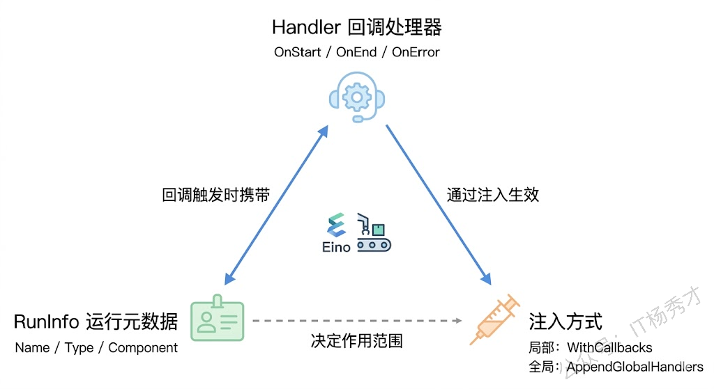
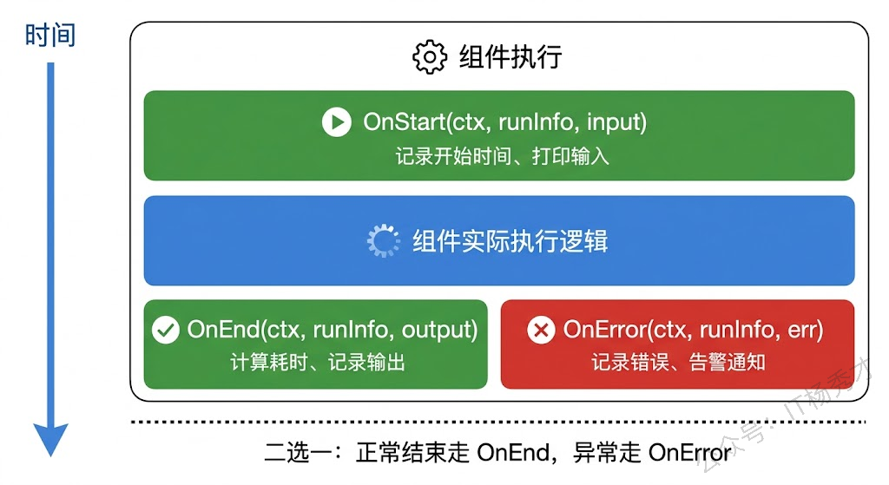
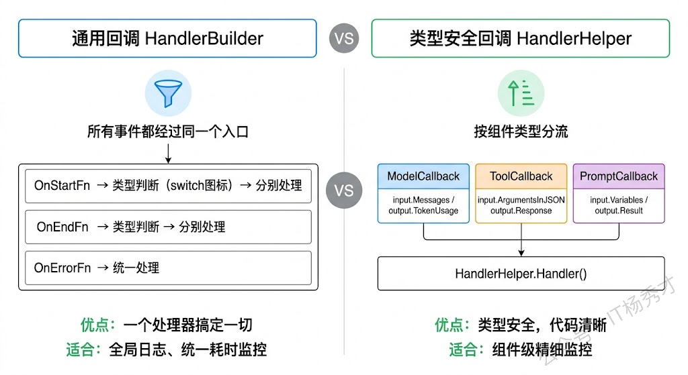
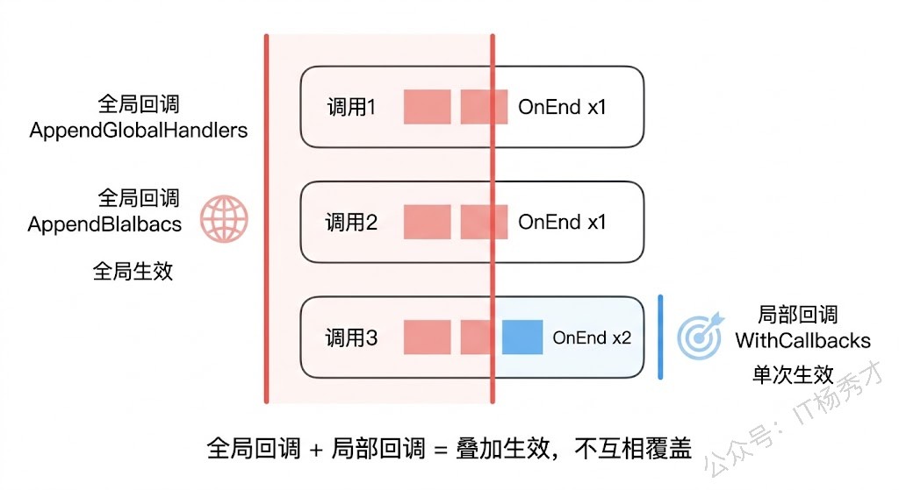
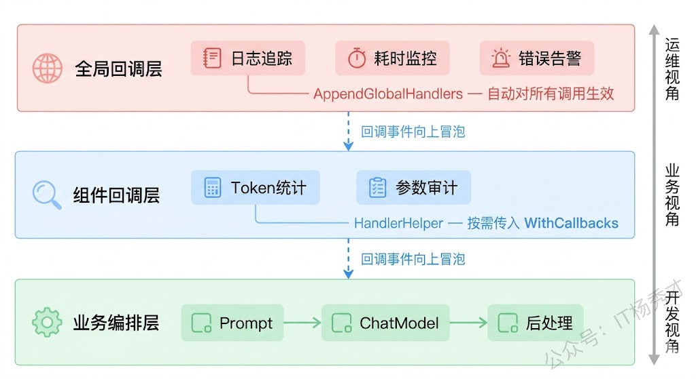

当你使用 Eino 构建一条 Chain 或一张 Graph 并运行时，模型返回结果，一切似乎运行正常。但在实际生产环境中，一旦出现响应变慢、结果异常或不符合预期的问题，排查会变得非常困难：你无法清晰地知道链路中每个节点的执行耗时、输入输出内容，以及 Token 的消耗情况。

这类问题的本质在于缺乏可观测性。在没有完善观测手段的情况下，整个执行链路类似于一个黑盒，只能看到最终结果，却无法定位中间环节的具体行为。

回调（Callback）机制正是 Eino 提供的核心观测能力。它允许开发者在组件执行的关键阶段（开始、结束、异常）插入自定义逻辑，用于记录日志、统计耗时、跟踪 Token 使用情况，或对接外部监控系统。同时，这套机制采用解耦设计，回调逻辑无需侵入业务代码，只需在运行时注入处理器即可生效，从而在不影响现有编排的前提下，提升系统的可观测性与可维护性。

## **1. 回调系统的整体设计**

在动手写代码之前，先搞清楚 Eino 回调系统的几个核心概念和它们之间的关系。

Eino 的回调系统围绕三个核心角色展开：**Handler（回调处理器）**、**RunInfo（运行元数据）** 和 **注入方式（局部 vs 全局）**。Handler 定义了"在什么事件发生时执行什么逻辑"；RunInfo 告诉你"当前是哪个组件在执行"；注入方式决定了"这个 Handler 对谁生效"。



每当编排图中的某个组件开始执行，Eino 会自动调用所有已注册 Handler 的 `OnStart` 方法，并把当前组件的 RunInfo 和输入数据传进来；组件执行结束后调用 `OnEnd`，传入 RunInfo 和输出数据；如果执行过程中出了错，则调用 `OnError`，传入 RunInfo 和错误信息。整个过程对组件本身是透明的——组件不知道也不关心有没有回调在监听它，回调也不会影响组件的正常执行流程。

这种设计的好处是显而易见的：你可以给同一条编排链挂上不同的回调处理器，一个负责打日志，一个负责记耗时，一个负责上报 Token 用量，它们互不干扰，随时可以增减。就像给一台机器装传感器，装多少个、装在哪里，不影响机器本身的运转。

## **2. RunInfo 运行元数据**

在深入 Handler 之前，先认识一下 RunInfo——它是回调系统中信息量最大的那个参数。每次回调被触发时，RunInfo 会告诉你三件事：

```go
type RunInfo struct {
    Name      string               // 组件的语义名称，比如"意图识别模型"
    Type      string               // 组件的具体实现类型，比如"OpenAI"
    Component components.Component // 组件的抽象类型，比如 ChatModel、Tool
}
```

`Name` 是你在编排图中给节点起的名字。还记得在 Chain 和 Graph 中添加节点时可以传 `compose.WithNodeName("xxx")` 吗？那个名字就会出现在这里。如果你没给节点命名，Name 就是空字符串——所以养成给关键节点命名的习惯非常重要，否则排查问题时你只能看到一堆匿名组件的日志，根本分不清谁是谁。

`Type` 是组件底层实现的标识。比如你用的是 Eino 的 OpenAI 兼容模型组件，Type 就是 `"OpenAI"`。这个字段在你同时使用多个不同厂商的模型时特别有用，能帮你快速区分日志来自哪个模型提供商。

`Component` 是一个枚举值，标识组件的抽象类别——是 ChatModel 还是 Tool、ChatTemplate、Retriever 等等。当你写通用回调处理器时，可以根据这个字段做条件判断，只处理特定类型的组件。

## **3. 通用回调处理器**

Eino 提供了两种创建回调处理器的方式。第一种是通用方式，通过 `callbacks.NewHandlerBuilder()` 构建一个能拦截所有组件事件的处理器。这种方式适合做全局性的事情，比如记录每个组件的执行耗时、打印统一格式的日志。

来看一个完整的例子——给一条 Chain 加上耗时监控和日志追踪：

```go
package main

import (
        "context"
        "fmt"
        "log"
        "os"
        "time"

        "github.com/cloudwego/eino-ext/components/model/openai"
        "github.com/cloudwego/eino/callbacks"
        "github.com/cloudwego/eino/compose"
        "github.com/cloudwego/eino/schema"
)

func main() {
        ctx := context.Background()

        // 创建模型
        model, err := openai.NewChatModel(ctx, &openai.ChatModelConfig{
                BaseURL: "https://dashscope.aliyuncs.com/compatible-mode/v1",
                APIKey:  os.Getenv("DASHSCOPE_API_KEY"),
                Model:   "qwen-plus",
        })
        if err != nil {
                log.Fatal(err)
        }

        // 构建一条简单的 Chain：Lambda预处理 → 模型调用
        chain := compose.NewChain[string, *schema.Message]()
        chain.AppendLambda(compose.InvokableLambda(func(ctx context.Context, input string) ([]*schema.Message, error) {
                return []*schema.Message{
                        schema.SystemMessage("你是一个专业的技术助手，回答简洁明了。"),
                        schema.UserMessage(input),
                }, nil
        }), compose.WithNodeName("消息构建"))
        chain.AppendChatModel(model, compose.WithNodeName("通义千问"))

        // 构建通用回调处理器
        handler := callbacks.NewHandlerBuilder().
                OnStartFn(func(ctx context.Context, info *callbacks.RunInfo, input callbacks.CallbackInput) context.Context {
                        log.Printf("[开始] 组件=%s 名称=%s 类型=%s", info.Component, info.Name, info.Type)
                        // 把开始时间存到 context 中，供 OnEnd 计算耗时
                        return context.WithValue(ctx, "start_time_"+info.Name, time.Now())
                }).
                OnEndFn(func(ctx context.Context, info *callbacks.RunInfo, output callbacks.CallbackOutput) context.Context {
                        if start, ok := ctx.Value("start_time_" + info.Name).(time.Time); ok {
                                log.Printf("[结束] 组件=%s 名称=%s 耗时=%v", info.Component, info.Name, time.Since(start))
                        }
                        return ctx
                }).
                OnErrorFn(func(ctx context.Context, info *callbacks.RunInfo, err error) context.Context {
                        log.Printf("[错误] 组件=%s 名称=%s 错误=%v", info.Component, info.Name, err)
                        return ctx
                }).
                Build()

        // 编译并运行，通过 WithCallbacks 注入回调
        runnable, err := chain.Compile(ctx)
        if err != nil {
                log.Fatal(err)
        }

        result, err := runnable.Invoke(ctx, "Go语言的channel有什么用？",
                compose.WithCallbacks(handler))
        if err != nil {
                log.Fatal(err)
        }

        fmt.Println("\n模型回复:", result.Content)
}
```

运行结果：

```plain&#x20;text
2025/01/15 14:30:01 [开始] 组件=Lambda 名称=消息构建 类型=Lambda
2025/01/15 14:30:01 [结束] 组件=Lambda 名称=消息构建 耗时=15.208µs
2025/01/15 14:30:01 [开始] 组件=ChatModel 名称=通义千问 类型=OpenAI
2025/01/15 14:30:03 [结束] 组件=ChatModel 名称=通义千问 耗时=1.823s

模型回复: Go语言的channel是goroutine之间通信的管道，用于安全地在并发协程间传递数据...
```

这段代码的核心在 `callbacks.NewHandlerBuilder()` 这个构建器。它采用 Builder 模式，你可以链式调用 `OnStartFn`、`OnEndFn`、`OnErrorFn` 来注册对应事件的处理函数，最后调用 `Build()` 生成一个 Handler 实例。三个回调函数的签名是一致的模式：接收 `context.Context`、`*callbacks.RunInfo` 和事件数据，返回一个可能被修改过的 `context.Context`。



注意这里有一个很实用的技巧：我们利用 `context.WithValue` 在 `OnStart` 中存入开始时间，然后在 `OnEnd` 中取出来计算耗时。这是因为 Eino 的回调机制保证了同一个组件的 `OnStart` 和 `OnEnd`（或 `OnError`）会收到同一条 context 链，所以你可以在 `OnStart` 中往 context 里塞东西，`OnEnd` 里拿出来用。不过要注意 context 的 key 要避免冲突，上面例子里用组件名称做了区分。

另外一点值得注意：`OnStartFn`、`OnEndFn`、`OnErrorFn` 接收的 `input`/`output` 参数类型是 `callbacks.CallbackInput` 和 `callbacks.CallbackOutput`——它们是接口类型，实际传入的是各组件自己定义的回调数据结构。如果你需要拿到具体的字段（比如 ChatModel 回调中的 Token 用量），就需要做类型断言或者使用下一节介绍的类型安全回调。

## **4. 类型安全的组件回调**

通用回调处理器虽然方便，但有个小烦恼：`OnStartFn` 和 `OnEndFn` 接收的参数类型是通用的接口，要拿到具体组件的详细信息（比如 ChatModel 的 Token 用量、Tool 的调用参数），你得自己做类型断言。当编排图中组件种类多了之后，一堆 `switch` 或 `if` 判断看着就头疼。

Eino 提供了另一种方式来解决这个问题：`utils/callbacks` 包下的 `HandlerHelper`。它为每种组件类型提供了专门的回调结构体，参数都是强类型的，写起来清爽很多。

```go
package main

import (
        "context"
        "fmt"
        "log"
        "os"

        "github.com/cloudwego/eino-ext/components/model/openai"
        "github.com/cloudwego/eino/callbacks"
        "github.com/cloudwego/eino/components/model"
        "github.com/cloudwego/eino/components/tool"
        "github.com/cloudwego/eino/compose"
        "github.com/cloudwego/eino/schema"
        callbacksHelper "github.com/cloudwego/eino/utils/callbacks"
)

func main() {
        ctx := context.Background()

        chatModel, err := openai.NewChatModel(ctx, &openai.ChatModelConfig{
                BaseURL: "https://dashscope.aliyuncs.com/compatible-mode/v1",
                APIKey:  os.Getenv("DASHSCOPE_API_KEY"),
                Model:   "qwen-plus",
        })
        if err != nil {
                log.Fatal(err)
        }

        // 定义 ChatModel 专用的回调处理器
        modelHandler := &callbacksHelper.ModelCallbackHandler{
                OnStart: func(ctx context.Context, info *callbacks.RunInfo, input *model.CallbackInput) context.Context {
                        fmt.Printf("[模型开始] 名称=%s, 输入消息数=%d\n", info.Name, len(input.Messages))
                        // 打印最后一条用户消息
                        for i := len(input.Messages) - 1; i >= 0; i-- {
                                if input.Messages[i].Role == schema.User {
                                        fmt.Printf("[模型开始] 用户输入: %s\n", input.Messages[i].Content)
                                        break
                                }
                        }
                        return ctx
                },
                OnEnd: func(ctx context.Context, info *callbacks.RunInfo, output *model.CallbackOutput) context.Context {
                        fmt.Printf("[模型结束] 名称=%s\n", info.Name)
                        if output.TokenUsage != nil {
                                fmt.Printf("[模型结束] Token用量: 输入=%d, 输出=%d, 总计=%d\n",
                                        output.TokenUsage.PromptTokens,
                                        output.TokenUsage.CompletionTokens,
                                        output.TokenUsage.TotalTokens)
                        }
                        return ctx
                },
                OnError: func(ctx context.Context, info *callbacks.RunInfo, err error) context.Context {
                        fmt.Printf("[模型错误] 名称=%s, 错误=%v\n", info.Name, err)
                        return ctx
                },
        }

        // 定义 Tool 专用的回调处理器
        toolHandler := &callbacksHelper.ToolCallbackHandler{
                OnStart: func(ctx context.Context, info *callbacks.RunInfo, input *tool.CallbackInput) context.Context {
                        fmt.Printf("[工具开始] 名称=%s, 参数=%s\n", info.Name, input.ArgumentsInJSON)
                        return ctx
                },
                OnEnd: func(ctx context.Context, info *callbacks.RunInfo, output *tool.CallbackOutput) context.Context {
                        fmt.Printf("[工具结束] 名称=%s, 结果=%s\n", info.Name, output.Response)
                        return ctx
                },
        }

        // 用 HandlerHelper 组合多个组件回调
        handler := callbacksHelper.NewHandlerHelper().
                ChatModel(modelHandler).
                Tool(toolHandler).
                Handler()

        // 构建 Chain
        chain := compose.NewChain[string, *schema.Message]()
        chain.AppendLambda(compose.InvokableLambda(func(ctx context.Context, input string) ([]*schema.Message, error) {
                return []*schema.Message{
                        schema.SystemMessage("你是一个专业的Go语言助手。"),
                        schema.UserMessage(input),
                }, nil
        }), compose.WithNodeName("消息构建"))
        chain.AppendChatModel(chatModel, compose.WithNodeName("通义千问"))

        runnable, err := chain.Compile(ctx)
        if err != nil {
                log.Fatal(err)
        }

        result, err := runnable.Invoke(ctx, "简单介绍下Go的goroutine",
                compose.WithCallbacks(handler))
        if err != nil {
                log.Fatal(err)
        }

        fmt.Println("\n回复:", result.Content)
}
```

运行结果：

```plain&#x20;text
[模型开始] 名称=通义千问, 输入消息数=2
[模型开始] 用户输入: 简单介绍下Go的goroutine
[模型结束] 名称=通义千问
[模型结束] Token用量: 输入=25, 输出=186, 总计=211

回复: Goroutine是Go语言中的轻量级线程，由Go运行时管理...
```

`HandlerHelper` 的使用方式很直观：先创建各组件类型对应的回调处理器（`ModelCallbackHandler`、`ToolCallbackHandler` 等），然后通过 `NewHandlerHelper()` 把它们组合起来，最后调用 `Handler()` 生成一个标准的 Handler 实例。



对比一下两种方式的适用场景。通用回调适合做"无差别"的全局监控——比如所有组件都打日志、都记耗时，不需要区分具体组件类型。类型安全回调适合做组件级的精细监控——比如你只关心 ChatModel 的 Token 用量、只关心 Tool 的调用参数，不同组件的监控逻辑差异很大。实际项目中，这两种方式经常组合使用：一个通用回调做全局日志，再加几个类型安全回调做特定组件的深度监控。

## **5. 全局回调与局部回调**

前面的例子里，回调都是在调用 `Invoke` 或 `Stream` 时通过 `compose.WithCallbacks(handler)` 传入的。这种方式叫**局部回调**——只对这一次调用生效，下次调用如果不传，就没有回调了。

有时候你希望某些回调对所有的编排运行都生效，不需要每次都手动传。比如全局的错误告警、全局的日志追踪，每次调用都要传一遍太麻烦了。Eino 提供了 `callbacks.AppendGlobalHandlers` 来注册全局回调：

```go
package main

import (
        "context"
        "fmt"
        "log"
        "os"

        "github.com/cloudwego/eino-ext/components/model/openai"
        "github.com/cloudwego/eino/callbacks"
        "github.com/cloudwego/eino/compose"
        "github.com/cloudwego/eino/schema"
)

func main() {
        ctx := context.Background()

        // 注册全局回调——对所有编排运行自动生效
        globalHandler := callbacks.NewHandlerBuilder().
                OnStartFn(func(ctx context.Context, info *callbacks.RunInfo, input callbacks.CallbackInput) context.Context {
                        log.Printf("[全局] 组件启动: %s(%s)", info.Name, info.Component)
                        return ctx
                }).
                OnEndFn(func(ctx context.Context, info *callbacks.RunInfo, output callbacks.CallbackOutput) context.Context {
                        log.Printf("[全局] 组件完成: %s(%s)", info.Name, info.Component)
                        return ctx
                }).
                OnErrorFn(func(ctx context.Context, info *callbacks.RunInfo, err error) context.Context {
                        log.Printf("[全局告警] 组件异常: %s(%s), 错误: %v", info.Name, info.Component, err)
                        return ctx
                }).
                Build()
        callbacks.AppendGlobalHandlers(globalHandler)

        // 创建模型和编排
        chatModel, err := openai.NewChatModel(ctx, &openai.ChatModelConfig{
                BaseURL: "https://dashscope.aliyuncs.com/compatible-mode/v1",
                APIKey:  os.Getenv("DASHSCOPE_API_KEY"),
                Model:   "qwen-plus",
        })
        if err != nil {
                log.Fatal(err)
        }

        chain := compose.NewChain[string, *schema.Message]()
        chain.AppendLambda(compose.InvokableLambda(func(ctx context.Context, input string) ([]*schema.Message, error) {
                return []*schema.Message{
                        schema.SystemMessage("你是一个Go语言助手。"),
                        schema.UserMessage(input),
                }, nil
        }), compose.WithNodeName("消息构建"))
        chain.AppendChatModel(chatModel, compose.WithNodeName("通义千问"))

        runnable, err := chain.Compile(ctx)
        if err != nil {
                log.Fatal(err)
        }

        // 第一次调用——全局回调自动生效，不需要传 WithCallbacks
        fmt.Println("=== 第一次调用 ===")
        result1, err := runnable.Invoke(ctx, "什么是interface？")
        if err != nil {
                log.Fatal(err)
        }
        fmt.Println("回复:", result1.Content[:50], "...")

        // 第二次调用——全局回调依然生效
        fmt.Println("\n=== 第二次调用 ===")
        result2, err := runnable.Invoke(ctx, "什么是defer？")
        if err != nil {
                log.Fatal(err)
        }
        fmt.Println("回复:", result2.Content[:50], "...")

        // 第三次调用——同时使用全局回调 + 局部回调
        localHandler := callbacks.NewHandlerBuilder().
                OnEndFn(func(ctx context.Context, info *callbacks.RunInfo, output callbacks.CallbackOutput) context.Context {
                        log.Printf("[局部] 额外的结束处理: %s", info.Name)
                        return ctx
                }).
                Build()

        fmt.Println("\n=== 第三次调用（全局+局部） ===")
        result3, err := runnable.Invoke(ctx, "什么是select？",
                compose.WithCallbacks(localHandler))
        if err != nil {
                log.Fatal(err)
        }
        fmt.Println("回复:", result3.Content[:50], "...")
}
```

运行结果：

```plain&#x20;text
=== 第一次调用 ===
2026/04/20 12:18:24 [全局] 组件启动: (Chain)
2026/04/20 12:18:24 [全局] 组件启动: 消息构建(Lambda)
2026/04/20 12:18:24 [全局] 组件完成: 消息构建(Lambda)
2026/04/20 12:18:24 [全局] 组件启动: 通义千问(ChatModel)
回复: 在 Go 语言中，**`interface`（接口）** 是 ...

=== 第二次调用 ===
2026/04/20 12:18:46 [全局] 组件完成: 通义千问(ChatModel)
2026/04/20 12:18:46 [全局] 组件完成: (Chain)
2026/04/20 12:18:46 [全局] 组件启动: (Chain)
2026/04/20 12:18:46 [全局] 组件启动: 消息构建(Lambda)
2026/04/20 12:18:46 [全局] 组件完成: 消息构建(Lambda)
2026/04/20 12:18:46 [全局] 组件启动: 通义千问(ChatModel)
回复: 在 Go 语言中，`defer` 是一个**延迟执行 ...

=== 第三次调用（全局+局部） ===
2026/04/20 12:19:07 [全局] 组件完成: 通义千问(ChatModel)
2026/04/20 12:19:07 [全局] 组件完成: (Chain)
2026/04/20 12:19:07 [全局] 组件启动: (Chain)
2026/04/20 12:19:07 [全局] 组件启动: 消息构建(Lambda)
2026/04/20 12:19:07 [局部] 额外的结束处理: 消息构建
2026/04/20 12:19:07 [全局] 组件完成: 消息构建(Lambda)
2026/04/20 12:19:07 [全局] 组件启动: 通义千问(ChatModel)
2026/04/20 12:19:30 [局部] 额外的结束处理: 通义千问
2026/04/20 12:19:30 [全局] 组件完成: 通义千问(ChatModel)
2026/04/20 12:19:30 [局部] 额外的结束处理: 
2026/04/20 12:19:30 [全局] 组件完成: (Chain)
回复: 在 Go 语言中，`select` 是一个**控制结构 ...
```

从第三次调用的输出可以清楚地看到：全局回调和局部回调同时生效了，每个组件的 `OnEnd` 被触发了两次——先是全局回调的，再是局部回调的。Eino 会先执行全局回调，再执行局部回调，两者叠加而不是互相覆盖。



关于全局回调有两个需要注意的地方。第一，`AppendGlobalHandlers` 是追加式的，调用多次会注册多个全局处理器，它们都会生效。第二，全局回调一旦注册就没有官方提供的"注销"方法，所以它更适合在程序启动时做一次性的初始化，而不是在运行时频繁增减。

## **6. 实战：构建一个完整的可观测性方案**

前面分别介绍了通用回调、类型安全回调、全局和局部回调，现在把它们组合起来，构建一个接近生产环境的可观测性方案。这个方案会做三件事：全局日志追踪（每个组件的开始/结束/耗时）、ChatModel 的 Token 用量统计、错误告警。

```go
package main

import (
    "context"
    "fmt"
    "log"
    "os"
    "sync"
    "time"

    "github.com/cloudwego/eino-ext/components/model/openai"
    "github.com/cloudwego/eino/callbacks"
    "github.com/cloudwego/eino/components/model"
    "github.com/cloudwego/eino/compose"
    "github.com/cloudwego/eino/schema"
    callbacksHelper "github.com/cloudwego/eino/utils/callbacks"
)

// TokenTracker 统计 Token 用量
type TokenTracker struct {
    mu              sync.Mutex
    totalPrompt     int
    totalCompletion int
    totalTokens     int
    callCount       int
}

func (t *TokenTracker) Record(usage *model.TokenUsage) {
    if usage == nil {
       return
    }
    t.mu.Lock()
    defer t.mu.Unlock()
    t.totalPrompt += usage.PromptTokens
    t.totalCompletion += usage.CompletionTokens
    t.totalTokens += usage.TotalTokens
    t.callCount++
}

func (t *TokenTracker) Report() {
    t.mu.Lock()
    defer t.mu.Unlock()
    fmt.Printf("\n===== Token 用量统计 =====\n")
    fmt.Printf("调用次数: %d\n", t.callCount)
    fmt.Printf("输入Token总计: %d\n", t.totalPrompt)
    fmt.Printf("输出Token总计: %d\n", t.totalCompletion)
    fmt.Printf("Token总计: %d\n", t.totalTokens)
    fmt.Printf("==========================\n")
}

func main() {
    ctx := context.Background()
    tracker := &TokenTracker{}

    // ===== 第一层：全局通用回调（日志+耗时+错误告警）=====
    globalHandler := callbacks.NewHandlerBuilder().
       OnStartFn(func(ctx context.Context, info *callbacks.RunInfo, input callbacks.CallbackInput) context.Context {
          log.Printf("[TRACE] ▶ %s(%s) 开始执行", info.Name, info.Component)
          return context.WithValue(ctx, "trace_start_"+info.Name, time.Now())
       }).
       OnEndFn(func(ctx context.Context, info *callbacks.RunInfo, output callbacks.CallbackOutput) context.Context {
          if start, ok := ctx.Value("trace_start_" + info.Name).(time.Time); ok {
             duration := time.Since(start)
             log.Printf("[TRACE] ◀ %s(%s) 执行完成, 耗时: %v", info.Name, info.Component, duration)
             // 如果某个组件耗时超过 5 秒，输出警告
             if duration > 5*time.Second {
                log.Printf("[WARN] ⚠ %s 执行耗时过长: %v", info.Name, duration)
             }
          }
          return ctx
       }).
       OnErrorFn(func(ctx context.Context, info *callbacks.RunInfo, err error) context.Context {
          log.Printf("[ERROR] ✘ %s(%s) 执行失败: %v", info.Name, info.Component, err)
          // 这里可以接入告警系统，比如发送钉钉/飞书通知
          return ctx
       }).
       Build()
    callbacks.AppendGlobalHandlers(globalHandler)

    // ===== 第二层：类型安全的 ChatModel 回调（Token追踪）=====
    modelHandler := &callbacksHelper.ModelCallbackHandler{
       OnEnd: func(ctx context.Context, info *callbacks.RunInfo, output *model.CallbackOutput) context.Context {
          tracker.Record(output.TokenUsage)
          if output.TokenUsage != nil {
             log.Printf("[TOKEN] %s: 输入=%d, 输出=%d",
                info.Name,
                output.TokenUsage.PromptTokens,
                output.TokenUsage.CompletionTokens)
          }
          return ctx
       },
    }

    tokenHandler := callbacksHelper.NewHandlerHelper().
       ChatModel(modelHandler).
       Handler()

    // 创建模型
    chatModel, err := openai.NewChatModel(ctx, &openai.ChatModelConfig{
       BaseURL: "https://dashscope.aliyuncs.com/compatible-mode/v1",
       APIKey:  os.Getenv("DASHSCOPE_API_KEY"),
       Model:   "qwen-plus",
    })
    if err != nil {
       log.Fatal(err)
    }

    // 构建编排
    chain := compose.NewChain[string, *schema.Message]()
    chain.AppendLambda(compose.InvokableLambda(func(ctx context.Context, input string) ([]*schema.Message, error) {
       return []*schema.Message{
          schema.SystemMessage("你是一个Go语言专家，回答简洁。"),
          schema.UserMessage(input),
       }, nil
    }), compose.WithNodeName("消息构建"))
    chain.AppendChatModel(chatModel, compose.WithNodeName("通义千问"))

    runnable, err := chain.Compile(ctx)
    if err != nil {
       log.Fatal(err)
    }

    // 模拟多次调用
    questions := []string{
       "Go的slice和array有什么区别？",
       "解释一下Go的GMP调度模型",
       "什么是context.Context？",
    }

    for i, q := range questions {
       fmt.Printf("\n--- 第 %d 次调用 ---\n", i+1)
       result, err := runnable.Invoke(ctx, q,
          compose.WithCallbacks(tokenHandler)) // Token回调作为局部回调传入
       if err != nil {
          log.Printf("调用失败: %v", err)
          continue
       }
       // 只打印前80个字符
       content := result.Content
       if len(content) > 80 {
          content = content[:80] + "..."
       }
       fmt.Printf("回复: %s\n", content)
    }

    // 最后输出 Token 用量统计
    tracker.Report()
}
```

运行结果：

```plain&#x20;text
--- 第 1 次调用 ---
2026/04/20 12:35:33 [TRACE] ▶ (Chain) 开始执行
2026/04/20 12:35:33 [TRACE] ▶ 消息构建(Lambda) 开始执行
2026/04/20 12:35:33 [TRACE] ◀ 消息构建(Lambda) 执行完成, 耗时: 17.583µs
2026/04/20 12:35:33 [TRACE] ▶ 通义千问(ChatModel) 开始执行
2026/04/20 12:35:39 [TOKEN] 通义千问: 输入=30, 输出=176
2026/04/20 12:35:39 [TRACE] ◀ 通义千问(ChatModel) 执行完成, 耗时: 5.20225925s
2026/04/20 12:35:39 [WARN] ⚠ 通义千问 执行耗时过长: 5.20225925s
2026/04/20 12:35:39 [TRACE] ◀ (Chain) 执行完成, 耗时: 5.202363375s
2026/04/20 12:35:39 [WARN] ⚠  执行耗时过长: 5.202363375s
2026/04/20 12:35:39 [TRACE] ▶ (Chain) 开始执行
2026/04/20 12:35:39 [TRACE] ▶ 消息构建(Lambda) 开始执行
2026/04/20 12:35:39 [TRACE] ◀ 消息构建(Lambda) 执行完成, 耗时: 5.25µs
2026/04/20 12:35:39 [TRACE] ▶ 通义千问(ChatModel) 开始执行
回复: - **Array（数组）**：固定长度，值类型，赋值/传参时复制整型...

--- 第 2 次调用 ---
2026/04/20 12:35:57 [TOKEN] 通义千问: 输入=30, 输出=772
2026/04/20 12:35:57 [TRACE] ◀ 通义千问(ChatModel) 执行完成, 耗时: 18.252682834s
2026/04/20 12:35:57 [WARN] ⚠ 通义千问 执行耗时过长: 18.252682834s
2026/04/20 12:35:57 [TRACE] ◀ (Chain) 执行完成, 耗时: 18.2528015s
2026/04/20 12:35:57 [WARN] ⚠  执行耗时过长: 18.2528015s
2026/04/20 12:35:57 [TRACE] ▶ (Chain) 开始执行
2026/04/20 12:35:57 [TRACE] ▶ 消息构建(Lambda) 开始执行
2026/04/20 12:35:57 [TRACE] ◀ 消息构建(Lambda) 执行完成, 耗时: 5.792µs
2026/04/20 12:35:57 [TRACE] ▶ 通义千问(ChatModel) 开始执行
回复: Go 的 GMP 调度模型是其运行时（runtime）实现协程（goroutine）...

--- 第 3 次调用 ---
2026/04/20 12:36:05 [TOKEN] 通义千问: 输入=26, 输出=320
2026/04/20 12:36:05 [TRACE] ◀ 通义千问(ChatModel) 执行完成, 耗时: 8.260937s
2026/04/20 12:36:05 [WARN] ⚠ 通义千问 执行耗时过长: 8.260937s
2026/04/20 12:36:05 [TRACE] ◀ (Chain) 执行完成, 耗时: 8.261080084s
2026/04/20 12:36:05 [WARN] ⚠  执行耗时过长: 8.261080084s
回复: `context.Context` 是 Go 标准库中用于**传递请求范围的截止时间...

===== Token 用量统计 =====
调用次数: 3
输入Token总计: 86
输出Token总计: 1268
Token总计: 1354
==========================
```

这个例子把前面学到的东西全用上了：全局回调负责日志追踪和耗时监控，对所有编排运行自动生效；类型安全的 ChatModel 回调作为局部回调传入，专门追踪 Token 用量；`TokenTracker` 通过互斥锁保证并发安全，可以在多次调用之间累积统计。



值得一提的是，这种分层的回调设计在真实项目中非常常见。运维团队关心的全局日志和告警放在全局回调层，一次注册永久生效；业务团队关心的 Token 成本、调用参数放在组件回调层，按需注入；开发团队写的编排逻辑在最底层，完全不需要关心上面两层在做什么。三层各司其职，互不干扰。

## **7. 独立组件的回调注入**

前面的例子都是在编排图（Chain/Graph）的上下文中使用回调。编排图会自动管理回调的传播——你只需要在 `Invoke` 时传入 Handler，图中每个节点的回调都会被自动触发。但有时候你可能不用编排图，而是直接调用某个组件（比如单独调一下 ChatModel），这时回调怎么注入呢？

Eino 提供了 `callbacks.InitCallbacks` 来手动初始化回调上下文：

```go
package main

import (
    "context"
    "fmt"
    "log"
    "os"

    "github.com/cloudwego/eino-ext/components/model/openai"
    "github.com/cloudwego/eino/callbacks"
    "github.com/cloudwego/eino/components"
    "github.com/cloudwego/eino/schema"
)

func main() {
    ctx := context.Background()

    chatModel, err := openai.NewChatModel(ctx, &openai.ChatModelConfig{
       BaseURL: "https://dashscope.aliyuncs.com/compatible-mode/v1",
       APIKey:  os.Getenv("DASHSCOPE_API_KEY"),
       Model:   "qwen-plus",
    })
    if err != nil {
       log.Fatal(err)
    }

    // 构建回调处理器
    handler := callbacks.NewHandlerBuilder().
       OnStartFn(func(ctx context.Context, info *callbacks.RunInfo, input callbacks.CallbackInput) context.Context {
          log.Printf("[独立调用] 组件启动: %s(%s)", info.Name, info.Component)
          return ctx
       }).
       OnEndFn(func(ctx context.Context, info *callbacks.RunInfo, output callbacks.CallbackOutput) context.Context {
          log.Printf("[独立调用] 组件完成: %s(%s)", info.Name, info.Component)
          return ctx
       }).
       Build()

    // 手动初始化回调上下文
    ctxWithCallbacks := callbacks.InitCallbacks(ctx,
       &callbacks.RunInfo{
          Name:      "独立模型调用",
          Type:      "OpenAI",
          Component: components.ComponentOfChatModel,
       },
       handler,
    )

    // 直接调用组件（不通过编排图）
    messages := []*schema.Message{
       schema.SystemMessage("你是一个Go语言助手。"),
       schema.UserMessage("什么是mutex？"),
    }

    result, err := chatModel.Generate(ctxWithCallbacks, messages)
    if err != nil {
       log.Fatal(err)
    }

    fmt.Println("回复:", result.Content)
}
```

运行结果：

```plain&#x20;text
2025/01/15 14:45:01 [独立调用] 组件启动: 独立模型调用(ChatModel)
2025/01/15 14:45:03 [独立调用] 组件完成: 独立模型调用(ChatModel)
回复: Mutex（互斥锁）是Go sync包中的同步原语，用于保护共享资源在并发访问时的数据安全...
```

`callbacks.InitCallbacks` 接收三个参数：原始的 context、RunInfo（你需要手动指定组件名称、类型和组件类别）、以及 Handler。它返回一个注入了回调信息的新 context，组件在执行时会从这个 context 中提取回调处理器并触发。

这种方式在编排图之外使用组件时很有用，但大多数时候你并不需要它——如果你的组件是在 Chain 或 Graph 中运行的，编排系统会自动帮你搞定回调的传播，直接用 `compose.WithCallbacks` 就行。

## **8. 小结**

回调机制看着是个辅助功能，但对于一个真正要上线的 Agent 应用来说，它的重要性不亚于业务逻辑本身。一个没有可观测性的 Agent 系统就像一个黑盒——能跑的时候一切都好，出了问题就只能两眼一抹黑地猜。Eino 的回调设计把观测这件事做得足够轻量和灵活：你可以只加一个全局日志回调就上线，也可以精心构建一套多层次的监控体系；回调和业务逻辑完全解耦，加减监控不需要动一行编排代码。掌握了这套机制，你的 Agent 应用就不再是黑盒，而是一台仪表盘清晰、随时可以诊断的精密系统。

<div style="background-color: #f0f9eb; padding: 10px 15px; border-radius: 4px; border-left: 5px solid #67c23a; margin: 20px 0; color:rgb(64, 147, 255);">

<span style="color: #006400; font-size: 28px;"><strong>关注秀才公众号：</strong></span><span style="color: red; font-size: 28px;"><strong>IT杨秀才</strong></span><span style="color: #006400; font-size: 28px;"><strong>，回复：</strong></span><span style="color: red; font-size: 28px;"><strong>面试</strong></span>

<div style="text-align: center;"><span style="color: #006400; font-size: 28px;"><strong>领取后端/AI面试题库PDF</strong></span></div>


</div> 

