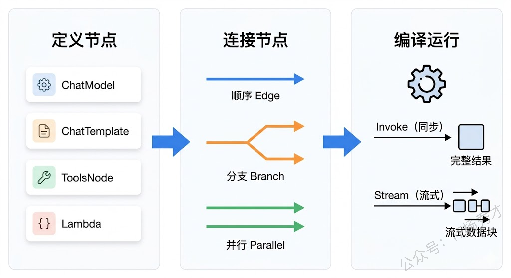
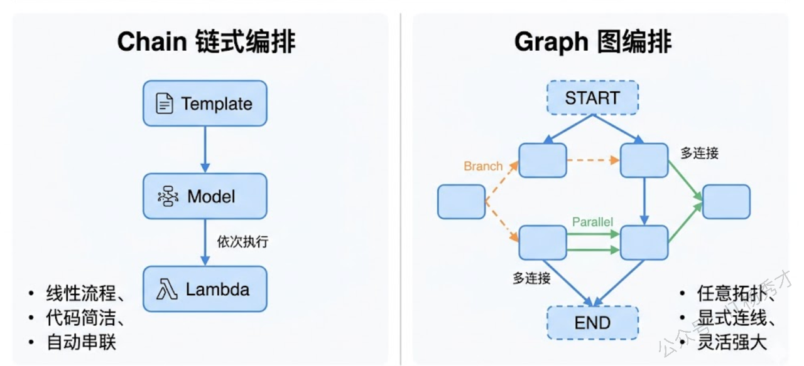
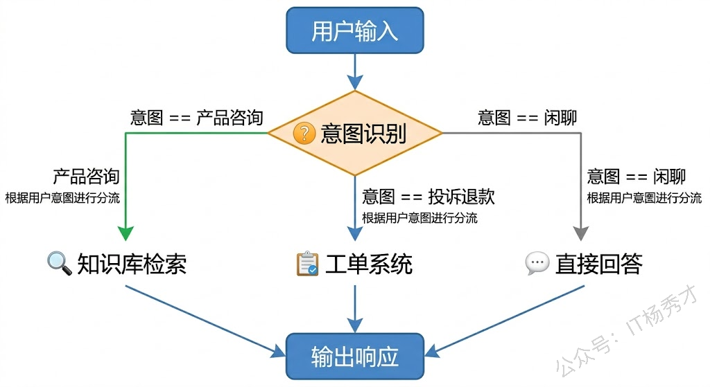
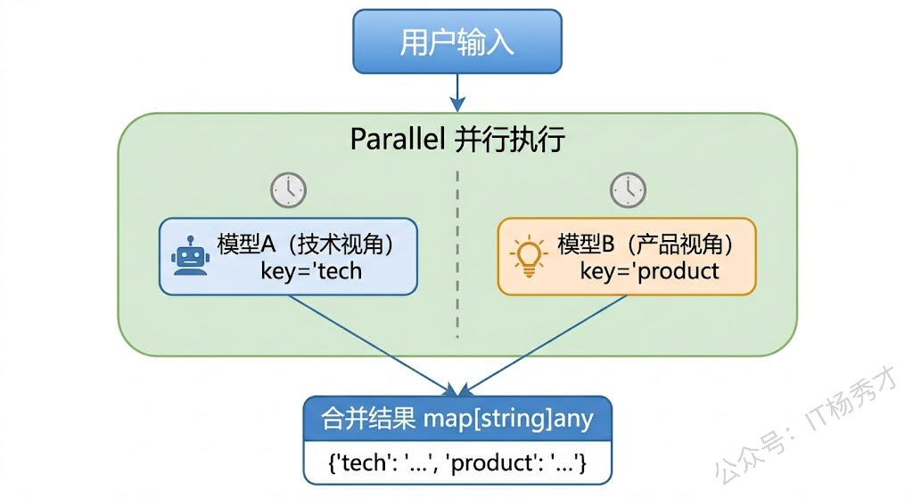
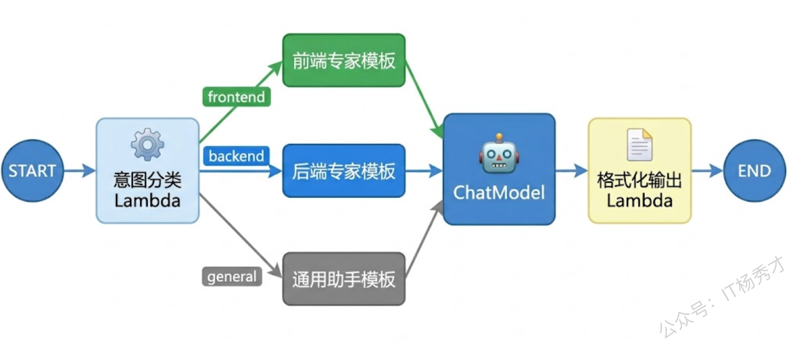

前面的 Eino 基础篇，我们学会了用 ChatModel 调大模型、用 Prompt 模板构建消息、用 Tool 定义工具、用 ReAct Agent 把它们串起来。ReAct Agent 确实好用，但它本质上只做一件事——让模型自己决定什么时候调工具、调哪个工具。如果你的业务逻辑不是"模型自由发挥"，而是有明确的流程编排需求呢？比如"先用模型 A 做意图识别，再根据意图走不同分支，某些分支需要并行调用多个模型，最后汇总结果"——这种场景下，ReAct Agent 就不够用了，你需要的是一套更底层、更灵活的编排系统。

Eino 的 `compose` 包就是干这个活的。它提供了两种编排范式：**Chain（链）** 和 **Graph（图）**。Chain 适合线性的、一步接一步的处理流程；Graph 则能表达任意复杂的有向无环图（DAG），支持分支、并行、条件路由。这两种范式底层共享同一套类型系统和编译机制，Chain 本质上就是 Graph 的一层语法糖——它让简单场景更简洁，同时不妨碍你在需要时切换到 Graph 获取完整的表达能力。

## **1. 编排的核心思路**

在开始写代码之前，先搞清楚 Eino 编排系统的整体设计思路。

整个编排过程分三步走：**定义节点 → 连接节点 → 编译运行**。节点就是处理逻辑的最小单元，可以是一个 ChatModel、一个 Prompt 模板、一组工具、或者你自己写的任意函数（Lambda）。连接节点决定了数据怎么在节点之间流转——是顺序执行、条件分支、还是并行处理。最后通过 `Compile` 把整个编排图编译成一个可执行的 `Runnable`，调用它的 `Invoke` 或 `Stream` 方法来运行。



这个设计有一个好处特别值得一提：**编排的定义和执行是分离的**。你可以在程序启动时把所有编排图定义好、编译好，运行时直接调用编译后的 Runnable，没有任何额外开销。这跟很多动态解释执行的编排框架不同，Eino 的编译阶段会做类型检查、连接验证，发现问题直接报错，不会等到运行时才炸。

## **2. Chain 链式编排**

Chain 是最简单的编排方式——把多个节点像糖葫芦一样串起来，数据从第一个节点流入，依次经过每个节点处理，最后从最后一个节点流出。上一个节点的输出就是下一个节点的输入，中间不需要你操心数据怎么传递。

用 `compose.NewChain` 创建一个 Chain，泛型参数指定整条链的输入类型和输出类型：

```go
chain := compose.NewChain[InputType, OutputType]()
```

然后通过一系列 `Append` 方法往链上追加节点。Eino 为不同类型的组件提供了专门的 Append 方法：`AppendChatModel` 追加模型节点、`AppendChatTemplate` 追加 Prompt 模板节点、`AppendLambda` 追加自定义逻辑节点。这些方法是链式调用的，写起来非常流畅。

来看一个最基本的例子——构建一个"Prompt 模板 → 模型调用"的两步链：

```go
package main

import (
        "context"
        "fmt"
        "log"
        "os"

        "github.com/cloudwego/eino-ext/components/model/openai"
        "github.com/cloudwego/eino/components/prompt"
        "github.com/cloudwego/eino/compose"
        "github.com/cloudwego/eino/schema"
)

func main() {
        ctx := context.Background()

        // 创建模型
        model, err := openai.NewChatModel(ctx, &openai.ChatModelConfig{
                BaseURL: "https://dashscope.aliyuncs.com/compatible-mode/v1",
                APIKey:  os.Getenv("DASHSCOPE_API_KEY"),
                Model:   "qwen-plus",
        })
        if err != nil {
                log.Fatal(err)
        }

        // 创建 Prompt 模板
        tpl := prompt.FromMessages(schema.FString,
                schema.SystemMessage("你是一个{role}，请用简洁专业的语言回答问题。"),
                schema.UserMessage("{question}"),
        )

        // 构建 Chain：模板 → 模型
        chain := compose.NewChain[map[string]any, *schema.Message]()
        chain.
                AppendChatTemplate(tpl).
                AppendChatModel(model)

        // 编译
        runner, err := chain.Compile(ctx)
        if err != nil {
                log.Fatal("编译失败:", err)
        }

        // 运行
        result, err := runner.Invoke(ctx, map[string]any{
                "role":     "Go语言专家",
                "question": "Go的channel和mutex各自适合什么场景？",
        })
        if err != nil {
                log.Fatal("运行失败:", err)
        }

        fmt.Println(result.Content)
}
```

运行结果：

```plain&#x20;text
Go 中 `channel` 和 `mutex` 解决的是**不同层面的并发问题**，适用场景有本质区别：

### ✅ Channel（通道）—— **用于协程间通信（CSP 模型）**
- **核心用途**：在 goroutine 之间**安全地传递数据**，实现“通过通信共享内存”。
- **适合场景**：
  - **生产者-消费者模型**（如任务队列、日志收集）；
  - **结果/错误传递**（如 `go f()`, 用 channel 接收返回值）；
  - **协程生命周期协调**（如 `done` channel 控制取消或退出）；
  - **流水线处理**（多个 stage 用 channel 串接）；
  - **限流/信号通知**（如 `sem := make(chan struct{}, N)` 实现信号量）。

> 💡 优势：语义清晰、天然支持同步/异步、可配合 `select` 实现超时/多路复用，是 Go 推荐的**首选并发原语**。

---

### ✅ Mutex（互斥锁）—— **用于保护共享内存访问**
- **核心用途**：确保**同一时间只有一个 goroutine 访问临界区**（如全局变量、结构体字段）。
- **适合场景**：
  - **高频读写小块共享状态**（如计数器 `counter++`、缓存 `map` 的增删查改）；
  - **无法用 channel 重构的遗留逻辑**（如需就地修改复杂对象）；
  - **性能敏感且无天然通信结构的场景**（channel 有内存分配和调度开销，mutex 更轻量）；
  - **与外部系统交互时的状态同步**（如文件句柄、硬件资源的状态标记）。

> ⚠️ 注意：滥用 mutex 易导致死锁、阻塞 goroutine；应尽量缩小临界区，优先考虑 `sync.RWMutex` 读多写少场景。

---

### 🚫 关键区别总结

| 维度         | Channel                          | Mutex                         |
|--------------|------------------------------------|-------------------------------|
| 范式         | 通信驱动（CSP）                   | 共享内存 + 同步               |
| 数据流向     | 显式传递（有类型、有所有权转移）   | 无数据传递，仅控制访问权       |
| 阻塞行为     | 可阻塞（带缓冲/无缓冲）、可 `select` | 阻塞等待锁，无超时原生支持（需 `sync.Mutex` + context 自行实现） |
| 扩展性       | 天然支持多对多、扇入/扇出           | 仅保护局部临界区，难扩展        |
| 典型反模式   | 用 channel 做“锁”（如空 channel 等待）→ 语义不清、低效 | 用 mutex 传递数据（如先加锁再写全局变量）→ 违背 Go 并发哲学 |

---

✅ **最佳实践口诀**：  
> **“用 channel 传递数据，用 mutex 保护状态。”**  
> —— 当你发现自己在用 mutex 传递信息时，该重构为 channel；  
> 当你在用 channel 模拟锁时，该检查是否真需要同步，或改用 mutex。

需要具体例子（如计数器 vs 任务分发）我可进一步展开。
```

整条链的数据流是这样的：输入是一个 `map[string]any`（包含模板变量），经过 `ChatTemplate` 节点后变成 `[]*schema.Message`（渲染后的消息列表），再经过 `ChatModel` 节点后变成 `*schema.Message`（模型回答）。Eino 在编译阶段会自动检查相邻节点之间的类型是否匹配，如果模板输出的类型和模型期望的输入类型对不上，编译时就会报错，不用等到运行时才发现问题。

### **2.1 用 Lambda 插入自定义逻辑**

Chain 不只是串组件，你还可以在任意位置插入 Lambda 节点来执行自定义逻辑。Lambda 就是一个普通的 Go 函数，Eino 通过 `compose.InvokableLambda` 把它包装成编排节点。

比如我们想在模型返回结果后，做一步后处理——提取回答内容并加上前缀：

```go
package main

import (
        "context"
        "fmt"
        "log"
        "os"

        "github.com/cloudwego/eino-ext/components/model/openai"
        "github.com/cloudwego/eino/components/prompt"
        "github.com/cloudwego/eino/compose"
        "github.com/cloudwego/eino/schema"
)

func main() {
        ctx := context.Background()

        model, err := openai.NewChatModel(ctx, &openai.ChatModelConfig{
                BaseURL: "https://dashscope.aliyuncs.com/compatible-mode/v1",
                APIKey:  os.Getenv("DASHSCOPE_API_KEY"),
                Model:   "qwen-plus",
        })
        if err != nil {
                log.Fatal(err)
        }

        tpl := prompt.FromMessages(schema.FString,
                schema.SystemMessage("你是一个翻译专家，请将用户输入的中文翻译成英文。"),
                schema.UserMessage("{text}"),
        )

        // 构建 Chain：模板 → 模型 → 后处理
        chain := compose.NewChain[map[string]any, string]()
        chain.
                AppendChatTemplate(tpl).
                AppendChatModel(model).
                AppendLambda(compose.InvokableLambda(func(ctx context.Context, msg *schema.Message) (string, error) {
                        // 自定义后处理：提取内容并格式化
                        return fmt.Sprintf("【翻译结果】%s", msg.Content), nil
                }))

        runner, err := chain.Compile(ctx)
        if err != nil {
                log.Fatal("编译失败:", err)
        }

        result, err := runner.Invoke(ctx, map[string]any{
                "text": "今天天气真不错，适合出去走走。",
        })
        if err != nil {
                log.Fatal("运行失败:", err)
        }

        fmt.Println(result)
}
```

运行结果：

```plain&#x20;text
【翻译结果】The weather is really nice today—perfect for going out for a walk.
```

注意这条链的输出类型从 `*schema.Message` 变成了 `string`——因为最后一个 Lambda 节点把消息对象转成了格式化字符串。Chain 的整体输入输出类型取决于首尾两个节点。

## **3. Graph 图编排**

Chain 虽然简洁，但只能表达线性流程。一旦你的业务需要分支判断、条件路由或者并行处理，就得请出 Graph 了。

Graph 是一个有向无环图（DAG），你需要显式地添加节点和边。和 Chain 的"追加"不同，Graph 的构建更像是画流程图——先把所有节点画出来，再用线把它们连起来。

```go
graph := compose.NewGraph[InputType, OutputType]()
```

Graph 有两个特殊的虚拟节点：`compose.START` 和 `compose.END`，分别代表图的入口和出口。你需要用 `AddEdge` 方法把 START 连到第一个实际节点，把最后一个实际节点连到 END。



来看一个基本的 Graph 示例——实现和前面 Chain 一样的功能，但用 Graph 的方式来写：

```go
package main

import (
        "context"
        "fmt"
        "log"
        "os"

        "github.com/cloudwego/eino-ext/components/model/openai"
        "github.com/cloudwego/eino/components/prompt"
        "github.com/cloudwego/eino/compose"
        "github.com/cloudwego/eino/schema"
)

func main() {
        ctx := context.Background()

        model, err := openai.NewChatModel(ctx, &openai.ChatModelConfig{
                BaseURL: "https://dashscope.aliyuncs.com/compatible-mode/v1",
                APIKey:  os.Getenv("DASHSCOPE_API_KEY"),
                Model:   "qwen-plus",
        })
        if err != nil {
                log.Fatal(err)
        }

        tpl := prompt.FromMessages(schema.FString,
                schema.SystemMessage("你是一个技术文档助手，请根据用户的问题给出清晰的解答。"),
                schema.UserMessage("{question}"),
        )

        // 构建 Graph
        graph := compose.NewGraph[map[string]any, string]()

        // 添加节点
        _ = graph.AddChatTemplateNode("tpl", tpl)
        _ = graph.AddChatModelNode("model", model)
        _ = graph.AddLambdaNode("format", compose.InvokableLambda(
                func(ctx context.Context, msg *schema.Message) (string, error) {
                        return fmt.Sprintf("=== 回答 ===\n%s", msg.Content), nil
                },
        ))

        // 连接边：定义数据流向
        _ = graph.AddEdge(compose.START, "tpl")
        _ = graph.AddEdge("tpl", "model")
        _ = graph.AddEdge("model", "format")
        _ = graph.AddEdge("format", compose.END)

        // 编译并运行
        runner, err := graph.Compile(ctx)
        if err != nil {
                log.Fatal("编译失败:", err)
        }

        result, err := runner.Invoke(ctx, map[string]any{
                "question": "什么是 goroutine 泄漏？怎么排查？",
        })
        if err != nil {
                log.Fatal("运行失败:", err)
        }

        fmt.Println(result)
}
```

运行结果：

```plain&#x20;text
=== 回答 ===
Goroutine泄漏是指goroutine启动后无法正常退出，一直占用内存和调度资源。常见原因包括channel阻塞（没有发送方或接收方）、死锁、无限循环等。排查方法：1）用runtime.NumGoroutine()监控goroutine数量变化；2）通过pprof的goroutine profile查看各goroutine的调用栈；3）使用goleak等工具在测试中自动检测泄漏。
```

代码量确实比 Chain 多了一些——你得手动给每个节点起名字，还得手动连边。但这种显式的控制换来的是更高的灵活性。比如你可以轻松地让一个节点的输出同时流向多个下游节点，或者在运行时根据条件选择不同的路径，这些在 Chain 里做不到。

## **4. 条件路由**

真实业务中，流程很少是一条直线走到底的。用户输入不同的内容，后续处理逻辑往往不一样。比如一个客服系统，用户问产品问题走知识库检索，投诉退款走工单系统，闲聊就直接模型回答。这种"岔路口"在 Eino 里叫 **Branch（分支）**。



### **4.1 Graph 中的 Branch**

在 Graph 中使用 Branch 非常直观。你需要定义一个条件函数，它接收当前节点的输出，返回一个字符串来表示走哪条分支。然后通过 `compose.NewGraphBranch` 创建分支，把每个分支名对应的下游节点注册进去。

来看一个具体的例子：根据用户问题的类别，选择不同的模型角色来回答。

```go
package main

import (
    "context"
    "fmt"
    "log"
    "os"
    "strings"

    "github.com/cloudwego/eino-ext/components/model/openai"
    "github.com/cloudwego/eino/components/prompt"
    "github.com/cloudwego/eino/compose"
    "github.com/cloudwego/eino/schema"
)

func main() {
    ctx := context.Background()

    model, err := openai.NewChatModel(ctx, &openai.ChatModelConfig{
       BaseURL: "https://dashscope.aliyuncs.com/compatible-mode/v1",
       APIKey:  os.Getenv("DASHSCOPE_API_KEY"),
       Model:   "qwen-plus",
    })
    if err != nil {
       log.Fatal(err)
    }

    // 分类器：用 Lambda 做简单的关键词分类
    classifier := compose.InvokableLambda(func(ctx context.Context, input map[string]any) (map[string]any, error) {
       question := input["question"].(string)
       if strings.Contains(question, "代码") || strings.Contains(question, "编程") || strings.Contains(question, "bug") {
          input["category"] = "code"
       } else if strings.Contains(question, "部署") || strings.Contains(question, "运维") || strings.Contains(question, "服务器") {
          input["category"] = "ops"
       } else {
          input["category"] = "general"
       }
       return input, nil
    })

    // 三个不同角色的 Prompt 模板
    codeTpl := prompt.FromMessages(schema.FString,
       schema.SystemMessage("你是一个资深Go语言开发者，擅长代码审查和问题排查，请回答用户的编程问题。"),
       schema.UserMessage("{question}"),
    )

    opsTpl := prompt.FromMessages(schema.FString,
       schema.SystemMessage("你是一个运维专家，精通Linux、Docker和K8s，请回答用户的运维问题。"),
       schema.UserMessage("{question}"),
    )

    generalTpl := prompt.FromMessages(schema.FString,
       schema.SystemMessage("你是一个友好的技术助手，请简洁地回答用户的问题。"),
       schema.UserMessage("{question}"),
    )

    // 构建 Graph
    graph := compose.NewGraph[map[string]any, *schema.Message]()

    // 添加节点
    _ = graph.AddLambdaNode("classifier", classifier)
    _ = graph.AddChatTemplateNode("code_tpl", codeTpl)
    _ = graph.AddChatTemplateNode("ops_tpl", opsTpl)
    _ = graph.AddChatTemplateNode("general_tpl", generalTpl)
    _ = graph.AddChatModelNode("model", model)

    // 定义条件路由
    _ = graph.AddEdge(compose.START, "classifier")
    _ = graph.AddBranch("classifier", compose.NewGraphBranch(
       // 条件函数：根据分类结果决定走哪个分支
       func(ctx context.Context, input map[string]any) (string, error) {
          category := input["category"].(string)
          return category + "_tpl", nil
       },
       // 分支映射：声明所有可能的下游节点
       map[string]bool{
          "code_tpl":    true,
          "ops_tpl":     true,
          "general_tpl": true,
       },
    ))

    // 三条分支最终都汇聚到同一个模型节点
    _ = graph.AddEdge("code_tpl", "model")
    _ = graph.AddEdge("ops_tpl", "model")
    _ = graph.AddEdge("general_tpl", "model")
    _ = graph.AddEdge("model", compose.END)

    // 编译并运行
    runner, err := graph.Compile(ctx)
    if err != nil {
       log.Fatal("编译失败:", err)
    }

    // 测试不同类型的问题
    questions := []string{
       "Go代码里怎么避免goroutine泄漏？",
       "Docker容器部署时端口映射不生效怎么办？",
       "推荐几本学习分布式系统的书？",
    }

    for _, q := range questions {
       result, err := runner.Invoke(ctx, map[string]any{"question": q})
       if err != nil {
          log.Printf("问题: %s, 错误: %v\n", q, err)
          continue
       }
       fmt.Printf("问题: %s\n回答: %s\n\n", q, result.Content)
    }
}
```

运行结果：

```plain&#x20;text
问题: Go代码里怎么避免goroutine泄漏？
回答: 避免goroutine泄漏的关键是确保每个goroutine都有明确的退出路径。几个实用做法：用context控制goroutine生命周期，超时或取消时及时退出；channel操作要成对出现，避免只发不收或只收不发导致阻塞；用defer关闭不再需要的channel；在测试中引入goleak库自动检测泄漏。

问题: Docker容器部署时端口映射不生效怎么办？
回答: 端口映射不生效通常有几个原因：检查容器内应用是否监听在0.0.0.0而不是127.0.0.1；确认-p参数格式正确（宿主机端口:容器端口）；查看防火墙规则是否放行了对应端口；用docker port命令确认映射是否生效；检查是否有其他进程占用了宿主机端口。

问题: 推荐几本学习分布式系统的书？
回答: 推荐《Designing Data-Intensive Applications》（DDIA），讲数据系统设计的经典之作；《分布式系统：概念与设计》适合建立理论基础；想深入一致性算法可以看Raft论文和《Paxos Made Simple》。
```

这里有几个细节需要留意。`compose.NewGraphBranch` 接收两个参数：一个条件函数和一个分支映射。条件函数的返回值是一个字符串，这个字符串会作为 key 去分支映射里查找对应的下游节点。如果条件函数返回了映射中不存在的 key，运行时会报错。另外，三条分支最后都连到同一个 `model` 节点——这在 Graph 里是完全合法的，多条边可以指向同一个节点，Eino 会确保只有实际被激活的那条分支的数据流入 model。

### **4.2 Chain 中的 Branch**

Chain 也支持分支，用 `compose.NewChainBranch` 创建。Chain 中的分支有一个限制：所有分支的输出类型必须相同，因为链还要继续往下走，下一个节点只能接受一种输入类型。

```go
// Chain 中使用分支
chain := compose.NewChain[map[string]any, string]()
chain.
        AppendBranch(compose.NewChainBranch(
                // 条件函数
                func(ctx context.Context, input map[string]any) (string, error) {
                        lang := input["lang"].(string)
                        return lang, nil
                },
        ).
                AddLambda("zh", compose.InvokableLambda(func(ctx context.Context, input map[string]any) (string, error) {
                        return fmt.Sprintf("你好，%s！", input["name"]), nil
                })).
                AddLambda("en", compose.InvokableLambda(func(ctx context.Context, input map[string]any) (string, error) {
                        return fmt.Sprintf("Hello, %s!", input["name"]), nil
                })),
        )
```

Chain 分支的写法更紧凑，适合分支逻辑比较简单的场景。如果分支很多、逻辑很复杂，还是建议直接用 Graph。

## **5. 并行执行**

有些处理任务之间没有依赖关系，可以同时进行。比如你想让用户的问题同时发给两个不同角色的模型，然后合并结果——这时候就需要 Parallel（并行节点）。

`compose.NewParallel` 创建一个并行节点，你往里面添加多个子节点，它们会同时执行。并行节点的输出是一个 `map[string]any`，每个子节点的输出以你指定的 key 存入这个 map。



```go
package main

import (
        "context"
        "fmt"
        "log"
        "os"

        "github.com/cloudwego/eino-ext/components/model/openai"
        "github.com/cloudwego/eino/components/prompt"
        "github.com/cloudwego/eino/compose"
        "github.com/cloudwego/eino/schema"
)

func main() {
        ctx := context.Background()

        model, err := openai.NewChatModel(ctx, &openai.ChatModelConfig{
                BaseURL: "https://dashscope.aliyuncs.com/compatible-mode/v1",
                APIKey:  os.Getenv("DASHSCOPE_API_KEY"),
                Model:   "qwen-plus",
        })
        if err != nil {
                log.Fatal(err)
        }

        // 两个不同视角的模板
        techTpl := prompt.FromMessages(schema.FString,
                schema.SystemMessage("你是一个技术架构师，请从技术可行性角度分析这个需求，用一两句话概括。"),
                schema.UserMessage("{requirement}"),
        )
        productTpl := prompt.FromMessages(schema.FString,
                schema.SystemMessage("你是一个产品经理，请从用户价值角度分析这个需求，用一两句话概括。"),
                schema.UserMessage("{requirement}"),
        )

        // 构建两条子链
        techChain := compose.NewChain[map[string]any, *schema.Message]()
        techChain.AppendChatTemplate(techTpl).AppendChatModel(model)

        productChain := compose.NewChain[map[string]any, *schema.Message]()
        productChain.AppendChatTemplate(productTpl).AppendChatModel(model)

        // 构建并行节点
        parallel := compose.NewParallel()
        parallel.AddGraph("tech", techChain)
        parallel.AddGraph("product", productChain)

        // 主链：并行执行 → 合并结果
        chain := compose.NewChain[map[string]any, string]()
        chain.
                AppendParallel(parallel).
                AppendLambda(compose.InvokableLambda(func(ctx context.Context, results map[string]any) (string, error) {
                        techResult := results["tech"].(*schema.Message)
                        productResult := results["product"].(*schema.Message)
                        return fmt.Sprintf("【技术视角】%s\n\n【产品视角】%s",
                                techResult.Content, productResult.Content), nil
                }))

        runner, err := chain.Compile(ctx)
        if err != nil {
                log.Fatal("编译失败:", err)
        }

        result, err := runner.Invoke(ctx, map[string]any{
                "requirement": "为电商App添加AI智能客服功能",
        })
        if err != nil {
                log.Fatal("运行失败:", err)
        }

        fmt.Println(result)
}
```

运行结果：

```plain&#x20;text
【技术视角】技术上完全可行：可通过集成大语言模型（如Qwen、Llama 3）+ 电商领域知识库（商品目录、订单规则、售后政策等）+ RAG增强检索 + 对话状态管理，构建轻量级、可私有部署的AI客服模块；前端通过SDK或API接入App，支持文本/语音多模态交互，并满足实时性（<800ms响应）、高并发（万级QPS）及数据合规（对话脱敏、本地化部署）要求。

【产品视角】该需求通过AI智能客服为用户提供7×24小时即时响应、精准解答商品/订单/售后等问题的能力，显著降低用户等待成本与操作门槛，提升问题解决效率与购物信任感，从而增强用户留存与转化。
```

这个例子展示了 Parallel 的典型用法：同一份输入数据同时传给两条处理链，两条链并行执行（Eino 内部用 goroutine 并发），各自的输出以指定的 key 汇入一个 map，然后由后续的 Lambda 节点把结果合并成最终输出。这比串行执行两次模型调用快了将近一倍，在需要多角度分析或多模型投票的场景下非常实用。

## **6. 编译与运行**

前面的例子中我们已经反复用到了 `Compile`、`Invoke` 和 `Stream`，这里系统梳理一下编译运行机制。

### **6.1 Compile 做了什么**

`Compile` 不只是简单地把节点串起来，它在编译阶段做了不少重要的事情：**类型检查**——验证相邻节点的输入输出类型是否兼容；**连通性检查**——确保从 START 到 END 有完整的路径，不存在孤立节点；**环检测**——Graph 只支持 DAG，如果你不小心画了一个环，编译时就会报错。这些检查帮你把配置错误提前暴露在编译阶段，避免运行时出现莫名其妙的问题。

编译后得到的 `Runnable` 对象是线程安全的，你可以在多个 goroutine 中并发调用它，不需要额外的锁。在实际项目中，通常是程序启动时编译一次，之后反复运行。

### **6.2 Invoke 与 Stream**

编译后的 Runnable 提供两种调用方式。`Invoke` 是同步调用，等所有节点执行完毕后一次性返回最终结果，适合需要完整结果的场景。`Stream` 是流式调用，返回一个 `StreamReader`，你可以逐块读取输出，适合对响应速度要求高的交互场景——比如聊天界面里一个字一个字地输出。

```go
package main

import (
        "context"
        "fmt"
        "io"
        "log"
        "os"

        "github.com/cloudwego/eino-ext/components/model/openai"
        "github.com/cloudwego/eino/components/prompt"
        "github.com/cloudwego/eino/compose"
        "github.com/cloudwego/eino/schema"
)

func main() {
        ctx := context.Background()

        model, err := openai.NewChatModel(ctx, &openai.ChatModelConfig{
                BaseURL: "https://dashscope.aliyuncs.com/compatible-mode/v1",
                APIKey:  os.Getenv("DASHSCOPE_API_KEY"),
                Model:   "qwen-plus",
        })
        if err != nil {
                log.Fatal(err)
        }

        tpl := prompt.FromMessages(schema.FString,
                schema.SystemMessage("你是一个Go语言教学助手，请详细解释用户的问题。"),
                schema.UserMessage("{question}"),
        )

        chain := compose.NewChain[map[string]any, *schema.Message]()
        chain.AppendChatTemplate(tpl).AppendChatModel(model)

        runner, err := chain.Compile(ctx)
        if err != nil {
                log.Fatal(err)
        }

        input := map[string]any{"question": "Go的interface是怎么实现的？"}

        // 方式一：Invoke 同步调用
        fmt.Println("=== Invoke 同步调用 ===")
        result, err := runner.Invoke(ctx, input)
        if err != nil {
                log.Fatal(err)
        }
        fmt.Println(result.Content)

        // 方式二：Stream 流式调用
        fmt.Println("\n=== Stream 流式调用 ===")
        stream, err := runner.Stream(ctx, input)
        if err != nil {
                log.Fatal(err)
        }
        defer stream.Close()

        for {
                chunk, err := stream.Recv()
                if err != nil {
                        if err == io.EOF {
                                break
                        }
                        log.Fatal(err)
                }
                fmt.Print(chunk.Content) // 逐块输出，不换行
        }
        fmt.Println()
}
```

运行结果：

```plain&#x20;text
=== Invoke 同步调用 ===
Go的interface底层由两种结构实现：iface和eface。iface用于包含方法的接口，由指向接口类型信息的itab指针和指向实际数据的data指针组成；eface用于空接口interface{}，只有类型指针和数据指针两个字段。当把一个具体类型赋值给接口变量时，编译器会生成itab并缓存方法表，运行时通过itab快速定位方法地址实现动态派发。

=== Stream 流式调用 ===
Go的interface底层由两种结构实现：iface和eface。iface用于包含方法的接口，由指向接口类型信息的itab指针和指向实际数据的data指针组成...
```

`Stream` 返回的 `StreamReader` 用法跟读一个 channel 很像——循环调用 `Recv()` 获取数据块，直到收到 `io.EOF` 表示流结束。需要注意的是用完之后要调用 `Close()` 释放资源，这里用 defer 确保释放。

## **7. 综合实战**

最后来一个稍微完整的例子，把前面学到的知识点综合运用。我们要构建一个"技术问答路由系统"：接收用户提问，先判断属于前端、后端还是通用问题，走不同的模板分支让模型以对应角色回答，最后格式化输出。



```go
package main

import (
    "context"
    "fmt"
    "log"
    "os"
    "strings"

    "github.com/cloudwego/eino-ext/components/model/openai"
    "github.com/cloudwego/eino/components/prompt"
    "github.com/cloudwego/eino/compose"
    "github.com/cloudwego/eino/schema"
)

func main() {
    ctx := context.Background()

    // 创建模型
    model, err := openai.NewChatModel(ctx, &openai.ChatModelConfig{
       BaseURL: "https://dashscope.aliyuncs.com/compatible-mode/v1",
       APIKey:  os.Getenv("DASHSCOPE_API_KEY"),
       Model:   "qwen-plus",
    })
    if err != nil {
       log.Fatal(err)
    }

    // 意图分类器
    classifier := compose.InvokableLambda(func(ctx context.Context, input map[string]any) (map[string]any, error) {
       question := input["question"].(string)
       lower := strings.ToLower(question)

       category := "general"
       if strings.ContainsAny(lower, "前端csshtml") ||
          strings.Contains(lower, "react") ||
          strings.Contains(lower, "vue") ||
          strings.Contains(lower, "javascript") {
          category = "frontend"
       } else if strings.Contains(lower, "go") ||
          strings.Contains(lower, "数据库") ||
          strings.Contains(lower, "并发") ||
          strings.Contains(lower, "微服务") ||
          strings.Contains(lower, "api") {
          category = "backend"
       }

       input["category"] = category
       return input, nil
    })

    // 不同角色的模板
    frontendTpl := prompt.FromMessages(schema.FString,
       schema.SystemMessage("你是一个前端开发专家，精通React、Vue、CSS和浏览器原理，请用简洁的语言回答问题。"),
       schema.UserMessage("{question}"),
    )
    backendTpl := prompt.FromMessages(schema.FString,
       schema.SystemMessage("你是一个后端开发专家，精通Go、数据库、微服务架构和高并发设计，请用简洁的语言回答问题。"),
       schema.UserMessage("{question}"),
    )
    generalTpl := prompt.FromMessages(schema.FString,
       schema.SystemMessage("你是一个全栈技术顾问，请用通俗易懂的语言回答问题。"),
       schema.UserMessage("{question}"),
    )

    // 构建 Graph
    graph := compose.NewGraph[map[string]any, string]()

    // 添加所有节点
    _ = graph.AddLambdaNode("classifier", classifier)
    _ = graph.AddChatTemplateNode("frontend_tpl", frontendTpl)
    _ = graph.AddChatTemplateNode("backend_tpl", backendTpl)
    _ = graph.AddChatTemplateNode("general_tpl", generalTpl)
    _ = graph.AddChatModelNode("model", model)
    _ = graph.AddLambdaNode("formatter", compose.InvokableLambda(
       func(ctx context.Context, msg *schema.Message) (string, error) {
          return fmt.Sprintf("[AI助手] %s", msg.Content), nil
       },
    ))

    // 连接编排
    _ = graph.AddEdge(compose.START, "classifier")

    // 条件路由
    _ = graph.AddBranch("classifier", compose.NewGraphBranch(
       func(ctx context.Context, input map[string]any) (string, error) {
          return input["category"].(string) + "_tpl", nil
       },
       map[string]bool{
          "frontend_tpl": true,
          "backend_tpl":  true,
          "general_tpl":  true,
       },
    ))

    // 汇聚到模型
    _ = graph.AddEdge("frontend_tpl", "model")
    _ = graph.AddEdge("backend_tpl", "model")
    _ = graph.AddEdge("general_tpl", "model")
    _ = graph.AddEdge("model", "formatter")
    _ = graph.AddEdge("formatter", compose.END)

    // 编译
    runner, err := graph.Compile(ctx)
    if err != nil {
       log.Fatal("编译失败:", err)
    }

    // 测试多个问题
    questions := []string{
       "React的useEffect和useLayoutEffect有什么区别？",
       "Go的GMP调度模型是怎么工作的？",
       "新手程序员应该先学前端还是后端？",
    }

    for _, q := range questions {
       result, err := runner.Invoke(ctx, map[string]any{"question": q})
       if err != nil {
          log.Printf("错误: %v\n", err)
          continue
       }
       fmt.Printf("问题: %s\n%s\n\n", q, result)
    }
}
```

运行结果：

```plain&#x20;text
问题: React的useEffect和useLayoutEffect有什么区别？
[AI助手] useEffect在浏览器完成绘制后异步执行，不会阻塞页面渲染，适合数据获取、事件监听等副作用。useLayoutEffect在DOM更新后、浏览器绘制前同步执行，会阻塞渲染，适合需要读取或修改DOM布局的操作（如测量元素尺寸、防止闪烁）。大多数场景用useEffect就够了，只有遇到布局抖动时才考虑useLayoutEffect。

问题: Go的GMP调度模型是怎么工作的？
[AI助手] GMP由三个核心组件组成：G（Goroutine）是轻量级协程，M（Machine）是操作系统线程，P（Processor）是逻辑处理器。P持有一个本地goroutine队列，M必须绑定一个P才能执行G。调度流程：P从本地队列取G交给M执行，本地队列为空时从全局队列或其他P偷取（work stealing）。当G发生系统调用阻塞M时，P会解绑并找空闲M继续工作，保证CPU不闲着。

问题: 新手程序员应该先学前端还是后端？
[AI助手] 看你对什么更感兴趣。前端见效快，写完代码马上能看到页面效果，成就感强，适合喜欢视觉交互的人。后端偏逻辑和系统设计，适合喜欢解决复杂问题的人。如果实在选不定，建议先学后端打基础——数据结构、算法、网络这些底层知识前后端都需要，后端会更扎实。
```

这个例子虽然用了简单的关键词匹配做分类，但整体架构是实际可用的——你只需要把分类器换成一个 LLM 调用（让模型输出分类结果），就是一个生产级别的意图路由系统了。

## **8. 小结**

Chain 和 Graph 是 Eino 编排系统的两大基石。Chain 像一条流水线，适合"A做完给B、B做完给C"这种线性场景，代码写起来干净利落。Graph 则是一张自由连线的画布，分支、并行、汇聚都不在话下，表达能力更强但代码量也更多。实际项目中，两者经常混着用——主流程用 Graph 做路由和分支控制，每条分支内部用 Chain 串联处理步骤。Eino 允许你把一个 Chain 直接嵌套到 Graph 的节点里（通过 `AddGraph` 方法），这种组合方式让编排既灵活又不至于太散乱。不管用哪种方式，核心理念是一样的：把业务逻辑拆成一个个节点，用编排系统把它们连起来，剩下的类型检查、并发控制、流式传输这些脏活累活，交给框架去操心。


<div style="background-color: #f0f9eb; padding: 10px 15px; border-radius: 4px; border-left: 5px solid #67c23a; margin: 20px 0; color:rgb(64, 147, 255);">

<span style="color: #006400; font-size: 28px;"><strong>关注秀才公众号：</strong></span><span style="color: red; font-size: 28px;"><strong>IT杨秀才</strong></span><span style="color: #006400; font-size: 28px;"><strong>，回复：</strong></span><span style="color: red; font-size: 28px;"><strong>面试</strong></span>

<div style="text-align: center;"><span style="color: #006400; font-size: 28px;"><strong>领取后端/AI面试题库PDF</strong></span></div>


</div> 
