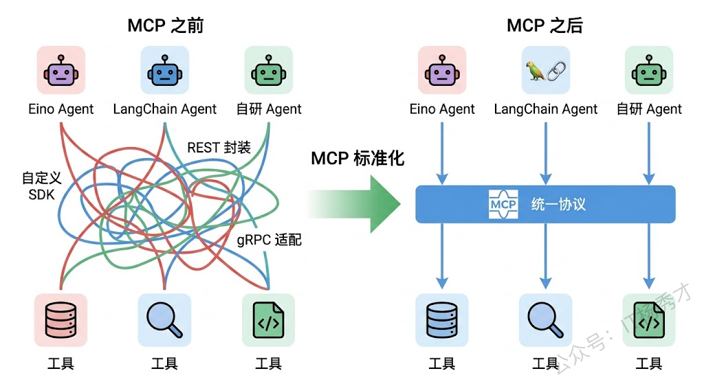
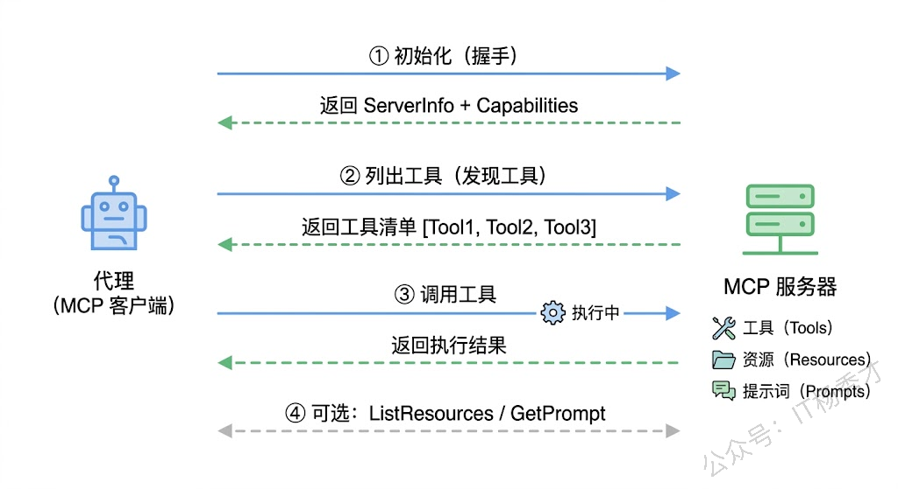
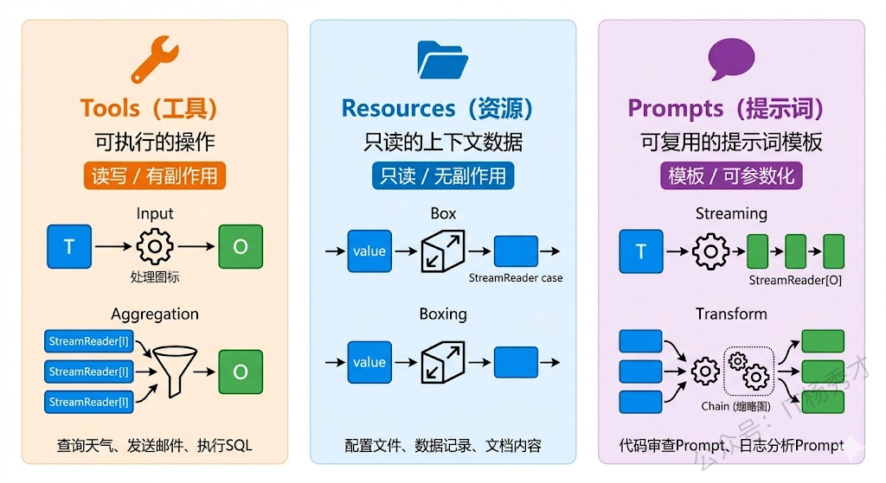
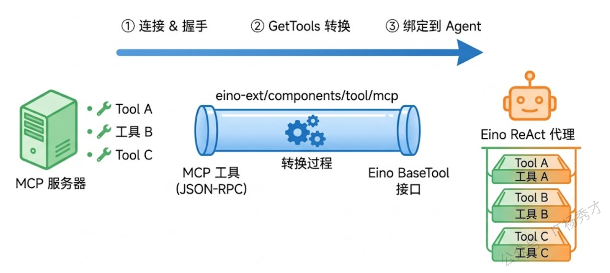
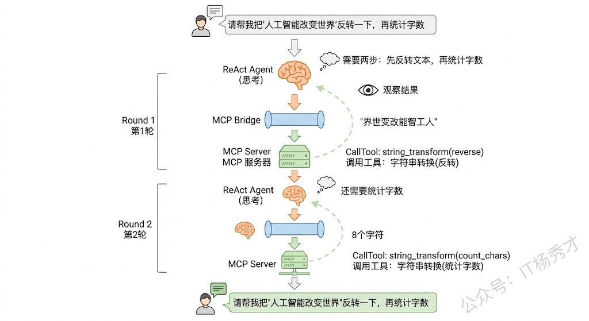

在前面几篇文章里，我们给 Agent 定义工具的方式都是硬编码——在 Go 代码里写好工具函数，通过 `utils.NewTool` 包装成 Eino 的 Tool 接口，然后绑定到 Agent 上。这种方式在项目初期完全够用，但随着系统规模变大，问题就来了：你的 Agent 需要调用的工具可能散落在不同的服务里，有的是 Python 写的数据分析脚本，有的是 Java 写的企业内部 API，有的是第三方 SaaS 平台的能力。难道每个工具都要在 Go 里重新实现一遍吗？

MCP（Model Context Protocol，模型上下文协议）就是为了解决这个问题而生的。它定义了一套标准化的协议，让任何语言、任何平台上的工具都能以统一的方式暴露给大模型使用。你可以把 MCP 理解成 AI 世界的 USB 接口——不管是键盘、鼠标还是U盘，只要遵循 USB 标准，插上就能用。同样，不管工具是用什么语言写的、跑在哪台机器上，只要实现了 MCP 协议，Agent 就能直接调用。

这篇文章就从 MCP 协议的设计理念讲起，然后用 Go 语言从零构建一个 MCP Server，再通过 Eino 的 MCP 桥接组件把这些工具无缝接入到 ReAct Agent 中。整个过程下来，你会对"Agent 如何跨系统调用工具"这件事有一个清晰完整的认知。

## **1. MCP协议概述**

MCP 是 Anthropic 在 2024 年底发布的一个开放协议，全称 Model Context Protocol。虽然名字里有 Anthropic，但它从一开始就是开源开放的，任何人都可以基于这个协议构建自己的工具生态。

在 MCP 出现之前，Agent 调用外部工具的方式五花八门。每个大模型平台有自己的 Function Calling 格式，每个工具提供方有自己的 API 接入方式，每个 Agent 框架有自己的 Tool 抽象。结果就是，如果你有一个好用的工具想让不同的 Agent 都能用，得针对每个框架分别适配一次。这跟早年手机充电器的局面一模一样——每家手机厂商一个接口，出门得带一堆线。

MCP 的出现就像 Type-C 接口统一了充电标准一样，它定义了一套通用的协议规范：工具提供方只需要实现一次 MCP Server，所有支持 MCP 的 Agent 就都能调用。



从架构上看，MCP 采用的是经典的 Client-Server 模型。MCP Server 是工具的提供方，它把自己的能力（工具、资源、提示词模板等）通过 MCP 协议暴露出来。MCP Client 是工具的消费方，通常集成在 Agent 框架或 LLM 应用中，负责发现和调用 Server 上的工具。Client 和 Server 之间通过标准化的 JSON-RPC 消息格式通信，传输层支持多种方式——本地进程间可以用 Stdio（标准输入输出），远程服务可以用 SSE（Server-Sent Events）或 Streamable HTTP。

这种设计的好处很明显：工具开发者只需要关心"我怎么把工具通过 MCP Server 暴露出来"，完全不需要关心调用方用的是什么 Agent 框架；而 Agent 开发者只需要关心"我怎么用 MCP Client 连接到 Server 并获取工具"，完全不需要关心工具是用什么语言实现的。两边彻底解耦。

## **2. MCP核心概念**

理解 MCP 协议，需要搞清楚几个核心概念：Server、Client、Transport（传输层）以及 MCP 定义的三类能力——Tools、Resources 和 Prompts。

### **2.1 Server与Client**

MCP Server 的职责很单纯：把自己拥有的能力注册好，等着 Client 来发现和调用。一个 Server 可以同时注册多个工具，比如一个"数据库助手"Server 可以同时提供"执行 SQL 查询"、"列出所有表"、"查看表结构"三个工具。Server 在启动时会声明自己支持哪些能力（Capabilities），Client 连接后会先执行一次握手（Initialize），获取 Server 的能力清单，然后才开始具体的调用。

MCP Client 的职责是连接到 Server，获取它暴露的工具列表，然后在需要时调用特定的工具。在 Agent 场景中，Client 通常不是独立运行的，而是嵌入在 Agent 框架里——比如 Eino 的 MCP 桥接组件内部就封装了一个 MCP Client，它帮你完成连接、握手、工具发现和调用的全部流程，你只需要告诉它 Server 的地址就行。



### **2.2 传输层**

MCP 协议本身不绑定特定的传输方式，目前主流的有三种。

**Stdio** 是最简单的一种，Client 和 Server 通过标准输入输出通信——Client 把 JSON-RPC 消息写到 Server 进程的 stdin，Server 把响应写到 stdout。这种方式适合本地开发场景，比如你用 Agent 调用本机上的一个命令行工具，直接启动一个子进程就行，连网络都不需要。

**SSE（Server-Sent Events）** 适合远程调用场景。Server 暴露一个 HTTP 端点，Client 通过 SSE 连接接收服务端推送的消息，同时通过普通 HTTP POST 发送请求。这种方式的好处是基于标准的 HTTP 协议，几乎所有的网络环境都能支持，部署起来也方便。

**Streamable HTTP** 是 MCP 协议较新版本引入的传输方式，相比 SSE 更加灵活高效。它允许在单个 HTTP 请求中完成请求-响应的交互，同时支持服务端主动推送。不过目前生态中使用最广泛的还是 SSE，我们后面的代码示例也会以 SSE 为主。

### **2.3 三类能力**

MCP Server 可以暴露三类不同性质的能力，各自解决不同的问题。

**Tools（工具）** 是最核心的能力，也是我们最关注的部分。Tool 对应的是一个可执行的操作，比如"查询天气"、"发送邮件"、"执行 SQL"。每个 Tool 有自己的名称、描述和参数 Schema（JSON Schema 格式），大模型通过 Function Calling 机制选择要调用的 Tool 并填充参数，Agent 框架再通过 MCP Client 实际执行调用。这跟我们之前在 Eino 里定义 Tool 的思路完全一致，只不过 Tool 的实现不再限制在本地 Go 代码里，而是可以跑在任何实现了 MCP Server 的远端服务上。

**Resources（资源）** 提供的是只读的上下文数据，比如一份配置文件、一段数据库里的记录、一个文件的内容。与 Tool 不同，Resource 不会产生副作用——它只是把数据"喂"给模型，帮助模型更好地理解当前的上下文。你可以把 Resources 理解成给模型提供的参考资料。

**Prompts（提示词模板）** 是可复用的提示词片段。Server 可以预定义一些常用的 Prompt 模板，Client 获取后可以直接使用或者组合到自己的 Prompt 中。比如一个"代码审查"Server 可以提供一个专业的 code review Prompt 模板，任何 Agent 都能拿来直接用。



在实际 Agent 开发中，Tools 是用得最多的能力类型——毕竟 Agent 的核心价值就是"能做事"，而做事就需要调用工具。Resources 和 Prompts 在某些场景下也很有用，但相对来说是锦上添花。所以我们后面的实战会重点围绕 Tools 展开。

## **3. 用Go构建MCP Server**

理论讲够了，开始写代码。我们先用 Go 构建一个 MCP Server，让它暴露几个实用的工具，然后再用 MCP Client 去连接和调用它。

Go 语言的 MCP 生态主要依赖 `mark3labs/mcp-go` 这个库，它是目前 Go 社区最活跃的 MCP SDK 实现，Eino 的 MCP 桥接组件底层用的也是它。

### **3.1 环境准备**

安装依赖：

```bash
go get github.com/mark3labs/mcp-go
```

### **3.2 实现一个工具类MCP Server**

我们来构建一个"开发者工具箱"MCP Server，提供两个工具：一个是字符串处理工具（支持大小写转换、统计字数等），另一个是时间工具（获取当前时间、计算时间差等）。这两个工具本身逻辑简单，但足够演示 MCP Server 的完整构建流程。

```go
package main

import (
        "context"
        "fmt"
        "log"
        "strings"
        "time"
        "unicode/utf8"

        "github.com/mark3labs/mcp-go/mcp"
        "github.com/mark3labs/mcp-go/server"
)

func main() {
        // 创建 MCP Server，声明名称和版本
        s := server.NewMCPServer(
                "DevToolbox",
                "1.0.0",
                server.WithToolCapabilities(true), // 声明支持 Tools 能力
        )

        // 注册字符串处理工具
        s.AddTool(
                mcp.NewTool("string_transform",
                        mcp.WithDescription("字符串处理工具，支持大小写转换和字数统计"),
                        mcp.WithString("text",
                                mcp.Required(),
                                mcp.Description("要处理的文本内容"),
                        ),
                        mcp.WithString("operation",
                                mcp.Required(),
                                mcp.Description("操作类型"),
                                mcp.Enum("to_upper", "to_lower", "count_chars", "reverse"),
                        ),
                ),
                handleStringTransform,
        )

        // 注册时间工具
        s.AddTool(
                mcp.NewTool("time_util",
                        mcp.WithDescription("时间工具，支持获取当前时间和计算日期差"),
                        mcp.WithString("operation",
                                mcp.Required(),
                                mcp.Description("操作类型"),
                                mcp.Enum("now", "diff"),
                        ),
                        mcp.WithString("format",
                                mcp.Description("时间格式，默认为 2006-01-02 15:04:05"),
                        ),
                        mcp.WithString("date1",
                                mcp.Description("第一个日期，格式 2006-01-02，计算日期差时必填"),
                        ),
                        mcp.WithString("date2",
                                mcp.Description("第二个日期，格式 2006-01-02，计算日期差时必填"),
                        ),
                ),
                handleTimeUtil,
        )

        // 以 SSE 方式启动 Server
        sseServer := server.NewSSEServer(s,
                server.WithBaseURL("http://localhost:8080"),
        )
        fmt.Println("MCP Server (DevToolbox) 启动中，监听 :8080 ...")
        if err := sseServer.Start(":8080"); err != nil {
                log.Fatal(err)
        }
}

// 字符串处理工具的 handler
func handleStringTransform(ctx context.Context, req mcp.CallToolRequest) (*mcp.CallToolResult, error) {
        text := req.GetString("text", "")
        operation := req.GetString("operation", "")

        var result string
        switch operation {
        case "to_upper":
                result = strings.ToUpper(text)
        case "to_lower":
                result = strings.ToLower(text)
        case "count_chars":
                count := utf8.RuneCountInString(text)
                result = fmt.Sprintf("文本共 %d 个字符", count)
        case "reverse":
                runes := []rune(text)
                for i, j := 0, len(runes)-1; i < j; i, j = i+1, j-1 {
                        runes[i], runes[j] = runes[j], runes[i]
                }
                result = string(runes)
        default:
                return mcp.NewToolResultError("不支持的操作类型: " + operation), nil
        }

        return mcp.NewToolResultText(result), nil
}

// 时间工具的 handler
func handleTimeUtil(ctx context.Context, req mcp.CallToolRequest) (*mcp.CallToolResult, error) {
        operation := req.GetString("operation", "")
        format := req.GetString("format", "2006-01-02 15:04:05")

        switch operation {
        case "now":
                return mcp.NewToolResultText(time.Now().Format(format)), nil
        case "diff":
                date1Str := req.GetString("date1", "")
                date2Str := req.GetString("date2", "")
                if date1Str == "" || date2Str == "" {
                        return mcp.NewToolResultError("计算日期差需要提供 date1 和 date2 参数"), nil
                }
                d1, err := time.Parse("2006-01-02", date1Str)
                if err != nil {
                        return mcp.NewToolResultError("date1 格式错误，请使用 2006-01-02 格式"), nil
                }
                d2, err := time.Parse("2006-01-02", date2Str)
                if err != nil {
                        return mcp.NewToolResultError("date2 格式错误，请使用 2006-01-02 格式"), nil
                }
                diff := d2.Sub(d1)
                days := int(diff.Hours() / 24)
                return mcp.NewToolResultText(fmt.Sprintf("%s 到 %s 相差 %d 天", date1Str, date2Str, days)), nil
        default:
                return mcp.NewToolResultError("不支持的操作类型: " + operation), nil
        }
}
```

运行结果：

```shell
MCP Server (DevToolbox) 启动中，监听 :8080 ...
```

这段代码的结构非常清晰：`server.NewMCPServer` 创建一个 Server 实例并声明支持的能力类型，`s.AddTool` 注册工具（每个工具需要一个 `mcp.Tool` 定义和一个 handler 函数），最后通过 `server.NewSSEServer` 以 SSE 方式启动服务。

工具定义部分值得多说两句。`mcp.NewTool` 的第一个参数是工具名称，后面跟一系列 Option 来描述工具的用途和参数。参数类型支持 `WithString`、`WithNumber`、`WithBoolean` 等，每个参数可以设置 `Required()`（必填）、`Description()`（描述）、`Enum()`（枚举值）等约束。这些描述信息会通过 MCP 协议传递给大模型，模型据此决定什么时候调用这个工具、怎么填充参数——所以工具描述写得好不好，直接影响 Agent 使用工具的准确性。

handler 函数的签名是固定的：接收一个 `context.Context` 和 `mcp.CallToolRequest`，返回 `*mcp.CallToolResult` 和 `error`。通过 `req.GetString` 等方法获取参数值，通过 `mcp.NewToolResultText` 返回文本结果，或者 `mcp.NewToolResultError` 返回错误信息。

启动这个 Server 后，它会在 `localhost:8080` 监听 SSE 连接，任何 MCP Client 都可以连上来发现并调用这两个工具。

## **4. MCP Client连接与调用**

Server 跑起来了，接下来写一个独立的 MCP Client 来连接它，验证工具发现和调用是否正常工作。

> 注意，保持刚刚写的MCP Server处于运行状态，然后另起一个文件或者项目来运行当前这个MCP Client&#x20;

```go
package main

import (
        "context"
        "fmt"
        "log"
        "time"

        "github.com/mark3labs/mcp-go/client"
        "github.com/mark3labs/mcp-go/mcp"
)

func main() {
        ctx, cancel := context.WithTimeout(context.Background(), 30*time.Second)
        defer cancel()

        // 创建 SSE Client，连接到 MCP Server
        cli, err := client.NewSSEMCPClient("http://localhost:8080/sse")
        if err != nil {
                log.Fatalf("创建 Client 失败: %v", err)
        }

        // 启动连接
        if err := cli.Start(ctx); err != nil {
                log.Fatalf("连接 Server 失败: %v", err)
        }
        defer cli.Close()

        // 握手：发送 Initialize 请求
        initReq := mcp.InitializeRequest{}
        initReq.Params.ProtocolVersion = mcp.LATEST_PROTOCOL_VERSION
        initReq.Params.ClientInfo = mcp.Implementation{
                Name:    "demo-client",
                Version: "1.0.0",
        }
        serverInfo, err := cli.Initialize(ctx, initReq)
        if err != nil {
                log.Fatalf("握手失败: %v", err)
        }
        fmt.Printf("已连接到 Server: %s (v%s)\n\n", serverInfo.ServerInfo.Name, serverInfo.ServerInfo.Version)

        // 发现工具：获取 Server 上所有可用的工具
        toolsResult, err := cli.ListTools(ctx, mcp.ListToolsRequest{})
        if err != nil {
                log.Fatalf("获取工具列表失败: %v", err)
        }
        fmt.Printf("发现 %d 个工具:\n", len(toolsResult.Tools))
        for _, t := range toolsResult.Tools {
                fmt.Printf("  - %s: %s\n", t.Name, t.Description)
        }
        fmt.Println()

        // 调用工具：字符串转大写
        callReq := mcp.CallToolRequest{}
        callReq.Params.Name = "string_transform"
        callReq.Params.Arguments = map[string]interface{}{
                "text":      "hello, mcp world!",
                "operation": "to_upper",
        }
        result, err := cli.CallTool(ctx, callReq)
        if err != nil {
                log.Fatalf("调用工具失败: %v", err)
        }
        for _, content := range result.Content {
                if tc, ok := content.(mcp.TextContent); ok {
                        fmt.Printf("字符串转大写结果: %s\n", tc.Text)
                }
        }

        // 调用工具：获取当前时间
        callReq2 := mcp.CallToolRequest{}
        callReq2.Params.Name = "time_util"
        callReq2.Params.Arguments = map[string]interface{}{
                "operation": "now",
        }
        result2, err := cli.CallTool(ctx, callReq2)
        if err != nil {
                log.Fatalf("调用工具失败: %v", err)
        }
        for _, content := range result2.Content {
                if tc, ok := content.(mcp.TextContent); ok {
                        fmt.Printf("当前时间: %s\n", tc.Text)
                }
        }
}
```

运行结果：

```plain&#x20;text
已连接到 Server: DevToolbox (v1.0.0)

发现 2 个工具:
  - string_transform: 字符串处理工具，支持大小写转换和字数统计
  - time_util: 时间工具，支持获取当前时间和计算日期差

字符串转大写结果: HELLO, MCP WORLD!
当前时间: 2026-04-20 20:21:27
```

这段代码展示了 MCP Client 的完整工作流程。首先通过 `client.NewSSEMCPClient` 创建一个 SSE 客户端并指定 Server 地址，然后调用 `Start` 建立连接。连接建立后，第一件事是发送 `Initialize` 请求完成握手——这一步会交换双方的版本信息和能力声明。握手成功后就可以调用 `ListTools` 获取工具清单，再通过 `CallTool` 调用具体的工具。

注意，Client 端完全不需要知道工具的实现细节。它只知道工具叫什么名字、接受什么参数、返回什么结果。这就是 MCP 协议带来的解耦——工具的实现和调用被彻底分离了。

## **5. Eino桥接MCP工具**

手动用 MCP Client 调用工具虽然可以工作，但在实际 Agent 开发中我们不会这么干。我们需要的是把 MCP Server 上的工具无缝"变成"Eino 的 Tool 接口，这样就能直接丢给 ReAct Agent 使用，Agent 自己决定什么时候调、怎么调。

Eino 通过 `eino-ext/components/tool/mcp` 这个桥接组件实现了这个能力。它的核心函数就一个：`mcpp.GetTools`——给它一个已经连接好的 MCP Client，它就帮你把 Server 上所有的工具都转换成 Eino 的 `tool.BaseTool` 接口。转换后的工具和你手动用 `utils.NewTool` 定义的工具没有任何区别，可以直接绑定到 ChatModel 或者 Agent 上。



下面来看看具体怎么用。这个例子会连接到我们上一节启动的 DevToolbox Server，获取它的工具，然后查看每个工具的信息：

> **先安装依赖**
>
> ```bash
> go get github.com/cloudwego/eino-ext/components/tool/mcp
> ```

注意在测试前，依然要保证我们第三节创建的MCP Server处于运行状态

```go
package main

import (
    "context"
    "fmt"
    "log"

    "github.com/mark3labs/mcp-go/client"
    "github.com/mark3labs/mcp-go/mcp"

    mcpp "github.com/cloudwego/eino-ext/components/tool/mcp"
)

func main() {
    ctx := context.Background()

    // 连接到 MCP Server
    cli, err := client.NewSSEMCPClient("http://localhost:8080/sse")
    if err != nil {
       log.Fatal(err)
    }
    if err := cli.Start(ctx); err != nil {
       log.Fatal(err)
    }
    defer cli.Close()

    // 初始化握手
    initReq := mcp.InitializeRequest{}
    initReq.Params.ProtocolVersion = mcp.LATEST_PROTOCOL_VERSION
    initReq.Params.ClientInfo = mcp.Implementation{
       Name:    "eino-bridge-demo",
       Version: "1.0.0",
    }
    if _, err := cli.Initialize(ctx, initReq); err != nil {
       log.Fatal(err)
    }

    // 关键一步：用 Eino 桥接组件把 MCP 工具转换为 Eino Tool
    tools, err := mcpp.GetTools(ctx, &mcpp.Config{Cli: cli})
    if err != nil {
       log.Fatal(err)
    }

    fmt.Printf("成功桥接 %d 个 MCP 工具为 Eino Tool:\n\n", len(tools))
    for i, t := range tools {
       info, _ := t.Info(ctx)
       fmt.Printf("[%d] 名称: %s\n    描述: %s\n    参数Schema: %v\n\n",
          i+1, info.Name, info.Desc, info.ParamsOneOf)
    }
}
```

运行结果：

```plain&#x20;text
成功桥接 2 个 MCP 工具为 Eino Tool:

[1] 名称: string_transform
    描述: 字符串处理工具，支持大小写转换和字数统计
    参数Schema: &{map[] 0x436338e6008}

[2] 名称: time_util
    描述: 时间工具，支持获取当前时间和计算日期差
    参数Schema: &{map[] 0x436338e6908}
```

整个桥接过程只需要一行核心代码：`mcpp.GetTools(ctx, &mcpp.Config{Cli: cli})`。它内部做了几件事：通过 MCP Client 调用 `ListTools` 获取 Server 上的所有工具定义，然后把每个 MCP Tool 的名称、描述、参数 Schema 转换为 Eino 的 `ToolInfo` 格式，最后为每个工具创建一个实现了 `tool.InvokableTool` 接口的包装对象。当这个包装对象的 `InvokableRun` 方法被调用时，它内部会通过 MCP Client 发起 `CallTool` 请求到 Server 端执行真正的工具逻辑。

如果你不需要 Server 上的所有工具，可以通过 `ToolNameList` 字段指定只获取部分工具：

```go
tools, err := mcpp.GetTools(ctx, &mcpp.Config{
    Cli:          cli,
    ToolNameList: []string{"string_transform"}, // 只获取字符串处理工具
})
```

这在 Server 暴露了大量工具但你的 Agent 只需要其中几个时非常有用——减少不必要的工具定义可以降低模型选择工具时的混淆概率。

## **6. 完整实战：MCP + ReAct Agent**

前面的铺垫到位了，现在把所有东西串起来：构建一个完整的 ReAct Agent，它的工具全部来自 MCP Server。用户只需要输入自然语言问题，Agent 会自动判断需要调用什么工具、怎么调用，然后返回最终结果。

这个示例会用到两个组件：`mcp-go` 负责 MCP 通信，`eino` + `eino-ext` 负责 Agent 编排和 MCP 桥接。为了让代码结构更清晰，我们把它拆成两个文件运行——一个是 MCP Server（复用前面的 DevToolbox），另一个是集成了 MCP 工具的 Agent。

### **6.1 安装依赖**

```bash
go get github.com/mark3labs/mcp-go
go get github.com/cloudwego/eino
go get github.com/cloudwego/eino-ext/components/tool/mcp
go get github.com/cloudwego/eino-ext/components/model/openai
```

如果你还没有通义千问的 API Key，需要先到阿里云百炼平台（bailian.console.aliyun.com）注册账号并创建 API Key，然后设置环境变量：

```bash
export DASHSCOPE_API_KEY="你的API Key"
```

### **6.2 项目结构**

```plain&#x20;text
mcp_agent_demo/
├── server/
│   └── main.go          // MCP Server（DevToolbox）
├── agent/
│   └── main.go          // Eino ReAct Agent + MCP 桥接
└── go.mod
```

Server 端的代码复用第 3 节的完整示例，这里不再重复。下面是 Agent 端的核心代码：

```go
package main

import (
    "context"
    "fmt"
    "log"
    "os"

    "github.com/cloudwego/eino-ext/components/model/openai"
    mcpp "github.com/cloudwego/eino-ext/components/tool/mcp"
    "github.com/cloudwego/eino/components/tool"
    "github.com/cloudwego/eino/compose"
    "github.com/cloudwego/eino/flow/agent/react"
    "github.com/cloudwego/eino/schema"
    "github.com/mark3labs/mcp-go/client"
    "github.com/mark3labs/mcp-go/mcp"
)

func main() {
    ctx := context.Background()

    // ========== 第一步：连接 MCP Server，获取工具 ==========
    mcpTools, cleanup := connectMCPServer(ctx)
    defer cleanup()

    fmt.Printf("从 MCP Server 获取到 %d 个工具\n\n", len(mcpTools))

    // ========== 第二步：创建大模型实例 ==========
    chatModel, err := openai.NewChatModel(ctx, &openai.ChatModelConfig{
       BaseURL: "https://dashscope.aliyuncs.com/compatible-mode/v1",
       APIKey:  os.Getenv("DASHSCOPE_API_KEY"),
       Model:   "qwen-plus",
    })
    if err != nil {
       log.Fatalf("创建 ChatModel 失败: %v", err)
    }

    // ========== 第三步：创建 ReAct Agent，绑定 MCP 工具 ==========
    agent, err := react.NewAgent(ctx, &react.AgentConfig{
       Model: chatModel,
       ToolsConfig: compose.ToolsNodeConfig{
          Tools: mcpTools, // 直接使用从 MCP 桥接过来的工具
       },
    })
    if err != nil {
       log.Fatalf("创建 Agent 失败: %v", err)
    }

    // ========== 第四步：与 Agent 对话 ==========
    questions := []string{
       "请帮我把 'hello world from mcp' 这段文字转成大写",
       "现在几点了？",
       "请帮我算一下从 2024-01-01 到 2025-04-16 一共有多少天",
       "请帮我把 '人工智能改变世界' 这句话反转一下，然后再统计一下原文有多少个字",
    }

    for i, q := range questions {
       fmt.Printf("===== 问题 %d =====\n", i+1)
       fmt.Printf("用户: %s\n\n", q)

       result, err := agent.Generate(ctx, []*schema.Message{
          {Role: schema.User, Content: q},
       })
       if err != nil {
          fmt.Printf("Agent 执行出错: %v\n\n", err)
          continue
       }
       fmt.Printf("Agent: %s\n\n", result.Content)
    }
}

// connectMCPServer 连接到 MCP Server 并桥接工具
func connectMCPServer(ctx context.Context) ([]tool.BaseTool, func()) {
    cli, err := client.NewSSEMCPClient("http://localhost:8080/sse")
    if err != nil {
       log.Fatalf("创建 MCP Client 失败: %v", err)
    }
    if err := cli.Start(ctx); err != nil {
       log.Fatalf("连接 MCP Server 失败: %v", err)
    }

    initReq := mcp.InitializeRequest{}
    initReq.Params.ProtocolVersion = mcp.LATEST_PROTOCOL_VERSION
    initReq.Params.ClientInfo = mcp.Implementation{
       Name:    "eino-agent",
       Version: "1.0.0",
    }
    if _, err := cli.Initialize(ctx, initReq); err != nil {
       log.Fatalf("MCP 握手失败: %v", err)
    }

    tools, err := mcpp.GetTools(ctx, &mcpp.Config{Cli: cli})
    if err != nil {
       log.Fatalf("桥接 MCP 工具失败: %v", err)
    }

    return tools, func() { cli.Close() }
}
```

运行方式：先启动 Server，再启动 Agent。

```bash
# 终端 1：启动 MCP Server
cd server && go run main.go

# 终端 2：启动 Agent
cd agent && go run main.go
```

运行结果：

```plain&#x20;text
从 MCP Server 获取到 2 个工具

===== 问题 1 =====
用户: 请帮我把 'hello world from mcp' 这段文字转成大写

Agent: 转换后的结果是：**HELLO WORLD FROM MCP**

===== 问题 2 =====
用户: 现在几点了？

Agent: 现在是 2026 年 4 月 20 日 22:45:02。

===== 问题 3 =====
用户: 请帮我算一下从 2024-01-01 到 2025-04-16 一共有多少天

Agent: 从 2024-01-01 到 2025-04-16 一共有 **471 天**。

===== 问题 4 =====
用户: 请帮我把 '人工智能改变世界' 这句话反转一下，然后再统计一下原文有多少个字

Agent: 反转后的句子是：**界世变改能智工人**  
原文“人工智能改变世界”共有 **8 个字**。
```

最后一个问题特别值得关注——用户的需求涉及两步操作（先反转、再统计字数），Agent 自动识别出来需要调用两次 `string_transform` 工具（一次用 `reverse` 操作，一次用 `count_chars` 操作），分步执行后把结果综合起来回复给用户。这正是 ReAct 框架"思考-行动-观察"循环的威力：Agent 不是一次性把所有事情做完，而是每次思考下一步该做什么，执行一个工具，观察结果，然后决定是否需要继续。



### **6.3 混合使用MCP工具与本地工具**

实际项目中，你的 Agent 很可能同时需要 MCP 远程工具和本地定义的工具。Eino 对此支持得很好——因为 MCP 桥接后的工具和本地工具实现的是同一个 `tool.BaseTool` 接口，你只需要把它们放到同一个切片里传给 Agent 就行：

```go
package main

import (
    "context"
    "fmt"
    "log"
    "math/rand"
    "os"

    "github.com/cloudwego/eino-ext/components/model/openai"
    mcpp "github.com/cloudwego/eino-ext/components/tool/mcp"
    "github.com/cloudwego/eino/components/tool"
    "github.com/cloudwego/eino/components/tool/utils"
    "github.com/cloudwego/eino/compose"
    "github.com/cloudwego/eino/flow/agent/react"
    "github.com/cloudwego/eino/schema"
    "github.com/mark3labs/mcp-go/client"
    "github.com/mark3labs/mcp-go/mcp"
)

// 本地工具：生成随机数
func randomNumber(ctx context.Context, params *RandomParams) (string, error) {
    if params.Min >= params.Max {
       return "", fmt.Errorf("min(%d) 必须小于 max(%d)", params.Min, params.Max)
    }
    n := rand.Intn(params.Max-params.Min+1) + params.Min
    return fmt.Sprintf("生成的随机数: %d", n), nil
}

type RandomParams struct {
    Min int `json:"min" jsonschema:"description=随机数的最小值(包含),required"`
    Max int `json:"max" jsonschema:"description=随机数的最大值(包含),required"`
}

func main() {
    ctx := context.Background()

    // 获取 MCP 远程工具
    mcpTools := getMCPTools(ctx)

    // 定义本地工具
    localTool := utils.NewTool(
       &schema.ToolInfo{
          Name: "random_number",
          Desc: "生成指定范围内的随机整数，必须提供 min 和 max 参数，例如 min=1, max=100 表示生成1到100之间的随机数",
       },
       randomNumber,
    )

    // 把 MCP 工具和本地工具合并
    allTools := make([]tool.BaseTool, 0, len(mcpTools)+1)
    allTools = append(allTools, mcpTools...)
    allTools = append(allTools, localTool)

    // 创建 Agent，传入所有工具
    chatModel, _ := openai.NewChatModel(ctx, &openai.ChatModelConfig{
       BaseURL: "https://dashscope.aliyuncs.com/compatible-mode/v1",
       APIKey:  os.Getenv("DASHSCOPE_API_KEY"),
       Model:   "qwen-plus",
    })
    agent, _ := react.NewAgent(ctx, &react.AgentConfig{
       Model: chatModel,
       ToolsConfig: compose.ToolsNodeConfig{
          Tools: allTools,
       },
    })

    // 测试：这个问题需要同时用到本地工具和 MCP 工具
    result, err := agent.Generate(ctx, []*schema.Message{
       schema.UserMessage("先帮我生成一个 1 到 100 的随机数，然后告诉我现在的时间"),
    })
    if err != nil {
       log.Fatal(err)
    }

    // 提取回复文本
    fmt.Println("Agent:", result.Content)
}

func getMCPTools(ctx context.Context) []tool.BaseTool {
    cli, _ := client.NewSSEMCPClient("http://localhost:8080/sse")
    cli.Start(ctx)

    initReq := mcp.InitializeRequest{}
    initReq.Params.ProtocolVersion = mcp.LATEST_PROTOCOL_VERSION
    initReq.Params.ClientInfo = mcp.Implementation{Name: "hybrid-agent", Version: "1.0.0"}
    cli.Initialize(ctx, initReq)

    tools, _ := mcpp.GetTools(ctx, &mcpp.Config{Cli: cli})
    return tools
}
```

运行结果：

```plain&#x20;text
Agent: 生成的随机数是：48  
当前时间是：2026-04-20 23:11:41
```

Agent 在处理这个问题时，会先调用本地的 `random_number` 工具生成随机数，再通过 MCP 调用远程的 `time_util` 工具获取当前时间。两种工具来源完全不同，但 Agent 完全感知不到差异，因为它们在 Agent 眼里都只是实现了 `BaseTool` 接口的工具而已。

这种混合模式在实际项目中非常常见：一些核心的、对延迟敏感的工具直接在本地实现，而那些需要跨团队共享的、与外部系统集成的工具通过 MCP Server 暴露。两者无缝共存，互不干扰。

## **7. 小结**

MCP 协议要解决的问题说起来很简单——让工具的提供方和使用方不再互相绑定。但正是这种"简单"的解耦，打开了一个巨大的可能性空间。当你的 Agent 能通过标准化协议接入任意 MCP Server 上的工具时，它的能力边界就不再受限于你自己写了多少代码，而是取决于整个 MCP 生态里有多少可用的工具。

从技术实现上来说，Eino 对 MCP 的集成做得很优雅。`eino-ext/components/tool/mcp` 这个桥接组件只暴露了一个 `GetTools` 函数，背后的协议细节——握手、工具发现、参数转换、远程调用——全部被封装掉了。对于 Agent 开发者来说，接入 MCP 工具的成本几乎等于零：连接 Server、调用 GetTools、把结果丢给 Agent，三步搞定。而且桥接后的工具和本地工具实现的是同一个接口，可以自由混合使用，这让架构设计非常灵活。

目前 MCP 生态正处于快速增长期，GitHub 上已经有大量开源的 MCP Server 实现——从文件系统操作、数据库查询到 Slack 消息发送、GitHub Issue 管理，几乎你能想到的常用工具都有人做了 MCP Server。作为 Go 开发者，我们既可以用 `mcp-go` 把自己的服务能力包装成 MCP Server 分享给别人，也可以通过 Eino 的桥接组件快速接入别人做好的 MCP Server。这种"既是生产者又是消费者"的双向流通，正是开放协议最大的魅力所在。

<div style="background-color: #f0f9eb; padding: 10px 15px; border-radius: 4px; border-left: 5px solid #67c23a; margin: 20px 0; color:rgb(64, 147, 255);">

<span style="color: #006400; font-size: 28px;"><strong>关注秀才公众号：</strong></span><span style="color: red; font-size: 28px;"><strong>IT杨秀才</strong></span><span style="color: #006400; font-size: 28px;"><strong>，回复：</strong></span><span style="color: red; font-size: 28px;"><strong>面试</strong></span>

<div style="text-align: center;"><span style="color: #006400; font-size: 28px;"><strong>领取后端/AI面试题库PDF</strong></span></div>


</div> 
