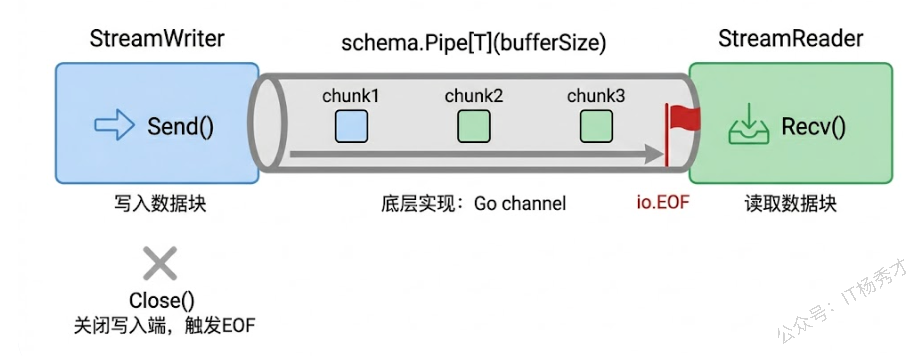
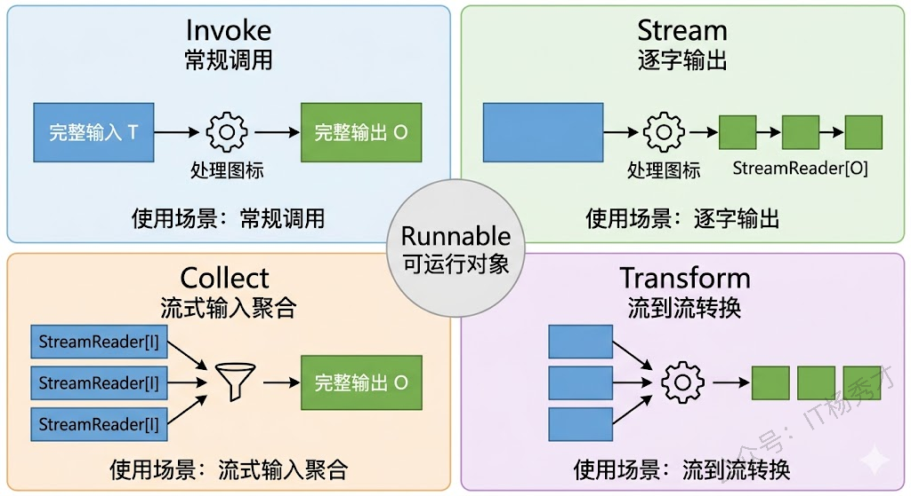
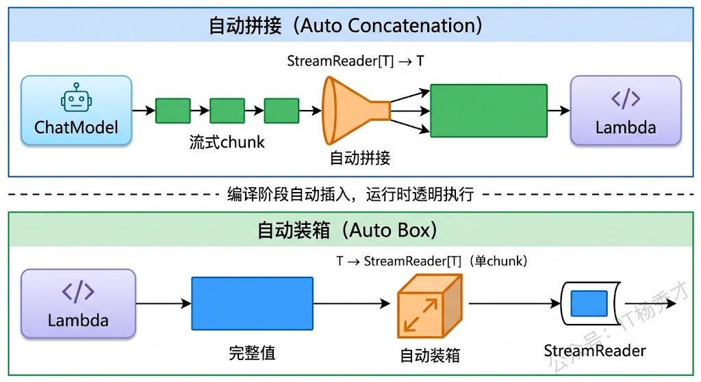
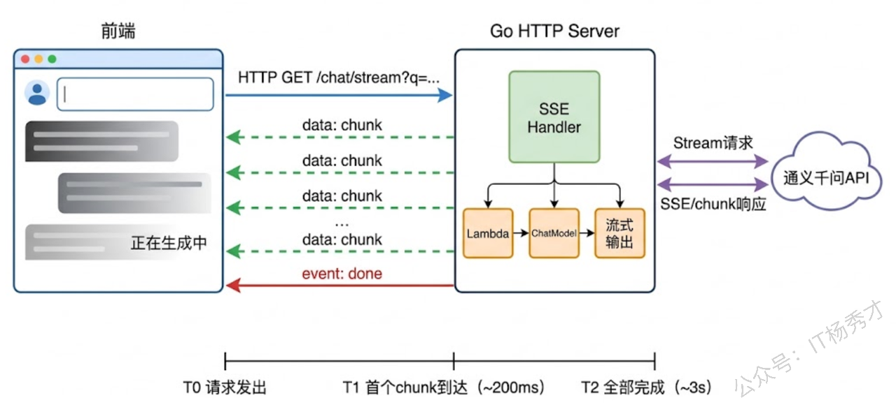
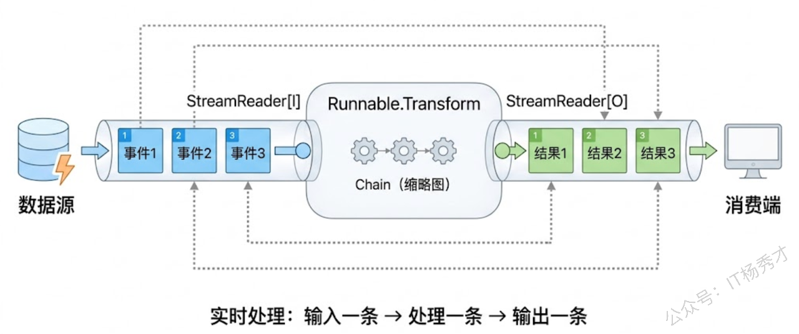

用过 ChatGPT 或通义千问的人都知道，大模型的回答不是一次性蹦出来的，而是一个字一个字地"打"出来。这种逐字输出的体验叫做流式输出（Streaming），它背后的技术原理很简单：模型每生成一个 Token 就立刻发送给客户端，而不是等所有 Token 都生成完了才一起返回。流式输出的好处很明显——用户不需要干等好几秒才看到回复，而是几乎立刻就能看到内容开始出现，体验好了不止一个档次。

但流式处理不只是"调个 Stream 方法"这么简单。在 Eino 的编排系统中，一条 Chain 或 Graph 里可能有好几个节点，有的节点支持流式输出（比如 ChatModel），有的节点根本不产生流（比如一个普通的 Lambda 函数）。当这些节点被串在一起时，流式数据怎么在它们之间传递？一个需要完整输入的节点接到了流式数据怎么办？Eino 的编排系统在底层帮你解决了这些问题，但你得搞清楚它的机制，才能在遇到问题时不抓瞎。

## **1. StreamReader 与 StreamWriter**

Eino 的流式系统建立在一对核心类型上：`schema.StreamReader` 和 `schema.StreamWriter`。它们的关系就像 Go 标准库里的 `io.Reader` 和 `io.Writer`——一端写数据，一端读数据，通过一条管道连接起来。

创建这对管道的方式是调用 `schema.Pipe`：

```go
reader, writer := schema.Pipe[*schema.Message](1)
```

泛型参数指定管道中传输的数据类型，`Pipe` 的参数是缓冲区大小（和 Go channel 的 buffer 概念一样）。返回的 `reader` 用来读取数据，`writer` 用来写入数据。

`StreamWriter` 有两个核心方法：`Send` 用来往管道里写一个数据块，`Close` 用来关闭管道表示数据写完了。`StreamReader` 也有两个核心方法：`Recv` 用来从管道里读一个数据块，`Close` 用来提前关闭管道（表示不再消费数据了）。当 Writer 已经 Close 且管道里的数据都被读完时，`Recv` 会返回 `io.EOF`，这就是读取结束的信号。

来看一个最基础的例子，手动创建一个流并消费它：

```go
package main

import (
        "errors"
        "fmt"
        "io"

        "github.com/cloudwego/eino/schema"
)

func main() {
        // 创建一个缓冲区为 2 的消息流管道
        reader, writer := schema.Pipe[*schema.Message](2)

        // 在 goroutine 中异步写入数据
        go func() {
                defer writer.Close()
                writer.Send(schema.AssistantMessage("Go语言", nil), nil)
                writer.Send(schema.AssistantMessage("是一门", nil), nil)
                writer.Send(schema.AssistantMessage("高效的", nil), nil)
                writer.Send(schema.AssistantMessage("编程语言。", nil), nil)
        }()

        // 在主 goroutine 中消费流
        for {
                chunk, err := reader.Recv()
                if errors.Is(err, io.EOF) {
                        fmt.Println("\n流读取完毕")
                        break
                }
                if err != nil {
                        fmt.Printf("读取错误: %v\n", err)
                        break
                }
                fmt.Print(chunk.Content)
        }
        reader.Close()
}
```

运行结果：

```plain&#x20;text
Go语言是一门高效的编程语言。
流读取完毕
```

这段代码的模式在后面会反复出现：一个 goroutine 负责写入，另一端负责读取，读到 `io.EOF` 就结束。需要注意的是，`writer.Close()` 必须被调用，否则读取端会一直阻塞等待更多数据，永远收不到 `io.EOF`。习惯上用 `defer writer.Close()` 放在写入 goroutine 的开头，防止因为 panic 等意外情况导致管道没有正确关闭。



## **2. 四种运行范式**

前面几篇文章里，我们一直用 `Invoke` 来运行编译好的 Chain 或 Graph——传入完整的输入，得到完整的输出。但 Eino 编译后的 `Runnable` 其实提供了四种运行方式，它们的区别在于输入和输出是否为流式：

```go
type Runnable[I, O any] interface {
    Invoke(ctx context.Context, input I, opts ...Option) (O, error)
    Stream(ctx context.Context, input I, opts ...Option) (*schema.StreamReader[O], error)
    Collect(ctx context.Context, input *schema.StreamReader[I], opts ...Option) (O, error)
    Transform(ctx context.Context, input *schema.StreamReader[I], opts ...Option) (*schema.StreamReader[O], error)
}
```

`Invoke` 是最常见的——完整输入，完整输出。`Stream` 是流式输出的核心——传入完整输入，得到一个 `StreamReader`，可以逐块读取输出。`Collect` 是 Stream 的反面——传入流式输入，得到完整输出（框架自动帮你把流拼接成完整数据）。`Transform` 则是两端都是流——流式输入，流式输出。



日常开发中用得最多的就是 `Invoke` 和 `Stream`。`Collect` 和 `Transform` 在需要处理流式输入的场景中会用到，比如你自己写了一个接收流式数据的服务，想把这些流式数据喂给编排图处理。

来看 `Stream` 的实际用法——让模型流式输出回答：

```go
package main

import (
        "context"
        "errors"
        "fmt"
        "io"
        "log"
        "os"

        "github.com/cloudwego/eino-ext/components/model/openai"
        "github.com/cloudwego/eino/compose"
        "github.com/cloudwego/eino/schema"
)

func main() {
        ctx := context.Background()

        // 创建模型
        chatModel, err := openai.NewChatModel(ctx, &openai.ChatModelConfig{
                BaseURL: "https://dashscope.aliyuncs.com/compatible-mode/v1",
                APIKey:  os.Getenv("DASHSCOPE_API_KEY"),
                Model:   "qwen-plus",
        })
        if err != nil {
                log.Fatal(err)
        }

        // 构建 Chain
        chain := compose.NewChain[string, *schema.Message]()
        chain.AppendLambda(compose.InvokableLambda(func(ctx context.Context, input string) ([]*schema.Message, error) {
                return []*schema.Message{
                        schema.SystemMessage("你是一个Go语言专家，回答详细且有条理。"),
                        schema.UserMessage(input),
                }, nil
        }), compose.WithNodeName("消息构建"))
        chain.AppendChatModel(chatModel, compose.WithNodeName("通义千问"))

        runnable, err := chain.Compile(ctx)
        if err != nil {
                log.Fatal(err)
        }

        // 使用 Stream 方法获取流式输出
        stream, err := runnable.Stream(ctx, "用三句话介绍Go语言的并发模型")
        if err != nil {
                log.Fatal(err)
        }
        defer stream.Close()

        fmt.Print("模型回复: ")
        for {
                chunk, err := stream.Recv()
                if errors.Is(err, io.EOF) {
                        break
                }
                if err != nil {
                        log.Fatal(err)
                }
                // 每收到一个chunk立刻打印，实现逐字输出效果
                fmt.Print(chunk.Content)
        }
        fmt.Println()
}
```

运行结果（逐字打印，这里用文字模拟效果）：

```shell
模型回复: Go语言的并发模型基于**CSP（Communicating Sequential Processes）理论**，强调“通过通信共享内存”，而非通过共享内存来通信，这从根本上避免了传统多线程中因锁竞争导致的复杂同步问题。  
其核心抽象是**goroutine**（轻量级用户态线程）和**channel**（类型安全的通信管道），goroutine由Go运行时高效调度（M:N调度），启动开销极小（初始栈仅2KB），可轻松创建数十万级并发任务。  
此外，Go提供`select`语句原生支持多channel的非阻塞/超时通信，配合`context`包实现优雅的并发控制（如取消、超时、截止时间），使高并发程序既简洁又健壮。
```

代码逻辑很直接：把 `runnable.Invoke(...)` 换成 `runnable.Stream(...)`，返回值从完整的结果变成了 `*schema.StreamReader[*schema.Message]`，然后在 for 循环里不断 `Recv` 直到 `io.EOF`。每收到一个 chunk 就立刻打印它的 `Content`，用户看到的效果就是文字一块一块地蹦出来。

## **3. Stream的自动拼接与拆分**

在编排图中，节点之间的数据流转可能会遇到"类型不匹配"的情况。比如上游是一个 ChatModel，它的 Stream 模式输出的是 `StreamReader[*schema.Message]`——一个流；但下游是一个普通的 Lambda 函数，它的输入参数类型是 `*schema.Message`——一个完整的值。流式数据怎么喂给一个期望完整数据的函数？

Eino 在编译阶段会自动检测这种类型差异，并在需要时插入转换逻辑。这就是`Stream`的**自动拼接（Auto Concatenation）**——当下游节点需要完整数据，但上游输出是流时，框架自动把流中的所有 chunk 拼接成一个完整值，再传给下游。

反过来也有类似的机制。如果上游输出的是完整数据，但编排图以 `Stream` 模式运行，框架会自动把完整数据包装成一个只有一个 chunk 的流，继续往下传递。这叫**自动装箱（Auto Box）**。

来看一个具体例子——在 ChatModel 后面接一个普通 Lambda，这个 Lambda 接收完整的 `*schema.Message` 而不是Stream：

```go
package main

import (
        "context"
        "errors"
        "fmt"
        "io"
        "log"
        "os"

        "github.com/cloudwego/eino-ext/components/model/openai"
        "github.com/cloudwego/eino/compose"
        "github.com/cloudwego/eino/schema"
)

func main() {
        ctx := context.Background()

        chatModel, err := openai.NewChatModel(ctx, &openai.ChatModelConfig{
                BaseURL: "https://dashscope.aliyuncs.com/compatible-mode/v1",
                APIKey:  os.Getenv("DASHSCOPE_API_KEY"),
                Model:   "qwen-plus",
        })
        if err != nil {
                log.Fatal(err)
        }

        // 构建 Chain：消息构建 → 模型调用 → 后处理（普通Lambda）
        chain := compose.NewChain[string, string]()

        // 第一个节点：构建消息
        chain.AppendLambda(compose.InvokableLambda(func(ctx context.Context, input string) ([]*schema.Message, error) {
                return []*schema.Message{
                        schema.SystemMessage("你是一个翻译助手，将中文翻译成英文，只输出翻译结果。"),
                        schema.UserMessage(input),
                }, nil
        }), compose.WithNodeName("消息构建"))

        // 第二个节点：模型调用（Stream模式下输出是流）
        chain.AppendChatModel(chatModel, compose.WithNodeName("翻译模型"))

        // 第三个节点：普通Lambda，输入是完整的 *schema.Message
        // 当用 Stream 运行时，框架会自动把模型的流式输出拼接成完整消息，再传给这个Lambda
        chain.AppendLambda(compose.InvokableLambda(func(ctx context.Context, msg *schema.Message) (string, error) {
                return fmt.Sprintf("翻译结果（共%d个字符）: %s", len(msg.Content), msg.Content), nil
        }), compose.WithNodeName("格式化输出"))

        runnable, err := chain.Compile(ctx)
        if err != nil {
                log.Fatal(err)
        }

        // 用 Invoke 调用——一切正常，没有流的问题
        fmt.Println("=== Invoke 模式 ===")
        result, err := runnable.Invoke(ctx, "Go语言是世界上最好的语言")
        if err != nil {
                log.Fatal(err)
        }
        fmt.Println(result)

        // 用 Stream 调用——模型会流式输出，但后面的Lambda需要完整输入
        // Eino 自动在模型和Lambda之间插入拼接逻辑
        fmt.Println("\n=== Stream 模式 ===")
        stream, err := runnable.Stream(ctx, "并发是Go语言的核心优势")
        if err != nil {
                log.Fatal(err)
        }
        defer stream.Close()

        for {
                chunk, err := stream.Recv()
                if errors.Is(err, io.EOF) {
                        break
                }
                if err != nil {
                        log.Fatal(err)
                }
                fmt.Print(chunk)
        }
        fmt.Println()
}
```

运行结果：

```plain&#x20;text
=== Invoke 模式 ===
翻译结果（共49个字符）: Go is the best programming language in the world.

=== Stream 模式 ===
翻译结果（共36个字符）: Concurrency is Go’s core strength.
```

注意 Stream 模式下，虽然模型在内部是流式生成翻译结果的，但"格式化输出"这个 Lambda 依然拿到了完整的翻译文本——因为 Eino 在中间自动做了拼接。Stream 模式的最终输出是 string 类型的流，由于 Lambda 产出的是一个完整 string，框架会自动把它包装成一个只有一个 chunk 的流，所以 for 循环里只会收到一个 chunk 就结束了。



Eino 对 `*schema.Message` 类型内置了拼接逻辑（把多个 chunk 的 Content 拼起来，ToolCalls 合并等）。如果你的自定义类型也需要在流中使用，可以通过 `compose.RegisterStreamChunkConcatFunc` 注册自定义的拼接函数：

```go
type MyOutput struct {
    Text  string
    Score float64
}

func init() {
    compose.RegisterStreamChunkConcatFunc(func(chunks []*MyOutput) (*MyOutput, error) {
        result := &MyOutput{}
        for _, chunk := range chunks {
            result.Text += chunk.Text
            result.Score = chunk.Score // 取最后一个chunk的分数
        }
        return result, nil
    })
}
```

注册之后，当编排图中某个节点输出 `StreamReader[*MyOutput]` 而下游需要 `*MyOutput` 时，Eino 就知道怎么把流拼接成完整值了。

## **4. Graph 中的流式编排**

Chain 的流式处理比较自动化——节点是线性串联的，框架很容易判断在哪里需要拼接或装箱。但在 Graph 中，数据流向更复杂（有分支、有并行），流式处理的能力也更强大。

来看一个实际场景：构建一个"翻译+摘要"并行处理的 Graph，输入一段文字，同时翻译成英文和生成中文摘要，最后把两个结果合并输出。用 Stream 模式运行时，我们可以逐步看到两个分支的处理结果。

```go
package main

import (
    "context"
    "errors"
    "fmt"
    "io"
    "log"
    "os"

    "github.com/cloudwego/eino-ext/components/model/openai"
    "github.com/cloudwego/eino/compose"
    "github.com/cloudwego/eino/schema"
)

func main() {
    ctx := context.Background()

    chatModel, err := openai.NewChatModel(ctx, &openai.ChatModelConfig{
       BaseURL: "https://dashscope.aliyuncs.com/compatible-mode/v1",
       APIKey:  os.Getenv("DASHSCOPE_API_KEY"),
       Model:   "qwen-plus",
    })
    if err != nil {
       log.Fatal(err)
    }

    // 构建 Graph（输入 string，输出 map[string]any 汇聚两个分支结果）
    g := compose.NewGraph[string, map[string]any]()

    // 节点1：构建翻译消息
    _ = g.AddLambdaNode("build_translate_msg",
       compose.InvokableLambda(func(ctx context.Context, input string) ([]*schema.Message, error) {
          return []*schema.Message{
             schema.SystemMessage("将以下中文翻译成英文，只输出翻译结果："),
             schema.UserMessage(input),
          }, nil
       }),
       compose.WithNodeName("翻译消息构建"),
    )

    // 节点2：构建摘要消息
    _ = g.AddLambdaNode("build_summary_msg",
       compose.InvokableLambda(func(ctx context.Context, input string) ([]*schema.Message, error) {
          return []*schema.Message{
             schema.SystemMessage("用一句话概括以下内容的核心观点："),
             schema.UserMessage(input),
          }, nil
       }),
       compose.WithNodeName("摘要消息构建"),
    )

    // 节点3：翻译模型
    _ = g.AddChatModelNode("translate_model", chatModel,
       compose.WithNodeName("翻译模型"),
    )

    // 节点4：摘要模型
    _ = g.AddChatModelNode("summary_model", chatModel,
       compose.WithNodeName("摘要模型"),
    )

    // 节点5：提取翻译结果，使用 WithOutputKey 将输出写入 map 的 "translate" key
    _ = g.AddLambdaNode("extract_translate",
       compose.InvokableLambda(func(ctx context.Context, msg *schema.Message) (string, error) {
          return msg.Content, nil
       }),
       compose.WithNodeName("提取翻译"),
       compose.WithOutputKey("translate"),
    )

    // 节点6：提取摘要结果，使用 WithOutputKey 将输出写入 map 的 "summary" key
    _ = g.AddLambdaNode("extract_summary",
       compose.InvokableLambda(func(ctx context.Context, msg *schema.Message) (string, error) {
          return msg.Content, nil
       }),
       compose.WithNodeName("提取摘要"),
       compose.WithOutputKey("summary"),
    )

    // 连接边：START 同时连到两个消息构建节点（并行分支）
    _ = g.AddEdge(compose.START, "build_translate_msg")
    _ = g.AddEdge(compose.START, "build_summary_msg")
    _ = g.AddEdge("build_translate_msg", "translate_model")
    _ = g.AddEdge("build_summary_msg", "summary_model")
    _ = g.AddEdge("translate_model", "extract_translate")
    _ = g.AddEdge("summary_model", "extract_summary")
    // 两个分支各自直接连到 END，通过 OutputKey 自动汇聚到 map[string]any
    _ = g.AddEdge("extract_translate", compose.END)
    _ = g.AddEdge("extract_summary", compose.END)

    runnable, err := g.Compile(ctx)
    if err != nil {
       log.Fatal(err)
    }

    input := "Go语言通过goroutine和channel实现了优雅的并发模型，它让开发者不需要直接操作线程和锁，就能写出高性能的并发程序。"

    // 使用 Invoke 同步调用
    fmt.Println("=== Invoke 模式 ===")
    result, err := runnable.Invoke(ctx, input)
    if err != nil {
       log.Fatal(err)
    }
    translate, _ := result["translate"].(string)
    summary, _ := result["summary"].(string)
    fmt.Printf("📝 英文翻译:\n%s\n\n📌 中文摘要:\n%s\n", translate, summary)

    // 使用 Stream 流式调用
    fmt.Println("\n=== Stream 模式 ===")
    stream, err := runnable.Stream(ctx, input)
    if err != nil {
       log.Fatal(err)
    }
    defer stream.Close()

    for {
       chunk, err := stream.Recv()
       if errors.Is(err, io.EOF) {
          break
       }
       if err != nil {
          log.Fatal(err)
       }
       for key, val := range chunk {
          fmt.Printf("[%s] %v", key, val)
       }
    }
    fmt.Println()
}
```

运行结果：

```plain&#x20;text
=== Invoke 模式 ===
📝 英文翻译:
Go implements an elegant concurrency model through goroutines and channels, enabling developers to write high-performance concurrent programs without directly managing threads and locks.

📌 中文摘要:
Go语言通过轻量级的goroutine和基于通信的channel机制，提供了一种简洁、安全、高效的并发编程模型，避免了传统线程与锁带来的复杂性与风险。

=== Stream 模式 ===
[translate] Go implements an elegant concurrency model through goroutines and channels, enabling developers to write high-performance concurrent programs without directly managing threads and locks.[summary] Go语言通过轻量级的goroutine和基于通信的channel机制，提供了一种简洁、安全且高效的并发编程模型，避免了传统线程与锁带来的复杂性与风险。
```

&#x20;这个 Graph 中有一个有趣的点：两个并行分支通过 WithOutputKey 各自声明了输出的 key（"translate" 和 "summary"），然后直接连到 END 节点，框架会自动将两个分支的结果汇聚到一个 map\[string]any

&#x20; 中——不需要手写任何合并逻辑。如果是 Stream 模式运行，两个分支的模型调用是并行且独立流式的，每个分支的 chunk 到达时会立即携带对应的 key推送给你，你可以实时看到两个分支各自的输出进度。整个过程对你是透明的——你只需要用 WithOutputKey 声明每个分支的标识，fan-in 汇聚和流式调度的细节交给框架搞定。       &#x20;

## **5. SSE 实时推送**

在实际的 Web 应用中，流式输出通常通过 SSE（Server-Sent Events）协议推送给前端。SSE 是 HTTP 协议之上的一种标准，服务端可以持续地向客户端发送事件流，非常适合大模型的逐字输出场景。

下面这个例子把 Eino 的流式输出和 Go 标准库的 `net/http` 结合起来，搭建一个支持 SSE 的 HTTP 接口：

```go
package main

import (
        "context"
        "errors"
        "fmt"
        "io"
        "log"
        "net/http"
        "os"

        "github.com/cloudwego/eino-ext/components/model/openai"
        "github.com/cloudwego/eino/compose"
        "github.com/cloudwego/eino/schema"
)

var runnable compose.Runnable[string, *schema.Message]

func init() {
        ctx := context.Background()

        chatModel, err := openai.NewChatModel(ctx, &openai.ChatModelConfig{
                BaseURL: "https://dashscope.aliyuncs.com/compatible-mode/v1",
                APIKey:  os.Getenv("DASHSCOPE_API_KEY"),
                Model:   "qwen-plus",
        })
        if err != nil {
                log.Fatal(err)
        }

        chain := compose.NewChain[string, *schema.Message]()
        chain.AppendLambda(compose.InvokableLambda(func(ctx context.Context, input string) ([]*schema.Message, error) {
                return []*schema.Message{
                        schema.SystemMessage("你是一个专业的Go语言助手。"),
                        schema.UserMessage(input),
                }, nil
        }))
        chain.AppendChatModel(chatModel)

        runnable, err = chain.Compile(ctx)
        if err != nil {
                log.Fatal(err)
        }
}

func sseHandler(w http.ResponseWriter, r *http.Request) {
        question := r.URL.Query().Get("q")
        if question == "" {
                http.Error(w, "缺少参数 q", http.StatusBadRequest)
                return
        }

        // 设置 SSE 响应头
        w.Header().Set("Content-Type", "text/event-stream")
        w.Header().Set("Cache-Control", "no-cache")
        w.Header().Set("Connection", "keep-alive")
        w.Header().Set("Access-Control-Allow-Origin", "*")

        flusher, ok := w.(http.Flusher)
        if !ok {
                http.Error(w, "不支持流式响应", http.StatusInternalServerError)
                return
        }

        // 调用 Stream 获取流式输出
        stream, err := runnable.Stream(r.Context(), question)
        if err != nil {
                fmt.Fprintf(w, "event: error\ndata: %s\n\n", err.Error())
                flusher.Flush()
                return
        }
        defer stream.Close()

        for {
                chunk, err := stream.Recv()
                if errors.Is(err, io.EOF) {
                        // 发送结束事件
                        fmt.Fprintf(w, "event: done\ndata: [DONE]\n\n")
                        flusher.Flush()
                        break
                }
                if err != nil {
                        fmt.Fprintf(w, "event: error\ndata: %s\n\n", err.Error())
                        flusher.Flush()
                        break
                }

                if chunk.Content != "" {
                        // 发送数据事件
                        fmt.Fprintf(w, "data: %s\n\n", chunk.Content)
                        flusher.Flush()
                }
        }
}

func main() {
        http.HandleFunc("/chat/stream", sseHandler)

        fmt.Println("SSE服务启动，监听 :8080")
        fmt.Println("测试: curl 'http://localhost:8080/chat/stream?q=什么是goroutine'")
        log.Fatal(http.ListenAndServe(":8080", nil))
}
```

启动服务后，用 curl 测试：

```bash
curl -N 'http://localhost:8080/chat/stream?q=什么是goroutine'
```

输出（逐条事件推送）：

```plain&#x20;text
data: Goroutine

data: 是Go

data: 语言中的

data: 轻量级

data: 线程

data: ，由Go

data: 运行时

data: 管理

data: ...

event: done
data: [DONE]
```

这段代码有几个 SSE 相关的关键点值得说一下。首先是响应头设置：`Content-Type: text/event-stream` 告诉客户端这是一个 SSE 流，`Cache-Control: no-cache` 防止浏览器缓存事件流。其次是 `http.Flusher` 接口——Go 的 `http.ResponseWriter` 默认会缓冲输出，你必须在每次写入后调用 `flusher.Flush()` 强制把数据推送到客户端，否则客户端会等到整个响应结束才收到所有数据，那就失去了流式输出的意义。



前端消费这个 SSE 接口也很简单，用浏览器原生的 `EventSource` API 就行：

```javascript
const source = new EventSource('/chat/stream?q=什么是goroutine');

source.onmessage = (event) => {
    // 逐字追加到页面
    document.getElementById('output').textContent += event.data;
};

source.addEventListener('done', () => {
    source.close();
});

source.addEventListener('error', (event) => {
    console.error('SSE错误:', event);
    source.close();
});
```

## **6. Transform 双向流式处理**

前面提到的 `Transform` 是四种范式中最灵活的——流式输入、流式输出。虽然在大模型应用中用得不如 `Stream` 频繁，但在某些场景下它非常有用。比如你有一个持续产生消息的数据源，想把这些消息实时地喂给编排图处理，处理结果也实时地流出来。

```go
package main

import (
        "context"
        "errors"
        "fmt"
        "io"
        "log"
        "time"

        "github.com/cloudwego/eino/compose"
        "github.com/cloudwego/eino/schema"
)

func main() {
        ctx := context.Background()

        // 构建一条简单的处理 Chain：接收字符串，输出处理后的字符串
        chain := compose.NewChain[string, string]()
        chain.AppendLambda(compose.InvokableLambda(func(ctx context.Context, input string) (string, error) {
                // 模拟处理逻辑：加上时间戳前缀
                return fmt.Sprintf("[%s] 已处理: %s", time.Now().Format("15:04:05"), input), nil
        }), compose.WithNodeName("消息处理器"))

        runnable, err := chain.Compile(ctx)
        if err != nil {
                log.Fatal(err)
        }

        // 创建输入流
        inputReader, inputWriter := schema.Pipe[string](3)

        // 模拟数据源：异步产生数据
        go func() {
                defer inputWriter.Close()
                messages := []string{"用户登录成功", "下单请求到达", "支付回调完成"}
                for _, msg := range messages {
                        time.Sleep(500 * time.Millisecond) // 模拟间隔到达的事件
                        inputWriter.Send(msg, nil)
                        fmt.Printf("→ 发送: %s\n", msg)
                }
        }()

        // 使用 Transform 进行流到流的处理
        outputStream, err := runnable.Transform(ctx, inputReader)
        if err != nil {
                log.Fatal(err)
        }
        defer outputStream.Close()

        // 消费输出流
        for {
                result, err := outputStream.Recv()
                if errors.Is(err, io.EOF) {
                        fmt.Println("\n所有事件处理完毕")
                        break
                }
                if err != nil {
                        log.Fatal(err)
                }
                fmt.Printf("← 结果: %s\n", result)
        }
}
```

运行结果：

```plain&#x20;text
→ 发送: 用户登录成功
→ 发送: 下单请求到达
→ 发送: 支付回调完成
← 结果: [19:00:52] 已处理: 用户登录成功下单请求到达支付回调完成

所有事件处理完毕
```

`Transform` 在这里扮演了一个"流式管道处理器"的角色：数据从输入流一条一条进来，每条经过 Chain 处理后立刻从输出流出去。输入流关闭（`inputWriter.Close()`）后，所有数据处理完毕，输出流也会以 `io.EOF` 结束。



## **7. 小结**

流式处理在大模型应用中不是一个可选项，而是用户体验的刚需。没有人愿意对着一个空白页面干等三五秒，而流式输出能让第一个字在几百毫秒内就出现在屏幕上。Eino 把流式处理这件原本有些复杂的事情做得相当透明——你在编排图中混用流式节点和非流式节点时，框架在编译阶段就帮你处理好了类型转换，运行时只需要把 `Invoke` 换成 `Stream` 就能拿到流式输出。理解了 `StreamReader`/`StreamWriter` 这对管道、四种运行范式的区别、以及自动拼接和装箱的机制之后，你基本上就能在 Eino 中自如地处理各种流式场景了。

<div style="background-color: #f0f9eb; padding: 10px 15px; border-radius: 4px; border-left: 5px solid #67c23a; margin: 20px 0; color:rgb(64, 147, 255);">

<span style="color: #006400; font-size: 28px;"><strong>关注秀才公众号：</strong></span><span style="color: red; font-size: 28px;"><strong>IT杨秀才</strong></span><span style="color: #006400; font-size: 28px;"><strong>，回复：</strong></span><span style="color: red; font-size: 28px;"><strong>面试</strong></span>

<div style="text-align: center;"><span style="color: #006400; font-size: 28px;"><strong>领取后端/AI面试题库PDF</strong></span></div>


</div> 